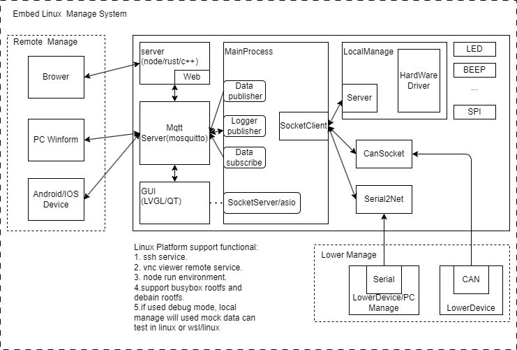

# 背景

&emsp;&emsp;嵌入式linux的入门来说，前期给我最大感觉是杂乱，从linux环境开发，编译工具，脚本指令，使用何种接口进行驱动开发，各种接口进行应用开发。都是参考教程机械的进行操作和命令，没有任何详细的说明来介绍为什么这么做，如果直接成功还好，如果失败了，往往不知所措，挫败感十足.<br />
&emsp;&emsp;不知道多少人有这种经历，下载了项目或者开源代码，按照文档流程却经常发生编译失败，如果会分析错误原因，去安装或者编译依赖环境还好，但这对刚入门的新人来说可以说十分困难。假如想编译实现开发平台还未支持的应用或功能，发生缺少依赖的情况经常发生，我也是在遇到这种编译失败，搜索解决办法，积累总结记录的过程中才有了自己的一套经验，这里正是要梳理这些经验，形成方法，方便后续查找和提高。<br />
&emsp;&emsp;嵌入式linux开发说到底也是一门实用的技术，因此如何结合应用去学习和应用才是最重要的，项目地址如下.<br />
```bash
git clone https://github.com/zc110747/remote_manage.git
```
&emsp;&emsp;本系列主要结合我的经验，讲述一个嵌入式linux的项目包含平台从无到有的构建过程，以及其中涉及的知识点，也是我对自身开发经历的总结，可能有些纰漏或不合理的地方，也希望可以分享意见，共同提高.<br />

# 产品综述

&emsp;&emsp;对于涉及嵌入式linux开发应用的产品中，往往也不是只有一个嵌入式linux端设备, 可能还有协调了多块硬件板，作为嵌入式端的主控来共同构成功能，下面展示典型的嵌入式项目产品架构.<br />
```
PC客户端/web端/移动端 - 云端(可选) - 嵌入式linux端 - DSP/MCU/FPGA端
```
&emsp;&emsp;其中嵌入式linux开发部分主要实现以下功能(可选，并非全部都是).<br />

```bash
1. 支持稳定运行的系统平台，包含uboot，内核和文件系统的功能实现。
1. 用于支持本地应用执行的硬件驱动，库以及软件的开发和移植，如gpio, i2c, spi这类驱动.
2. 支持管理子设备(包含DSP，MCU，FPGA等)的应用实现，接口驱动、通讯协议，数据管理和应用实现.
3. 提供一套UI界面用于本地界面控制或者信息展示(QT, Android App应用).
4. 局域网访问和管理的服务器，包括不限于http, snmp协议支持.
5. 支持远程访问和管理的网络客户端，如mqtt subcribe/publisher, tcp客户端等
6. 支持linux运行和功能扩展的组件，如ssh, vnc，tftp等服务.
```
&emsp;&emsp;这里展示上面项目对应的一个嵌入式Linux的产品框架，包含完整的上述服务和实现。<br />
<br />
&emsp;&emsp;对于嵌入式linux开发人员来说，工作就可能涉及如下内容.<br />
```
1. 建立支持开发的环境
    包括不限于linux的安装，编译工具的支持(gcc, makefile), 相应库和工具的安装.

2. 实现稳定的嵌入式linux运行平台
    包括uboot，kernal和文件系统的完善支持，包含嵌入式linux系统的bringup工作，这里涉及设备树和驱动的修改，menuconfig配置，以及编译和下载的流程，这一步主要适配RAM，ROM, 内核，时钟频率以及必要串口的改动，高端的要适配pcie等接口，完成这一步就可以系统就可以正常运行，显示和打印输出.

3. 嵌入式linux驱动的开发
    实现产品运行需要支持硬件驱动，包括不限于i2c, spi, dcmi, rs485, can等，芯片厂商会提供芯片硬件访问的接口，开发者将其则与linux内核接口结合起来，实现嵌入式linux驱动模块.
    
4. 嵌入式linux应用开发
    嵌入式linux应用开发可以理解为支持硬件接口访问的linux应用开发，如果实现相应的库和运行环境，可以支持使用c/c++, python，node，rust，lua，Android/Java, QT/C++等进行开发，如果是Ubuntu，Debian或Android系统，则基本和linux开发一致.不过语言只是手段，在之上构建的包含网络，UI，数据管理，子系统管理，调试和日志接口才是应用开发的的重点，这里面一部分需要自己实现，另一部分可以由开源的代码以源码或者库的方式参与，选择合适的平台和代码组合，以大幅度提升效率的.
```

# linux平台开发环境构建

&emsp;&emsp;对于嵌入式linux来说，项目的开发环境是在芯片选型完成后就确定的，芯片厂商一般会选择某款开发板作为原型demo板(工业板卡厂商也会提供类似的开发板)，这时候编译环境是很少需要修改的，这些开发板也会提供相应的虚拟机文件，例如国内比较流行学习平台的如韦东山，正点原子，工业界的有飞凌嵌入式等。还甚至一些厂商会直接提供配置或者编译好的Uboot，Kernal和Rootfs，开箱即用，这种情况只要嵌入式linux应用开发即可，例如树莓派，香橙派这一类，可以直接当卡片电脑使用，系统使用Debain/Ubuntu/Android, 对于硬件的操作也封装成python的接口，可以像linux一样使用。<br />
&emsp;&emsp;在嵌入式系统学习的过程中，这是第一个门槛，**这里不建议入门过程中在开发环境构建以及bringup花费大量时间**，不是说这些不重要，以我的经历来说，要完成这类工作，即使有了一定经验，还是会遇到各种各样的问题，也并不简单，如果上来从这部分开始，绝对感受不到嵌入式linux学习的趣味，过程中特别有挫败感，而且缺少一些积累，很容易钻牛角而不自知，最后浪费了大量时间，却没有得到好的效果, 开发环境的构建包含不限于如下知识点.<br />
```
1. 熟练使用shell命令和语法
2. 嵌入linux平台启动执行流程
3. 系统，软件配置文件的更新规则
4. 编译器，库和应用程序安装
```
&emsp;&emsp;如果没有一定的基础去修改是比较困难，如果错误的使用root权限去修改系统配置，是有几率导致系统功能失效，甚至直接崩溃无法启动，严重的还需要重新安装, 我在使用中也自己弄崩溃过几次虚拟机。<br />
&emsp;&emsp;作为开发者，虽然迟早要补足相关知识，**不过这部分不建议专门去学习**，并不是不重要，而是这部分很杂，没有任何教程覆盖到所有的内容，例如ssh，opencv，python，node，sqlite，tftp服务，每个软件都有一套自己的机制，单纯去学习意义不大，遇到问题，解决问题，并积累总结方法才是关键。从我开始自己构建开发环境时，遇到最多的就是编译缺少这种那种接口，执行时库版本过低，未安装工具或库的问题，每次遇到都要去搜索，安装，然后记录，如果是未安装导致的问题还好，用apt/apt-get命令安装即可，如果服务器没有支持的版本，那还要去github或者官网找到源码，编译后再以库的形式链接，本身一个软件的编译，往往涉及多个库的下载编译，这在开发环境构建中是常态，对于Shell，C语言我也还算熟练工了，这一步一步的查找也十分耗时耗力，有时还需要去芯片厂商论坛去查询解决，这些学习和工作的经验积累到如下文件里，更详细可以去查看。<br />
[how to build embed linux environment.md](./0.embed_linux_environment_build.md) <br />

# 支持linux芯片的BringUp启动

&emsp;&emsp;对于嵌入式SOC的bringup流程的掌握是嵌入式从入门到资深的必经之路，也是学习中最复杂困难的部分，如果上一节对于入门者还可以勉强上手，**那么这一节如果没有基础不要去深入学习**，可以了解有个概念，等有一定基础在过来补足。这部分学习不是难易的问题，而是需要很多前置的知识在后面能理解，是需要在驱动和应用开发中去掌握的，对于完整的实现芯片的bringup，列出需要掌握的知识(包括不限于)，如下所示。
```
1. Shell脚本编程
2. KConfig语法， menuconfig配置，
3. Makefile语法，make命令
3. linux驱动开发大部分知识，包含芯片外设接口，设备树，驱动接口等
4. Uboot框架和源码理解
5. linux框架和源码理解
6. 文件系统的知识理解
6. 至少熟练掌握嵌入式C语言开发
7. 有一定基于arm交叉编译平台的开发调试能力
```
&emsp;&emsp;这里从开发的难易程度和具体功能的实现两个维度分别说明对bringup的个人理解。<br />
&emsp;&emsp;对于开发来说，从易到难有三个层次。<br />
```
1. 基于确定芯片开发板或者工业板，移植应用平台的bringup。
2. 基于芯片厂商方案进行开发板级适配的bringup。
3. 基于uboot和内核的主干，移植适配特定芯片的bringup。
```
## 基于开发平台方案的bringup

&emsp;&emsp;基于开发平台的bringup是大部分产品级开发的时候面对的环境，使用稳定的工业板可以方便快速的开发，大部分情况可以不做修改，即使有新的硬件要求，使用自己的底板，只要在基础上增加或者裁剪相应的外设驱动就可以，需要运行环境如QT，Debain，各类lib库都已经支持，很多时候可以做到保姆级服务，开箱即用，甚至提供编译好的包可以直接烧录即可使用，主要工作是应用开发，进行少量或者不修改驱动即可实现目的。<br />
&emsp;&emsp;这类已经可以满足大部分环境的要求，大部分嵌入式linux的工作都是进行少量linux驱动的硬件适配，有稳定平台后，在其上做产品开发，而且方案商的开发板因为使用人员多，测试充分，对于工业板来说会更加稳定，一般小公司或者大公司内小团队因为没有足够的人员维护一套稳定的嵌入式平台环境，大都采用这种模式。<br />

## 基于芯片厂商方案的bringup

&emsp;&emsp;基于芯片厂商方案的bringup主要应对方案商或者各学习嵌入式平台, 以及嵌入式大厂才会这么做，在确定嵌入式芯片后，厂商会提供相应的编译工具，支持维护的uboot和kernel分支，以及基于官方开发板的一套系统方案。不过这类板子一般功能展示厂商主推的功能，所以I/O一般暴露较少，作为实际的工业板很多时候需要二次电路设计。
&emsp;&emsp;基于芯片厂商的方案，二次设计并根据硬件维护自己的配置项，提供打包的环境和烧录工具给上述产品开发客户。这部分国外的芯片厂商如NXP，TI做的比较好，官网都会提供相应的资料，即使个人用户也很方便去查找使用，国内厂商则基本只对商业用户服务，明明是应用方面的文档，性能也不如别人，不涉及机密，相当于在学习中设置壁垒，不知道设置这类护城河的目的何在。<br />
&emsp;&emsp;这类开发主要用于方案商，开发板平台以及部分大公司的专业团队，他们根据官方的uboot，kernel以及文件系统，自己设计一套硬件平台，并完成适配，然后以整机或者方案的模式提供给开发者，对于他们的工作，主要为修改硬件接口，设备树，裁剪和配置Uboot和linux来适配设计的硬件平台，此外也会移植一套上层文件系统如busybox, debain，uboot或者android，并提供支持上层应用的库或者应用，当然也会提供一些简单的例程用于演示，当然对于大公司，一般也会维护一套平台分支来保证设计稳定性和安全。<br />

## 基于uboot/linux/文件系统主干的芯片级bringup
&emsp;&emsp;这部分主要是芯片原厂的工作，需要在uboot和linux源码中增加芯片级的硬件支持，包括不限于存储，寄存器，硬件驱动接口，特殊模块如GPU，NPU驱动的支持，这部分工作伴随着芯片存在的整个周期进行迭代，也是芯片原厂中嵌入式开发主要的工作之一， 对于对于大部分嵌入式linux开发者来说不会遇到, 需要对芯片内核，设计框架，驱动，Uboot/linux内核有深入认知，而且从事这类工作的开发者，掌握的技术也远超这系列文章涉及到的知识点，因此这类工作相关的内容也不在本篇描述中。<br />

&emsp;&emsp;综上可知，如果是希望往嵌入式linux驱动方向发展，那么达到第二种水平就是必须的，第三种则看能否去原厂的机会在提高，对于嵌入式linux应用开发，只要满足第一种水平，能够简单的修改驱动能满足大部分的场景，一般能够在开发板基础上完成uboot，linux和文件系统的编译，完成大部分外设的修改，算入门，如果增加新的器件，如RS485, 摄像头，i2c接口的温度传感器，I/O扩展芯片，SPI扩展屏也能够实现驱动并正常工作，且能解决遇到的软硬件配合问题，那么以及可以应对大部分应用开发遇到的问题，下面则分别展示基于平台和芯片厂商方案的bringup， 具体的说明参考如下文档。<br />
[how to bringup the embeb linux system.md](./1.embed_linux_system_bringup.md) <br />

# linux系统的驱动开发
&emsp;&emsp;终于讲到驱动开发部分了，这部分是开发板厂商和方案厂商教学的特长，任意找市面上的一块开发板，这方面都可以有大量的资料，可以从字符型设备，