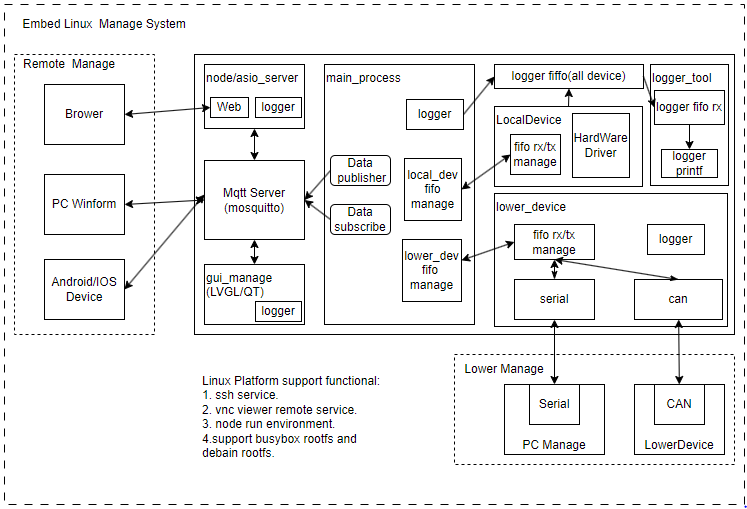

# 前言

嵌入式Linux产品开发是一门综合型的技术，由编译平台构建，执行平台移植，驱动开发，运行环境支持以及应用开发等部分组成。从无到有的完整构建一个项目是一个十分复杂的过程，需要长期的积累经验。本系列文章从实际项目出发，以上面的脉络流程为框架，讲解嵌入式Linux产品开发涉及的知识，不过因为个人水平限制，肯定有不足之处，如有发现，希望及时联系反馈(可联系微信sxc123456zc)。

- 应用开发

嵌入式Linux应用开发是实现具体电子产品的技术；配合硬件平台，通过软件来实现满足具体的功能需求的电子产品。除交叉编译，以及增加对底层硬件的访问外，嵌入式的应用开发和桌面端Linux开发基本保持一致。对于本身熟悉Linux桌面应用的开发者，入门简单，也很容易做出可展示的应用。应用开发的例程和资源很多，如Web服务，Qt UI设计，Mqtt网络应用服务，都有成熟的开源方案。应用端根据平台的支持情况也会有更多语言的选择，如C/C++/python/qt(C++)/nodejs等。体验上**入门学习相对简单，曲线平坦**，很适合用来体验嵌入式Linux开发的乐趣。

- 驱动开发

嵌入式Linux驱动开发的方向则繁杂和困难，按照从底层到内核，包含如下知识。

1. SOC的内部外设(GPIO，SPI，I2C，ETH/MII, USB等)
2. SOC的外部器件(Sensor, CMOS, NAND/NOR Flash，LCD等)
3. 设备统一模型(总线，设备，驱动接口)
4. U-Boot和Linux的驱动管理实现

上述每一部分都可以算难点，即使掌握了这些技术，大部分情况下也只能开发并不复杂的设备驱动；对于复杂的CMOS、CAN、ETH、HDMI、USB、PCIE这类驱动，只参考内核中实现，修改适配不同的器件都比较困难。大部分教程对于复杂驱动没有详细解释，驱动的学习需要深入分析Linux源码，理解执行流程，可以说是嵌入式驱动开发中最枯燥，困难的部分；唯一深入学习的方法就理解Linux源码，这方面的积累往往需要以年为单位，期望短时间内速成基本不可能，很容易从入门到放弃。

- 平台和应用构建

基于产品开发经验，从整体到局部来进行嵌入式Linux开发的讲解，是我在产品开发过程中的经验技术总结，整个系列也按照实际构建项目的流程实现，具体如下所示。

1. Linux开发平台搭建
2. 软件安装及交叉编译
3. shell脚本语法
4. makefile语法
5. U-Boot，kernel，文件系统编译构建
6. 驱动开发接口和实现
7. 嵌入式Linux应用接口和应用开发。

## 项目和说明

嵌入式Linux开发总体来说是服务产品的技术，无论学习什么知识，最终都要落实到具体的产品中，如何学以致用才是最重要的。本系列文档除了自带的测试目录，也有配合的开发项目同步进行实践，具体如下。

```shell
git clone https://github.com/zc110747/remote_manage.git
```

对于涉及嵌入式Linux开发应用的产品中，往往也不是单独的嵌入式Linux端设备, 可能还有协调了多个基于单片机或DSP开发的子系统，以及上层PC或服务器平台，下面展示典型的嵌入式项目产品架构。

- PC客户端/web端/移动端 - 云端(可选) - 嵌入式linux端 - DSP/MCU/FPGA端

其中嵌入式Linux开发部分主要实现以下功能(可选)。

1. 支持稳定运行的系统平台，包含U-Boot，内核和文件系统的功能实现
2. 用于支持本地应用执行的硬件驱动的开发，如gpio, i2c, spi，hdmi，net，rs485, can这类驱动
3. 用于支持本地应用执行库的移植，如libssl.so, libcrypto.so等
4. 提供本地调试或者客户端功能的第三方应用，如vnc, ssh等
5. 支持管理子设备(包含DSP，MCU，FPGA等)的应用实现，包含不限于:接口驱动、通讯协议，数据管理和应用
6. 提供一套UI界面用于本地界面控制或者信息展示(基于QT, LVGL, Android UI的应用)
7. 局域网访问和管理的服务器，包括不限于http, telnet, snmp协议支持
8. 支持远程访问和管理的网络客户端，如mqtt subcribe/publisher, tcp客户端等

这里显示一款基于嵌入式Linux构建的应用产品框架。



在现实中，一个完整的嵌入式产品的开发，主要涉及工作包含如下内容.

1. 建立支持开发的环境

    - 包括不限于Linux的安装，编译工具的支持(GCC, Makefile), 相应库和工具的安装，实现快速构建的脚本，当然官方一般都会提供SDK包进行管理，而本系列则是构建一个全新的SDK包进行产品管理。

2. 实现稳定的嵌入式linux运行平台

    - 包括U-Boot，kernel和文件系统的完善支持，包含嵌入式linux系统的Bringup工作，这里涉及设备树和驱动的修改，menuconfig配置，以及编译和下载的流程。这一步主要适配RAM、ROM、内核、时钟频率以及必要串口的改动，高端的要适配PCIE等接口，完成这一步系统就可以正常运行，显示和打印输出。

3. 嵌入式linux驱动的开发

    - 实现产品运行需要支持的硬件驱动，包括不限于I2C、SPI、RS485、CAN、触摸、USB等，芯片厂商会提供芯片硬件访问的接口，开发者则将其与Linux内核结合起来，实现嵌入式linux驱动开发。

4. 嵌入式linux应用开发

    - 应用开发则主要为支持硬件接口访问的Linux应用开发，移植相应的库和运行环境，可以支持使用c/c++, python，nodejs等进行开发。不过语言只是手段，在之上构建的包含网络、UI显示、数据管理、子系统管理、调试和日志接口才是应用开发的的重点。Linux应用开发主要包含自己实现部分和开源代码集成部分，如果能妥善的使用开源项目，可以大幅度提升开发效率。

本系列也按照上述大章节顺序去讲解。不过从学习的角度，按照此顺序去学习是比较困难的。例如第2章所需要的前置知识是需要在第1，3，4章去了解的。虽然学深入了，这4章节难度上不分上下。但从学习曲线来说，从易到难排列为**第1章=>第3章=>第4章=>第2章**。所以学习时也建议先从已经构建好的平台(如国产的各类开源派或开发板已经构建完整的系统)，从应用开始，可以快速体验Linux平台开发的乐趣，然后从驱动入手，再通过shell脚本，最终按照个人习惯构建自己的开发平台。

对于嵌入式Linux开发来说，另一个重要部分的就是选择合适的芯片来开始学习。开发环境是在芯片选型后确定的，开发立项后，一般会使用指定开发板作为项目验证原型板，从无到有完全构建全新的项目很少，特别是对于嵌入式Linux的复杂项目。目前工业板卡厂商，方案商和培训机构都会提供硬件原理图，编译开发环境，文档和技术支持服务，在此基础上可以大幅度提高开发效率。这里展示目前市面上我了解的提供完整嵌入式Linux软硬件方案商，主要有以下几类。

1. 培训教学机构，如韦东山，正点原子，野火，安富莱等。提供资料丰富，知识面广，而且资料开源做的很好，适合入门选择。缺点是资料更新一般很慢，有完整的SDK包后，很少有动力去更新适配最新的版本，适合希望入门或者刚入行的新人购买。
2. 专业的板卡方案商，如讯为，飞凌，米尔科技等。提供全套使用的方案，定制服务，不过提供资料往往会受限，不适合用于入门学习。但是平台一般都经过全套的认证，适合直接用于产品开发，一般作为公司的产品需求购买。
3. 芯片厂商的验证板，如NXP(I.MX6ull-evk), Ti(TMDSIDK574), 这一般叫做原型板。优点厂商会提供基于此硬件的全套平台方案(包含U-boot, Kernel和rootfs)，不过价格昂贵，且官方开发板展示的是厂商主推功能，不一定考虑应用的需求。另外非重要客户，如果遇到问题基本只能论坛等待解决；一般都是企业或者方案商按需购买，个人很少会采用。
4. 卡片电脑设备商，这一类以树莓派为代表，国内的有香橙派，核桃派等，特点是使用高性能的芯片(以多核Cortex-A53, Cortex-A72)为主，提供全套的系统安装包，应用集成python，g++等环境，可以以电脑的方式操作嵌入式硬件。开发简单，适合体验嵌入式应用开发，不过用于学习嵌入式Linux驱动的话资料较少，另外可靠性也很难保证，且性能往往过剩，不适合用于产品中。这类卡片可以用来学习适应Linux环境，折腾嵌入式应用开发，无论入门还是资深开发者都可以购买。

当然，如果有动手能力，也可以参考上述的硬件资料，自己设计开发板，不过这就属于嵌入式硬件，不属于本系列文档的说明的范畴。另外上述虽然提到了一些厂商，只是因为购买或了解过，并不表示认可，如果真有需求，建议还是进一步收集资料后再选择，毕竟花钱是一方面，浪费时间在不合适的平台上，事倍功半，反而得不偿失。

## next_chapter

[返回目录](./SUMMARY.md)

下面开始第1章节的学习:[构建Linux开发平台环境](./ch01-00.platform_env_struct.md)
