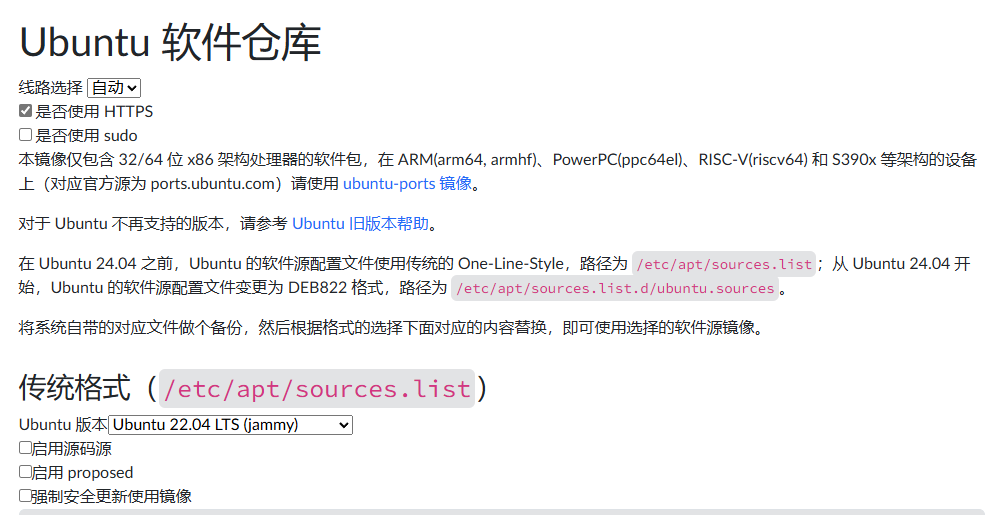

# Linux功能实现

- [创建apt私有源](#question-001)
- [脚本执行报错: -sh: /home/sys/shell/bringup_shell.sh: not found](#question-002)

## question-001

创建apt私有源的方法。

编译Linux环境下可运行程序，类似hello文件，打包package文件以及生成目录文件。

- 生成deb文件

```shell
# 创建package目录
mkdir package
cd package
mkdir -p usr/bin
mv ../hello usr/bin
mkdir DEBIAN

# 创建control文件
vi DEBIAN/control
####################################################
Package: private
Version: 1.0
Section: custom(代表软件类别）
Priority: optional
Architecture: all
Essential: no
Installed-Size: 1024
Maintainer: private.org
Description: Print test strings on the screen
####################################################

tree

#生成deb文件
cd ../
dpkg-deb --build package/ private.deb
```

- 生成gz文件

```shell
cd /var/www/html
mkdir debian

cp private.deb debian/
su root
sudo dpkg-scanpackages . | gzip -c9 > Packages.gz
```

- 通过浏览器访问即可，如下所示。



## question-002

脚本执行报错: -sh: /home/sys/shell/bringup_shell.sh: not found

发生报错问题，检查步骤。

1. 检查ls命令查看目录下是否有此文件，名称是否正确
2. 使用ls -alF命令，查看文件权限，是否可执行
3. 使用cat [file]命令，看文件头是否指定执行shell环境，shell环境不一致也会报该错误

## next_chapter

[返回目录](../README.md)

直接开始下一章节: [嵌入式Linux启动流程说明](./ch02-00.system_bringup.md)
