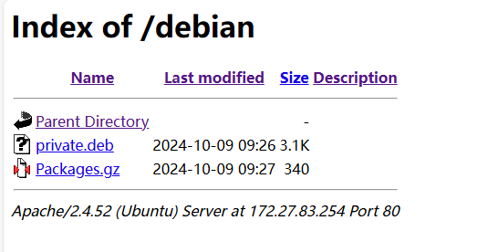

# Linux常见应用方法

[创建apt私有源](#apt_private_src)

## apt_private_src

编译Linux环境下可运行程序，类似hello文件，打包package文件以及生成目录文件。

- 生成deb文件

```shell
# 创建package目录
mkdir package
cd package
mkdir -p usr/bin
mv ../hello usr/bin
mkdir DEBIAN

# 创建control文件
vi DEBIAN/control
####################################################
Package: private
Version: 1.0
Section: custom(代表软件类别）
Priority: optional
Architecture: all
Essential: no
Installed-Size: 1024
Maintainer: private.org
Description: Print test strings on the screen
####################################################

tree

#生成deb文件
cd ../
dpkg-deb --build package/ private.deb
```

- 生成gz文件

```shell
cd /var/www/html
mkdir debian

cp private.deb debian/
su root
sudo dpkg-scanpackages . | gzip -c9 > Packages.gz
```

- 通过浏览器访问即可，如下所示。



## next_chapter

[返回目录](../README.md)

直接开始下一章节: [Linux系统启动实现](./ch02-00.system_bringup.md)
