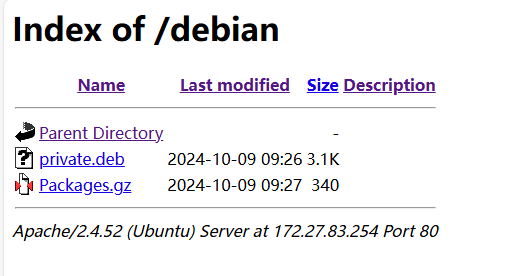

# Linux平台问题解决方法

在Linux平台使用过程中，经常遇到各类问题，这些问题按照类型分为命令执行问题，编译出错问题和系统运行问题；因为不同系统的权限，系统版本不同，软件和库支持的情况不同，导致遇到的问题往往各式各样，因此指望一篇总结能解决所有问题是不可能的，这里只是列出我在学习和开发中遇到的问题总结，目录如下。

- [编译相关问题](#featurelist-00)
  - [section mismatch in reference: platform_driver](#feature-00-01)
- [apt下载相关问题](#featurelist-01)
  - [No sandbox user "_apt" on the system](#feature-01-01)
  - [Couldn't create temporary file /tmp/apt.conf.SrjS4U for passing config to apt-key](#feature-01-02)
  - [Certificate verification failed: The certificate is NOT trusted.](#feature-01-03)
  - [Can't locate Term/ReadLine.pm in @INC](#feature-01-04)
  - [dpkg install shows haves been locked](#feature-01-05)
  - [dpkg: error processing package xxx (--configure)](#feature-01-06)
  - [Command 'python2' not found](#feature-01-07)
  - [/usr/bin/env: ‘python’: No such file or directory](#feature-01-08)
  - [after remove dock, apt-get warning about docker list](#feature-01-09)
  - [libc.so.6: version 'GLIBC_2.36' not found](#feature-01-10)
  - [Release file for (host) is not valid yet (invalid for another 12d 23h 18min 14s)](#feature-01-11)
  - [GPG error, (host) trusty Release: The following signatures couldn't be verified because the public key is not available](#feature-01-12)
  - [如何创建apt私有源](#feature-01-13)
  - [Could not get lock /var/lib/dpkg/lock - open](#feature-01-14)
  - [dpkg: error processing archive /var/cache/apt/archives/texlive-generic-recommended_2013.20140215-1_all.deb (--unpack)](#feature-01-15)
  - [/usr/bin/mandb: can't chmod /var/cache/man/CACHEDIR.TAG: Operation not permitted](#feature-01-16)
- [disk加载和卸载问题](#featurelist-02)
  - [umount dir: target is busy](#feature-02-01)
  - [mount: /dev/mmcblk1p1: can't read superblock](#feature-02-02)
- [网络相关问题](#featurelist-03)
  - [sudo: unable to resolve host DESKTOP-SO7SONV: Name or service not know](#feature-03-01)
  - [unable to use nfs with ubuntu22.04](#feature-03-02)
  - [ping the outer ipadress success, but outer host failed](#feature-03-03)
- [系统软件执行问题](#featurelist-04)
  - [sudo: /usr/bin/sudo must be owned by uid 0 and have the setuid bit set](#feature-04-01)
  - [bash run, with error shows "$'\r': command not found"](#feature-04-02)
  - [chroot run exe, show "no exec format"](#feature-04-03)
  - [-sh: /home/sys/shell/bringup_shell.sh: not found](#feature-04-04)
- [支持wsl2相关问题](#featurelist-05)
  - [free the wsl2 not used memory](#feature-05-01)
- [桌面相关问题](#featurelist-06)
  - [vnc Failed to execute default Terminal Emulator. Input/output error](#feature-06-01)
  - [编译安装最新版本的gcc工具](#feature-06-02)

## featurelist-00

### feature-00-01

feature报错: section mismatch in reference: platform_driver (section: .data)，wdt_probe (section: .init.text)

原因: 函数的前缀声明区域为init，实际为.data

解决办法: 去掉前缀init

## featurelist-01

### feature-01-01

feature报错: apt安装结束报错No sandbox user "_apt" on the system

原因: 一般出现在沙箱运行中，如docker或者chroot，系统不存在_apt用户，无法进行更新，可以手动添加。

解决办法

```shell
#增加_apt的组和用户名
groupadd -r _apt && useradd -r -g _apt _apt
```

### feature-01-02

feature报错: apt安装报错，Couldn't create temporary file /tmp/apt.conf.SrjS4U for passing config to apt-key

原因: 这种情况一般为/tmp权限不正确，特别时构建文件系统时。理论上/tmp权限需要为"drwxrwxrwx".

解决办法:

```shell
#/tmp目录权限不支持创建文件
sudo chmod 777 /tmp
```

### feature-01-03

feature报错: Certificate verification failed: The certificate is NOT trusted. The certificate featurer is unknown.  Could not handshake: Error in the certificate verification

原因: 当前的认证工具不被apt识别，可能是版本问题过低

解决办法:

不支持的认证环境，执行命令

```shell
apt-get install ca-certificates --reinstall
```

安装失败则去官网下载:<http://archive.ubuntu.com/ubuntu/pool/main/c/ca-certificates/>, 通过dkpg -i安装。

### feature-01-04

feature报错: Can't locate Term/ReadLine.pm in @INC (you may need to install the Term::ReadLine module

原因：perl缺少模块库，打印错误

解决办法:

```shell
apt install libterm-readkey-perl -y
```

### feature-01-05

feature报错: dpkg install shows haves been locked.

原因：dpkg或者apt安装过程，意外停止，重新更新

解决办法:

```shell
sudo rm /var/lib/dpkg/lock
sudo rm /var/lib/dpkg/lock-frontend 
sudo rm /var/cache/apt/archives/lock
```

### feature-01-06

feature报错: dpkg: error processing package xxx (--configure)

原因: 尝试安装或者删除某个文件时候出错，残留了cache文件，导致异常，需要清除缓存

解决办法:

```shell
mv /var/lib/dpkg/info/ /var/lib/dpkg/info_old/
mkdir /var/lib/dpkg/info/
apt-get update
apt-get -f install
mv /var/lib/dpkg/info/* /var/lib/dpkg/info_old/
rm -rf /var/lib/dpkg/info
mv /var/lib/dpkg/info_old/ /var/lib/dpkg/info
```

### feature-01-07

feature问题: Command 'python2' not found.

原因: 某些原因误删除了系统中的python2，导致系统运行异常(部分软件依赖python2作为基础环境)

解决办法:

```shell
sudo apt-get remove python2.7-minimal
sudo apt-get install python2.7-minima
```

### feature-01-08

feature问题：执行py文件报错，"/usr/bin/env: ‘python’: No such file or directory"

原因: 系统中/usr/bin/python未链接，导致找不到

解决办法:

```shell
sudo ln -sf /usr/bin/python3 /usr/bin/python
```

### feature-01-09

feature问题: after remove dock, apt-get warning about docker list.

解决办法: 移除docker后，apt中docker相关的配置未移除

```shell
# 删除sources.list.d下与docker相关的更新目录
rm -rf /etc/apt/sources.list.d/dock*

# 删除lists下的dock相关文件
rm -rf /var/lib/apt/lists/docker* 
```

### feature-01-10

feature问题: libc.so.6: version 'GLIBC_2.36' not found

原因: 编译软件的gcc版本和高于文件系统的C库，链接后就导致版本过低报错

解决办法:

```shell
# 对于系统中，libc地址可以查看支持的GLIBC版本
strings /lib/x86_64-linux-gnu/libc.so.6 | grep GLIBC

# 降低gcc版本，适配系统
```

### feature-01-11

feature问题: Release file for <https://mirrors.tuna.tsinghua.edu.cn/debian/dists/bookworm/InRelease> is not valid yet (invalid for another 12d 23h 18min 14s). Updates for this repository will not be applied

原因：系统时间问题和服务器不一致，导致不能够匹配

解决办法:

```shell
# 更新系统时间，下载ntpdate
sudo apt-get install ntpdate

# 更新时区和同步时间
ln -sf /usr/share/zoneinfo/Etc/GMT-8 /etc/localtime 
sudo ntpdate pool.ntp.org
```

### feature-01-12

feature问题: GPG error, <http://us.archive.ubuntu.com/ubuntu> trusty Release: The following signatures couldn't be verified because the public key is not available

原因: 编码key不符合gpg问题

```shell
# 在系统中添加相应的key
sudo apt-key adv --keyserver keyserver.ubuntu.com --recv-keys [key]
```

W: <http://us.archive.ubuntu.com/ubuntu/dists/trusty/Release.gpg> : Key is stored in legacy trusted.gpg keyring (/etc/apt/trusted.gpg), see the DEPRECATION section in apt-key(8) for details.

```shell
cp etc/apt/trusted.gpg /etc/apt/trusted.gpg.d/
```

### feature-01-13

创建apt私有源的方法。

编译Linux环境下可运行程序，类似hello文件，打包package文件以及生成目录文件。

- 生成deb文件

```shell
# 创建package目录
mkdir package
cd package
mkdir -p usr/bin
mv ../hello usr/bin
mkdir DEBIAN

# 创建control文件
vi DEBIAN/control
####################################################
Package: private
Version: 1.0
Section: custom(代表软件类别）
Priority: optional
Architecture: all
Essential: no
Installed-Size: 1024
Maintainer: private.org
Description: Print test strings on the screen
####################################################

tree

#生成deb文件
cd ../
dpkg-deb --build package/ private.deb
```

- 生成gz文件

```shell
cd /var/www/html
mkdir debian

cp private.deb debian/
su root
sudo dpkg-scanpackages . | gzip -c9 > Packages.gz
```

- 通过浏览器访问即可，如下所示。



### feature-01-14

```shell
E: Could not get lock /var/lib/dpkg/lock - open (11: Resource temporarily unavailable)
E: Unable to lock the administration directory (/var/lib/dpkg/), is another process using it?
```

用"ps -a | grep apt"查看是否有进程占用，如果发现，直接使用sudo kill [id], 或者直接重启。

### feature-01-15

dpkg: error processing archive /var/cache/apt/archives/texlive-generic-recommended_2013.20140215-1_all.deb (--unpack)

```shell
# 覆盖出错的文件
sudo dpkg -i --force-overwrite /var/cache/apt/archives/texlive-generic-recommended_2013.20140215-1_all.deb

# 自动移除相应的依赖工具
sudo apt automove
```

### feature-01-16

/usr/bin/mandb: can't chmod /var/cache/man/CACHEDIR.TAG: Operation not permitted

原因: /var/cache/man目录下文件权限不正确

```shell
# 执行权限修改命令
sudo chown man:root /var/cache/man -R
sudo chmod g+s /var/cache/man -R
```

## featurelist-02

### feature-02-01

feature问题: umount dir: target is busy

原因: 目录被占用，导致无法被移除

解决办法:

```shell
#查询占用进程
lsof [dir]

#清除占用进程
pkill -9 [process]

#移除文件系统
sudo umount [dir]

# 移除指定目录上挂载的块设备，被占用会等待占用解除后移除
sudo umount -l /media/run/
```

### feature-02-02

feature问题: mount: /dev/mmcblk1p1: can't read superblock

解决办法:

```shell
sudo umount /mnt/sdc

#修复指定问题
fsck.ext4 -v /dev/mmcblk0p1
fsck.ext4 -v /dev/mmcblk0p2
```

## featurelist-03

### feature-03-01

feature问题: 在sudo使用命令，报错 **sudo: unable to resolve host DESKTOP-SO7SONV: Name or service not known**

在/etc/hosts中增加解析。

```shell
127.0.0.1 DESKTOP-SO7SONV 
```

### feature-03-02

feature问题: 开发板支持nfs-v2时，无法连接新版本ubuntu

原因: 开发板使用的Kernel如果版本过低，只支持nfs-v2版本。较新的Ubuntu内核版本v6.x.x移除了nfs-v2的相关库支持。此时解决这个问题有两个办法:

1. 移植比较新的kernel，使用nfs-v3版本连接(命令添加nfsvers=3)
2. 替换旧版本的内核，修改nfs版本支持v2

解决办法:

这里提供通过命令替换加载内核，开启v2支持的方法。

```shell
#Ubuntu端更新内核
#安装新的Linux内核
sudo apt-get install linux-image-5.19.0-41-generic

#更新GRUB_DEFAULT
sudo vim /etc/default/grub
GRUB_DEFAULT="Advanced options for Ubuntu>Ubuntu, with Linux 5.19.0-41-generic"

#更新grub
sudo update-grub

#重启系统
reboot
```

对于NFS访问需要提供tcp和v2的配置。

```shell
#更新nfs文件
sudo vim /etc/nfs.conf

#使能功能
tcp=y
vers2=y
```

此时使用v2版本的nfs可以进行连接。

### feature-03-03

feature问题: ping the outer ipadress success, but outer host failed。

原因: 系统网络连接正常，而dns服务器异常；导致使用ping命令不能直接访问host网址

解决办法:

在/etc/resolv.conf增加dns服务器支持

```shell
# /etc/resolv/conf
nameserver 223.5.5.5
nameserver 8.8.8.8
nameserver 8.8.4.4

sudo /etc/init.d/networking restart
# 如果networking不存在，使用
sudo /etc/init.d/network-manager restart
```

如果外网github等，可能有dns污染，通过/etc/hosts指定网址的IP地址(或者使用其它可用ip地址)。

```shell
#/etc/hosts
github.com 20.200.245.247
```

## featurelist-04

### feature-04-01

feature问题: 在sudo使用命令，报错 **sudo: /usr/bin/sudo must be owned by uid 0 and have the setuid bit set**

原因: sudo命令权限有特殊要求，需要属于root用户(uid0)

解决办法:

```shell
# 在root权限下处理
chown root:root /usr/bin/sudo
chmod 4755 /usr/bin/sudo
```

### feature-04-02

问题: bash run, with error shows "$'\r': command not found"

解决办法: 文件换行符需要从\r\n切换为\n, 如果文件较多用dos2unix进行转换

```shell
#使用dos2unix转换文件
sudo apt-get install dos2unix
find ./ -exec dos2unix {} \
```

### feature-04-03

feature问题: chroot run exe, show "no exec format"

- 未安装虚拟机工具

```shell
sudo apt-get install qemu-user-static
```

- 无法指定相应的虚拟机工具，可通过如下步骤实现

```shell
cp /usr/bin/qemu-arm-static usr/bin/
chmod +x usr/bin/qemu-arm-static

#指定虚拟机软件
sudo chroot root/ /usr/bin/qemu-arm-static /bin/sh
```

### feature-04-04

脚本执行报错: -sh: /home/sys/shell/bringup_shell.sh: not found

发生报错问题，检查步骤。

1. 检查ls命令查看目录下是否有此文件，名称是否正确
2. 使用ls -alF命令，查看文件权限，是否可执行
3. 使用cat [file]命令，看文件头是否指定执行shell环境，shell环境不一致也会报该错误

## featurelist-05

### feature-05-01

feature 问题: free the wsl2 not used memory.

首先需要将虚拟硬盘空间写零, 回收WSL中未使用的空间

wsl>fstrim -a
随后使用Diskpart工具中的compact功能压缩磁盘镜像文件

```shell
# 彻底关闭 WSL2 虚拟机
wsl --shutdown

# 新开一个 Diskpart 窗口
diskpart

# 指定 WSL2 虚拟机磁盘镜像文件位置
# 引号内为ext4.vhdx虚拟磁盘位置
# 全局查找ext4.vhdx
select vdisk file="C:\Users\lx176\AppData\Local\Packages\CanonicalGroupLimited.Ubuntu22.04LTS_79rhkp1fndgsc\LocalState\ext4.vhdx"
# 只读 附加磁盘镜像文件
attach vdisk readonly
# 压缩 vhdx 磁盘镜像文件
compact vdisk
# 分离 vhdx 磁盘镜像文件
detach vdisk

# 退出
exit
```

## featurelist-06

### feature-06-01

VNC桌面无法打开终端：Failed to execute default Terminal Emulator. Input/output error

解决办法:

依次打开Application => settings => Default Application。在Utilities中Termial Emulator中选择"xfce Terminal"

### feature-06-02

feature问题: 根据源码来编译gcc实现

```shell
# 下载gcc
wget https://mirrors.tuna.tsinghua.edu.cn/gnu/gcc/gcc-12.2.0/gcc-12.2.0.tar.gz

tar -xvf gcc-12.2.0.tar.gz
cd gcc-12.2.0/

# 下载gcc编译支持环境(需要和download_prerequisites中相匹配)
# 使用gcc中定义的最新包
wget https://mirrors.tuna.tsinghua.edu.cn/gnu/gmp/gmp-6.2.1.tar.bz2
wget https://mirrors.tuna.tsinghua.edu.cn/gnu/mpfr/mpfr-4.1.0.tar.bz2
wget https://mirrors.tuna.tsinghua.edu.cn/gnu/mpc/mpc-1.2.1.tar.gz
wget https://gcc.gnu.org/pub/gcc/infrastructure/isl-0.24.tar.bz2

apt-get install gzip libtool

#配置编译环境
./contrib/download_prerequisites

# 执行gcc编译
./configure --enable-checking=release --enable-languages=c,c++ --disable-multilib --prefix=/home/center/install/gcc12/
make && make install
```

附加相关软件的交叉编译方法。

```shell
# gmp交叉编译方法
./configure --host=arm-none-linux-gnueabihf --prefix=/home/freedom/sdk/download/tmp/install/

# mpfr交叉编译方法
./configure --host=arm-none-linux-gnueabihf --prefix=/home/freedom/sdk/download/tmp/install/ --with-gmp=/home/freedom/sdk/download/tmp/install/

# mpc交叉编译方法
./configure --host=arm-none-linux-gnueabihf --prefix=/home/freedom/sdk/download/tmp/install/ --with-gmp=/home/freedom/sdk/download/tmp/install/ 
```

## next_chapter

[返回目录](../README.md)

直接开始下一章节：[嵌入式Linux启动流程说明](./ch02-00.system_bringup.md)
