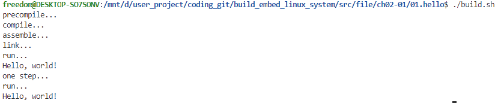

<!-- markdownlint-disable MD010 -->
# Makefile语法

Makefile作为编译脚本，用于将C/C++代码编译生成可执行程序。虽然目前已有现代编译工具bazel、cmake、clion，或使用高级脚本语言python、perl等进行编译，不在需要复杂的手动构建过程；不过对于嵌入式开发，如U-Boot、Linux、Rootfs以及部分软件的交叉编译，Makefile仍然是最基础的工具。理解和掌握Makefile语法，对于系统的理解大型项目的编译系统，掌握Linux环境下的项目构建方法，解决编译异常问题，有着重要意义。

如果单一实现能够生成可执行文件的Makefile并不困难，不过考虑到满足复杂的编译选项、链接库、静/动态库、交叉编译等需求，Makefile就十分复杂。而一些大型项目往往是这些功能的组合，就更不容易。对于Makefile，是可以从简单到复杂去理解的；本章节就按照这个思路去讲解Makefile的语法和实现说明，具体目录如下所示。

- [GCC程序编译流程](#gcc_compiler)
- [Makefile语法和基本实现](#makefile_basic)
- [Makefile库实现和编译](#library)
  - [静态库编译方法和应用](#static_library)
  - [动态库编译方法和应用](#dynamic_library)
- [使用扩展工具实现makefile](#makefile_tools)
- [Makefile总结说明](#summary)
- [下一章节](#next_chapter)

## gcc_compiler

在Windows开发环境下，通常使用集成开发环境(IDE)，如Visual Studio、Code blocks、MDK等。创建项目导入文件后，点击构建(Build)即可完成所有编译流程。这种方式很简单，不过却隐藏了系统编译的运行机理；Linux开发环境则需要通过实现编译配置文件Makefile，从而完成对项目的构建；这就需要理解背后的C/C++的编译过程。

C/C++的编译过程主要包含四个步骤，分别是预处理、编译、汇编和链接；具体说明如下。

1. '预处理': 主要包含删除所有预定义的宏，如'#if'，'#define'，'#include'这类宏的处理
2. '编译'  : 将预处理的文件经过词法分析，语法分析和优化生成相应的汇编文件
3. '汇编'  : 将汇编文件转变成机器可执行的目标文件
4. '链接'  : 将上述的目标文件，以及系统提供的库，进行链接最后输出可执行文件

详细流程可参考下图所示。


上面就阐述了C/C++编译生成可执行文件的流程。gcc作为是编译的工具集，包含多个工具。

- gcc用于编译支持c文件的工具；根据不同的选项，支持生成静态库、动态库以及可执行程序。
- g++用于编译支持c++的工具(兼容c)；根据不同选项，支持生成静态库、动态库以及最终程序。

这里有个小知识，理论上gcc和g++都可以用于编译c/c++文件。g++本身支持对于C/C++的编译，而gcc编译C++则需要去链接C++库，添加命令'-lstdc++'。对于gcc，其编译过程也符合上面提到的四个步骤。这里我们以C语言的编译流程来理解上节内容，以"hello.c"为例。

```shell
# 预编译
gcc -E hello.c -o hello.i   # 包含头文件和预定义，生成去掉额外信息的中间文件

# 编译
gcc -S hello.i -o hello.s   # 中间文件生成汇编文件

# 汇编
gcc -c hello.s -o hello.o   # 生成目标平台的指令链接文件

# 链接
gcc -s hello.o -o hello     # 将文件链接，构建目标平台的可执行文件
```

可以看到，gcc的编译流程也和上节的说明一致。从上面可以看出，预编译、编译和汇编都是对单个文件的操作，链接时才有涉及多个文件操作的可能。gcc指令也整合了单文件的编译命令，因此上述操作也可以简化为如下操作。

```shell
# 生成指定链接文件
gcc -c hello.c -o hello.o      # 生成链接文件

# 链接
gcc hello.o -o hello        # 将文件链接，构建目标平台的可执行文件
```

上述流程项目见文件：[hello world文件编译指令脚本](./file/ch02-01/01.hello/build.sh)

具体执行流程如下所示。



当然，gcc也支持各种选项来支持各种扩展，如下所示。

```shell
-I"(Directory)"     # 指定包含的头文件目录
-L"(Library)"       # 指定包含的链接库的目录
-l"file"            # 指定链接的动态库，对应格式为lib[file].so
-std=(Version)      # 指定语言的版本，常见c++11、c++17、c++2a等
-Wl,-Map,(MapFile)  # 指定生成map文件
-O(Number)          # 支持优化等级，一般为0~3，值越大，优化等级越高
-D(String)          # 支持包含外部的宏定义，如果带值，则可以为-D(data=value)格式
-g					# 添加调试信息，使用gdb等调试工具必须加入此选项
```

其中链接库是比较常用的选项，常见的系统链接库如下所示。

```shell
-lstdc++			# 用于gcc编译时链接C++库
-lpthread           # 多线程编程，使用pthread和thread需要连接
-lm                 # 提供数学运算函数库，如sin、cos、sqrt等
-lrt                # 实时库，如定时器，信号量等
-ldl                # 动态链接库，如dlopen、dlclose等
```

上述基本包含gcc的常用扩展。在实现Makefile语法时其实也依赖上述扩展命令实现。

## makefile_basic

在上一节中讲解了通过基本的命令行实现gcc/g++编译可执行文件的方法，对于单个文件，看起来很简单；不过当文件多起来时，就需要每个文件都进行一定的处理再去链接，大致流程为下。

```shell
# 预处理，编译和汇编
gcc a.c -I"dir/xxx" a.o
gcc b.c -I"dir/xxx" b.o
......
gcc z.c -I"dir/xxx" z.o

# 链接
gcc a.o b.o ...... z.o -lpthread -lm -o app
```

这种写法完全可以实现编译功能需求，一些工具自动生成的编译脚本也有使用这样的方法实现；不过这种方法如果由手动去实现，就有致命的缺点，那就是冗余代码太多了，当项目有成百上千时，且配置项复杂时，预处理步骤就会占据大量篇幅，出问题分析也会十分困难。为了优化编译文件，支持Makefile语法的make工具被设计处理。执行make命令时，会在目录下查询名为Makefile的文件，执行具体指令并完成具体的编译工作。这里的编译工作，就是上述的描述的生成可执行文件的过程。这个概念很重要，在实现Makefile或解决编译问题时，可以先建立具体的编译链条，就可以分析问题出在编译期，汇编期还是链接期，就可以进一步分析发生问题的地方。

下面开始Makefile的基础讲解，常用语法格式如下所示。

- 标签

标签代表要构建的目标文件或者要执行的操作，由标签名、依赖项和命令三部分构成。

```shell
# 标签
[lable] : [dependencies]
  [commands]

- lable : 标签名，代表要构建的目标
- dependencies: 依赖项，是构建目标所依赖的文件或其他标签，多个依赖项用空格分隔
- commands: 命令，是标签所执行的具体操作，命令字段可以为空

# 举例说明
main.o : main.c
  gcc -c main.c -o main.o

target ：main.o
  gcc -o target main.o
```

- 变量

变量是Makefile中的一个特殊的标识符，用于存储和引用值。变量可以用于定义路径、文件名、命令等。

```shell
# 变量
[variable]=[value]
$(variable) 
# variable定义变量名，value定义变量，在使用时通过$(variable)即可读取变量。
# 对于=的说明
# = 基本的赋值
# := 赋值，并覆盖之前的值
# ?= 之前未赋值，则使用等号后的值，否则使用之前值
# += 将等号后面的值添加到之前值后

# 举例说明
CC=gcc
CFLAGS=-I"hello/" -O1
OBJS=main.o hello/hello.o
TARGET=target
all:$(TARGET)
$(TARGET):$(OBJS)
  $(CC) -o $(TARGET) $(OBJS) $(CFLAGS)
```

- 自动变量

自动变量是Makefile中的一个特殊的变量，用于引用当前规则中的依赖项和目标文件。

```shell
# 3.自动化变量
# $< 表示依赖对象集合中的第一个文件，如果依赖文件是以模式(即“%” )定义的，那么"$<"就是符合模式的一系列的文件集合
# $@ 表示规则中的目标集合，即分别代表%.c和%.o中的每个项
# $% 当目标是函数库的时候表示规则中的目标成员名，如果目标不是函数库文件，那么其值为空。
# $? 所有比目标新的依赖目标集合，以空格分开
# $^ 所有依赖文件的集合，使用空格分开，如果在依赖文件中有多个重复的文件，“$^”会去除重复的依赖文件，值保留一份
# $* 这个变量表示目标模式中"%"及其之前的部分，如果目标是 test/a.test.c，目标模式为 a.%.c，那么"$*"就是 test/a.test
%.o : %.c
  gcc -c $< -o $@

%.o : %.cpp
  g++ -c $< -o $@  
```

- 条件语句

```shell
# 4.ifeq/ifneq语法
# 用于对比变量是否一致的方法，基于这类语法，可以实现不同配置项的编译
ifeq ($(CCPLUS),g++)
	$(info used deivce compiler:$(CCPLUS))
endif

ifneq ($(CCPLUS),g++)
	CCPLUS := g++
endif
```

- 调试输出

```shell
# 5.编译logger输出
$(info:[string])    # 输出字符串信息，不会报错。
$(warning:[string]) # 以警告形式输出下暗示信息。
$(error:[string])   # 错误输出，同时将中止当前编译
```

了解了基本语法，现在参考上述语法实现一个基本的Makefile，包含文件内容和目录格式如下。

```shell
# 文件目录格式
- main.c
- hello_dir
  - hello.c
  - hello.h
```

现在定义一个比较简单的项目文件结构，包含hello/hello.c，hello/hello.h，main.c三个文件，按照上述的gcc的说明和Makefile语法，编译文件实现如下。

```Makefile
# step1: make查找all标签，并执行target.
all : target                                                  

# step2: 查找target标签，执行hello/hello.o，main.o.
target:hello/hello.o main.o                                 
# step5: 链接文件，生成可执行文件
	gcc -o target hello/hello.o main.o 

# step3: 执行hello.o标签，查找hello.c文件，执行下述命令
hello/hello.o:hello/hello.c                                 
	gcc -I"hello/" -c hello/hello.c -o hello/hello.o

# step4: 执行main.o标签，查找main.c文件,执行下述命令，生成链接文件
main.o:main.c                                               
	gcc -I"hello/" -c main.c -o main.o

clean:
	rm -rf target
	rm -rf hello/hello.o main.o
```

注意: **Makefile中，命令必须以Tab开始，不能够为空格，否则会报错。**

上述就是典型的支持多文件编译的Makefile文件，详细脚本文件参考: [基础文件编译指令脚本](./file/ch02-01/02.basic/Makefile)。

编译流程如下图所示。


当执行make时，具体流程如下所示。

1. 查询Makefile文件中是否存在all标签，执行all标签对应的操作。
2. all标签依赖于target标签，下一步执行target标签对应的操作。
3. target标签依赖于hello/hello.o和main.o两个标签，执行hello/hello.o和main.o两个标签对应的操作。
4. hello/hello.o, main.o会执行相应的gcc编译指令，生成目标.o文件。
5. 依赖执行完成后，执行target标签下的指令，生成可执行文件。

整个系统由label标签和gcc编译命令构成。对于文件较少的项目，使用这种方式清晰明了，也方便后续分析。不过对于有几十上百文件的项目，手写每个.o对应的处理就和直接写编译语句差不多了，并没有优势。这时就可以使用高级用法，如变量和自动变量进行处理，更新后Makefile文件如下所示。

```Makefile
# variable
# 定义编译的生成可执行文件名
EXCUTABLE ?= target

# 包含链接的所有文件
OBJECTS = hello/hello.o main.o

# 包含需要访问的文件头目录
INCLUDE_PATH = -I"hello/"

# 指定编译选项
CFLAGS += -O1 -lm

# 指定编译器   
CC ?= gcc                 

all : $(EXCUTABLE)

# 自动化变量，匹配所有的.c生成的链接文件
# 等同于上述的main.o:main.c和hello/hello.o:hello/hello.c标签
%.o : %.c                                           
	$(CC) $(INCLUDE_PATH) $(CFLAGS) -c $< -o $@

#生成可执行文件
#等同于上述target:hello/hello.o main.o标签
$(EXCUTABLE):$(OBJECTS)
	$(CC) -o $(EXCUTABLE) $(OBJECTS) $(CFLAGS)

clean:
	rm -rf $(EXCUTABLE)
	rm -rf $(OBJECTS)
```

这里就是支持自动化变量后的Makefile文件，在具体的项目中，修改OBJECTS对应的文件就可以实现包含不同文件构建系统；详细脚本文件参考：[扩展文件编译指令脚本](./file/ch02-01/02.basic/Makefile)。

不过对于大型项目，往往还有基于shell的预处理、编译条件管理等，更加复杂。另外将Makefile中的相同部分提取出来，通过include语法，可以将同一个Makefile应用到不同的工程，这里给个简单的build系统实现。

```shell
# build.mk
CROSS_COMPILE ?=
EXCUTABLE ?=
OBJECTS ?=
INCLUDE_PATH ?=
CC ?=$(CROSS_COMPILE)gcc
CCPLUS ?=$(CROSS_COMPILE)g++
CFLAGS ?=
CCFLAGS ?=
INCLUDE_PATH ?=

all : $(EXCUTABLE)

%.o : %.c                                           
	$(CC) $(INCLUDE_PATH) $(CFLAGS) -c $< -o $@

%.o : %.cpp                                         
	$(CCPLUS) $(INCLUDE_PATH) $(CCFLAGS) -c $< -o $@

$(EXCUTABLE):$(OBJECTS)
	$(CCPLUS) -o $(EXCUTABLE) $(OBJECTS) $(CCFLAGS)

clean:
	rm -rf $(EXCUTABLE)
	rm -rf $(OBJECTS)

# Makefile
OBJECTS := main.o test.o
EXCUTABLE := target

include build.mk
```

这样只需要引入必要的参数和可执行文件的名称选项，就可以在项目中快速的导入Makefile实现；也是大型项目的常用做法，详细参考文件：[build.mk基础Makefile文件](./file/ch02-01/04.include/build.mk)

## library

前面的编译步骤，讲述的是如何编译可执行文件。不过GCC还支持编译生成静态库或动态库，然后在使用过程中链接最终生成可执行文件。这里你可能有疑惑了，既然可以直接通过C/C++文件最终生成可执行文件了，为什么还需要静态库和动态库的存在？其实这是和开发需求相关的，有时我们的代码并不是自己使用，可能要提供给客户使用。这时候不希望直接提供全部源码，就把比较关键的模块以库的形式实现，只提供接口供客户使用；或者是不希望客户修改某部分代码，降低开发复杂度，就可以使用静态库的方式提供。对于动态库，除了上面的目的外，还能多份程序共享动态库，避免相同代码的实现都保存在硬盘中，降低内存占用。

这里就开始讲述如何实现静态库和动态库，以及相应的应用。

### static_library

静态库实现是gcc的一个常见用法，其编译和应用流程使用gcc如下所示。

```shell
# 编译生成静态库
# 将C文件编译为中间文件
echo "compile..."
gcc -c lib_obj1.c -o lib_obj1.o
gcc -c lib_obj2.c -o lib_obj2.o

# 通过ar文件打包中间文件生成lib文件
echo "ar pack..."
ar -cr libobj.a lib_obj1.o lib_obj2.o

### 静态库使用
gcc -o target main.o libobj.a
```

上述就是静态库的编译流程，详细参考文件：[静态库编译脚本](./file/ch02-01/05.static_lib/lib/build.sh)。

参考编译脚本，在根据Makefile的语法，就可以实现静态库的编译的Makefile文件，详细如下所示。

```Makefile
# 全局变量
lib-obj = libobj.a
lib-obj-src = lib_obj1.o lib_obj2.o
AR = ar
CC = gcc

all: $(lib-obj)

# 自动化变量，编译.c文件
# 等同于gcc -c lib_obj1.c -o lib_obj1.o和gcc -c lib_obj2.c -o lib_obj2.o
%.o:%.c
	$(CC) -c $< -o $@

# 静态库编译
#ar -cr libobj.a lib_obj1.o lib_obj2.o
$(lib-obj):$(lib-obj-src)
	$(AR) -cr $(lib-obj) $(lib-obj-src) 

clean:
	rm -rf $(lib-obj)
	rm -rf $(lib-obj-src)
```

上述就是编译静态库的Makefile文件，详细参考文件：[静态库编译Makefile](./file/ch02-01/05.static_lib/lib/Makefile)。

执行后如下所示。


对于静态库的使用就比较简单，直接在编译时链接静态库即可；其Makefile实现如下所示。

```shell
# 全局变量
EXCUTABLE ?= target
OBJECTS = main.o
CC ?= gcc                 
STATIC_LIB ?= lib/libobj.a

all : $(EXCUTABLE)

#自动化变量，匹配所有的.c生成的链接文件
%.o : %.c                                           
	$(CC) -c $< -o $@

# 生成可执行文件
$(EXCUTABLE):$(OBJECTS)
	$(CC) -o $(EXCUTABLE) $(OBJECTS) $(STATIC_LIB) # 此处链接静态库

clean:
	rm -rf $(EXCUTABLE)
	rm -rf $(OBJECTS)
```

可以看到，静态库在编译的最后一步进行链接，生成最终可执行文件；详细参考文件：[静态库编译Makefile](./file/ch02-01/05.static_lib/Makefile)。

执行后如下所示。


### dynamic_library

动态库的编译过程和静态库类似，唯一区别是生成动态库的链接方式不同，具体流程如下所示。

```shell
# 编译生成动态库
# 将C文件编译为中间文件
echo "compile..."
gcc -c lib_obj1.c -o lib_obj1.o
gcc -c lib_obj2.c -o lib_obj2.o

# 将C++文件编译为动态库
# -fPIC 选项指示编译器生成位置无关的代码(Position Independent Code)，即动态库文件
gcc lib_obj1.o lib_obj2.o -fPIC -shared -o libobj.so

### 链接动态库，生成程序
g++ main.o -Llib/ -lobj -o target
```

动态库是cpp文件生成动态链接库，格式需要满足lib[file].so的格式，在使用时用-l[file]编译，将上述流程转换为Makefile语法则可以如下实现。

```Makefile
# 全局变量
lib-obj = libobj.so
lib-obj-src = lib_obj1.o lib_obj2.o
CC = gcc

all: $(lib-obj)

# 自动化变量，编译.c文件
%.o:%.c
	$(CC) -c $< -o $@

# 动态库编译
$(lib-obj):$(lib-obj-src)
	$(CC) $(lib-obj-src) -fPIC -shared -o $(lib-obj)

clean:
	rm -rf $(lib-obj)
	rm -rf $(lib-obj-src)
```

上述就是编译动态库的Makefile文件，详细参考文件：[动态库编译Makefile](./file/ch02-01/06.dynamic_lib/lib/Makefile)。

执行后如下所示。


对于动态库的使用则是添加编译选项，链接动态库，详细如下所示。

```Makefile
# 全局变量
EXCUTABLE ?= target
OBJECTS = main.o
CC ?= gcc
CFLAGS ?= -Llib/ -lobj

all : $(EXCUTABLE)

#自动化变量，匹配所有的.c生成的链接文件
%.o : %.c                                           
	$(CC) -c $< -o $@

# 生成可执行文件
$(EXCUTABLE):$(OBJECTS)
	$(CC) -o $(EXCUTABLE) $(OBJECTS) $(CFLAGS)

clean:
	rm -rf $(EXCUTABLE)
	rm -rf $(OBJECTS)
```

动态库的链接是通过CFLAGS的-L和-l来链接的，其中-L指定链接库的路径，-l指定链接库的名字；详细参考文件：[动态库编译Makefile](./file/ch02-01/06.dynamic_lib/Makefile)。

虽然这样能编译通过，不过在执行时，需要将之前的动态库拷贝到当前目录、系统LD链接目录或者将动态库的链接路径添加到LD_LIBRARY_PATH中，这里使用添加到LD_LIBRARY_PATH中的方式，详细执行如下所示。


## makefile_tools

前面步骤已经包含了Makefile的主要应用场景，包含生成可执行文件、静态库、动态库，以及静态库和动态库的应用等。不过这些都需要将处理的文件写入到Makefile中，虽然逻辑更清晰，但项目文件过多时，维护文件也是比较繁琐的工作。这里可以借用Makefile支持的命令机制，通过自动化的脚本进行文件选择和编译；不过这一类情况也有对于代码格式和功能的限制，往往只用于特定的文件目录格式需求。

```shell
$(shell "pwd")      					# 执行shell命令
$(addsuffix <suffix>,<name>) 			# 将suffix后缀加到name的对象中并赋值到返回地址中
$(addsuffix /inc,$(CUR_DIR))			# 将/inc后缀加到CUR_DIR对象中并赋值到返回地址中
$(wildcard $(CUR_DIR)/*.c) 				# 通配符，匹配指定目录下满足要求的文件
$(sub <from>,<to>,<text>)				# 替换字符串，将text中的"from"字符串替换成"to"字符串，返回替换后的字符串
$(patsubst %.c,%.o,$(notdir $(SRC))) 	# 使用模式替换字符串，将%.c格式替换成%.o格式，并返回
file := $(foreach n,$(obj),$(n).o)		# 循环遍历值并返回
$(notdir <names>) 						# 提取文件名中非目录部分
$(dir <names>) 							# 提取文件名中目录部分
```

基于上述脚本命令，实现的Makefile如下所示。

```shell
CUR_DIR := $(shell "pwd")						# 获取当前目录
INC_DIR := $(addsuffix /inc,$(CUR_DIR))			# 获取当前目录下的inc目录，作为inclue参数
SRC := $(wildcard $(CUR_DIR)/*.c)				# 获取当前目录下的所有.c文件
OBJ := $(patsubst %.c,%.o,$(notdir $(SRC)))     # 获取当前目录下的所有.c文件，并替换成.o格式
CC := gcc										# 设置编译器	
CFLAGS := -Wall -I$(INC_DIR)					# 设置编译参数

all: target

%.o : %.c
	$(CC) $(CFLAGS) -c $< -o $@

target: $(OBJ)
	$(CC) $^ -o $@

clean:
	rm -rf *.o target
```

上述就是支持自动化脚本生成的Makefile文件，详细参考文件：[扩展脚本文件](./file/ch02-01/07.extend/Makefile)。

编译执行流程如下所示。


## summary

至此我们便讲解了大部分Makefile语法实现；在实际项目中，往往结合上面这些常用的Makefile语法，提取出mk文件，再通过config配置进行开关选项的管理。从Makefile构建的脚本，再到cmake、babel等工具，其本质上都是对于gcc编译流程的封装转换，有此概念才能更好的去解决编译过程中的问题。

```shell
# gcc编译语句
gcc -c main.c -Iinclude/ -o1 -g -o main.o

# gcc链接语句
gcc main.o -Llib/ -lm -lpthread -o main
```

这两句话其实包含Makefile编译需要的大部分信息。

```shell
gcc: 编译工具，对应CC、CCPLUS等变量
main.c: 源文件，对应SRC变量
-Iinclude/: 头文件路径，对应INCLUDE_PATH变量
-o1, -g: 编译选项，对应CFLAGS变量
-Llib/: 库文件路径，对应LIB_PATH变量
-lm, -lpthread: 库文件，对应LIB变量
-o main: 输出文件，对应EXCUTABLE变量
```

Makefile中的定义和实现，都是将这些信息以变量的形式进行存储，再label控制的方式转换。理解了这一点，再去理解编译选项就可以有更清晰的认识。基于此经验，就可以去进一步去分析大型项目如U-Boot、Linux Kernel、Busybox中的Makefile，做到知其然亦知其所以然，系统的掌握Makefile语法。

## next_chapter

[返回目录](../README.md)

直接开始下一小节:[menuconfig界面管理](./ch02-02.menuconfig.md)。
