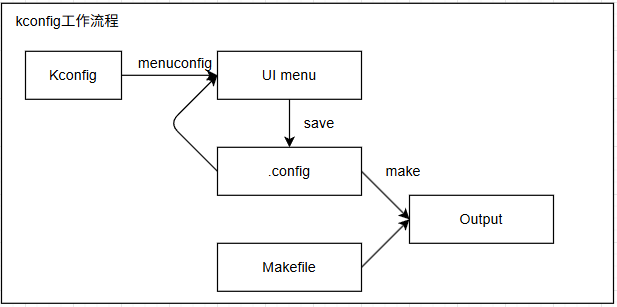
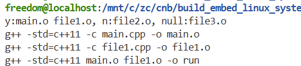
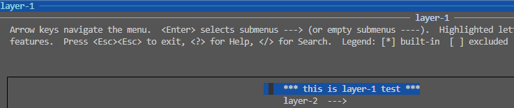
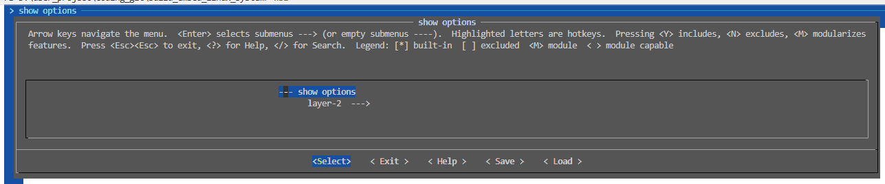
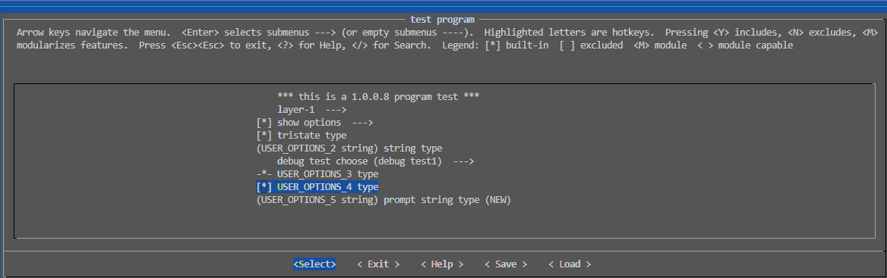
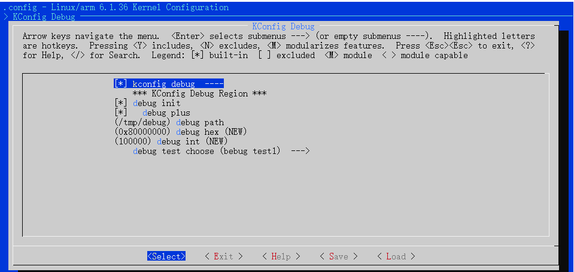

<!-- markdownlint-disable MD010 -->
# menuconfig配置界面和kconfig语法

menuconfig配置界面是在Linux平台下编译大型项目主流方案，在U-Boot、Kernel、Buildroot以及openwrt等项目中，都是使用Kconfig配合`make menuconfig`命令进行界面管理，控制编译输出。图形化配置管理的工作流程，具体如下所示。



可以总结为以下几个步骤。

- 通过make menuconfig命令，调用mconf程序解析Kconfig文件，生成UI界面。
- UI修改后，通过save命令保存，生成`.config`文件。
- `.config`文件配合Makefile进行编译，可以控制最终被编译的代码，生成可执行文件。

注意: 对于U-Boot、Kernel等，在编译阶段会根据`.config`文件生成头文件`autoconf.h`，被引入到最终代码中，从而能够控制代码内的编译块。

本节具体目录如下所示。 

- [menu菜单配置方法](#menu_modify_method)
- [通过.config控制编译输出](#config_control)
- [Kconfig语法](#kconfig)
  - [mainmenu](#mainmenu)
  - [comment](#comment)
  - [menu](#menu)
  - [source](#source)
  - [menuconfig](#menuconfig)
  - [if](#if)
  - [config](#config)
  - [variable](#variable)
  - [choice](#choice)
- [系统编译测试实现](#test_example)
- [总结说明](#summary)
- [下一章节](#next_chapter)

## menu_modify_method

在项目根目录执行**make menuconfig**命令，即可打开图形界面，之后选择对应的配置项修改即可，配置项包含状态如下。

```shell
# 启动menuconfig
make menuconfig

# 配置项选择说明
[*] : 表示选择，编译到内核
[]  : 不包含在内核中，不会编译
<>  : 同[] 
<M> : 以模块的形式编译，但不会编译到内核
()  : 一般为输入的字符串，输入编译或者系统启动时的信息
```

可以看到配置项的修改如下所示。


执行保存就会在根目录下生成如下.config文件，内容一般如下所示。

```shell
CONFIG_CC_IS_GCC=y
CONFIG_GCC_VERSION=110201
CONFIG_CLANG_VERSION=0
CONFIG_AS_IS_GNU=y

......

#
# Rust hacking
#
# end of Rust hacking
# end of Kernel hacking
```

这里说明下在图形化配置下的一些技巧。

- 在界面上下选中词条，在左右选择底部的help选项，回车即可看到词条对应的说明信息。
- 在任意界面点击"/"按键，即可进入查询匹配界面，在这个状态下可以检索配置项和配置项说明信息，从而了解修改项位置。

关于图形化配置的操作并不困难，应该说很轻松就能修改；不过知道我们要设置什么配置项，在配置项如何添加板级硬件信息，就需要进一步深入去学习，这包含以下部分内容。

- .config是如何控制编译输出的
- menuconfig界面是如何生成

下面分别进行说明。

## config_control

这里先从基于Makefile的编译流程进行说明。其文件目录格式如下所示。

```Makefile
CXX = g++
CXXFLAGS ?= -std=c++11
INCLUDES :=
BUILD := run
LOCAL = $(shell pwd)

# 通过CONFIG控制模块是否最终加入编译选项
CONFIG_FILE1 = y
CONFIG_FILE2 = n
# CONFIG_FILE3 不存在

# 配置项
obj-y := main.o
obj-${CONFIG_FILE1} += file1.o
obj-${CONFIG_FILE2} += file2.o
obj-${CONFIG_FILE3} += file3.o

%.o : %.cpp
	$(CXX) $(CXXFLAGS) -c $< -o $@ $(INCLUDES)

all: $(obj-y)
	echo "obj-y: ${obj-y}, obj-n: ${obj-n}, obj: ${obj-}"
	$(CXX) $(CXXFLAGS) $(obj-y) -o $(BUILD)

clean:
	rm -rf $(obj-y)
	rm -rf $(BUILD)
```

执行编译命令make，结果如下所示。


从上面图形可以看到，main.cpp、file1.cpp被编译，而file2.cpp、file3.cpp没有被编译。要理解这个现象，其实对应的shell语法中变量的概念。`obj-${CONFIG_FILEx}`变量根据宏定义的不同，其实对应的三个变量`obj-y`、`obj-n`和`obj-`变量，其中obj-y变量对应file1.cpp，obj-n变量对应file2.cpp，obj-变量对应file3.cpp。这里可以增加打印看看这三个值。



最终all导入的是obj-y变量，则main.cpp、file1.cpp被编译，而file2.cpp、file3.cpp没有被编译。在实际应用中，图形化界面保存后生成的.config文件中是大量的CONFIG_xxx=y或CONFIG_xxx=""的选项；这些选项通过以下部分引入项目编译流程。

- 生成.config文件，通过`obj-xx`结构将代码.c文件加入到最终编译列表中。
- 生成autoconf.h文件，通过包裹进编译列表中的文件，最终控制编译选项。

参考内核中tools/build/Documentation/Build.txt，整个编译框架中包含两个部分.

- 通用的编译框架tools/build/Makefile.build
- 各个目录下的Kbuild或Makefile文件

下面是tools/build/Makefile.build完成编译的核心代码。

```Makefile
# 定义obj项
obj-y        := $($(obj)-y)
subdir-y     := $(patsubst %/,%,$(filter %/, $(obj-y)))
obj-y        := $(patsubst %/, %/$(obj)-in.o, $(obj-y))
subdir-obj-y := $(filter %/$(obj)-in.o, $(obj-y))

# in-target由obj-y生成
$(in-target): $(obj-y) FORCE
	$(call rule_mkdir)
	$(call if_changed,$(host)ld_multi)

# 编译入口
__build: $(in-target)
	@:
```

可以看到，最终定义为obj-y的变量被最终编译。这里展示.config和Makefile的代码。

```Makefile
#.config文件
CONFIG_HW_RANDOM=y
# CONFIG_HW_RANDOM_TIMERIOMEM is not set
# CONFIG_HW_RANDOM_BA431 is not set
# CONFIG_HW_RANDOM_VIRTIO is not set
CONFIG_HW_RANDOM_IMX_RNGC=y
CONFIG_HW_RANDOM_OPTEE=y
# CONFIG_HW_RANDOM_CCTRNG is not set
# CONFIG_HW_RANDOM_XIPHERA is not set
CONFIG_HW_RANDOM_ARM_SMCCC_TRNG=y

#drivers/char/hw_random/Makefile文件
obj-$(CONFIG_HW_RANDOM) += rng-core.o
rng-core-y := core.o
obj-$(CONFIG_HW_RANDOM_TIMERIOMEM) += timeriomem-rng.o
obj-$(CONFIG_HW_RANDOM_INTEL) += intel-rng.o
obj-$(CONFIG_HW_RANDOM_AMD) += amd-rng.o
obj-$(CONFIG_HW_RANDOM_ATMEL) += atmel-rng.o
obj-$(CONFIG_HW_RANDOM_BA431) += ba431-rng.o
obj-$(CONFIG_HW_RANDOM_GEODE) += geode-rng.o
obj-$(CONFIG_HW_RANDOM_N2RNG) += n2-rng.o
...
obj-$(CONFIG_HW_RANDOM_ARM_SMCCC_TRNG) += arm_smccc_trng.o
obj-$(CONFIG_HW_RANDOM_CN10K) += cn10k-rng.o
obj-$(CONFIG_HW_RANDOM_POLARFIRE_SOC) += mpfs-rng.o
```

对于完整的编译系统来说，其具体说明如下。

- CONFIG_HW_RANDOM=y时，就转换为obj-y=rng-core.o，这样就会加入编译列表。
- CONFIG_HW_RANDOM不存在时则为obj-=rng-core.o，这个全局变量没有加入编译脚本中，因此对于系统编译没有影响.

理论上直接修改.config的配置项也可以影响最终结果，不过不建议这种方式，这种修改在重新修改图形配置时会被覆盖丢失。事实上系统提供其它配置初值的方法，在menuconfig启动时可以导入，例如编译内核时的命令如下。

```shell
# 导入配置项，生成.config文件
make imx_v6_v7_defconfig

# 启动图形界面
make menuconfig
```

其中imx_v6_v7_defconfig就是设置的初始化配置项。这里一般由芯片厂商提供，不过我们可以在此基础上修改来支持自己的硬件板。这时就需要参考说明实现自己的配置选项，默认配置文件目录如下。

```shell
U-Boot：    configs/
Kernel:     arch/arm/configs/
Buildroot:  configs/
```

上述说明了如何通过CONFIG_XX配置项控制编译的输出，下面进行界面生成方法的讲解。

## kconfig

图形界面是基于Kconfig语法描述的树形结构，包含一系列的菜单入口和配置项的管理，详细参考Linux目录下文档:**Documentation/kbuild/kconfig-language.rs**，这里列出关键的kconfig语法如下。

### mainmenu

mainmenu用于定义主界面及菜单说明，定义图形界面的入口页；主要格式如下所示。

```shell
# 定义主菜单头
mainmenu "text"

# 举例说明
mainmenu "U-Boot $(UBOOTVERSION) Configuration"
```

其中text为菜单的标题说明, 其中`$()`引用全局变量或者内部定义的变量。

### comment

comment用于定义注释，格式如下所示。

```shell
# 定义注释
comment "text"

# 举例说明
comment "This is $(GCC_LIB) comment"
```

text为最终显示的注释说明，其中`$()`引用全局变量或者内部定义的变量。

### menu

memu/endmenu定义一个菜单块，菜单块中的选项会显示在下一级菜单中。对于菜单块来说，可以是除mainmenu的其它选项。另外菜单也支持嵌套。也就是支持多层的嵌套菜单。

```shell
# menu块格式
menu "text"
	body
endmenu

# 举例说明，多级菜单
# layer-1
#   this is layer-1 test
#   layer-2
#     this is layer-2 test 
menu "layer-1"
	comment "this is layer-1 test"
	menu "layer-2"
		comment "this is layer-2 test"
	endmenu
endmenu
```

其显示界面如下所示。



### source

source用于引入其他配置文件，类似于c语言中的include；格式如下所示。

```shell
# 引入其他配置文件
source "file_path"

# 举例说明，引入arch/Kconfig文件到此文件中
source "arch/Kconfig"
```

file_path为引入的配置文件路径。会将内容全部引入到此文件中。

### menuconfig

menuconfig用于定义菜单配置项，通过CONFIG_XXX选项管理，配合if实现条件显示，格式如下所示。

```shell
# menuconfig格式
menuconfig OPTIONS
	type "text"
	default "string"
	help 
	  "help string"

# 举例说明，menuconfig定义一个选项
menuconfig SHOW_OPTIONS
    bool "show options"
    default "y"
    help
        this is for menu option test.

if SHOW_OPTIONS
  	menu "layer-3"
		comment "this is layer-3 test"
	endmenu  
endif
```

对于menu，具体功能说明如下所示。

- OPTIONS选项指定变量名称，其类型由type指定，以bool为例包含y、n两种类型；保存到.config文件时，会添加前缀CONFIG_，如SHOW_OPTIONS最终显示为CONFIG_SHOW_OPTIONS。
- type后面说明的text最终会显示在菜单项中，text为选项的提示信息。
- default指定变量的默认值。
- help指定选项的提示信息。

另外变量通过if可以控制菜单项的显示，其中的if条件满足时，会显示在此菜单的下级菜单中。

对于上述例程来说，其显示界面如下所示。



### if

if/endif用于定义条件块，控制菜单中的内容是否显示；其格式如下所示。

```shell
# if格式
if OPTIONS
	body
endif

# 举例说明，if条件块
if SHOW_OPTIONS
  	menu "layer-3"
		comment "this is layer-3 test"
	endmenu  
endif

```

if条件块中，body为满足条件时显示的菜单项。配合menuconfig时，会控制下一级菜单中的显示项。

### config

config用于定义配置项，通过CONFIG_XXX选项管理，格式如下所示。

```shell
# config格式
config OPTIONS
	type "text"
	default "string"
	help 
	  "help string"

# 举例说明
# config定义tristate类型控制项
config USER_OPTIONS_1
	tristate "tristate type"
	default "m"
	help
		this is for config option test.

# config定义string类型控制项
config USER_OPTIONS_2
	string "string type"
	default "USER_OPTIONS_2 string"
	help
		this is for config option test.
```

对于config来说，功能来说和menuconfig一样，最终也会保存到.config文件中，如USER_OPTIONS_1最终显示为CONFIG_USER_OPTIONS_1并设置为配置内容。

### variable

对于Kconfig中定义的变量，主要用于menuconfig、config中，支持类型控制，以config为例，支持格式如下。

```shell
# config声明OPTIONS变量
config OPTIONS
	type "type string"
	prompt "prompt string"
	depends on xxx_OPTIONS
	default "type string"
	select xxx_OPTIONS
	help
		"help string"
```

其中个属性选项说明如下

- 类型type，指定变量的类型，包含bool、tristate、string、hex和int类型。
  - bool，两态y、n；y表示模块编译且加入内核，n表示不编译。
  - tristate，三态y、m、n；y表示编译且加入内核，m表示编译但以模块形式不加入内核，n表示不编译。
  - string，字符串类型，一般用于编译选项写入配置选项。
  - hex，十六进制数字类型，一般定义地址信息。
  - int，十进制数字类型，一般定义长度信息。
- prompt，单独的显示提示。带类型的数据可以直接后面输入提示，省略prompt.
- depends on，依赖属性，需要依赖的属性存在才可以显示并管理，可以添加多个属性，多个属性之间用&&连接。
- default，参数的默认值，未指定默认值则表示未选定。
- select，用来反向依赖，当符号被设为y时，select属性所依赖的属性会自动变为y，设为y则不影响。
- help，帮助文本，使用底部help会显示help的文本

具体示例如下。

```shell
config USER_OPTIONS_3
	bool "USER_OPTIONS_3 type"
	default "y"

config USER_OPTIONS_4
	bool "USER_OPTIONS_4 type"
	select USER_OPTIONS_3
	default "y"

config USER_OPTIONS_5
	string "USER_OPTIONS_5 string type"
	prompt "prompt string type"
	depends on USER_OPTIONS_3 && USER_OPTIONS_4
	default "USER_OPTIONS_5 string"
	help
		"USER_OPTIONS_5 string type"
```

具体显示界面如下所示。



### choice

choice/endchoice用于定义选择块，选择块中的prompt指定选择块的提示信息，显示在当前菜单中。用户点击后进入下一级菜单，格式如下所示。

```shell
# choice配合config组合实现选择块
choice
	prompt "debug test choose"
	default KCONFIG_DEBUG_TEST1     

config KCONFIG_DEBUG_TEST1
	bool "debug test1"
	help
	  This enables support for debug test 1.

config KCONFIG_DEBUG_TEST2
	bool "debug test2"
	help
	  This enables support for debug test 2.

endchoice
```

控制选项通过组合，就实现了完整的管理界面。例如config HW_RANDOM被选择后，最终就生成CONFIG_HW_RANDOM=y的语句。

## test_example

这里就按照上述语法说明，增加测试代码块，添加到Linux配置菜单中并执行，具体流程如下所示。

- 创建Kconfig.debug文件，添加Kconfig语法

```Makefile
# 根目录Kconfig
source "Kconfig.debug"

# KConfig.debug
# SPDX-License-Identifier: GPL-2.0
#
# For a description of the syntax of this configuration file,
# see Documentation/kbuild/kconfig-language.rst.
#
# menu菜单
menu "KConfig Debug"        

# menuconfig菜单，控制下级菜单
menuconfig KCONFIG_DEBUG   
	bool "kconfig debug"
	default "y"
	help
	  Say Y here to enable support for KCONFIG DEBUG drivers.

# if/endif语句，显示菜单项
if KCONFIG_DEBUG

# comment注释项，显示注释信息
comment "KConfig Debug Region"

# config控制项
config KCONFIG_DEBUG_INIT
	bool "debug init"
	depends on KCONFIG_DEBUG
	default "y"
	help
	  Say yes here if you want to use DEBUG INIT.
	  If unsure, say Y.

config KCONFIG_DEBUG_PLUS
	bool "debug plus"
	depends on KCONFIG_DEBUG_INIT
	default "y"
	help
	  Say yes here if you want to use DEBUG PLUS.
	  If unsure, say Y.

config KCONFIG_DEBUG_PATH
	string "debug path"
	depends on KCONFIG_DEBUG_INIT
	default ""
	help
		Set debug path.

config KCONFIG_DEBUG_HEX
	hex "debug hex"
	depends on KCONFIG_DEBUG_INIT
	default "0x80000000"
	help
		Set debug hex.

config KCONFIG_DEBUG_INT
	int "debug int"
	depends on KCONFIG_DEBUG_INIT
	default "100000"
	help
		Set debug int.

# 必须是可选择子菜单下的选项，最终生成CONFIG_KCONFIG_DEBUG_TEST1=1的选项
choice
	prompt "debug test choose"
	depends on KCONFIG_DEBUG
	default KCONFIG_DEBUG_TEST1     

config KCONFIG_DEBUG_TEST1
	bool "debug test1"
	help
	  This enables support for debug test 1.

config KCONFIG_DEBUG_TEST2
	bool "debug test2"
	help
	  This enables support for debug test 2.

endchoice

endif
endmenu
```

添加上述内容后，菜单根目录下就增加如下界面。



这就是整个Kconfig中最核心的语法。在开发过程中，只要找到所属模块下的Kconfig文件，添加对应CONFIG选项，就可以增加相应的配置项。如果是系统添加模块，则需要增加Kconfig文件，在使用Source导入到系统框架中。

## summary

本节讲述了如何基于Kconfig构建界面，并基于界面生成.config，从而控制编译输出的全部流程。不过对于U-Boot，Kernel还有文件系统中的图形界面管理维护和调试，还需要结合框架和模块划分去理解运用。界面是编译最终输出的一部分，但背后原理也是我们开发中必须理解的一环，从只能简单运用，到能够自己去修改维护，才能算真正的理解掌握这部分知识。

## next_chapter

[返回目录](../README.md)

直接开始下一小节:[U-Boot平台移植](./ch02-03.uboot_imx_transplate.md).
