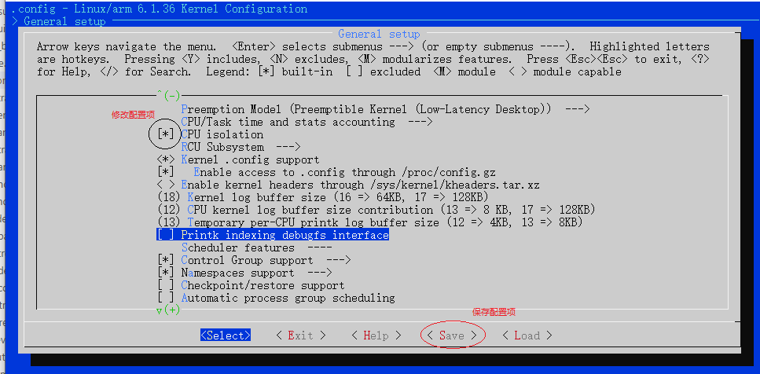
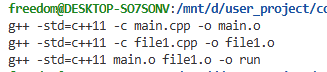

<!-- markdownlint-disable MD010 -->
# 配置界面和kconfig

menuconfig是在Linux平台下编译大型项目主流的图形化配置界面；在U-Boot、Kernel、Buildroot以及openwrt等项目中，都是使用Kconfig进行界面管理。

- [menu菜单修改方法](#menu_modify_method)
- [.config如何控制编译输出](#config_control)
- [kconfig语法以及如何在内核添加自定义选项](#kconfig)
- [下一章节](#next_chapter)

## menu_modify_method

在项目根目录执行**make menuconfig**命令，即可打开图形界面，之后选择对应的配置项修改即可，配置项包含状态如下。

```shell
# 启动menuconfig
make menuconfig

# 配置项选择说明
[*] : 表示选择，编译到内核
[]  : 不包含在内核中，不会编译
<>  : 同[] 
<M> : 以模块的形式编译，但不会编译到内核
()  : 一般为输入的字符串，输入编译或者系统启动时的信息
```

可以看到配置项的修改如下所示。



执行保存就会在根目录下生成如下.config文件，内容一般如下所示。

```shell
CONFIG_CC_IS_GCC=y
CONFIG_GCC_VERSION=110201
CONFIG_CLANG_VERSION=0
CONFIG_AS_IS_GNU=y

......

#
# Rust hacking
#
# end of Rust hacking
# end of Kernel hacking
```

这里说明下在图形化配置下的一些技巧。

1. 在界面上下选中词条，在左右选择底部的help选项，回车即可看到词条对应的说明信息。
2. 在任意界面点击"/"按键，即可进入查询匹配界面，在这个状态下可以检索配置项和配置项说明信息，从而了解修改项位置。

关于图形化配置的操作并不困难，应该说很轻松就能修改；不过知道我们要设置什么配置项，在配置项如何添加板级硬件信息，就需要进一步深入去学习，这包含两部分内容。

1. .config是如何控制编译输出的
2. menuconfig界面是如何生成

## config_control

这里先演示下简化的Makefile脚本，有助于理解整个.config的执行流程。

```Makefile
CXX = g++
CXXFLAGS ?= -std=c++11
INCLUDES :=
BUILD := run
LOCAL = $(shell pwd)

#通过CONFIG控制模块是否最终加入编译选项
CONFIG_MAIN1 = y
CONFIG_MAIN2 = n
obj-${CONFIG_MAIN1} += main1.o
obj-${CONFIG_MAIN2} += main2.o

%.o : %.cpp
	$(CXX) $(CXXFLAGS) -c $< -o $@ $(INCLUDES)

all: $(obj-y)
	$(CXX) $(CXXFLAGS) $(obj-y) -o $(BUILD)

clean:
	rm -rf $(obj-y)
	rm -rf $(BUILD)

#目录下执行Makefile，编译结果如下
#参考目录file/ch02-02/
g++ -std=c++11 -c main1.cpp -o main1.o 
g++ -std=c++11 main1.o -o run
```

可以看到，main1.cpp最终加入编译，而main2.cpp未加入编译，这是因为最终all导入的是obj-y变量，而main2.cpp被加入obj-n变量中，所以仅main1.cpp被编译，上述就是整个编译的基本原理。
在实际应用中，图形化界面保存后生成的.config文件中是大量的CONFIG_xxx=y或CONFIG_xxx=""的选项，这些选项如何引入项目编译流程，就更加复杂，去相应的目录下就可以理解。参考内核中tools/build/Documentation/Build.txt，整个编译框架中包含两个部分.

1. 通用的编译框架tools/build/Makefile.build
2. 各个目录下的Kbuild或Makefile文件

下面是tools/build/Makefile.build完成编译的核心代码。

```Makefile
#定义obj项
obj-y        := $($(obj)-y)
subdir-y     := $(patsubst %/,%,$(filter %/, $(obj-y)))
obj-y        := $(patsubst %/, %/$(obj)-in.o, $(obj-y))
subdir-obj-y := $(filter %/$(obj)-in.o, $(obj-y))

#in-target由obj-y生成
$(in-target): $(obj-y) FORCE
	$(call rule_mkdir)
	$(call if_changed,$(host)ld_multi)

#编译入口
__build: $(in-target)
	@:
```

可以看到，最终定义为obj-y的变量被最终编译。这里展示.config和Makefile的代码。

```Makefile
#.config文件
CONFIG_HW_RANDOM=y
# CONFIG_HW_RANDOM_TIMERIOMEM is not set
# CONFIG_HW_RANDOM_BA431 is not set
# CONFIG_HW_RANDOM_VIRTIO is not set
CONFIG_HW_RANDOM_IMX_RNGC=y
CONFIG_HW_RANDOM_OPTEE=y
# CONFIG_HW_RANDOM_CCTRNG is not set
# CONFIG_HW_RANDOM_XIPHERA is not set
CONFIG_HW_RANDOM_ARM_SMCCC_TRNG=y

#drivers/char/hw_random/Makefile文件
obj-$(CONFIG_HW_RANDOM) += rng-core.o
rng-core-y := core.o
obj-$(CONFIG_HW_RANDOM_TIMERIOMEM) += timeriomem-rng.o
obj-$(CONFIG_HW_RANDOM_INTEL) += intel-rng.o
obj-$(CONFIG_HW_RANDOM_AMD) += amd-rng.o
obj-$(CONFIG_HW_RANDOM_ATMEL) += atmel-rng.o
obj-$(CONFIG_HW_RANDOM_BA431) += ba431-rng.o
obj-$(CONFIG_HW_RANDOM_GEODE) += geode-rng.o
obj-$(CONFIG_HW_RANDOM_N2RNG) += n2-rng.o
...
obj-$(CONFIG_HW_RANDOM_ARM_SMCCC_TRNG) += arm_smccc_trng.o
obj-$(CONFIG_HW_RANDOM_CN10K) += cn10k-rng.o
obj-$(CONFIG_HW_RANDOM_POLARFIRE_SOC) += mpfs-rng.o
```

1. CONFIG_HW_RANDOM=y时，就转换为obj-y=rng-core.o，这样就会加入编译列表。
2. CONFIG_HW_RANDOM不存在时则为obj-=rng-core.o，这个全局变量没有加入编译脚本中，因此对于系统编译没有影响.

基实不使用图形界面配置，直接修改.config的配置项也可以影响最终结果。不过不建议这种方式，这种修改在重新修改图形配置时会被覆盖丢失。事实上系统提供其它配置初值的方法，在menuconfig启动时可以导入，例如编译内核时的命令。于此，可以发现其

```shell
# 导入配置项
make imx_v6_v7_defconfig

# 启动图形界面
make menuconfig
```

其中imx_v6_v7_defconfig就是设置的初始化配置项。这个一般由芯片厂商提供，不过我们可以在此基础上修改来支持自己的硬件板。这时就需要参考说明实现自己的配置选项，默认配置文件目录如下。

```shell
U-Boot：    configs/
Kernel:     arch/arm/configs/
Buildroot:  configs/
```

上述说明了如何通过CONFIG_XX配置项控制编译的输出，下面进行界面生成方法的讲解。

## kconfig

图形界面是基于Kconfig语法描述的树形结构，包含一系列的菜单入口和配置项的管理，详细参考Linux目录下文档:**Documentation/kbuild/kconfig-language.rs**，这里列出关键的kconfig语法

```shell
mainmenu          :定义主界面及菜单说明，定义图形界面的入口页。
source            :选择指定进一步包含和解析的文件，类似于include。
menu/endmenu      :定义一个菜单块，只有在菜单块中的选项最终会显示在界面中。
if/endif          :定义一个条件块，满足要求的才能显示。
choice/endchoice  :实现一个选择块，可进入下一菜单指定选择项。
config            :配置项，用于管理配置的单元块，是kconfig实现的功能主体。
menuconfig        :控制下拉菜单的配置项目
comment           :注释语句，在菜单中显示分割的注释语句
```

控制选项通过组合，就实现了完整的管理界面。例如config HW_RANDOM被选择后，最终就生成CONFIG_HW_RANDOM=y的语句。下一步更重要的就是具体配置(config下语句)，主要包含如下属性。

- 类型type，指定变量的类型，包含bool，tristate，string，hex，int
  - bool，两态y、n；y表示模块编译且加入内核，n表示不编译
  - tristate，三态y、m、n；y表示编译且加入内核，m表示编译但以模块形式不加入内核，n表示不编译.
  - string，字符串类型，一般用于编译选项写入配置选项.
  - hex，十六进制数字类型，一般定义地址信息.
  - int，十进制数字类型，一般定义长度信息.
- prompt，单独的输入提示，带类型的数据可以直接后面输入提示，省略prompt.
- depends on，依赖属性，需要依赖的属性存在才可以显示并管理
- default，参数的默认值，未指定默认值则表示未选定
- help，帮助文本，使用底部help会显示help的文本

这里就按照上述语法实现测试代码块，添加到Linux配置菜单中。

```Makefile
#根目录Kconfig
source "Kconfig.debug"

#KConfig.debug
# SPDX-License-Identifier: GPL-2.0
#
# For a description of the syntax of this configuration file,
# see Documentation/kbuild/kconfig-language.rst.
#
menu "KConfig Debug"        

menuconfig KCONFIG_DEBUG   
	bool "kconfig debug"
	default "y"
	help
	  Say Y here to enable support for KCONFIG DEBUG drivers.

#if KCONFIG_DEBUG

comment "KConfig Debug Region"

config KCONFIG_DEBUG_INIT
	bool "debug init"
	depends on KCONFIG_DEBUG
	default "y"
	help
	  Say yes here if you want to use DEBUG INIT.
	  If unsure, say Y.

config KCONFIG_DEBUG_PLUS
	bool "debug plus"
	depends on KCONFIG_DEBUG_INIT
	default "y"
	help
	  Say yes here if you want to use DEBUG PLUS.
	  If unsure, say Y.

config KCONFIG_DEBUG_PATH
	string "debug path"
	depends on KCONFIG_DEBUG_INIT
	default ""
	help
		Set debug path.

config KCONFIG_DEBUG_HEX
	hex "debug hex"
	depends on KCONFIG_DEBUG_INIT
	default "0x80000000"
	help
		Set debug hex.

config KCONFIG_DEBUG_INT
	int "debug int"
	depends on KCONFIG_DEBUG_INIT
	default "100000"
	help
		Set debug int.

#必须是可选择子菜单下的选项，最终生成CONFIG_KCONFIG_DEBUG_TEST1=1的选项
choice
	prompt "debug test choose"
	depends on KCONFIG_DEBUG
	default KCONFIG_DEBUG_TEST1     

config KCONFIG_DEBUG_TEST1
	bool "debug test1"
	help
	  This enables support for debug test 1.

config KCONFIG_DEBUG_TEST2
	bool "debug test2"
	help
	  This enables support for debug test 2.

endchoice

#endif
endmenu
```

添加上述内容后，菜单根目录下就增加如下界面。



这就是整个Kconfig中最核心的语法。在开发过程中，只要找到所属模块下的Kconfig文件，添加对应CONFIG选项，就可以增加相应的配置项。如果是系统添加模块，则需要增加Kconfig文件，在使用Source导入到系统框架中。

本节讲述了如何基于Kconfig构建界面，并基于界面生成.config，从而控制编译输出的全部流程。不过对于U-Boot，Kernel还有文件系统中的图形界面管理维护和调试，还需要结合框架和模块划分去理解运用。界面是编译最终输出的一部分，但背后原理也是我们开发中必须理解的一环，从只能简单运用，到能够自己去修改维护，才能算真正的理解掌握这部分知识。

## next_chapter

[返回目录](../README.md)

直接开始下一小节:[U-Boot平台移植](./ch02-03.uboot_imx_transplate.md).
