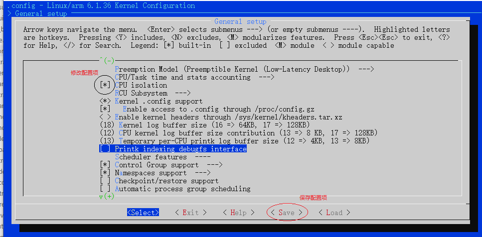

# menuconfig

menuconfig是在Linux平台下编译大型项目主流的图形化配置界面，如U-Boot, Kernel, BusyBox, *BuildRoot项目，都是使用此工具进行管理。

## menuconfig界面修改方法

一般在项目根目录执行**make menuconfig**命令，即可打开图形界面，之后选择对应的配置项修改即可，配置项包含状态如下。

```shell
#启动menuconfig
make menuconfig

#配置项选择说明
[*] : 表示选择，编译到内核
[]  : 不包含在内核中，不会编译
<>  : 同[] 
<M> : 以模块的形式编译，但不会编译到内核
()  : 一般为输入的字符串，输入编译或者系统启动时的信息
```

可以看到配置项的修改如下所示。



执行保存即可生成如下.config文件，内容一般如下所示。

```shell

CONFIG_CC_IS_GCC=y
CONFIG_GCC_VERSION=110201
CONFIG_CLANG_VERSION=0
CONFIG_AS_IS_GNU=y

......

#
# Rust hacking
#
# end of Rust hacking
# end of Kernel hacking
```

这里说明下在图形化配置下的一些技巧，在界面上下选中词条，在左右选择底部的help选项，回车即可看到词条对应的说明信息。在任意界面点击"/"按键，即可进入查询匹配界面，在这个状态下可以检索配置项和配置项说明信息，从而了解修改项位置。关于图形化配置的操作理解和掌握并不困难，应该说很轻松就能修改，不过如何知道我们要设置什么配置项，在配置项支持板级硬件信息，其实理解如下两个问题，这些也就轻松解答。

1. .config是如何控制文件最终编译执行
2. menuconfig界面是如何生成

## .config控制编译输出

在实际应用中，图形化界面保存后生成的.config文件中是大量的CONFIG_xxx=y或CONFIG_xxx=""的选项，知晓这些选项如何引入项目编译流程，就需要从内核源码去理解，这就涉及Makefile的相关说明，这里以Linux内核编译为例, 本节的内容参考内核中tools/build/Documentation/Build.txt. 整个编译框架中包含两个部分.

1. 通用的编译框架tools/build/Makefile.build
2. 各个目录下的Kbuild或Makefile文件

下面是tools/build/Makefile.build完成编译的核心代码。

```Makefile
#定义obj项
obj-y        := $($(obj)-y)
subdir-y     := $(patsubst %/,%,$(filter %/, $(obj-y)))
obj-y        := $(patsubst %/, %/$(obj)-in.o, $(obj-y))
subdir-obj-y := $(filter %/$(obj)-in.o, $(obj-y))

#in-target由obj-y生成
$(in-target): $(obj-y) FORCE
    $(call rule_mkdir)
    $(call if_changed,$(host)ld_multi)

#编译入口
__build: $(in-target)
    @:
```

可以看到，最终定义为obj-y的变量被最终编译，那么Makefile又是如何控制的呢，这部分理解就比较简单，下面分别展示.config和Makefile的代码。

```Makefile
#.config文件
CONFIG_HW_RANDOM=y
# CONFIG_HW_RANDOM_TIMERIOMEM is not set
# CONFIG_HW_RANDOM_BA431 is not set
# CONFIG_HW_RANDOM_VIRTIO is not set
CONFIG_HW_RANDOM_IMX_RNGC=y
CONFIG_HW_RANDOM_OPTEE=y
# CONFIG_HW_RANDOM_CCTRNG is not set
# CONFIG_HW_RANDOM_XIPHERA is not set
CONFIG_HW_RANDOM_ARM_SMCCC_TRNG=y

#drivers/char/hw_random/Makefile文件
obj-$(CONFIG_HW_RANDOM) += rng-core.o
rng-core-y := core.o
obj-$(CONFIG_HW_RANDOM_TIMERIOMEM) += timeriomem-rng.o
obj-$(CONFIG_HW_RANDOM_INTEL) += intel-rng.o
obj-$(CONFIG_HW_RANDOM_AMD) += amd-rng.o
obj-$(CONFIG_HW_RANDOM_ATMEL) += atmel-rng.o
obj-$(CONFIG_HW_RANDOM_BA431) += ba431-rng.o
obj-$(CONFIG_HW_RANDOM_GEODE) += geode-rng.o
obj-$(CONFIG_HW_RANDOM_N2RNG) += n2-rng.o
...
obj-$(CONFIG_HW_RANDOM_ARM_SMCCC_TRNG) += arm_smccc_trng.o
obj-$(CONFIG_HW_RANDOM_CN10K) += cn10k-rng.o
obj-$(CONFIG_HW_RANDOM_POLARFIRE_SOC) += mpfs-rng.o

```

1. CONFIG_HW_RANDOM=y时，就转换为obj-y=rng-core.o，这样就会加入编译列表。
2. CONFIG_HW_RANDOM不存在时则为obj-=rng-core.o，这个全局变量没有加入编译脚本中，因此对于系统编译没有影响.

其实不使用图形界面配置，直接修改.config的配置项也是可以的，不过不建议这种方式，软件实际上提供了在其它地方设置初值的方式，在menuconfig启动时可以导入，例如编译内核时的命令。

```shell
#导入配置项，启动图形界面
make menuconfig imx_v6_v7_defconfig
```

其中imx_v6_v7_defconfig就是设置的初始化配置项，这个一般由芯片厂商提供，不过我们在这个基础上进行维护修改来支持自己的开发板，这时就需要参考说明实现自己的配置选项，这样就不需要每次完全清理后重新修改，默认配置文件目录如下。

- U-Boot：    configs
- Kernel:     arch/arm/configs
- Buildroot:  configs

理解了配置选项如何将文件导入，如果增加开发板，外设器件，那么在相应目录Kbuild或Makefile文件中添加语句，在默认配置中增加导入的对应配置项即可，不过此时配置项在图形配置界面是不存在的，这就需要下一节的说明，图形界面的构建方式。

## 图形界面的构建方式

图形界面是基于Kconfig语法描述的树形结构，包含一系列的菜单入口和配置项的说明。

- mainmenu

定义主界面及菜单说明。

```shell
#格式
mainmenu <prompt>

#举例
mainmenu "Linux/$(ARCH) $(KERNELVERSION) Kernel Configuration"
```

- source

指定后续解析的配置文件。

```shell
#格式
mainmenu <file>

#举例
source "scripts/Kconfig.include"
```

- menu/endmenu

定义一个菜单块，**只有在菜单块中的选项最终会显示在界面中**。

```shell
#格式
menu <prompt>
.....
endmenu

#举例
#在菜单中创建platform selection选项，支持下一级选择
menu "Platform selection"
    depends on MMU

comment "CPU Core family selection"
...
endmenu
```

## next_chapter

[返回目录](./SUMMARY.md)

直接开始下一小节:[ch02-03.uboot移植](./ch02-03.uboot_transplant.md).