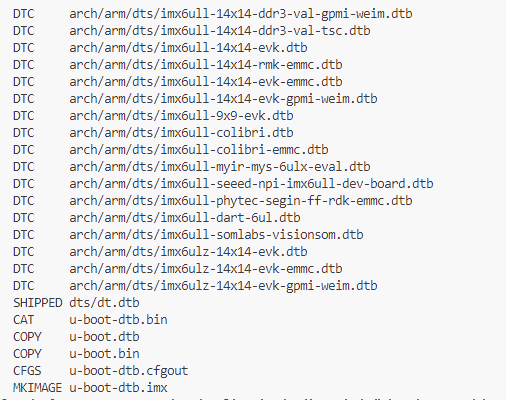

# U-Boot平台移植(I.MX6ull平台)

从这一步开始，正式进入如何构建系统运行平台的工作。

本节以正点原子的I.MX6ull阿尔法开发板为基础，移植目前NXP提供的最新U-Boot和Kernel，并在其上构建支持busybox，bootroot和debain系统的平台功能实现。本篇修改涉及硬件，设备树，驱动加载和系统执行过程等知识，从过程和结果去总结如何完成U-Boot的移植和构建。当然，真正的理解移植流程需要些前置的知识积累，详细如下。

1. [ARM内核和硬件分析](./ch03-02.armcore_analyse.md)
2. [设备树说明](./ch03-01.device_tree.md)
3. [Makefile语法](./ch02-01.makefile.md)
4. [Kconfig和menuconfig管理](./ch02-02.menuconfig.md)
5. [U-Boot环境变量和命令处理](./ch02-04.uboot_env.md)

对于uboot的移植，处理步骤如下。

- [U-Boot的下载和编译](#uboot_download_compiler)
- [U-Boot的移植](#uboot_transplant)

## uboot_download_compiler

在前面提到过，构建系统运行平台根据来源不同如下所示。

- 使用方案商或培训机构基于特定平台的U-Boot源码，一般提供修改好的设备树和代码，只需要少量或者不需要修改即可使用，这种情况下，本篇内容参考即可。
- 使用芯片厂商的提供的U-Boot源码方案，移植到特定平台(包含方案商或者自己设计的平台)，也是本章讲述的内容。
- 使用U-Boot主干，然后添加平台芯片SOC的支持，再扩展到板级的支持。此类需要对于芯片架构，芯片寄存器配置，启动流程有着深刻的认知，非芯片原厂基本不会涉及，这里也不会说明。

本篇以芯片厂商提供的U-Boot源码方案进行说明。

以NXP的系列芯片为例(包含I.MX6ull)，其U-Boot源码放置在github上，地址如下。

```shell
#下载uboot源码
git clone https://github.com/nxp-imx/uboot-imx.git
```

不过这种方式除了uboot代码外，也会下载git的管理文件，体积大，速度慢，建议选择分支到github网页直接下载。目前默认的稳定分支为If_v2022.04(If_v2023.04已经发布，不过在我写此节文章时不是default，所以等稳定后再迁移到此版本)。这里选择默认分支。选择Code>Download ZIP即可下载，进行后续处理。

```shell
#下载指定分支的uboot
wget https://codeload.github.com/nxp-imx/uboot-imx/zip/refs/heads/lf_v2022.04

#下载并解压uboot文件
unzip lf_v2022.04
cd uboot-imx-lf_v2022.04/
```

如此，便完成了U-Boot的下载。此时下载下来的是NXP实现的，适配官方开发板的源码版本。例如对于I.MX6ULL适配的就是官方的**MCIMX6ULL-EVK**开发板，相应的资料如下:

- <https://www.nxp.com/design/design-center/development-boards/i-mx-evaluation-and-development-boards/evaluation-kit-for-the-i-mx-6ull-and-6ulz-applications-processor:MCIMX6ULL-EVK>

此地址下有提供的原理图和相关资料，自行设计的开发板在硬件上当然和这块板子有差异，因此需要相应的移植修改动作。不过这里先不要做修改，验证下我们的环境能否完成U-Boot的编译，如果能够编译成功，后续的修改才有意义，也可以判断是否下载完整。对于U-Boot的编译，就涉及到了前面讲述的内容。U-Boot通过Kconfig进行管理配置项，然后在通过Makefile完成编译。理论上对于基础的U-Boot需要配置大量的选项来进行平台的适配，不过庆幸的是芯片厂商已经完成大部分的配置，我们只要在基础上修改即可。对于适配好的平台，在**uboot/configs**目录下提供，以I.MX6ull为例，对应的配置文件为

- configs/mx6ull_14x14_evk_emmc_defconfig
- configs/mx6ull_14x14_evk_nand_defconfig

可以使用如下命令进行开始界面的修改(以emmc版本为例)。

```shell
#step1:选择emmc版本作为配置输入，生成配置界面
make ARCH=arm CROSS_COMPILE=arm-none-linux-gnueabihf- mx6ull_14x14_evk_emmc_defconfig

#step2:编译U-Boot
make -j8 ARCH=arm CROSS_COMPILE=arm-none-linux-gnueabihf-
```

具体流程如下:

1. 使用menuconfig生成U-Boot主目录下的.config文件，在编译时make语法中会将定义导入，从而使能或者关闭配置项。具体可以看kconfig语法说明。
2. 使用make开始U-Boot的编译，编译结果如下所示，则表示编译成功, 如下所示。

```shell
SHIPPED dts/dt.dtb
CAT     u-boot-dtb.bin
COPY    u-boot.dtb
COPY    u-boot.bin
CFGS    u-boot-dtb.cfgout
MKIMAGE u-boot-dtb.imx
```

编译完成后，目录下的u-boot-dtb.imx即为编译后的可以使用的uboot固件。如果使用官方的开发板，可以直接下载使用，如果是方案商或者自己设计的开发板，上面只表示我们已经有了基于官方开发板的U-Boot固件，也就是验证了U-Boot的编译环境。

注意:U-Boot编译如果出错，很大可能是缺少某些库问题，因此编译前执行[编译环境构建](./ch01-00.platform_env_struct.md)中的**Linux平台库安装**中提供的命令。

## uboot_transplant

按照上面步骤，去官网下载源码，然后编译成固件使用并不困难，不过把U-Boot源码移植到适配自己的开发板并不简单。我看到的教程都是只告诉如何修改，并没有告知为什么这样修改，我在学习过程中，按照方法也移植成功了，对于移植的理解仍然是知其然不知其所以然。如何系统的有效理解U-Boot的移植过程，并能够推广适配到其它SOC芯片，这是我在学习和理解移植过程面对的最大难题。我也是在多次移植调试，验证不同芯片，不同版本的U-Boot源码，思考了许久后，才有了一些自己的见解。

U-Boot的功能总结起来就一句话:**根据启动配置项区别，从对应存储中加载内核和设备树到内存中，然后跳转执行**, 其它硬件的检查，执行都属于附加的功能。那么我们移植的过程，总结起来就是:根据硬件的差异化，进行U-Boot软件适配的过程。对于早期的版本，因为没有使用设备树支持，需要通过软件开发适配不同的硬件差异，也就是更多的代码修改，而较新的版本因为有设备树的支持，则相对来说简单清晰。

备注: **随着嵌入式的版本迭代，同一个功能的实现支持多种接口和方法实现，无论是U-Boot，Linux的移植，还是驱动的实现，都要面临这类问题的困扰. 所有接口都学习当然可以，但本身难度就高，接口多了更容易迷惑。从我的经验来说，选新不选旧。当然如果不确定，可以看看内核driver/目录下的驱动实现，加入主干的驱动基本上就是最佳实践了。**

基于单片机开发的经验，应该知道要开发支持某个硬件，从实现上包含确定硬件的接口，实现设备的驱动，然后将驱动接口集成到应用中调用。对于SOC来说，因为芯片的复杂度原因，由开源的U-Boot和Linux源码提供对于硬件的抽象以及系统集成的功能。不过这只能解决软件上的差异. 对于具体的硬件，差异仍然是客观存在的。那么移植U-Boot，Kernl时，需要的步骤就如下.

1. 确定硬件差异
2. 根据硬件差异更新设备树和板级代码
3. 将修改后的内容导入到源码中，用于最终的固件编译

下面按照这个流程去讲解分析。

### hardware_diff

对于硬件差异的确认。在硬件设计时，一般会有与官方开发板硬件差异性的对比表格，来避免设计问题，这一步直接拿来用即可。对于使用方案商的开发板，没有I/O对照表时，就需要根据原理图去比对，整理出表格，然后确定对设备树的修改。虽然初始比较耗时间，但这可以让你清晰了解板级的资源，也可以避免发生I/O或者器件地址被占用，导致后期实际开发中出问题。

对于目前我手中的开发板和官方开发板，硬件差异还是很多的。项目如果用于实际产品中，那么这一步建议是直接全部修改适配。不存在的器件就注释，删除，新增的则扩展支持。这个难度不低，不过这里主要是入门学习，可以先提供基础的U-Boot功能支持。

| 硬件模块 | 功能说明 | 官方开发板 | 用户开发板 |
| --- | --- | --- | --- |
| fec1 phy_addr(ENET1) | 网口1的地址 | 0x02 | 0x0 |
| fec2 phy_addr(ENET2) | 网口2的地址 | 0x01 | 0x1 |
| fec1 reset | 网口1的Reset引脚 | 74LVN595(IO-1) | MX6UL_PAD_SNVS_TAMPER7__GPIO5_IO07 |
| fec2 reset | 网口2的Reset引脚 | 74LVN595(IO-2) | MX6UL_PAD_SNVS_TAMPER8__GPIO5_IO08 |
| CAN2 | CAN2接口引脚 | MX6UL_PAD_UART2_RTS_B__FLEXCAN2_RX MX6UL_PAD_UART2_CTS_B__FLEXCAN2_TX | CAN2未使用 |
| i2c1 chip | i2c1外部器件 | FXAS21002CQ MAG3310 FXLS8974CFR3 | AP3216C |
| i2c2 chip | i2c2外部器件 | OV5640 TSC | AP3216C |
| LCD | LCD屏幕分辨率 | 480*272 | 800*480 |
| LCD RESET | LCD复位引脚 | (LCD_RESET)MX6UL_PAD_SNVS_TAMPER9__GPIO5_IO09 | UM805RE, RESET when Power On |
| QSPI | QSPI引脚和器件 | MT25QL256 | 未使用 |
| SPI3 | SPI3引脚和器件 | SPI3未使用 | ICM20608 |
| SIM2 | SIM2卡连接引脚 | SIM2接口 | 未使用 |
| SPI软件模拟口 | SPI软件扩展引脚 | 74LV595 | 未使用 |
| 触摸键盘引脚 | I/O扩展引脚 | GPIO1-01 ~ GPIO01-04 | 未使用 |
| UART2功能 | UART2功能引脚 | TTL功能 | 未使用 |
| USDHC1 Extern | SdCard引脚功能 | 选择和复位脚 | 未使用 |
| I/O | 普通I/O引脚 | 未使用 | key, led, beep |

在文件[embed_linux_design.xlsx](./file/embed_linux_design.xlsx)列出了我整理的官方开发板和正点原子阿尔法开发板的差异。理论上对于U-Boot的移植，是需要把上面所有的设备都进行匹配，实现满足本地硬件的驱动代码。不过这里只要得出可用的设备树，相对来说就比较简单了，在这里先要讲讲U-Boot的主要功能。

- 负责从不同地址加载内核，并跳转执行，这就涉及到外部存储(nand, usb, emmc，net)的驱动支持。
- 启动界面显示，支持UI图片显示。
- 支持U-Boot命令，以及系统环境变量配置。
- 硬件校验和附加功能实现。

为了支持U-Boot的上述功能，就需要进行硬件适配，下面基于此进行说明，首先根据硬件的差异对比，影响U-Boot功能相关的如下所示。

1. 要满足从存储中加载文件(网络，SDCard，Nand，EMMC)等 - 硬件网络(fec), 存储(USDHC1/USDHC2)
2. 打印调试logger，以及执行用户输入命令 - 串口打印(UART1)
3. 能够显示起始logo - UI显示(LCD)

其中串口打印硬件一致，不需要修改。

LCD的分辨率和复位引脚差异，修改如下。

```c
pinctrl_lcdif_ctrl: lcdifctrlgrp {
    fsl,pins = <
        MX6UL_PAD_LCD_CLK__LCDIF_CLK       0x79
        MX6UL_PAD_LCD_ENABLE__LCDIF_ENABLE  0x79
        MX6UL_PAD_LCD_HSYNC__LCDIF_HSYNC    0x79
        MX6UL_PAD_LCD_VSYNC__LCDIF_VSYNC    0x79
        /* used for lcd reset */
        // MX6UL_PAD_SNVS_TAMPER9__GPIO5_IO09  0x79
    >;
};

&lcdif {
    pinctrl-names = "default";
    pinctrl-0 = <&pinctrl_lcdif_dat
                &pinctrl_lcdif_ctrl>;

    display = <&display0>;
    status = "okay";

    display0: display@0 {
        bits-per-pixel = <24>;
        bus-width = <24>;

        display-timings {
            native-mode = <&timing0>;
            timing0: timing0 {
                clock-frequency = <33000000>;
                hactive = <800>;           /* 分辨率修改为800x400 */
                vactive = <480>;
                hfront-porch = <40>;
                hback-porch = <88>;
                hsync-len = <48>;
                vback-porch = <32>;
                vfront-porch = <13>;
                vsync-len = <3>;

                hsync-active = <0>;
                vsync-active = <0>;
                de-active = <1>;
                pixelclk-active = <0>;
            };
        };
    };
};
```

存储部分SDCard不需要复位和选择引脚。

```c
pinctrl_usdhc1: usdhc1grp {
    fsl,pins = <
        MX6UL_PAD_SD1_CMD__USDHC1_CMD           0x17059
        MX6UL_PAD_SD1_CLK__USDHC1_CLK           0x10071
        MX6UL_PAD_SD1_DATA0__USDHC1_DATA0       0x17059
        MX6UL_PAD_SD1_DATA1__USDHC1_DATA1       0x17059
        MX6UL_PAD_SD1_DATA2__USDHC1_DATA2       0x17059
        MX6UL_PAD_SD1_DATA3__USDHC1_DATA3       0x17059
        MX6UL_PAD_UART1_RTS_B__GPIO1_IO19       0x17059 /* SD1 CD */
        // MX6UL_PAD_GPIO1_IO05__USDHC1_VSELECT    0x17059 /* SD1 VSELECT */
        // MX6UL_PAD_GPIO1_IO09__GPIO1_IO09        0x17059 /* SD1 RESET */
    >;
};
```

以太网部分比较复杂，主要包含复位引脚和地址的变化，修改如下。

```c
&iomuxc_snvs {
    pinctrl_enet1_reset: enet1grp {
        fsl,pins = <
            MX6ULL_PAD_SNVS_TAMPER7__GPIO5_IO07 0x10B0
        >;
    };

    pinctrl_enet2_reset: enet1grp {
        fsl,pins = <
            MX6ULL_PAD_SNVS_TAMPER8__GPIO5_IO08 0x10B0
        >;
    };
};

&fec1 {
    pinctrl-names = "default";
    pinctrl-0 = <&pinctrl_enet1
                &pinctrl_enet1_reset>;              //fec1复位引脚连接配置
    phy-mode = "rmii";
    phy-handle = <&ethphy0>;
    phy-reset-gpios = <&gpio5 7 GPIO_ACTIVE_LOW>;   //fec1复位引脚是否逻辑翻转配置
    phy-reset-duration = <200>;
    status = "disabled";
};

&fec2 {
    pinctrl-names = "default";
    pinctrl-0 = <&pinctrl_enet2
                &pinctrl_enet2_reset>;              //fec2复位引脚连接配置
    phy-mode = "rmii";
    phy-handle = <&ethphy1>;
    phy-reset-gpios = <&gpio5 8 GPIO_ACTIVE_LOW>;   //fec2复位引脚是否逻辑翻转配置
    phy-reset-duration = <200>;
    status = "okay";

    mdio {
        #address-cells = <1>;
        #size-cells = <0>;

        ethphy0: ethernet-phy@0 {                   //phy1寄存器地址
            reg = <0>;
            micrel,led-mode = <1>;
            clocks = <&clks IMX6UL_CLK_ENET_REF>;
            clock-names = "rmii-ref";
        };

        ethphy1: ethernet-phy@1 {                   //phy2寄存器地址
            reg = <1>;
            micrel,led-mode = <1>;
            clocks = <&clks IMX6UL_CLK_ENET2_REF>;
            clock-names = "rmii-ref";
        };
    };
};
```

上述的修改可以直接在arch/arm/boot/dts/imx6ul-14x14-evk.dtsi中修改，后续直接使用mx6ull_14x14_evk_emmc_defconfig配置项编译即可。不过这种修改会影响到所有相关的文件，如果出问题，会丢失原始的数据，这里建议复制一份imx6ul-14x14-[name].dtsi, 然后再此文件修改吗，在本例中，相关的文件如下。

[imx6ul-14x14-rmk.dtsi](./file/ch02-03/uboot-imx-lf_v2022.04-patch/arch/arm/dts/imx6ul-14x14-rmk.dtsi)
[imx6ull-14x14-rmk-emmc.dts](./file/ch02-03/uboot-imx-lf_v2022.04-patch/arch/arm/dts/imx6ull-14x14-rmk-emmc.dts)

### src_update

上一节我们通过对比硬件，更新了设备树，这一节就要把设备树导入u-boot中，来实现用户功能，主要分为以下步骤。

#### 实现用户自定义的配置文件

```shell
#copy用户自定义的配置文件
cp configs/mx6ull_14x14_evk_emmc_defconfig configs/mx6ull_14x14_rmk_emmc_defconfig 
cp configs/mx6ull_14x14_evk_emmc_defconfig configs/mx6ull_14x14_rmk_sd_defconfig
cp configs/mx6ull_14x14_evk_nand_defconfig configs/mx6ull_14x14_rmk_nand_defconfig

#修改和设备树相关的选项
CONFIG_TARGET_MX6ULL_14X14_EVK=y => CONFIG_TARGET_MX6ULL_14X14_RMK=y
##sd或emmc
CONFIG_DEFAULT_DEVICE_TREE="imx6ull-14x14-evk-emmc" => CONFIG_DEFAULT_DEVICE_TREE="imx6ull-14x14-rmk-emmc"
##nand
CONFIG_DEFAULT_DEVICE_TREE="imx6ull-14x14-evk-emmc" => CONFIG_DEFAULT_DEVICE_TREE="imx6ull-14x14-rmk-gpmi-weim"

#硬件区分(与USDHC连接有关，USDHC1连接SDCard, 对应0，USDHC2连接EMMC，对应1)
#emmc(mx6ull_14x14_rmk_emmc_defconfig)
CONFIG_SYS_MMC_ENV_DEV=1

#sdcard(mx6ull_14x14_rmk_sd_defconfig)
CONFIG_SYS_MMC_ENV_DEV=0
```

#### 实现board相关的文件

复制board相关的文件，定义自己的板级代码实现。

```shell
#board相关的头文件
cp include/configs/mx6ullevk.h cp include/configs/mx6ullrmk.h

#board相关的文件目录
mkdir board/freescale/mx6ullrmk
cp board/freescale/mx6ullevk/* board/freescale/mx6ullrmk/*
```

对于board相关的文件，主要更改如下。

imximage_lpddr2.cfg文件。

```shell
#board/freescale/mx6ullrmk/imximage_lpddr2.cfg
PLUGIN  board/freescale/mx6ullevk/plugin.bin 0x00907000 => PLUGIN   board/freescale/mx6ullrmk/plugin.bin 0x00907000 
```

imximage.cfg文件。

```shell
#board/freescale/mx6ullrmk/imximage.cfg
PLUGIN  board/freescale/mx6ullevk/plugin.bin 0x00907000 => PLUGIN   board/freescale/mx6ullrmk/plugin.bin 0x00907000
```

Kconfig文件，用于显示板级信息的界面管理文件。

```shell
#board/freescale/mx6ullrmk/Kconfig
if TARGET_MX6ULL_14X14_RMK || TARGET_MX6ULL_9X9_EVK

config SYS_BOARD
    default "mx6ullrmk"

config SYS_VENDOR
    default "freescale"

config SYS_CONFIG_NAME
    default "mx6ullrmk"

config IMX_CONFIG
    default "board/freescale/mx6ullrmk/imximage.cfg"

config SYS_TEXT_BASE
    default 0x87800000
endif
```

MAINTAINERS文件，定义board相关的配置和访问文件。

```shell
#board/freescale/mx6ullrmk/MAINTAINERS
MX6ULLEVK BOARD
M:  Peng Fan <peng.fan@nxp.com>
S:  Maintained
F:  board/freescale/mx6ullrmk/
F:  include/configs/mx6ullrmk.h
F:  configs/mx6ull_14x14_rmk_defconfig
F:  configs/mx6ull_14x14_rmk_plugin_defconfig
F:  configs/mx6ulz_14x14_evk_defconfig
```

Makefile文件。

```shell
#board/freescale/mx6ullrmk/Makefile
# SPDX-License-Identifier: GPL-2.0+
# (C) Copyright 2016 Freescale Semiconductor, Inc.

obj-y  := mx6ullrmk.o
```

mk6ullrmk.c文件

```c
//board/freescale/mx6ullrmk/mk6ullrmk.c
int checkboard(void)
{
    if (is_mx6ull_9x9_evk())
        puts("Board: MX6ULL 9x9 RMK\n");
    else if (is_cpu_type(MXC_CPU_MX6ULZ))
        puts("Board: MX6ULZ 14x14 RMK\n");
    else
        puts("Board: MX6ULL 14x14 RMK\n");

    return 0;
}
```

plugin.S文件

```shell
#CONFIG_USE_IMXIMG_PLUGIN宏未定义, plugin.S未导入
#board/freescale/mx6ullrmk/plugin.S
no modify(plugin.bin)
```

include/configs/mx6ullrmk.h文件，这里包含默认的环境变量配置，这部分可以自己修改维护，或者使用boot.scr管理都可以，因为官方使用为USDHC2，因此主要修改如下。

```c
//include/configs/mx6ullrmk.h
/* environment organization */
#if CONFIG_SYS_MMC_ENV_DEV == 0
#define CONFIG_MMCROOT          "/dev/mmcblk0p2"  /* USDHC1 */
#else
#define CONFIG_MMCROOT          "/dev/mmcblk1p2"  /* USDHC2 */
#endif
```

环境变量可以在此文件修改，也可以在BootLoader命令行模式下修改，详细参考文件:[uboot-env](./ch02-04.uboot_env.md)。

另外需要将Board文件导入到U-Boot源码中，修改文件arch/arm/mach-imx/mx6/Kconfig, 将新的Board配置信息导入。

```shell
#增加RMK的编译选项(在界面里增加编译选项选择)
config TARGET_MX6ULL_14X14_RMK
    bool "Support mx6ull_14x14_rmk"
    depends on MX6ULL
    select BOARD_LATE_INIT
    select DM
    select DM_THERMAL
    select IMX_MODULE_FUSE
    select OF_SYSTEM_SETUP
    imply CMD_DM
```

#### fix_phy_issue

因为phy芯片的自适应配置需要在芯片复位重连时才能去交互，因此在自适应配置前需要复位一次芯片，具体代码如下。

```c
//drivers/net/phy/phy.c
int genphy_config_aneg(struct phy_device *phydev)
{
    int result;

    /* 复位phy */
    phy_reset(phydev);

    if (phydev->autoneg != AUTONEG_ENABLE)
        return genphy_setup_forced(phydev);

    result = genphy_config_advert(phydev);

    if (result < 0) /* error */
        return result;

    if (result == 0) {
        /*
            * Advertisment hasn't changed, but maybe aneg was never on to
            * begin with?  Or maybe phy was isolated?
            */
        int ctl = phy_read(phydev, MDIO_DEVAD_NONE, MII_BMCR);

        if (ctl < 0)
            return ctl;

        if (!(ctl & BMCR_ANENABLE) || (ctl & BMCR_ISOLATE))
            result = 1; /* do restart aneg */
    }

    /*
        * Only restart aneg if we are advertising something different
        * than we were before.
        */
    if (result > 0)
        result = genphy_restart_aneg(phydev);

    return result;
}
```

将上述修改完成后，即可执行编译命令。

#### compiler_uboot

```shell
make mx6ull_14x14_rmk_emmc_defconfig
make -j6
```

成功后如下所示，u-boot-dtb.imx即为编译好的U-Boot固件，如下图所示。



之后将其下载到开发板中运行即可。

## next_chapter

[返回目录](./SUMMARY.md)

直接开始下一小节: [uboot环境和命令](./ch02-04.uboot_env.md)
