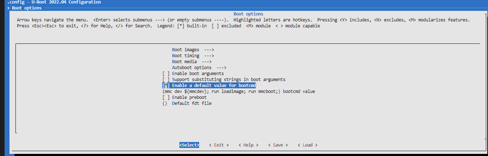

# U-Boot环境变量和命令管理

U-Boot支持内核启动加载，系统配置，网络服务等功能；对于U-Boot的功能，使用相应的操作命令和配置实现。U-Boot支持命令和系统环境变量管理来控制数据加载，执行。本节中将梳理这个流程，从源码和功能两个方面来理解这些选项和命令，从另一个角度来解读U-Boot的执行流程。对于U-Boot来说，允许用户执行的命令和修改的系统环境变量，就是提供的定制U-Boot工作流的外部接口。

目录：

- [env加载流程](#env_loading)
- [uboot环境变量](#uboot_env)
  - [net相关环境变量](#net_env)
  - [bootcmd操作U-Boot启动脚本](#bootcmd_env)
  - [bootargs传递kernel参数](#bootargs_env)
- [uboot常用命令](#uboot_support_command)
  - [mmc对应硬件处理命令](#mmc_cmd)
  - [环境env处理命令](#env_cmd)
  - [系统信息处理命令](#sys_cmd)
  - [文件处理命令](#fs_cmd)
  - [boot跳转相关命令](#boot_run_cmd)
  - [地址处理命令](#addr_cmd)
- [uboot跳转处理](#boot_process)
- [下一章节](#next_chapter)

## env_loading

系统环境变量保存在EMMC/SD/NAND FLASH等存储空间中，启动时从指定地址加载解析，然后将数据导入系统环境变量中。环境变量的存储地址定义在U-Boot默认配置文件**"configs/xxx_defconfig"**文件中，如下所示。

```shell
CONFIG_ENV_SIZE=0x2000      # 定义环境变量区间长度
CONFIG_ENV_OFFSET=0xE0000   # 在硬件中的偏移地址
```

硬件存储的环境变量如果在U-Boot中检测不存在或者校验失败，则使用默认的环境变量。默认的环境变量主要定义在U-Boot的**include/env_default.h**文件中，当然部分环境变量也由配置文件定义。

```c
char default_environment[] = {
    //......
    //另外，这个数组也支持通过config配置变量.
    //定义kernel的启动字符串，由u-boot传递给内核
    "bootargs="    CONFIG_BOOTARGS            "\0"
    //启动时加载的命令
    "bootcmd="     CONFIG_BOOTCOMMAND        "\0"
    //启动延时，u-boot跳转内核的delay时间
    "bootdelay="    __stringify(CONFIG_BOOTDELAY)    "\0"
    //本地IP地址
    "ipaddr="    __stringify(CONFIG_IPADDR)    "\0"
    //服务器IP地址
    "serverip="    __stringify(CONFIG_SERVERIP)    "\0"
    //本地网关
    "gatewayip="    __stringify(CONFIG_GATEWAYIP)    "\0"
    //本地子网掩码
    "netmask="    __stringify(CONFIG_NETMASK)    "\0"
    //在内存中加载内核的地址
    "loadaddr="    __stringify(CONFIG_SYS_LOAD_ADDR)"\0"
    //系统平台(arm)
    "arch="        CONFIG_SYS_ARCH            "\0"
    //CPU类型(armv7)
    "cpu="          CONFIG_SYS_CPU            "\0"
    //板级信息
    "board="        CONFIG_SYS_BOARD        "\0"
    "board_name="    CONFIG_SYS_BOARD        "\0"
    //所属厂商
    "vendor="    CONFIG_SYS_VENDOR        "\0"
    //soc类型
    "soc="        CONFIG_SYS_SOC            "\0"
};
```

注意: **default_environment中支持宏CONFIG_EXTRA_ENV_SETTINGS定义额外的系统环境变量支持，这部分定义在文件include/configs/mx6ullevk.h中**

- U-Boot在跳转等待的流程中，用户可以打断流程，通过系统命令修改环境变量，关于环境变量的命令主要如下所示。

```shell
# 打印环境变量
printenv

# 设置系统环境变量
setenv [var] "[data]"

# 保存环境变量，不执行保存只有当次有效，重启后丢失
saveenv
```

- U-boot支持script机制，指定加载脚本文件配置环境变量，加载此文件可以进行环境变量的修改替换。

boot.scr是用户定义的，执行环境变量的命令集合。通过mkimage将其转换为uboot可解析的script文件，生成boot.src的过程如下所示，boot.src中可以看到都是在命令行可执行的语句，可以说时U-boot的执行的脚本(由srcipt系统环境变量定义，在bootcmd执行时调用).

```shell
# 定义boot.script
vim boot.script

#-------------------------- 环境变量内容 --------------------------------
# boot.src内部可以写入U-Boot命令行支持的程序，相当于自定义U-boot脚本
echo "boot.env init!"
setenv serverip "192.168.3.29" 
setenv ipaddr "192.168.3.99" 
setenv netmask "255.255.255.0" 
setenv gateway "192.168.3.1"
setenv nfspath "/home/freedom/Desktop/sdk/arm/build/nfs_root"
setenv bootargs "console=ttymxc0,115200 root=/dev/nfs nfsroot=${serverip}:${nfspath},proto=tcp rw ip=${ipaddr}:${serverip}:${gateway}:${netmask}::eth0:off earlyprintk"
setenv netboot_cmd "tftp 80800000 zImage; tftp 83000000 ${fdt_file}; bootz 80800000 - 83000000;"
echo "boot.env int fininshed!"
run netboot_cmd
#------------------------------------------------------------------------

# 将boot.script转换成二进制执行的boot.scr
mkimage -C none -A arm -T script -d boot.script boot.scr

# 修改netboot的方式, 此时就可以通过远程加载boot.scr执行网络加载
setenv netboot "tftp 80800000 boot.scr; source"
setenv bootcmd "run netboot"
saveenv
```

对于和EMMC，放入到Partition 1(kernel和dtb)同目录，通过如下命令同样可以实现脚本加载，对于NAND则从指定地址加载boot.scr，再执行source命令即可

```shell
# 从SD卡中加载boot.scr，并执行
fatload mmc 0:1 0x80800000 boot.scr; source

# 从EMMC中加载boot.scr，并执行
fatload mmc 1:1 0x80800000 boot.scr; source

# 从bootcmd加载数据
nand read 0x80800000 ${bootscr}; source
```

上面讲解了环境变量的加载流程，可以看出修改环境变量有以下几种方式.

1. 在U-Boot中使用环境变量管理的相关命令直接修改后保存，写入存储中，下次启动时直接加载。优点是修改简单，熟悉U-Boot环境命令printenv, setenv或env, 然后使用saveenv保存即可，不需要额外编译，对于单台设备也只用修改一次，适合用于原型时期快速验证
2. 修改xxx_defconfig中的关于系统环境相关的宏定义，如CONFIG_BOOTARGS，CONFIG_IPADDR等，相对简单，但只有U-Boot中支持通过宏控制的变量才能通过此方法修改，
default_environment来增加CONFIG配置的支持；另外配置修改后，需要重新编译U-Boot烧录，一般用于不经常修改，且支持编译到内核变量
3. 修改U-Boot源代码，直接添加环境变量支持，并导入到全局默认环境变量。以i.MX6Ull为例，修改**include/configs/mx6ullevk.h"**中的宏定义，直接添加对应环境变量。此方法需要理解环境变量的加载原理，且每次变动就需要重新编译U-Boot，难度较大
4. 通过boot.src, 引入U-Boot启动脚本，更新环境变量和执行流程。此方法相对简单，且容易复用到大批量设备，修改启动脚本后，重新打包生成的项目工程即可实现功能，是比较通用的做法之一

关于U-Boot环境脚本的用法，详细步骤可参考：[U-Boot命令行脚本和设备树overlay实现](./ch02-x6.uboot_script_overlay.md)。

## uboot_env

关于环境变量的部分说明，前面已经描述了大部分，这里主要详细说明关键的环境变量说明.

### net_env

网络相关主要定义ip，mac，网关，子网掩码，默认连接的服务器ip等，

```shell
# 网络相关的配置选项
ipaddr: 开发板ip地址，如果不设置，会通过DHCP来获取(需要连接路由器)
gatewayip: 网关地址
netmask: 子网掩码
serverip: 服务器IP地址，使用tftp，nfs时，会使用到serverip作为目的地址来获取需求数据
ethaddr: 网口1对应的MAC地址
eth1addr: 网口2对应的MAC地址
```

### bootcmd_env

bootcmd保存了一系列U-Boot执行的启动命令，这些命令在U-Boot启动倒计时结束后会被执行。bootcmd可以通过CONFIG_BOOTCOMMAND定义在默认配置文件xxx_defconfig中，包含一系列在U-Boot环境下可以执行的命令(boot.src内容类似)，这里以i.MX6Ull在EMMC下的启动命令进行解析.

```shell
# 进入u-boot目录，使用菜单配置命令
make menuconfig

# 主菜单 > Boot options下配置bootcmd
CONFIG_USE_BOOTCOMMAND=y
CONFIG_SYS_LOAD_ADDR=0x80800000
CONFIG_BOOTCOMMAND="mmc dev ${mmcdev}; run loadimage; run mmcboot;"
```



以emmc为启动路径的bootcmd定义解析如下。

```shell
# mmcdev表示选择的mmc块，0表示USDHC1接口(硬件连接SD卡)，1表示USDHC2接口
# mmcpart表示在存储中的地址，/dev/mmcblk[mmcdev]p[mmcpart]， 例如/dev/mmcblk0p1表示SD卡块1地址
"mmcdev="__stringify(CONFIG_SYS_MMC_ENV_DEV)"\0" 
"mmcpart=1\0"
"image=zImage\0"
"loadaddr="    __stringify(CONFIG_SYS_LOAD_ADDR)
"fdt_addr=0x83000000"

# loadimage用于加载固件，mmcpart表示存放
"loadimage=fatload mmc ${mmcdev}:${mmcpart} ${loadaddr} ${image}\0"

# mmcboot用于加载设备树，执行代码
"mmcboot=echo Booting from mmc ...; " \
    "run mmcargs; " \
    "if test ${tee} = yes; then " \
        # tee不存在，不执行
        "run loadfdt; run loadtee; bootm ${tee_addr} - ${fdt_addr}; " \  
    "else " \
        "if test ${boot_fdt} = yes || test ${boot_fdt} = try; then " \
            # 加载fdt文件
            "if run loadfdt; then " \
                "bootz ${loadaddr} - ${fdt_addr}; " \
            "else " \
                "if test ${boot_fdt} = try; then " \
                    "bootz; " \
                "else " \
                    "echo WARN: Cannot load the DT; " \
                "fi; " \
            "fi; " \
        "else " \
            "bootz; " \
        "fi; " \
    "fi;\0" \

# 加载设备数到指定地址
"loadfdt=fatload mmc ${mmcdev}:${mmcpart} ${fdt_addr} ${fdt_file}\0"
"fdt_file=imx6ull-14x14-emmc-4.3-800x480-c.dtb\0"

# 跳转执行
"bootz ${loadaddr} - ${fdt_addr};
```

如果简化上述流程，bootcmd可以简化如下所示。

```shell
# EMMC启动
"bootcmd=fatload mmc 1:1 0x80800000 zImage; " \                              # 从EMMC加载内核
    "fatload mmc 1:1 0x83000000 imx6ull-14x14-emmc-4.3-800x480-c.dtb; " \    # 从EMMC加载内核
    "bootz 0x80800000 - 0x83000000"                                          # 跳转执行内核

# SD卡启动
"bootcmd=fatload mmc 0:1 0x80800000 zImage; " \                              # 从SD卡加载内核
    "fatload mmc 0:1 0x83000000 imx6ull-14x14-emmc-4.3-800x480-c.dtb; " \    # 从SD卡加载设备树
    "bootz 0x80800000 - 0x83000000"                                          

# 网络启动
"bootcmd=tftp 0x80800000 zImage; " \                                         # 从网络加载内核
    "tftp 0x83000000 imx6ull-14x14-emmc-4.3-800x480-c.dtb; " \              # 从网络加载设备树
    "bootz 0x80800000 - 0x83000000"  

# NAND启动
"bootcmd=nand read 0x80800000 0x4000000 0xc00000; " \                       # 从NAND加载内核
    "nand read 0x83000000 0x5000000 0x100000; " \                           # 从NAND加载设备树
    "bootz 0x80800000 - 0x83000000"
```

### bootargs_env

bootargs是U-Boot传递给内核的参数，用于内核进一步管理执行文件系统的加载方式和流程.bootargs可通过CONFIG_BOOTARGS定义在xxx_defconfig，或者通过boot.src进行修改，具体格式如下，不过对于kernel6.1版本，需要支持CONFIG_ATAGS属性来支持bootargs的传递。

```shell
#### 
# sd-mmc启动文件系统
bootargs="console=ttymxc0,115200 panic=5 rootwait root=/dev/mmcblk0p2 earlyprintk rw"

# emmc启动文件系统
bootargs="console=ttymxc0,115200 panic=5 rootwait root=/dev/mmcblk1p2 earlyprintk rw"

# nand启动文件系统
bootargs="console=ttymxc0,115200 ubi.mtd=5 root=ubi0:rootfs rootfstype=ubifs mtdparts=gpmi-nand:4m(u-boot),128k(env),1m(logo),1m(dtb),8m(kernel),-(rootfs)"

# 说明
console: 输出终端定义，ttymxc0表示串口，115200对应波特率
panic: Linux当一段时间无法启动文件系统时，触发painc
rootwait: 告诉内核挂载文件系统时需要相应驱动，防止mmc驱动未加载时，就去加载文件系统
root: 定义加载文件系统的目录，这里表示mmc1:2, 第一数字表示USHDC的接口，1表示USDHC2对应的硬件，第二项表示所在文件系统分区，这里表示在第二个分区.
earlyprintk：表示在内核加载时打印信息
rw: 此处表示文件系统可读写
####

# net启动文件系统
bootargs="console=ttymxc0,115200 root=/dev/nfs nfsroot=${serverip}:${nfspath},proto=tcp ip=${ipaddr}:${serverip}:${gateway}:${netmask}::eth0:off earlyprintk rw"

# 这里主要讲解bootargs的选项
console：定义内核打印的输出终端，ttymxc0,115200表示使用串口1，115200的波特率
root: 定义文件加载的根目录，当内核加载完毕，执行到第一个进程时，就会去根目录中加载首进程(一般为init或者bin/init)，这里/dev/nfs表示通过nfs访问，也就是nfsroot指定的目录
nfsroot = ${serverip}:${nfspath} : 定义nfs的根目录
    serverip: 服务器ip地址
    nfspath： 服务器端nfs_server指定的目录
ip = <clientip>:<serverip>:<gateway>:<netmask>:<hostname>:<device>:<autoconf> 
    clientip: 嵌入式设备端的ip地址
    serverip: 服务器ip地址
    gateway: 网关ip
    netmask: 子网掩码
    hostname：主机名，可以省略
    device: 网卡设备名，指定可使用的网卡，这里使用eth0表示网卡0
    autoconf: 自动连接，填off表示不自动连接
earlyprintk：内核加载时提前打印信息，调试时使用可以看到更多内核打印信息
rw：文件系统可读写，加载文件系统后如果希望可修改需要定义

# bootargs完整示例
bootargs="console=ttymxc0,115200 root=/dev/nfs nfsroot=192.168.2.29:/home/freedom/git/sdk/nfs,proto=tcp ip=192.168.2.99:192.168.2.29:192.168.2.1:255.255.255.0::eth0:off earlyprintk rw"
```

设置启动脚本。

```shell
# mmc启动方式
setenv bootargs "console=ttymxc0,115200 panic=5 root=/dev/mmcblk1p2 rw"
setenv bootcmd "fatload mmc 1:1 0x80800000 zImage; fatload mmc 1:1 0x83000000 imx6ull-14x14-emmc-4.3-800x480-c.dtb; bootz 0x80800000 - 0x83000000"
run bootcmd

# net启动方式
setenv bootargs "console=tty1 console=ttymxc0,115200 root=/dev/nfs nfsroot=${serverip}:${nfspath},proto=tcp,nfsvers=3 rw ip=${ipaddr}:${serverip}:${gateway}:${netmask}::eth0:off earlyprintk"
setenv bootcmd "tftp 0x80800000 zImage; tftp 0x83000000 imx6ull-14x14-emmc-4.3-800x480-c.dtb; bootz 0x80800000 - 0x83000000"
run bootcmd
```

上述就是需要定义和配置的环境变量，可以在CONFIG中或者boot.src中定义，来满足应用的要求.

## uboot_support_command

u-boot支持的命令是定义在cmd目录下，用于操作u-boot功能的命令，安卓功能分为如下所示。

### mmc_cmd

首先讲解的是和硬件相关的环境变量，mmcdev和mmcpart，这两个参数决定选择的mmc设备地址和块地址，代码位于u-boot中"cmd/mmc.c"中。

- mmc dev指定系统对应的硬件接口, 通过**mmc list**可以查看系统支持的硬件。以NXP i.MX6Ull开发板为例， 0表示SD卡, 1表示MMC设备；这里的0/1是根据使用USDHC接口定义的，其中USDHC1表示设备0，USDHC2表示设备1.
- mmcpart指定对应文件系统中的块区域，前面有说明整个系统被划分区域U-Boot、 Partition1、 Partition2区域, 其中Partition内放置kernel和dts的区域，则值为1；可通过**mmc part**命令查看支持的区域块。

```shell
# 从指定块读取指定长度数据到指定地址
mmc read addr blk# cnt 

# 对当前MMC设备扫描，查看扫描结果
mmc rescan

# 显示当前选定mmc设备的所有块
mmc part

# 切换到对应的mmc dev
mmc dev [dev] [part] [mode]

# 加载mmc0设备的区块1
mmc ${mmcdev}:${mmcpart}
```

### env_cmd

environment主要管理系统环境变量.

```shell
env       - environment handling commands
saveenv   - save environment variables to persistent storage
setenv    - set environment variables
printenv  - print environment variables

# sample
# 可用于更新和创建变量
setenv [variables] [value]

# 删除环境变量
setenv [variables]

# 恢复默认环境变量
env default -a -f

# 打印指定系统环境变量，等同于printenv
env print [-a | name ...]

# 删除创建的指定系统环境变量
env delete [name]

# 保存系统环境变量，等同于saveenv
env save

# 设置系统环境变量，等同于setenv
env set [name] [arg...]

# 从指定地址导入environment环境
env import -t [file]
```

### sys_cmd

主要是U-boot运行显示状态信息，执行动作的命令.

```shell
bdinfo    - 打印板级设备信息
dhcp      - 通过DHCP或TFTP来初始化网络
echo      - 向控制台输出参数，功能类似env(echo ${envarg})
exit      - 离开当前脚本环境
help或?   - 查看当前u-boot支持的命令
iminfo    - 打印输出应用固件的头文件信息
ln        - 创建符号链接
loop      - 在某个地址范围内循环
ls        - 列出目录中的文件 (default /)
ping      - 向网络主机发送ICMP回显请求
protect   - 开/关 FLASH保护
pxe       - 从pxe文件获取和引导的命令
panic     - Panic设备，并带可选信息
reset     - 重新复位系统，上电
run       - 执行以变量形式的U-Boot脚本
showvar   - 打印局部的hushshell变量
test      - 最小的测试命令，如/bin/sh
version   - 打印监视器，编译器和连接器版本
source    - 从指定内存执行允许脚本

nfs       - 通过nfs网络协议从服务端获取文件(需要服务端支持nfs服务，且设置了可允许访问目录)
    nfs [local_addr] [host_ip]:[file(full path)]
    nfs 80800000 192.168.2.34:/home/freedom/test.txt

tftp      - 通过tftp网络协议从服务端获取文件(需要服务端支持tftp服务，且设置了可允许访问目录)
    tftp [local_addr] [host_ip]:[file]
    tftp 80800000 192.168.2.34:test.txt
```

### fs_cmd

filesystem主要处理从文件系统中读取，显示，写入，创建，删除文件的动作.

```shell
erase     - erase FLASH memory
ext2load  - load binary file from a Ext2 filesystem
ext2ls    - list files in a directory (default /)
ext4load  - load binary file from a Ext4 filesystem
ext4ls    - list files in a directory (default /)
ext4size  - determine a files size
fatinfo   - print information about filesystem
fatload   - load binary file from a dos filesystem
fatls     - list files in a directory (default /)
fatmkdir  - create a directory
fatrm     - delete a file
fatsize   - determine a files size
fatwrite  - write file into a dos filesystem
fdt       - flattened device tree utility commands
flinfo    - print FLASH memory information
fstype    - Look up a filesystem type
fstypes   - List supported filesystem types
load      - load binary file from a filesystem
mmcinfo   - display MMC info
net       - NET sub-system
part      - disk partition related commands
save      - save file to a filesystem
ubi       - ubi commands
ubifsload - load file from an UBIFS filesystem
ubifsls   - list files in a directory
ubifsmount- mount UBIFS volume
ubifsumount- unmount UBIFS volume

mmc - 管理mmc和SD卡的操作
    - mmc info 输出mmc设备信息
    - mmc read 从指定块开始读取指定长度mmc块内数据到指定地址
        mmc read [local_addr] [mmc_blk] [blk_size]
    - mmc write 将指定地址内的指定长度数据，写入到指定块中
        mmc write [local_addr] [mmc_blk] [blk_size]
    - mmc rescan 扫描当前开发板上的mmc设备
    - mmc part 列出当前mmc设备的分区
    - mmc dev 切换mmc设备，选择当前设备
        mmc dev <dev> <part:可选> <mode:模式>
        # 选中第一个MMC设备的第一个分区
        mmc dev 1 1 
    - mmc list 列出当前有效的mmc设备
    - mmc hwpartition 设置mmc设备的分区
    - mmc rst 服务mmc设备
    - mmc erase 从指定地址删除指定块长度的数据(不建议使用，删除分区表可能会导致数据损坏) 
        mmc erase [blk] [blk_size]

fatls - 列出fat文件系统中的文件，配合mmc dev选中目录
    fatls [dir]
    dir: 可选参数，指定要列出的目录。如果未指定，则默认为根目录

fatload - 从fat文件系统中加载文件
    fatload <interface> <dev[:part]> <addr> <filename>
    interface: 存储接口，mmc表示MMC/SD开，USB表示USB存储设备
    dev: 设备号，根据硬件确定，0表示USDHC1连接设备，1表示USDHC2连接设备
    part: 分区号，例如1:1
    addr: 加载到内存中的地址
    filename: 要加载的文件文件名
    举例: fatload mmc 1:1 0x80800000 zImage

fatmkdir - 在fat文件系统中创建目录
    fatmkdir <interface> <dev[:part]> <dirname>
    interface: 存储接口，mmc表示MMC/SD开，USB表示USB存储设备
    dev: 设备号，根据硬件确定，0表示USDHC1连接设备，1表示USDHC2连接设备
    part: 分区号，例如1:1
    dirname: 要创建的目录名
    举例: fatmkdir mmc 1:1 test

fatrm - 删除fat文件系统中的文件
    fatrm <interface> <dev[:part]> <filename>
    interface: 存储接口，mmc表示MMC/SD开，USB表示USB存储设备
    dev: 设备号，根据硬件确定，0表示USDHC1连接设备，1表示USDHC2连接设备
    part: 分区号，例如1:1
    filename: 要删除的文件名
    举例: fatrm mmc 1:1 zImage

fatwrite - 将文件写入到fat文件系统中
    fatwrite <interface> <dev[:part]> <addr> <filename> <size:可选>
    interface: 存储接口，mmc表示MMC/SD开，USB表示USB存储设备
    dev: 设备号，根据硬件确定，0表示USDHC1连接设备，1表示USDHC2连接设备
    part: 分区号，例如1:1
    addr: 要写入文件存储的内如地址
    filename: 要写入的文件名
    size: 可选要写入的文件大小
    举例: fatwrite mmc 1:1 0x80800000 zImage
```

### boot_run_cmd

boot主要实现跳转到内存只读地址执行文件.

```shell
bootz     - 用于启动跳转ARM格式的内核，通常为内核直接编译的zImage
bootm     - 用于启动跳转legacy和FIT格式的内核，通常为uImage
booti     - 用于启动跳转AARCH64格式的内核
bootefi   - 引导ARM64压缩内核镜像，image.gz
bootelf   - 用于引导ELF格式内核镜像的命令
bootp     - 用于通过网络引导系统, 它基于 Bootstrap Protocol (BOOTP)
bootvx    - Boot vxWorks from an ELF image
sysboot   - command to get and boot from syslinux files
tftpboot  - boot image via network using TFTP protocol
```

定义路径: include/command.h

```shell
# bootz命令是U-Boot中用于启动ARM内核的命令
bootz [initrd_addr] - [fdt_addr]
    initrd_addr: 内核数据地址
    fdt_addr: 设备树地址

# 举例
tftp 80800000 [kernel]
tftp 83000000 [dts]
bootz 80800000 - 83000000;

# bootm命令是U-Boot中用于启动Uboot自定义内核的命令
bootm [initrd_addr] - [fdt_addr]
    initrd_addr: 自定义内核数据地址或者fit image信息
    fdt_addr: 设备树地址

# bootp从tftp服务器下载默认的内核镜像文件，并加载到默认的内存地址
bootp [loadAddress] [bootfilename]
    loadAddress：可选参数，指定内核映像应加载到的内存地址。如果未指定，则使用默认的加载地址。
    bootfilename：可选参数，指定要从TFTP服务器下载的文件名。如果未指定，则使用默认的文件名
bootp 0x80800000 vmlinuz
```

### addr_cmd

address主要处理memory里的数据.

```shell
base      - print or set address offset

blkcache  - block cache diagnostics and control

cmp       - 比较两段内存数据
    cmp[.b, .w, .l] addr1 addr2 count
    cmp.l 80000000 80000100 10

cp        - 拷贝一段内存数据
    cp[.b, .w, .l] [src] [dest] count
    cp.l 80000000 80000100 10

crc32     - checksum calculation
    format: crc32 address count [addr]

go        - 跳转到指定的地址并执行程序
    go [address]

md        - 用于显示内存值，.b表示字节，.w表示word, .l表示long
    md[.b,.w,.l] address [size] 
    md.b 80000000 14  =>从0x80000000读取长度0x14数据

mii       - MII utility commands

mm        - 用于修改指定地址的数据，可以修改输入值(地址自增)，使用q退出
    mm[.b,.w,.l] address

random    - fill memory with random pattern

nm        - 用于修改指定地址的数据，可以修改输入值(地址不自增)，使用q退出
    nm[.b,.w,.l] address

mw        - 用于使用一个指定的数据填充一段内存
    mw [.b, .w, .l] address value [count]
    mw.l 80000000 0A0A0A0A 10

mtest     - 用于内存测试
    mtest [start_addr] [end_addr]

size      - 展示文件长度
```

## boot_process

## next_chapter

[返回目录](../README.md)

直接开始下一小节: [uboot启动流程分析](./ch02-05.uboot_analyse.md)
