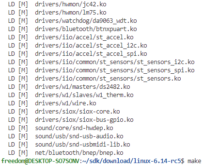

# Linux Kernel移植方法

Linux内核是Linux操作系统的核心，它负责管理系统的硬件资源，如CPU、内存、磁盘等，同时为用户空间的应用程序提供接口；Linux内核的移植的过程，就是将Linux适配设备硬件，提供接口支持后续应用的功能。如果只是简单的运行，Linux Kernel的移植十分简单，只需要修改设备树文件和配置文件，就可以完成移植；不过构建完整适配硬件的Linux Kernel，则远比U-Boot复杂的多。对于U-Boot来说，只要实现必要的串口，网络，指示灯等功能，支持打印调试信息以及跳转内核，从应用场景来说基本就合格了。对于内核，则需要适配硬件上的各种外设功能，并确保都工作正常，才能保证系统的稳定和安全，这就需要进行全面的移植和适配。

之前讲述构建运行平台时，说到内核系统代码的三个来源。

- Linux内核主干代码

Linux内核主干代码是整个系统代码的基础，由Linus领导的Linux开源社区维护；

- 芯片原厂适配的Linux内核(有源码方式提供，也有SDK方式提供)

芯片原厂基于特定分支的Linux内核，进行芯片硬件的适配，这里以ARM厂商居多，适配芯片的内核，时钟系统，中断系统，GPIO，串口，I2C，SPI等内部模块，以源码的方式提供给开发者使用。当然作为Linux开源社区的一员，同时也会定期将这些代码同步到内核主干中，作为主干内核代码的一部分，其中board和drivers目录下的很多驱动都是有厂商实现的。厉害的芯片厂商公司，往往也是Linux开源社区提供代码的主力部分。

- 方案商提供的适配自己硬件的Linux内核(一般和U-Boot，Rootfs打包成SDK提供)

方案商提供的Linux内核，一般是基于芯片原厂提供的内核，进行定制化的适配，包括设备树的修改，驱动的修改，配置文件的修改，以及部分bug的修复。最终会和U-Boot，Rootfs一起打包，以SDK的方式提供给开发者使用。

因为方案商提供的SDK基本上基于简单命令就可以编译，因此本节主要从主干代码和芯片原厂两部分说明移植方法，具体目录如下所示。

- [内核主干代码移植](#kernel_backbone)
- [基于芯片原厂Linux内核移植](#kernel_chip)
  - [设备树更新](#dtb_update)
  - [芯片配置选项更新](#config_update)
- [内核移植总结](#kernel_summary)
- [下一章节](#next_chapter)

注意: 因为系统版本，安装环境和编译器版本不同，编译所面临问题也会有所差异，这里给出我验证本篇文章使用的编译环境信息。

- 编译系统环境: Ubuntu 22.04 LTS
- 编译工具链版本: arm-none-linux-gnueabihf-gcc-11.2.1，安装包下载地址：<https://mirrors.tuna.tsinghua.edu.cn/armbian-releases/_toolchain/gcc-arm-11.2-2022.02-x86_64-aarch64-none-linux-gnu.tar.xz>
- 其它编译环境需要的功能支持参考：[系统环境支持](./ch01-00.platform_env_struct.md#support_common_library)

## kernel_backbone

这里提供Linux主干访问的地址代码

- <https://github.com/torvalds/linux/tree/master>

对于最新release的分支，一般会有一个tag，用于标识当前版本的代码，截至目前为v6.14-rc5，可以通过如下方式下载。

```shell
# 下载最新的Linux分支代码，国内
wget https://github.com/torvalds/linux/archive/refs/tags/v6.14-rc5.tar.gz
```

对于主干代码，我们以实现最基础的Linux Kernel打印输出功能为例进行测试。因为需要适配的芯片I.MX6ULL，选择适配NXP IMX6ULL的版本，对应的配置文件和设备树如下所示。

- 配置文件: arch/arm/configs/imx_v6_v7_defconfig
- 设备树: arch/arm/boot/dts/imx6ull-14x14-evk.dts

因为只要实现最基础的打印内核启动信息，并执行文件系统的功能，我们并不需要大量修改代码，只需要适配我们的调试串口即可。很幸运，主干代码中使用的串口和我们使用的一致，都是uart1接口，参考设备树文件中的stdout配置。


当然如果uart不一致，可以参考这篇内容： [如何修改调试接口](./ch02-xz.system_feature_notes.md#question-008)。

如果希望内核支持从emmc，nand，sd或者网络启动，则需要将相应节点修改或者添加到imx6ull-14x14-evk.dtsi中，这里以网络nfs启动为例，参考如下配置。

```c
//修改imx6ull-14x14-evk.dtsi中的节点，支持网络通讯
&iomuxc_snvs {
    pinctrl_fec1_reset: fec1_resetgrp {
        fsl,pins = <
            MX6ULL_PAD_SNVS_TAMPER7__GPIO5_IO07 0x79
        >;
    };

    pinctrl_fec2_reset: fec2_resetgrp {
        fsl,pins = <
            MX6ULL_PAD_SNVS_TAMPER8__GPIO5_IO08 0x79
        >;
    };
};

&fec1 {
    pinctrl-names = "default";
    pinctrl-0 = <&pinctrl_enet1
                &pinctrl_fec1_reset>;
    phy-mode = "rmii";
    phy-handle = <&ethphy0>;
    phy-reset-gpios = <&gpio5 7 GPIO_ACTIVE_LOW>;
    phy-reset-duration = <26>;
    // phy-supply = <&reg_peri_3v3>;
    status = "okay";
};

&fec2 {
    pinctrl-names = "default";
    pinctrl-0 = <&pinctrl_enet2
                &pinctrl_fec2_reset>;
    phy-mode = "rmii";
    phy-handle = <&ethphy1>;
    // phy-supply = <&reg_peri_3v3>;
    phy-reset-gpios = <&gpio5 8 GPIO_ACTIVE_LOW>;
    phy-reset-duration = <26>;
    status = "okay";

    mdio {
        #address-cells = <1>;
        #size-cells = <0>;

        ethphy0: ethernet-phy@0 {
            compatible = "ethernet-phy-id0022.1560";
            reg = <0>;
            micrel,led-mode = <1>;
            clocks = <&clks IMX6UL_CLK_ENET_REF>;
            clock-names = "rmii-ref";

        };

        ethphy1: ethernet-phy@1 {
            compatible = "ethernet-phy-id0022.1560";
            reg = <1>;
            micrel,led-mode = <1>;
            clocks = <&clks IMX6UL_CLK_ENET2_REF>;
            clock-names = "rmii-ref";
        };
    };
};
```

修改完成后，即可以配置内核和编译系统，使用如下命令。

```shell
# 解压代码
tar -zxvf v6.14-rc5.tar.gz

# 进入代码目录
cd linux-6.14-rc5/

# 配置内核
make imx_v6_v7_defconfig ARCH=arm CROSS_COMPILE=arm-none-linux-gnueabihf-

# 编译内核
make ARCH=arm CROSS_COMPILE=arm-none-linux-gnueabihf- -j8
```

成功配置的显示如下所示。


成功编译完成的显示如下所示。



这时我们需要的内核镜像和设备树文件如下所示。

- arch/arm/boot/zImage 内核镜像文件
- arch/arm/boot/dts/nxp/imx/imx6ull-14x14-evk.dtb 设备树文件

这是用nfs启动打印的信息。


上述内核代码在我们开发板是可以直接使用的，不过启动过程中会报大量的设备驱动错误。这是因为我们的开发板上并没有这些硬件设备，需要进行适配。如果进行全部的硬件适配，直接从主干代码开始，工作量是巨大的，所以我们需要一种更加简单的方式，就是使用芯片原厂提供的Linux内核进行适配。

## kernel_chip

使用芯片原厂的Linux芯片，厂商自然也是移植了芯片硬件的适配，已nxp为例，开源代码地址如下所示。

- <https://github.com/nxp-imx/linux-imx>

对于最新release的分支，一般会有一个tag，用于标识当前版本的代码，截至目前为止已经更新到6.6.y；不过我在测试的时候，使用的是6.1.y版本，因此以这个版本的移植为例。

```shell
# 下载Linux分支代码
wget https://github.com/nxp-imx/linux-imx/archive/refs/heads/lf-6.1.y.zip

# 解压代码
unzip lf-6.1.y.zip

# 进入代码目录
# 进入代码目录
cd cd linux-imx-lf-6.1.y/
```

重复上述的过程，继续配置内核和编译系统。

```shell
# 配置内核
make imx_v6_v7_defconfig ARCH=arm CROSS_COMPILE=arm-none-linux-gnueabihf-

# 编译内核
make ARCH=arm CROSS_COMPILE=arm-none-linux-gnueabihf- -j8
```

这个版本的内核仍然可以使用，不过仍然会有大量报错，我们后续的操作就是解决这些报错，适配开发板。为什么使用芯片厂商的内核，而不是使用Linux主干呢？这是因为Linux主干维护主要应对通用的功能，版本的升级，部分芯片平台在新功能下可能因为兼容性问题缺失，个人开发者是很难解决这些问题的，如果是demo，自然无所谓，对于产品来说是不可接受的。厂商提供的内核，基本都是经过适配的，会有更多相关产品使用者进行测试，如果有问题，也会及时修复。下面讲解Linux内核的移植过程，可能比你想象的更加简单，主要流程如下。

1. 设备树修改，适配硬件
2. 配置文件修改，适配功能需求

### dtb_update

设备树是Linux内核的核心组件之一，它描述了系统的硬件配置和资源分配。设备树文件通常以.dtb或.dts结尾，用于描述系统的硬件配置和资源分配。设备树文件是由设备树编译器（DTC）生成的，它将设备树源代码转换为二进制格式。

详细设备树的说明参考：[设备树说明](./ch03-01.device_tree.md)。

I.MX6ULL的设备树解析参考：[I.MX6ULL设备树解析](./ch03-x6.mx6ull_dts_analysis.md)。

对于设备树的移植，我们需要修改设备树文件，适配开发板的硬件。

```shell
# 根据开发板的资源，建立板级的基础设备树
cp arch/arm/boot/dts/imx6ull-14x14-evk.dtsi arch/arm/boot/dts/imx6ull-14x14-rmk.dtsi

# 实现相应的设备树文件
# emmc对应的设备树
touch arch/arm/boot/dts/imx6ull-14x14-emmc-4.3-800x480-c

# nand对应的设备树
touch arch/arm/boot/dts/imx6ull-14x14-nand-4.3-800x480-c
```

设备树imx6ull-14x14-rmk.dtsi的修改，主要注释掉板级不存在的硬件，参考如下。

```c
- regulator节点电压控制在板级不存在，移除
// reg_sd1_vmmc: regulator-sd1-vmmc {
//    compatible = "regulator-fixed";
//    regulator-name = "VSD_3V3";
//    regulator-min-microvolt = <3300000>;
//    regulator-max-microvolt = <3300000>;
//    //gpio = <&gpio1 9 GPIO_ACTIVE_HIGH>;
//    off-on-delay-us = <20000>;
//    enable-active-high;
// };

// reg_peri_3v3: regulator-peri-3v3 {
//    compatible = "regulator-fixed";
//    pinctrl-names = "default";
//    pinctrl-0 = <&pinctrl_peri_3v3>;
//    regulator-name = "VPERI_3V3";
//    regulator-min-microvolt = <3300000>;
//    regulator-max-microvolt = <3300000>;
//    gpio = <&gpio5 2 GPIO_ACTIVE_LOW>;
//    /*
//     * If you want to want to make this dynamic please
//     * check schematics and test all affected peripherals:
//     *
//     * - sensors
//     * - ethernet phy
//     * - can
//     * - bluetooth
//     * - wm8960 audio codec
//     * - ov5640 camera
//     */
//    regulator-always-on;
// };

// reg_can_3v3: regulator-can-3v3 {
//    compatible = "regulator-fixed";
//    regulator-name = "can-3v3";
//    regulator-min-microvolt = <3300000>;
//    regulator-max-microvolt = <3300000>;
//    // gpios = <&gpio_spi 3 GPIO_ACTIVE_LOW>;
// };

- spi4节点挂载74hc595芯片，板级不存在，注释
// spi-4 {
// compatible = "spi-gpio";
// pinctrl-names = "default";
// //pinctrl-0 = <&pinctrl_spi4>;
// status = "disabled";
// gpio-sck = <&gpio5 11 0>;
// gpio-mosi = <&gpio5 10 0>;
// cs-gpios = <&gpio5 7 GPIO_ACTIVE_LOW>;
// num-chipselects = <1>;
// #address-cells = <1>;
// #size-cells = <0>;

// gpio_spi: gpio@0 {
//     compatible = "fairchild,74hc595";
//     gpio-controller;
//     #gpio-cells = <2>;
//     reg = <0>;
//     registers-number = <1>;
//     registers-default = /bits/ 8 <0x57>;
//     spi-max-frequency = <100000>;
//     enable-gpios = <&gpio5 8 GPIO_ACTIVE_LOW>;
// };
// };

- can2节点不存在，注释

// &can2 {
// pinctrl-names = "default";
// xceiver-supply = <&reg_can_3v3>;
// status = "okay";
// };

// &gpio_spi {
// eth0-phy-hog {
//     gpio-hog;
//     gpios = <1 GPIO_ACTIVE_HIGH>;
//     output-high;
//     line-name = "eth0-phy";
// };

// eth1-phy-hog {
//     gpio-hog;
//     gpios = <2 GPIO_ACTIVE_HIGH>;
//     output-high;
//     line-name = "eth1-phy";
// };
// };

- i2c挂载mag3310和fxls8471，不存在，注释

// &i2c1 {
// clock-frequency = <100000>;
// pinctrl-names = "default";
// pinctrl-0 = <&pinctrl_i2c1>;
// status = "okay";

// magnetometer@e {
//     compatible = "fsl,mag3110";
//     reg = <0x0e>;
//     vdd-supply = <&reg_peri_3v3>;
//     vddio-supply = <&reg_peri_3v3>;
//     position = <2>;
// };

// fxls8471@1e {
//     compatible = "fsl,fxls8471";
//     reg = <0x1e>;
//     position = <0>;
//     interrupt-parent = <&gpio5>;
//     interrupts = <0 8>;
// };
// };

- qspi外挂flash，硬件不存在，注释

// &qspi {
//     pinctrl-names = "default";
//     pinctrl-0 = <&pinctrl_qspi>;
//     status = "okay";

//     flash0: flash@0 {
//         #address-cells = <1>;
//         #size-cells = <1>;
//         compatible = "micron,n25q256a", "jedec,spi-nor";
//         spi-max-frequency = <29000000>;
//         spi-rx-bus-width = <4>;
//         spi-tx-bus-width = <1>;
//         reg = <0>;
//     };
// };
```

修改后的文件详细见[设备树修改后的文件目录](./file/ch02-06/)，将其中的dts，dtsi和Makefile文件复制到内核的arch/arm/boot/dts目录下，config文件添加到arch/arm/configs目录中。在emmc和nand对应的设备树文件，则增加相应的硬件信息，这部分在[ch03.驱动模块开发](./ch03-00.driver_design.md)中进行详细的添加说明。这里举个例子，例如硬件上i2c1下挂载ap3216c，修改适配网卡，添加和修改设备树节点如下。

```c
// 适配i2c和器件设备树
&i2c1 {
    clock-frequency = <100000>;
    pinctrl-names = "default";
    pinctrl-0 = <&pinctrl_i2c1>;
    status = "okay";
    
    ap3216@1e {
        compatible = "rmk,ap3216";
        reg = <0x1e>;
        rmk,sysconf = /bits/ 8 <0x03>;
        pinctrl-names = "default";
        pinctrl-0 = <&pinctrl_ap3216_tsc>;
        interrupt-parent = <&gpio1>;
        interrupts = <1 IRQ_TYPE_EDGE_FALLING>;
        int-gpios = <&gpio1 1 GPIO_ACTIVE_LOW>;
    };
};

// 适配网口设备树
&iomuxc_snvs {
    pinctrl_fec1_reset: fec1_resetgrp {
        fsl,pins = <
            MX6ULL_PAD_SNVS_TAMPER7__GPIO5_IO07    0x79
        >;
    };

    pinctrl_fec2_reset: fec2_resetgrp {
        fsl,pins = <
            MX6ULL_PAD_SNVS_TAMPER8__GPIO5_IO08    0x79
        >;
    };
};

&fec1 {
    pinctrl-names = "default";
    pinctrl-0 = <&pinctrl_enet1
                &pinctrl_fec1_reset>;
    phy-mode = "rmii";
    phy-handle = <&ethphy0>;
    phy-reset-gpios = <&gpio5 7 GPIO_ACTIVE_LOW>;
    phy-reset-duration = <26>;
    // phy-supply = <&reg_peri_3v3>;
    status = "okay";
};

&fec2 {
    pinctrl-names = "default";
    pinctrl-0 = <&pinctrl_enet2
                &pinctrl_fec2_reset>;
    phy-mode = "rmii";
    phy-handle = <&ethphy1>;
    // phy-supply = <&reg_peri_3v3>;
    phy-reset-gpios = <&gpio5 8 GPIO_ACTIVE_LOW>;
    phy-reset-duration = <26>;
    status = "okay";

    mdio {
        #address-cells = <1>;
        #size-cells = <0>;

        ethphy0: ethernet-phy@0 {
            compatible = "ethernet-phy-id0022.1560";
            reg = <0>;
            micrel,led-mode = <1>;
            clocks = <&clks IMX6UL_CLK_ENET_REF>;
            clock-names = "rmii-ref";

        };

        ethphy1: ethernet-phy@1 {
            compatible = "ethernet-phy-id0022.1560";
            reg = <1>;
            micrel,led-mode = <1>;
            clocks = <&clks IMX6UL_CLK_ENET2_REF>;
            clock-names = "rmii-ref";
        };
    };
};
```

其它模块类似。如果对设备树，芯片，器件和驱动都有深入了解，那么这部分就十分简单。在设备树中按照规则注释和添加节点即可。

详细的设备树文件如下所示。

- emmc支持的设备树文件: [emmc设备文件](./file/ch02-06/imx6ull-14x14-emmc-4.3-800x480-c.dts)
- nand支持的设备树文件: [nand设备文件](./file/ch02-06/imx6ull-14x14-nand-4.3-800x480-c.dts)

在arch/arm/boot/dts/Makefile添加设备树的编译支持。

```c
// arch/arm/boot/dts/Makefile
dtb-$(CONFIG_SOC_IMX6UL) += \
    imx6ull-14x14-emmc-4.3-800x480-c.dtb \
    imx6ull-14x14-nand-4.3-800x480-c.dtb \
    imx6ul-14x14-evk.dtb \
    ....
```

### config_update

配置文件主要根据官方的配置，拷贝个人的配置，在基础添加修改，具体流程如下。

```shell
# 拷贝文件
cp arch/arm/configs/imx_rmk_v7_defconfig imx_v6_v7_defconfig

# 添加配置选项
# ===================================================
# 支持usb串口驱动cp210x
CONFIG_USB_SERIAL_GENERIC=y
CONFIG_USB_SERIAL_FTDI_SIO=y
CONFIG_USB_SERIAL_OPTION=y
CONFIG_USB_SERIAL_CP210X=y
CONFIG_USB_SERIAL_CH341=y

CONFIG_IIO_BUFFER_CB=y

# 增加RTL 8192CU驱动
CONFIG_RTL_CARDS=y
CONFIG_RTL8192CU=y
CONFIG_RTLWIFI=y
CONFIG_RTLWIFI_USB=y
CONFIG_RTLWIFI_DEBUG=y
CONFIG_RTL8192C_COMMON=y
CONFIG_RTL8188EU=y
# ===================================================
```

详细的配置文件如下所示。

- configs配置文件：[imx_rmk_v7_defconfig配置文件](./file/ch02-06/imx_rmk_v7_defconfig)

然后根据新添加的设备树和配置文件编译即可。

```shell
# 配置内核
make imx_rmk_v7_defconfig ARCH=arm CROSS_COMPILE=arm-none-linux-gnueabihf-

# 编译内核
make ARCH=arm CROSS_COMPILE=arm-none-linux-gnueabihf- -j8
```

使用的zImage、imx6ull-14x14-emmc-4.3-800x480-c.dtb和imx6ull-14x14-nand-4.3-800x480-c.dtb即为可以使用的内核移植代码，具体执行流程如下。


## kernel_summary

至此，关于Linux内核的平台移植核适配完毕。可以看到随着统一设备模型的支持，通过设备树的修改基本可以完成大部分的移植工作。另外通过Kconfig配置选项的支持，也可以更方便的定制需要的内核，移植的工作目前可以说十分简化了。对于内核本身支持的硬件，只要在设备树中添加，在通过配置项修改，就可以快速支持；对于内核不支持的硬件，就需要通过驱动实现，这部分就可以参考章节03中各模块的驱动功能实现。对驱动的掌握越深，对于内核的移植就越简单，深入学习驱动相关的知识，也是掌握芯片bringup的必经之路。

## next_chapter

[返回目录](../README.md)

直接开始下一小节: [内核执行流程分析](./ch02-07.kernel_analyse.md)
