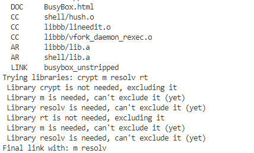

<!-- markdownlint-disable MD010 -->
# 基于busybox构建文件系统

对于嵌入式项目开发来说，往往使用Buildroot、Openwrt、Debian、Ubuntu等系统作为应用执行的平台，很少单独使用Busybox来构建系统。这是因为Busybox构建的系统只有基础目录和功能；为了满足应用开发需求，往往需要进行大量的第三方软件移植，这是十分低效的方式。不过从学习的角度来说，BusyBox又是比较适合入门的系统，可以理解构建系统需要的文件和执行流程，具体目录如下所示。

- [下载和编译](#download_compiler)
- [构建目录和配置文件](#create_dir_file)
  - [创建文件系统关机目录](#create_important_dir)
  - [创建inittab文件](#create_inittab)
  - [创建passwd文件](#create_passwd)
  - [创建fstab文件](#create_fstab)
  - [创建rcS文件](#create_rcs)
  - [创建静态IP文件](#create_static_ip)
  - [创建dns服务器文件](#create_dns)
- [系统运行库支持](#add_gcc_library)
- [文件系统打包](#filesystem_package)
- [总结](#summary)
- [下一章节](#next_chapter)

## download_compiler

第一步当然是下载基础的busybox源码，然后编译，编译命令如下所示。

```shell
# 下载busybox, 解压并进入
wget https://busybox.net/downloads/busybox-1.36.1.tar.bz2
tar -xvf busybox-1.36.1.tar.bz2
cd busybox-1.36.1/

# 关闭后保存，开启编译
make -j4 ARCH=arm CROSS_COMPILE=arm-none-linux-gnueabihf- menuconfig
make -j4 ARCH=arm CROSS_COMPILE=arm-none-linux-gnueabihf-
make ARCH=arm CROSS_COMPILE=arm-none-linux-gnueabihf- install

# 编译好的文件保存在"$PWD/_install"目录下，默认为
bin/
linuxrc/
sbin/
usr/
```

一般编译完成后，编译结果如下所示。



后面的Trying libraies是编译过程中出现的一些警告，不影响编译结果。这并不是报错，而是编译最终的库文件时libbusybox.so，需要提前剔除编译工具不支持的库或者链接，否则则会发生编译错误，详细可以看script/trylink中脚本。

```shell
while test "$LDLIBS"; do
    $debug && echo "Trying libraries: $LDLIBS"
    dropped_non_first_lib=false
    first_lib=true
    for one in $LDLIBS; do
        without_one=`echo " $LDLIBS " | sed "s/ $one / /g" | xargs`
        # "lib1 lib2 lib3" -> "-llib1 -llib2 -llib3"
        l_list=`echo " $without_one $CONFIG_EXTRA_LDLIBS " | sed -e 's: \([^- ][^ ]*\): -l\1:g' -e 's/^ *//'`
        test x"$l_list" != x"" && l_list="$START_GROUP $l_list $END_GROUP"
        $debug && echo "Trying -l options: '$l_list'"

        # 通过try命令，判断编译器是否支持相应的库，不支持则剔除，支持则保留
        # 最终保留m，resolv，不链接crypt，rt
        try $CC $CFLAGS $LDFLAGS \
                -o $EXE \
                $SORT_COMMON \
                $SORT_SECTION \
                $GC_SECTIONS \
                $START_GROUP $O_FILES $A_FILES $END_GROUP \
                $l_list
        if test $? = 0; then
            echo " Library $one is not needed, excluding it"
            LDLIBS="$without_one"
            $first_lib || dropped_non_first_lib=true
        else
            echo " Library $one is needed, can't exclude it (yet)"
            first_lib=false
        fi
    done
    # We can stop trying to drop libs if either all libs were needed,
    # or we excluded only the _first_ few.
    # (else: we dropped some intermediate lib(s), maybe now we can succeed
    # in dropping some of the preceding ones)
    $dropped_non_first_lib || break
done
```

至此，完成第一阶段工作，Busybox系统的编译工具完成。

## create_dir_file

第二步主要是创建目录，添加系统配置文件，执行启动流程。

具体文件目录可以参考：[busybox配置文件目录](./file/ch02-09/)

### create_important_dir

Linux文件系统需要一些关键目录的支持，这一步就是创建一些必要的目录，包含/dev、/etc、/lib、/proc、/root、/sbin、/sys、/tmp、/run等。

```shell
# 创建文件目录
mkdir dev etc lib proc root sys tmp run
mkidr etc/init.d
```

### create_inittab

Busybox属于传统的SysV init系统, 启动的init进程会解析/etc/inittab文件，然后执行对应的脚本。/etc/inittab文件是Linux系统初始化过程中的一个重要配置文件，它负责控制系统的运行级别以及定义系统启动时的各种行为和进程。

```shell
#inittab启动信息
vim etc/inittab

################ 文件内容 ################
# /etc/inittab
#
# Copyright (C) 2001 Erik Andersen <andersen@codepoet.org>
#
# Note: BusyBox init doesn't support runlevels.  The runlevels field is
# completely ignored by BusyBox init. If you want runlevels, use
# sysvinit.
#
# Format for each entry: <id>:<runlevels>:<action>:<process>
#
# id        == tty to run on, or empty for /dev/console
# runlevels == ignored
# action    == one of sysinit, respawn, askfirst, wait, and once
# process   == program to run

# Startup the system
::sysinit:/bin/mount -t proc proc /proc               # 挂载proc文件系统，用于查看系统信息
::sysinit:/bin/mount -o remount,rw /                  # 重新挂载根目录，设置为可读写(设置为只读后后续则不能修改文件系统)
::sysinit:/bin/mkdir -p /dev/pts /dev/shm             # 创建pts和shm目录
::sysinit:/bin/mount -a                               # 解析/etc/fstab，并挂载相应目录
::sysinit:/bin/mkdir -p /run/lock/subsys              # 创建/run/lock/subsys目录
::sysinit:/sbin/swapon -a                             # ‌swapon命令‌用于激活Linux系统中的交换空间

# 将系统关键文件软链接到设备文件目录
null::sysinit:/bin/ln -sf /proc/self/fd /dev/fd
null::sysinit:/bin/ln -sf /proc/self/fd/0 /dev/stdin
null::sysinit:/bin/ln -sf /proc/self/fd/1 /dev/stdout
null::sysinit:/bin/ln -sf /proc/self/fd/2 /dev/stderr
::sysinit:/bin/hostname -F /etc/hostname              # 读取/etc/hostname文件并设置主机名
# now run any rc scripts
::sysinit:/etc/init.d/rcS                             # 执行rcS中的启动脚本

# Put a getty on the serial port
console::respawn:/sbin/getty -L  console 0 vt100      # GENERIC_SERIAL，启用tty作为串口
ttymxc0::respawn:/sbin/getty -L ttymxc0 0 vt100       # 同时启用串口0作为输出

# Stuff to do for the 3-finger salute
#::ctrlaltdel:/sbin/reboot

# Stuff to do before rebooting
::shutdown:/sbin/swapoff -a                             # 停止所有交换空间
::shutdown:/bin/umount -a -r                            # 停止所有挂载的分区
```

### create_passwd

/etc/passwd文件是Linux系统中一个重要的配置文件，用于存储用户账户的信息。

其格式内容对应如下。

登录用户名:用户口令:用户UID:组UID:备注:$HOME:用户启动的shell

- 用户口令为了保证系统安全，保存在/etc/shadow中
- 用户启动的shell，包含如下。
  - /bin/sh：具体shell命令行
  - /bin/false：立刻退出，返回1的程序
  - /bin/true：立刻退出，返回0的程序
  - /bin/sync：当该用户执行操作时，系统会调用 sync 命令
  - /usr/sbin/nologin: 系统不会为其提供交互式 shell，而是输出一条提示信息，告知用户此账户不能登录。

这里展示具体项目中的passwd文件。

```shell
# 用户密码和启动执行应用
vim etc/passwd

################ 文件内容 ################
root:x:0:0:root:/root:/bin/sh
daemon:x:1:1:daemon:/usr/sbin:/bin/false
bin:x:2:2:bin:/bin:/bin/false
sys:x:3:3:sys:/dev:/bin/false
sync:x:4:100:sync:/bin:/bin/sync
mail:x:8:8:mail:/var/spool/mail:/bin/false
www-data:x:33:33:www-data:/var/www:/bin/false
operator:x:37:37:Operator:/var:/bin/false
nobody:x:65534:65534:nobody:/home:/bin/false
```

### create_fstab

/etc/fstab文件是Linux系统中一个至关重要的配置文件，它用于定义和管理文件系统的挂载信息。

1. 设备文件：指定需要挂载的设备或分区。可以使用物理设备名（如/dev/sda1）、UUID（如UUID=xxxx-xxxx-xxxx）或LABEL（如LABEL=MyData）来标识设备
2. 指定文件系统挂载的位置，即它在目录树中的路径。挂载点可以是任何一个空目录，如/表示根文件系统，/home表示用户目录挂载点
3. 文件系统类型：指定设备上的文件系统类型，如ext4、vfat、NTFS等。这是告诉内核如何处理该分区的重要信息。
4. 指定挂载该设备时所使用的特定参数选项，多个参数由逗号分隔。常见的挂载选项包括defaults（包含rw、suid、dev、exec等默认选项）、ro（只读模式）、rw（读写模式）、noatime（不更新文件访问时间以提升性能）、nodiratime（不更新目录访问时间）、user/nouser（允许/不允许普通用户挂载）、sync/async（同步/异步I/O操作）、noexec（禁止在文件系统上执行可执行文件）、nofail（即使设备在启动时不可用，系统仍会继续正常启动）等。
5. 指定是否启用dump备份程序。0表示不备份该分区，1表示允许dump备份。
6. 指定系统在启动时使用fsck工具检查文件系统的顺序。0表示不检查该文件系统，1通常用于根分区（/），表示启动时首先检查这个分区，2一般用于对其他分区进行检查（如/home、/var等）

```shell
# 文件系统信息
vim etc/fstab

################ 文件内容 ################
# <file system>	<mount pt>	<type>	<options>	<dump>	<pass>
/dev/root	/		ext2	rw,noauto	0	1
proc		/proc		proc	defaults	0	0
devpts	/dev/pts	devpts	defaults,gid=5,mode=620,ptmxmode=0666	0	0
tmpfs		/dev/shm	tmpfs	mode=0777	0	0
tmpfs		/tmp		tmpfs	mode=1777	0	0
tmpfs		/run		tmpfs	mode=0755,nosuid,nodev	0	0
sysfs		/sys		sysfs	defaults	0	0
```

### create_rcs

/etc/init.d/rcS是一个系统启动脚本文件，用于在Linux系统启动时执行一系列初始化操作。它通常位于根文件系统的/etc/init.d目录下。

```shell
# 系统启动时执行的脚本
vim /etc/init.d/rcS

################ 文件内容 ################
#!/bin/sh

# Start all init scripts in /etc/init.d
# executing them in numerical order.
#
for i in /etc/init.d/S??* ;do

	# Ignore dangling symlinks (if any).
	[ ! -f "$i" ] && continue

	case "$i" in
	*.sh)
		# Source shell script for speed.
		(
		trap - INT QUIT TSTP
		set start
		. $i
		)
		;;
	*)
		# No sh extension, so fork subprocess.
		$i start
		;;
	esac
done

# set global path
export PATH=/sbin:/bin:/usr/sbin:/usr/bin
export LD_LIBRARY_PATH=/lib:/usr/lib:/usr/local/lib
```

增加rcS的启动脚本内容S40network

```shell
#!/bin/sh
#
# Start the network....
#

# Debian ifupdown needs the /run/network lock directory
mkdir -p /run/network

case "$1" in
start)
	printf "Starting network: "
	/sbin/ifup -a
	[ $? = 0 ] && echo "OK" || echo "FAIL"
	;;
stop)
	printf "Stopping network: "
	/sbin/ifdown -a
	[ $? = 0 ] && echo "OK" || echo "FAIL"
	;;
restart|reload)
	"$0" stop
	"$0" start
	;;
*)
	echo "Usage: $0 {start|stop|restart}"
	exit 1
esac

exit $?
```

### create_static_ip

增加静态IP文件，"/sbin/ifup -a"是用于激活网络接口的命令，会读取"/etc/network/interfaces"文件，文件内容如下所示。

```shell
vim /etc/network/interfaces

# 内容如下
# The primary network interface, address and gateway set as the 
auto eth0
iface eth0 inet static
	address 192.168.1.125
	netmask 255.255.255.0
	gateway 192.168.1.1

# 设置回环地址
auto lo
	iface lo inet loopback

# 注意，address和gateway的设置根据路由器或者网关来定义，启动IP地址不能与当前局域网内设备冲突。
```

### create_dns

当Linux系统运行需要进行域名解析的命令，如ping、wget、curl时，系统会启动一个DNS查询，此过程会读取"/etc/resolv.conf"文件。

```shell
# 添加DNS服务器
vim /etc/resolv.conf  

# 内容如下
nameserver 223.5.5.5
nameserver 8.8.8.8
nameserver 8.8.4.4
```

## add_gcc_library

安装支持文件系统运行的动态库。前面提到，linux系统文件运行除了特殊编译全静态链接的，大部分都需要系统的C库支持。这部分直接复制编译工具下的lib目录即可，命令如下。

```shell
# 复制c++ lib
sudo cp -ravf $GCC_LIB/lib/*so* lib/

# 复制c lib到
sudo cp -ravf $GCC_LIB/libc/lib/*so* $NFS_PATH/lib/
```

至此，我们完成了构建最小文件系统的全部工作。如果后续需要扩展功能，就交叉编译相应的工具，将可执行文件和库放入对应的目录，就可以正常的被系统所访问。

## filesystem_package

不过对于下载工具或者Linux系统，可以按照需要打包成tar或img两种方式。

- tar打包方式

```shell
# 打包成tar格式
tar -vcjf rootfs.tar.bz2 *
```

- img打包方式

```shell
export root_name=arm-busybox
export root_size=1024

# 创建打包文件*.img
dd if=/dev/zero of=${root_name}.img bs=1M count=${root_size}
mkfs.ext4 ${root_name}.img

# 导入rootfs信息到img
# 原理就是将img文件以硬盘的形式挂载到系统中，然后将上述编译好的文件系统复制到其中，再移除硬盘，此时
sudo mount -o loop ${root_name}.img arm/  
sudo cp -arv rootfs/ arm/
sudo umount arm
```

打包好的硬盘img文件通过qemu-img文件管理

```shell
# 查看虚拟镜像的信息
qemu-img info *.img

# 调整硬盘容量
qemu-img resize *.img [size]
```

## summary

通过上述步骤，我们完成了最小文件系统的构建，具体流程如下所示。

1. 编译BusyBox源码，生成关键程序
2. 创建必要文件目录
3. 添加服务处理文件，如inittab、passwd、fstab、rcS
4. 添加系统运行库，主要是系统执行的必要动态库，如libc、libgcc等
5. 打包文件系统，生成img文件或者tar文件

另外，如果扩展第三方应用支持，还需要参考[嵌入式Linux平台软件的交叉编译](./ch01-04.linux_cross_compiler.md)中的实现，进行第三方软件交叉编译和移植。对于一个完整的项目，往往需要大量的第三方软件库的支持，如cjson、openssh、curl、ffmpeg、docker、qt-gui等；这时候就需要大量的交叉编译和移植工作，处理兼容性和不同版本组合后系统的稳定性，也是繁杂的工作；可以厂商基于busybox实现支持Qt的应用+gdb调试，就可以了解其它中繁琐和复杂。

那么组合构建更简单的编译方式便称为迫切的需求；将编译需要的环境，库和软件通过脚本的形式打包，构成了自动编译工具；做到开箱即可编译，可U-Boot或者Kernel通过menuconfig选项就可以添加第三方软件支持，Buildroot正是基于这个理念构建的项目。

## next_chapter

[返回目录](../README.md)

直接开始下一章节说明: [基于buildroot构建文件系统](./ch02-10.rootfs_buildroot.md)
