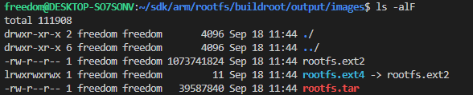
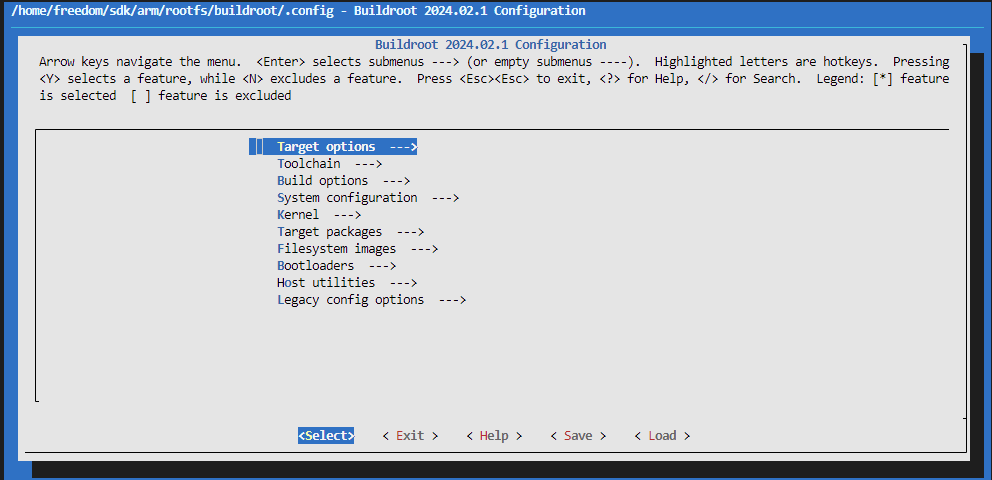
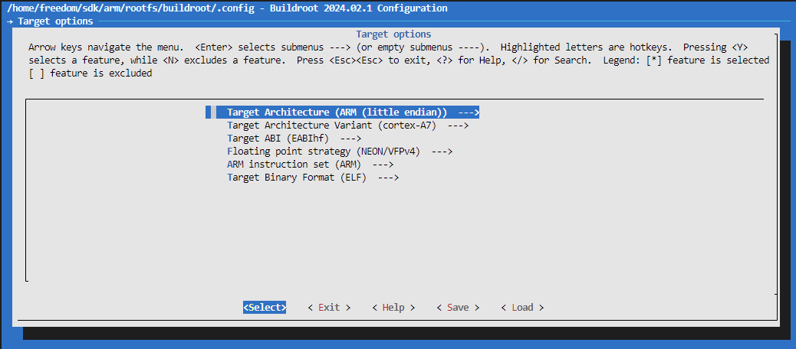
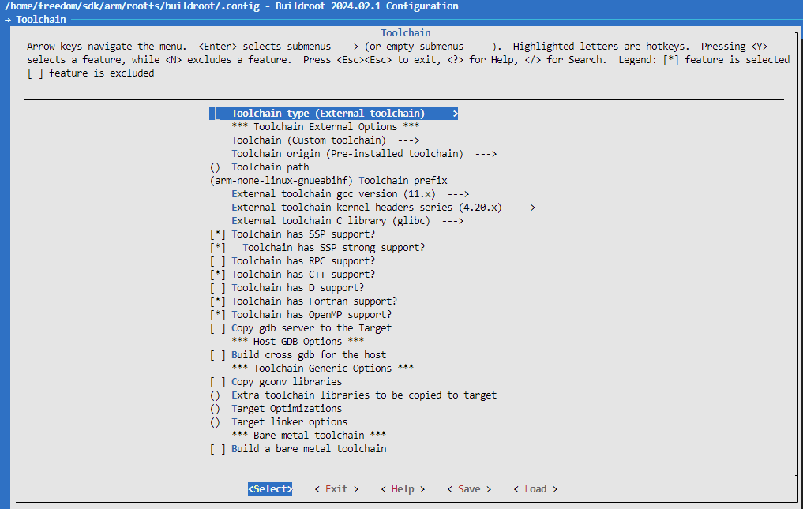
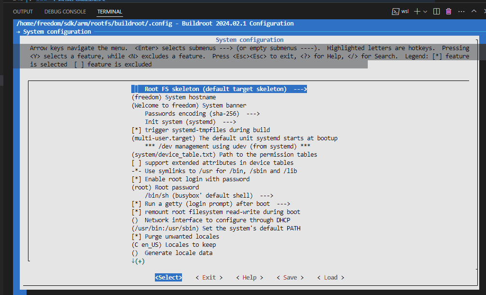
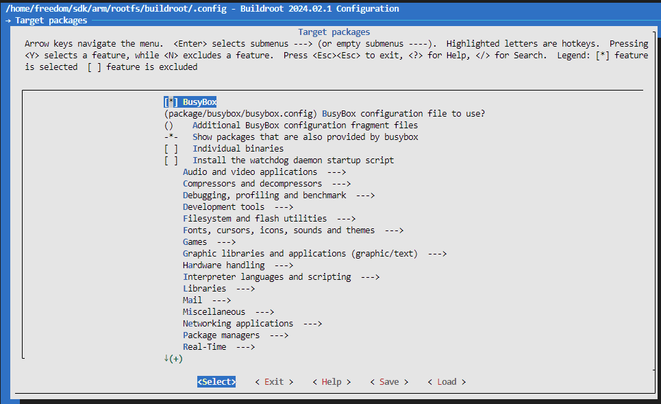

# 基于buildroot构建文件系统

上节描述了使用BusyBox构建系统的方法，可以看到需要自己创建目录和系统配置文件，最后生成的还是仅支持系统命令的最小Linux系统。在真实的应用中，可能需要图形(Qt)，网络(MQTT, HTTP)，数据库(QSlite)相关的库的支持，也就是需要大量的移植工作(参考[linux交叉编译移植](./ch01-04.linux_cross_compiler.md))，处理繁杂的兼容性问题。如何避免这些复杂的工作，提前将系统和第三方库以源码的形式整合，然后使用脚本，配置文件的方式进行管理，实现自动化构建，Buildroot就是基于这个思路实现的。

本节目录如下。

- [buildroot目录功能解析](#dir_analysis)
- [buildroot通用功能说明](#common_notes)
- [buildroot下载和编译方法](#compiler)
- [buildroot编译选项解析](#config_analysis)
- [下一章节](#next_chapter)

## dir_analysis

Buildroot是以BusyBox、Systemd等为核心，集成编译工具，第三方库，可执行文件和系统服务脚本的，用于文件系统的自动化构建方案。对于目前最新的BuildRoot，是支持Uboot和Kernel编译构建的，不过个人不建议使用，Uboot和Kernel下载和编译时间很长，而且Buildroot支持版本是主线的分支，不一定支持用户的开发板，因此一般单独编译。这里主要说明对于文件系统的编译实现，先讲解下目录中跟编译和构建息息相关的功能。

- arch 定义芯片平台相关的宏处理，不需要修改
- board 定义板级设备信息，不需要修改
- boot 包含了与bootloader相关的配置和文件，不需要修改
- **configs** 包含默认的配置文件，当然我们定义的配置文件也可以放置在此目录中，如果需要永久修改配置，基于此目录修改
- **dl** 编译中需要支持的库，在编译中会下载到此目录，在国内可能下载困难，可以自己下载放置到此目录中
- docs 存放了Buildroot的描述文档，对于熟悉和理解Buildroot非常有帮助
- fs 包含了Buildroot支持的文件系统的配置文件，开发者选择构建哪种类型的文件系统后指向内部的相应脚本
- linux 用于构建包含Linux内核的系统，此目录将包含与Linux内核相关的配置文件，通过buildroot构建内核时需要
- **output**输出目录, 构建好的文件系统存储目录
  - **build** 存放所有源码包解压出来的文件和编译过程中的中间文件，如果编译中出错，可修改此目录中源码文件解决
  - host 存放编译工具，会将选择的编译工具复制到此目录，用于后续编译
  - staging 用于存放编译过程中生成的库文件等，这些文件可能不会被直接包含在最终的根文件系统中，但用于编译过程中的链接
  - target 存放了针对目标架构的Linux文件结构，这将是最终根文件系统的基础
  - images 生成的镜像文件存放在此目录下，包括压缩后的根文件系统镜像等
- **package** 软件包管理目录，所有想要加入到Buildroot中的软件包都需要在此目录下进行配置。这包括了软件包的编译安装脚本和配置文件
- support buildroot支持的相关脚本、补丁以及测试程序，不需要修改
- **system** 描述编译构建出的文件系统的配置文件，允许对根文件系统进行定制，可自行添加修改
- toolchain 与编译构建套件相关的配置文件，Buildroot支持内部自动编译构建出编译套件，也支持使用外部的编译构建套件，不需要修改
- utils 包含了与Buildroot编译构建相关的各种工具，不需要修改

## compiler

### 下载安装包, 并解压

```shell
# 下载buildroot
wget https://buildroot.org/downloads/buildroot-2024.02.1.tar.gz
tar -xvf buildroot-2024.02.1.tar.gz
cd buildroot-2024.02.1/
```

### 配置编译项

buildroot的构建和uboot，kernel类似，支持默认配置文件，也支持通过菜单修改，这里使用默认配置文件导入的方式，定义文件名为configs/imx6ull_user_defconfig, 内容如下：

```shell
#更新配置文件
vim configs/imx6ullrmk_defconfig

############# imx6ullrmk_defconfig #############
# architecture
BR2_arm=y
BR2_cortex_a7=y
BR2_ARM_FPU_NEON_VFPV4=y

#
# Toolchain
#
BR2_TOOLCHAIN_EXTERNAL=y
BR2_TOOLCHAIN_EXTERNAL_CUSTOM=y
BR2_TOOLCHAIN_EXTERNAL_PREINSTALLED=y
BR2_TOOLCHAIN_EXTERNAL_PATH="/home/freedom/sdk/arm/support/compiler"
BR2_PACKAGE_PROVIDES_TOOLCHAIN_EXTERNAL="toolchain-external-custom"
BR2_TOOLCHAIN_EXTERNAL_PREFIX="arm-none-linux-gnueabihf"
BR2_TOOLCHAIN_EXTERNAL_CUSTOM_PREFIX="arm-none-linux-gnueabihf"
BR2_TOOLCHAIN_EXTERNAL_GCC_11=y
BR2_TOOLCHAIN_EXTERNAL_HEADERS_4_20=y
BR2_TOOLCHAIN_EXTERNAL_CUSTOM_GLIBC=y
BR2_TOOLCHAIN_EXTERNAL_CXX=y
BR2_TOOLCHAIN_EXTERNAL_FORTRAN=y
BR2_TOOLCHAIN_EXTERNAL_OPENMP=y
BR2_TOOLCHAIN_EXTERNAL_INET_RPC=n
BR2_TARGET_ROOTFS_EXT2_SIZE="1G"
BR2_KERNEL_MIRROR="https://mirrors.kernel.org/pub"

# system
BR2_TARGET_GENERIC_GETTY_PORT="ttymxc0"

# filesystem / image
BR2_TARGET_ROOTFS_EXT2=y
BR2_TARGET_ROOTFS_EXT2_4=y

# System configuration
BR2_TARGET_GENERIC_HOSTNAME="freedom"
BR2_TARGET_GENERIC_ISSUE="Welcome to freedom"
BR2_TARGET_GENERIC_ROOT_PASSWD="root"
```

将上述文件放置在buildroot/configs/目录下，执行编译脚本。

### 执行编译和生成文件

```shell

#生成.config文件
make imx6ullrmk_defconfig

#开始编译
make -j6
```

注意1: **Buildroot的make的编译过程包含两个方面，分别是软件下载和软件编译，其中软件下载可能是外网的软件，速度可能会比较慢，可以先下载下来后放置在根目录dl/下。**

注意2: **Buildroot中对应的软件在package/目录下，对应文件的.mk和.hash，如果希望替换成其它版本的软件，则两个文件都需要修改。**

等待编译完成后，output/images目录下即为编译好的虚拟硬盘文件，直接使用即可，可以直接用mount命令挂载查看。



```shell
# 修改系统变量配置，修改文件/etc/profile

#创建目录，并挂载文件系统
mkdir output/images/rootfs/
cd output/images
sudo mount -o loop rootfs.ext4 rootfs/
```

此时，就可以在rootfs中查看构建好的文件系统, 如果需要增加软件或者库支持，在buildroot配置项中增加相应工具即可。

## config_analysis

对于buildroot同样支持通过界面管理文件系统配置，命令如下所示。

```shell

# 进行buildroot的界面配置
make menuconfig

# 进行buildroot busybox的界面配置
make busybox-menuconfig
```

### 菜单主界面

其中buildroot的配置界面如下所示。



- **Target options** 定义芯片相关的平台配置，编译选项控制，以I.MAX6ULL为例。
- **Toolchain** 编译工具，可以使用buildroot提供的工具或者外部工具，这里使用外部工具
- Build options 编译选项，例如配置文件目录，下载目录，编译解压目录，网络下载地址等，一般使用默认不修改
- **System configuration** rootfs相关配置，包含用户名，欢迎语，是否支持root用户以及root密码等
- Kernel 支持内核编译的选项
- **Target packages** 支持的第三方程序和库文件，扩展命令时修改
- **Filesystem images** 支持的文件系统，容量以及其它特性
- Bootloaders 支持bootloader的编译选项，不需要配置
- Host utilities 增加host功能的组件，一般不需要配置
- Legacy config options 移除的配置选项修改，不需要配置

### 平台相关配置定义



Target options定义平台相关的配置

- Target Architecture: ARM(little endian), ARM小端模式
- Target Architecture Variant: 内核版本，Cortex-A7
- Target ABI: 编译器对应ABI接口，EABIhf, 表示带硬件浮点
- Float point Strategy: 浮点版本，这里选择NEON/VFPv4
- ARM instruction set: 指令集版本，ARM指令集
- Target Binary Format: ELF

### 编译工具相关配置



Toolchain 编译工具相关配置

- Toolchain type: External toolchain，外部工具
- Tool chain: Custom toolchain, 用户自定义的编译工具
- Toolchain origin: Pre-installed toolchain, 已经安装的编译工具
- Toolchain Path: 编译器路径，不选择则访问系统PATH路径
- Toolchain prefix: 编译器名称，arm-none-linux-gnuebaihf-
- xxx: 定义编译器版本信息和支持选项，按照实际情况定义，可在编译失败后重新调整

### 系统相关的配置



System configuration 主要定义rootfs相关的配置定义，其它关键的定义如下所示。

- System hostname: 定义系统主机名
- System banner: 定义启动后的欢迎语
  - Passwords encoding: 密码加密方式
  - **Init System**: 定义系统的基础框架，主要有busybox和systemd
- Enable root login with passwd: 是否允许root登录
- Root Passwd: root密码

### 第三方库支持

Target packages 编译选项用于控制支持第三方库内容。



其它配置选项根据实际需求配置。

## common_notes

### 如何在buildroot中修改busybox的配置选项

```shell
# 修改buildroot的配置选项
make menuconfig

# 修改busybox的配置选项
make busybox-menuconfig
```

### 如何解决buildroot编译时下载过慢的问题

buildroot在编译时，同步下载软件到dl目录下，编译结果则在output/host目录下，可以提前下载文件到dl目录，从而避免编译时下载过慢导致的失败问题。

### buildroot如何控制软件安装版本，添加不支持的软件编译方法

buildroot的菜单可以控制软件是否安装，不过具体的版本在package下定义，以ace为例。

如果希望更改版本，则需要修改ace.mk和ace.hash中修改

```shell
# /package/ace/ace.mk
ACE_VERSION = 7.1.1

# /package/ace/ace.hash
# 更改hash设计变量
# From https://download.dre.vanderbilt.edu/previous_versions/ACE-7.1.1.tar.bz2.md5:
md5  6c86ec6c7879703783b9749d5409a67f  ACE-7.1.1.tar.bz2

# Locally Computed:
sha256  fe5fdeab1dddf4fdd99f73c59420886cf61ca2ce92adf2cc6b612b752986df62  ACE-7.1.1.tar.bz2
sha256  687bf9d16119e0caf6fb5c18214928fd6ea0da10df91e906255b7613af8061d8  COPYING
```

## next_chapter

[返回目录](../README.md)

直接开始下一章节说明: [基于debian构建文件系统](./ch02-11.rootfs_debian.md)
