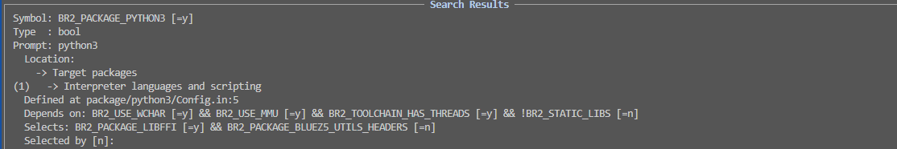
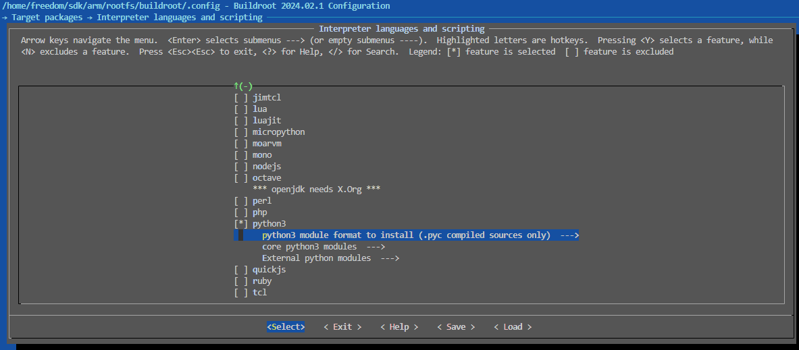
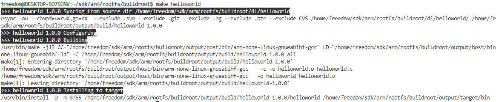
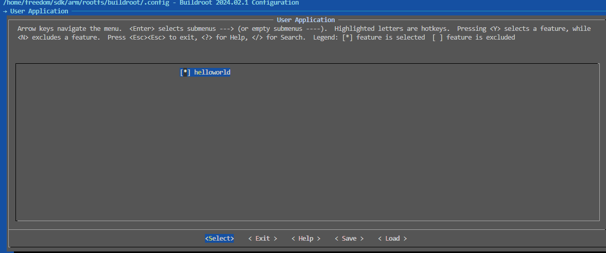

<!-- markdownlint-disable MD010 -->
# 基于Buildroot构建文件系统

使用BusyBox构建系统的方法，可以看到通过复杂的源码编译、目录创建、库移植和文件打包的流程；最后生成的还是仅支持系统命令的最小Linux文件系统。在具体的应用中，可能还需要图形(QT)，网络(mqtt、http)，数据库(qslite、mysql)，容器服务(docker)；这就需要第三方库支持，也就是需要大量的移植工作。这部分可以参考[嵌入式Linux平台软件的交叉编译](./ch01-04.linux_cross_compiler.md)，处理繁杂的兼容性问题。

如何避免这些复杂的工作，将基础系统和第三方库以源码的形式整合；然后使用自动化脚本，配置文件的方式进行管理系统功能，实现自动化构建；Buildroot就是基于这个思路实现的。为了详细说明Buildroot，本节从源码结构、编译和安装、编译选项等多方面进行说明；具体目录如下所示。

- [Buildroot目录功能说明](#dir_analysis)
- [Buildroot下载和编译方法](#compiler)
  - [下载Buildroot](#download_buildroot)
  - [更新配置选项](#update_config)
  - [编译文件系统打包](#compile_rootfs)
- [Buildroot编译选项解析](#config_analysis)
  - [Buildroot编译主界面](#main_menu)
  - [板级相关的配置信息](#board_config)
  - [编译工具设置](#toolchain)
  - [文件系统配置](#system_config)
  - [第三方库支持](#third_packages)
- [Buildroot添加自定义工程](#add_user_project)
- [Buildroot通用功能说明](#common_notes)
  - [在Buildroot中修改busybox的配置选项](#notes-1)
  - [解决Buildroot编译时下载过慢的问题](#notes-2)
  - [Buildroot如何控制软件安装版本，添加不支持的软件编译方法](#notes-3)
- [Buildroot编译问题解决说明](#issues_fix)
- [下一章节](#next_chapter)

## dir_analysis

Buildroot是以BusyBox、Systemd等为核心，集成编译工具、第三方库、可执行文件和系统服务脚本的，用于文件系统的自动化构建方案。对于目前最新的Buildroot，是支持Uboot和Kernel编译构建的；不过个人不习惯使用，Uboot和Kernel下载和编译时间很长，而且Buildroot支持的版本并非较新的版本，还需要
单独移植支持板级设备。因此使用外部的U-Boot和Kerenl自行移植(参考前面的章节实现)。另外Buildroot支持版本一般是主线的分支，不一定支持用户的开发板，需要单独的移植。本文中Buildroot作为文件系统进行单独编译，这里先讲解下目录中跟编译和构建相关的功能。

- arch 存放CPU架构相关的配置脚本，编译U-Boot和Kernel需要。
- board 定义板级设备信息，说明开发板使用的配置项。
- boot 定义spl-pub、grup、arm-trusted-firmware等BL1相关的启动文件，全编译构建时生成需要。
- **configs** 包含默认的配置文件，当然我们定义的配置文件也可以放置在此目录中，如果需要永久修改配置，基于此目录修改。
- **dl** 编译中存放下载的源代码，在编译中会下载到此目录，在国内可能下载困难，可以自己下载放置到此目录中。
- docs 存放了Buildroot的描述文档，对于熟悉和理解Buildroot非常有帮助。
- fs 包含了Buildroot支持的文件系统的配置文件，开发者选择构建哪种类型的文件系统后执行内部的相应脚本。
- linux 用于构建包含Linux内核的系统，此目录将包含与Linux内核相关的配置文件，通过Buildroot构建内核时需要。
- **output**输出目录, 构建好的文件系统存储目录。
  - **build** 存放所有源码包解压出来的文件和编译过程中的中间文件，如果编译中出错，需要分析此目录中源码文件解决。
  - host  存放编译工具链如gcc，arm-gcc等，会将选择的编译工具移动到此目录，用于后续编译。
  - staging 用于存放编译过程中生成的库文件等，这些文件可能不会被直接包含在最终的根文件系统中，但用于编译过程中链接。
  - target 存放了针对目标架构的Linux文件结构，这将是最终根文件系统的基础。
  - images 生成的镜像文件存放在此目录下，包括压缩后的根文件系统镜像等。
- **package** 软件包管理目录，所有想要加入到Buildroot中的软件包都需要在此目录下进行配置；这包括了软件包的编译安装脚本和配置文件。
- support Buildroot支持的相关脚本、补丁以及测试程序。
- **system** 描述编译构建出的文件系统的配置文件，允许对根文件系统进行定制，可自行添加修改。
- toolchain 与编译构建套件相关的配置文件，Buildroot支持内部自动编译构建出编译套件，也支持使用外部的编译构建套件。
- utils 包含了与Buildroot编译构建相关的各种工具。

注意: **在编译Buildroot时，相应的编译工具lib也会导入到文件系统中，也就是后续系统中的支持库会和编译工具一致。使用extern toolchain情况比较简单，后续编译程序也用此toolchain即可。使用的是内部toolchain，那么后续的程序和交叉工具必须使用编译Buildroot的同一版本，否则可能因为库版本不匹配而无法执行。**

## compiler

### download_buildroot

```shell
# 下载buildroot
wget https://buildroot.org/downloads/buildroot-2024.02.1.tar.gz
tar -xvf buildroot-2024.02.1.tar.gz
cd buildroot-2024.02.1/
```

### update_config

Buildroot的构建和uboot，kernel类似，支持默认配置文件，也支持通过菜单修改，这里使用默认配置文件导入的方式，定义文件名为configs/imx6ull_user_defconfig, 内容如下：

```shell
# 更新配置文件
vim configs/imx6ullrmk_defconfig

############# imx6ullrmk_defconfig #############
# architecture
BR2_arm=y
BR2_cortex_a7=y
BR2_ARM_FPU_NEON_VFPV4=y

#
# Toolchain
#
BR2_TOOLCHAIN_EXTERNAL=y
BR2_TOOLCHAIN_EXTERNAL_CUSTOM=y
BR2_TOOLCHAIN_EXTERNAL_PREINSTALLED=y
BR2_TOOLCHAIN_EXTERNAL_PATH="/home/freedom/sdk/arm/support/compiler"
BR2_PACKAGE_PROVIDES_TOOLCHAIN_EXTERNAL="toolchain-external-custom"
BR2_TOOLCHAIN_EXTERNAL_PREFIX="arm-none-linux-gnueabihf"
BR2_TOOLCHAIN_EXTERNAL_CUSTOM_PREFIX="arm-none-linux-gnueabihf"
BR2_TOOLCHAIN_EXTERNAL_GCC_11=y
BR2_TOOLCHAIN_EXTERNAL_HEADERS_4_20=y
BR2_TOOLCHAIN_EXTERNAL_CUSTOM_GLIBC=y
BR2_TOOLCHAIN_EXTERNAL_CXX=y
BR2_TOOLCHAIN_EXTERNAL_FORTRAN=y
BR2_TOOLCHAIN_EXTERNAL_OPENMP=y
BR2_TOOLCHAIN_EXTERNAL_INET_RPC=n
BR2_TARGET_ROOTFS_EXT2_SIZE="1G"
BR2_KERNEL_MIRROR="https://mirrors.kernel.org/pub"

# system
BR2_TARGET_GENERIC_GETTY_PORT="ttymxc0"

# filesystem / image
BR2_TARGET_ROOTFS_EXT2=y
BR2_TARGET_ROOTFS_EXT2_4=y

# System configuration
BR2_TARGET_GENERIC_HOSTNAME="freedom"
BR2_TARGET_GENERIC_ISSUE="Welcome to freedom"
BR2_TARGET_GENERIC_ROOT_PASSWD="root"
```

将上述文件放置在Buildroot/configs/目录下，执行编译脚本。

### compile_rootfs

这一步主要执行编译脚本，具体流程如下。

```shell
#生成.config文件
make imx6ullrmk_defconfig

#开始编译
make -j6
```

注意1: **Buildroot的make的编译过程包含两个方面，分别是软件下载和软件编译，其中软件下载可能是外网的软件，速度可能会比较慢，可以先下载下来后放置在根目录dl/下。**

注意2: **Buildroot中对应的软件在package/目录下，对应文件的.mk和.hash，如果希望替换成其它版本的软件，则两个文件都需要修改。**

等待编译完成后，output/images目录下即为编译好的虚拟硬盘文件，直接使用即可，可以直接用mount命令挂载查看。


```shell
# 修改系统变量配置，修改文件/etc/profile
# 创建目录，并挂载文件系统
mkdir output/images/rootfs/
cd output/images
sudo mount -o loop rootfs.ext4 rootfs/
```

此时，就可以在rootfs中查看构建好的文件系统, 如果需要增加软件或者库支持，在Buildroot配置项中增加相应工具即可。

## config_analysis

对于Buildroot同样支持通过界面管理文件系统配置，进入Buildroot输入make help可以看到Buildroot支持的功能，这里精简比较关键的功能进行说明。

```shell
Cleaning:
  clean                  - 删除编译生成的文件和目录
  distclean              - 删除所有的非源码文件，包含(.config)

Build:
  all                    - 编译整个系统
  toolchain              - 编译toolchain

Configuration:
  menuconfig             - 进入界面配置
  savedefconfig          - 保存当前的menuconfig配置，写入到BR2_DEFCONFIG指定的文件

Package-specific:
  <pkg>                  - 单独编译和安装指定软件
  <pkg>-dirclean         - 清除对应APP的编译目录
  <pkg>-rebuild          - 单独重新编译对应APP

busybox:
  busybox-menuconfig     - 运行busybox的菜单界面
  busybox-update-config  - 保存当前的busybox到package/busybox/busybox.config或者BUSYBOX_KCONFIG_FILE指定的文件

Documentation:
  manual                 - 以所有格式构建手册
  graph-build            - 生成构建时间的图表
  graph-size             - 生成文件系统大小的统计信息

Miscellaneous:
  make O=dir             - 将所有输出文件（包括 .config 文件）定位到指定的 "dir" 目录中。
```

对于用户来说，主要使用make menuconfig和make busybox-menuconfig两个命令，前者用于修改Buildroot的配置选项，后者用于修改busybox的配置选项。

### main_menu

其中Buildroot的配置界面如下所示。


- **Target options** 定义芯片相关的平台配置，编译选项控制，以I.MAX6ULL为例。
- **Toolchain** 编译工具，可以使用Buildroot提供的工具或者外部工具，这里使用外部工具
- Build options 编译选项，例如配置文件目录，下载目录，编译解压目录，网络下载地址等，一般使用默认不修改
- **System configuration** rootfs相关配置，包含用户名，欢迎语，是否支持root用户以及root密码等
- Kernel 支持内核编译的选项
- **Target packages** 支持的第三方程序和库文件，扩展命令时修改
- **Filesystem images** 支持的文件系统，容量以及其它特性
- Bootloaders 支持bootloader的编译选项，不需要配置
- Host utilities 增加host功能的组件，一般不需要配置
- Legacy config options 移除的配置选项修改，不需要配置

### board_config


Target options定义平台相关的配置

- Target Architecture: ARM(little endian), ARM小端模式
- Target Architecture Variant: 内核版本，Cortex-A7
- Target ABI: 编译器对应ABI接口，EABIhf, 表示带硬件浮点
- Float point Strategy: 浮点版本，这里选择NEON/VFPv4
- ARM instruction set: 指令集版本，ARM指令集
- Target Binary Format: ELF

### toolchain


Toolchain 编译工具相关配置

- Toolchain type: External toolchain，外部工具
- Tool chain: Custom toolchain, 用户自定义的编译工具
- Toolchain origin: Pre-installed toolchain, 已经安装的编译工具
- Toolchain Path: 编译器路径，不选择则访问系统PATH路径
- Toolchain prefix: 编译器名称，arm-none-linux-gnuebaihf-
- xxx: 定义编译器版本信息和支持选项，按照实际情况定义，可在编译失败后重新调整

### system_config


System configuration 主要定义rootfs相关的配置定义，其它关键的定义如下所示。

- System hostname: 定义系统主机名
- System banner: 定义启动后的欢迎语
  - Passwords encoding: 密码加密方式
  - **Init System**: 定义系统的基础框架，主要有busybox和systemd
- Enable root login with passwd: 是否允许root登录
- Root Passwd: root密码

### third_packages

Target packages 编译选项用于控制支持第三方库内容。


其它配置选项根据实际需求配置。这里需要注意，Buildroot支持的第三方库是很多的，在此目录下查找并不方便，可以通过在任意界面下，输入"/"进行搜索，例如希望支持python3，则弹出框中搜索"PACKAGE_PYTHON3"即可。



可以看到，在路径Target packages > Interpreter lanaguages and scripting中可以看到python3，选中即可。



## add_user_project

Buildroot支持添加用户自定义工程，主要流程如下。

- 在package目录下添加用户自定义工程helloworld，包含如下文件。

```shell
# /package/helloworld/helloworld.mk
################################################################################
#
# helloworld
#
################################################################################
# HELLOWORLD_SITE定义自定义文件存在的目录(这里为dl/helloworld)

HELLOWORLD_VERSION:= 1.0.0
HELLOWORLD_SITE:= $(CURDIR)/dl/helloworld
HELLOWORLD_SITE_METHOD:=local
HELLOWORLD_INSTALL_TARGET:=YES

define HELLOWORLD_BUILD_CMDS
	$(MAKE) CC="$(TARGET_CC)" LD="$(TARGET_LD)" -C $(@D) all
endef

define HELLOWORLD_INSTALL_TARGET_CMDS
	$(INSTALL) -D -m 0755 $(@D)/helloworld $(TARGET_DIR)/bin
endef

define HELLOWORLD_PERMISSIONS
	/bin/helloworld f 4755 0 0 - - - - -
endef

$(eval $(generic-package))

# helloworld/config.in
config BR2_PACKAGE_HELLOWORLD
    bool "helloworld"
    help
      add local app helloworld.
```

- 在上面指定的目录dl目录中放置helloworld工程，内容如下所示。

```c
// dl/helloworld/helloworld.c
#include <stdio.h>

void main(void)
{
    printf("Hello world.\n");
}

// dl/helloworld/Makefile
CPPFLAGS +=
LDLIBS +=

all: helloworld

helloworld: helloworld.o
	$(CC) $(CFLAGS) $(LDFLAGS) -o $@ $^ $(LDLIBS)

clean:
	rm -f *.o helloworld

.PHONY: all clean
```

此时可以使用make helloworld尝试编译安装自己添加的package，执行脚本如下。

```shell
make helloworld
```

此时可以看到编译成功，在output/host/bin目录下生成了helloworld文件，执行如下所示。



- 最后一步则将是自定义的helloworld添加到menuconfig菜单管理，这部分添加到根目录的Config.in文件中，记得要在基础的menu下。

```shell
menu "User Application"
	source "package/helloworld/Config.in"
endmenu
```

此时执行make menuconfig就可以找到如何添加我们自己的应用。

```shell
make menuconfig
```

执行结果如下。



## common_notes

### notes-1

在Buildroot中修改busybox的配置选项

```shell
# 修改Buildroot的配置选项
make menuconfig

# 修改busybox的配置选项
make busybox-menuconfig
```

### notes-2

解决Buildroot编译时下载过慢的问题

Buildroot在编译时，同步下载软件到dl目录下，编译结果则在output/host目录下，可以提前下载文件到dl目录，从而避免编译时下载过慢导致的失败问题。

### notes-3

Buildroot如何控制软件安装版本，添加不支持的软件编译方法

Buildroot的菜单可以控制软件是否安装，不过具体的版本在package下定义，以ace为例。如果希望更改版本，则需要修改ace.mk和ace.hash中修改

```shell
# /package/ace/ace.mk
ACE_VERSION = 7.1.1

# /package/ace/ace.hash
# 更改hash设计变量
# From https://download.dre.vanderbilt.edu/previous_versions/ACE-7.1.1.tar.bz2.md5:
md5  6c86ec6c7879703783b9749d5409a67f  ACE-7.1.1.tar.bz2

# Locally Computed:
sha256  fe5fdeab1dddf4fdd99f73c59420886cf61ca2ce92adf2cc6b612b752986df62  ACE-7.1.1.tar.bz2
sha256  687bf9d16119e0caf6fb5c18214928fd6ea0da10df91e906255b7613af8061d8  COPYING
```

## issues_fix

Buildroot是为了解决构建文件系统困难，来实现的自动化综合脚本项目；主要解决系统，库和程序之间的兼容性问题，如果一切顺利，会直接生成最终打包的文件系统。不过因为Linux系统版本，编译工具，安装第三方库版本的碎片化，Buildroot编译中出现错误仍然是存在的。当然这也并不是不可避免的，使用方案商提供的支持特定版本的SDK包和运行环境，严格按照流程执行，此时一般已经解决了编译时的错误问题，入门阶段也建议使用这种方案。不过如果希望摆脱这种限制，希望不受Ubuntu系统版本、系统环境情况、Buildroot的特定版本、编译器版本限制，就需要有解决编译issue的能力，这里分享些我处理的经验。

Buildroot编译异常主要是第三方库的编译失败，这里面主要有以下几类：

1. 缺少依赖库，主要为提示找不到相应的头文件；这类比较简单，直接根据头文件安装依赖库即可。
2. 程序编译出错，这里面就需要去"build/host/"目录下找到第三方文件，根据编译错误分析；这个主要需要C/C++程序的排错能力，大部分原因是编译工具升级导致语法和错误检测的变化，一些写法不在兼容
3. 执行脚本出错，主要是python、perl或shell命令行处理异常；这类比较复杂，有可能是python版本升级导致之前的一些写法不支持，或者直接执行出错；另外shell脚本则是处理不正确，导致编译失败。

在Buildroot编译中去解决这些问题，需要有如下能力。

1. 软件交叉编译经验和问题分析能力，参考[嵌入式Linux平台软件的交叉编译](./ch01-04.linux_cross_compiler.md)
2. C/C++语法基础，参考[cplusplus_application](./ch04-01.cpp_grammar.md)
3. python、perl、shell脚本调试能力

在编译时遇到问题，可以自己结合第三方编译的经验分析解决；不过一定不要陷入非解决不可的逻辑中，浪费太多时间，适当可以去搜索引擎检索相应错误，或者去软件官网看是否有同样的issue问题和解决办法。当然也可以查找软件对应的Buildroot选项，先关闭掉，有需要可以单独移植。这些都是可行的解决办法。当然这些解决方法也要总结下来，避免下次遇到时已经遗忘；这样才能快速高效的解决问题，事半功倍。

## next_chapter

[返回目录](../README.md)

直接开始下一章节说明: [基于debian构建文件系统](./ch02-11.rootfs_debian.md)
