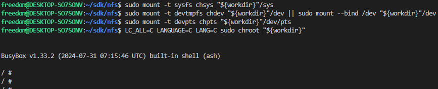

# 基于debian构建文件系统

基于BuildRoot我们已经可以较为轻松的构建可用的文件系统，不过还是有些缺陷，如下所示。

1. 系统需要增加新的软件和库时，仍然需要重新构建系统或者从源码编译移植
2. BuildRoot一定程度解决了包，编译器和系统之间的兼容性问题。不过对于不同版本(如Ubuntu18.04和Ubuntu22.04)，不同类型(如Fedora系统)的系统，编译问题仍然存在，且难度随着包支持增多而显著增加
3. BuildRoot支持的包虽然很多，不过仍然很难覆盖全面，一些小众需求的移植仍然困难

熟悉使用桌面端Ubuntu，Centos系统的了解，除了基础的源码编译，最主要的软件安装方式其实和Windows平台类似，使用离线包(dpkg)和在线安装(apt，yum)这两种方式。对于嵌入式设备来说，理论上当然也支持，将编译构建完成的系统以压缩包的形式存储在服务器中，通过命令下载，解压，构建，提供二进制格式的软件离线和在线安装包支持。Debian系统正是基于这一理念设计的。不过因为支持功能增多，Debian也会占用更多资源，所以一般用于更高性能的SOC。本节目录如下所示。

- [debian版本说明](#debian_ver)
- [debian编译脚本](#build_sh)
- [chroot沙箱安装debian脚本](#chroot_structure)
- [下一章节](#next_chapter)

## debian_ver

debian系统的版本说明如下所示。

- Debian 13: 代号为"trixie", 目前是测试版本，不建议使用
- Debian 12：代号为"bookworm"，这是一个稳定的版本，提供了长期支持（LTS）。
- Debian 11：代号为"Bullseye"，之前的稳定的版本，提供了长期支持（LTS）。
- Debian 10：代号为"Buster"，之前的稳定版本，也提供了LTS支持。
- Debian 9：代号为"Stretch"，这是Debian的一个早期稳定版本。
- Debian 8：代号为"Jessie"，这是Debian的一个较旧的稳定版本，但可能已不在接受官方更新。

本例在桌面端Ubuntu22.04系统中使用bookworm版本的debian进行构建，其它版本需要自己验证修改。

注意: **Ubuntu也是基于debian进行深度定制的系统，每个版本基于debian系统生成。考虑到兼容性，桌面端Ubuntu版本和需要构建的debian的版本最好一致，可以避免很多兼容性问题，以bookworm为例，桌面端版本选择Ubuntu 22.04 LTS。**

| Ubuntu版本 | debian代号 | debian版本 |
| --- | --- | --- |
| 24.04 LTS | trixie/sid | 13 |
| 23.10 | trixie/sid | 13 |
| 23.04 | bookworm/sid | 12 |
| 22.04 LTS | bookworm/sid | 12 |
| 21.10 | bullseye/sid | 11 |
| 20.04 LTS | bullseye/sid | 11 |
| 19.10 | buster/sid | 10 |
| 18.04 LTS | buster/sid | 10 |
| 17.10| stretch/sid | 9 |
| 16.04 LTS | stretch/sid | 9 |
| 15.10 | jessie/sid | 8 |
| 14.04 LTS | jessie/sid | 8 |

## build_sh

快速构建Debian系统的脚本如下所示。

声明全局环境。

```shell
# 声明全局变量
export NFS_PATH="/home/freedom/Desktop/user_git/sdk/nfs"
```

本例程中以清华源的镜像构建debian文件系统，执行构建脚本如下所示。

```shell
OPT_OS_VER=bookworm

run_as_client() {
    $@ > /dev/null 2>&1
}

# 挂载系统目录到用户目录()
mount_chroot()
{
    sudo mount -t proc chproc "${NFS_PATH}"/proc
    sudo mount -t sysfs chsys "${NFS_PATH}"/sys
    sudo mount -t devtmpfs chdev "${NFS_PATH}"/dev || sudo mount --bind /dev "${NFS_PATH}"/dev
    sudo mount -t devpts chpts "${NFS_PATH}"/dev/pts
}

# 移除系统目录
umount_chroot()
{
    while grep -Eq "${NFS_PATH}.*(dev|proc|sys)" /proc/mounts
    do
        sudo umount -l --recursive "${NFS_PATH}"/dev >/dev/null 2>&1
        sudo umount -l "${NFS_PATH}"/proc >/dev/null 2>&1
        sudo umount -l "${NFS_PATH}"/sys >/dev/null 2>&1
        sleep 5
    done
}

# 1. 实现构建系统的必要环境
sudo apt-get install debootstrap debian-archive-keyring qemu-user-static -y

# 2. 使用debootstap完成从镜像源下载文件
if [ ! -d ${NFS_PATH}/bin/ ]; then
    sudo debootstrap --foreign --verbose  --arch=${CHIP_ARCH} ${OPT_OS_VER} ${NFS_PATH}  http://mirrors.tuna.tsinghua.edu.cn/debian/
fi

# 安装qemu-*-static
sudo chmod -Rv 777 ${NFS_PATH}/usr/
cp /usr/bin/qemu-${qemu_arch}-static ${NFS_PATH}/usr/bin/
chmod +x ${NFS_PATH}/usr/bin/qemu-${qemu_arch}-static

# 基于debootstrap完成后续安装
cd ${NFS_PATH}
mount_chroot

# 3. 进行debootstrap第二部分的安装
LC_ALL=C LANGUAGE=C LANG=C sudo chroot ${NFS_PATH} /debootstrap/debootstrap --second-stage --verbose

# 安装必要的软件
LC_ALL=C LANGUAGE=C LANG=C sudo chroot ${NFS_PATH} apt-get install vim libatomic1 -y

umount_chroot
```

通过上述步骤就可以构建完成基于debian的系统。debian系统的安装主要有debootstrap命令完成，主要包含以下几部分。

1. 通过debootstrap从镜像源下载文件，构成debian集成文件
2. 通过chroot配合qemu-x-static搭建虚拟环境，通过debootstrap文件构建完整系统
3. 通过apt-get，dpkg等工具安装系统比较文件如vim，net-tools等

### chroot_structure

可以直接使用chroot进入沙箱模式配置debian系统。

```shell
# 进入构建目录
cd "${NFS_PATH}"/

# 进入nfs系统
workdir=$(pwd)
sudo mount -t proc chproc "${workdir}"/proc
sudo mount -t sysfs chsys "${workdir}"/sys
sudo mount -t devtmpfs chdev "${workdir}"/dev || sudo mount --bind /dev "${workdir}"/dev
sudo mount -t devpts chpts "${workdir}"/dev/pts
LC_ALL=C LANGUAGE=C LANG=C sudo chroot "${workdir}"
```



## next_chapter

[返回目录](../README.md)

直接开始下一章节说明: [基于ubuntu构建文件系统](./ch02-12.rootfs_ubuntu.md)
