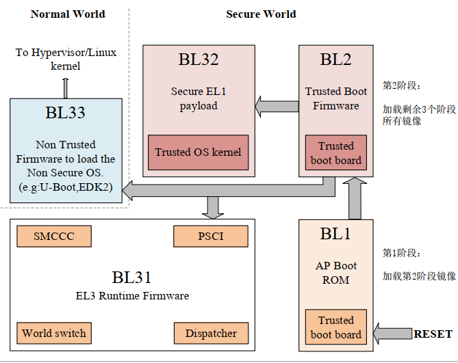

# U-Boot SPL流程和TF-A机制

## U-Boot SPL流程

在传统的Linux启动流程中，系统上电后的执行顺序如下。

BootROM=> U-Boot => Linux Kernel => System Rootfs

典型的按照这个流程启动的芯片，整理表格如下。

| Boot stage number | Terminology #1 | Actual program name | Image Name |
| --- | --- | --- | --- |
| 1 | Primary Program Loader | ROM code | BootRom |
| 2 | - | U-Boot | U-Boot.bin |
| 3 | - | Kernel | zImage/*.dtb |
| 4 | - | rootfs | rootfs |

进一步详细的说明如下所示。

1. 上电后，BootROM首先启动
2. BootROM根据外部boot相关引脚的配置，初始化存储和DRAM接口，将U-Boot从存储(EMMC, SDCard等)加载到DRAM
3. 加载完毕后，跳转到加载U-Boot的地址，U-Boot启动执行
4. U-Boot完成进一步初始化，从其它地址(存储，网络，USB等)加载设备树和kernel到DRAM中，跳转到执行内核Kernel
5. Kernel进行器件驱动的配置，结束后，加载文件系统，并执行起始进程(进程0，如buildroot中的/sbin/init)，之后就是我们了解的Linux服务启动的内容。

早期的芯片基本大都按照这个流程设计。对于嵌入式Linux的SOC来说，虽然支持EMMC，SDCard，Nand FLASH等多种存储介质，但这些空间不能直接执行命令，需要将数据加载到内存中才能执行。这里的内存主要指内部的SRAM和外部的DRAM，内部SRAM容量很小，一般不超过256KB，外部DRAM则容量很大，例如I.MX6ull可以支持3GB以上。

如果启动BootROM直接加载U-Boot，那么容量远远超过SRAM的大小，只能将U-Boot加载到DRAM中执行，这就需要在ROM中集成DRAM驱动的实现。理论上这也能满足需求，毕竟直接加载U-Boot的方式，在中低端SOC仍然有大量的市场。不过对于性能更强的芯片，适用DRAM的型号五花八门，即使ROM也只能做到部分兼容，这就限制了芯片的使用场景。

那么有解决办法吗？当然有，前面提到内部SRAM也可以执行代码，不过容量很小只能运行少量的代码，那么裁剪U-Boot代码，只实现部分初始化和从外部存储介质搬运数据的功能，容量就可以做到很小，能够在内部SRAM控制执行，这就是我们提到了U-Boot SPL启动方式。通过将U-Boot SPL固件加载到内部SRAM中，在SPL固件中执行DRAM的初始化，以及U-Boot从存储到DRAM的搬运工作，然后跳转U-Boot执行后续动作，启动流程就扩展如下所示。

BootRom => U-Boot SPL => U-Boot => Linux Kernel => System Rootfs

按照这个框架启动流程如下。

| Boot stage number | Terminology #1 | Actual program name | Image Name |
| --- | --- | --- | --- |
| 1 | Primary Program Loader | ROM code | BootRom |
| 2 | - | U-Boot SPL | U-Boot-spl.bin |
| 3 | - | U-Boot | U-Boot.bin |
| 4 | - | Kernel | zImage/*.dtb |
| 5 | - | rootfs | rootfs |

整个流程和上面类似，只不过在BootROM和U-Boot执行中间多了个步骤，整理起来如下所示。

1. 上电后，BootROM首先启动
2. BootROM根据外部boot相关引脚的配置，初始化存储，将U-Boot SPL从存储(EMMC, SDCard等)加载到内部SRAM
3. 加载完毕后，跳转到加载U-Boot SPL的地址，U-Boot SPL启动执行
4. 在U-Boot SPL中完成DRAM的硬件初始化，然后将真正的U-Boot从存储中加载到DRAM中
5. U-Boot完成进一步初始化，后续流程和之前一致。

U-Boot SPL可以将BootROM实现的DRAM初始化转换为由外部固件U-Boot SPL实现，这样就可以随时修改适配DRAM驱动，增加了灵活性和兼容性，不过也额外增加了U-Boot SPL的开发，相应增加开发的难度。可以看到，U-Boot SPL是对旧有启动流程的优化，只是在U-Boot之前单独实现DRAM驱动的固件，不过这就将DRAM驱动不在固化在芯片ROM中，可以后期修改，也就可以支持更多的DRAM器件。U-Boot SPL和Trust Zone并没有关联，不过理解U-Boot SPL有助于理解TrustZone执行流程，下面详细进行说明。

## TrustZone和TF-A流程

在智能手机，智能家居飞速发展的当下，指纹，面部识别，虹膜识别成为现代电子产品功能的一部分。那么如何存储管理这些个人身份数据信息，保证安全，ARM在ARMv7-A架构后提供了TrustZone硬件解决方案。TrustZone在概念上将SoC的硬件和软件资源划分为安全(Secure World)和非安全(Normal World)两个世界，所有需要保密的操作在安全世界执行（如指纹识别、密码处理、数据加解密、安全认证等），其余操作在非安全世界执行（如用户操作系统、各种应用程序等），安全世界和非安全世界通过一个名为Monitor Mode的模式进行转换，而其它操作运行在非安全世界。那么什么是TF-A，TF-A是定义的支持TrustZone方案的芯片启动流程，只有按照此顺序启动对应的固件，才能提供硬件安全的支持。

这里展示ARM提供TrustZone启动的执行框架。



看到这个图，上来肯定是迷惑的，毕竟这张图有很多知识点可以讲，我们先从每一块的名字讲解。

1. BL1, Boot stage 1，工作在Secure World，启动第一阶段，复位时运行代码，主要执行初始化CPU，从存储中加载BL2，类似上面的BootROM固件，虽然ARM也提供标准固件，不过一般都由芯片厂商内部定义的BootROM实现
2. BL2, Boot Stage 2, 工作在Secure World，启动第二阶段，配置DRAM，并将BL31，BL32，BL33加载到指定存储中，类似上面的SPL固件，不过还包含一些安全启动固件扩展
3. BL31，其实叫做 Boot Stage 3-1，工作在Secure World，是启动第三阶段的一部分，主要提供EL3权限的Runtime Firmware
4. BL32, Boot Stage 3-2, 工作在Secure World，是启动第三阶段的一部分，主要提供运行在EL1安全系统固件(Trust OS Kernel)
5. BL33，Boot Stage 3-3, 工作在Normal World，是启动第三阶段的一部分，这就是我们上面正常启动的流程，也就是U-Boot

理解了这几个参数，图上执行流程就比较简单简答了。

1. 系统复位后，上电执行BootROM，也就是BL1阶段
2. 在BL1阶段将BL2的代码加载到SRAM中，并跳转执行，此时BL1阶段结束
3. BL2阶段主要执行DRAM配置和部分安全相关的初始化配置，同时加载固件BL31，BL32，BL33，跳转执行，此时BL2阶段结束
4. BL3-n阶段则比较特殊，BL3-3为正常环境，执行后续的U-Boot，Kernel，以及文件系统的流程
5. BL3-1，BL3-2则相当于运行在后台的安全系统，为后续的应用提供安全服务，并一直存在于芯片的运行周期中

可以看到，每个阶段都有着相应的执行意义，BL31，BL32，BL33虽然流程上启动有先后顺序，但在启动后是并行执行的，分别执行在不同的CPU环境中，这样就从硬件上实现了隔离，具有更高的安全性，在系统最终指向中，BL31，BL32与后续启动Linux并行指向，提供安全相关的服务。


不过这里有个注意点，那就是BL31，BL32并不一定都支持，可以不存在，BL33则一般只需U-Boot，则必须要存在。如果软件上不支持，那么整个启动方式就回归上面提到的U-Boot SPL的模式，另外如果ROM支持直接加载BL3阶段的固件到DRAM，那么BL2也可以不存在，这就要根据具体芯片的特性具体分析，具有很大的灵活性。

关于TF-A的源码，参考地址如下。

```shell
git clone https://github.com/ARM-software/arm-trusted-firmware.git
```

## RockChip例程

这里以RockChip官网的启动选项来展示TF-A的实际运行流程，具体网址：[rockchip官网启动说明](https://opensource.rock-chips.com/wiki_Boot_option)


按照流程来说，详细理解这张图对应关系如下。

1. BootROM: 对应启动第一阶段，也就是BL Stage 1（BL1），负责加载idbloader.img(包含SPL和TPL)
2. idbloader.img: 对应启动第二阶段，也就是BL Stage 2（BL2），包含两个步骤，SPL和TPL，SPL负责DRAM的初始化，执行下一阶段的加载，TPL负责安全相关的预处理
3. trust.img和uboot.img：对应启动的第三阶段，也就是BL32的Trust OS Kernel和BL33的U-Boot执行。
4. 后面就是正常的内核加载和文件系统解析执行，比较好理解

另外上面也提到了，阶段1始终在ROM中，它可以加载阶段2，也可以直接加载阶段3，如果加载阶段3，按照注释的说明，就会执行trust.img，这就和最初的U-Boot启动流程一致。

BootROM => U-Boot => Linux Kernel => System Rootfs

如果启用TrustZong机制，则必须加载阶段2，此时流程如下。


## 总结

至此，关于U-Boot SPL启动流程，以及ARM的TF-A机制进行了部分讲解，当然这部分只涉及启动的部分，主要用于芯片移植中需要，大部分开发者并不需要接触。不过理解了这个机制，就可以理解更新的芯片如全志H618，RockChip的RK3568, RK3588，ST的STM32MP1这类芯片的启动流程，可以更好的理解SDK的编译流程，事半功倍。

## next_chapter

[返回目录](./SUMMARY.md)

直接开始下一章节说明: [Linux驱动开发](./ch03-00.driver_design.md)
