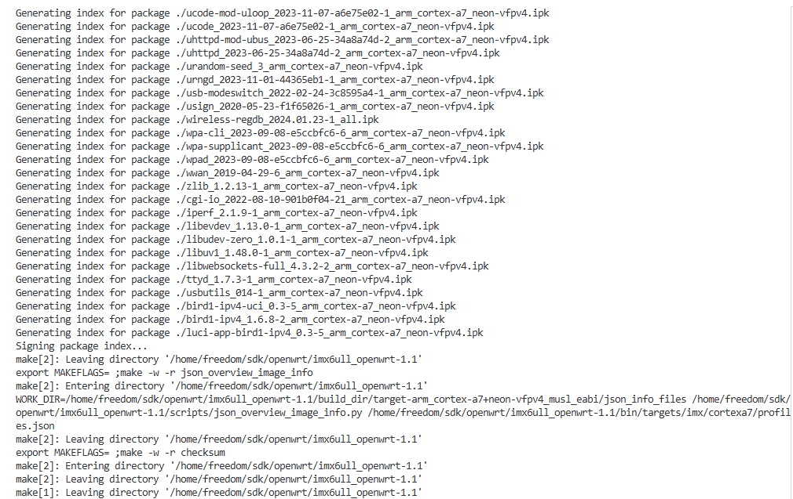
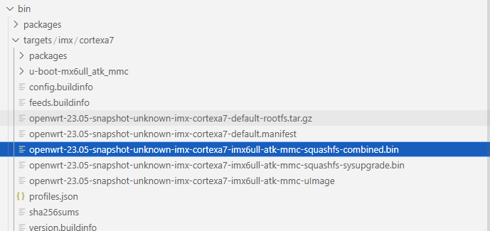

# 基于openwrt构建系统平台

openwrt是一个基于busybox构建的嵌入式Linux系统平台；与buildroot功能类似，均通过自动化脚本和配置文件管理系统功能，实现嵌入式Linux系统的自动化构建。它不仅包含基础系统组件，还支持集成第三方库和应用，适用于需要定制化嵌入式系统的场景（如路由器、物联网设备等）。不过和buildroot相比，openwrt在文件系统上，集成了一套用于网络数据管理的专用软件，相对来说更加复杂；openwrt虽然支持使用外部交叉编译工具和内核，但在实践中会带来很多的编译问题，修改也十分复杂，因此建议还是使用openwrt适配的工具进行编译和处理。

本节中，将从openwrt文件目录和菜单选项解析，I.MX6ULL和T113-i平台支持openwrt，来阐述openwrt系统构建方法。

## config_analysis

对于openwrt系统的SDK，主要从以下两个方面。

1. openwrt sdk文件目录功能说明
2. 菜单选项和功能说明

### dir_analysis

关于openwrt的sdk目录和相关功能说明如下。

- **bin 该目录用于存放编译生成的二进制文件，像编译好的固件文件、工具程序等最终产物都会存放在这里**。
- build_dir 此目录是编译过程的工作目录，会解压从网络下载的软件包源码，并且进行编译操作。
- config 存放配置文件，这些文件定义了编译选项、系统设置等，影响着整个系统的编译和构建过程。
- **dl 默认的下载目录，存放从网络下载的软件包源码压缩包**。
- include 包含编译过程中使用的公共头文件、宏定义和配置文件
- LICENSE 记录了openwrt的开源许可证信息，说明软件的使用、分发等相关法律条款。
- package 存放各种软件包的配置文件和源码。每个软件包有独立的子目录，包含Makefile等文件，用于描述软件包的编译、安装等信息。
- scripts 存放各种脚本文件，用于辅助编译、固件生成、文件操作等任务
- target 包含针对不同硬件平台的配置和补丁文件，用于编译适配特定硬件的固件
  - linux 用于指定嵌入式Linux平台下芯片对应配置和补丁，平台相关修改此目录下指定文件
- toolchain 该目录存放编译工具链，包含编译器、链接器等工具，用于将源码编译成目标平台可执行的二进制文件。
- tools 存放编译过程中使用的各种工具，这些工具为编译工作提供支持，协助完成代码编译、打包等操作。


## imx6ull_openwrt

openwrt源码开源在: <https://github.com/openwrt/openwrt>，一般选择某个较近的release版本进行移植；再完成本篇前，较近的版本如下。

- <https://github.com/openwrt/openwrt/archive/refs/tags/v24.10.2.tar.gz>

不过使用通用的版本对于特定平台可能支持的并不完善，可以采用github上已经开源的版本；本文则先以可以简单可移植的版本来验证并说明openwrt的使用方法，再以如何从基础的openwrt系统进行编译。对于i.MX6ULL平台，可使用如下链接快速应用。

- <https://github.com/boxwoodt/imx6ull_openwrt>

注:**openwrt的编译十分依赖外部的软件资源，如果没有科学上网，建议使用打包完善带dl下载包的sdk，否则编译时间无法估计。**

使用已经完善修改后的openwrt系统下载编译比较简单，具体流程如下所示。

```shell
# 安装必要的依赖包
# 注意新版本Ubuntu移除了python2的支持，可以使用手动安装或者自行编译安装
sudo apt-get install subversion g++ zlib1g-dev build-essential git python3 libncurses5-dev gawk gettext unzip file libssl-dev wget libelf-dev ecj fastjar java-propose-classpath asciidoc bzip2 libz-dev libtool

# 下载openwrt源码
wget https://github.com/boxwoodt/imx6ull_openwrt/archive/refs/tags/v1.1.tar.gz

# 解压并进入目录
tar -xvf v1.1.tar.gz
cd v1.1/

# 配置.config
cp atk_imx6ull_defconfig .config

# 更新openwrt软件源(需要科学外网, 否则可能会失败)
./scripts/feeds update -a
./scripts/feeds install -a

# 下载所有可用文件，后续进行编译
make -j4 download V=s
make -j8 V=s
```

编译成功后，具体显示如下所示。



此时在bin/target/imx/cortexa7目录下，包含对应的打包文件，如下所示。

  

此文件可通过balenaEtcher烧录到SD卡中，烧录成功后启动即可。

## next_chapter

[返回目录](../README.md)

直接开始下一章节说明: [基于armbian构建系统平台](./ch02-15.rootfs_armbian.md)
