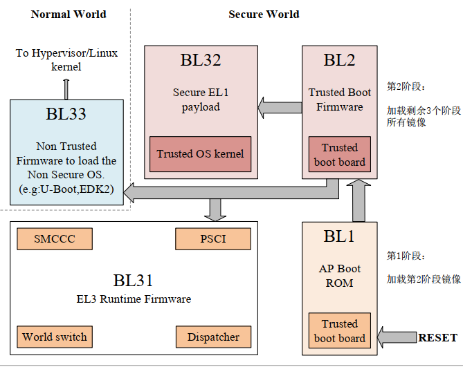
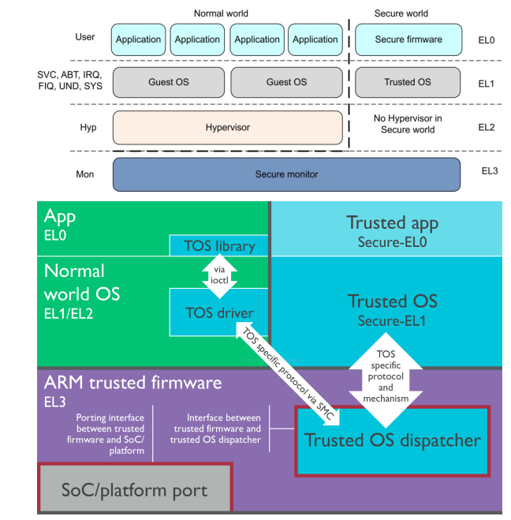
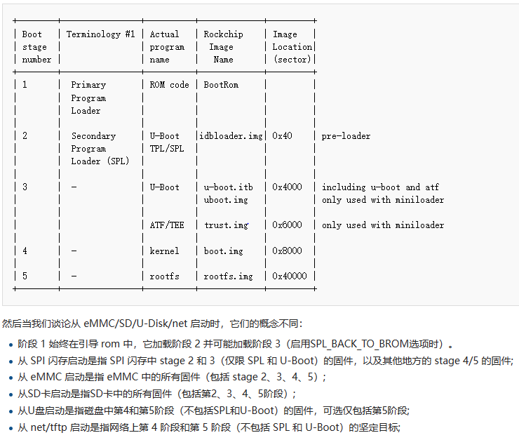
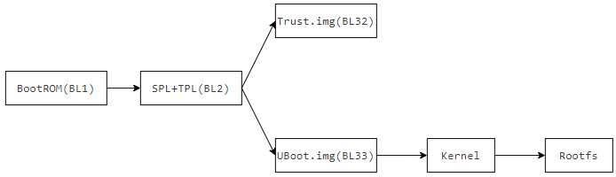

# U-Boot SPL流程和TF-A机制

## U-Boot SPL流程

在传统的Linux启动流程中，系统上电后的执行顺序如下。

BootROM => U-Boot => Linux Kernel => System Rootfs

各部分说明如下。

- BootROM：由芯片厂商开发的，固化再芯片内部ROM的代码。主要实现不同的启动方法，如根据Boot引脚选择SD卡、NAND、EMMC等启动方式，都是BootROM实现的功能。
- U-Boot：开源引导加载程序，提供启动相关处理的功能。如引导加载内核和设备树，并提供内核调用文件系统的接口。
- Linux Kernel：系统平台的核心组件，负责管理系统的硬件和软件资源。
- System Rootfs：目录和文件的合集，提供Shell命令、文件和配置等内容。

典型的按照这个流程启动的芯片，整理表格如下。

| Boot stage number | Terminology #1 | Actual program name | Image Name |
| --- | --- | --- | --- |
| 1 | Primary Program Loader | ROM code | BootRom |
| 2 | - | U-Boot | U-Boot.bin |
| 3 | - | Kernel | zImage/*.dtb |
| 4 | - | rootfs | rootfs |

启动进一步详细的说明如下所示。

1. 上电后，BootROM首先启动，此时进入启动流程。
2. BootROM根据引脚配置，初始化存储和DRAM接口；将U-Boot从存储(包括NAND、EMMC、SDCard、USB等)加载到外部DRAM中；对于BootROM，部分芯片还负责支持固件下载功能。
3. U-Boot加载完毕后，BootROM控制跳转到U-Boot的地址，开始执行(调试口看到的打印开始)。
4. U-Boot完成进一步初始化，从其它地址(包括内部存储、网络、USB等)加载设备树和kernel到外部DRAM中，跳转到内核执行。
5. Kernel进行硬件环境初始化，加载驱动配置和文件系统，然后执行起始进程，后续则是Linux服务启动的内容。

注: **Linux内核中定义的起始进程为"/sbin/init，/etc/init，/bin/init，/bin/sh"中任选一个，需要在文件系统中包含，否则系统会加载失败。**

早期的SOC芯片，例如I.MX6ULL就是按照这个流程设计。对于嵌入式Linux的SOC来说，虽然支持EMMC、SDCard、Nand FLASH等多种存储介质存储应用代码，但这些空间不能直接执行命令，需要将数据加载到内存中才能执行。这里的内存主要指内部的SRAM和外部的DRAM(如DDR3、DRR4等)，其中内部SRAM容量很小，一般不超过256KB，只能运行少量的代码；外部DRAM则容量较大，例如I.MX6ULL最大可以支持3GB，部分芯片可以支持8G或者更大。

对于启动BootROM直接加载U-Boot的场景，其容量远远超SRAM的大小，因此完整的U-Boot只能加载到外部DRAM中执行，这就需要在ROM中除了继承存储固件外，还需要集成外部DRAM驱动的实现。理论上这也能满足需求，毕竟直接加载U-Boot的方式，在中低端SOC仍然有大量的市场。不过对于性能更强的芯片，适用DRAM的型号五花八门，特别是部分即使ROM也只能做到部分兼容，这就限制了芯片的使用场景。另外传统加载方式还有一个更致命的缺点，因为ROM代码在芯片设计时固化，如果实现安全相关代码整合，遭遇漏洞时除了芯片升版召回无法修复；如果不支持安全相关认证校验，允许任意固件更新，在某些场景时不可接受的。因此有个启动后在内部执行，无法外部监测且支持随时更新的固件方案被设计用于处理此类问题；U-Boot SPL方案正是在这个背景下设计来解决问题。

U-Boot SPL的工作原理，正是通过前面提到内部SRAM也可以执行代码实现的。内部SRAM容量很小只能运行少量的代码，那么裁剪U-Boot代码，只实现外部DRAM初始化和搬运数据的功能，同时集成一些认证签名的实现，容量就可以做到很小，满足在内部SRAM控制执行的需求。例如接触到的全志的T113_i、瑞芯微rk3506都是使用此方案实现启动。比起传统的启动方式，可以灵活适配多种DRAM方案，实现固件签名认证的安全功能，越来越成为嵌入式开发的主流方案。

增加U-Boot SPL后，整个启动流程如下所示。

BootRom => U-Boot SPL => U-Boot => Linux Kernel => System Rootfs

按照这个框架启动流程如下。

| Boot stage number | Terminology #1 | Actual program name | Image Name |
| --- | --- | --- | --- |
| 1 | Primary Program Loader | ROM code | BootRom |
| 2 | - | U-Boot SPL | U-Boot-spl.bin |
| 3 | - | U-Boot | U-Boot.bin |
| 4 | - | Kernel | zImage/*.dtb |
| 5 | - | rootfs | rootfs |

整个流程和上面类似，只不过在BootROM和U-Boot执行中间多了个步骤，整理起来如下所示。

1. 上电后，BootROM首先启动。
2. BootROM根据外部Boot引脚的配置，初始化存储，将U-Boot SPL从存储(EMMC，SDCard等)加载到内部SRAM。
3. 加载完毕后，跳转到加载U-Boot SPL的地址，U-Boot SPL启动执行。
4. 在U-Boot SPL中完成DRAM的硬件初始化，然后将真正的U-Boot从存储中加载到DRAM中。
5. U-Boot完成进一步初始化，后续流程和之前一致。

U-Boot SPL可以将BootROM实现的DRAM驱动转换为由固件U-Boot SPL实现，这样就可以随时修改适配DRAM驱动，增加了灵活性和兼容性。例如全志的T113_i芯片的官方SDK中也提供SPL的部分源码，不过大部分以静态库的方式链接实现，可在"**brandy/brandy2.0/spl-pub**"中查看。这种方式对于构建系统，增加了U-Boot SPL的开发，开发难度更高；不过其核心代码由芯片厂商实现，以库的形式提供，用户一般不需要关注，并未增加难度。

可以看到，U-Boot SPL是对旧有启动流程的优化，只是在U-Boot之前单独实现DRAM，FLASH等必要驱动的固件；这样就不需要固化在芯片ROM中，厂商可通过升级版本随时更新迭代，这样就降低了芯片软件方面的风险。

U-Boot SPL的主要功能包括如下。

1. 初始化硬件：SPL会初始化一些基本的硬件组件，如时钟、串口、DRAM驱动等，以便能够与外部设备进行通信。
2. 进行固件签名认证功能: 可选实现，一般由芯片厂商设计，库的形式提供，确保后续安全。
3. 加载U-Boot镜像：SPL会从存储设备（如EMMC、SD卡等）中读取完整的U-Boot镜像，并将其加载到外部DRAM中。
4. 跳转U-Boot：一旦U-Boot镜像被加载到DRAM中，SPL会跳转到U-Boot的入口点，从而启动完整的U-Boot引导过程。

U-Boot SPL是优化启动流程的一种方式，可以降低产品ROM代码异常的风险，因此目前应用也越来越广泛。另外U-Boot SPL也是实现安全加密应用的必要一环，通过内部SRAM执行U-Boot SPL进行后续文件的加载和鉴权，可以避免外部监听和大部分干扰操作。不过参考了各大厂家的SDK，即使使用了U-Boot SPL方案，大部分还是以库或二进制文件的方式提供，如瑞芯微的RK35xx系列就是提供的二进制文件，全志的t113x系列也提供的是库配合部分代码，不提供直接的源码。这部分属于厂商独立的开发，涉及到底层的实现，未选择开源。

当然，这里U-Boot SPL和Trust Zone并没有直接关联，不过理解U-Boot SPL有助于去理解TrustZone执行流程，下面详细进行说明。

## TrustZone和TF-A流程

在智能手机，智能家居飞速发展的当下，指纹、面部识别、虹膜识别成为现代电子产品功能的一部分。如何存储管理这些个人身份数据信息，保证安全就成了迫切需求。为了再复杂形式下确保设备的安全性，ARM在ARMv7-A架构后提供了TrustZone硬件解决方案。TrustZone在概念上将SoC的硬件和软件资源划分为安全(Secure World)和非安全(Normal World)两个世界，所有需要保密的操作在安全世界执行（如指纹识别、密码处理、数据加解密、安全认证等），其余操作在非安全世界执行（如用户操作系统、各种应用程序等），安全世界和非安全世界通过一个名为Monitor Mode的模式进行转换，通过隔离的方式来确保应用在非授权的情况下不能访问到系统级的保密信息。

那么什么是TF-A呢，TF-A总称Trust Firmware-A，是支持启动TrustZone功能的固件。它规定了启动TrustZone的工作流程，提供启动对应的固件，从而保证硬件安全功能。ARM TrustZone技术是硬件范围的安全方法，针对高性能计算平台上的大量应用，包括安全支付、数字版权管理(DRM)、企业服务和基于Web的服务。TrustZone技术与Cortex-A处理器紧密集成，并通过AMBA-AXI总线和特定的TrustZone硬件IP块在系统中进行扩展；ARM TrustZone技术是从硬件层次上提供的安全机制，此系统方法意味着可以保护安全内存、加密块、键盘和屏幕等外设，从而可确保它们免遭软件攻击。

上面这些是arm推出TrustZone技术的功能宣讲的说明，不过在实践中，突破系统相关安全项往往需要对于设备实体的操作；这就说明TrustZone最重要的目的不是防止黑客技术，是防止消费者从软硬件层面对产品的关键系统进行读写、调试等高权限的操作；这部分可以参考以下博文进行相关的了解。

- <https://blog.csdn.net/lpwsw/article/details/123903397>

会对TrustZone有更深刻的认知。这里展示ARM提供TrustZone启动的执行框架。



看到这个图，上来肯定是迷惑的，毕竟这张图有很多知识点可以讲，我们先从每一块的名字讲解。

1. BL1，Boot stage 1，工作在Secure World，启动第一阶段，复位时运行代码；主要执行初始化CPU，从存储中加载BL2，从功能上对标前一节说明的的BootROM固件，虽然ARM也提供标准固件，不过一般都由芯片厂商内部定义的BootROM实现。
2. BL2，Boot Stage 2，工作在Secure World，启动第二阶段，一般在内部SRAM里执行；配置DRAM，验证后续包的可靠性，并将BL31，BL32，BL33加载到指定存储中。类似上面的SPL固件，不过还包含一些安全启动固件扩展，这部分可以使用厂商提供的SPL包，或者使用开源的项目(如arm-trusted-firmware)。
3. BL31，其实叫做 Boot Stage 3-1，工作在Secure World，是启动第三阶段的一部分，主要提供EL3权限的Runtime Firmware。
4. BL32，Boot Stage 3-2，工作在Secure World，是启动第三阶段的一部分，主要提供运行在EL1安全系统固件(Trust OS Kernel)。
5. BL33，Boot Stage 3-3，工作在Normal World，是启动第三阶段的一部分，这就是我们上面正常启动的流程，一般是U-Boot，当然也可以直接加载Kernel执行。

详细整理表格如下所示。

| 简称 | 完整名称 | 功能说明 |
| --- | --- | --- |
| BL1 | Boot stage 1 | 启动第一阶段，一般为BootROM |
| BL2 | Boot stage 2 | 启动第二阶段，对应BootLoader SPL |
| BL31 | Boot stage 3_1 | 启动第三阶段(第一部分)，提供安全的Runtime |
| BL32 | Boot stage 3_2 | 启动第三阶段(第二部分)，提供安全的系统固件(Trust OS) |
| BL33 | Boot stage 3_3 | 启动第三阶段(第三部分)，系统启动流程(U-Boot加载) |

理解了这几个参数，图上执行流程就比较简单简答了。

1. 系统复位后，上电执行BootROM，也就是BL1阶段。
2. 在BL1阶段将BL2的代码加载到SRAM中，并跳转执行，此时BL1阶段结束。
3. BL2阶段主要执行DRAM配置和部分安全相关的初始化配置，同时加载固件BL31、BL32、BL33，跳转执行，此时BL2阶段结束。
4. BL3-1，BL3-2相当于运行在后台的安全系统，为后续的应用提供安全服务，并一直存在于芯片的运行周期中。
5. BL3-n阶段则比较特殊，BL3-3为正常环境，执行后续的U-Boot、Kernel、以及rootfs的启动流程。

可以看到，每个阶段都有着相应的执行意义；BL1、BL2可以看作系统启动的预处理流程，执行必要的CPU、FLASH、SDRAM初始化、安全系统的基础初始化，保证系统的运行。BL31、BL32、BL33虽然流程上启动有先后顺序，但在启动后是并行执行的；分别执行在不同CPU环境中，这样就从硬件上实现了隔离，具有更高的安全性。在系统最终运行中，BL31、BL32与BL33后续启动的Linux Kernel并行运行，主要提供安全相关的服务。

从CPU的视角看，如下是一个标准的启用了ARM TrustZone技术后的CPU特权模式等级架构图。对于64位aarch64指令集的CPU，它的特权等级分为EL0、EL1、EL2、EL3，其中根据 CPU 所处的世界又分为安全EL0、安全EL1或者非安全EL0、非安全EL1。对于32位arm指令集的CPU，它的特权等级分为Mon、Hyp、SVC、ABT、IRQ、FIQ、UND、SYS、USER 模式，其中SVC、ABT、IRQ、FIQ、UND、SYS、USER也如64位一样有安全和非安全模式之分。在此图中，ARM Trust Firmware对应BL31，Trust-OS对应BL32。



不过这里有个注意点，TrustZone是硬件支持的特性。只有需要启动此特性时，才需要TF-A的流程来保证硬件的安全性。如果不启动，理论上不需要BL2，BL31，BL32的启动流程，但BL33表示U-Boot启动，是必须存在的。当不支持TrustZone时，启动流程就回归了上面的U-Boot/U-Boot SPL启动流程。

关于TF-A的源码，参考地址如下。

```shell
# arm提供的tf-a源码
git clone https://github.com/ARM-software/arm-trusted-firmware.git
```

### RockChip启动流程

这里以RockChip官网的启动选项来展示TF-A的实际运行流程，具体网址：[rockchip官网启动说明](https://opensource.rock-chips.com/wiki_Boot_option)



按照流程来说，详细理解这张图对应关系如下。

1. BootROM: 对应启动第一阶段，也就是BL Stage 1（BL1），负责加载idbloader.img(包含SPL和TPL)
2. idbloader.img: 对应启动第二阶段，也就是BL Stage 2（BL2），包含两个步骤(TPL和SPL)，TPL负责DRAM的初始化，SPL主要功能是加载和引导trust/U-boot两个模块
3. trust.img和uboot.img：对应启动的第三阶段，也就是BL32的Trust OS Kernel和BL33的U-Boot执行。
4. 后面就是正常的内核加载和文件系统解析执行，比较好理解

另外上面也提到了，阶段1始终在ROM中，它可以加载阶段2，也可以直接加载阶段3，如果加载阶段3，按照注释的说明，就会执行trust.img；

如果直接加载阶段3，这就和最初的U-Boot启动流程一致。

BootROM => U-Boot => Linux Kernel => System Rootfs

如果启用TrustZong机制，则必须加载阶段2，此时流程如下。



在运行过程中，loader(BL1，BL2)，Trust-OS(BL32)运行在安全世界，BL31则是非安全世界和安全世界切换的桥梁(Secure Monitor)，U-Boot(BL33)，Kernel，Rootfs运行在非安全世界。

## 总结

至此，关于U-Boot SPL启动流程，以及ARM的TF-A机制进行了部分讲解。当然这部分只涉及启动的部分，主要用于芯片移植中需要，大部分开发者并不需要接触。不过理解了这个机制，就可以理解更新的芯片如全志H618，RockChip的RK3568，RK3588，ST的STM32MP1这类芯片的启动流程，可以更好的理解SDK的编译流程，事半功倍。

## 参考文档

1. [瑞芯微启动流程](https://opensource.rock-chips.com/wiki_Boot_option#Boot_introduce)
2. [一篇了解TrustZone](https://blog.csdn.net/guyongqiangx/article/details/78020257)

## next_chapter

[返回目录](../README.md)

直接开始下一章节说明: [异构多核芯片工作处理](./ch02-18.multi_core.md)
