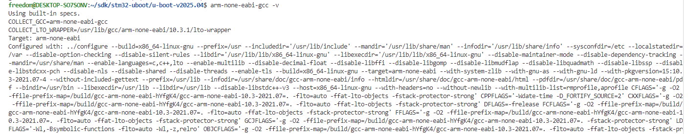
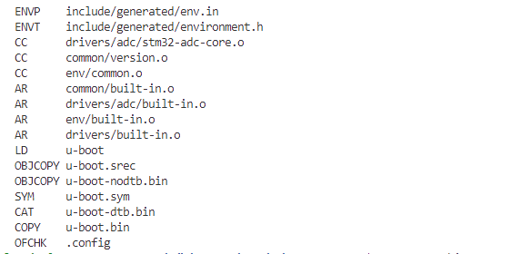
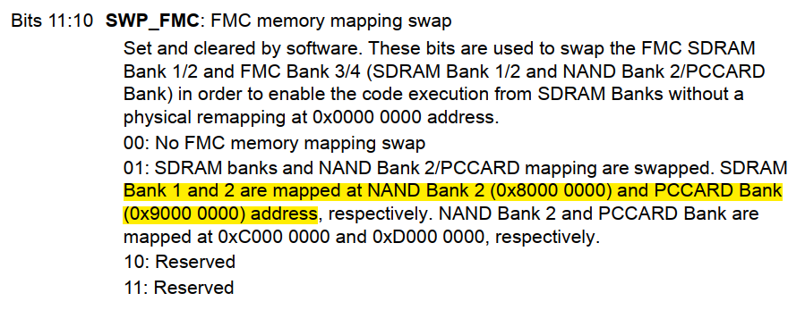

# 附录五:从移植STM32F4学习U-Boot

嵌入式Linux开发学习路径中，U-Boot是重要但又比较鸡肋的环节。从功能上，U-Boot主要完成启动，加载内核以及设备树，引导跳转执行的功能；只是整个工作流程中比较简短的一部分。不像内核和文件系统，和我们的产品功能中息息相关，U-Boot可以说感知不深，描述功能实现的文档和说明也远少于内核和文件系统。

以我的项目经历，大部分情况都是适配后，除非启动中遇到问题，或者有新的需求(例如修改调试口，尽快控制某些I/O电平)；U-Boot开发在流程中的工作就完成了。这也导致网上关于移植的资料虽然有一些，但也比较零散；如果需要使用U-Boot本身不支持的功能，例如添加硬件操作，支持扩展命令，基本没有相关资料说明。

另外对于SOC来说，如I.MX6ULL、T113-i、RK3568等，其寄存器和模块功能又过于复杂，部分芯片资料还不全；在框架上进行移植U-Boot支持工作还比较简单；在此基础上，扩展U-Boot功能，并用来学习U-Boot应用，十分困难。本篇则通过单片机移植U-Boot，并添加功能的方式来学习U-Boot相关的知识，如设备树维护，驱动实现，命令控制等工作，就是可行的选择；当然这是建立在我对STM32理解比较深入，有着寄存器，标准库，HAL库的开发经验基础上的；适合本身有单片机经验，去理解U-Boot运行机制的开发者。

其实，U-Boot已经实现了对于单片机芯片STM32F429芯片的支持，不过是基于官方开发板的。而我手里有块正点原子的STM32F429-Alpha开发板，所以就从这块开发板开始移植；当然选择这块开发板也是因为我对STM32F429这款芯片掌握的还算深刻，也总结了类似的文档，可以参考如下路径：

- <https://github.com/zc110747/embedded_based_on_stm32>

对于U-Boot的移植，肯定需要源码和对应硬件；既然是学习，肯定从主干进行移植。相应的资源如下。

- u-boot-v2025.04: <https://source.denx.de/u-boot/u-boot/-/archive/v2025.04/u-boot-v2025.04.tar.gz>
- 编译工具：arm-none-eabi-gcc，version 10.3.1, 下载地址: <https://mirrors.tuna.tsinghua.edu.cn/armbian-releases/_toolchain/gcc-arm-11.2-2022.02-x86_64-arm-none-eabi.tar.xz>
- 平台: STM32F429-Alpha开发板，理论上更高性能的开发板也可以，需要支持SDRAM，不过要参考本节说明自己进行移植

有了这些资源，下面可以正式开始移植工作；具体目录如下所示。

- [U-Boot移植流程](#basic_trans)
- [下一章节](#next_chapter)

## basic_trans

对于U-Boot的移植，参考U-Boot平台移植文档，主要有以下几个步骤。

1. 安装对应平台的编译工具，对于STM32F4就是"arm-none-eabi"
2. 下载U-Boot源码，解压并编译，验证编译环境是否满足要求
3. 修改设备树和平台相关文件，适配U-Boot设备
4. 编译并生成U-Boot镜像，下载并运行

下面安装上述步骤进行说明。

- 安装编译工具，并添加到系统环境变量中

```shell
# 下载编译工具
wget https://mirrors.tuna.tsinghua.edu.cn/armbian-releases/_toolchain/gcc-arm-11.2-2022.02-x86_64-arm-none-eabi.tar.xz

tar -xvf gcc-arm-11.2-2022.02-x86_64-arm-none-eabi.tar.xz

# 导入到系统环境下
export PATH=$PATH:$(pwd)/gcc-arm-11.2-2022.02-x86_64-arm-none-eabi/bin

# 检测是否支持arm-none-eabi-gcc
arm-none-eabi-gcc --version
```

如果安装成功，可以显示如下所示。



- 下载U-Boot源码，解压并编译

```shell
# 下载u-boot
wget https://source.denx.de/u-boot/u-boot/-/archive/v2025.04/u-boot-v2025.04.tar.gz

tar -xvf u-boot-v2025.04.tar.gz

# 进入u-boot源码目录
cd u-boot-v2025.04

# Makefile指定编译工具
vim Makefile
###############################
ARCH=arm
CROSS_COMPILE=arm-none-eabi-
##############################

# 编译
make stm32f429-discovery_defconfig
make -j6
```

如果编译成功，可以显示如下所示。



其中u-boot.bin文件就是生成的U-Boot镜像，不过这个镜像是适配STM32F429-Discovery的，而我使用的开发板并不适用；直接下载没有打印信息，也无法正常启动。那么下面一步进行开发板的适配。前面讲过，对于U-Boot的适配就其实就是硬件的适配。

对于产品来说，U-Boot的适配考虑到应用需求，可能需要LOGO的显示、网络通讯的处理、加载其它程序等；这就需要GUI、NETWORK、SD卡等模块的支持。不过这都是综合完善的需求，作为第一步，我们需要的其实只有两部分。

1. 调试硬件串口输出，打印调试信息；调试信息是我们开发过程中最常用的，也是最方便的调试方式，必须首先满足
2. 完成SDRAM的初始化，允许U-Boot搬运到SDRAM继续执行；这一步十分重要，很多代码就是这步移植出错导致系统卡住，无法正常启动

对于STM32F429-Discovery开发板，其串口输出为UART0，对应的引脚是PA9和PA10；这部分和开发板一致，不需要修改。对于SDRAM的初始化，其主要差别是STM32F429-Discovery开发板使用的是bank1，而我们开发板使用的是bank2，所以需要支持。这部分主要进行设备树的修改。

```c
// fmc引脚复用修改
// 文件: arch/arm/dts/stm32f429-disco-u-boot.dtsi
&pinctrl {
    fmc_pins: fmc@0 {
        bootph-all;
        pins
        {
            pinmux = <
                    //......
                    <STM32_PINMUX('G', 2, AF12)>, /* + A12 增加引脚支持，扩充memory空间*/
                    <STM32_PINMUX('G', 1, AF12)>, /* A11 */
                    <STM32_PINMUX('G', 0, AF12)>, /* A10 */
                    <STM32_PINMUX('F',15, AF12)>, /* A09 */
                    <STM32_PINMUX('F',14, AF12)>, /* A08 */
                    <STM32_PINMUX('F',13, AF12)>, /* A07 */
                    //......
                    <STM32_PINMUX('C', 2, AF12)>, /* SDNE0 U SDNE1->SDNE0*/
                    <STM32_PINMUX('C', 3, AF12)>, /* SDCKE0 U SDCKE1->SDCKE0*/
                    <STM32_PINMUX('C', 0, AF12)>, /* SDNWE */
                    <STM32_PINMUX('F',11, AF12)>, /* SDNRAS */
                    <STM32_PINMUX('G',15, AF12)>, /* SDNCAS */
                    <STM32_PINMUX('G', 8, AF12)>; /* SDCLK */
            slew-rate = <2>;
            bootph-all;
        };
    };
}

// fmc配置修改
// 文件: arch/arm/dts/stm32f429-disco-u-boot.dtsi
fmc: fmc@A0000000 {
    compatible = "st,stm32-fmc";
    reg = <0xa0000000 0x1000>;
    clocks = <&rcc 0 STM32F4_AHB3_CLOCK(FMC)>;
    pinctrl-0 = <&fmc_pins>;
    pinctrl-names = "default";
    st,syscfg = <&syscfg>;
    st,swp_fmc = <1>;   //stm32f4默认SDRAM空间不支持软件执行，需要交换SDRAM空间到可执行区域
    bootph-all;

    /*
        * Memory configuration from sdram datasheet
        * IS42S16400J
        */
    bank0: bank@0 { //根据硬件确定使用band0, 后续相应时序根据SDRAM参数确认
            st,sdram-control = /bits/ 8 <NO_COL_9
                        NO_ROW_13
                        MWIDTH_16
                        BANKS_4
                        CAS_3
                        SDCLK_2
                        RD_BURST_EN
                        RD_PIPE_DL_1>;
            st,sdram-timing = /bits/ 8 <TMRD_2
                        TXSR_8
                        TRAS_6
                        TRC_6
                        TWR_2
                        TRP_2
                        TRCD_2>;
            st,sdram-refcount = < 1283 >;
        };
};

// 修改启动映射地址和memory空间
// 文件: arch/arm/dts/stm32f429-disco.dts
memory@80000000 {   //对于stm32, bank0地址对应0x80000000, 详细参考后续说明
    device_type = "memory";
    reg = <0x80000000 0x2000000>;
};
```

完成这一步后，最基础的U-Boot就完成了。关于FMC I/O的配置，参考硬件原理图确认修改即可。bank的选择和SDRAM的时序，因为单片机已经开发过，安装关键字一一修改适配，也并不困难。启动region memory反而是最初迷惑最多的地方。这个地址在SDRAM初始化后，会在SDRAM中执行前搬运数据时需要；而SDRAM的地址到底时多少，最开始没有确认，也就没进行改动；后果就是执行中不是卡死就是hardfault；后来在英文的STM32F42x手册里有这样一段说明。



我们使用的是bank0(对应这里面硬件的bank1)，所以对应的启动region memory地址是0x80000000；这是因为STM32F4的DRAM地址区域为了安全考虑默认不支持I-CODE访问，而NAND BANK的地址是支持访问的，这里就是交换两个区域的地址映射，从而使SDRAM满足运行要求。

完成上述修改后，重新编译，生成新的uboot镜像，烧录到内部FLASH即可执行，具体显示如下所示。


至此，关于u-boot在STM32的移植就完成了。不过我们主要是用于学习U-Boot的知识，去理解U-Boot设备树节点处理，驱动加载方式和应用命令的实现。所以接下来就开始学习U-Boot的相关知识的学习。

## uboot_driver

## next_chapter

[返回目录](../README.md)

直接开始下一章节说明: [uboot命令行脚本和设备树overlay实现](./ch02-x6.uboot_script_overlay.md)
