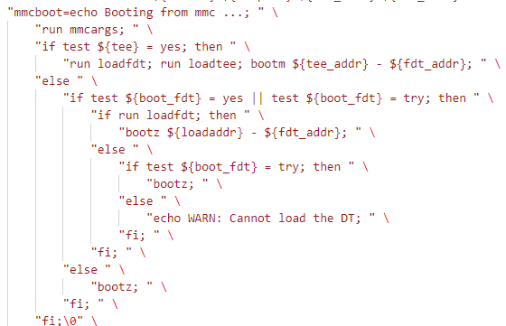

# 附录六: 嵌入式Linux系统平台问题支持

- [修改内核logo显示](#feature-001)
- [systemd增加自定义服务方法](#feature-002)
- [指定console输出接口(串口或者屏幕)](#feature-003)
- [开机启动延时一段时间执行脚本](#feature-004)
- [nfs启动显示为Read-Only FileSystem](#feature-005)
- [什么是核隔离，如何让系统支持核隔离](#feature-006)
- [内核支持usb wifi芯片，并且开机自启动方法](#question-007)

## feature-001

- 系统启动后加载的界面文件所在的目录为kernel/drivers/video/logo, 其中*.ppm格式文件就是转换需要使用得ppm文件
- 在微软商店下载GIMP，添加一张图片=>图像=>模式=>索引颜色转换=>最大颜色数量设置为(224), 设置分辨率大小，并导出
- 选择导出格式为ppm，保存格式为ASCII将转换好的图片文件拷贝到 drivers\video\logo目录下，比如：logo_user_clut224.ppm  //必须加clut224导出
- 修改Kconfig文件

```shell
vi drivers/video/logo/Kconfig

#===============================================
# ++++++
config LOGO_USER_CLUT224
        bool "Standard224-color User logo"
        default y 
#===============================================
```

- 修改Makefile文件

```shell
vi drivers/video/logo/Makefile

#===============================================
# ++++++
obj-$(CONFIG_LOGO_USER_CLUT224)  += logo_user_clut224.o
#===============================================
```

- 修改开机logo图片数据管理文件logo.c

```c
vi drivers/video/logo/logo.c

//==============================================
// ++++++
#ifdef  CONFIG_LOGO_LUO_CLUT224
    /* Generic Linux logo */
    logo = &logo_user_clut224;
#endif
//===============================================
``

- 添加头文件申明

```c
vi include/linux/linux_logo.h

//==============================================
// ++++++
extern const struct linux_logo logo_user_clut224;
//==============================================
```

- 在终端编译，在执行menuconfig时，修改内核配置选项。

```shell
DeviceDrivers  --->
  Graphics support  --->
  
Bootup logo  --->
    ---Bootup logo
    [ ] Standard black and whiteLinux logo
    [ ] Standard 16-color Linux logo
    [ ] Standard 224-color Linuxlogo
    
 Standard 224-color  hanbo logo (NEW)  （修改）
```

## feature-002

systemd增加自启动服务方法。

Systemd是目前主流的Linux启动机制，其定义一套完整的系统启动和管理的解决方案。Systemd的默认service路径为"/etc/systemd/system/"，当启动后，会在"/lib/systemd/system"目录下创建链接，实现启动时运行。Systemd的应用配合systemctrl命令，可以实现服务使能/关闭，服务启动/停止，服务状态查询等功能，service的文件格式如下所示。

```shell
cd /etc/systemd/system

sudo vim example.service
#############################################################
[Unit]
Description=Example Service
After=network.target

[Service]
ExecStart=/home/freedom/start.sh
WorkingDirectory=/tmp/
Restart=always

[Install]
WantedBy=multi-user.target
#############################################################

# 创建启动脚本
cd /home/freedom
sudo vim start.sh
#############################################################
#!/bin/bash

echo "hello start"
#############################################################
chmod 777 start.sh

# 使能服务(链接到/lib/systemd/system，启动时加载)
sudo systemctl enable example.service

# 当前启动example.service
sudo systemctl start example.service

# 查看service运行状态
systemctl status example.service
```

加载成功后，状态如下所示.



注意：shell脚本首行要指定使用的shell平台，例如bash脚本则为"#!/bin/bash"，否则脚本会执行失败。

## feature-003

指定console输出接口(串口或者屏幕)。

- 指定console输出kernel信息到屏幕

```shell
setenv bootargs "console=tty1 console=ttymxc0,115200 panic=5 rootwait root=/dev/mmcblk0p2 earlyprintk rw"
```

- buildroot指定console在系统中支持输出(不期望应用层输出打印，可不执行这一步)

```shell
# 修改/etc/inittab, 增加tty1
ttymxc0::respawn:/sbin/getty -L  ttymxc0 0 vt100 # GENERIC_SERIAL
tty1::respawn:/sbin/getty -L  tty1 0 vt100 # GENERIC_SERIAL, 增加显示
```

- debian，uboot指定console在系统中支持输出

```shell
# 复制串口ttymxc0启动服务，所有步骤完成
cd /etc/systemd/system/getty.target.wants

#[ TIME ] Timed out waiting for device dev-ttymxc0.device. 
# 如果是其它芯片，需要将ttymxc0更新为相应的串口，否则会失去命令行打印
cp -d getty@tty1.service getty@ttymxc0.service
```

## feature-004

开机启动延时一段时间执行。

对于busybox管理的系统，在rcS中添加后台执行的脚本。

在启动脚本中添加执行脚本。

```shell
vi  /etc/init.d/rcS

#########################################
# 添加后台启动脚本
/home/sys/shell/bringup_shell.sh &
#########################################
```

定义脚本内容，设置延时执行时间

```shell
# 修改bringup_shell.sh脚本
mkdir /home/sys/shell
vi /home/sys/shell/bringup_shell.sh

#########################################
#!/bin/sh

echo "start bash"
sleep 2s
/home/sys/start_app.sh
#########################################

# 设置脚本可执行
chmod 777 /home/sys/shell/bringup_shell.sh
```

对于debian系统，添加到系统service中。

## feature-005

nfs系统创建文件报错: can't create directory 'dir': Read-only file system.

原因: bootargs配置中缺少rw选项，需要添加。

```shell
# 更新/dev/nfs支持rw
setenv bootargs 'console=ttymxc0,115200 root=/dev/nfs rw nfsroot=192.168.1.25:[nfsdir] ip=192.168.2.34:192.168.2.29:192.168.2.1:255.255.255.0::eth0:off'

# 仅当次修改解决
mount rw -o remount /
```

### feature-006

什么是核隔离，如何让系统支持核隔离。

在Linux系统中，核隔离(也称为CPU隔离或CPU pinning)是一种将特定的任务或进程绑定到特定的CPU核心上的技术。这可以提高系统性能，尤其是在需要实时响应的应用中。如果需要核隔离，首先确保芯片为多核才有意义，实现核隔离的方法如下所示。

- 通过修改u-boot中的bootargs，确保内核支持核隔离功能

```shell
# 增加核隔离相关说明
setenv bootargs "console=ttymxc0,115200 panic=5 rootwait root=/dev/mmcblk1p2 earlyprintk rw isolcpus=1-3"
```

- 使用taskset命令，将进程或线程绑定到特定的CPU核上

1. 启动新进程并绑定到特定CPU核心：taskset -c 0,1 command。这将把command进程绑定到CPU 0和1上运行。
2. 将已有进程绑定到特定CPU核心：首先使用ps -ef | grep process_name获取进程的PID，然后使用taskset -p -c 0,1 PID将进程绑定到CPU 0和1上。

### question-007

内核支持usb wifi芯片，并且开机自启动方法(本篇以Linux6.1内核，rtl8188eus为例)

- 首先需要获取usb wifi的驱动，一般去厂商的官网或者对应github下载(自己实现基本不可能，实现特别复杂)，本例中支持Linux6.1内核的wifi驱动下载地址：<https://github.com/aircrack-ng/rtl8188eus>

- 将目录放置在drivers/net/wireless/reltek/rtwifi/目录下，修改配置文件

```shell
# drviers/net/wireless/reltek/Kconfig
# 增加
source "drivers/net/wireless/realtek/rtlwifi/rtl8188eus/Kconfig"

# drviers/net/wireless/reltek/rtwifi/Makefile
# 增加
obj-$(CONFIG_RTL8188EU) += rtl8188eus/
```

- 编译增加CONFIG_RTL8188EU=y选项

编译内核，将RTL8188EUS设备插入即可工作。

wlan启动并开启自启动的方法详细见文档：[wpa_supplicant交叉编译和使用方法](./ch01-04.linux_cross_compiler.md#wpa_supplicant)

## next_chapter

[返回目录](../README.md)

直接开始下一章节说明: [嵌入式Linux驱动开发](./ch03-00.driver_design.md)
