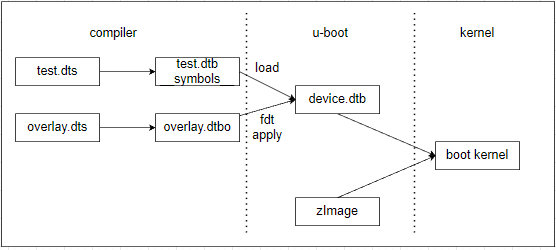
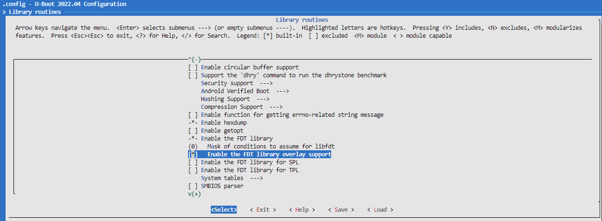
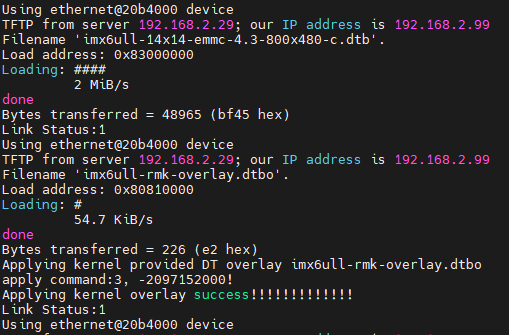
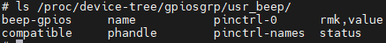

# 附录六: U-Boot命令行脚本和设备树overlay实现

学习过前面的章节，对于U-Boot命令行应该都不陌生，在系统启动中使用按键打断即可进入U-Boot命令行模式，使用printenv，setenv，bootz等命令来设置启动参数，控制跳转等。在之前的章节[U-Boot环境变量和命令管理](./ch02-04.uboot_env.md)中进行了详细的说明。不过在U-Boot中执行脚本，可能很多人并不熟悉，其实在U-Boot中执行脚本并不复杂，主要依赖如下命令。

```shell
# 通过tftp从网络加载脚本文件，然后执行脚本
tftp <load_addr> <file>; soruce;

# 从mmc读取脚本文件，然后执行
mmc dev 1; fatload mmc 1:1 <load_addr> <file>; source

# source命令，用于从内存中运行脚本
source [addr]
    - [addr]: 需要执行的脚本在内存中的首地址，如果没有指定使用之前加载地址
```

也就是说先通过命令将脚本从其它地方(mmc，nand，tftp)加载到指定内存地址，使用source命令加载写入的内存地址即可执行，这就给开发者在U-Boot实现脚本提供了方法，具体步骤参考后续说明，目录如下所示。

- [实现U-Boot脚本加载和执行](#boot_script)
- [实现config.txt文件修改脚本](#config)
- [实现内核设备树的overlay功能](#dtbo_overlay)
- [使用uImage替代zImage进行U-Boot加载](#boot_image)
- [下一章节](#next_chapter)

## boot_script

前面说了，source命令可以从指定内存区域加载**序列化的脚本**命令进行执行，这里序列化的脚本，就是将txt文件转换成的脚本二进制文件。这一步可通过mkimage(U-Boot目录中生成打包可执行文件的工具)编译脚本文件实现，关于mkimage的命令说明如下。

```shell
-A: 指定CPU类型，如arm，x86等
-O: 指定操作系统类型
-T: 指定镜像类型，如kernel，ramdisk，script等
-C: 指定压缩方式，如gzip，bzip或none无压缩
-a: 指定镜像在内存中的加载地址
-e: 指定镜像的入口地址(去掉header的部分)
-d: 指定制作镜像的源文件

# 制作脚本的命令
mkimage -C none -A arm -T script -d [source.file] dst.file

# 制作uImage内核的命令
mkimage -A arm -O linux -T kernel -C none -a 0x80800000 -e 0x80800040 -d zImage uImage
```

这里选择生成脚本为.scr格式，通过mkimage处理，实现boot_script流程如下。

- 生成boot script脚本文件

```shell
# 1. 实现boot.cmd文件(内部为U-Boot支持的shell脚本)
vim boot.cmd

# 2. 文件内容添加
#################################
# boot script file

## gloabl config
echo "## boot script loaded!"
setenv load_addr 80810000
## ......
#################################

# 3. 生成scr文件
mkimage -C none -A arm -T script -d boot.cmd boot.scr
```

- 修改为网络加载boot.scr，并执行脚本

```shell
# 从tftp目录加载boot.scr，执行, 
setenv bootcmd "tftp 80800000 boot.scr; source"
saveenv
reset
```

- 修改为emmc加载boot.scr，并执行脚本

```shell
# 从mmc中加载boot.scr并执行
setenv bootcmd "mmc dev 1; fatload mmc 1:1 80800000 boot.scr; source"
saveenv
reset
```

关于U-Boot的脚本内容，可以参考此处实现：[boot.cmd脚本](./file/ch02-x6/boot.cmd)。

## config

上面使用U-Boot的脚本，开发者可以使用setenv，tftp等命令加载boot.scr，从而控制后续执行流；不用进行复杂的代码修改，以及编译下载，就可以实现目的。不过这种方法仍然是有缺陷的，加载的是序列化打包的二进制脚本，也就是说每次修改脚本都需要执行mkimage重新打包，然后替换原二进制文件才能生效。对于已经运行的系统，即使能够看到此脚本文件，修改起来也比较麻烦。这里就需要一种更直接修改配置文件的方法，利用env命令，可以直接加载文本格式的配置文件，不需要转换，这样就更简单的实现功能。

env命令功能说明。

```shell
# 从指定的地址读取环境变量，其中addr中的格式为"[key]=value"语句
# 转换为setenv [key] value
env import -t <loader_addr> [size]

### loader_addr内容
temp=1

### env导入后相当于执行命令
setenv temp 1
```

具体方法如下。

```shell
# 1. 定义config.txt
vim config.txt

# 2. 文件内容添加
#################################
# config file

## nfs network
serverip=192.168.2.29
ipaddr=192.168.2.99
## ......
#################################

# 3. 修改boot.cmd支持config.txt的解析
## 网络加载
## support loader config file from net
if tftp 80810000 config.txt; then
    echo "## load import file: ${config_file}"
    env import -t 80810000
    printenv ${serverip}
else
    echo "## use default information"
fi

## mmc加载
## support loader config file from mmc
mmc dev 1
if fatload mmc 1:1 80810000 config.txt; then
    echo "## load import file: config.txt"
    env import -t 80810000
    printenv ${serverip}
else
    echo "## use default information"
fi
```

基于此，可以在config.txt文件中使用[key]=value的形式配置系统参数，这样系统启动后，直接将目录挂载后，修改txt文件即可直接替换U-Boot的环境变量。

关于config.txt的实现可以参考[config.txt配置文件](./file/ch02-x6/config.txt)。

## dtbo_overlay

设备树插件DTBO（Device Tree Blob Overlay）是一种用于Linux内核和嵌入式系统的重要机制，主要用于动态地修改或扩展系统运行时的设备树配置。使用设备树插件的话，可以根据具体的外设来定制设备树插件，做到灵活替换。



整个插件的功能按照流程如下所示。

1. 编译基础的设备树，带有__symbols__的二进制dtb文件
2. 编译overlay的设备树，生成解引用二进制dtbo文件，内部带/plugin/;声明
3. U-Boot加载设备树目录中选择的dtb和dtbo文件，通过fdt apply合并后，然后传递给内核，即实现了设备树插件功能。

可以看到设备树插件是完全基于U-Boot的fdt apply功能实现的，所以只要U-Boot支持就能够实现这个功能。

### compiler_dts

编译带有__symbols__的dtb二进制文件。虽然设备树是由U-Boot传递，不过还是使用内核的设备树，这就需要内核编译出带__symbols__的文件。这里涉及到dtc命令的应用。

```shell
# -@ 会生成带__symbols__的设备树节点， 用于后续设备树overlay时查询
dtc -@ -O dtb -o xxx.dtb xxx.dts
```

在内核中添加设备树编译__sysmbols__，需要修改如下kernel/scripts/Makefile.lib添加。

```shell
# scripts/Makefile.lib
# DTC_FLAGS += -Wno-interrupt_provider
DTC_FLAGS += "-@"

make dtbs
```

重新编译设备树即可。

### define_overlay

创建设备树插件节点，引用主设备节点。

```c
vim imx6ull-rmk-overlay.dts

//imx6ull-rmk-overlay.dts
//生成dtbo需要带"/plugin/;"，此时允许设备树解引用
//默认设备树中引用不存在的节点会报错，使用plugin后，会进行解引用
/dts-v1/;
/plugin/;

&usr_beep {
    rmk,value = <0x1>;
};
```

通过dtc工具生成dtbo文件。

```shell
dtc -O dtb -o imx6ull-rmk-overlay.dtbo imx6ull-rmk-overlay.dts
```

### uboot_apply

U-Boot执行加载基于fdt命令实现，主要包含三个关键命令，如下所示。

```shell
# 选中基本设备树
fdt addr ${fdt_addr_r}

# 重定义设备树范围，为合并做准备
fdt resize ${size}

# 将dtbo合并到dtb中
fdt apply ${load_addr}
```

其中fdt apply是需要U-Boot的编译选项支持，需要开启CONFIG_OF_LIBFDT_OVERLAY，如果显示不存在CONFIG_OF_LIBFDT_OVERLAY宏，可能是版本过低，选择更新的U-Boot版本测试。

```shell
# configs/xxx_defconfig
# 支持dtbo功能
CONFIG_OF_LIBFDT_OVERLAY=y
```

或者打开选项"Library routines"=>"Enable the FDT library overlay support"



然后在boot.cmd中添加支持overlay的脚本，参考上一章节的内容。

```shell
# 加载kernel和设备树
tftp ${kernel_addr_r} zImage
tftp ${fdt_addr_r} ${fdt_file}

# 选择设备树地址，重置大小
fdt addr ${fdt_addr_r}
fdt resize 65536

# 加载overlay文件
for overlay_file in ${overlays}; do
    if tftp ${load_addr} ${overlay_file}.dtbo; then
        echo "Applying kernel provided DT overlay ${overlay_file}.dtbo"
        fdt apply ${load_addr} || setenv overlay_error "true"
    fi
done

# 加载overlay失败则重新加载设备树，成功如下所示。
if test "${overlay_error}" = "true"; then
    echo "Applying kernel overlay failed, use default dtb"
    tftp ${fdt_addr_r} ${fdt_file}
else
    echo "Applying kernel overlay success!!!!!!!!!!!!!"
fi
```

对于overlay代码查看：[overlay设备树文件](./file/ch02-x6/imx6ull-rmk-overlay.dts)。

如果overlay加载成功，启动打印如下所示。



可以看到显示打印成功。另外我们也可以在系统设备树路径查看，如下所示。



可以看到在设备树rmk,value节点就是执行设备树插件添加的属性，也就是说完整实现了设备树插件功能支持。

## boot_image

编译完linux内核后，会在arch/arm/boot目录下生成两个文件Image和zImage，它们都是内核镜像文件的一种，包含可执行的二进制程序。

- Image: Linux内核编译后的一种未经压缩的镜像文件，包含了完整的内核二进制数据和结构。它通常用于调试、测试或作为其他内核映像文件的基础
- zImage: 经过gzip等压缩算法压缩后的内核映像文件，它较小且包含一个解压缩程序。zImage通常用于嵌入式设备或其他资源有限的环境中，以节省存储空间并加快启动速度

通常来说，zImage可以被U-Boot正确识别并加载，不过需要首先将zImage加载到memory中的指定地址，然后使用bootz命令跳转执行，常见流程如下。

```shell
tftp 0x80800000 zImage;                                         # 从网络加载内核
tftp 0x83000000 imx6ull-14x14-emmc-4.3-800x480-c.dtb;           # 从网络加载设备树
bootz 0x80800000 - 0x83000000
```

不过U-Boot支持自定义的启动方式，其中Image文件中包含了有关内核的信息，如内核大小、加载地址、入口地址、校验和等。这些信息对于U-Boot正确识别和加载内核映像至关重要，这种镜像被称为uImage(带有U-Boot头部的zImage)，使用bootm命令启动。

uImage可以通过mkimage命令，从zImage生成，其命令如下。

```shell
# 生成uImage
mkimage -A arm -O linux -T kernel -C none -a 0x80800000 -e 0x80800040 -d zImage uImage
```

启动uImage的方法

```shell
tftp 0x80800000 uImage;                                         # 从网络加载内核
tftp 0x83000000 imx6ull-14x14-emmc-4.3-800x480-c.dtb;           # 从网络加载设备树
bootm 0x80800000 - 0x83000000
```

## next_chapter

[返回目录](../README.md)

直接开始下一章节说明: [嵌入式Linux系统平台问题支持](./ch02-xz.system_feature_notes.md)
