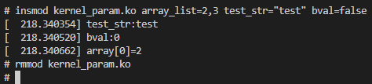
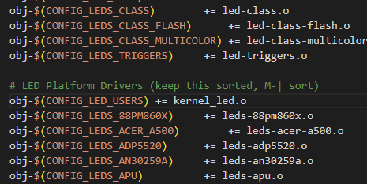
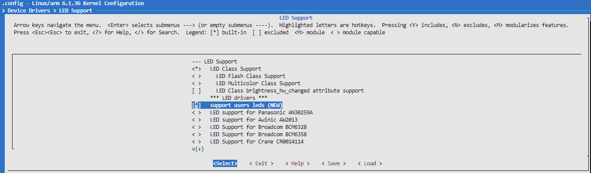
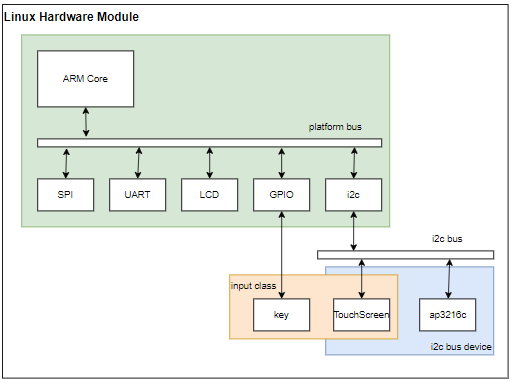
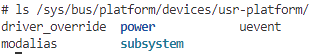
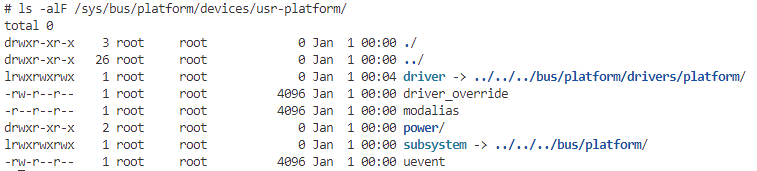

<!-- markdownlint-disable MD033 -->
<!-- markdownlint-disable MD010 -->
# 嵌入式Linux驱动设计综述

嵌入式Linux驱动开发，是整个系统中最复杂琐碎的部分，这部分从入门就有相当难度的门槛。事实上，产品开发中，除非作为SOC或外部器件厂商的一员，很少涉及完整的驱动开发。大部分时间只需要在设备树中添加和修改设备节点，打开内核中的某些配置项，就能够实现驱动的功能。当然各厂商的SDK包中，往往也包含常用设备的驱动。

学习嵌入式Linux驱动的开发，可以说耗时长，难度高，学习曲线陡峭；在入门时，投入大量时间去学习，有些事倍功半；但这并不表示驱动不重要，作为连接软件功能和实际硬件产品的纽带，对于完整的产品开发来说，当然是必须的。这里说的目的主要学习驱动时，不要上来就希望面面精通，每个知识点都必须理解；学会以兴趣为导向的方式，例如希望适配读取温湿度的传感器，实现定时提醒，适配摄像头，实现拍照，AI识别的功能。

学习驱动开发的过程中，就可以从这些功能出发；先学会如何使用驱动，先根据需求适配修改配置项，然后再去学习驱动的实现原理，了解驱动的设计思想，最后再去学习从无到有按照框架实现驱动。可以考虑如下开发场景。

1. 产品增加支持采集并显示当前温度和空气湿度的功能
2. 产品适配某个新的分辨率以及厂商的屏幕
3. 产品希望工作在指定的频率，提高刷新率或者降低工作温度
4. 产品希望修改默认的调试命令行console

上面就分别涉及i2c接口的外部器件支持，屏幕分辨率和系统时钟频率的控制，命令行输出配置管理。如何修改设备树或者系统配置项，让内核支持新的功能；对于内核不支持的器件，如何通过驱动实现功能支持；如果只是demo方案，我们只要选择支持的功能开发就可以，而对于产品，则需要没有短板，补齐每个部分。驱动学习看起来收益低的事，在这个时候也是必须的，这也是产品开发需要学习掌握驱动的原因。

讲述驱动的书籍都是告诉我们要这么做，却没有告知我们为什么可以这么做就能满足要求。回想驱动的学习开发经历，可以说是整个学习中最枯燥且繁琐的部分；不像应用端开发所见即所得，设备树，内核接口也十分抽象，大量复杂的函数和结构体，只能看注释去理解数据的功能；讲述如何处理能够实现对应驱动功能的教程和书籍有一些，但是能够系统并清晰的描述为什么这样能够实现的，至今我也没找到很好的资料；当然，本系列也只能算是抛砖引玉，受限于篇幅和个人能力，也没有做到深入浅出。当然，Linux本身的复杂度也越来越高，学习使用的过程中也面临很多困扰，这里说明下我学习Linux时的感受。

- 同一功能的实现方法多种多样，这里以应用层访问驱动，以及驱动访问硬件的接口为例
  - 设备被应用层访问的接口来看
    - 可以直接使用"/dev/[file]"设备节点读写
    - 访问设备类下的属性文件
    - 设备节点下的配置文件等
  - 硬件访问接口
    - 使用物理地址ioremap转换
    - 使用设备树直接操作接口(of_xx)
    - 设备资源接口访问接口(devm_xx)
- 学习中接触的驱动代码，和Linux内核中的代码有明显差异。看似理解了某个外设和模块，但去看Linux内核中的驱动实现，仍然感觉迷雾重重。实现过gpio和input驱动，去理解内核中keys和leds的驱动仍然不简单(可以尝试看下drivers/input/keyboard/gpio_keys.c的代码，对比网络上随处可见的gpio输入检测代码)
- 不同版本的内核，通用的驱动接口也有差异性；而不同芯片厂商，维护的内核版本差异性大，且厂商驱动内部的接口差异性更是明显。

功能范式的多样性可以理解，早期Linux版本是以寄存器ioremap的方式访问硬件外设，再通过内核接口与创建系统文件进行关联，实现具体功能。这种方式很直观，类似单片机中的裸机开发；不过ARM芯片的碎片化，对于同样设备的器件，不同主控SOC往往重复实现驱动以应对寄存器、总线的设计差异，这也就造成了大量驱动代码冗余。对于兼容多种芯片和外部设备的Linux内核来，会带来代码量大、配置选项复杂、调试分析困难等问题。为了解决这类问题，并处理如设备热插拔、电源管理等功能，Linux内核在2.6版本以后提出设备驱动模型概念。设备驱动模型将硬件设备归纳、分类、抽象出一套标准的数据结构和接口；我们在开发中关注总线，设备，驱动三个部分，通过总线将设备和驱动分离，并单独管理。在驱动开发中，设备抽象成设备树，厂商和开发者共同维护；总线由linux内核以及部分厂商的私有代码组成(主要为系统内部模块和platform总线代码)；驱动则最为复杂，芯片厂商、器件厂商、BSP维护人员以及产品开发者都可能参与实现。

从目前的驱动开发方案来说，无论是去理解Linux驱动还是实现模块驱动，依托设备驱动模型概念(总线，设备，驱动)就是最佳实践，按照这种思路，对于大部分驱动的实现流程就总结如下所示。

1. 实现驱动加载的必要信息和接口(probe, remove)
2. 执行硬件初始化，实现访问硬件的接口(gpio, irq, config)
3. 在内核和系统中创建设备，并与硬件访问接口关联，从而支持应用层的访问(class, device, ops)

随着内核的迭代，通过子系统实现具体驱动功能，可以更方便驱动的复用。如果改动只涉及硬件接口的修改，通过设备树修改就即可实现；这就提高了开发效率，降低了维护难度。不过当涉及的器件Linux内核不支持或不一致时，需要开发驱动时，这时需要去理解更多的接口，难度反而更高。对于驱动的学习，肯定不能只限于了解设备树的知识，而是需要掌握设备驱动模型的对应的接口和用法，这就对开发者进行更高的要求。基于统一设备驱动模型，在Linux系统中增加器件由设备，总线，驱动三部分共同组成。

1. 总线：内核启动后，加载解析设备树，创建支持的总线(如i2c, spi, usb等)，系统总线一般挂载在platform下
2. 设备: 解析设备树，在对应总线下创建设备(如ls /sys/bus/i2c/devices列出支持设备)
3. 驱动: 设备工作需求的驱动，实现应用层访问内核数据的接口，以及内核访问外部器件的接口，建立通道

本系列的所有文章和代码对应工作平台如下。

- 硬件: I.MX6ULL
- U-Boot版本: nxp， uboot-imx-lf_v2022.04
- 内核版本: nxp，linux-imx-lf-6.1.y

因为不同芯片，内核的差异性，内核驱动接口存在差异；所以参考一套教程就想支持所有平台并不实际，需要自行解决相应适配问题。

本节目录说明如下。

- [驱动综述分类](#driver_summary)
- [内核加载接口](#kernel_interface)
- [驱动编译到内核中](#driver_in_kernel)
- [总线、设备和驱动，统一设备模型和platform总线](#bus_driver_modules)
- [驱动访问其它模块导出接口](#driver_relay_on)
- [多文件生成驱动方法](#driver_combian_file)
- [下一章节](#next_chapter)

## driver_summary

Linux驱动按照读写存储方式，以及操作的不同，分为字符设备驱动，块设备驱动和网络设备驱动。

1. 字符设备驱动是Linux操作系统中一种常见的设备驱动类型，用于处理字符数据的输入和输出。字符设备驱动通常用于处理串行通信设备、终端设备、打印机等。特点是以字节流的形式进行I/O操作，每次读写操作的数据量通常为一个字节或多个字节；设备文件通常位于/dev目录下，以字符设备文件的形式存在；字符设备驱动通常实现了一组标准的文件操作接口，如open、read、write、ioctl等；在日常开发中，大部分都是基于字符设备驱动的开发。
2. 块设备驱动是Linux操作系统中一种用于处理存储设备的驱动类型。与字符设备驱动不同，块设备驱动以固定大小的块（通常为512字节或更大）进行数据传输，而不是以字节流的形式。块设备驱动通常用于处理硬盘、固态硬盘（SSD）、USB存储设备、CD/DVD驱动器等存储设备。管理存储设备的物理块，包括读取和写入数据块；实现缓冲区管理，以提高I/O效率；支持文件系统的操作，如格式化、挂载和卸载。
3. 网络设备驱动是Linux操作系统中用于处理网络通信的设备驱动类型。它负责管理和控制网络接口卡（NIC）或其他网络设备，使操作系统能够与网络进行数据交换。网络设备驱动的主要功能包括初始化网络设备、进行网络数据传输、中断接收数据和设备管理，统计网络数据包信息等，常见的网络设备包含以太网，蓝牙，WIFI，CAN等。

## kernel_interface

Linux属于宏内核的跨平台的操作系统，支持大量的设备，可以说超过50%的源码都与设备驱动有关(参考driver目录)。如果内核在编译时支持所有驱动，内核将变得十分臃肿。为了解决这个问题，Linux允许通过文件的方式，在内核运行的过程中，将部分功能动态的加载，这既是内核模块功能。内核模块的引入提高了系统的灵活性，允许动态的加载和移除资源，这样就不需要每次更改重新编译下载完整内核，提高了开发效率。这段实现内核模块加载和移除功能的代码，就是本节说明的驱动开发接口。

驱动开发中，内核提供了一套接口，支持了模块的的加载和移除，另外也支持声明模块的作者，开源协议和模块描述，模块别名等，主要如下所示。

```c
#include <linux/init.h>
#include <linux/module.h>

/* 模块加载时函数 */
static int __init ap3216c_module_init
{
}

/* 模块移除时函数 */
static void __exit ap3216c_module_init
{
}

module_init(ap3216c_module_init);       /* 模块加载时访问接口 */
module_exit(ap3216c_module_exit);       /* 模块移除时访问接口 */

MODULE_AUTHOR("jason");                 /* 模块作者 */
MODULE_LICENSE("GPL v2");               /* 模块license */
MODULE_DESCRIPTION("ap3216 driver");    /* 模块描述 */
MODULE_ALIAS("ap3216 drive");           /* 模块别名 */
```

其中最关键的接口功能如下所示。

1. module_init接口指定模块加载时调用的函数，当通过modprobe或者insmod加载时，会自动被内核执行
2. module_exit则指定模块移除时调用的函数，当通过modprobe -r或者rmmod卸载时，会自动被内核执行
3. MODULE_LICENSE模块的许可声明，主要有"GPL"，"GPL v2"，"Dual BSD/GPL"，"Dual BSD/GPL"，大部分情况下使用"GPL v2"即可。
4. 其它模块信息，如作者，描述，别名，这些非必须，用于附加在驱动模块中。

对于驱动加载函数，使用__init声明，其格式如下。

```c
// __init 宏用于标记那些在内核启动过程中被调用一次，然后在系统正常运行时不再需要的函数
// 使用insmod或者编译进内核时调用一次
#define __init	__section(".init.text") __cold  __latent_entropy __noinitretpoline
#define __initdata	__section(".init.data")

//__exit 宏用于标记那些在内核模块卸载或系统关机时需要被调用的清理函数
#define __exit  __section(".exit.text") __exitused __cold notrace
```

另外模块加载时，支持通过insmod指令传参。此时需要内部使用module_param定义支持传递的参数，其格式如下所示。

```c
//module_param格式(参数名，参数类型，参数权限)
//name: 参数名，驱动中声明的变量
//type: 参数类型，如int, charp, bool等
//perm: 参数权限，如S_IRUGO，S_IWUSR等
module_param(name, type, perm);
```

在驱动加载中，可以使用如下格式导入参数。

```shell
# 设置参数
insmod <module> <param>=<value>
```

关于上述的参数导入功能，示例代码如下所示。

```c
// (参数名，参数类型，参数权限)
// 参数类型: byte, short, ushort, int, uint, long, ulong, charp(字符指针)，bool(0/1, y/n, Y/N)或invbool(N=true)
// module_param_array格式(参数名，参数类型，指向数组长度的指针，类型 )
#include <linux/kernel.h>
#include <linux/init.h>
#include <linux/module.h>

static char* test_str="hello world!";
module_param(test_str, charp, 0644);
static bool bval = true;
module_param(bval, bool, S_IRUGO);
static int array_list[2] = {1, 2};
module_param_array(array_list, int, NULL, S_IRUGO);

static int __init kernel_module_init(void)
{
    printk(KERN_INFO"test_str:%s\n", test_str);
    printk(KERN_INFO"bval:%d\n", bval);
    printk(KERN_INFO"array[0]=%d\n", array_list[0]);
    return 0;
}

static void __exit kernel_module_exit(void)
{

}

module_init(kernel_module_init);
module_exit(kernel_module_exit);
MODULE_AUTHOR("wzdxf");
MODULE_LICENSE("GPL v2");
MODULE_DESCRIPTION("driver for param");
MODULE_ALIAS("kernel param");
```

后续在加载模块驱动时可以导入参数。

```shell
# 设置参数
insmod *.ko array_list=2,3 test_str="test" bval=false
```

具体显示如下所示。



基于接口实现基础的加载和移除的接口，在添加与开发者，驱动的资源信息，即构成驱动模块最基础的框架。内核模块机制是Linux操作系统中的一个重要特性，增加了内核的可扩展性，使得内核的功能可以根据需要进行动态地加载和卸载，而无需重新编译和重启整个内核；用户根据实际需求选择加载或卸载特定的模块，提供了灵活性。模块可以独立于内核进行开发和测试，使得内核的维护更加容易，也方便了驱动的开发。

## driver_in_kernel

内核模块驱动可以有两种方式存在，一种是编译后以*.ko的形式存在，在系统启动后使用insmod或者modprobe加载，另一种是直接编译到内核中，这就需要修改添加源码。

操作*.ko形式驱动的指令说明如下所示。

1. insmod [mod].ko/rmmod [mod].ko，加载和卸载模块，需要模块的完整路径和名称(支持单模块组成的驱动)。
2. modprobe, 其中modprobe [mod]加载模块，modprobe -r [mod]卸载对应模块, 执行依赖"/lib/modules/(uname -r)"路径下的modules.dep内保存的驱动依赖关系，对于多模块组成的驱动，只能使用modprobe管理。
3. depmod，遍历/lib/modules/(uname -r)路径，生成依赖关系，放置在/lib/modules/(uname -r)路径下。
4. lsmod获得系统中已加载的所有模块的依赖关系

编译ko形式的驱动模块的Makefile如下所示。

```shell
KERNELDIR := /usr/code/linux    # 指定编译后的Linux输出目录
CURRENT_PATH := $(shell pwd)
obj-m := led.o                  # 定义编译的驱动文件

build: kernel_modules

kernel_modules:
    $(MAKE) -C $(KERNELDIR) M=$(CURRENT_PATH) modules
clean:
    $(MAKE) -C $(KERNELDIR) M=$(CURRENT_PATH) clean
```

将驱动添加到内核中由以下步骤组成。对于内核驱动

1. 将实现的驱动文件放置在内核的driver指定目录下
2. 修改目录下的Makefile，将驱动文件添加到内核中
3. 如果希望支持配置，使用CONFIG_XX定义，并添加到当前目录的Kconfig中

这里以LED-GPIO为例。

对应步骤一，将kernel_led.c复制到${kernel}/drivers/leds目录下

对应步骤二，找到路径下Makefile，添加如下语句obj-$(CONFIG_LED_USER_SUPPORT) += kernel_led.c，不支持配置可以直接添加"obj-y += kernel_led.c"导入内核，或者"obj-m += kernel_led.c"以模块的方式进行编译。



对应步骤三, 在Kconfig中添加相应的配置选项

```shell
config LED_USER_SUPPORT
	tristate "support users leds"
	default y
	help
	  This option enables support for user led drivers.
```

此时，使用menuconfig即可看到相应的配置，并添加内核中，如下所示。



对于添加方法的背后原理，详细见[menuconfig原理说明](./ch02-02.menuconfig.md)

## bus_driver_modules

驱动模块加载后，就通过总线实现设备和驱动的匹配, 执行相应的驱动程序。

1. 驱动的加载过程中，总线检索根据设备树已经创建的设备列表，匹配对应的设备。完成设备和驱动的关联，这部分主要在modprobe和insmod时完成。
2. 设备加载时(主要时支持热插拔的设备)，总线则检索对应的驱动，在系统中添加对应设备，并执行相应的驱动。

对于我们大部分遇到的驱动，除支持热插拔的USB，HDMI，SATA等，大部分驱动都是不支持热插拔的；对于这类设备，展示的硬件拓扑如下所示。



从此图可以看出，Linux将硬件抽象成Bus，Class和Device概念。在驱动开发中，如果外部器件挂在指定的总线上（如i2c, spi），则直接使用对应的总线匹配设备，加载驱动。以gpio，adc这类内部器件，理论上并没有挂在特定总线上，这时通过抽象的platform bus进行统一管理。对于嵌入式Linux驱动来说，大部分内部器件都是由platform device管理，我们很多时候都是和它打交道，需要理解深入。

在接触驱动开发时，其中驱动匹配的地方，可能都接触过两张匹配表，如下所示。

```c
// 匹配的是根节点的compatible属性
static const struct of_device_id platform_of_match[] = {
    { .compatible = "rmk,usr-platform" },
    { /* Sentinel */ }
};

// 匹配硬件的name属性(设备表或设备树中为节点名称)
static const struct platform_device_id platform_device_id[] = {
    { .name = "usr-platform", },    
};

static struct platform_driver platform_driver = {
    .driver = {
        .name = "platform",
        .of_match_table = platform_of_match,
    },
    .id_table = platform_device_id,
    .probe = platform_probe,
    .remove = platform_remove,
};
```

platform_of_match可能比较熟悉，匹配设备树中的compatible标签属性；platform_device_id可能就不会那么熟悉了，很多时候都是一笔带过，表示兼容旧的设备表实现。目前现实意义来说，理解这部分并不会直接使用在驱动开发中，不过理解这部分实现对于理解设备驱动模型还是有帮助的。我们知道，设备驱动模型包含总线，设备，驱动三个概念，其中总线是由内核提供的，驱动由驱动程序加载，那么设备从何而来？当然就由设备注册实现，理论上Linux的设备统一到设备驱动模型后，设备的支持都离不开设备注册，为什么开发者基本没实现过设备注册呢？这是因为设备注册也是由内核完成的，内启动时会解析设备树，在相应的总线下创建设备，并完成设备注册；设备树正是描述内核如何创建和注册设备的配置文件。不依靠设备树能否自己实现设备树创建呢？当然可以，下面来实践不依靠设备树，在platform总线下实现设备和驱动注册，并完成匹配，创建应用层设备文件的全流程。

其中设备注册的流程如下。

- 添加设备资源表

```c
// 设备资源
static struct resource platform_resources[] = {
    {
        .start = 0x020bc000,
        .end   = 0x020bc000 + 0x4000,
        .flags = IORESOURCE_MEM,
    },
    {
        .start = 0x020c0000,
        .end   = 0x020bc000 + 0x4000,
        .flags = IORESOURCE_MEM,
    }
};

// 定义 platform 设备结构体
static struct platform_device platform_device = {
    .name          = "usr-platform",
    .id            = -1,
    .dev           = {
        .platform_data = NULL,
    },
    .num_resources = ARRAY_SIZE(platform_resources),
    .resource      = platform_resources,
    .dev.of_node   = NULL,
};
```

- 注册设备

```c
// 设备初始化函数
static int __init platform_device_init(void)
{
    return platform_device_register(&platform_device);
}

// 设备退出函数
static void __exit platform_device_exit(void)
{
    platform_device_unregister(&platform_device);
}

module_init(platform_device_init);
module_exit(platform_device_exit);

MODULE_AUTHOR("wzdxf");
MODULE_LICENSE("GPL v2");
MODULE_DESCRIPTION("platform device");
MODULE_ALIAS("platform device register");
```

注册完成，就可以在"/sys/bus/platform/devices"下看到相应的设备节点，如下所示。



其中设备注册的详细代码可参考：[内核注册设备代码](./file/ch03-00/bus_module/device/kernel_platform_device.c)。

驱动注册的详细代码和基本代码移植，这里不进行说明，详细代码可参考：[内核注册驱动代码](./file/ch03-00/bus_module/driver/kernel_platform_driver.c)。

当驱动也注册执行后，可以看到设备下增加了相应的驱动。



对于设备树方法，则不需要上面的设备注册流程，由设备树即可完成资源表的定义，在启动是创建设备。以设备树中gpio驱动进行说明。

```c
//pinctrl子系统定义I/O复用状态
pinctrl_gpio_led: gpio-leds {
    fsl,pins = <
        MX6UL_PAD_GPIO1_IO03__GPIO1_IO03        0x17059
    >;
};

pinctrl_led_improve: led-improve {
    fsl,pins = <
        MX6UL_PAD_GPIO1_IO03__GPIO1_IO03        0x40017059
    >;
};

//LED设备树
usr_led {
    compatible = "rmk,usr-led";                 //定义了led节点的别名，用于驱动匹配设备树里的属性。
    pinctrl-names = "default", "improve";       //引脚配置和复用的别名，驱动中访问
    pinctrl-0 = <&pinctrl_gpio_led>;            //定义第0组引脚的配置和复用状态
    pinctrl-1 = <&pinctrl_led_improve>;         //定义第1组引脚的配置和复用状态
    led-gpios = <&gpio1 3 GPIO_ACTIVE_LOW>;     //指定gpio引脚，用于驱动内访问具体硬件
    reg = <0x020c406c 0x04>,                    //寄存器列表，用于访问硬件寄存器
        <0x020e0068 0x04>,
        <0x020e02f4 0x04>,
        <0x0209c000 0x04>,
        <0x0209c004 0x04>;  
    status = "okay";                            //设备节点状态
};
```

在驱动中匹配这个设备树节点的代码如下。

```c
//.of_match_table用于匹配的是节点中的compatible属性
//.name是为了适配早期不带设备树情况下，匹配设备表中的name属性，在设备树模式下，只表示驱动名称，不匹配设备
static int led_init_data = LED_ON;
static const struct of_device_id led_of_match[] = {
    { .compatible = "rmk,usr-led", .data= &led_init_data, },
    { /* Sentinel */ }
};

static struct platform_driver platform_driver = {
    .driver = {
        .name = "led",                   //驱动名称
        .of_match_table = led_of_match,  //驱动匹配设备树
    },
    .probe = led_probe,                  //驱动匹配执行的函数
    .remove = led_remove,                //驱动移除时执行的函数
};

//...
static int __init led_module_init(void)
{
    platform_driver_register(&platform_driver);
    return 0;
}
```

其中platform_driver结构是管理驱动加载和移除的关键数据，具体如下。

```c
struct device_driver {
    const char *name;                               //驱动的名称        
    struct bus_type *bus;                           //驱动所在的设备总线，在设备创建前依赖总线的创建

    struct module *owner;                           //驱动的拥有者，内核相关
    const char *mod_name;                           //模块名称，内核相关

    bool suppress_bind_attrs;                       //控制在sysfs中启用或者关闭bind/ubind属性(/sys/bus/platform/drivers)，支持从用户控件进行驱动的绑定/解绑
    enum probe_type probe_type;                     // 驱动加载的方式，是否和内核同步

    const struct of_device_id *of_match_table;      //驱动匹配的设备树表，用于arm架构与设备匹配
    const struct acpi_device_id *acpi_match_table;  //acpi匹配的设备树表，用于x86架构

    int (*probe) (struct device *dev);              //驱动加载时执行的入口函数
    void (*sync_state)(struct device *dev); 
    int (*remove) (struct device *dev);             //驱动移除时执行的函数
    void (*shutdown) (struct device *dev);          //驱动关闭设备时的执行的函数(pm)
    int (*suspend) (struct device *dev, pm_message_t state); //驱动对应设备挂起时执行的函数(pm)
    int (*resume) (struct device *dev);             //驱动对应设备恢复时执行的函数(pm)
    const struct attribute_group **groups;          //驱动对应的属性表，驱动加载时将这些属性添加到sysfs中
    const struct attribute_group **dev_groups;      //设备对应的属性表

    const struct dev_pm_ops *pm;                    //电源管理结构，是上面电源相关函数的整体
    void (*coredump) (struct device *dev);

    struct driver_private *p;                       //驱动的私有数据，其它模块不能够访问
};

//说明可详细参考/Documentation/driver-api/driver-model/platform.rst
struct platform_driver {
    int (*probe)(struct platform_device *);           //驱动加载时执行的函数
    int (*remove)(struct platform_device *);          //驱动移除时执行的函数  
    void (*remove_new)(struct platform_device *);     //新的驱动移除接口，不支持返回
    void (*shutdown)(struct platform_device *);       //设备关闭时调用的驱动接口(pm)
    int (*suspend)(struct platform_device *, pm_message_t state); //设备挂起时调用的驱动接口(pm)
    int (*resume)(struct platform_device *);          //设备恢复时调用的驱动接口(pm)
    struct device_driver driver;                      //设备结构，核心数据结构
    const struct platform_device_id *id_table;        //基于id的匹配结构，可以通过这个结构匹配设备树(设备树节点名称)
    bool prevent_deferred_probe;                      //防止驱动探测延时(默认为true避免过多驱动探测)
    bool driver_managed_dma;                          //驱动是否自己管理DMA(大部分都是false)
};
```

Bus是ARM Core和一个和多个外设之间进行信息交互的通道，对于实际存在的物理硬件总线如I2C, SPI, HID, SDIO等，外部挂载多个设备，比较好理解。不过还有一类设备，包含gpio、pwm、timer、rng、crypto以及i2c controller、spi controller等，硬件上和SOC Core相连；这类设备不属于传统意义的总线连接。Linux内核为了方便管理这一类设备，定义了平台总线(platform bus)，这些设备就由平台总线统一管理。这样所有的设备都可通过总线，设备和驱动的框架管理，这即是统一设备模型。

总线以及总线支持的设备最终也显示到系统目录中，可以通过系统启动后通过如下命令查看。

```shell
# 查看系统支持的总线
ls /sys/bus

# 查看总线已经注册的设备，以i2c为例
ls /sys/bus/i2c/devices

0-001e  1-0014  i2c-0   i2c-1
# 0-001e 表示为i2c-0中地址为0x1e的i2c设备
# 1-0014 表示为i2c-1中地址为0x14的i2c设备
```

通过访问这个目录，可以用来判断设备树是否符合总线的需求，能够被创建，这在分析驱动未加载问题时，十分重要。

devices是由系统启动时注册加载的硬件信息，是对内部外设和外部器件的信息抽象，在最初的统一设备模型中，设备也由专门的代码实现。在代码中定义一系列的关于设备信息的表格，通过id_table匹配成功后，driver既可以访问这些硬件信息，实现具体的驱动。较新的Linux将设备进一步抽象成设备树，在启动时解析生成设备，这就简化了对完整驱动的开发。

class则是在Linux设备模型中类似面向对象程序设计中的类，其在/sys目录下，它主要是集合具有相似功能或属性的设备，这样就可以抽象出一套可以在多个设备之间共用的数据结构和接口函数。因而从属于相同class的设备的驱动程序，可以直接从class中继承处理接口和资源。关于支持的类，可以通过如下命令查看。

```shell
# 查看系统支持的类
ls /sys/class
```

driver则是设备运行的驱动程序，提供硬件和上层应用访问的通道，从而实现对于底层硬件的访问，例如下面命令可以查看已经注册的字符设备。

```shell
# 查看当前已经注册字符设备
cat /proc/devices
```

## driver_relay_on

对于驱动来说，是有可能访问其它模块的代码，这就需要导出函数和引入函数，具体方法如下。

1. 对于导出函数的文件，定义文件名为EXPORT_SYMBOL(function)或EXPORT_SYMBOL_GPL(function)，编译后可以查看导出地址在Module.symvers文件中。其中EXPORT_SYMBOL_GPL只适用于包含GPL许可权的模块
2. 在使用导出函数的Makefile中，指定导出文件链接地址:"KBUILD_EXTRA_SYMBOLS = $(export.dir)/Module.symvers"，并进行编译
3. 按照顺序先加载导出函数驱动，在加载使用导出函数的驱动，即可实现跨驱动的函数调用

```c
//export.c
//导出函数
void show(void)
{
    printk(KERN_ALERT "show(),num=%d\r\n", num);
}
EXPORT_SYMBOL(show); //将函数导出，导出信息在目录的Module.symvers中，包含入口地址

//relay.c
extern void show(void);
static int relay_init(void)
{
    printk(KERN_ALERT "relay init!\r\n");
    
    show();
    
    return 0;
}
```

relay.c Makefile指定符号表即可

```shell
KBUILD_EXTRA_SYMBOLS = $(export.dir)/Module.symvers
```

当应用时，先加载export.ko, 再加载relay.ko，即可实现跨驱动的函数调用方式。

详细例程代码见: [驱动导出函数代码](./file/ch03-00/relay_on/export/export.c)，[访问导出函数代码](./file/ch03-00/relay_on/relay/relay.c)。

## driver_combian_file

Linux驱动同时支持由多个文件组成编译。此时主要步骤如下。

1. 将多个文件合并成objs格式，类似xx-objs := xx1.o xx2.o
2. 指定最终编译文件obj-m := xx.o

此时就会查找xx-objs对于文件，将多个文件进行链接；具体实现如下所示。

```shell
# 最终生成的module名称
MODULE_NAME := kernalout

# module包含文件定义
obj-m := ${MODULE_NAME}.o
${MODULE_NAME}-objs := kernel_main.o kernel_base.o
FIRMWARE_CLEAN := 1

KERNELDIR := $(shell printenv SUPPORT_ENV_KERNEL_DIR)
CURRENT_PATH := $(shell pwd)

ifeq ($(FIRMWARE_CURRENT_PLATFORMS),ARM)
ARCH=arm
else
ARCH=arm64
endif
CROSS_COMPILE=${NEW_KERNEL_CC}

build: kernel_modules
	mkdir -m 755 -p ${APPLICATION_EMBED_MODUILES}/
	mv *.ko ${APPLICATION_EMBED_MODUILES}/
ifeq ($(FIRMWARE_CLEAN),1)
	make clean
endif

kernel_modules:
	echo "platform:${ARCH}, COMPILE:${CROSS_COMPILE}"
	$(MAKE) -C $(KERNELDIR) M=$(CURRENT_PATH) modules

clean:
	$(MAKE) -C $(KERNELDIR) M=$(CURRENT_PATH) clean
```

详细例程代码见: [多文件合并kernel_base.c](./file/ch03-00/multi_file/kernel_base.c)，[多文件合并kernel_main.c](./file/ch03-00/multi_file/kernel_main.c)。

## next_chapter

[返回目录](../README.md)

直接开始下一节说明: [设备树语法说明](./ch03-01.device_tree.md)
