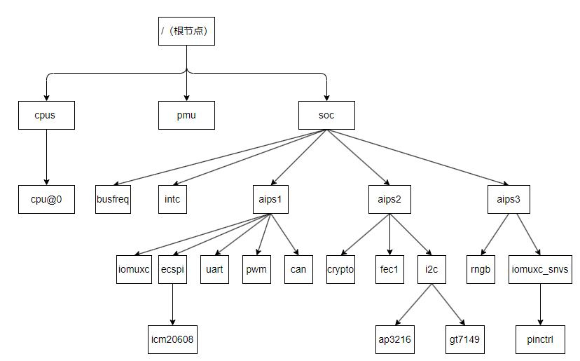
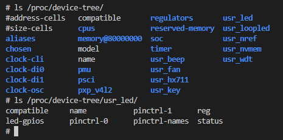

# 设备树说明

对于嵌入式Linux平台，一般由内核(如Cortex-A，RISC-V)，然后通过系统总线(AHB、APB、AXI等)连接GPIO，I2C，SPI，PWM，Ethernet等外设模块组成；而对于具体的产品，又由SOC搭配各种外部器件，如EPPROM，temp-sensor，ETH-Phy，CMOS，FLASH等来实现不同的功能。对于早期内核版本，为了处理这些复杂的SOC和外部硬件结构，使用的方式为维护一套静态硬件Table来管理芯片和板级的差异。这样虽然能够实现功能，但是不同芯片，不同板级的驱动就有大量的冗余代码。而且对于板级硬件的改动，即使不多，也需要完整的内核编译；ARM芯片设计的碎片化又加剧了这一问题，这给系统megre带来众多的麻烦。

为了解决这一问题，就规范了统一设备模型，通过总线，设备和驱动分离的机制来管理这些复杂的硬件设备。对于客观存在的设备差异，则引入DeviceTree来抽象描述硬件信息。设备树在启动后被U-boot传递到内核(通过bootcmd定义)，在内核加载时解析设备树创建对应的设备和总线；这样驱动工程师，只要针对硬件修改设备树和实现对应的驱动即可，简化了开发方式。关于设备树的语法说明，参考网址.

- [设备树说明文档](https://elinux.org/Device_Tree_Usage)

设备树是描述硬件的数据结构，是对硬件结构的抽象。每个硬件节点都映射到实际的器件，如RTC，I2C, SPI，在实际SOC或硬件PCB中都存在相应的模块和器件。这看起来很清晰，不过当进行软件开发时，却并没有那么简单，这里给几个问题，可以带着思考来进行本节的学习。

1. 在I2C引脚挂载带中断引脚输入的RTC，如何添加对应的设备树节点
2. 在系统中增加一个带两路ADC和一路开关的摇杆，如何实现设备树节点

对于网络上有经验分享或者Linux内核支持的设备，会告诉你如何添加可以实现功能；可是为什么这样可以实现，却是复杂的问题。对于芯片原厂或者器件厂商，新研发的产品，又如何通过设备树节点实现功能；这些疑惑在学习了解设备树时一直困扰着我。

如果去关注内核dts目录下的所有设备树，会发现每家厂商的实现在框架基本一致，不过在具体的细节上却差异巨大。理解了NXP的设备树，再去看全志，瑞芯微的设备树，似乎还是有很大障碍。设备树在语法其实有严格的特征限制，可以看到如下规则。

1. 根节点以"/"开始，以节点为基础描述硬件
2. 以"{"和"}"定义节点，支持节点的嵌套
3. 以"&"的方式引用节点
4. 冒号作为语句的结束，同时节点也要以";"结尾
5. 通过include支持引入其它文件
6. 子节点可以继承父节点的属性，不同名称继承父节点属性，相同名称覆盖父节点的属性

这是最基础的规则，违反了则无法实现预期功能，重则直接解析出错，新手这一步就常常出错。不过当具体具体到节点中的属性，包含属性名和值的定义，又会觉得差异巨大。在设备树中，属性名的定义分两类，内核定义的标准属性，以及厂商和开发者定义的私有属性，它们的特性完全不一样。

1. 标准属性：在设备树中定义的，具有特定功能，与内核中相应接口配合访问的属性定义。这类属性的名称和类型都是固定的，有些还要符合一些规则。如compatible表示节点标识符，类型需要为一个或多个字符串类型，在驱动匹配时使用，也可以被of_device_compatible_match访问。这类属性并不少，且十分重要，最初接触的时候，驱动为什么没有正确加载，打印错误，很大可能就是标准属性出错。
2. 由用户或者厂商自定义的私有属性: 私有属性没有特定的功能和类型的限制，在需要时定义，描述开发时需要约束或者配置的功能。在驱动中使用通用访问接口如of_property_read_u32等进行读取属性内容，并用于后续配置和操作。对于厂商来说，私有一般以公司名开始，当然也有直接定义变量，如nxp的"fsl,max_ddr_freq = <400000000>";，全志的"sunxi,audio-codec = <&codec>;"，或者一些直接定义的字符串如"autorepeat;"。这类定义主要在使用芯片厂商提供的驱动，同时需要开关某些功能或者配置时需要了解。当然自己实现驱动时，也可以使用此方式来扩展功能，配合设备树插件可以实现在系统中的内核配置管理功能，例如本系列中以"rmk,xxx"开头的属性，都是由我自定义的属性，会在驱动中进行相应解析。

标准属性因为和内核的访问有关，需要有严格的限制才能在内核启动后被成功解析，并在驱动中使用函数访问。如果只是去理解语法，不去掌握背后的与内核的操作接口，那么就会迷惑为什么要这样定义。而自定义私有属性只要符合节点属性定义语法，即[propery]=[value]就可以实现功能，那么理解这些变量，就必须去驱动中找寻相应的实现才能够知晓功能，只看语法意义就不大，很多时候需要参考芯片手册和驱动才能理解含义。设备树学习的困难之处就在于此，任何一个文档都无法理清楚设备树中所有变量定义的功能需求和逻辑，需要配合着内核API接口，芯片寄存器以及驱动实现去理解。上面说了一大段话，不过你可能还是感觉很抽象，那么这里配合全志的t113_i中的twi，也就是i2c驱动去理解，这里同样进行了备注。

```c
twi2: twi@2502800{
    #address-cells = <1>;                           //标准属性，子节点reg定义标准属性，定义reg中解析地址时个数
    #size-cells = <0>;                              //标准属性，子节点reg定义标准属性，定义reg中解析地址长度时个数
    compatible = "allwinner,sun8i-twi";             //标准属性，标识符，用于内核匹配twi2模块，总线匹配设备和驱动时适配
    device_type = "twi2";                           //标准属性，设备类型
    reg = <0x0 0x02502800 0x0 0x400>;               //标准属性，twi2的寄存器地址<addr-high addr-low size-high size-low>
    interrupts = <GIC_SPI 11 IRQ_TYPE_LEVEL_HIGH>;  //标准属性，指定中断信息<中断控制器 中断线号 触发信号>
    clocks = <&ccu CLK_BUS_I2C2>;                   //标准属性，twi2总线使能时钟
    resets = <&ccu RST_BUS_I2C2>;                   //标准属性, twi2总线复位时钟
    clock-names = "bus";                            //标准属性，twi2总线时钟别名，对应clocks
    clock-frequency = <100000>;                     //标准属性，twi2时钟频率
    status = "disabled";                            //标准属性，twi2模块状态
};

&twi2 {
    clock-frequency = <100000>;                     //标准属性，twi2时钟频率
    pinctrl-0 = <&twi2_pins_a>;                     //标准属性，引脚复用模式默认模式，i2c引脚
    pinctrl-1 = <&twi2_pins_b>;                     //标准属性，引脚复用模式休眠模式，gpio引脚
    pinctrl-names = "default", "sleep";             //标准属性，引脚复用别名
    twi_drv_used = <1>;                             //厂商私有属性，表示是否使用dma fifo模式，启动后dmas属性才被访问
    dmas = <&dma 45>, <&dma 45>;                    //标准属性，用于dma控制外设发送和接收
    dma-names = "tx", "rx";                         //标准属性。dma定义别名，驱动中访问channel通道
    status = "okay";                                //标准属性，twi2模块状态

    rtc@68 {
        compatible = "dallas,ds1307";               //标准属性，标识符，用于驱动匹配设备节点
        reg = <0x68>;                               //标准属性，rtc器件寄存器地址，驱动访问i2c节点使用
    };
};

//驱动中访问方法
//1. 根据compatible属性，查找对应的驱动文件[kernel]/drivers/i2c/busses/i2c-sunxi.c
//2. 查询内部对设备树上属性的访问，这里部分典型属性进行说明。
//3. clk属性
i2c->bus_clk = devm_clk_get(i2c->dev, "bus");           //通过别名获取clock属性
if (IS_ERR(i2c->bus_clk)) {
    dev_err(i2c->dev, "request clock failed\n");        
    return -EINVAL;
}

i2c->reset = devm_reset_control_get(i2c->dev, NULL);   //获取resets属性
if (IS_ERR_OR_NULL(i2c->reset)) {
    dev_err(i2c->dev, "request reset failed\n");
    return -EINVAL;
}

//4.clock-frequency时钟频率
err = of_property_read_u32(np, "clock-frequency", &i2c->bus_freq);
if (err) {
    dev_err(i2c->dev, "failed to get clock frequency\n");
    goto err0;
}

//5.twi_drv_used属性，表示是否使用dma fifo模式
i2c->twi_drv_used = 0;
of_property_read_u32(np, "twi_drv_used", &i2c->twi_drv_used);
return 0;
```

可以看到，对于一个外设模块节点，大部分都是标准属性；用来声明模块的硬件功能。那么理解了这些标准属性，就可以更简单的去掌握和开发设备树。本篇也是以这些标准属性为核心，讲述设备树的语法。

在本篇学习时，可以配合着如下文档学习。

1. [mx6ull设备树分析](./ch03-x6.mx6ull_dts_a    nalysis.md)
2. [设备树访问接口](./ch03-x2.kernel_tree_api.md)

本节目录如下。

- [设备树通用语法](#base)
  - [统一设备模型](#device_model)
  - [include包含语法](#include)
  - [节点说明](#node)
  - [节点路径](#node_path)
- [节点属性定义](#properties_definitions)
  - [属性值类型](#value_type)
  - [通用属性说明](#property_type)
    - [compatible](#compatible)
    - [device_type](#device_type)
    - [dma](#dma)
    - [model](#model)
    - [status](#status)
    - [reg](#reg)
    - [interrupts](#interrupts)
    - [gpio](#name-gpios)
    - [clocks](#clocks)
    - [pinctrl](#pinctrl)
    - [ranges](#ranges)
    - [pwm](#pwm)
    - [regulator](#regulator)
    - [reset](#reset)
    - [io-channels](#io-channels)
    - [aliases](#aliases)
    - [chosen](#chosen)
- [设备树的应用](#dts_apply)
- [设备树总结](#summary_note)
- [next_chapter](#next_chapter)

注意:**在内核启动时不存在的设备(如支持热插拔的USB，PCI设备)无法被创建，因此devicetree也不需要进行描述**。

## base

在深入学习之前，先理解下通用的语法，这也是设备树实现的基础。

### device_model

在硬件中，总线(如i2c, spi等)是SOC和外部器件的连接通道, 在其上挂载着各类器件。不过对于内部模块，如gpio、rtc、wdg、csi等设备，是通过AHB或AXI连接到CPU Core上，这并不属于需要配置的总线。不过为了驱动的统一管理，Linux系统中对于这些内部设备，定义了platform总线来管理。在设备树中，满足以下条件的设备节点会被platform总线管理。

1. 根节点的子节点
2. 根节点的子节点中compatible属性中包含"simple-bus", "simple-mfd", "isa", "arm,amba-bus"时，其子节点会被platform总线管理。
3. 依次类推，多层节点其上层均有上述描述，其子节点也会被platform总线管理

uart属于内部模块，抽象成platform bus总线管理，其在设备树中的节点如下所示。

```c
/ { //根节点
    //...

    soc: soc {
        compatible = "simple-bus";  //声明simple-bus，子节点platform管理
        //...

        aips1: bus@2000000 {
            compatible = "fsl,aips-bus", "simple-bus"; //声明simple-bus，子节点platform管理
            //...

            uart7: serial@2018000 {
                compatible = "fsl,imx6ul-uart", "fsl,imx6q-uart"; //uart7节点也由platform管理
                //...
            };
        };
    };
}
```

按照PCB硬件的设计，其驱动模型如下所示。



参考上图，可以看到硬件外设根据所在总线的不同，进行了区分。

- CPU: 为芯片Core的抽象，包含工作时钟，电压等的定义
- PMU: 芯片电源管理抽象
- SOC: 芯片抽象，内部管理各总线时钟，中断控制器，并根据总线划分管理所有外设以及外部器件。

将上述图形结构以设备树语法的形式描述，实现即如下所示。

```c
/ {
    //...

    cpu {               //core管理节点，定义芯片工作电压，时钟频率等
        cpu0: cpu@0 {
        };
    };

    pmu {               //电源管理节点
    };

    SOC: SOC {          //定义芯片的模块定义，包含clks，中断控制器，dma和各内部模块
        busfreq {
        };

        intc {
        };

        aips1: bus@20000000 {
            ecspi3: spi@2010000 {
                spidev0:icm20608@0 {
                };
            };
            uart1: serial@2020000 {
            };
            can1: can@2090000 {
            };
        };

        aips2: bus@2100000 {
            crypto: crypto@2140000 {
            };
        };
        
        aips3: bus@2200000 {
            rngb: rng@2284000 {
            };
            iomuxc_snvs: iomuxc-snvs@2290000 {
            };
        };
    };
};
```

对于最基础的设备树框架都是由芯片开发厂商实现的，在获得官方的SDK中会提供，一般不需要从头开始实现，如I.MX6ull中的arch/arm/boot/dts/imx6ul.dtsi文件。不过理解基础框架的结构概念，在更新设备树时，就可以知道什么地方需要修改，这对于掌握设备树维护技巧有很大帮助。

设备树相关的文件如下所示。

- dts：设备树的源码文件，用于描述设备硬件情况的抽象
- dtsi：和C语言的#include类似，也是描述设备树的源码文件，另外DTS同样被#include包含
- dtb：基于DTS源码编译的二进制文件，被下载到存储在，启动时内核调用读取设备树信息进行初始化。
- DTC：用于编译DTS到DTB的工具，由内核编译时使用make dtbs编译设备树二进制文件过程中生成。

基于以上信息，我们理解DTS/DTSI是基于DTS语法实现的设备描述文件；DTB则是编译后用于内核解析的二进制文件，也是下载时需要使用的文件；dtc则是进行语法文件以及二进制文件之间转换的工具 。dts语法看起来所见即所得，是一种典型的描述语言，其实内部有很多约束和规定，看起来简单，但适配起来其实相当复杂。

其中最基础的就是组合和覆盖规则，也是设备树修改实现的基础。

1. 对于同一个节点的相同属性，后面定义的属性会覆盖前面节点的数据
2. 节点新增加的属性，会组合添加到最终的dtb输出文件中

这里举个i2c覆盖的例子说明。

```c
i2c0 {
    compatible = "fsl,imx6ul-i2c", "fsl,imx21-i2c";
    
    //.....

    status = "disabled";
};

&i2c0 {
    //......
    pinctrl-0 = <&i2c0_pinctrl>;
    status = "okay";            
};

// dtb中对应i2c0节点
i2c0 {
    compatible = "fsl,imx6ul-i2c", "fsl,imx21-i2c";

    //......

    pinctrl-0 = <&i2c0_pinctrl>;    //不同属性，添加到最终dtb中
    status = "okay";                //相同属性，发生覆盖
}
```

可以看到，当组合成最终节点时，不同的属性发生组合，相同的属性发生覆盖，这就保证最后生成我们预期的属性节点。因为覆盖机制的存在，当包含文件较多时，分析最终输出的状态比较复杂，这时可以通过dtc工具反编译dts，直接从最终源码查看，设备树二进制反编译命令如下。

```shell
# 安装设备树编译工具(编译内核时应该已经安装)
sudo apt install device-tree-compiler

# dtb文件反编译dts
dtc -I dtb -O dts [input].dtb -o [output].dts
```

### include

DTS中#include语法和C语言中类似，支持将包裹的文件直接放置在#include位置从而访问到其它文件的数据，如官方设备树内使用的

```dts
#include <dt-bindings/input/input.h>
#include "imx6ull.dtsi"
```

另外，也可以用来包含dts文件，如下

```dts
#include "imx6ull-14x14-evk.dts"
```

### node

对于设备树来说，基本单元就是node。node从根节点开始，被组织成树状结构，添加不同的设备节点描述的；在系统中node的格式如下所示。

```c
[label:] node-name[@unit-address] {
    [properties definitions]
    [child nodes]
};
```

其中"[]"表示可选，因此可以定义只有node-name的节点，label主要是方便在设备树文件中引用。properties definitions则是定义节点的内部属性，child nodes则是定义子节点；这里举个gpio_keys的节点例子说明。

```c
/{  //根节点
    //......
    gpio_keys: gpio_keys@0 {        //节点名(子节点) [label:] name [@unit_address]          
      compatible = "gpio-keys";     //节点属性 [properties definitions]
      pinctrl-names = "default";
      pinctrl-0 = <&pinctrl_gpio_keys>;
      #address-cells = <1>;
      #size-cells = <0>;
      autorepeat;
 
      key1@1 {                      //节点名(子节点) [child nodes]
         label = "USER-KEY1";       //节点属性 key-value键值对
         linux,code = <114>;
         gpios = <&gpio1 18 GPIO_ACTIVE_LOW>;
         gpio-key,wakeup;
    };
  };
}
```

以下是设备树文件的一些基本概念：

1. 设备树文件都由根节点开始，每个设备只有一个根节点(如果包含多个文件，根节点则会合并)，其它所有设备都作为子节点存在，由节点名和一组节点属性构成。
2. 节点属性都是有property-value的键值对来描述，并以";"结束，不过value可以为空
3. 节点间可以嵌套形成父子关系，这样可以方便描述设备间的关系
4. 节点名支持name@unit_address的格式，其中后面的unit_address可选，一般为设备地址，这是为了用于保证节点是唯一的标识，当然用其它数字也可以。同时，节点名也支持label:name@unit_address的格式, 这里的label就是节点的标签别名，我们可以&label来直接访问节点。如对于gpio_keys: gpio_keys@0 可以通过&gpio_keys来访问clock@ gpio_keys@0，当对于节点添加或者覆盖属性时，通过此方式选择对应节点
5. 在设备树中查找节点需要完整的节点路径，对于项目来说，直接修改官方的dts文件是不推荐的，如果自己建立路径，又过于复杂，因此设备树提供通过标注引用label的方式，允许我们在其它文件中修改已存在的节点，或者添加新的节点

基于这种原则，我们可以通过如下的代码，在已有节点追加新的数据，如使用如下代码在gpio_keys: gpio_keys@0中增加节点。

```c
&gpio_key {                 //引用节点label，进行追加信息
   key2@2 {
      label = "usr-key" ;
      //.....
    }
}
```

### node_path

节点路径是指从根节点到所需节点的完整路径，可以唯一地标识设备树中的节点位置。不同层次的设备树节点名字可以相同，同层次的设备树节点则需要唯一。例如前面节点的结构参考图中， 节点gpio_keys的子节点key1，节点路径就是"/gpio_keys/key"，节点路径可以是驱动中访问节点的一种方式。

## properties_definitions

这里开始深入节点内部，讲述节点内部如何基于属性来定义设备的说明。对于变量来说，有两个重要的部分，一个是变量属性的定义，另一个是变量类型的支持，在本节中进行详细的说明。

### value_type

其中value中常见的几种数据形式如下:

- 空类型

```c
//仅需要键值，用来表示真假类型, 或者值可选的类型
ranges；
```

- 字符串类型

```c
//属性中对应的字符串值。
compatible = "simple-bus";
```

- 字符串表类型

```c
//值也可以为字符串列表，中间用，号隔开，这样既可以支持多个字符串的匹配.
compatible="fsl,sec-v4.0-mon", "syscon", "simple-mfd";

//字符串列表还可以用于给数据进行别名命名
//pxp_ipg表示IMX6UL_CLK_DUMMY
//pxp_axi表示IMX6UL_CLK_PXP
clocks = <&clks IMX6UL_CLK_DUMMY>, <&clks IMX6UL_CLK_PXP>;
clock-names = "pxp_ipg", "pxp_axi";
```

- 无符号整型u32/u64

```c
//定义数组值
offset=<0x38>; 
reg=<0>;
```

- 可编码数组（prop-encoded-array）

```c
//address-cells 指定描述数组中地址单元的数目
//size-cells    指定描述数组中长度单元的数目
#address-cells=<1>;
#size-cells=<0>;
reg = <0x020c406c 0x04>,
    <0x020e0068 0x04>;
```

## property_type

设备树中的类型，主要目的用于描述设备的特征，用于驱动查找，匹配和访问设备。因此设计上就有规定的关键字如compatible，model，status等管理设备的状态，与内核的接口联动。但对于具体的项目来说，自然有一些私有的特征，可以由用户来维护和添加，例如硬件的默认状态，硬件的配置信息等，这些可以通过添加私有的属性，在系统中访问，因此关键字也就分为了官方定义的关键字，这些基本所有芯片通用，还有一类自定义关键字，仅某类芯片或者设备需要，这就需要用户去实现。

### compatible

通用属性。compatible属性是值是由特定编程模型的一个或多个字符串组成，用于将驱动和设备连接起来。我们在驱动中也是通过compatible来选择设备树中指定的硬件，是非常重要的属性(当然部分驱动也支持通过节点名称取匹配)。compatible的格式一般为:"Manufacturer", "Model", 其中Manufacturer表示厂商，可选，Model则表示指定型号，大部分和节点名称一致(不过不一致也不影响实际功能)。

```shell
compatible = "arm,cortex-a7";
compatible = "fsl,imx6ul-pxp-v4l2", "fsl,imx6sx-pxp-v4l2", "fsl,imx6sl-pxp-v4l2";
compatible = "gpio-led";
```

在驱动中，of_match_table数组的compatible属性就是用来匹配对应设备节点，基于严格的字符串匹配，驱动内的字符串和设备树中compatible的值之一要保持完全一致。**这里有个知识点要特别说明，对于有具体总线的器件，如i2c，spi，uart等，驱动会匹配相应总线下的设备，对于不存在总线的设备，如I/O，ADC，通过虚拟总线platform_driver匹配时，需要挂载在根节点上才能被驱动匹配成功。**

```c
// 设备树节点
spidev: icm20608@0 {
    compatible = "rmk,icm20608";
    spi-max-frequency = <8000000>;
    reg = <0>;
};
 
// 设备树匹配的方法
/* 设备树匹配列表 */
static const struct of_device_id icm20608_of_match[] = {
    { .compatible = "rmk,icm20608" },
    { /* Sentinel */ }
};
 
/* SPI驱动结构体 */  
static struct spi_driver icm20608_driver = {
    .probe = icm20608_probe,
    .remove = icm20608_remove,
    .driver = {
            .owner = THIS_MODULE,
            .name = SPI_ICM_NAME,
            .of_match_table = icm20608_of_match, 
    },
};
```

参考上述结构，即可看到通过of_math_table指定设备树匹配列表，找到指定的节点去访问。

### device_type

通用属性，字符串类型。用来描述设备的设备类型，该节点为可选项。

```c
cpu {
    gpio {
        device_type = "gpio";
    }
}
```

### dma

通用属性。对于支持dma的硬件模块(芯片内部模块)，控制dma的访问。

- dmas: 设备节点的属性，可编码数组类型，包含dma的控制和通道
- dmas-names: 给每个dma中断定义别名，一个或者多个字符串组成，可通过别名获取具体通道

dmas中的配置格式如下所示。

"DMA控制器, DMA通道, 优先级, 请求确认寄存器配置"，其中优先级和请求确认寄存器配置可省略。

```c
uart7: serial@2018000 {
    //...

    dmas = <&sdma 43 4 0>, <&sdma 44 4 0>;  //定义dmas的具体通道
    dma-names = "rx", "tx";                 //定义dmas通道的别名，用于驱动中访问
};

//处理dma的相关接口
/* Prepare for RX : */
sport->dma_chan_rx = dma_request_slave_channel(dev, "rx");
//...

slave_config.direction = DMA_DEV_TO_MEM;
slave_config.src_addr = sport->port.mapbase + URXD0;
slave_config.src_addr_width = DMA_SLAVE_BUSWIDTH_1_BYTE;
/* one byte less than the watermark level to enable the aging timer */
slave_config.src_maxburst = RXTL_DMA - 1;
ret = dmaengine_slave_config(sport->dma_chan_rx, &slave_config);

/* Prepare for TX : */
sport->dma_chan_tx = dma_request_slave_channel(dev, "tx");
//...

slave_config.direction = DMA_MEM_TO_DEV;
slave_config.dst_addr = sport->port.mapbase + URTX0;
slave_config.dst_addr_width = DMA_SLAVE_BUSWIDTH_1_BYTE;
slave_config.dst_maxburst = TXTL_DMA;
ret = dmaengine_slave_config(sport->dma_chan_tx, &slave_config);
```

### model

通用属性，字符串类型。model属性指定设备商信息和模块的具体信息，主要用于说明对应的设备树类型。

```c
model = "Freescale i.MX6 ULL 14x14 EVK Board";
```

### status

通用属性，字符串类型。status指示设备树中器件的工作状态。

1. okay：设备可操作，工作正常
2. diabled: 设备目前不可操作，不过对于热插拔设备，可以在后续改变为可操作
3. fail: 出错的，设备不可操作
4. fail-sss: 表示设备不可运行，目前驱动不支持，待修复。“sss”的值与具体的设备相关

```shell
#设备工作正常
status = "okay";

#设备关闭
status = "disabled"
```

### reg

通用属性，可编码数组类型。reg的定义分为两部分，其中cells属性用于定义子节点reg属性内部的分组，reg则定义寄存器的具体内容。

cells属性都为无符号整型，指定当前节点中所有子节点中reg的属性信息，包含#address-cells和#size-cells两个属性。

1. #address-cells 用来描述子节点中"reg"对应属性中描述地址列表中cell数目
2. #size-cells 用来描述子节点中"reg"对应属性中描述长度列表中cell数目。

对于#address-cells和#size-cells属性，使用reg属性上一层的节点中的cells属性确定。如果未定义，则reg属性按照address占2个32位数，size占1个32位数去解析。

```c
//address占位为1，值0x4600
//size占位为1，值为100
SOC {
   #address-cells = <1>;
   #size-cells = <1>;
   serial {
        compatible = "ns16550";
        reg = <0x4600 0x100>;
        //...
    };
};
```

reg属性则由一定个数的地址位和长度位构成，描述设备在父设备地址空间中的总线范围，通过#address-cells和#size-cells变量去解析，另外如果#size-cells的长度位0，则reg中后面关于长度的部分应该去除。此外，在计算真实地址时，还要参考父节点的ranges属性，转换后才是真实的寄存器地址。

reg的举例如下:

```c
// 设备树说明
uart1: serial@2020000 {
    compatible = "fsl,imx6ul-uart",
                "fsl,imx6q-uart";
    reg = <0x02020000 0x4000>;
    //...
};

//内核访问接口
//获取reg属性的资源
res = platform_get_resource(pdev, IORESOURCE_MEM, 0);
device_data->phybase = res->start;
device_data->base = devm_ioremap_resource(dev, res);
```

### interrupts

通用属性。中断相关的属性可以分为两大类，一种时定义支持硬件中断的外设，主要指定管理中断的父节点(也就是中断控制器)，以及具体的中断类型，另一种则告知时中断控制器，具体属性如下所示。
`
支持中断的外设属性功能。

- interrupt-controller: 空属性，将节点声明为中断控制器设备
- #interrupt-cells：是中断控制器节点的属性。它说明此中断控制器的中断说明符中有多少个单元格（类似于#address-cells和#size-cells)
- interrupts: 设备节点的属性，包含中断说明符列表，设备上的每个中断输出信号对应一个
- interrupt-names: 给每个中断项定义别名，可通过别名访问具体中断(可以不存在)
- interrupt-parent: 定义此中断对应的中断控制器，parent指的是interrupt-controller属性中断控制器

```c
usr_key {
    //...
    interrupt-parent = <&gpio1>;     /* key引脚属于gpio1的中断管理 */
    interrupts = <18 (IRQ_TYPE_EDGE_FALLING|IRQ_TYPE_EDGE_RISING)>; /* 在gpio1中的中断线号，触发条件 */
};

//访问api接口
//根据interrupts的值获取转换后中断，此例中为0
int platform_get_irq(struct platform_device *dev, unsigned int num);

//根据gpiod的属性，获取对应的中断线号
int gpiod_to_irq(const struct gpio_desc *desc);

//解析节点获取interrupts中的值
unsigned int irq_of_parse_and_map(struct device_node *node, int index);
```

- interrupt-controller: 定义设备为中断控制器(即接收中断信号并管理的设备)。
- #interrupt-cells：定义子节点的interrupts属性中中断配置的数量。
  - #interrupt-cell=<1>, 表示子节点的interrupt属性只需要1个cell，来表明使用哪个中断
  - #interrupt-cell=<2>, 表示子节点的interrupt属性需要2个cell，分别来表明使用哪个中断，以及中断触发的类型

```c
gpio1: gpio@209c000 {
    //...
    interrupts = <GIC_SPI 66 IRQ_TYPE_LEVEL_HIGH>,
                <GIC_SPI 67 IRQ_TYPE_LEVEL_HIGH>;
    interrupt-controller;
    #interrupt-cells = <2>;
};
```

### name-gpios

通用属性，[name]-gpios属性主要用于在驱动中查询到指定gpio，和pinctrl共同配合使用，构成完整GPIO功能。

- pinctrl: 实现引脚的功能和复用配置，如驱动能力，上下拉
- gpio: 确定引脚号，用于驱动中获取资源，进行访问控制

```c
// 设备树
beep {
    //定义gpio接口
    beep-gpios = <&gpio5 1 GPIO_ACTIVE_LOW>;
};

//设备树访问接口
static gpio_desc *desc = devm_gpiod_get(&pdev-dev, "beep", GPIOD_OUT_LOW);
```

### clocks

通用属性。时钟相关的属性有clocks和clock-names。

- clocks：定义模块相关的时钟控制位，需要在驱动中调用相应的clk接口进行时钟配置
- clock-names: 定义每个时钟的别名，可通过别名获取对应时钟，如果clocks只有一个，可以不使用clock-names，此时代码里可以使用NULL访问
- clock-cells: 时钟说明符clocks中的单元数，0表示单个，1表示则有多个
- assigned-clock*关键字进行配置，使用这种方式配置的时钟，在模块驱动加载时，内核框架会自动配置。
  - assigned-clocks: 指定模块使能时钟，assigned-clocks = <&ccu CLK_G2D>;
  - assigned-clock-rates: 指定需要配置的时钟频率
  - assigned-clock-parents: 指定模块的父时钟，assigned-clocks-parents = <&ccu, xxx>

```c
// 设备树节点
clks: clock-controller@20c4000 {
    //......
    #clock-cells = <1>;
    clocks = <&ckil>, <&osc>, <&ipp_di0>, <&ipp_di1>;
    clock-names = "ckil", "osc", "ipp_di0", "ipp_di1";
};

adc1: adc@2198000 {
    //.....
    clocks = <&clks IMX6UL_CLK_ADC1>;
    clock-names = "adc";
};

//内核访问接口
info->clk = devm_clk_get(&pdev->dev, "adc");    //获取设备树中时钟资源
ret = clk_prepare_enable(info->clk);            //使能ADC模块时钟 
```

### pinctrl

通用属性。引脚相关的属性有pinctrl-x, pinctrl-names和xxx-gpios功能。对于NXP的芯片，需要对于所有使用的GPIO指定引脚功能，无论是普通GPIO，还是复用成其它外设，而对于RK3568这类芯片，仅复用引脚时才定义成相应的类型。

- pinctrl-x: 指定引脚的复用功能，在设备树加载时根据复用功能，配置相应的寄存器，x的值为"0~num".
- pinctrl-names: 指定每个引脚的别名，可通过别名获取引脚配置
- xxx-gpios: 定义gpio的管理状态，包含如下。
  - GPIO_ACTIVE_HIGH: 内部逻辑和外部电平一致
  - GPIO_ACTIVE_LOW: 内部逻辑和外部电平相反

```c
usr_led {
    //...
    pinctrl-names = "default", "improve";
    pinctrl-0 = <&pinctrl_gpio_led>;
    pinctrl-1 = <&pinctrl_led_improve>;
}
//default对应pinctrl-0别名，improve对应pinctrl-1别名
led_pinctrl = devm_pinctrl_get(&pdev->dev);
pState0 = pinctrl_lookup_state(led_pinctrl, "default");
pState1 = pinctrl_lookup_state(led_pinctrl, "improve");
pinctrl_select_state(led_pinctrl, pState0);
```

### ranges

通用属性。empty或者child-bus-address、parent-bus-address、length类型，主要为处理子节点的reg属性。ranges属性值为空值，说明子节点继承父节点的地址域，使用相同的起始物理地址；ranges非空时是一个地址映射/转换表，ranges属性每个项目由子地址、父地址和地址空间长度三部分组成。

- child-bus-address：子总线地址空间的物理地址
- parent-bus-address：父总线地址空间的物理地址
- length：子地址空间的长度

则地址的转换公式为addr="reg_addr"+"parent-bus-address"-"child-bus-address"。

```c
    crypto: crypto@2140000 {
        compatible = "fsl,imx6ul-caam", "fsl,sec-v4.0";
        #address-cells = <1>;
        #size-cells = <1>;
        reg = <0x2140000 0x3c000>;
        ranges = <0 0x2140000 0x3c000>;

        sec_jr0: jr@1000 {
            compatible = "fsl,sec-v4.0-job-ring";
            reg = <0x1000 0x1000>;
            interrupts = <GIC_SPI 105 IRQ_TYPE_LEVEL_HIGH>;
        };

        sec_jr1: jr@2000 {
            compatible = "fsl,sec-v4.0-job-ring";
            reg = <0x2000 0x1000>;
            interrupts = <GIC_SPI 106 IRQ_TYPE_LEVEL_HIGH>;
        };

        sec_jr2: jr@3000 {
            compatible = "fsl,sec-v4.0-job-ring";
            reg = <0x3000 0x1000>;
            interrupts = <GIC_SPI 46 IRQ_TYPE_LEVEL_HIGH>;
        };
    };
```

从上可知，sec_jr0的寄存器地址占1位，长度1位，以sec_jr0为例，reg_addr = 0x2000，size = 0x1000，另外其父节点支持range属性，且需要转换，则sec_jr0的实际物理地址计算如下。

- reg_addr = 0x2140000- 0 + 0x2000 = 0x2142000
- size = 0x1000

### pwm

通用属性，pwm是一系列用于描述pwm模块，通道，配置的属性，主要如下所示。

1. #pwm-cells: 描述引用pwms单元后，数据的数量(不包含引用设备本身)
2. pwms ：描述pwm单元的引用、通道和配置, pwms = <reference, index, peroid, [flags]>

- reference: 对于pwm的引用，例如&pwm1
- index: pwm通道，表示在pwm内部的索引值
- peroid: pwm周期，以ns为单位
- flags: pwm工作状态
    PWM_POLARITY_NORMAL：正常模式，占空比表示高
    PWM_POLARITY_INVERSED: 翻转模式，占空比表示低

```c
//例程
&pwm1 {
    #pwm-cells = <2>;
    pinctrl-names = "default";
    pinctrl-0 = <&pinctrl_pwm1>;
    status = "okay";
};

backlight-display {
    compatible = "pwm-backlight";
    pwms = <&pwm1 0 5000000>;
    brightness-levels = <0 4 8 16 32 64 128 255>;
    default-brightness-level = <6>;
    status = "okay";
};
```

### regulator

regulator是用于定义和管理模块电源的工作模式，主要属性如下。

```c
//vcc-supply:芯片的主电源电压，有时在数据表上称为VDD。如果没有单独的vref供应，则需要建立通道缩放。
//vref-supply: 一些设备(adc芯片，内部adc的vref输入)需要有一个特定的参考电压提供在不同的引脚到其他电源

//定义设备树
regulator_vref_adc: regulator@1 {
    compatible = "regulator-fixed";
    regulator-name = "VREF_3V";
    regulator-min-microvolt = <3300000>;
    regulator-max-microvolt = <3300000>;
};

&adc1 {
    //...
    vref-supply = <&regulator_vref_adc>;
    status = "okay";
};

//设备树访问接口
info->vref = devm_regulator_get(&pdev->dev, "vref");  //对应vref-supply
if (IS_ERR(info->vref)) {
    dev_err(&pdev->dev, "failed get vref regulator");
    return PTR_ERR(info->vref);
}
ret = regulator_enable(info->vref);
if (ret) {
    dev_err(&pdev->dev, "failed enable vref regulator");
    return ret;
}
```

### reset

resets指定复位硬件的资源，设备树格式如下。

1. resets: 模块复位线号，一般是复位时钟相关位
2. reset-names: 复位资源别名，驱动中访问reset资源的名称

```c
//定义设备树
ledc: ledc@2008000 {
    compatible = "allwinner,sunxi-leds";
    //...
    resets = <&ccu RST_BUS_LEDC>;  //模块时钟控制线号
    reset-names = "ledc_reset";    //模块时钟复位别名，用于驱动中访问
};

//设备树访问接口
//获取reset对应线号
led->reset = devm_reset_control_get(&pdev->dev, NULL);
if (IS_ERR(led->reset)) {
    LED_ERR("get reset clk error\n");
    return -EINVAL;
}
//取消断言，停止复位
ret = reset_control_deassert(led->reset);
if (ret) {
    LED_ERR("deassert clk error, ret:%d\n", ret);
    return ret;
}
//复位模块
reset_control_assert(led->reset);
```

### io-channels

io-channel是定义访问iio设备的节点特性的说明。

1. #io-channel-cells: 子节点访问时，允许输出的iio channel数目，0表示一路，1表示多路
2. io-channel-rangs: 继承了当前节点的子节点可以引用当前节点的 IIO channel
3. io-channels: 遥感对应的adc接口，<对应adc模块 adc模块中注册通道的顺序>

```c
//定义设备树
&adc1 {
    #io-channel-cells = <1>;                            //子节点访问时，允许输出的iio channel数目，0表示一路，1表示多路
    io-channel-rangs;                                   //继承了当前节点的子节点可以引用当前节点的 IIO channel
    //...
};

joystick: adc-joystick {
    compatible = "adc-joystick";                        //标签，移动遥感驱动匹配的字符串
    io-channels = <&adc1 0>,                            //遥感对应的adc接口，<对应adc模块 adc模块中注册通道的顺序>
                <&adc1 1>;
    //...
}
```

### aliases

aliases子节点是特殊的节点，用于给其它节点起一个别名。

```c
{
    aliases {
        ethernet0 = &fec1;
        ethernet1 = &fec2;
        //...
    }
}
```

以ethernet0 = &fec1为例。fec0是一个节点的名字，设置别名后我们可以使用ethernet0来指代fec0节点，与节点标签类似。在设备树中更多的是为节点添加标签，没有使用节点别名，别名的作用是快速找到设备树节点。在驱动中如果要查找一个节点，通常情况下我们可以使用节点路径一步步找到节点，也可以使用别名一步到位找到节点。

### chosen

```c
    chosen {
        bootargs = "...";
    };
```

chosen子节点不代表实际硬件，它主要用于给内核传递参数。此外这个节点还用作uboot向linux内核传递配置参数的通道, 我们在Uboot中设置的参数就是通过这个节点传递到内核的，替代全局参数中的bootargs.

## dts_apply

对于嵌入式Linux设备，语法树是在/sys/firmware/devicetree下，可使用

```shell
# 内核中显示设备树的路径
ls /sys/firmware/devicetree/base/

# 设备树路径
ls /proc/device-tree
```

其显示如下。



对于驱动中，访问设备树具体的函数参考文档：[设备树访问接口API](./ch03-x2.kernel_tree_api.md)，这里列出部分接口，具体如下。

```c
//根据节点路径寻找节点函数
struct device_node *of_find_node_by_path(const char *path)

//根据节点名字寻找节点函数
struct device_node *of_find_node_by_name(struct device_node *from, const char *name);

//根据节点名字寻找节点函数
struct device_node *of_find_node_by_name(struct device_node *from, const char *name);

//根据节点类型寻找节点函数
struct device_node *of_find_node_by_type(struct device_node *from, const char *type)

//根据节点类型和compatible属性寻找节点函数
struct device_node *of_find_compatible_node(struct device_node *from,const char *type, const char *compatible)

//根据匹配表寻找节点函数
static inline struct device_node *of_find_matching_node_and_match(struct device_node *from, const struct of_device_id *matches, const struct of_device_id **match)

//寻找父节点函数
struct device_node *of_get_parent(const struct device_node *node)

//寻找子节点函数
struct device_node *of_get_next_child(const struct device_node *node, struct device_node *prev)

//查找节点属性函数
struct property *of_find_property(const struct device_node *np,const char *name,int *lenp)

//8位整数读取函数
int of_property_read_u8_array(const struct device_node *np, const char *propname, u8 *out_values, size_t sz)

//16位整数读取函数
int of_property_read_u16_array(const struct device_node *np, const char *propname, u16 *out_values, size_t sz)

//32位整数读取函数
int of_property_read_u32_array(const struct device_node *np, const char *propname, u32 *out_values, size_t sz)

//64位整数读取函数
int of_property_read_u64_array(const struct device_node *np, const char *propname, u64 *out_values, size_t sz)

//8位整数读取函数
int of_property_read_u8 (const struct device_node *np, const char *propname,u8 *out_values)

//16位整数读取函数
int of_property_read_u16 (const struct device_node *np, const char *propname,u16 *out_values)

//32位整数读取函数
int of_property_read_u32 (const struct device_node *np, const char *propname,u32 *out_values)

//64位整数读取函数
int of_property_read_u64 (const struct device_node *np, const char *propname,u64 *out_values)

//读取字符串属性函数
int of_property_read_string(const struct device_node *np,const char *propname,const char **out_string)

//读取布尔型属性函数
static inline bool of_property_read_bool(const struct device_node *np, const char *propname);

//内存映射相关of函数
void __iomem *of_iomap(struct device_node *np, int index)
int of_address_to_resource(struct device_node *dev, int index, struct resource *r);
```

## summary_note

至此，对设备树的语法进行了初步的讲解，当然在实际驱动开发中，熟悉这些知识还是不够的，日常打交道还有很多是芯片厂商或者方案商定义的具有特定功能的自定义私有属性键值对，这就需要长期的积累了。不过理解了设备树语法的原理，反过来去理解这些自定义私有属性，就比较清晰明了的。这篇文章只能算是对设备树语法的入门指引，如果希望深入去掌握嵌入式驱动开发，还是配合着实际产品的硬件框架，在实际任务的维护或者修改设备树，再结合参考资料中提到的文档和本文的说明，带着目的去学习，才是高效且快速的方式。

上面讲到了通过设备树可以描述板级的设备硬件，那么Device Tree是否需要描述系统中的所有硬件信息呢？这个答案是否定的，能够被动态探测的设备是不需要设备树描述的，例如USB Deivce(如U盘，USB网卡，USB键盘等)；在系统启动时并不存在，而是在系统运行过程中，通过USB总线动态的添加到系统中。得益于统一设备模型，这类设备可以先将驱动挂载到总线上；动态探测设备时，在系统中就会创建相应的设备节点，并执行对应的程序即可实现全部功能。

不过在本节还有两个问题，例如I2C引脚挂载带中断引脚输入的RTC，该如何实现设备树呢，这里说下方法。

### i2c接口挂载rtc

- 确定硬件信息，如下所示。

| 硬件信息 | 具体说明 |
| --- | --- |
| RTC芯片类型 | PCF8563 |
| I2C地址 | 0x51 |
| 挂载位置 | I2C2 |
| 中断引脚 | GPIO1_2 |

- 在I2C下挂载节点，地址51

```c
&i2c2 {
    pcf8563: pcf8563@51 {
        compatible = "rmk,pcf8563";
        reg = <0x51>;
        status = "okay";
    };    
};
```

- 引入中断引脚

对于中断的实现，包含三部分

1. pinctrl的支持
2. gpio的定义
3. 中断的定义

扩展中断引脚支持，结果如下所示。

```c
&i2c2 {
    //...
    
    pcf8563: pcf8563@51 {
        compatible = "rmk,pcf8563";
        reg = <0x51>;

        //pinctrl的引入
        pinctrl-0 = <&pinctrl_rtc>;
        pinctrl-names = "default";

        //gpio的定义
        alarm-gpios = <&gpio1 2 GPIO_ACTIVE_LOW>;

        //中断的支持
        interrupt-parent = <&gpio1>;
        interrupts = <2 IRQ_TYPE_LEVEL_LOW>;

        status = "okay";
    };    
};
```

可以看到，一个外挂i2c-rtc设备树节点就实现了，后续就需要驱动对这些硬件进行访问和操作。

## next_chapter

[返回目录](../README.md)

直接开始下一节说明: [ARM内核和硬件分析](./ch03-02.armcore_analyse.md)
