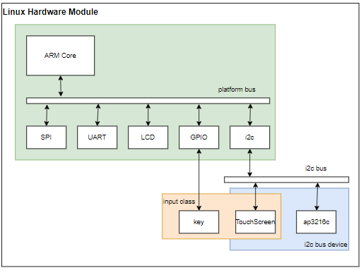
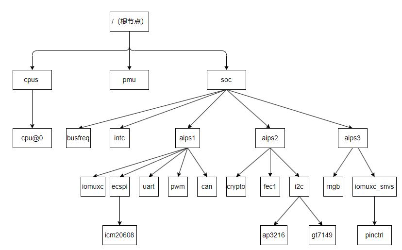

# 设备树说明

对于大部分支持嵌入式Linux芯片Soc来说，一般由内核(如Cortex-A，RISC-V), 然后通过系统总线(AHB, APB, AXI等)挂载的GPIO，I2C，SPI，PWM，Ethernet等外设模块构成。而对于具体的产品，又由Soc搭配外部器件，如I2C器件，ETH Phy，CMOS等，从而满足不同功能的需求。

对于早期内核版本，针对每款Soc内部都维护一套静态硬件table来管理芯片和板级的差异。这样虽然能够实现功能，但是不同芯片之间有代码大量冗余，而且对于板级很小硬件的改动，都需要去代码中修改，这在Linux系统合并时带来大量的工作，引起了Linus的不满，经过争辩讨论后，最后重新设计了由设备，总线和驱动构成的统一设备模型来管理Linux内核中的驱动。对于客观存在的设备差异，则引入devicetree模型来统一抽象描述硬件信息，在内核加载时解析创建对应的设备和总线，这样非BSP的驱动工程师，只要针对硬件修改设备树和实现对应的驱动即可，简化了开发方式。关于设备树的说明，参考网址.

[设备树说明文档](https://elinux.org/Device_Tree_Usage)

注意: **Linux内核虽然规定了设备树的形式，以及部分属性关键字，不过对于不同的芯片，仍然有大量私有定义的键值属性对，因此学习设备树时，不能照搬硬套，要多思考运用，才能应对大部分场景需求。**

本节目录如下。

- [统一驱动模型和设备树](#base)
- [include包含语法](#include)
- [节点和功能](#node)
- [设备树数据格式](#value_type)
- [设备树键值属性](#key_type)
  - [compatible](#compatible)
  - [model](#model)
  - [status](#status)
  - [reg](#reg)
  - [interrupt](#interrupts)
  - [clocks](#clocks)
  - [pinctrl](#pinctrl)
  - [ranges](#ranges)
  - [device_type](#device_type)
  - [pwm](#pwm)

注意:**在内核启动时不存在的设备(如支持热插拔的USB，PCI设备)无法被创建，因此devicetree也不需要进行描述**。

## base



在之前讲驱动模型的时候，提供了上述图来说明总线，设备和驱动的关系。可以看到，在硬件中，总线是soc外设和外部器件的连接通道(如i2c, spi等), 在其上挂载着各类器件。不过对于内部模块，如gpio, rtc, i2c controller等设备，是通过内部总线连接到CPU Core上，并不属于需要配置的总线。不过Linux系统中对于这些内部设备，定义了虚拟的platform总线(可通过/sys/bus/platform查看)来管理, 这就实现了对于驱动的同一个管理框架。

在设备树中，满足以下条件的设备节点会被platform总线管理。

1. 根节点的子节点
2. 根节点的子节点中compatible属性中包含"simple-bus", "simple-mfd", "isa", "arm,amba-bus"时，其子节点会被platform总线管理。



上面是官方提供的驱动模型，可以看到硬件外设根据所在总线的不同，进行了区分。

- CPU: 为芯片Core的抽象，包含工作时钟，电压等的定义
- PMU: 芯片电源管理抽象
- SOC: 芯片抽象，内部管理各总线时钟，中断控制器，并根据总线划分管理所有外设以及外部器件。

将上述图形结构以设备树语法的形式描述，实现即如下所示。

```shell
/ {
    cpu {
        cpu0: cpu@0 {
        };
    };

    pmu {
    };

    soc: soc {
        busfreq {
        };

        intc {
        };

        aips1: bus@20000000 {
            ecspi3: spi@2010000 {
                spidev0:icm20608@0 {
                };
            };
            uart1: serial@2020000 {
            };
            can1: can@2090000 {
            };
        };

        aips2: bus@2100000 {
            crypto: crypto@2140000 {
            };
        };
        
        aips3: bus@2200000 {
            rngb: rng@2284000 {
            };
            iomuxc_snvs: iomuxc-snvs@2290000 {
            };
        };
    };
};
```

对于最基础的设备树框架都是由芯片开发厂商实现的，在获得官方的SDK中会提供，一般不需要从头开始实现，如I.MX6ull中的arch/arm/boot/dts/imx6ul.dtsi文件。不过有这个基础框架的结构概念，在更新设备树时，就可以知道什么地方需要修改，这对于理解掌握设备树有很大帮助。另外，设备树需要涉及的文件包含如下。

- DTS：设备树的源码文件，用于描述设备硬件情况的抽象
- DTSI：和C语言的#include类似，也是描述设备树的源码文件，另外DTS同样被#include包含
- DTB：基于DTS源码编译的二进制文件，用于内核调用读取设备树信息的文件。
- DTC：用于编译DTS到DTB的工具，由内核编译时使用make dtbs编译设备树二进制文件过程中生成。

基于以上信息，我们理解DTS/DTSI是基于DTS语法实现的设备描述文件，DTB则是编译后用于内核解析的二进制文件，也是下载后需要使用的文件。dts语法看起来所见即所得，其实有很多约束和规定，是一个看起来简单，适配起来复杂的问题，这里有个覆盖规则是设备树修改实现的基础。

1. 对于同一个节点的相同属性，后面定义的节点会覆盖前面节点的数据
2. 节点新增加的属性，会组合添加到最终的dtb文件中

这里举个例子说明。

```c
i2c0 {
    compatible = "fsl,imx6ul-i2c", "fsl,imx21-i2c";
    
    //.....

    status = "disabled";
};

&i2c0 {
    //......
    pinctrl-0 = <&i2c0_pinctrl>;
    status = "okay";            
};

#dtb中对应i2c0节点为
i2c0 {
    compatible = "fsl,imx6ul-i2c", "fsl,imx21-i2c";

    //......

    pinctrl-0 = <&i2c0_pinctrl>;    //不同属性，添加到最终dtb中
    status = "okay";                //相同属性，发生覆盖
}
```


## include

DTS中#include语法和C语言中类似，支持将包裹的文件直接放置在#include位置从而访问到其它文件的数据，如官方设备树内使用的

```dts
#include <dt-bindings/input/input.h>
#include "imx6ull.dtsi"
```

另外，也可以用来包含dts文件，如下

```dts
#include "imx6ull-14x14-evk.dts"
```

## node

对于设备树来说，都是有根节点开始，在添加不同的设备节点描述的，以比较简单的LED设备树为例:

```c
/{  //根节点
    //......
    led { //节点名(子节点) <name> 
       compatible = "gpio-led";  //节点属性
       pinctrl-names = "default";
       pinctrl-0 = <&pinctrl_gpio_leds>;
       led-gpio = <&gpio1 3 GPIO_ACTIVE_LOW>;
       status = "okay";
    };
 
    gpio_keys: gpio_keys@0 {    //节点名(子节点) <label>:<name>[@<unit_address>]          
      compatible = "gpio-keys";  //节点属性
      pinctrl-names = "default";
      pinctrl-0 = <&pinctrl_gpio_keys>;
      #address-cells = <1>;
      #size-cells = <0>;
      autorepeat;
 
      key1@1 {   //节点名(子节点) <name>[@<unit_address>] 
         label = "USER-KEY1"; //节点属性 key-value键值对
         linux,code = <114>;
         gpios = <&gpio1 18 GPIO_ACTIVE_LOW>;
         gpio-key,wakeup;
    };
  };
}
```

1. 设备树文件都由根节点开始，每个设备只有一个根节点(如果包含多个文件，根节点则会合并)，其它所有设备都作为子节点存在，由节点名和一组节点属性构成。
2. 节点属性都是有key-value的键值对来描述，并以";"结束
3. 节点间可以嵌套形成父子关系，这样可以方便描述设备间的关系
4. 节点名支持name@unit_address的格式，其中后面的unit_address可选，一般为设备地址，这是为了用于保证节点是唯一的标识，当然用其它数字也可以。同时，节点名也支持label:name@unit_address的格式, 这里的label就是节点的标签别名，我们可以&label来直接访问节点。如对于gpio_keys: gpio_keys@0 可以通过&gpio_keys来访问clock@ gpio_keys@0，后面我们就将用到这个说明。
5. 在设备树中查找节点需要完整的节点路径，对于项目来说，直接修改官方的dts文件是不推荐的，如果自己建立路径，又过于复杂，因此设备树提供通过标注引用label的方式，允许我们在其它文件中修改已存在的节点，或者添加新的节点，对于节点的合并原理，包含以下原则:不同的属性信息进行合并, 相同的属性信息进行覆写.

基于这种原则，我们可以通过如下的代码，在已有节点添加更新新的数据，如使用如下代码在gpio_keys: gpio_keys@0中增加节点。

```shell
&gpio_key{
   key2@2{
      label="usr-key2”;
      //.....
    }
}
```

上面就是节点相关的信息，下面就开始深入节点内部，讲述节点内部如何基于属性来定义设备的说明。

在驱动中可以同/node-1/node-2/.../node-n的方式访问到指定设备节点，如上面的访问key1@1节点即为/gpio_keys@0/key1@1, 方式即可访问到指定key1@1节点

## value_type

其中value中常见的几种数据形式如下:

### 空类型

```c
//仅需要键值，用来表示真假类型, 或者值可选的类型
ranges；
```

### 文本字符串(以\0结尾)

```c
//属性中对应的字符串值。
compatible = "simple-bus";
```

### 字符串表strlist

```c
//值也可以为字符串列表，中间用，号隔开，这样既可以支持多个字符串的匹配.
compatible="fsl,sec-v4.0-mon", "syscon", "simple-mfd";

//字符串列表还可以用于给数据进行别名命名
//pxp_ipg表示IMX6UL_CLK_DUMMY
//pxp_axi表示IMX6UL_CLK_PXP
clocks = <&clks IMX6UL_CLK_DUMMY>, <&clks IMX6UL_CLK_PXP>;
clock-names = "pxp_ipg", "pxp_axi";
```

### 无符号整型u32/u64

```c
//定义数组值
offset=<0x38>; 
reg=<0>;
```

- 可编码数组prop-encoded-array

```c
//address-cells 指定描述数组中地址单元的数目
//size-cells    指定描述数组中长度单元的数目
#address-cells=<1>;
#size-cells=<0>;
reg = <0x020c406c 0x04>,
    <0x020e0068 0x04>;
```

## key_type

### compatible

通用属性。compatible属性是值是由特定编程模型的一个或多个字符串组成，用于将驱动和设备连接起来。我们在驱动中也是通过compatible来选择设备树中指定的硬件，是非常重要的属性(当然部分驱动也支持通过节点名称取匹配)。compatible的格式一般为:"Manufacturer", "Model", 其中Manufacturer表示厂商，可选，Model则表示指定型号，大部分和节点名称一致(不过不一致也不影响实际功能)。

```shell
compatible = "arm,cortex-a7";
compatible = "fsl,imx6ul-pxp-v4l2", "fsl,imx6sx-pxp-v4l2", "fsl,imx6sl-pxp-v4l2";
compatible = "gpio-led";
```

在驱动中，of_match_table数组的compatible属性就是用来匹配对应设备节点，基于严格的字符串匹配，驱动内的字符串和设备树中compatible的值之一要保持完全一致。**这里有个知识点要特别说明，对于有具体总线的器件，如i2c，spi，uart等，驱动会匹配相应总线下的设备，对于不存在总线的设备，如I/O，ADC，通过虚拟总线platform_driver匹配时，需要挂载在根节点上才能被驱动匹配成功。**

```shell
spidev: icm20608@0 {
    compatible = "rmk,icm20608";
    spi-max-frequency = <8000000>;
    reg = <0>;
};
 
/* 设备树匹配列表 */
static const struct of_device_id icm20608_of_match[] = {
    { .compatible = "rmk,icm20608" },
    { /* Sentinel */ }
};
 
/* SPI驱动结构体 */  
static struct spi_driver icm20608_driver = {
    .probe = icm20608_probe,
    .remove = icm20608_remove,
    .driver = {
            .owner = THIS_MODULE,
            .name = SPI_ICM_NAME,
            .of_match_table = icm20608_of_match, 
    },
};
```

参考上述结构，即可看到通过of_math_table指定设备树匹配列表，找到指定的节点去访问。

### model

通用属性。model属性指定设备商信息和模块的具体信息，主要用于说明对应的设备树类型。

```shell
model = "Freescale i.MX6 ULL 14x14 EVK Board";
```

### status

通用属性。status指示设备树中器件的工作状态。

1. okay：设备可操作，工作正常
2. diabled: 设备目前不可操作，不过对于热插拔设备，可以在后续改变为可操作
3. failed: 出错的，设备不可操作

```shell
#设备工作正常
status = "okay";

#设备关闭
status = "disabled"
```

### reg

通用属性。reg的定义分为两部分，其中cells属性用于定义寄存器内部的分组，reg则定义寄存器的具体范围。cells属性都为无符号整型，指定当前节点中所有子节点中reg的属性信息，包含#address-cells和#size-cells两个属性。

1. #address-cells 用来描述字节点中"reg"对应属性中描述地址列表中cell数目
2. #size-cells 用来描述字节点中"reg"对应属性中描述长度列表中cell数目。

对于#address-cells和#size-cells属性，使用reg属性上一层的节点中的cells属性确定。如果未定义，则reg属性按照address占2个32位数，size占1个32位数去解析。

```c
//address占位为1，值0x4600
//size占位为1，值为0下100
soc {
   #address-cells = <1>;
   #size-cells = <1>;
   serial {
        compatible = "ns16550";
        reg = <0x4600 0x100>;
        clock-frequency = <0>;
        interrupts = <0xA 0x8>;
        interrupt-parent = <&ipic>;
    };
};
```

reg属性则由一定个数的地址位和长度位构成，描述设备在父设备地址空间中的总线范围，通过#address-cells和#size-cells变量去解析，另外如果#size-cells的长度位0，则reg中后面关于长度的部分应该去除。此外，在计算真实地址时，还要参考父节点的ranges属性，转换后才是真实的寄存器地址。

reg的举例如下:

```shell
//指定reg addr的范围长度
#address-cells = <1>;  
//指定reg size的范围长度        
#size-cells = <0>;             

ethphy0: ethernet-phy@0 {
    compatible = "ethernet-phy-ieee802.3-c22";
    reg = <0>;  //实际reg对应的寄存器地址和范围
};
```

### interrupts

通用属性。中断相关的属性可以分为两大类，一种时定义支持硬件中断的外设，主要指定管理中断的父节点(也就是中断控制器)，以及具体的中断类型，另一种则告知时中断控制器，具体属性如下所示。

支持中断的外设属性功能。

- interrupt-controller: 空属性，将节点声明为中断控制器设备
- #interrupt-cells：是中断控制器节点的属性。它说明此中断控制器的中断说明符中有多少个单元格（类似于#address-cells和#size-cells)
- interrupts: 设备节点的属性，包含中断说明符列表，设备上的每个中断输出信号对应一个
- interrupt-names: 给每个中断项定义别名，可通过别名访问具体中断(可以不存在)
- interrupt-parent: 定义此中断对应的中断控制器，parent指的是interrupt-controller属性中断控制器

```c
usr_key {
    //...
    interrupt-parent = <&gpio1>;     /* key引脚属于gpio1的中断管理 */
    interrupts = <18 (IRQ_TYPE_EDGE_FALLING|IRQ_TYPE_EDGE_RISING)>; /* 在gpio1中的中断线号，触发条件 */
};

//访问api接口
//根据interrupts中的标签获取转换后中断，此例中为0
int platform_get_irq(struct platform_device *dev, unsigned int num);

//根据节点标签的位置获取转换后的中断线号
unsigned int irq_of_parse_and_map(struct device_node *node, int index);
```

- interrupt-controller: 定义设备为中断控制器(即接收中断信号并管理的设备)。
- #interrupt-cells：定义子节点的interrupts属性中中断配置的数量。
  - #interrupt-cell=<1>, 表示子节点的interrupt属性只需要1个cell，来表明使用哪个中断
  - #interrupt-cell=<1>, 表示子节点的interrupt属性需要2个cell，分别来表明使用哪个中断，以及中断触发的类型

```c
gpio1: gpio@209c000 {
    //...
    interrupts = <GIC_SPI 66 IRQ_TYPE_LEVEL_HIGH>,
                <GIC_SPI 67 IRQ_TYPE_LEVEL_HIGH>;
    interrupt-controller;
    #interrupt-cells = <2>;
};
```

### clocks

通用属性。时钟相关的属性有clocks和clock-names。

- clocks：定义模块相关的时钟控制位
- clock-names: 定义每个时钟的别名，可通过别名获取对应时钟，如果clocks只有一个，可以不使用clock-names，此时代码里可以使用NULL访问。
- clock-cells: 时钟说明符clocks中的单元数，0表示单个，1表示则有多个

```c
adc1: adc@2198000 {
    //.....
    clocks = <&clks IMX6UL_CLK_ADC1>;
    clock-names = "adc";
};

ckil: clock-cli {
    //......
    #clock-cells = <0>;
    clock-frequency = <32768>;
    clock-output-names = "ckil";
};

clks: clock-controller@20c4000 {
    //......
    #clock-cells = <1>;
    clocks = <&ckil>, <&osc>, <&ipp_di0>, <&ipp_di1>;
    clock-names = "ckil", "osc", "ipp_di0", "ipp_di1";
};
```

### pinctrl

通用属性。引脚相关的属性有pinctrl-x, pinctrl-names和xxx-gpios功能。对于NXP的芯片，需要对于所有使用的GPIO指定引脚功能，无论是普通GPIO，还是复用成其它外设，而对于RK3568这类芯片，仅复用引脚时才定义成相应的类型。

- pinctrl-x: 指定引脚的复用类型，x的值为"0~".
- pinctrl-names: 指定每个引脚的别名，可通过别名获取引脚配置
- xxx-gpios: 定义gpio的管理状态，包含如下。
  - GPIO_ACTIVE_HIGH: 内部逻辑和外部电平一致
  - GPIO_ACTIVE_LOW: 内部逻辑和外部电平相反

```c
usr_led {
    //...
    pinctrl-names = "default", "improve";
    pinctrl-0 = <&pinctrl_gpio_led>;
    pinctrl-1 = <&pinctrl_led_improve>;
}
//default对应pinctrl-0别名，improve对应pinctrl-1别名
led_pinctrl = devm_pinctrl_get(&pdev->dev);
pState0 = pinctrl_lookup_state(led_pinctrl, "default");
pState1 = pinctrl_lookup_state(led_pinctrl, "improve");
pinctrl_select_state(led_pinctrl, pState0);
```

### ranges

通用属性。empty或者child-bus-address、parent-bus-address、length类型，主要为处理子节点的reg属性。ranges属性值为空值，说明子节点继承父节点的地址域，使用相同的起始物理地址；ranges非空时是一个地址映射/转换表，ranges属性每个项目由子地址、父地址和地址空间长度三部分组成。

- child-bus-address：子总线地址空间的物理地址
- parent-bus-address：父总线地址空间的物理地址
- length：子地址空间的长度

则地址的转换公式为addr="reg_addr"+"parent-bus-address"-"child-bus-address"。

```c
    crypto: crypto@2140000 {
        compatible = "fsl,imx6ul-caam", "fsl,sec-v4.0";
        #address-cells = <1>;
        #size-cells = <1>;
        reg = <0x2140000 0x3c000>;
        ranges = <0 0x2140000 0x3c000>;

        sec_jr0: jr@1000 {
            compatible = "fsl,sec-v4.0-job-ring";
            reg = <0x1000 0x1000>;
            interrupts = <GIC_SPI 105 IRQ_TYPE_LEVEL_HIGH>;
        };

        sec_jr1: jr@2000 {
            compatible = "fsl,sec-v4.0-job-ring";
            reg = <0x2000 0x1000>;
            interrupts = <GIC_SPI 106 IRQ_TYPE_LEVEL_HIGH>;
        };

        sec_jr2: jr@3000 {
            compatible = "fsl,sec-v4.0-job-ring";
            reg = <0x3000 0x1000>;
            interrupts = <GIC_SPI 46 IRQ_TYPE_LEVEL_HIGH>;
        };
    };
```

从上可知，sec_jr0的寄存器地址占1位，长度1位，以sec_jr0为例，reg_addr = 0x2000，size = 0x1000，另外其父节点支持range属性，且需要转换，则sec_jr0的实际物理地址计算如下。

- reg_addr = 0x2140000- 0 + 0x2000 = 0x2142000
- size = 0x1000

### device_type

通用属性。用来描述设备的设备类型，该节点为可选项。

```shell
cpu {
    gpio {
        device_type = "gpio";
    }
}
```

### pwm

pwm是一系列用于描述pwm模块，通道，配置的属性，主要如下所示。

```c
#pwm-cells: 描述引用pwms单元后，数据的数量(不包含引用设备本身)
pwms ：描述pwm单元的引用、通道和配置
pwms = <reference, index, peroid, [flags]>
reference: 对于pwm的引用，例如&pwm1
index: pwm通道，表示在pwm内部的索引
peroid: pwm周期，以ns为单位
flags: pwm工作状态
    PWM_POLARITY_NORMAL：正常模式，占空比表示高
    PWM_POLARITY_INVERSED: 翻转模式，占空比表示低

//例程
&pwm1 {
    #pwm-cells = <2>;
    pinctrl-names = "default";
    pinctrl-0 = <&pinctrl_pwm1>;
    status = "okay";
};

backlight-display {
    compatible = "pwm-backlight";
    pwms = <&pwm1 0 5000000>;
    brightness-levels = <0 4 8 16 32 64 128 255>;
    default-brightness-level = <6>;
    status = "okay";
};
```

### regulator

regulator是用于定义和管理模块电源的工作模式，主要属性如下。

```c
vcc-supply:芯片的主电源电压，有时在数据表上称为VDD。如果没有单独的vref供应，则需要建立通道缩放。
vref-supply: 一些设备(adc芯片，内部adc的vref输入)需要有一个特定的参考电压提供在不同的引脚到其他电源

```

## dts_app

对于嵌入式Linux设备，语法树是在/sys/firmware/devicetree下，可使用

```shell
#内核中显示设备树的路径
/sys/firmware/devicetree/base/

#设备树路径的链接
/proc/device-tree
```

来查看当前根节点下的设备树文件，对于驱动来说，可以使用内核提供访问设备树的函数用于匹配节点的接口来访问设备树, 关于设备树的访问接口详细见[设备树访问接口说明](./ch03-16.kernel_tree_api.md).

## 总结

至此，对设备树的语法进行了初步的讲解，当然这里面还有很多不完善的地方，如对中断控制器和中断相关的语法目前尚未说明。另外很多部分的理解受水平限制有遗漏或者错误的地方，如果有发现，请及时反馈。当然在实际驱动开发中，熟悉这些知识还是不够的，日常打交道还有很多是芯片厂商或者方案商定义的具有特定功能的自定义属性键值对，这就需要长期的积累了。不过理解了设备树语法的原理，反过来去理解这些自定义属性，是清晰明了的。这篇文章只能算是对设备树语法的入门指引，如果希望深入去掌握嵌入式驱动开发，还是配合着实际产品的硬件框架，在实际任务的维护或者修改设备树，再结合参考资料中提到的文档和本文的说明，带着目的去学习，才是高效且快速的方式。

## next_chapter

[返回目录](./SUMMARY.md)

直接开始下一节说明: [ARM内核和硬件分析](./ch03-02.armcore_analyse.md)
