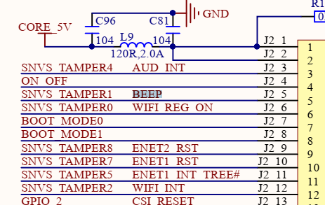
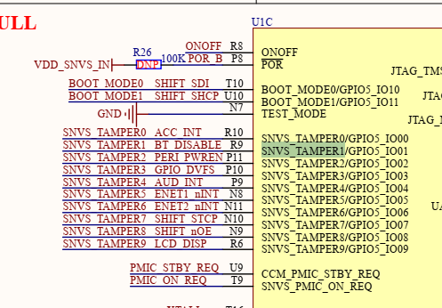

# 字符设备驱动说明

字符设备驱动是Linux内核中用于管理字符设备的驱动类型，是Linux内核中三大类设备(字符设备，块设备和网络设备)的一类。字符设备是以字节流形式进行数据传输的设备，字符设备支持基于字节的数据读取和写入，常见的字符型设备如下所示。

1. 串口设备，用于串口通信，如/dev/ttyS0, /dev/ttymxc0等
2. 键盘(keyboard)输入，对应/dev/input/eventX，用于捕获键盘输入
3. 鼠标(Mouse), 对应/dev/input/eventX, 用于捕获鼠标点击
4. 触摸屏(TouchScreen), 同样是/dev/input/eventX
5. i2c/spi总线型外挂设备，如/dev/ap3216, /dev/icm20608等

从上面可以看出，我们日常开发中大部分的设备都属于字符设备。网络设备和块设备虽然也多，但一般都使用系统自带的驱动，很少单独开发。目前主要的网络设备包含以太网，CAN，wifi，蓝牙等；块设备则通常则是SD卡，Nand FLASH，EMMC，固态和机械硬盘等，这些设备类型将在后续进行说明，本节主要讲解字符设备驱动。

关于字符设备驱动的开发，本节则从以下几个方面讲解说明。

- [字符设备接口](#device_interface)
- [硬件定义说明](#hardware_interface)
- [字符设备创建](#char_device_create)
- [sysfs虚拟文件系统说明](#sysfs_device)
- [杂项设备创建](#misc_device_create)
- [应用层访问设备](#app_device)
- [下一章节](#next_chapter)

## device_interface

关于字符设备涉及函数功能和接口如下所示。

| 字符设备操作 | 具体功能 | 功能接口 | 接口说明 |
| --- | --- | --- | --- |
| **驱动注册** | 分配cdev设备号 | register_chrdev_region | 根据范围注册申请一组设备号 |
| | | alloc_chrdev_region | 动态申请一组设备号值 |
| | **初始化cdev配置** | cdev_init | 初始化字符型设备结构体 |
| | **注册cdev设备** | cdev_add | 将申请设备号和字符型设备功能结构在内核中添加并绑定 |
| **设备操作函数** | 操作函数结构体"file_operations" | open | 打开设备 |
| | | read | 读取设备 |
| | | write | 写入设备 |
| | | ioctl | 设备控制 |
| | | close | 关闭设备 |
| **设备创建** | 创建类文件 | class_create | 用于创建在设备添加系统时需要提交的设备类信息，并在/sys/class下添加对应的类型 |
| | 创建设备文件 | device_create | 用于在系统中添加设备的接口，成功后会在/dev/目录下创建对应的设备 |
| **驱动注销** | 移除创建的设备文件 | device_destroy | 移除设备文件 |
| | 移除设备类 | class_destroy | 移除已经创建的设备类结构 |
| | 移除cdev设备 | cdev_del | 移除字符型设备 |
| | 释放设备号 | unregister_chrdev_region | 移除已经申请的设备号 |

详细的开发接口说明如下所示。

```c
/*
申请和移除设备号
*/
// 根据范围注册申请一组设备号(from为起始的主从设备号)，仅申请设备号，设备后续创建
int register_chrdev_region(dev_t from, unsigned count, const char *name);

// 动态申请一组设备号值
int alloc_chrdev_region(dev_t *dev, unsigned baseminor, unsigned count, const char *name)

// 移除已经申请的设备号
void unregister_chrdev_region(dev_t from, unsigned count)

/*
向系统添加和删除字符型设备
*/
// 初始化字符型设备结构体
void cdev_init(struct cdev *cdev, const struct file_operations *fops)

// 将申请设备号和字符型设备功能结构在内核中添加并绑定
int cdev_add(struct cdev *p, dev_t dev, unsigned count)

//删除字符型设备
void cdev_del(struct cdev *p)

/*
将字符设备和设备类文件，以及设备文件关联，用于应用层访问
*/
// 用于创建在设备添加系统时需要提交的设备类信息，并在/sys/class下添加对应的类型。
#define class_create(owner, name)

// 功能:删除已经创建的设备类结构
void class_destroy(struct class *cls)

// 用于在系统中添加设备的接口，成功后会在/dev/目录下创建对应的设备, 另外可通过cat /proc/devices查看创建的设备号
struct device *device_create(struct class *cls, struct device *parent, dev_t devt, void *drvdata, const char *fmt, ...);

//用于移除已经添加的设备
void device_destroy(struct class *class, dev_t devt)
```

关于上述函数的详细内容，可参考[内核基本接口](./ch03-x1.kernel_base_api.md)中关于device创建相关接口的说明。

## hardware_interface

接触过单片机开发的应该了解，控制一个I/O去点灯的流程包含如下。

1. 配置I/O引脚功能，输出模式，上下拉，默认电平等。
2. 封装接口(led_set), 控制引脚输出高或低电平
3. 应用中通过操作接口的方式，控制实际硬件输出

对于嵌入式Linux系统，其实现逻辑也类似。也可以直接配置寄存器实现功能和引脚控制，不过寄存器的配置有以下缺点:

1. 配置和芯片硬件绑定，开发和修改需要对芯片文档深入理解，难度高，易错
2. 对于不同芯片，因为寄存器可能定义不同，导致无法兼容，造成代码冗余

为了解决上述问题，Linux提供设备树的方式来描述硬件，实现驱动。这里以控制蜂鸣器输出的I/O得方式展示字符设备驱动的实现，按照如下步骤实现。

step-1: 确定硬件连接，蜂鸣器连接硬件为GPIO5_IO01.





step-2: 根据硬件，实现设备树节点，参考之前设备树语法说明，具体思路如下。

- BEEP对应的为GPIO模块，属于内部模块，不挂在具体的总线上，因此使用platform统一管理，需要放置在根目录
- 设备树节点需要有compatible和status属性，一个用于驱动匹配，另外status为okay的节点才能被使用
  - compatible，用于设备树匹配，compatible为"rmk,usr-beep"
  - status为okay的节点才能被使用
- 按键要有基本的I/O功能，而I/O功能又分为两部分，pinctrl指定引脚的复用，xxx-gpios指定GPIO线号用于内核访问
  - pinctrl-0、pinctrl-names，指定复用功能，如果只有一种复用，pinctl-names指定为default
  - xxx-gpios，指定GPIO线号用于内核访问具体的gpio获取状态

按照这个思路，一个完整的设备树节点就实现完毕，再调整下顺序，设备树节点就如下所示。

```c

/ {
    //...

    usr_beep {
        compatible = "rmk,usr-beep";                            //标签，用于驱动匹配的字符串
        pinctrl-0 = <&pinctrl_gpio_beep>;                       //选择引脚的复用定义，设备树解析时执行
        pinctrl-names = "default";
        beep-gpios = <&gpio5 1 GPIO_ACTIVE_LOW>;                //用于指明在驱动中访问的引脚
        status = "okay";
    };
};

/* 设备树节点定义 */
&iomuxc {
    ...
    pinctrl_gpio_beep: beep {
        fsl,pins = <
            MX6ULL_PAD_SNVS_TAMPER1__GPIO5_IO01     0x10B0  //定义引脚的复用和工作性能
        >;
    };
};
```

注意:**在应用中写入的0/1都是逻辑电平，真实输出电平则还与GPIO_ACTIVE_LOW有关，当为GPIO_ACTIVE_LOW时，I/O会翻转，即写1时输出低电平，0输出高电平。反之为GPIO_ACTIVE_HIGH时，写0时输出低电平，1输出高电平。另外此功能生效需要使用devm_gpiod_get，gpiod_set_value，gpiod_set_value接口，gpio_set_value等则相当于gpiod_set_raw_value，不会处理此标志。**
**

step-3：根据设备树，就可以再驱动中读取相应的gpio资源，封装成操作gpio的接口，具体如下所示。

```c
/*配置硬件接口*/
static int beep_hardware_init(struct beep_data *chip)
{
    struct platform_device *pdev = chip->pdev;
    struct device_node *beep_nd = pdev->dev.of_node;
    int ret = 0;

    /*step1: 从设备树结构中查找i/o资源*/
    chip->gpio = of_get_named_gpio(beep_nd, "beep-gpios", 0);
    if (chip->gpio < 0){
        dev_err(&pdev->dev, "beep-gpio, malloc error!\n");
        return -EINVAL;
    }
    dev_info(&pdev->dev, "find node:%s, io:%d", beep_nd->name, chip->gpio);

    /*step2: 从内核中请求I/O资源*/
    ret = devm_gpio_request(&pdev->dev, chip->gpio, "beep");
    if(ret < 0){
        dev_err(&pdev->dev, "beep request failed!\n");
        return -EINVAL;
    }

    /*step3: 设置引脚类型和初始状态 */
    gpio_direction_output(chip->gpio, 1);
    beep_hardware_set(chip, BEEP_OFF);

    return 0;
}

//beep_read接口，应用层read调用时执行，读取内部数据
ssize_t beep_read(struct file *filp, char __user *buf, size_t count, loff_t *f_pos)
{
    int result;
    u8 databuf[2];
    struct beep_data *chip = (struct beep_data *)filp->private_data;
    struct platform_device *pdev = chip->pdev;

    databuf[0] = chip->status;
    result = copy_to_user(buf, databuf, 1);
    if (result < 0)
    {
        dev_err(&pdev->dev, "read failed!\n");
        return -EFAULT;
    }
    return 1;
}

//beep_write接口，应用层write调用时执行，将应用层数据写入硬件中
ssize_t beep_write(struct file *filp, const char __user *buf, size_t count,  loff_t *f_pos)
{
    int result;
    u8 databuf[2];
    struct beep_data *chip = (struct beep_data *)filp->private_data;
    struct platform_device *pdev = chip->pdev;

    result = copy_from_user(databuf, buf, count);
    if (result < 0)
    {
        dev_err(&pdev->dev, "write failed!\n");
        return -EFAULT;
    }

    /*利用数据操作BEEP*/
    beep_hardware_set(chip, databuf[0]);
    return 0;
}

//....
```

可以看到，软件对于硬件的操作包含如下部分。

1. 初始化硬件接口和设备，对于挂载在platform总线的设备如gpio，pwm，adc等，只需要配置内部外设即可。对于外部设备，如i2c，spi，除了配置内部外设，还需要配置外部器件。
2. 将字符设备中fops接口与硬件操作关联，执行相应处理。

这里有两个重要的接口，copy_to_user和copy_from_user, 这两个函数用于内核和用户空间的数据拷贝。

```c
//用于将内核空间的数据复制到用户空间
unsigned long copy_to_user(void __user *to, const void *from, unsigned long n);

参数

- to: 指向用户空间目标地址的指针
- from: 指向内核空间源地址的指针
- n: 要复制的字节数

返回

如果成功复制所有字节，则返回0，发生错误，返回未复制的字节数

//用于将用户空间的数据复制到内核空间
unsigned long copy_from_user(void *to, const void __user *from, unsigned long n);

参数

- to: 指向内核空间目标地址的指针
- from: 指向用户空间源地址的指针
- n: 要复制的字节数

返回

如果成功复制所有字节，则返回0，发生错误，返回未复制的字节数
```

可以在应用层通过file文件接口open，read，write，ioctl，close完成对字符设备硬件的操作。

## char_device_create

Linux内核中使用struct cdev结构体描述一个设备，定义如下。

```cpp
//file_operations是对于硬件操作最重要的结构，不过在驱动开发中,
//主要实现open，read, write, unlocked_ioctl, close接口即可，其它接口非必要情况下不需要实现
struct file_operations {
    struct module *owner;                           // 定义字符设备的所有者
    loff_t (*llseek) (struct file *, loff_t, int);  // 设置文件指针位置的函数
    ssize_t (*read) (struct file *, char __user *, size_t, loff_t *);           // 从文件读取数据的函数
    ssize_t (*write) (struct file *, const char __user *, size_t, loff_t *);    // 向文件写入数据的函数
    ssize_t (*read_iter) (struct kiocb *, struct iov_iter *);                   // 读取数据的迭代函数
    ssize_t (*write_iter) (struct kiocb *, struct iov_iter *);                  // 写入数据的迭代函数
    int (*iterate) (struct file *, struct dir_context *);                       // 遍历目录的函数
    unsigned int (*poll) (struct file *, struct poll_table_struct *);           // 用于轮询文件状态的函数
    long (*unlocked_ioctl) (struct file *, unsigned int, unsigned long);        // 执行文件的 ioctl 操作的函数
    long (*compat_ioctl) (struct file *, unsigned int, unsigned long);          // 执行兼容的 ioctl 操作的函数
    int (*mmap) (struct file *, struct vm_area_struct *);                       // 用于内存映射文件的函数
    int (*open) (struct inode *, struct file *);                                // 打开文件时调用的函数
    int (*flush) (struct file *, fl_owner_t id);                                // 刷新文件数据的函数
    int (*release) (struct inode *, struct file *);                             // 关闭文件时调用的函数
    int (*fsync) (struct file *, loff_t, loff_t, int datasync);                 // 同步文件数据的函数
    int (*aio_fsync) (struct kiocb *, int datasync);                            // 异步同步文件数据的函数
    int (*fasync) (int, struct file *, int);                                    // 异步通知的函数
    int (*lock) (struct file *, int, struct file_lock *);                       // 锁定文件的函数
    ssize_t (*sendpage) (struct file *, struct page *, int, size_t, loff_t *, int); // 发送页面数据的函数
    unsigned long (*get_unmapped_area)(struct file *, unsigned long, unsigned long, unsigned long, unsigned long); // 获取未映射区域的函数
    int (*check_flags)(int); // 检查文件标志的函数
    int (*flock) (struct file *, int, struct file_lock *); // 文件锁操作的函数
    ssize_t (*splice_write)(struct pipe_inode_info *, struct file *, loff_t *, size_t, unsigned int); // 写入数据到管道的函数
    ssize_t (*splice_read)(struct file *, loff_t *, struct pipe_inode_info *, size_t, unsigned int); // 从管道读取数据的函数
    int (*setlease)(struct file *, long, struct file_lock **); // 设置文件租约的函数
    long (*fallocate)(struct file *file, int mode, loff_t offset, loff_t len); // 预分配文件空间的函数
    void (*show_fdinfo)(struct seq_file *m, struct file *f); // 显示文件描述符信息的函数
#ifndef CONFIG_MMU
    unsigned (*mmap_capabilities)(struct file *); // 获取内存映射能力的函数（仅在没有 MMU 的情况下使用）
#endif
};

//cdev
struct cdev {
    struct kobject kobj;                // 基础结构，提供结构共有特性，参考Documentation/kobject.txt
    struct module *owner;               // 定义字符设备的所有者
    const struct file_operations *ops;  // 字符设备的操作接口，用于实现应用层到底层的访问
    struct list_head list;              // 链表头，用于管理字符设备
    dev_t dev;                          // 字符设备设备号，用于区分不同的设备
    unsigned int count;                 // 设备的引用计数
} __randomize_layout;
```

这里面有两个关键点。

- dev:32位设备号，其中MAJOR为高12位表示主设备号，MINOR低20位，表示次设备号。
- ops:用于系统访问的接口, 用于操作系统上层接口和硬件关联，这里ops下有几个关键指针需要定义。
  - owner：对象的从属，一般都是THIS_MODULE(THIS_MODULE在驱动编译时生成并导入最终模块中，可查看中间文件.mod.c找到__this_module)
  - open: 在打开设备时执行的内核函数，对应应用层的open函数
  - read: 读取数据执行的内核函数，对应应用层的read
  - write: 写入数据执行的内核函数，对应应用层的write
  - unlocked_ioctl: 指令调用时执行的内核函数，对应应用层的ioctl
  - release: 设备关闭时执行的内核函数，对应应用层的close

```c
//ops支持访问的接口
static struct file_operations beep_fops = {
    .owner = THIS_MODULE,
    .open = beep_open,
    .read = beep_read,
    .write = beep_write,
    .unlocked_ioctl = beep_ioctl,
    .release = beep_release,
};

//open接口，一般用于获取硬件资源，后续使用
int beep_open(struct inode *inode, struct file *filp)
{
    struct beep_data *chip;

    //通过inode的cdev属性获取全局对象
    chip = container_of(inode->i_cdev, struct beep_data, cdev);
    filp->private_data = chip;
    return 0;
}

static int beep_device_create(struct beep_data *chip)
{
    //step1:申请注册设备号
    //当前系统中设备号可通过cat /proc/devices查看，主设备号不能够为0
    int result;
    int major = 0;
    int minor = 0;
    struct platform_device *pdev = chip->pdev;

    if (major)
    {
        //通过自定义的主设备号和次设备号从系统中申请设备号
        chip->dev_id= MKDEV(major, minor);
        result = register_chrdev_region(chip->dev_id, 1, "led");
    }
    else
    {
        //从系统中申请未使用的设备号
        result = alloc_chrdev_region(&chip->dev_id, 0, 1, "led");
        major = MAJOR(chip->dev_id);
        minor = MINOR(chip->dev_id);
    }

    //step2:初始化字符设备，并添加到内核中
    //完成后即可通过cat /proc/devices查看指定设备号的设备是否被创建
    cdev_init(&chip->cdev, &beep_fops);
    chip->cdev.owner = THIS_MODULE;
    result = cdev_add(&chip->cdev, chip->dev_id, 1);
    if (result != 0){
        dev_err(&pdev->dev, "cdev add failed\n");
        goto exit_cdev_add;
    }

    //step3:在系统中创建设备/dev/led(这一步可以在系统中通过mknod实现)
    chip->class = class_create(THIS_MODULE, "led");
    if (IS_ERR(chip->class)){
        dev_err(&pdev->dev, "class create failed!\r\n");
        result = PTR_ERR(chip->class);
        goto exit_class_create;
    }
    chip->device = device_create(chip->class, NULL, chip->dev_id, NULL, "led");
    if (IS_ERR(chip->device)){
        dev_err(&pdev->dev, "device create failed!\r\n");
        result = PTR_ERR(chip->device);
        goto exit_device_create;
    }
    return 0;

exit_device_create:
    class_destroy(chip->class);
exit_class_create:
    cdev_del(&chip->cdev);
exit_cdev_add:
    unregister_chrdev_region(chip->dev_id, 1);
exit:
    return result;
}

static int beep_remove(struct platform_device *pdev)
{
    struct beep_data *chip = platform_get_drvdata(pdev);

    //step1: 删除设备
    device_destroy(chip->class, chip->dev_id);
    class_destroy(chip->class);

    //step2：从内核中删除字符设备结构
    cdev_del(&chip->cdev);

    //step3: 注销申请的设备号
    unregister_chrdev_region(chip->dev_id, 1);

    dev_info(&pdev->dev, "beep release!\n");
    return 0;
}
```

其中对于创建设备的过程可以通过在Linux系统执行mknod命令创建，具体如下。

```shell
# 格式mknod  device   {b | c}   MAJOR   MINOR
# device 创建的设备名，包含目录
# {b | c} b表示块设备，c表示字符设备
# MAJOR 主设备号
# MINOR 子设备哈号
mknod /dev/led c 237 0

# 查看内核已注册的字符设备
cat /proc/devices

# 查看系统已经注册的中断
cat /pro/interrupts 

# 主设备号对于的设备类型
1 - 内存设备
4 - TTY设备(包含终端设备，串口设备)
5 - console设备
10 - 杂项设备
13 - 输入设备
```

可以看到，字符设备的创建步骤包含。

1. 申请设备号，自定义设备申请或者从内核申请设备号
2. 创建字符设备结构，关联设备号，添加到内核中(/proc/devices)
3. 在系统中创建设备文件，关联设备号，添加到系统中(ls /dev/)

这样在系统中使用文件访问时，就可以根据设备号，查找到对应的字符设备，将应用层的open/read/write/close和底层的字符设备接口ops关联起来，从而实现应用层对于底层的访问。上述是标准的字符设备的创建方式，不过如果不需要单独的主设备号，可以直接使用杂项设备创建，这样可以简化操作。

## sysfs_device

sysfs 是 Linux 内核中的一个虚拟文件系统，它提供了一种机制，用于将内核对象、驱动程序和设备的信息以文件和目录的形式呈现给用户空间。通过sysfs用户空间程序可以方便地与内核进行交互，获取设备信息、配置设备参数等。sysfs并不实际存储数据在磁盘上，而是在内存中维护数据结构，通过文件和目录的形式将这些数据暴露给用户空间，可以通过"ls /sys"目录查看，常用目录核功能说明如下。

1. /sys/bus：包含各种总线类型的目录，如 pci、usb、i2c 等。每个总线目录下包含该总线上连接的设备和驱动程序的信息。
2. /sys/class：按设备类型分类的设备类目录，如 block（块设备）、char（字符设备）、net（网络设备）等。每个设备类目录下包含该类型的所有设备。
3. /sys/dev：包含设备节点的符号链接，指向 /sys/class 或 /sys/bus 下的具体设备目录。
4. /sys/devices：包含系统中所有设备的目录树，按照设备的拓扑结构组织。
5. /sys/module：包含内核模块的信息，每个模块对应一个目录，目录下包含模块的属性和参数。
6. /sys/firmware：包含与固件相关的信息。

sysfs 将内核中的各种对象（如设备、驱动程序、总线等）映射为文件和目录，用户可以通过读写这些文件来获取或修改内核对象的属性。在内核中，依赖"struct kobject"结构来显示和管理设备，常见的接口如下。

```c
// 初始化 kobject
// @param kobj: 要初始化的 kobject 结构体指针
// @param ktype: 要初始化的 kobject 类型指针
void kobject_init(struct kobject *kobj, struct kobj_type *ktype);

// 将kobject添加到父类中
int kobject_add(struct kobject *kobj, struct kobject *parent, const char *fmt, ...);

// 初始化并添加到父类中
int kobject_init_and_add(struct kobject *kobj, struct kobj_type *ktype, struct kobject *parent, const char *fmt,...);

// 创建一个kobject对象
struct kobject *kobject_create(void)

// 创建并添加到父类中
struct kobject *kobject_create_and_add(const char *name, struct kobject *parent);

// 设置对象的名称
int kobject_set_name(struct kobject *kobj, const char *fmt,...);

// 删除kobject对象
void kobject_put(struct kobject *kobj);

// 创建文件属性
int sysfs_create_file(struct kobject *kobj, const struct attribute *attr);

// 移除kobject的属性
void sysfs_remove_file(struct kobject *kobj, const struct attribute *attr);

struct attribute {
    const char *name;   // 属性名称
    umode_t mode;       // 属性文件的访问权限
#ifdef CONFIG_DEBUG_LOCK_ALLOC
    bool ignore_lockdep:1;
    struct lock_class_key *key;
    struct lock_class_key skey;
#endif
};

struct kobj_attribute {
    struct attribute attr;

    // 用于读取属性值的函数指针
    ssize_t (*show)(struct kobject *kobj, struct kobj_attribute *attr,  
                char *buf);
            char *buf);
    
    // 用于存储属性值的函数指针
    ssize_t (*store)(struct kobject *kobj, struct kobj_attribute *attr,
                const char *buf, size_t count);
};
```

上述就是kobject的主要内容，如果parent指向NULL，则会在sys目录下创建文件。

```c
// 在/sys/目录下创建led_node文件
struct kobject *led_node = kobject_create_and_add("led_node", NULL);

// 配置文件的属性
struct kobj_attribute led_attr = {
    .attr.name = "led",
    .attr.mode = 0666,
    .show = led_show,
    .store = led_store,
}
//具有相同功能的宏定义
struct kobj_attribute led_attr = __ATTR(led, 0666, led_show, led_store);

// 未节点添加读写属性
sysfs_create_file(led_node, &led_attr.attr);

// 移除属性的处理，驱动卸载时添加
// 移除节点属性
sysfs_remove_file(led_node, &led_attr.attr);

// 删除属性值
kobject_put(led_node);
```

不过对于驱动中一般使用更上层的封装接口，device_create_file和device_remove_file接口，最终也会调用上述sysfs接口，在设备下创建sysfs目录和文件，具体如下所示。

```c
// 创建文件属性
// @param dev: 设备对象
// @param attr: 属性对象
// @return: 成功返回0，失败返回错误码
int device_create_file(struct device *dev, const struct device_attribute *attr);

// 移除属性文件
// @param dev: 设备对象
// @param attr: 属性对象
void device_remove_file(struct device *dev, const struct device_attribute *attr);

// device_attribute和kobject基本一致，可使用宏DEVICE_ATTR定义
#define DEVICE_ATTR(_name, _mode, _show, _store) \
    struct device_attribute dev_attr_##_name = __ATTR(_name, _mode, _show, _store)
```

## misc_device_create

杂项设备是属于字符设备，可以自动生成设备节点，主设备号相同，统一为10，次设备号不同；使用杂项设备可以简化字符设备的创建过程, 杂项设备的结构定义如下。

```c
struct miscdevice  {
    int minor;                          /* 子设备号 */
    const char *name;                   /* 设备名称 */
    const struct file_operations *fops; /* 文件操作结构体 */
    struct list_head list;              /* 链表头 */
    struct device *parent;              /* 父设备指针 */
    struct device *this_device;         /* 当前设备指针 */
    const struct attribute_group **groups; /* 属性组指针 */
    const char *nodename;               /* 节点名称 */
    umode_t mode;                       /* 设备模式 */
};
```

对于这个结构，关键的参数类型如下所示。

- minor: 定义子设备号，需要未被占用
- name： 设备名称，创建在/dev/目录下
- fops: 定义系统访问的接口, 用于操作系统上层接口和硬件关联。

关于杂项设备的创建，步骤和实现如下所示。

```c
struct beep_data
{
    /* gpio info */
    int gpio;
    int status;

    /*device info*/
    struct platform_device *pdev;
    struct miscdevice misc_dev;
    struct file_operations misc_fops;
};

//创建杂项设备接口
static int beep_device_create(struct beep_data *chip)
{
    int result;
    struct platform_device *pdev = chip->pdev;

    chip->misc_fops.owner = THIS_MODULE;
    chip->misc_fops.open = beep_open;
    chip->misc_fops.read = beep_read;
    chip->misc_fops.write = beep_write,
    chip->misc_fops.unlocked_ioctl = beep_ioctl,
    chip->misc_fops.release = beep_release,

    chip->misc_dev.minor = MISCBEEP_MINOR;
    chip->misc_dev.name = DEVICE_NAME;
    chip->misc_dev.fops = &(chip->misc_fops);

    result = misc_register(&(chip->misc_dev));
    if(result < 0){
        dev_info(&pdev->dev, "misc device register failed!\n");
        return -EFAULT;
    }

    dev_info(&pdev->dev, "misc device register ok, minor:%d!\n", chip->misc_dev.minor);
    return 0;
}
```

在杂项设备创建后，即可在系统中创建对应的设备节点/dev/miscbeep。

```shell
#获取系统的杂项设备
cat /proc/misc
```

本节代码可参考:[杂项设备驱动代码](./file/ch03-03/miscbeep/kernel_miscbeep.c).

可以看到，杂项设备的注册和创建由接口misc_register即可完成，相对来说更简单，且不占用主设备号，节省资源。如果开发的设备不需要独立的主设备号，可使用此接口创建杂项设备。另外，Linux也支持其它方式创建字符设备，如对于输入信号可以使用input子系统管理，这个在后面相应会单独说明，rtc设备通过rtc子系统添加等。至此，关于字符设备的简要说明完成。

无论是简单的I/O控制，如LED，BEEP，还是复杂的I2C, SPI设备，从原理上都由字符设备创建和硬件接口管理这两部分实现，按照这个思路，可以更清晰的理解字符型设备。

## app_device

字符设备方法和杂项设备使用的接口函数不同，但都是在应用层实现设备文件，然后通过文件接口进行访问。不过还有其它方式进行应用层的访问管理，这里列出其它方式。

1. 创建设备，主要在"/dev"目录下。大部分字符设备、杂项设备、input子系统、rtc设备创建接口都是使用该方式实现
2. 创建属性文件， 主要在"/sys/devices/platform/[节点]/"目录下, 通过修改属性文件内容操作底层硬件(device_create_file)
3. 以总线形式创建文件， 这类主要是iio设备，在目录"/sys/bus/iio/devices/iio:device[0/...]/[file]"下，通过文件可以访问硬件

这三类是大部分字符型设备的访问方式。不过字符型设备相关的知识不止于此，如SPI系统框架，I2C系统框架，input子系统等都属于字符设备的开发中涉及的技术，这些在后续章节后进一步说明。

前面都是讲解的如何实现将硬件加载到内核的驱动，但最终还是需要被软件访问的，驱动在加载成功后，会在系统中创建对应的文件，此时使用C标准文件接口即可进行对硬件的操作，这些接口如下。

```c
//打开设备文件，获得文件描述符
//open调用驱动中fops的open函数
int open(const char *pathname, int oflag,...);

//从文件中读取数据
//open调用驱动中fops的read函数
ssize_t read(int fd, void * buf, size_t count);

//向文件中写入数据
//open调用驱动中fops的write函数
ssize_t write (int fd, const void * buf, size_t count);

//向设备文件中写入请求命令
//ioctl调用驱动中fops的ioctl函数
int ioctl(int fd, ind cmd, …);

//关闭文件描述符
//open调用驱动中fops的close函数
int close(int fd);
```

以本例中的"/dev/miscbeep"为例，应用层访问代码如下。

```c
#include<fcntl.h>
#include<stdio.h>
#include<stdlib.h>
#include<unistd.h>

#define DEVICE_BEEP     "/dev/miscbeep"

int main(int argc, const char *argv[])
{
    unsigned char val = 1;
    int fd;

    //读取设备文件，获取句柄
    fd = open(DEVICE_BEEP, O_RDWR | O_NDELAY);
    if (fd == -1) {
        printf("open %s error\r\n", DEVICE_BEEP);
        return -1;
    }

    if (argc > 1) {
        val = atoi(argv[1]);
    }

    //写入数据
    write(fd, &val, 1);

    //关闭文件
    close(fd); 

    exit(0);  
}
```

本节代码可参考：[应用层访问杂项设备实现](./file/ch03-03/miscbeep/test/beep_test.c).

## summary

本节主要讲解了字符设备的基本概念和实现，包括字符设备接口，硬件接口和访问接口，同时也实现了应用层访问的接口。

在应用层中我们关心的是/dev/led这样的设备文件，通过应用层的open，read，write，ioctl，close进行操作；而对于驱动中，操作硬件的函数对应就是struct file_operations中的open，read，write，unlock_ioctl，close指定的函数。关于这两个接口如何关联，其中/dev/led由主设备号和次设备号通过mknod生成，而在内核中，cdev_add会将设备号和struct file_operations关联起来。这样在访问文件时，就会查找驱动，最终调用驱动中的文件操作接口，这既是字符驱动中申请主设备号和次设备号，注册设备，并实现文件操作接口的原因。理解了这些，字符设备驱动的实现就可以总结如下。

1. 实现驱动模块加载的接口
2. 实现字符设备注册到内核的接口，带主次设备号，以及驱动操作file_operations
3. 在file_operations中实现对具体硬件的操作，这一步可能需要访问设备树指定的资源，需要之前进行相应操作初始化

此即字符设备实现的常规步骤，无论简单的gpio、pwm内部模块、复杂的触摸屏、rtc、nvmem、2c/spi外部器件，其基础框架都是类似的；只是具体的操作接口和硬件资源不同。

具体模板代码可参考:[字符设备代码模板](./file/ch03-03/example/kernel_example.c)。

## next_chapter

[返回目录](../README.md)

直接开始下一节说明: [pinctrl子系统管理](./ch03-04.pinctrl_subsystem.md)
