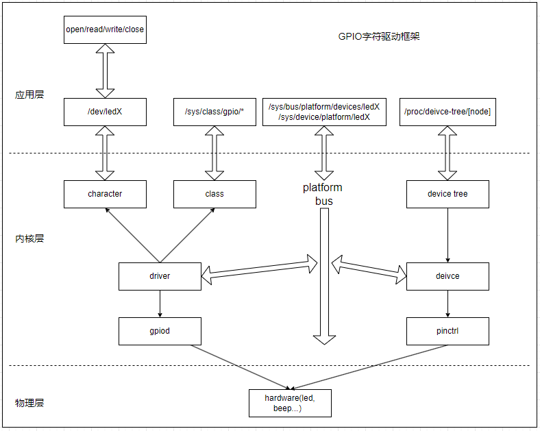
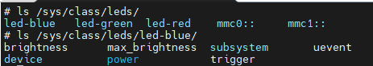

# pinctrl框架和gpio子系统

嵌入式Linux系统使用I/O与外界器件交互，简单的如GPIO、SPI、I2C，复杂的如CMOS、LCD-RGB、ETH、USB接口等，都是由I/O引脚来作为信号的输出或者输入接口。因为SOC功能的复杂性，以及I/O数目的限制，每个引脚都可以复用成不同的功能。对于软件来说，这就需要一套机制来管理引脚的复用功能，pinctrl框架正是用来实现管理功能的。另外当引脚作为普通I/O时，又需要在驱动中控制引脚的输出，因此需要gpio子系统来实现对引脚电平的控制。pinctrl和gpio子系统在Linux内核中相辅相成，共同完成对I/O引脚的管理工作。

1. pinctrl框架主要通过在设备树中配置引脚的复用，在内核启动时加载解析设备树，即可直接完成引脚的复用功能和驱动能力的配置。
2. gpio子系统则通过封装的接口，管理引脚资源，控制引脚状态，进行对寄存器操作的封装。

通过这两个框架的配合使用，可以说简化了驱动的开发；也避免了在代码中直接对寄存器的操作，更容易复用代码；同时降低了开发维护的难度，是目前主流的驱动开发方式。



本节目录如下。

- [pinctrl框架和访问接口](#pinctrl)
- [gpio子系统和访问接口](#gpio)
- [基于gpio接口的LED驱动开发和应用](#gpio_led_driver)
  - [基于设备树的LED驱动开发](#gpio_led_driver)
  - [使用内核的LEDS驱动实现](#kernel_led)
- [内核中gpio的访问调用](#gpio_sysfs)

## pinctrl

pinctrl主要控制引脚的复用，和驱动中相关的pinctrl的接口如下所示。

| 功能步骤 | 功能接口 | 接口说明 |
| --- | --- | --- |
| **获取pinctrl资源** | devm_pinctrl_get | 用于获取I/O引脚的pinctrl-x对应的所有资源列表 |
| | devm_pinctrl_get_select | 用于获取I/O引脚的pinctrl-x对应的资源列表，并同时选择name指定的资源 |
| **获取pinctrl-name对应状态** | pinctrl_lookup_state |  从pinctrl资源中根据名称获取pinctrl-name对应的资源信息 |
| **设置pinctrl状态** | pinctrl_select_state | 设置pinctrl配置信息 |
| **释放pinctrl资源** | devm_pinctrl_put | 释放获取I/O引脚的pinctrl资源 |

具体功能接口如下所示。

```c
// 获取I/O引脚的pinctrl资源列表
struct pinctrl *devm_pinctrl_get(struct device *dev)

// 用于获取I/O引脚的pinctrl-x对应的资源列表，并同时选择name指定的资源
// 相当于devm_pinctrl_get和pinctrl_select_state的组合
static inline struct pinctrl * __must_check devm_pinctrl_get_select(struct device *dev, const char *name)

// 从pinctrl资源中根据名称获取pinctrl配置信息
struct pinctrl_state *pinctrl_lookup_state(struct pinctrl *p, const char *name)

// 设置pinctrl配置信息
int pinctrl_select_state(struct pinctrl *p, struct pinctrl_state *state)
     
// 释放获取I/O引脚的pinctrl资源
void devm_pinctrl_put(struct pinctrl *p)           
```

pinctrl主要工作在内核解析设备树的过程，来控制引脚的复用功能，因此主要修改的部分在设备树中。另外不同厂商在设备树中的引脚pinctrl定义有区别，这里以I.MX6ULL为例进行说明。设备树中以pinctrl的定义以iomux和iomuxc_snvs节点显示，这里实现支持pinctrl切换功能的设备树和应用接口。

```c
iomuxc: pinctrl@20e0000 {
    compatible = "fsl,imx6ul-iomuxc";               //属性标签，驱动匹配加载
    reg = <0x020e0000 0x4000>;                      //定义iomuxc管理寄存器范围
};

&iomuxc {
    pinctrl_led_improve: led-improve {
        fsl,pins = <
            MX6UL_PAD_GPIO1_IO03__GPIO1_IO03        0x40017059  //定义引脚的复用类型和性能，详细见后续说明
        >;    
    };

    pinctrl_loopled: gpio-loopleds {
        fsl,pins = <
            MX6UL_PAD_CSI_DATA00__GPIO4_IO21        0x17059
            MX6UL_PAD_CSI_DATA02__GPIO4_IO23        0x17059
            MX6UL_PAD_CSI_DATA04__GPIO4_IO25        0x17059
        >;
    };
}

usr_led {
    //.....                     
    pinctrl-names = "default", "improve";          //用于pinctrl查找state的名称，默认是default
    pinctrl-0 = <&pinctrl_gpio_led>;               //第一组引脚复用功能指定的结构
    pinctrl-1 =<&pinctrl_led_improve>;             //第二组引脚复用功能指定的结构
};

/*
 * The pin function ID is a tuple of
 * <mux_reg conf_reg input_reg mux_mode input_val>
 */
#define MX6UL_PAD_GPIO1_IO03__GPIO1_IO03        0x0068 0x02f4 0x0000 5 0

mux_reg:mux寄存器偏移地址，寄存器用于定义引脚的复用模式，寄存器地址(0x02290000+0x000C)
conf_reg:配置寄存器偏移地址，寄存器用于配置引脚的性能，寄存器地址(0x02290000+0x0050)
input_reg:input寄存器偏移地址，为0表示不存在
mux_mode:配置mux寄存器的值，0x5表示为引脚模式(详细看手册)
input_val:input寄存器不存在，配置0即可

/*
MX6ULL_PAD_SNVS_TAMPER1__GPIO5_IO01     <config_val>
*/
config_val:定义config寄存器的值

bit0: 引脚速度，0表示slow_field，1表示fast_field
bit3~5: 引脚驱动能力
    - 000 DSE_0_output_driver_disabled
    - 001 DSE_1_R0_260_Ohm___3_3V__150_Ohm_1_8V__240_Ohm_for_DDR
    - 010 DSE_2_R0_2
    - 011 DSE_2_R0_3 
    - 100 DSE_2_R0_4
    - 101 DSE_2_R0_5
    - 110 DSE_2_R0_6
    - 111 DSE_2_R0_7
bit6-7：ready-only speed
bit-11: 开漏模式，0关闭开漏，1开漏模式
bit-12: Pull / Keep Enable Field，0表示关闭，1表示开启
bit-13: Pull / Keep Select Field，0表示Keeper，1表示Pull
bit14-15: Pull Up / Down Config. Field
    - 00 PUS_0_100K_Ohm_Pull_Down — 100K Ohm Pull Down
    - 01 PUS_1_47K_Ohm_Pull_Up — 47K Ohm Pull Up
    - 10 PUS_2_100K_Ohm_Pull_Up — 100K Ohm Pull Up
    - 11 PUS_3_22K_Ohm_Pull_Up — 22K Ohm Pull Up
bit16: Hyst. Enable Field，0:表示不开启I/O迟滞，1表示开启
bit17~bit31: Reserved

引脚的输入读取功能由SI_ON控制，
//driver/pinctrl/freescale/pinctrl-imx.c
//函数: imx_pinctrl_parse_pin_mmio
//#define IMX_PAD_SION 0x40000000
if (config & IMX_PAD_SION)
    pin_mmio->mux_mode |= IOMUXC_CONFIG_SION;
pin_mmio->config = config & ~IMX_PAD_SION;

//根据I/O config的说明即可定义寄存器值，这部分主要影响设备功耗，I/O状态。
```

关于pinctrl的注册流程详细可看"drivers/pinctrl/freescale/"目录中的实现。

这里还是从驱动应用的角度讲解说明。pinctrl的主要应用是在驱动中修改引脚的复用功能，详细接口说明如下。

```c
struct pinctrl_state {
    struct list_head node;
    const char *name;               //pinctrl的name解析，对应pinctrl-names中的单个字符串
    struct list_head settings;      //pinctrl的具体配置解析，对应pinctrl-0，...的配置
};

struct pinctrl {
  struct list_head node;            //pinctrl全局列表
  struct device *dev;               //使用pinctrl资源的设备节点指针
  struct list_head states;          //设备状态列表
  struct pinctrl_state *state;      //pinctrl的状态列表(解析设备树获得)
  struct list_head dt_maps;         //从设备树解析的设备表块
  struct kref users;                //pinctrl资源被引用的个数
};
```

以上面的设备树为例，支持pinctrl的例程如下所示。

```c
/* 获取pinctrl结构 */
chip->led_pinctrl = devm_pinctrl_get(&pdev->dev);

/* 获取state结构 */
chip->pinctrl_state[0] = pinctrl_lookup_state(chip->led_pinctrl, "default");
chip->pinctrl_state[1] = pinctrl_lookup_state(chip->led_pinctrl, "improve");

/* 选择default对应的pinctrl */
pinctrl_select_state(chip->led_pinctrl, chip->pinctrl_state[0]);

/* 选择improve对应的pinctrl */
pinctrl_select_state(chip->led_pinctrl, chip->pinctrl_state[1]);
```

## gpio

对于大部分驱动来说，pinctrl负责管理I/O的复用、如上下拉、驱动能力等，一般在初始化后基本不需要修改。而gpio则负责控制引脚的输入/输出、高低电平；驱动中可以直接使用此接口控制硬件。驱动从设备树中获取gpio资源的接口有两类，包括gpio和gpiod接口。从功能上来说，gpio和gpiod都能实现配置引脚输入输出状态，并控制输入和获取引脚状态的功能；不过gpio属于旧版本Linux的接口，**gpiod则是引入的新的API，支持设备树中通过GPIO_ACTIVE_XXX来控制逻辑电平和实际电平。gpio接口在新版本中虽然仍存在，不过底层使用gpiod_set_raw_value，gpiod_get_raw_value实现，不受该配置影响**。

关于gpio的主要接口说明如下。

- gpio interface
  - of_get_named_gpio               获取gpio在内核中的编号
  - devm_gpio_request               根据编号从内核申请gpio资源
  - devm_gpio_request_one           从内核申请gpio资源，同时配置gpio
  - gpio_direction_output           设置引脚为输出状态
  - gpio_direction_input            设置引脚为输入状态
  - gpio_set_value                  设置gpio引脚状态
  - gpio_get_value                  获取gpio状态
- gpiod interface
  - devm_gpiod_get                  获取gpio中第一个资源，不存在返回错误码
  - devm_gpiod_get_optional         获取gpio中第一个资源，不存在返回NULL
  - devm_gpiod_get_array            获取gpio资源数组，失败返回错误码
  - devm_gpiod_get_array_optional   获取gpio资源数组，失败返回NULL
  - devm_gpiod_get_index            获取gpio中指定标签的资源
  - devm_gpiod_put                  释放获取的gpio资源
  - gpiod_direction_input           设置引脚为输入状态
  - gpiod_direction_output          设置引脚为输出状态  
  - gpiod_set_value                 设置引脚状态
  - gpiod_set_value_cansleep        设置引脚状态，支持休眠
  - gpiod_get_value                 获取引脚状态
  - gpiod_set_raw_value             设置引脚状态，无视GPIO_Active配置
  - gpiod_get_raw_value             获取引脚状态，无视GPIO_Active配置

在实际开发中，建议使用gpiod相关接口进行i/o管理，这里列出相关接口，对于接口的详细说明见本章的附件章节。

```c
//设备树格式
usr_led {
    //......
    led-gpios = <&gpio1 3 GPIO_ACTIVE_LOW>; //gpio资源: 所属GPIO控制器 GPIO引脚编号 GPIO逻辑1时物理电平(gpiod接口有效)
    status = "okay";
};
/*
GPIO_ACTIVE_HIGH        = (0 << 0),     //常用，逻辑1对应高电平
GPIO_ACTIVE_LOW         = (1 << 0),     //常用，逻辑1对应低电平

GPIO_OPEN_DRAIN         = (1 << 1),     //开漏模式

GPIO_OPEN_SOURCE        = (1 << 2),     //开源模式

GPIO_PERSISTENT         = (0 << 3),     //保持状态，在挂起/恢复期间，GPIO线保持其值
GPIO_TRANSITORY         = (1 << 3),     //瞬态状态，在挂起/恢复期间，GPIO线可能失去其电气状态

GPIO_PULL_UP            = (1 << 4),     //引脚上拉
GPIO_PULL_DOWN          = (1 << 5),     //引脚下拉
GPIO_PULL_DISABLE       = (1 << 6),     //不使用上下拉
*/

//从内核中获取gpio资源，只获取第一个
struct gpio_desc *__must_check devm_gpiod_get(struct device *dev, const char *con_id, enum gpiod_flags flags)
/*
dev: 管理资源的设备，一般为总线匹配的设备
con_id: gpio属性id名称，"led"表示led-gpios属性，如果为NULL则表示gpios属性
flags: 设置GPIO的状态(请求并设置GPIO状态)
    GPIOD_ASIS                  默认状态
    GPIOD_IN                    输入状态
    GPIOD_OUT_LOW               输出状态，默认输出为0
    GPIOD_OUT_HIGH              输出状态，默认输出为1
    GPIOD_OUT_LOW_OPEN_DRAIN    输出状态，开漏模式，默认输出0
    GPIOD_OUT_HIGH_OPEN_DRAIN   输出状态，开漏模式，默认输出1
*/

//带编号的获取gpio资源描述符
struct gpio_desc *__must_check devm_gpiod_get_index(struct device *dev, const char *con_id, unsigned int idx, enum gpiod_flags flags)

//向内核获取gpiod资源描述符数组
struct gpio_descs *__must_check devm_gpiod_get_array(struct device *dev,
                        const char *con_id,
                        enum gpiod_flags flags)
```

在gpio模块中，以下结构需要重点理解。

- struct gpio_device   gpio设备信息，表示具体的gpio设备节点
- struct gpio_desc     用于管理GPIO的资源描述符

```c
//gpio device接口
struct gpio_device {
    int                 id;                 //此GPIO设备所属gpiochip的编号，用于标识该GPIO设备在gpiochip中的位置
    struct device       dev;                //指向该GPIO设备所属的通用设备结构体，关联了底层的硬件设
    struct cdev         chrdev;             //该GPIO设备对应的字符设备，用于在用户空间和内核空间之间进行数据交互
    struct device       *mockdev;           //指向该GPIO设备对应的模拟设备，可用于模拟GPIO功能，通常在测试或调试时使用。
    struct module       *owner;             //指向拥有该GPIO设备的内核模块，表明哪个模块负责管理和操作这个GPIO设备。
    struct gpio_chip    *chip;              //指向所属的gpiochip，如gpio1
    struct gpio_desc    *descs;             //所属gpiochip管理的所有gpio描述符数组首指针
    int                 base;               //gpiochip的起始编号，即该gpiochip下第一个GPIO引脚的编号，用于计算其他引脚的编号。    
    u16                 ngpio;              //GPIO描述符数组指针内I/O数量，即该gpiochip所管理的GPIO引脚的总数
    const char          *label;             //GPIO设备的描述名称，用于在日志或调试信息中标识该GPIO设备
    void                *data;              //GPIO设备的私有数据指针，可用于存储与该GPIO设备相关的自定义数据
    struct list_head    list;               //用于将该GPIO设备链接到GPIO设备链表中，方便内核统一管理和遍历所有GPIO设备。
    struct blocking_notifier_head notifier; //阻塞通知头，用于注册和通知对该GPIO设备状态变化感兴趣的模块。
    struct rw_semaphore    sem;             //读写信号量，用于保护对该GPIO设备的并发访问，确保数据的一致性

#ifdef CONFIG_PINCTRL
    //  由pinctrl管理的引脚范围（仅在配置了PINCTRL时存在）
    struct list_head pin_ranges;
#endif
};

//gpio_desc接口
struct gpio_desc {
    struct gpio_device      *gdev;  //指向所属的gpio设备
    unsigned long           flags;  //引脚状态
/* flag symbols are bit numbers */
#define FLAG_REQUESTED      0
#define FLAG_IS_OUT         1
#define FLAG_EXPORT         2    /* protected by sysfs_lock */
#define FLAG_SYSFS          3    /* exported via /sys/class/gpio/control */
#define FLAG_ACTIVE_LOW     6    /* value has active low */
#define FLAG_OPEN_DRAIN     7    /* Gpio is open drain type */
#define FLAG_OPEN_SOURCE    8    /* Gpio is open source type */
#define FLAG_USED_AS_IRQ    9    /* GPIO is connected to an IRQ */
#define FLAG_IRQ_IS_ENABLED 10    /* GPIO is connected to an enabled IRQ */
#define FLAG_IS_HOGGED      11    /* GPIO is hogged */
#define FLAG_TRANSITORY     12    /* GPIO may lose value in sleep or reset */
#define FLAG_PULL_UP        13    /* GPIO has pull up enabled */
#define FLAG_PULL_DOWN      14    /* GPIO has pull down enabled */
#define FLAG_BIAS_DISABLE   15    /* GPIO has pull disabled */
#define FLAG_EDGE_RISING    16    /* GPIO CDEV detects rising edge events */
#define FLAG_EDGE_FALLING   17      /* GPIO CDEV detects falling edge events */
#define FLAG_EVENT_CLOCK_REALTIME   18 /* GPIO CDEV reports REALTIME timestamps in events */
#define FLAG_EVENT_CLOCK_HTE        19 /* GPIO CDEV reports hardware timestamps in events */

    const char        *label;   //引脚的标签
    const char        *name;    //gpio名称
#ifdef CONFIG_OF_DYNAMIC
    // 所属的父设备节点
    struct device_node    *hog;
#endif
#ifdef CONFIG_GPIO_CDEV
    // 去抖动时间(单位us)
    unsigned int        debounce_period_us;
 #endif
};
```

控制引脚的输入输出状态。

```c
//设置gpio为输出引脚，并定义初始状态
int gpiod_direction_output(struct gpio_desc *desc, int value)

//设置gpio为输入引脚
int gpiod_direction_input(struct gpio_desc *desc);

//设置gpio状态
void gpiod_set_value(struct gpio_desc *desc, int value)

//获取gpio引脚状态
int gpiod_get_value(const struct gpio_desc *desc)
```

对于gpio的编号计算方法如下。

1. 确定所属的gpiochip，以I.MX6ULL为例，gpio1对应gpiochip0，依次类推
2. gpio编号的计算方式为(chip_num)*32 + pin_num，转换成所属gpio则为(gpionum - 1)*32 + pin_num.
3. 以led-gpios = <&gpio1 3 GPIO_ACTIVE_LOW>为例，则为(1-0)+3 = 3

对于gpio和gpiod，虽然从原理上一样，不过实际应用中接口有差异，这里展示两类不同的gpio使用例程。

```c
//gpio接口
//1.从设备树中获取gpio编号
//2.从内核中申请gpio编号对应的资源
//3.设置gpio的方向
//4.使用set/get命令操作gpio
chip->gpio = of_get_named_gpio(beep_nd, "beep-gpios", 0);  
devm_gpio_request(&pdev->dev, chip->gpio, "beep")
gpio_direction_output(chip->gpio, 1);
gpio_set_value(chip->gpio, 0);

//gpiod接口
//1.申请gpio资源并完成初始化
//2.使用set/get命令操作gpio
chip->led_desc = devm_gpiod_get(&pdev->dev, "led", GPIOD_OUT_LOW) //对应led-gpios属性
gpiod_set_value(chip->led_desc, 0);
```

## gpio_led_driver

在前面讲解了pinctrl框架和gpio子系统，也了解了gpio的知识，那么现在要开始以这些知识来定义基于设备树的LED驱动，可以知晓需要如下步骤。

1. 确定LED的硬件对应引脚，电平
2. 根据LED的引脚，确定pinctrl和gpio的设备树定义
3. 基于pinctrl和gpio接口，驱动实现控制LED硬件的接口
4. 配合设备树，添加内核加载驱动的接口
5. 创建字符设备，管理应用层访问到LED操作的接口

下面基于这个步骤进行说明。

### dts_driver

这里以正点原子的阿尔法开发板，使用引脚为GPIO1_3。设备树定义如下，其中pinctrl是固定格式，参考前面说明即可。对于gpio的设备树，其实定义也有对应思路，我可以说明下。

- gpio是内部模块，没有具体总线，因此需要支持platform管理，只能定义在根节点，或者simple-bus等特殊节点(设备树章节有说明)
- gpio作为设备节点，需要有两个最基本的属性，"compatible"和"status"，分别用于驱动匹配和设备状态管理
  - compatible，用于设备树匹配，compatible为rmk,usr-beep
  - status为okay的节点才能被使用
- gpio作为引脚功能，需要pinctrl定义引脚复用为I/O
  - pinctrl-0、pinctrl-names，指定复用功能，如果只有一种复用，pinctl-names指定为default
- gpio需要控制输入输出功能，需要指定[name]-gpios属性主要用于在驱动中使用devm_gpiod_get查询到指定gpio，控制输出电平，不过of_get_named_gpio这些老接口支持全名访问gpio资源，没有限制，不过这里还是建议所有gpio资源都使用"[name]-gpios=<...>"的格式
  - xxx-gpios，指定GPIO线号用于内核访问具体的gpio获取状态

参考这个思路，LED的设备树的定义如下。

```c
// 定义pinctrl的引脚复用
&iomuxc {
    //....
    pinctrl_gpio_led: gpio-leds {
        fsl,pins = <
            MX6UL_PAD_GPIO1_IO03__GPIO1_IO03        0x17059
        >;
    };
};

//创建LED节点，在platform总线管理下
gpiosgrp {
    compatible = "simple-bus";
    //..

    usr_led {
        compatible = "rmk,usr-led";
        pinctrl-names = "default";
        pinctrl-0 = <&pinctrl_gpio_led>;
        led-gpios = <&gpio1 3 GPIO_ACTIVE_LOW>;
        status = "okay";
    };

    //......
};
```

至于驱动的实现以及应用层的访问，和字符设备的说明基本一致。只是引入了复用功能切换，sysfs文件管理的相关内容。因此这里不重复说明。

详细的LED驱动和应用文件可参考: [LED驱动文件](./file/ch03-04/kernel_led.c)，[LED应用文件](./file/ch03-04/test/led_test.c)。

### kernel_led

对于LED来说，内核支持leds模块，可以直接控制输出管理。其实现在内核代码路径："drivers/leds/led-gpios.c"。

内核需要支持LED相关的配置。

```shell
CONFIG_NEW_LEDS=y
CONFIG_LEDS_CLASS=y
CONFIG_GPIOLIB=y
CONFIG_LEDS_GPIO=y
```

具体路径为："Device Driver > LED Support > LED Support for GPIO connected LEDs"。


对于设备树的实现，则如下所示。

```c
//访问路径: /sys/class/leds/led-red, /sys/class/leds/led-green, /sys/class/leds/led-blue
&iomuxc {
    //...
    pinctrl_loopled: gpio-loopleds {                        //引脚复用功能
        fsl,pins = <
            MX6UL_PAD_CSI_DATA00__GPIO4_IO21        0x17059
            MX6UL_PAD_CSI_DATA02__GPIO4_IO23        0x17059
            MX6UL_PAD_CSI_DATA04__GPIO4_IO25        0x17059
        >;
    };

};

leds-gpio {
    compatible = "leds-gpio";           //标签，匹配驱动名称
    pinctrl-names = "default";          //复用别名，默认配置
    pinctrl-0 = <&pinctrl_loopled>;     //指定引脚的复用功能
    status = "okay";                    //模块状态，功能开启

    led-red {                           //led-red节点
        label = "led-red";
        gpios = <&gpio4 21 GPIO_ACTIVE_HIGH>;
        default-state = "off";
    };

    led-green {                         //led-green节点
        label = "led-green";
        gpios = <&gpio4 23 GPIO_ACTIVE_HIGH>;
        default-state = "off";
    };

    led-blue {                          //led-blue节点
        label = "led-blue";
        gpios = <&gpio4 25 GPIO_ACTIVE_HIGH>;
        default-state = "off";
    };
};
```

代码里面查看如下所示。

```c
static struct gpio_leds_priv *gpio_leds_create(struct platform_device *pdev)
{
    struct device *dev = &pdev->dev;
    struct fwnode_handle *child;
    struct gpio_leds_priv *priv;
    int count, ret;

    count = device_get_child_node_count(dev);
    if (!count)
        return ERR_PTR(-ENODEV);

    priv = devm_kzalloc(dev, struct_size(priv, leds, count), GFP_KERNEL);
    if (!priv)
        return ERR_PTR(-ENOMEM);

    device_for_each_child_node(dev, child) {
        struct gpio_led_data *led_dat = &priv->leds[priv->num_leds];
        struct gpio_led led = {};

        // 获取字节点的gpio数据
        led.gpiod = devm_fwnode_get_gpiod_from_child(dev, NULL, child,
                                 GPIOD_ASIS,
                                 NULL);
        if (IS_ERR(led.gpiod)) {
            fwnode_handle_put(child);
            return ERR_CAST(led.gpiod);
        }

        led_dat->gpiod = led.gpiod;

        // 获取引脚的默认状态
        led.default_state = led_init_default_state_get(child);

        if (fwnode_property_present(child, "retain-state-suspended"))
            led.retain_state_suspended = 1;
        if (fwnode_property_present(child, "retain-state-shutdown"))
            led.retain_state_shutdown = 1;
        if (fwnode_property_present(child, "panic-indicator"))
            led.panic_indicator = 1;

        ret = create_gpio_led(&led, led_dat, dev, child, NULL);
        if (ret < 0) {
            fwnode_handle_put(child);
            return ERR_PTR(ret);
        }
        /* Set gpiod label to match the corresponding LED name. */
        gpiod_set_consumer_name(led_dat->gpiod,
                    led_dat->cdev.dev->kobj.name);
        priv->num_leds++;
    }

    return priv;
}

// 获取引脚中的default-state默认状态
enum led_default_state led_init_default_state_get(struct fwnode_handle *fwnode)
{
    const char *state = NULL;

    if (!fwnode_property_read_string(fwnode, "default-state", &state)) {
        if (!strcmp(state, "keep"))
            return LEDS_DEFSTATE_KEEP;
        if (!strcmp(state, "on"))
            return LEDS_DEFSTATE_ON;
    }

    return LEDS_DEFSTATE_OFF;
}
```

在应用层，可以通过/sys/class/gpio/led-xxx/*进行处理。

```shell
# 打开LED-RED
echo 1 > /sys/class/leds/led-red/brightness

# 打开LED-GREEN
echo 1 > /sys/class/leds/led-green/brightness

# 打开LED-BLUE
echo 1 > /sys/class/leds/led-blue/brightness
```

具体操作显示如下所示。



## gpio_sysfs

对于内核来说，提供了一套用于调试gpio的接口，通过/sys/class/gpio访问。

注意：**能够被导出的接口不能在设备树中访问，否则会现实busy而无法导出。**

- struct gpio_chip: gpio所属的控制器，带有gpio-controller的节点，可以在"/sys/class/gpio/"查看的节点

在/sys/class/gpio 中有3类入口:

- 用于在用户空间控制 GPIO 的控制接口
- GPIOs 本身
- GPIO 控制器("gpio_chip" 实例)

控制接口是只写的:

/sys/class/gpio/

1. "export": 用户空间可以通过写其编号到这个文件，要求内核导出一个GPIO的控制到用户空间。例如: 如果内核代码没有申请GPIO #19，"echo 19>export"，将会在目录创建一个"gpio19"节点。
2. "unexport": 导出到用户空间的逆操作。例如: "echo 19>unexport" 将会移除使用"export"文件导出的 "gpio19" 节点。

注意: gpio编号的计算方法是**gpio_N=(gpiochipN*32+gpio_pins)**的位置，当然对于不同的芯片，也有每个控制器只有16位的情况。例如对于I.MX6ULL, GPIO1对应的控制器编号为0，GPIO2为1，依次类推

GPIO信号的路径这里参考/sys/class/gpio/gpio42/，并有如下的读/写属性:

1. "direction": 读取得到in或out，有默认值，允许修改写入。写入out时,其引脚的默认输出为低电平。注意：如果内核不支持改变GPIO的方向，或者在导出时内核代码没有明确允许用户空间可以重新配置GPIO方向，那么这个属性将不存在。
2. "value": 读取得到0(低电平)或1(高电平)。如果GPIO配置为输出，这个值允许写操作。
3. "edge": 读取得到none、rising、falling或者both。将这些字符串写入这个文件可以选择沿触发模式，会使得轮询操作(select(2))在"value"文件中返回。这个文件仅有在这个引脚可以配置为可产生中断输入引脚时，才存在。
4. "active_low": 控制GPIO的极性，0为表示高电平有效，写入和读取输出实际电平，1表示低电平有效，写入和读取发生电平翻转。

这里以导出GPIO2_10(编号42)为例，导出命令如下。

```shell
# 导出引脚
echo 42 > /sys/class/gpio/export

# 设置引脚方向
echo in > /sys/class/gpio/gpio42/direction

# 设置引脚外部触发模式
echo rising >  /sys/class/gpio/gpio42/edge

# 取消引脚导出
echo 42 > /sys/class/gpio/unexport
```

GPIO控制器的路径类似/sys/class/gpio/gpiochip42/(对于从#42 GPIO开始实现控制的控制器)，并有着以下只读属性:

/sys/class/gpio/gpiochipN/

1. "base": 与以上的N相同,代表此芯片管理的第一个GPIO的编号
2. "label": 用于诊断（并不总是只有唯一值）
3. "ngpio": 此控制器所管理的GPIO数量（而GPIO编号从N到N + ngpio -1）

从内核中导出gpio引脚的接口。

```c
/* 导出 GPIO 到用户空间 */
int gpio_export(unsigned gpio, bool direction_may_change);

/* gpio_export()的逆操作 */
void gpio_unexport(unsigned gpio);

/* 创建一个 sysfs 连接到已导出的 GPIO 节点 */
int gpio_export_link(struct device *dev, const char *name,
    unsigned gpio)
```

在内核申请一个gpio驱动后，可以通过 gpio_export()使其在sysfs接口(sys class gpio)中可见，该驱动可以控制信号方向是否可修改。这有助于防止用户空间代码无意间破坏重要的系统状态。

## next_chapter

[返回目录](../README.md)

直接开始下一章节说明: [input输入子系统](./ch03-05.input_subsystem.md)
