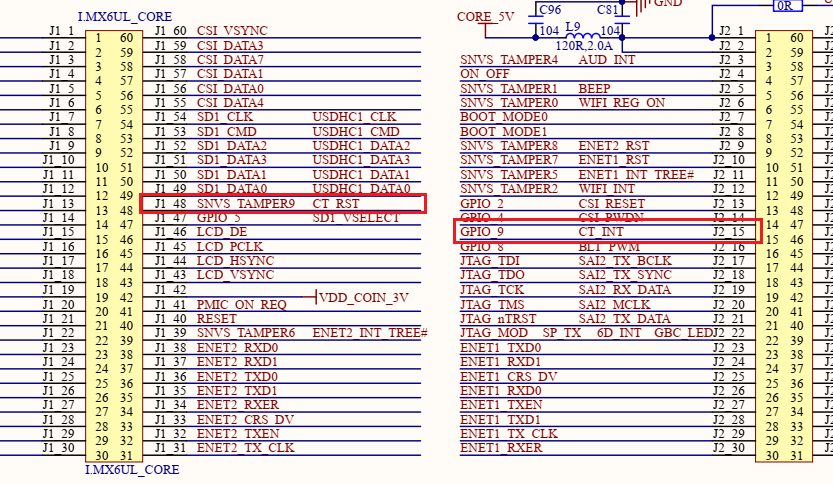

# input子系统和触摸屏应用

对于input子系统来说，输入按键只是基础，其中比较复杂的就是对于触摸屏的输入检测和应用。对于简单设备，只需要向input核心提交按键事件即可，而对于触摸屏来说，其实现在此基础上就包含以下额外流程。

1. 触摸屏配置和数据读取
2. 坐标解析和位置信息传输
3. 多点触摸协议实现

本节则基于上述流程，实现基于input子系统的触摸屏应用，具体目录如下所示。

- 设备树定义和解析
- 设备配置和初始化
- 设备在内核中的注册
- 事件提交和应用处理

## 设备树定义和解析

比起上一节的按键应用，触摸屏的设备树的定义就相对复杂。不再是简单的gpio，而是挂载在I2C下的器件gt9147。

其硬件连接结构如下所示。



参考外部器件和原理图，得到信息如下所示。

- 器件I2C地址: 0x14
- 复位引脚CT_RST: GPIO5_9
- 中断触发CT_INT: GPIO1_9

### 设备树的实现

对于I2C设备，就需要结合关于设备树实现的稳定，具体实现思路如下。

1. 根据硬件，判断器件挂载在I2C2设备下，格式为name: name@[reg] { reg = <[reg]> }; 这个是I2C设备的标准格式
2. 需要有compatible和status属性，其中compatible用于驱动匹配，status表示设备状态，定义为okay的节点才能被使用
3. 另外对于触摸屏来说，除了I2C通讯脚(属于I2C2的pinctrl)，还有复位引脚配合初始化，中断引脚配合数据读取，就需要实现对应的pinctrl和gpios
4. 触摸屏中断引脚会引起中断触发数据读取，就需要指定对应的中断控制器interrupt-parent，还有触发的中断线号和中断类型

按照这个逻辑，完整的设备树实现如下。另外reset-gpios，interrupt-gpios是在驱动中访问的数据，属于自定义属性，符合xx-gpios的格式即可。

```c
&i2c2 {
    //...

    gt9147: gt9147@14 {
        compatible = "rmk,gt9147";                      // 标签，用于设备树匹配
        reg = <0x14>;                                   // i2c地址寄存器，用于i2c访问设备
        pinctrl-names = "default";                      // 引脚复用名称
        pinctrl-0 = <&pinctrl_tsc                       // 定义引脚的复用功能，tsc为中断，tsc_reset为复位引脚
                    &pinctrl_tsc_reset>;
        interrupt-parent = <&gpio1>;                    // 定义引脚所属的中断控制器，内核查找对应中断线号
        interrupts = <9 IRQ_TYPE_EDGE_FALLING>;         // 定义属于中断内的引脚号和中断类型
        reset-gpios = <&gpio5 9 GPIO_ACTIVE_LOW>;       // 复位引脚,用于获取io号和配置
        interrupt-gpios = <&gpio1 9 GPIO_ACTIVE_LOW>;   // 中断引脚,用于获取io号和配置
        status = "okay";                                // 设备状态
    };
};

&iomuxc_snvs {
    //...
    pinctrl_tsc: tscgrp {
        fsl,pins = <
            MX6UL_PAD_GPIO1_IO09__GPIO1_IO09    0x40017059
        >;
    };

    pinctrl_tsc_reset: tsc_reset {
        fsl,pins = <
            MX6ULL_PAD_SNVS_TAMPER9__GPIO5_IO09     0x49       
        >;
    };
};
```

可以看到，对于完整的gt9147设备节点，就由驱动匹配和加载、I2C管理、复位和中断引脚、中断等信息组成。看起来复杂，但从需求角度出发，理解起来并不困难。

### 设备树的解析

对于设备树的解析和处理，主要包含I/O的配置、模块复位、中断配置、I2C硬件配置以及模块的初始化，这部分需要配合I2C框架相关文档去实现。

关于设备树的解析，可以从设备树的定义项基础上进行处理，具体如下所示。

1. 获取设备树中的gpio资源，设置引脚状态，复位器件
2. 使能中断相关的处理，完成对于硬件的配置

参考上述说明，关于设备树解析和硬件配置的流程如下所示。

```c
// 注册goodix驱动
static int goodix_probe(struct i2c_client *client, const struct i2c_device_id *id)
{
    int ret;
    struct goodix_chip_data *chip;

    // 1. 申请goodix管理内存单元
    chip = devm_kzalloc(&client->dev, sizeof(*chip), GFP_KERNEL);
    if (!chip) {
        dev_err(&client->dev, "allocate memory failed, error:%d.\n", ret);
        return -ENOMEM;
    }
    chip->client = client;
    i2c_set_clientdata(client, chip);

    // 2.初始化硬件gpio，硬件复位
    ret = goodix_gpio_init(chip);
    if (ret) {
        dev_err(&client->dev, "reset device failed, error:%d.\n", ret);
        return ret;
    }

    // 3.初始化传感器配置
    ret = goodix_firmware_init(chip);
    if (ret){
        dev_err(&client->dev, "firmware init failed, error:%d.\n", ret);
        return ret;
    }

    // 4.设置中断并使能
    ret = devm_request_threaded_irq(&client->dev, 
                                client->irq,
                                NULL, 
                                goodix_irq_handler,
                                chip->irqflags | IRQF_ONESHOT,
                                "goodix-int",
                                chip);
    if (ret) {
        dev_err(&client->dev, "Unable to request touchscreen IRQ.\n");
        return ret;
    }

    // 5.向内核注册input设备
    ret = goodix_inputdev_create(chip);
    if (ret){
        dev_err(&client->dev, "input dev create failed, error:%d.\n", ret);
        return ret;
    }

    dev_info(&client->dev, "goodix driver init success.\n");
    return 0;
}

// gpio相关硬件初始化
static int goodix_gpio_init(struct goodix_chip_data *chip)
{
    int ret = 0;
    struct i2c_client *client = chip->client;

    // 获取gpio相关标签
    chip->reset_pin = of_get_named_gpio(client->dev.of_node, "reset-gpios", 0);
    chip->irq_pin = of_get_named_gpio(client->dev.of_node, "interrupt-gpios", 0);

    dev_info(&client->dev, "of_node:0x%x", (u32)client->dev.of_node);

    // 申请复位引脚相关gpio资源
    if (gpio_is_valid(chip->reset_pin)) {
        ret = devm_gpio_request_one(&client->dev, 
                                    chip->reset_pin,
                                    GPIOF_OUT_INIT_HIGH,
                                    "goodix reset");
        if (ret) {
            dev_err(&client->dev, "failed to reqeust reset pin.\n");
            return ret;
        }
    } else {
        dev_err(&client->dev, "reset pin is invalid, pin:%d, %d.\n", chip->reset_pin, chip->irq_pin);
        return -1;
    }

    // 申请中断引脚相关gpio资源
    if (gpio_is_valid(chip->irq_pin)) {
        ret = devm_gpio_request_one(&client->dev, 
                                    chip->irq_pin, 
                                    GPIOF_OUT_INIT_HIGH,
                                    "goodix int");
        if (ret) {
            dev_err(&client->dev, "failed to reqeust int pin.\n");
            return ret;
        }
    } else {
        dev_err(&client->dev, "interrupt pin is invalid, pin:%d.\n", chip->irq_pin);
        return -1;
    }

    /* reset sequerance */
    gpio_set_value(chip->reset_pin, 0);
    msleep(10);
    gpio_set_value(chip->reset_pin, 1);
    msleep(10);
    gpio_set_value(chip->irq_pin, 0);
    msleep(50);

    gpio_direction_input(chip->irq_pin);
    dev_info(&client->dev, "goodix_gpio_init success, irq:%d!\n", client->irq);
    return ret;
}
```

对于设备树的解析处理就如上所示，可以看到就包含以下核心步骤。

1. 获取设备树中提供的硬件资源
2. 根据硬件资源执行相应的数据处理，为设备的配置、初始化以及内核访问硬件提供基础接口

理解了这个概念，对于设备树和设备树的解析就可以有着更深入的认知，后续开发也就更加清晰。

## 设备配置和初始化

对于设备的配置和初始化，其实是完全独立于嵌入式Linux驱动的功能模块，这个就是器件本身的特性。按照常规传感器的思路，就是向器件内部寄存器中写入需要的配置信息，从而让其能够正确工作。这部分就依赖开发经验和对器件的理解，具体实现如下所示。

```c
// 用于配置gt9147的寄存器表
const u8 GOODIX_CFG_TBL[]=
{ 
    0X60,0XE0,0X01,0X20,0X03,0X05,0X35,0X00,0X00,0X08,
    0X1E,0X08,0X50,0X3C,0X0F,0X05,0X00,0X00,0XFF,0X67,
    0X50,0X00,0X00,0X18,0X1A,0X1E,0X14,0X89,0X28,0X0A,
    0X30,0X2E,0XBB,0X0A,0X03,0X00,0X00,0X02,0X33,0X1D,
    0X00,0X00,0X00,0X00,0X00,0X00,0X00,0X32,0X00,0X00,
    0X2A,0X1C,0X5A,0X94,0XC5,0X02,0X07,0X00,0X00,0X00,
    0XB5,0X1F,0X00,0X90,0X28,0X00,0X77,0X32,0X00,0X62,
    0X3F,0X00,0X52,0X50,0X00,0X52,0X00,0X00,0X00,0X00,
    0X00,0X00,0X00,0X00,0X00,0X00,0X00,0X00,0X00,0X00,
    0X00,0X00,0X00,0X00,0X00,0X00,0X00,0X00,0X00,0X0F,
    0X0F,0X03,0X06,0X10,0X42,0XF8,0X0F,0X14,0X00,0X00,
    0X00,0X00,0X1A,0X18,0X16,0X14,0X12,0X10,0X0E,0X0C,
    0X0A,0X08,0X00,0X00,0X00,0X00,0X00,0X00,0X00,0X00,
    0X00,0X00,0X00,0X00,0X00,0X00,0X00,0X00,0X00,0X00,
    0X00,0X00,0X29,0X28,0X24,0X22,0X20,0X1F,0X1E,0X1D,
    0X0E,0X0C,0X0A,0X08,0X06,0X05,0X04,0X02,0X00,0XFF,
    0X00,0X00,0X00,0X00,0X00,0X00,0X00,0X00,0X00,0X00,
    0X00,0XFF,0XFF,0XFF,0XFF,0XFF,0XFF,0XFF,0XFF,0XFF,
    0XFF,0XFF,0XFF,0XFF,
}; 

// 更新寄存器表
void goodix_update_cfg(struct goodix_chip_data *chip, unsigned char mode)
{
    unsigned char buf[2];
    unsigned int i = 0;

    buf[0] = 0;
    buf[1] = mode;    /* 是否写入到GT9147 FLASH 0表示不写入 */
    for (i = 0; i < (sizeof(GOODIX_CFG_TBL)); i++) {
        buf[0] += GOODIX_CFG_TBL[i];
    }
    buf[0] = (~buf[0]) + 1;

    /* 发送寄存器配置, 写入校验和,配置更新标记 */
    goodix_i2c_write(chip->client, GT_9xx_CFGS_REG, (u8 *)GOODIX_CFG_TBL, sizeof(GOODIX_CFG_TBL));
    goodix_i2c_write(chip->client, GT_CHECK_REG, buf, 2);
}

// 配置gt9147功能
static int goodix_firmware_init(struct goodix_chip_data *chip)
{
    u8 data[7];
    u16 id = 0;
    int ret = 0;
    int version = 0;
    char id_str[5];
    struct i2c_client *client = chip->client;

    // 软复位模块
    goodix_i2c_write_reg(client, GT_CTRL_REG, 0x02);
    msleep(100);
    goodix_i2c_write_reg(client, GT_CTRL_REG, 0x00);
    msleep(100);

    // 更新寄存器配置
    goodix_update_cfg(chip, 0);

    // 读取配置信息，获取触摸区域和中断状态
    ret = goodix_i2c_read(client, GT_PID_REG, data, 6);
    if (ret) {
        dev_err(&client->dev, "Unable to read PID. error:%d.\n", ret);
        return ret;
    }
    memcpy(id_str, data, 4);
    id_str[4] = 0;
    if (kstrtou16(id_str, 10, &id)) {
        id = 0x1001;
    }
    version = get_unaligned_le16(&data[4]);
    dev_info(&client->dev, "ID %d, version: %04x\n", id, version);
    ret = goodix_i2c_read(client, GT_9xx_CFGS_REG, data, 7);
    if (ret) {
        dev_err(&client->dev, "Unable to read Firmware, error:%d.\n", ret);
        return ret;
    }
    chip->max_x = (data[2] << 8) + data[1];
    chip->max_y = (data[4] << 8) + data[3];
    chip->irqflags = irq_table[data[6] & 0x3];

    dev_info(&client->dev, "X_MAX: %d, Y_MAX: %d, TRIGGER: 0x%02x", chip->max_x, chip->max_y, chip->irqflags);
    return ret;
}
```

这部分主要是对于器件的配置，对于配置项较少的设备一般从文档得出即可；配置项较多的，如CMOS、触摸芯片、LCD屏幕等，一般由厂商提供一套参数，开发者在基础上修改适配完成功能即可。

## 设备在内核中的注册

上面讲解了如何定义设备树，解析并配置外部器件，通过这一步骤，就完成了驱动和外部物理器件的关联。那么下一步就是如何关联上层应用和驱动，这就需要input子系统的配合实现。

对于input子系统来说，其核心就是定义其支持的能力，并注册到内核中。对于不同类型的input设备，就需要不同的设备能力。以触摸屏输入为例，需要提交地址信息、触摸点数目能力，具体示例如下所示。

```c
static int goodix_inputdev_create(struct goodix_chip_data *chip)
{
    int ret = 0;

    chip->input_dev = devm_input_allocate_device(&chip->client->dev);
    if (!chip->input_dev) {
        return -ENOMEM;
    }

    // 配置input设备基础信息
    chip->input_dev->name = chip->client->name;
    chip->input_dev->id.bustype = BUS_I2C;
    chip->input_dev->id.vendor = 0x0416;
    chip->input_dev->dev.parent = &chip->client->dev;

    // 配置支持多点触摸的能力
    input_set_capability(chip->input_dev, EV_KEY, BTN_TOUCH);
    __set_bit(INPUT_PROP_DIRECT, chip->input_dev->propbit);

    input_set_abs_params(chip->input_dev, ABS_X, 0, chip->max_x, 0, 0);
    input_set_abs_params(chip->input_dev, ABS_Y, 0, chip->max_y, 0, 0); 
    input_set_abs_params(chip->input_dev, ABS_MT_POSITION_X, 0, chip->max_x, 0, 0);
    input_set_abs_params(chip->input_dev, ABS_MT_POSITION_Y, 0, chip->max_y, 0, 0); 
    input_set_abs_params(chip->input_dev, ABS_MT_TOUCH_MAJOR, 0, 1023, 0, 0);
    
    // 更新touchscreen属性
    touchscreen_parse_properties(chip->input_dev, true, &chip->prop);

    // 定义支持多点触控的数目
    ret = input_mt_init_slots(chip->input_dev, GOODIX_MAX_CONTACTS, INPUT_MT_DIRECT);
    if (ret) {
        dev_err(&chip->client->dev, "failed to input_mt_init_slots, err:%d.\n", ret);
        return ret;
    }
    
    // 在系统中注册input事件
    ret = input_register_device(chip->input_dev);
    if (ret) {
        dev_err(&chip->client->dev, "failed to input_register_device, err:%d.\n", ret);
        return ret;
    }

    return ret;
}
```

## 事件提交和应用处理

对于input的事件提交和应用处理，主要在触摸中断中实现，其主要步骤如下所示。

1. 获取当前触摸信息，包含触摸点个数、当前触摸点位置
2. 将触摸点上报，并释放移除的触发点
3. 同步所有事件，通知应用层处理

基于上述流程，事件提交的功能如下所示。

```c
static irqreturn_t goodix_irq_handler(int irq, void *pdata)
{
    int i;
    int ret;
    int touch_num;
    u8 status;
    u8 point_data[GOODIX_MAX_CONTACTS*8];
    bool seen[GOODIX_MAX_CONTACTS]= {false};

    struct goodix_chip_data *chip = pdata;
    struct i2c_client *client = chip->client;

    // 1. 读取触摸屏状态
    ret = goodix_i2c_read(chip->client, GT_GSTID_REG, &status, 1);
    if (ret) {
        dev_err(&client->dev, "read failed:%d!\n", ret);
        return IRQ_NONE; 
    }

    if (!(status & 0x80)) {
        dev_err(&client->dev, "read status:%d!\n", status); 
        return IRQ_NONE;
    }

    touch_num = status & 0x0f;
    if (touch_num > GOODIX_MAX_CONTACTS) {
        touch_num = GOODIX_MAX_CONTACTS;
    }

    // 2. 读取所有节点数据
    if (touch_num) {
        ret = goodix_i2c_read(chip->client, GT_TP1_REG, point_data, touch_num * 8); // 读取所有的节点数据
        if (ret) {
            dev_err(&client->dev, "goodix_i2c_read failed:%d!\n", ret);  
            goto out;
        }
    }

    // 3. 上报当前存在的触点
    for (i = 0; i < touch_num; i++) {
        u8 *coor = &point_data[i*8];
        
        int id;
        int x;
        int y;
        int w;

        id = coor[0]&0x0f;
        if (id >= GOODIX_MAX_CONTACTS)
            continue;

        x = ((u16)coor[2]<<8) | coor[1];
        y = ((u16)coor[4]<<8) | coor[3];
        w = ((u16)coor[6]<<8) | coor[5];

        seen[id] = true;

        input_mt_slot(chip->input_dev, id);
        input_mt_report_slot_state(chip->input_dev, MT_TOOL_FINGER, true);
        touchscreen_report_pos(chip->input_dev, &chip->prop, x, y, true);
        //input_report_abs(chip->input_dev, ABS_MT_TOUCH_MAJOR, w);

        dev_info(&client->dev, "press down:%d, %d, %d, %d\n", id, x, y, w);
    }

    // 4. 释放消失的触点
    for (i = 0; i < GOODIX_MAX_CONTACTS; i++) {
        if (chip->slot_state[i] && !seen[i]) {
            input_mt_slot(chip->input_dev, i);
            input_mt_report_slot_state(chip->input_dev, MT_TOOL_FINGER, false);
            dev_info(&client->dev, "press up:%d!\n", i);
        }

        chip->slot_state[i] = seen[i];
    }

    // 5. 将多点触摸事件转换（模拟）成传统单点鼠标/触摸事件(用于支持旧设备)
    input_mt_report_pointer_emulation(chip->input_dev, true);
    input_sync(chip->input_dev);

out:
    goodix_i2c_write_reg(chip->client, GT_GSTID_REG, 0x00);

    return IRQ_HANDLED;
}
```

对于本例中，由开发者自行管理触摸的按下和释放，当然也可以通过设置能力`INPUT_MT_DROP_UNUSED`来让内核自动释放移除的触摸点，可以自行进行测试。

关于触摸屏驱动的详细代码如下所示。

- key-ts驱动代码：`file/ch03-05/touchscreen/kernel_gt9147.c`

## 触摸屏事件在系统中的应用

## 总结说明

## 返回目录

[返回目录](../README.md)
