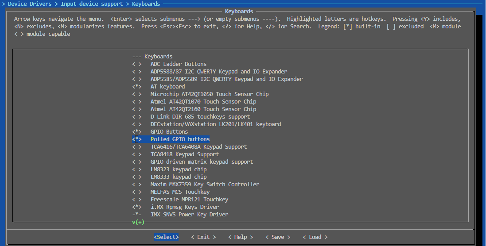
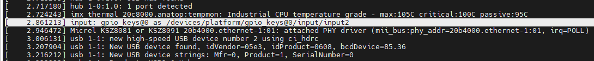

# input子系统

在Linux系统中，输入设备数量繁多，从单个引脚的输入按键，按键矩阵，到复杂的触摸屏，鼠标，键盘。这些设备接口总类繁多(如gpio，i2c，usb)，器件特征也有很大差异。例如引脚输入为I/O电平信号，按键矩阵则是一组电平信号，触摸屏和鼠标输入的则是位置信号，键盘输入的又是对应键位的扫描码，可以说各有不同。

内核为了统一管理这些设备，实现input子系统，这样在应用层就可以通过访问/dev/input/eventX设备，按照特定的格式解析，即可获取触发的硬件信息。input子系统提供了一套驱动层告知应用层触发事件的机制，常见的input子系统设备按照输入数据类型的不同可分成如下两类。

1. 按键输入设备，如单个引脚的按键，输入键盘，按键矩阵等，这类硬件提交的为按键事件，附带的数据为按键信息
2. 位置输入设备，这类设备包含鼠标，触摸板，手柄遥感等，这类设备会上传相对/绝对坐标信息

input的子系统框架图如下所示。


1. 硬件输入设备: 作为事件的发起端，带有不同功能的输入设备，如作为GPIO输入的按键，USB输入的鼠标，键盘，i2c输入的TouchScreen，作为输入的发起端，是带有具体接口的硬件
2. 内核空间: 用于将设备加载到系统中，实现具体功能的驱动，一方面完成外部设备的配置或枚举，另一部分是以input设备注册到内核中，用于应用层访问
3. 用户空间：硬件设备在系统中以/dev/input/eventX的形式存在，被应用所访问，可以作为按键信息，位置信息等提交，应用层根据类型进行相应的处理。

本节目录如下。

- [inupt结构体信息说明](#input_format)
- [input访问接口说明](#input_interface)
- [input驱动实现方法](#input_key_driver)
  - [input按键设备树定义](#input_key_tree)
  - [input按键硬件访问驱动](#input_key_hw)
  - [input按键设备创建](#input_key_devcreate)
  - [input按键事件提交](#input_key_eventreport)
  - [input使用内核gpio-keys](#input_key_kernel)
  - [input按键应用访问](#input_key_app)
- [input触摸屏驱动实现方法](#input_ts_driver)
  - [input触摸屏设备树定义](#input_ts_tree)
  - [input触摸屏硬件访问驱动](#input_ts_hwdriver)
  - [input触摸屏设备创建](#input_ts_devicecreate)
  - [input触摸屏事件提交](#input_ts_eventreport)

## input_format

对于input设备的特性，其中最重要的就是input_dev的设备结构，这是整个input子系统处理的基础。

```c
struct input_id {
    __u16 bustype;  //总线类型
    __u16 vendor;   //供应商类型
    __u16 product;  //产品类型
    __u16 version;  //版本信息
};

//input_dev设备结构
struct input_dev {
    const char *name;                                       //设备名称
    const char *phys;                                       //设备文件路径
    const char *uniq;                                       //设备的唯一识别码
    struct input_id id;                                     //设备id，包含私有厂商信息

    unsigned long propbit[BITS_TO_LONGS(INPUT_PROP_CNT)];   //设备属性杂项的位图

    //BITS_TO_LONGS(EV_CNT), 这里evbit每一位代表一种事件的使能，最大支持EV_CNT个事件
    //最终转换位数组的位数, 例如EV_CNT=32, 需要EV_CNT/sizeof(long) = 1, KEY_CNT=0x300, 需要KEY_CNT/sizeof(long)=24
    unsigned long evbit[BITS_TO_LONGS(EV_CNT)];             // 设备支持的事件类型
    unsigned long keybit[BITS_TO_LONGS(KEY_CNT)];           // EV_KEY类型设备数据，用来设置键值(按键)
    unsigned long relbit[BITS_TO_LONGS(REL_CNT)];           // EV_REL类型设备数据，用了表示输入的相对坐标值(鼠标)
    unsigned long absbit[BITS_TO_LONGS(ABS_CNT)];           // EV_ABS类型设备数据，用了表示输入的绝对坐标值(遥感)
    unsigned long mscbit[BITS_TO_LONGS(MSC_CNT)];           // EV_MSC类型设备数据
    unsigned long ledbit[BITS_TO_LONGS(LED_CNT)];           // EV_LED类型设备数据
    unsigned long sndbit[BITS_TO_LONGS(SND_CNT)];           // EV_SND类型设备数据
    unsigned long ffbit[BITS_TO_LONGS(FF_CNT)];             // EV_FF类型设备数据
    unsigned long swbit[BITS_TO_LONGS(SW_CNT)];             // EV_SW类型设备数据

    unsigned int hint_events_per_packet;                    //设备在一个报文中产生的事件的平均数量(介于EV_SYN/SYN_REPORT事件之间)

    unsigned int keycodemax;                                //键码表的大小
    unsigned int keycodesize;                               //keycode表中元素的大小
    void *keycode;                                          //设备扫描码到键码的映射

    int (*setkeycode)(struct input_dev *dev,                //可选的改变当前的密钥映射，用于实现稀疏密钥映射的方法
                const struct input_keymap_entry *ke,
                unsigned int *old_keycode);
    int (*getkeycode)(struct input_dev *dev,                //可选的用于检索当前键图的遗留方法
                struct input_keymap_entry *ke);

    struct ff_device *ff;                                   //如果设备支持力反馈效果，则与设备相关联的力反馈结构

    struct input_dev_poller *poller;                        //设备设置为使用轮询模式，则与设备关联的轮询结构

    unsigned int repeat_key;                                //存储最后一次设备输入的键值
    struct timer_list timer;                                //用于自动重复的定时器

    int rep[REP_CNT];                                       //自动重复参数的当前值

    struct input_mt *mt;                                    //指向多点触摸的指针

    struct input_absinfo *absinfo;                          //包含绝对坐标轴信息的struct input_absinfo元素的数组

    unsigned long key[BITS_TO_LONGS(KEY_CNT)];              //反映按键设备的当前状态
    unsigned long led[BITS_TO_LONGS(LED_CNT)];              //反映LED设备的当前状态
    unsigned long snd[BITS_TO_LONGS(SND_CNT)];              //反映当前的音效状态
    unsigned long sw[BITS_TO_LONGS(SW_CNT)];                //反映设备开关的当前状态

    int (*open)(struct input_dev *dev);                     //当第一个用户调用input_open_device()时，将调用该方法。
    void (*close)(struct input_dev *dev);                   //当最后一个用户调用input_close_device()时，将调用此方法。
    int (*flush)(struct input_dev *dev, struct file *file); //清洗设备。最常用来摆脱力反馈设备断开 
    int (*event)(struct input_dev *dev, unsigned int type, unsigned int code, int value); //发送到设备的事件处理程序，如EV_LED或EV_SND

    struct input_handle __rcu *grab;                        //当前已处理设备的输入手柄

    spinlock_t event_lock;                                  //当输入内核接收到并处理设备的新事件时，将采取该自旋锁
    struct mutex mutex;                                     //序列化open()、close()和flush()方法的调用

    unsigned int users;                                     //保存打开当前设备的用户个数
    bool going_away;                                        //标记正在注销注册的设备，并使用-ENODEV导致input_open_device*()失败

    struct device dev;                                      //驱动程序模型对应的设备

    struct list_head    h_list;                             //与设备关联的输入句柄列表
    struct list_head    node;                               //用于将设备放置到输入dev列表上

    unsigned int num_vals;                                  //当前帧中排队的值的数目
    unsigned int max_vals;                                  //帧中排队的值的最大数量
    struct input_value *vals;                               //当前帧中排队的值的数组

    bool devres_managed;                                    //表示设备由devres框架管理，不需要显式注销或释放

    ktime_t timestamp[INPUT_CLK_MAX];                       //存储由驱动程序调用的input_set_timestamp设置的时间戳

    bool inhibited;                                         //表示输入设备是否被抑制，置位后忽略所有事件
};
```

在整个input_dev中，包含如下内容。

1. input资源名称相关的信息，用于驱动注册时标记
2. 用于内核处理的保护机制，mutex/event_lock等
3. 应用层open，read，close执行的回调接口(这部分由内核实现)
4. input设备支持的能力相关配置(如按键，绝对位置，相对位置)，具体的设备信息(按键信息，位置信息)。其中evbit用于定义input系统支持的事件，keybit，relbit，absbit则定义inupt系统支持的具体功能和键值。

驱动中通过input_set_capability，___set_bit等方式配置input设备能力的接口。input设备设置capability后，会在通知应用层时检查相应标志位，来决定是否提交，也就是**未正确设置能力标志，会导致应用层无法收到消息。**，为了满足相应功能，需要进行能力的置位，然后将input子系统注册到内核中。

## input_interface

常见input接口的访问如下所示。

- input设备结构申请，注册，释放

```c
// 用于申请input设备结构体
struct input_dev __must_check *input_allocate_device(void);
struct input_dev __must_check *devm_input_allocate_device(struct device *dev);

// 在系统中注册input设备(/device/input)
int __must_check input_register_device(struct input_dev *);

// 移除注册的input设备
void input_unregister_device(struct input_dev *);

// 释放申请的input设备
void input_free_device(struct input_dev *dev);
```

- 设置input设备能力

```c
// 置位数组中的bit位
static __always_inline void
___set_bit(unsigned long nr, volatile unsigned long *addr)

// 设置input设备支持的能力
void input_set_capability(struct input_dev *dev, unsigned int type, unsigned int code)

// 设置相对地址能力，主要用于触摸屏，鼠标等的设置
void input_set_abs_params(struct input_dev *dev, unsigned int axis,
    int min, int max, int fuzz, int flat)

// 设置触摸点支持的数量，用于多点触摸
int input_mt_init_slots(struct input_dev *dev, unsigned int num_slots,
    unsigned int flags)
```

- 提交input设备事件到应用层

```c
// 提交key信息
static inline void input_report_key(struct input_dev *dev, unsigned int code, int value)

// 提交相对地址信息
static inline void input_report_rel(struct input_dev *dev, unsigned int code, int value)

// 提交绝对地址信息
static inline void input_report_abs(struct input_dev *dev, unsigned int code, int value)

// 同步输入事件，指定事件完整提交
static inline void input_sync(struct input_dev *dev)

//--------------- 用于触摸类接口提交到应用层 --------------------
// 更新触摸点信息，多点触控时，每个触摸点代表一个槽位，此时表示上传的对应触摸点
static inline void input_mt_slot(struct input_dev *dev, int slot)

// 报告特定槽点的的触控状态， tool_type指定触控节点的类型，true/false表示槽点是否在工作
bool input_mt_report_slot_state(struct input_dev *dev, unsigned int tool_type, bool active)

// 提交绝对地址信息
static inline void input_report_abs(struct input_dev *dev, unsigned int code, int value)

// 作为touchscreen的专用接口
// 解析input设备，获取touchscreen的专有属性
void touchscreen_parse_properties(struct input_dev *input, bool multitouch, struct touchscreen_properties *prop);

// 向应用层提交multi-touchscreen的x, y信息
void touchscreen_report_pos(struct input_dev *input,
        const struct touchscreen_properties *prop,
        unsigned int x, unsigned int y,
        bool multitouch);

// 在多点触控设备上，根据活动的触控点数量和位置来模拟传统的单点指针事件（如鼠标事件）, 当 use_count 为 true 时，函数会检查活动的触控点数量。如果只有一个触控点处于活动状态，它会将该触控点的位置模拟为指针位置，并生成相应的指针事件
void input_mt_report_pointer_emulation(struct input_dev *dev, bool use_count)
```

这里最重要得就是设置input设备能力的相关接口。对于按键，只需要设置按键事件和相应的Key编号支持即可；对于触摸屏，则还需要配置触摸板范围等功能。

```c
//设置input设备支持的能力
void input_set_capability(struct input_dev *dev, unsigned int type, unsigned int code)

/*
说明可参考文档: Documentation/input/event-codes.rst
Type支持的类型:
#define EV_SYN          0x00  //用于分隔事件的同步信号
#define EV_KEY          0x01  //按键事件，用于描述键盘，按键或者类似硬件的具体的状态改变
#define EV_REL          0x02  //相对坐标事件，输入相对坐标地址的改变，主要为鼠标移动
#define EV_ABS          0x03  //绝对坐标事件，输入坐标的绝对值(触摸屏等)的改变
#define EV_MSC          0x04  //杂项事件，描述不符合其它类型的事件
#define EV_SW           0x05  //描述二进制输入开关的变化
#define EV_LED          0x11  //用于打开和关闭设备的LED
#define EV_SND          0x12  //用于输出音频
#define EV_REP          0x14  //支持重复触发事件，上层支持连续按键事件，如windows中的粘滞键效果
#define EV_FF           0x15  //用于向输入设备发送反馈命令。
#define EV_PWR          0x16  //用于电源按钮和开关输入
#define EV_FF_STATUS    0x17  //用于接收力反馈命令

code:
按键的编码，后续input_report_key时，需要匹配对应的code, 这里列出常见的code
#EV_KEY
BTN_TOUCH   触摸事件
KEY0 ~ KEY9 数字按键
KEYA ~ KEYZ 字符按键

# EV_ABS
ABS_MT_POSITION_X       中心X位置
ABS_MT_POSITION_Y       中心Y位置
ABS_PRESSURE            按压       
*/

//设置支持Key相关的能力
input_set_capability(input_device, EV_KEY, KEY0);

//设置单点触摸屏相关能力
input_set_capability(chip->input_dev, EV_KEY, BTN_TOUCH);
input_set_abs_params(chip->input_dev, ABS_X, 0, chip->max_x, 0, 0);
input_set_abs_params(chip->input_dev, ABS_Y, 0, chip->max_y, 0, 0);

//设置多点触摸屏相关的能力
input_set_abs_params(chip->input_dev, ABS_MT_POSITION_X, 0, chip->max_x, 0, 0);
input_set_abs_params(chip->input_dev, ABS_MT_POSITION_Y, 0, chip->max_y, 0, 0); 

//input_set_abs_params会设置EV_ABS和相应的事件功能，因此不需要重复设置
void input_set_abs_params(struct input_dev *dev, unsigned int axis,
            int min, int max, int fuzz, int flat)
{
    struct input_absinfo *absinfo;

    __set_bit(EV_ABS, dev->evbit);
    __set_bit(axis, dev->absbit);

    input_alloc_absinfo(dev);
    if (!dev->absinfo)
        return;

    absinfo = &dev->absinfo[axis];
    absinfo->minimum = min;
    absinfo->maximum = max;
    absinfo->fuzz = fuzz;
    absinfo->flat = flat;
}
//ABS_X用于单点触摸，ABS_MT_POSITION_X用于多点触摸，按照需要置位一种即可。
```

## input_key_driver

上面讲解了input驱动的基本信息，下面开始在实践中使用input子系统实现驱动和应用访问。input-key是比较常见使用的input设备，自然符合这个规则，另外使用外部中断作为引脚的输入触发，关于input实现流程如下所示。

1. 设备树增加input设备支持
2. 配合设备树的硬件初始化，中断配置
3. 设置input设备能力，初始化设备节点
4. input事件提交，应用实现

### input_key_tree

按键设备树的定义很简单，不过很多人不理解其中的经验，这里我正好说明下定义按键设备节点的方法。

1. key对应内部模块GPIO，因此需要用platform总线匹配，只能放在root节点或者支持platform访问的特殊节点下
2. 需要有compatible和status属性，一个用于驱动匹配，另外status为okay的节点才能被使用
3. 按键要有基本的I/O功能，而I/O功能又分为两部分，pinctrl指定引脚的复用，xxx-gpios指定GPIO线号用于内核访问
4. 作为input设备，使用中断触发，而中断定义实现需要指定对应的中断控制器interrupt-parent，还有触发的中断线号和中断类型interrupts

按照这个思路，一个完整的设备树节点就实现完毕，再调整下顺序，设备树节点就如下所示。

```c
//设备树
/ {
    //...

    usr_key {
        compatible = "rmk,usr-key";                     //标签，用于设备树匹配
        pinctrl-0 = <&pinctrl_gpio_key>;                //定义引脚的复用功能
        pinctrl-names = "default";
        key-gpios = <&gpio1 18 GPIO_ACTIVE_LOW>;        //定义gpio，用于获取io号和配置
        interrupt-parent = <&gpio1>;                    //定义引脚所属的中断控制器，内核查找对应中断线号
        interrupts = <18 (IRQ_TYPE_EDGE_FALLING | IRQ_TYPE_EDGE_RISING)>;   //定义属于中断内的引脚号和中断类型
        status = "okay";                                //设备树状态，正常
    };

}

&iomuxc {

    //...

    pinctrl_gpio_key: gpio-key {
        fsl,pins = <
            MX6UL_PAD_UART1_CTS_B__GPIO1_IO18        0x40000000     //引脚复用，I/O模式
        >;
    };
}
```

### input_key_hw

硬件部分的配置就是在驱动中对设备树进行解析。

1. 获得引脚线号，配置为输入模式
2. 获取中断号，请求申请中断回调函数，开启定时器用于防抖控制

```c
//key硬件初始化，配置gpio，中断等
static int key_hw_init(struct key_data *chip)
{
    int ret;
    struct platform_device *pdev = chip->pdev;  
    struct device_node *nd = pdev->dev.of_node;

    //1.获取gpio线号，申请资源，设置输入模式
    chip->key_gpio = of_get_named_gpio(nd, "key-gpios", 0);
    if (chip->key_gpio < 0){
        dev_err(&pdev->dev, "gpio %s no find\n",  "key-gpios");
        return -EINVAL;
    }
    devm_gpio_request(&pdev->dev, chip->key_gpio, "key0");
    gpio_direction_input(chip->key_gpio);
    
    //2.根据gpio线号申请中断资源
    //cat /proc/interrupts可以查看是否增加中断向量
    chip->irq = irq_of_parse_and_map(nd, 0);
    ret = devm_request_threaded_irq(&pdev->dev,
                            chip->irq, 
                            NULL, key_handler, 
                            IRQF_SHARED | IRQF_ONESHOT | IRQF_TRIGGER_FALLING | IRQ_TYPE_EDGE_RISING,       
                            "key0", 
                            (void *)chip);
    if (ret < 0){
        dev_err(&pdev->dev, "key interrupt config error:%d\n", ret);
        return -EINVAL;
    }

    //3. 创建定时器，用于中断回调防抖检测
    timer_setup(&chip->key_timer, key_timer_func, 0);
    atomic_set(&chip->protect, 0);

    dev_info(&pdev->dev, "key interrupt num:%d\n", chip->irq);
    return 0;
}

//key中断回调函数，开启定时器
static irqreturn_t key_handler(int irq, void *data)
{
    struct key_data* chip = (struct key_data*)data;

    if (atomic_read(&chip->protect) == 0)
    {
        atomic_set(&chip->protect, 1);
        mod_timer(&chip->key_timer, jiffies + msecs_to_jiffies(100));
    }

    return IRQ_RETVAL(IRQ_HANDLED);
}
```

### input_key_devcreate

硬件初始化完成后，另一个最重要的功能就是将input设备注册到系统中，用于应用层使用open/read/close访问，这部分主要实现如下所示。

```c
static int key_device_create(struct key_data *chip)
{
    int result;
    struct platform_device *pdev = chip->pdev;

    //1. 申请input子系统管理块
    chip->input_dev = devm_input_allocate_device(&pdev->dev);
    if (!chip->input_dev)
    {
        dev_err(&pdev->dev, "failed to allocate input device\n");
        return -ENOMEM;
    }
    input_set_drvdata(chip->input_dev, chip);

    //2. 配置input子系统的参数，主要是工作能力
    chip->key_code = KEY_0; 
    chip->input_dev->name = pdev->name;

    //支持按键后在抬起前连续发生数据，内核实现类似粘滞键功能
    //__set_bit(EV_REP, chip->input_dev->evbit);

    //将EV_KEY定义成按键的动作
    input_set_capability(chip->input_dev, EV_KEY, chip->key_code);
    
    //3. 将input子系统注册到内核中
    result = input_register_device(chip->input_dev);
    if (result)
    {
        dev_err(&pdev->dev, "Unable to register input device, error: %d\n", result);
        return result;
    }

    dev_info(&pdev->dev, "input driver create success!");

    return result;
}
```

对于注册input子系统，最重要的部分就是设置input对应设备支持的能力，方法如下所示。

- 直接设置相应的xxbit

```c
//置位EV_KEY
input_device->evbit[0] |= BIT_MASK(EV_KEY);

//置位KEY事件中的指定key线号
input_device->keybit[BIT_WORD(KEY_0)] |= BIT_MASK(KEY_0);
```

- 使用__set_bit设置相应的标志位

```c
//置位EV_KEY
__set_bit(EV_KEY, input_device->evbit);

//置位KEY事件中的指定key线号
__set_bit(KEY_0, input_device->keybit);
```

- 使用input_set_capability设置相应功能位

```c
//同时置位EV_KEY和相应的key线号
input_set_capability(input_dev, EV_KEY, KEY_0);
```

上述方法都可以实现对input设备能力的配置，不过直接设置的方式容易遗漏BIT_MASK和BIT_WORD，实现并不直观，一般不使用。input_set_capability则可以同时设置事件和对应的事件位，是常用的方法，不过其实现支持EV_KEY，EV_REL，EV_ABS，EV_MSC，EV_SW，EV_LED，EV_SND，EV_FF，EV_PWR，如果涉及这些事件可以使用该接口。另外的EV_SYN，EV_REP，EV_FF_STATUS对于input_set_capability则不支持，如果希望置位，只能使用__set_bit接口；如__set_bit(EV_REP, input_device->evbit)。另外input_set_abs_params用于设置触摸屏的能力，是对于__set_bit的进一步封装，对于应用可以直接使用。

### input_key_eventreport

最后一部分就是当按键触发后，将事件提交应用层的接口，其实现如下所示。

```c
void key_timer_func(struct timer_list *arg)
{
    unsigned char value;
    struct key_data *chip;
    struct platform_device *pdev;

    chip = container_of(arg, struct key_data, key_timer);
    value = gpio_get_value(chip->key_gpio);
    pdev = chip->pdev;

    if (value == 0)
    {
        //提交引脚按下的事件
        input_report_key(chip->input_dev, chip->key_code, KEY_ON);
    }
    else
    {
        //提交引脚抬起的事件
        input_report_key(chip->input_dev, chip->key_code, KEY_OFF);          
    }
    input_sync(chip->input_dev);    //通知事件完成，应用层统一处理

    dev_info(&pdev->dev, "key timer interrupt!");
    atomic_set(&chip->protect, 0);
}
```

在应用层中，使用命令如下所示，可以测试input设备是否正常工作。

注意: **最后生成的input设备的eventX中的X对应值，是在注册时选择当前未使用的号中选取最小值，如果是上电加载，则可以看作是按照驱动启动加载执行顺序，从0，1，2，3...向上累加确认。对于经过多次input设备的加载和移除，此时则不能够按照这个方法简单判断，需要根据/dev/input/里增加的eventX来确认，或者根据hexdump确定对应关系。**

```shell
hexdump -C /dev/input/eventX
```

结果如下所示，表示input设备注册成功。


至此，可以看到判断key作为input设备的驱动实现完成，详细代码可以见[key-input驱动代码](./file/ch03-05/kernel_input.c)。

### input_key_kernel

input按键内核中使用的驱动文件: drivers/input/keyboard/gpio-keys.c

需要开启的配置选项：CONFIG_KEYBOARD_GPIO

在设备树中添加相关的节点:

```c
/ {
    gpio_keys: gpio_keys@0 {            //在根节点中添加gpio_keys引脚管理组
        compatible = "gpio-keys";
        pinctrl-names = "default";
        pinctrl-0 = <&pinctrl_gpio_keys>;
        #address-cells = <1>;
        #size-cells = <0>;
        autorepeat;

        key1@1 {
            label = "USER-KEY1";
            linux,code = <114>;
            gpios = <&gpio1 18 GPIO_ACTIVE_LOW>;
            gpio-key,wakeup;
        };
    };
}


&iomuxc {
    pinctrl_gpio_keys: gpio-keys{
        fsl,pins = <
            MX6UL_PAD_UART1_CTS_B__GPIO1_IO18   0x40000000
        >;
    };

    //....
};
```

如下打印，则表示注册成功。



可通过"hexdump -C /dev/input/event1"命令进行测试。



### input_key_app

在input接口注册成功后，其应用层可以通过open, read, select, close进行管理，其代码如下所示。

```c
#define KEY_DEV_NAME "/dev/input/event1"

static int check_button_pressed(int fd) {
    assert(fd >= 0);

    /* 通过select判断是否有事件触发 */
    fd_set input;
    FD_ZERO(&input);
    FD_SET(fd, &input);
    int ret = select(fd + 1, &input, NULL, NULL, NULL);
    if (ret < 0) {
        printf("%s", strerror(errno));
        return -1;
    }

    /* 事件触发后，读取相应的事件信息，保存在buf中 */
    struct input_event buf;
    if (read(fd, &buf, sizeof(struct input_event)) < 0) {
        printf("%s", strerror(errno));
        return -1;
    }

    /* 解析事件信息，进行相应处理 */
    switch (buf.type) {
        case EV_KEY:
            if (buf.code < BTN_MISC) {
                printf("key %d %s\n", buf.code, buf.value ? "press" : "release");
            } else {
                printf("button %d %s\n", buf.code, buf.value ? "press" : "release");
            }
            break;
        case EV_REL:
            break;
        case EV_ABS:
            break;
        case EV_MSC:
            break;
        case EV_SW:
            break;
    }
    return buf.code;
}

int main(int argc, const char *argv[])
{
    unsigned char val = 1;
    int fd;
    struct input_event inputevent;

    //获取input设备的id号
    fd = open(KEY_DEV_NAME, O_RDWR);                
    if (fd < 0) {
        printf("%s open failed!\n", KEY_DEV_NAME);
        return -1;
    } else {
        while (1) {

            //读取按键的状态
            int key_code = check_button_pressed(fd);
            if (key_code < 0)
                continue;
        }
    }

    close(fd);
    return 0;
}
```

对应用层输入的解析是比较重要的部分，与上传的格式有关。

```c
/* input event的格式 */
struct input_event
{
    struct timeval time;    //事件发生时的时间，64位系统上16字节，32位系统上8字节(I.MX6ull为8字节)
    __u16 type;             //事件类型，2字节，EV_KEY、EV_REL等
    __u16 code;             //事件代码，2字节，具体事件EV_KEY0
    __s32 value;            //事件值，4字节，input上传的状态
};

//数据格式
00000000    dc 06 00 00 35 7f 0e 00 | 01 00 | 0b 00 | 01 00 00 00  // 时间 | type=0x01, EV_KEY | code=0x0b, KEY_0 | value=0x01(按下) |
00000010    dc 06 00 00 35 7f 0e 00 | 00 00 | 00 00 | 00 00 00 00  // 时间 | type=0x00, EV_SYN | 不需要处理 |
```

相关代码参考：[input-key应用实现代码](./file/ch03-05/test/key_input_test.c)。

## input_ts_driver

对于input-ts的触摸屏驱动，其实现和上面input-key流程也基本一致。

### input_ts_tree

触摸屏的设备树的定义就相对复杂，是地址为0x14的i2c设备gt9147，设备树的实现思路如下。

1. 首先是挂载在i2c2设备下，格式为name: name@[reg] { reg = <[reg]> }; 这个是i2c设备的标准格式
2. 需要有compatible和status属性，一个用于驱动匹配，另外status为okay的节点才能被使用
3. 触摸屏除了i2c通讯脚(属于i2c2的pinctrl)，还有复位引脚和中断检测引脚，需要实现对应的pinctrl和gpios
4. 触摸屏中断引脚需要中断触发，中断定义需要指定对应的中断控制器interrupt-parent，还有触发的中断线号和中断类型interrupts

按照这个逻辑，完整的设备树实现如下。另外reset-gpios，interrupt-gpios是在驱动中访问的数据，属于自定义属性，符合xx-gpios的格式即可。

```c
&i2c2 {
    //...

    gt9147: gt9147@14 {
        compatible = "rmk,gt9147";                      //标签，用于设备树匹配
        reg = <0x14>;                                   //i2c地址寄存器，用于i2c访问设备
        pinctrl-names = "default";                      //引脚复用名称
        pinctrl-0 = <&pinctrl_tsc                       //定义引脚的复用功能，tsc为中断，tsc_reset为复位引脚
                    &pinctrl_tsc_reset>;
        interrupt-parent = <&gpio1>;                    //定义引脚所属的中断控制器，内核查找对应中断线号
        interrupts = <9 IRQ_TYPE_EDGE_FALLING>;         //定义属于中断内的引脚号和中断类型
        reset-gpios = <&gpio5 9 GPIO_ACTIVE_LOW>;       //复位引脚,用于获取io号和配置
        interrupt-gpios = <&gpio1 9 GPIO_ACTIVE_LOW>;   //中断引脚,用于获取io号和配置
        status = "okay";                                //启动状态
    };
};

&iomuxc_snvs {
    //...
    pinctrl_tsc: tscgrp {
        fsl,pins = <
            MX6UL_PAD_GPIO1_IO09__GPIO1_IO09    0x40017059
        >;
    };

    pinctrl_tsc_reset: tsc_reset {
        fsl,pins = <
            MX6ULL_PAD_SNVS_TAMPER9__GPIO5_IO09     0x49       
        >;
    };
};
```

### input_ts_hwdriver

input-ts的硬件配置主要为相关I/O的配置，模块复位，中断配置，i2c硬件配置以及模块的初始化，这部分建议参考下节i2c框架说明学习，这部分只是展示。

```c
static int goodix_gpio_init(struct goodix_chip_data *chip)
{
    int ret = 0;
    struct i2c_client *client = chip->client;

    // 1.获取reset-pin, 申请引脚，配置为输出模式
    chip->reset_pin = of_get_named_gpio(client->dev.of_node, "reset-gpios", 0);
    if (gpio_is_valid(chip->reset_pin)) {
        ret = devm_gpio_request_one(&client->dev, chip->reset_pin, GPIOF_OUT_INIT_HIGH, "goodix reset");
        if (ret) {
            dev_err(&client->dev, "failed to reqeust reset pin.\n");
            return ret;
        }
    } else {
        dev_err(&client->dev, "reset pin is invalid, pin:%d, %d.\n", chip->reset_pin, chip->irq_pin);
        return -1;
    }

    // 2.获取interrupt-pin, 申请引脚，配置为输出模式(复位时序需要，后续修改为输入模式)
    chip->irq_pin = of_get_named_gpio(client->dev.of_node, "interrupt-gpios", 0);
    if (gpio_is_valid(chip->irq_pin)) {
        ret = devm_gpio_request_one(&client->dev, 
                                    chip->irq_pin, 
                                    GPIOF_OUT_INIT_HIGH,
                                    "goodix int");
        if (ret) {
            dev_err(&client->dev, "failed to reqeust int pin.\n");
            return ret;
        }
    } else {
        dev_err(&client->dev, "interrupt pin is invalid, pin:%d.\n", chip->irq_pin);
        return -1;
    }

    // 3.模块复位
    gpio_set_value(chip->reset_pin, 0);
    msleep(10);
    gpio_set_value(chip->reset_pin, 1);
    msleep(10);
    gpio_set_value(chip->irq_pin, 0);
    msleep(50);

    // 4.初始化传感器配置
    ret = goodix_firmware_init(chip);
    if (ret){
        dev_err(&client->dev, "firmware init failed, error:%d.\n", ret);
        return ret;
    }

    // 5.设置中断并使能
    gpio_direction_input(chip->irq_pin);
    ret = devm_request_threaded_irq(&client->dev, client->irq,
                                NULL, goodix_irq_handler,
                                chip->irqflags | IRQF_ONESHOT | IRQF_SHARED,
                                "goodix-int",
                                chip);
    if (ret) {
        dev_err(&client->dev, "Unable to request touchscreen IRQ.\n");
        return ret;
    }

    dev_info(&client->dev, "goodix_gpio_init success, irq:%d!\n", client->irq);
    return ret;
}
```

### input_ts_devicecreate

input-ts的注册主要设置设备满足multi-touchscreen的能力，配置如下所示。

```c
static int goodix_inputdev_create(struct goodix_chip_data *chip)
{
    int ret = 0;

    //1. 申请input设备管理资源
    chip->input_dev = devm_input_allocate_device(&chip->client->dev);
    if (!chip->input_dev) {
        return -ENOMEM;
    }

    //2. 配置input设备的支持能力和相关参数
    chip->input_dev->name = chip->client->name;
    chip->input_dev->id.bustype = BUS_I2C;
    chip->input_dev->id.vendor = 0x0416;
    chip->input_dev->dev.parent = &chip->client->dev;

    //单点触摸，将屏幕看作按键
    // input_set_capability(chip->input_dev, EV_KEY, BTN_TOUCH);
    // input_set_abs_params(chip->input_dev, ABS_X, 0, chip->max_x, 0, 0);
    // input_set_abs_params(chip->input_dev, ABS_Y, 0, chip->max_y, 0, 0); 

    //多点触摸
    input_set_abs_params(chip->input_dev, ABS_MT_POSITION_X, 0, chip->max_x, 0, 0);
    input_set_abs_params(chip->input_dev, ABS_MT_POSITION_Y, 0, chip->max_y, 0, 0); 
    
    //更新touchscreen属性
    touchscreen_parse_properties(chip->input_dev, true, &chip->prop);

    //设置支持的触摸点数
    ret = input_mt_init_slots(chip->input_dev, MAX_SUPPORT_POINTS, INPUT_MT_DIRECT | INPUT_MT_DROP_UNUSED);
    if (ret) {
        dev_err(&chip->client->dev, "failed to input_mt_init_slots, err:%d.\n", ret);
        return ret;
    }
    
    //3. 将input子系统注册到内核中
    ret = input_register_device(chip->input_dev);
    if (ret) {
        dev_err(&chip->client->dev, "failed to input_register_device, err:%d.\n", ret);
        return ret;
    }

    return ret;
}
```

### input_ts_eventreport

input-ts将提交到应用层的接口，其实现如下所示。

```c
static irqreturn_t goodix_irq_handler(int irq, void *pdata)
{
    struct goodix_chip_data *chip = (struct goodix_chip_data *)pdata;
    struct i2c_client *client = chip->client;
    int touch_num = 0;
    int input_x, input_y;
    int slot_id = 0;
    int ret = 0;
    u8 data;
    u8 touch_data[5];

    ret = goodix_i2c_read(client, GT_GSTID_REG, &data, 1);
    if (data == 0x00) {
        return IRQ_NONE;
    } else { 
        touch_num = data & 0x0f;
    }

    if (touch_num) {
        goodix_i2c_read(client, GT_TP1_REG, touch_data, 5);
        slot_id = touch_data[0] & 0x0F;
        if (slot_id == 0) {
            input_x  = touch_data[1] | (touch_data[2] << 8);
            input_y  = touch_data[3] | (touch_data[4] << 8);

            input_mt_slot(chip->input_dev, slot_id);
            input_mt_report_slot_state(chip->input_dev, MT_TOOL_FINGER, true);
            touchscreen_report_pos(chip->input_dev, &chip->prop,
                        input_x, input_y, true);
        }
    } else {
        // 没有触摸点或者触摸到松开时的上报
        input_mt_slot(chip->input_dev, slot_id);
        input_mt_report_slot_state(chip->input_dev, MT_TOOL_FINGER, false); 
    }

    input_mt_report_pointer_emulation(chip->input_dev, true);
    input_sync(chip->input_dev);

    goodix_i2c_write_u8(client, GT_GSTID_REG, 0x00);

    return IRQ_HANDLED;
}
```

上述功能实现了input-ts作为input设备的驱动完整完成，详细代码可以见[key-ts驱动代码](./file/ch03-05/kernel_gt9147.c)。

可以总结出，input设备驱动的开发由三部分构成。

1. 初始化设备对应的硬件(如按键引脚，触摸板i2c接口等)
2. 配置input支持的能力，注册input设备到内核中
3. 定义硬件触发后，将事件提交到应用层的实现

其中硬件与实际的接口有关，简单的如gpio，i2c，复杂的usb，ble都有可能。input支持能力用于产品的使用场景，如key对应ENV_KEY, touchscreen对应ENV_ABS，而触发事件的方式，则根据支持的能力对应，而应用层访问/dev/input/eventX即可获取指定事件。

## next_chapter

[返回目录](../README.md)

直接开始下一节说明: [驱动中断管理](./ch03-06.interrput_interaction.md)
