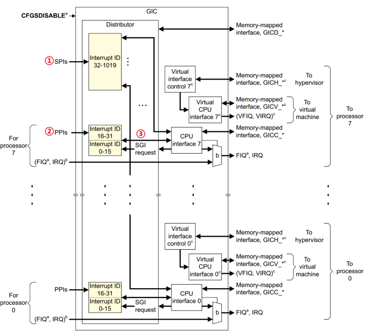
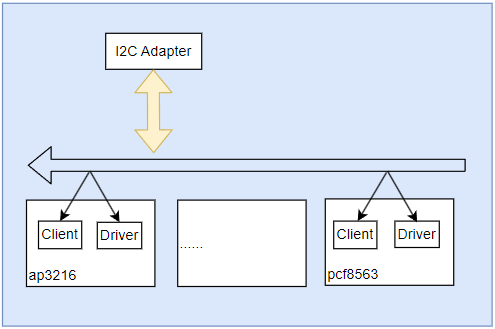
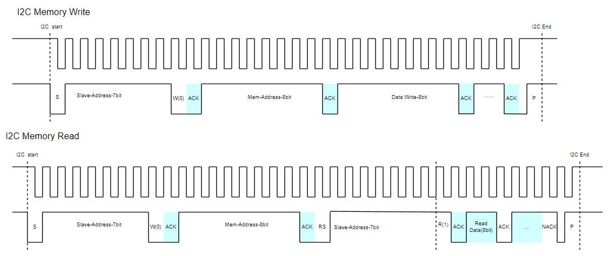

# i2c框架说明和应用

i2c是嵌入式系统中最常用通讯接口之一，常见的温湿度、距离传感器，EPPROM存储等器件都支持通过i2c接口进行通信。i2c支持一主多从的硬件结构，通过设备地址区分，只有满足设备地址的器件才会应答，这样就实现总线上同时只有一对一的芯片通讯要求，也就可以同时挂载多个不同外部器件。这种设计也要求**总线上不能有两个相同地址的从设备**，否则会导致数据状态异常(总线上相同地址的设备会同时应答，这样总线电平就会互相干扰，而无法确定)。当然如果设计需要挂载多个相同地址的器件，也可以使用TCA9546A这类多路开关进行i2c器件挂载。

i2c的器件默认为开漏模式，需要通过外部上拉电阻实现高电平输出。另外i2c更多适用与板级器件或芯片间的通讯。对于长距离通讯，需要外部电路去增强总线(如两端可以增加MAX232这类单电源电平转换芯片)，从而避免误码和错帧问题，这两点是在硬件设计时需要注意。

## i2c硬件和驱动模型

一个典型的i2c硬件拓扑如下所示。



可以看到实现完整的i2c功能需要内部i2c模块和外部i2c器件功能实现。对于内部i2c模块，实现功能需要的配置如下。

1. 配置模块对应的I/O引脚
2. i2c工作时钟配置
3. i2c工作模式配置
4. i2c工作中断配置

对于外部器件实现功能则如下所示。

1. 初始化器件，配置寄存器(如果需要)
2. 实现读，写外部器件的接口。

当然这是从硬件角度去理解驱动一个i2c器件需要实现的功能，那么在嵌入式Linux系统中，也是将硬件抽象成如下的实现。



在Linux系统中, 对硬件进行了到Linux驱动模型的转换，另外为了降低代码冗余，又将设备抽象形成设备树统一管理。外部器件的正常工作，需要i2c总线和器件的实现。i2c总线通过初始化内部i2c模块功能实现，设备则是初始化的i2c外部器件节点, 而驱动则主要是由用户开发，包含具体器件内部寄存器功能的应用实现。按照统一设备模型，具体实现如下所示。

```shell
#i2c节点生成i2c总线
devicetree i2c-node => i2c bus => i2c adapter

#i2c器件节点生成i2c client
devcietree i2c-chip-node => i2c client

#i2c驱动
driver => 实现器件初始化和访问接口
```

## 总线和i2c-adpater

前面提到，由设备树通过i2c adpater实现内部i2c模块驱动，在代码中，以I.MX6ULL的i2c1为例，节点信息如下。

```c
//配置i2c工作引脚
pinctrl_i2c1: i2c1grp {
    fsl,pins = <
        MX6UL_PAD_UART4_TX_DATA__I2C1_SCL 0x4001b8b0
        MX6UL_PAD_UART4_RX_DATA__I2C1_SDA 0x4001b8b0
    >;
};

i2c1: i2c@21a0000 {
    //定义子节点寄存器信息
    #address-cells = <1>;
    #size-cells = <0>;

    //匹配节点字符串
    compatible = "fsl,imx6ul-i2c", "fsl,imx21-i2c";

    //配置i2c的寄存器
    reg = <0x021a0000 0x4000>;

    //i2c工作中断配置
    interrupts = <GIC_SPI 36 IRQ_TYPE_LEVEL_HIGH>;

    //i2c时钟使能和工作时钟
    clocks = <&clks IMX6UL_CLK_I2C1>;
};


&i2c1 {
    //工作时钟
    clock-frequency = <100000>;

    //i2c工作引脚gpio子系统配置
    pinctrl-names = "default";
    pinctrl-0 = <&pinctrl_i2c1>;

    //节点使能
    status = "okay";
};
```

可以看到，i2c模块工作需要的时钟，I/O，功能配置，中断触发都在设备树中进行相应的定义，那么这个节点是如何加入系统中的呢？

这里有个技巧，在kernel目录检索**fsl,imx6ul-i2c**或**fsl,imx21-i2c**，可以看到drivers/i2c/busses/i2c-imx.c中匹配列表中存在，这就是官方实现的i2c adpater驱动实现。参考代码中框架可以发现i2c adpater由platform_driver_register进行注册，也就是说i2c内部模块，也被抽象成挂载在platform总线的设备，在代码中可以参考如下所示。

```c
//drivers/i2c/busses/i2c-imx.c
//"fsl,imx6ul-i2c" 匹配i2c的列表
static const struct of_device_id i2c_imx_dt_ids[] = {
    //...
    { .compatible = "fsl,imx6ul-i2c", .data = &imx6_i2c_hwdata, },
};
MODULE_DEVICE_TABLE(of, i2c_imx_dt_ids);

//寄存器资源，对应reg属性
res = platform_get_resource(pdev, IORESOURCE_MEM, 0);
base = devm_ioremap_resource(&pdev->dev, res);
if (IS_ERR(base))
    return PTR_ERR(base);

//时钟状态，并启动时钟，对应clks属性
i2c_imx->clk = devm_clk_get(&pdev->dev, NULL);
if (IS_ERR(i2c_imx->clk))
    return dev_err_probe(&pdev->dev, PTR_ERR(i2c_imx->clk),
        "can't get i2c clock\n");
ret = clk_prepare_enable(i2c_imx->clk);

//波特率，对应clock-frequency属性
i2c_imx->bitrate = I2C_MAX_STANDARD_MODE_FREQ;
ret = of_property_read_u32(pdev->dev.of_node,
                "clock-frequency", &i2c_imx->bitrate);
if (ret < 0 && pdata && pdata->bitrate)
    i2c_imx->bitrate = pdata->bitrate;

//中断处理，对应interrupts属性
ret = request_threaded_irq(irq, i2c_imx_isr, NULL,
                IRQF_SHARED | IRQF_NO_SUSPEND,
                pdev->name, i2c_imx);
if (ret) {
    dev_err(&pdev->dev, "can't claim irq %d\n", irq);
    goto rpm_disable;
}

//资源保存在adapter中，添加到系统中
strscpy(i2c_imx->adapter.name, pdev->name, sizeof(i2c_imx->adapter.name));
i2c_imx->adapter.owner  = THIS_MODULE;
i2c_imx->adapter.algo   = &i2c_imx_algo;
i2c_imx->adapter.dev.parent = &pdev->dev;
i2c_imx->adapter.nr = pdev->id;
i2c_imx->adapter.dev.of_node = pdev->dev.of_node;
i2c_imx->base = base;

ret = i2c_add_numbered_adapter(&i2c_imx->adapter);
if (ret < 0)
    goto clk_notifier_unregister;
```

可以看到设备树非节点的配置向，会在此处进行处理，实现i2c内部模块的功能配置，也就是i2c-bus的功能实现。这部分就是内部模块的驱动，也是统一设备模型中总线的实现部分。另外，总线初始化完成后，会0在/sys/bus/下创建对应总线，并在/sys/bus/i2c/devices/中生成相应的器件节点，这样就可以在驱动中使用i2c总线接口来进行器件驱动的加载。可通过如下命令，查看系统支持的i2c总线器件。

```shell
ls /sys/bus/i2c/devices/
```

## ap3216c驱动实现

内核中实现了i2c内部模块的驱动，这样我们只要加载外部器件的驱动，即可完整实现器件的功能，不过在学习本节前，先讲解下涉及到的i2c相关的api接口，以及器件的特性，这也是我们开发驱动的基础。

### i2c驱动接口

关于i2c相关的api如下所示。

```c
//在i2c总线下注册外部设备
#define i2c_add_driver(driver) \
    i2c_register_driver(THIS_MODULE, driver)
int i2c_register_driver(struct module *owner, struct i2c_driver *driver);

//移除已经注册的i2c外部设备
void i2c_del_driver(struct i2c_driver *driver);

//传输一或多组i2c数据，支持从器件读写数据
int i2c_transfer(struct i2c_adapter *adap, struct i2c_msg *msgs, int num)

//i2c保存设备私有数据
void i2c_set_clientdata(struct i2c_client *client, void *data);

//i2c获取设备私有数据
void *i2c_get_clientdata(const struct i2c_client *client);
```

对于i2c中，最重要的就两个结构，如下所示。

- i2c_adapter: i2c模块总线适配器，内部i2c控制器管理结构(如i2c0, i2c1)
- i2c_client: i2c器件，管理i2c上对应器件节点的结构(如ap3216a, pcf8573等)

```c
//i2c_adapter
//i2c_adapter是在设备树加载时匹配总线驱动代码执行赋值创建的，在上面进行了说明讲解
struct i2c_adapter {
  struct module *owner;             -- 适配器的所有者
  unsigned int class;               -- 匹配加载的类设备对象
  const struct i2c_algorithm *algo; -- 访问总线的方法集合，关联到底层硬件的操作
  void *algo_data;                  -- 访问总线方法的私有数据

  /* data fields that are valid for all devices  */
  const struct i2c_lock_operations *lock_ops;
  struct rt_mutex bus_lock;
  struct rt_mutex mux_lock;

  int timeout;      /* in jiffies */-- 适配器通信超时事件
  int retries;                      -- 适配器通信重试次数
  struct device dev;                -- 当前设备器所在的节点信息
  unsigned long locked_flags;  /* owned by the i2c core */
#define I2C_ALF_IS_SUSPENDED    0
#define I2C_ALF_SUSPEND_REPORTED  1

  int nr;                           -- 设备的id编号，对应i2c设备
  char name[48];                    -- 适配器名称
  struct completion dev_released;

  struct mutex userspace_clients_lock;
  struct list_head userspace_clients;

  struct i2c_bus_recovery_info *bus_recovery_info;
  const struct i2c_adapter_quirks *quirks;

  struct irq_domain *host_notify_domain;
  struct regulator *bus_regulator;  -- 总线电源管理的指针
};

//i2c——client
struct i2c_client {
  unsigned short flags;         -- i2c器件支持的功能位
#define I2C_CLIENT_PEC    0x04  /* Use Packet Error Checking */
#define I2C_CLIENT_TEN    0x10  /* we have a ten bit chip address */
          /* Must equal I2C_M_TEN below */
#define I2C_CLIENT_SLAVE  0x20  /* we are the slave */
#define I2C_CLIENT_HOST_NOTIFY  0x40  /* We want to use i2c host notify */
#define I2C_CLIENT_WAKE    0x80  /* for board_info; true iff can wake */
#define I2C_CLIENT_SCCB    0x9000  /* Use Omnivision SCCB protocol */
          /* Must match I2C_M_STOP|IGNORE_NAK */

  unsigned short addr;          -- i2c器件地址，放置在低位(需要用到)
  char name[I2C_NAME_SIZE];     -- i2c器件名称
  struct i2c_adapter *adapter;  -- i2c器件所属的总线适配器(需要用到)
  struct device dev;            -- i2c器件所属的设备节点(如i2c下的ap3216节点)
  int init_irq;                 -- 初始化设置的对应中断
  int irq;                      -- 设备中i2c对应的irq中断线号
  struct list_head detected;    -- i2c驱动成员
#if IS_ENABLED(CONFIG_I2C_SLAVE)
  i2c_slave_cb_t slave_cb;      -- 从模式下的回调函数
#endif
  void *devres_group_id;        -- 探测设备时，为获取的资源创建的devres组Id。
};
```

### 器件原理图和设备树

关于ap3216c的连接原理图如下所示。


其中通讯引脚为i2c1, AP_INT为中断引脚，连接I/O为GPIO1_1。i2c器件的地址为0x1E(参考datasheet)，基于这些信息，可以实现i2c器件节点的设备树如下。

```c
&iomuxc {
    pinctrl_ap3216_tsc: gpio-ap3216 {
        fsl,pins = <
            MX6UL_PAD_GPIO1_IO01__GPIO1_IO01    0x40017059
        >;
    };
};

i2c1: i2c@21a0000 {
    #address-cells = <1>;                               //定义"子节点"寄存器占用，1字节
    #size-cells = <0>;                                  //定义"子节点"寄存器长度占用，表示不存在
    compatible = "fsl,imx6ul-i2c", "fsl,imx21-i2c";     //compatible: 标签，用于platform驱动匹配
    reg = <0x021a0000 0x4000>;                          //寄存器列表，用于访问配置
    interrupts = <GIC_SPI 36 IRQ_TYPE_LEVEL_HIGH>;      //定义i2c1对应的中断控制器，中断线号和中断类型
    clocks = <&clks IMX6UL_CLK_I2C1>;                   //定义i2c1的时钟管理模块
    status = "disabled";                                //模块状态，会被后续覆盖
};

&i2c1 {
    clock-frequency = <100000>;                         //定义i2c的工作时钟
    pinctrl-0 = <&pinctrl_i2c1>;                        //定义对应i2c通讯引脚的pinctrl配置
    pinctrl-names = "default";                          //定义i2c通讯引脚配置的别名，驱动访问时需要
    status = "okay";                                    //模块状态

    ap3216@1e {
        compatible = "rmk,ap3216";                      //compatible: 标签，用于spi总线匹配
        reg = <0x1e>;                                   //reg: i2c的寄存器地址, 总线加载器件时获取
        rmk,sysconf = <0x03>;                           //rmk,sysconf: 自定义属性，用于定义配置寄存器的初始值
        pinctrl-0 = <&pinctrl_ap3216_tsc>;              //定义器件的中断I/O引脚配置
        pinctrl-names = "default";                      //定义器件的中断I/O引脚配置别名
        interrupt-parent = <&gpio1>;                    //定义器件的中断I/O对应得中断控制器
        interrupts = <1 IRQ_TYPE_EDGE_FALLING>;         //定义I/O对应的中断线号和中断类型
        int-gpios = <&gpio1 1 GPIO_ACTIVE_LOW>;         //定义I/O引脚对应的GPIO
    };
};
```

### 驱动应用代码

在实现了定义的设备节点，下一步就算实现器件的操作的代码，这里面分为三部分，下面详细介绍。

#### 驱动加载和移除接口

主要实现标准的驱动加载函数，并实现通过i2c总线加载和移除器件的接口。

```c
//i2c驱动加载时执行的函数
static int i2c_probe(struct i2c_client *client, const struct i2c_device_id *id)
{
    int result;
    struct ap3216_data *chip = NULL;
    struct device_node *np = client->dev.of_node;
    u8 buf;

    chip = devm_kzalloc(&client->dev, sizeof(struct ap3216_data), GFP_KERNEL);
    if (!chip){
        dev_err(&client->dev, "malloc error\n");
        return -ENOMEM;
    }
    chip->client = client;
    i2c_set_clientdata(client, chip);

    result = i2c_device_create(chip);
    if (result){
        dev_err(&client->dev, "device create failed!\n");
        return result;   
    }

    result = of_property_read_u32(np, "rmk,sysconf", &chip->sysconf);
    if(result)
        chip->sysconf = 0x03;

    buf = 0x04;     //reset ap3216
    ap3216_write_block(client, AP3216C_SYSCONFG, &buf, 1);
    mdelay(50);
    buf = chip->sysconf;     //enable ALS+PS+LR
    ap3216_write_block(client, AP3216C_SYSCONFG, &buf, 1);

    dev_info(&client->dev, "i2c driver init ok, sysconf:%d!\n", chip->sysconf);
    return 0;
}

//i2c驱动移除时执行的函数
static void i2c_remove(struct i2c_client *client)
{
    struct ap3216_data *chip = i2c_get_clientdata(client);

    device_destroy(chip->class, chip->dev_id);
    class_destroy(chip->class);
    cdev_del(&chip->cdev);
    unregister_chrdev_region(chip->dev_id, DEVICE_CNT);
}

//匹配设备树中compatible属性的列表
static const struct of_device_id ap3216_of_match[] = {
    { .compatible = "rmk,ap3216" },
    { /* Sentinel */ }
};

static struct i2c_driver ap3216_driver = {
    .probe = i2c_probe,
    .remove = i2c_remove,
    .driver = {
        .owner = THIS_MODULE,
        .name = "ap3216",
        .of_match_table = ap3216_of_match, 
    },
};

static int __init ap3216_module_init(void)
{
    return i2c_add_driver(&ap3216_driver); //匹配i2c bus下的节点，通过ls /sys/bus/i2c/devices/查看
}

static void __exit ap3216_module_exit(void)
{
    return i2c_del_driver(&ap3216_driver);
}

//驱动加载和移除的必要宏
module_init(ap3216_module_init);
module_exit(ap3216_module_exit);
MODULE_AUTHOR("zc");                      
MODULE_LICENSE("GPL v2");                  
MODULE_DESCRIPTION("ap3216 driver");      
MODULE_ALIAS("i2c_ap3216_driver");
```

### 驱动字符型设备访问接口

主要实现字符设备的创建，提供应用层访问的open，read，write，close接口，这一部分可以参考[字符设备驱动实现](./ch03-03.char_device.md)中关于设备号申请，字符设备创建，类创建。

```c
static const struct file_operations ap3216_ops = {
    .owner = THIS_MODULE,
    .open = ap3216_open,
    .read = ap3216_read,
    .release = ap3216_release,
};

//创建i2c设备，关联寄存器
static int i2c_device_create(struct ap3216_data *chip)
{
    int result;
    int major = DEFAULT_MAJOR;
    int minor = DEFAULT_MINOR;
    struct i2c_client *client = chip->client;

    //1. 从内核申请主设备号和子设备号
    if (major) {
        chip->dev_id= MKDEV(major, minor);
        result = register_chrdev_region(chip->dev_id, 1, DEVICE_NAME);
    } else {
        result = alloc_chrdev_region(&chip->dev_id, 0, 1, DEVICE_NAME);
        major = MAJOR(chip->dev_id);
        minor = MINOR(chip->dev_id);
    }
    if (result < 0){
        dev_err(&client->dev, "dev alloc id failed\n");
        goto exit;
    }

    //2. 创建字符设备，关联访问接口和设备号
    cdev_init(&chip->cdev, &ap3216_ops);
    chip->cdev.owner = THIS_MODULE;
    result = cdev_add(&chip->cdev, chip->dev_id, 1);
    if (result != 0){
        dev_err(&client->dev, "cdev add failed\n");
        goto exit_cdev_add;
    }

    //3. 创建设备类，关联名称
    chip->class = class_create(THIS_MODULE, DEVICE_NAME);
    if (IS_ERR(chip->class)){
        dev_err(&client->dev, "class create failed!\r\n");
        result = PTR_ERR(chip->class);
        goto exit_class_create;
    }

    //. 将设备类和字符设备号关联，添加到内核中，创建最终设备
    chip->device = device_create(chip->class, NULL, chip->dev_id, NULL, DEVICE_NAME);
    if (IS_ERR(chip->device)){
        dev_err(&client->dev, "device create failed!\r\n");
        result = PTR_ERR(chip->device);
        goto exit_device_create;
    }

    dev_info(&client->dev, "dev create ok, major:%d, minor:%d\r\n", major, minor);
    return 0;

exit_device_create:
    class_destroy(chip->class);
exit_class_create:
    cdev_del(&chip->cdev);
exit_cdev_add:
    unregister_chrdev_region(chip->dev_id, 1);
exit:
    return result;
}
```

### 器件配置和应用访问接口

对于器件配置，最重要的部分就是实现访问读写i2c器件的接口。上面提到过，i2c模块总线在内部转换成i2c_adpater结构管理，i2c器件则转换为i2c_client进行处理，因此通讯就是使用这两个对象管理，这里先列出i2c通讯的原理图。



```c
//i2c读取数据
static int ap3216_read_block(struct i2c_client *client, u8 reg, void *buf, int len)
{
    struct i2c_msg msg[2];

    //addr|w reg_addr
    msg[0].addr = client->addr; //器件地址，0x1e
    msg[0].flags = 0;       
    msg[0].buf = &reg;
    msg[0].len = 1;

    //addr|r data
    msg[1].addr = client->addr; //器件地址，0x1e
    msg[1].flags = I2C_M_RD;    //读取标志
    msg[1].buf = buf;
    msg[1].len = len;

    if (i2c_transfer(client->adapter, msg, 2) != 2){
        dev_err(&client->dev, "%s: read error\n", __func__);
        return -EIO;
    }
    return 0;
}

//i2c写入数据
static int ap3216_write_block(struct i2c_client *client, u8 reg, u8 *buf, u8 len)
{
    u8 b[256];
    struct i2c_msg msg;

    //addr|w reg_addr
    msg.addr = client->addr;
    msg.flags = 0;

    //reg_addr data
    b[0] = reg;
    memcpy(&b[1], buf, len);

    msg.buf = b;
    msg.len = len + 1;

    return i2c_transfer(client->adapter, &msg, 1);
}
```

关于i2c的全部代码详细可以参考如下文件：[i2c驱动文件](./file/ch03-06.i2c_frame/kernel_i2c_ap.c)。

## 总结

i2c支持一主多从，常用的触摸屏，io扩展，rtc芯片，检测sensor，adc芯片基本都支持i2c接口，可以说是最常用的片上通讯接口。i2c驱动的实现并不困难，总结起来如下所示。

1. 在设备树下添加i2c设备节点，包含器件地址信息(同一个i2c器件地址需要唯一)
2. 驱动中匹配器件节点中compatible属性，实现驱动加载接口
3. 实现应用层访问的接口，本例中实现字符型设备进行访问(也可以通过iio方式访问)
4. 实现硬件访问接口(i2c_transfer)，配置器件，并和应用层访问接口关联

如此，便实现了i2c驱动，这里讲述下i2c驱动开发时遇到的问题和解决办法。

- 驱动不能够正常加载(probe未执行)

1. 确定驱动内compatible内容和设备树是否一致
2. 通过ls /sys/bus/i2c/devices/，查看是否有对应节点(以i2c1上的0x1e节点，其为0-001e)，如果没有节点，查看设备树是否正确
3. 查看ls /sys/bus/i2c/devices/0-001e/，查看是否有driver节点，如果有表示驱动已经加载(可能是内核中带有驱动)，如果期望使用自己的驱动，需要内核配置关闭

- 访问i2c接口读写失败

1. 确定i2c是否有外部上拉电平
2. i2c地址是否正确，分为7bit/10bit, 不左移的原始地址
3. 确定正确的话，可通过示波器或者逻辑分析仪查看引脚电平，确定是否正确产生。

这里基本是我遇到的i2c调试时的问题，作为第一个接触的通讯接口，按照上面的思路，实现驱动并不困难。不过i2c器件总类繁多，在使用中需要根据器件内部的寄存器表进行相应的开发，这就需要长期不断的积累，例如有些器件除了需要i2c通讯外，还支持引脚翻转来通知主控soc状态变更，这就需要增加中断的支持，另外一些i2c器件，用于检测温湿度，就要配合thermal子系统实现温控处理。总之，i2c子系统可以说是用途十分广泛的接口应用，再实践中就需要具体情况，具体分析。不积跬步无以至千里，在此共勉。

## next_chapter

[返回目录](../README.md)

直接开始下一节说明: [spi框架说明和应用](./ch03-07.spi_frame.md)
