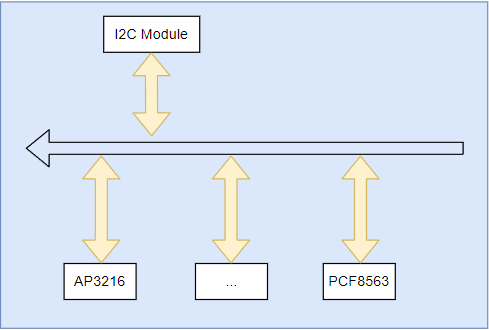

# i2c框架说明和应用

## i2c硬件和驱动模型

I2C是嵌入式Linux中最常用通讯接口之一，作为嵌入式设备间和外部芯片的重要接口通道.I2C支持一主多从的设备结构，通过设备地址区分应答， 可以实现总线上同时只有一对一的芯片通讯， 这样就可以挂载多个不同设备地址的设备，当然这也要求**总线上不能有两个相同地址的从设备**，否则会导致数据状态异常(如果有需要一路i2c扩展使用多路相同地址的设备，可以使用TCA9546A这类多路切换开关进行选择使用)。

I2C的器件默认为开漏模式，需要通过外部上拉电阻实现高电平输出。不过I2C更多适用与板级器件或芯片间的通讯，如果是长距离通讯，需要外部电路去增强总线(如两端可以增加MAX232这类单电源电平转换芯片)，从而避免误码和错帧问题，这两点是在硬件设计时需要注意，一个典型的i2c硬件拓扑如下所示。



可以看到实现完整的i2c功能需要内部i2c模块和外部i2c器件功能实现。

对于内部i2c模块，实现功能需要的配置如下。

1. 模块对应的i/o引脚配置
2. i2c工作时钟配置
3. i2c工作模式配置
4. i2c工作中断配置

对于外部器件实现功能则如下所示。

1. 初始化器件，配置寄存器(如果需要)
2. 实现读，写外部器件的接口。

当然这是从硬件角度去理解驱动一个i2c器件需要实现的功能，那么在嵌入式Linux系统中，也是将硬件抽象成如下的实现。


在Linux系统中, 对硬件进行了到Linux驱动模型的转换，另外为了降低代码冗余，又将设备抽象形成设备树统一管理，整个转换如下所示。

```shell
#硬件转换驱动模型
i2c device => i2c adpater => device-tree(i2c node)
i2c hw-bus => i2c bus
extern chip => extern chip driver
```

从上面的转换可以看出，i2c的外部器件如果正常工作，需要设备树，i2c_adpater设备支持，以及外部器件三部分组成。其中i2c_adpater和设备树一般在厂商出厂时就已经实现，而外部器件的驱动需要驱动的支持，这也是我们主要的开发部分，不过今天既然要说明i2c框架，那么我们从最基础的i2c模块说起。

## 设备树和i2c-adpater

前面提到，由设备树通过i2c adpater实现内部i2c模块驱动，在代码中，以I.MX6ULL的i2c1为例，节点信息如下。

```json
//配置i2c工作引脚
pinctrl_i2c1: i2c1grp {
    fsl,pins = <
        MX6UL_PAD_UART4_TX_DATA__I2C1_SCL 0x4001b8b0
        MX6UL_PAD_UART4_RX_DATA__I2C1_SDA 0x4001b8b0
    >;
};

i2c1: i2c@21a0000 {
    //定义子节点寄存器信息
    #address-cells = <1>;
    #size-cells = <0>;

    //匹配节点字符串
    compatible = "fsl,imx6ul-i2c", "fsl,imx21-i2c";

    //配置i2c的寄存器
    reg = <0x021a0000 0x4000>;

    //i2c工作中断配置
    interrupts = <GIC_SPI 36 IRQ_TYPE_LEVEL_HIGH>;

    //i2c时钟使能和工作时钟
    clocks = <&clks IMX6UL_CLK_I2C1>;
    clock-frequency = <100000>;

    //i2c工作引脚gpio子系统配置
    pinctrl-names = "default";
    pinctrl-0 = <&pinctrl_i2c1>;

    //节点使能
    status = "okay";

    //i2c下挂载的器件设备节点
    ap3216@1e {
        compatible = "rmk,ap3216";
        reg = <0x1e>;
    };
};
```

可以看到，i2c模块工作需要的时钟，I/O，功能配置，中断触发都在设备树中进行相应的定义，那么这个节点是如何加入系统中的呢？这里有个技巧，在kernel目录检索**fsl,imx6ul-i2c**或**fsl,imx21-i2c**，可以看到drivers/i2c/busses/i2c-imx.c中匹配列表中存在，这就是官方实现的i2c adpater驱动实现。参考代码中框架可以发现i2c adpater由platform_driver_register进行注册，也就是说i2c内部模块，也被抽象成挂载在platform总线的设备，在代码中可以参考如下所示。

```c
//"fsl,imx6ul-i2c" 匹配i2c的列表
static const struct of_device_id i2c_imx_dt_ids[] = {
    { .compatible = "fsl,imx1-i2c", .data = &imx1_i2c_hwdata, },
    { .compatible = "fsl,imx21-i2c", .data = &imx21_i2c_hwdata, },
    { .compatible = "fsl,imx6q-i2c", .data = &imx6_i2c_hwdata, },
    { .compatible = "fsl,imx6sl-i2c", .data = &imx6_i2c_hwdata, },
    { .compatible = "fsl,imx6sll-i2c", .data = &imx6_i2c_hwdata, },
    { .compatible = "fsl,imx6sx-i2c", .data = &imx6_i2c_hwdata, },
    { .compatible = "fsl,imx6ul-i2c", .data = &imx6_i2c_hwdata, },
    { .compatible = "fsl,imx7s-i2c", .data = &imx6_i2c_hwdata, },
    { .compatible = "fsl,imx8mm-i2c", .data = &imx6_i2c_hwdata, },
    { .compatible = "fsl,imx8mn-i2c", .data = &imx6_i2c_hwdata, },
    { .compatible = "fsl,imx8mp-i2c", .data = &imx6_i2c_hwdata, },
    { .compatible = "fsl,imx8mq-i2c", .data = &imx6_i2c_hwdata, },
    { .compatible = "fsl,vf610-i2c", .data = &vf610_i2c_hwdata, },
    { .compatible = "fsl,imx7d-i2c", .data = &imx7d_i2c_hwdata, },
    { /* sentinel */ }
};
MODULE_DEVICE_TABLE(of, i2c_imx_dt_ids);

//寄存器资源，对应reg属性
res = platform_get_resource(pdev, IORESOURCE_MEM, 0);
base = devm_ioremap_resource(&pdev->dev, res);
if (IS_ERR(base))
    return PTR_ERR(base);

//时钟状态，并启动时钟，对应clks属性
i2c_imx->clk = devm_clk_get(&pdev->dev, NULL);
if (IS_ERR(i2c_imx->clk))
    return dev_err_probe(&pdev->dev, PTR_ERR(i2c_imx->clk),
        "can't get I2C clock\n");
ret = clk_prepare_enable(i2c_imx->clk);

//波特率，对应clock-frequency属性
i2c_imx->bitrate = I2C_MAX_STANDARD_MODE_FREQ;
ret = of_property_read_u32(pdev->dev.of_node,
                "clock-frequency", &i2c_imx->bitrate);
if (ret < 0 && pdata && pdata->bitrate)
    i2c_imx->bitrate = pdata->bitrate;

//中断处理，对应interrupts属性
ret = request_threaded_irq(irq, i2c_imx_isr, NULL,
                IRQF_SHARED | IRQF_NO_SUSPEND,
                pdev->name, i2c_imx);
if (ret) {
    dev_err(&pdev->dev, "can't claim irq %d\n", irq);
    goto rpm_disable;
}

//资源保存在adapter中
strscpy(i2c_imx->adapter.name, pdev->name, sizeof(i2c_imx->adapter.name));
i2c_imx->adapter.owner  = THIS_MODULE;
i2c_imx->adapter.algo   = &i2c_imx_algo;
i2c_imx->adapter.dev.parent = &pdev->dev;
i2c_imx->adapter.nr = pdev->id;
i2c_imx->adapter.dev.of_node = pdev->dev.of_node;
i2c_imx->base = base;
```

可以看到设备树内的配置项，最终都在i2c-adpter进行处理，实现i2c内部模块adpater的功能配置，也就是i2c-bus的功能实现，这部分的如果成功加载，会在/sys/bus/i2c/devices/中生成相应的节点，可通过命令查看。

```shell
ls /sys/bus/i2c/devices/
```

## i2c驱动实现

## next_chapter

[返回目录](./SUMMARY.md)

直接开始下一节说明: [spi框架说明和应用](./ch03-07.spi_frame.md)
