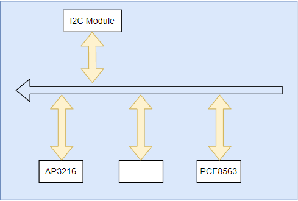
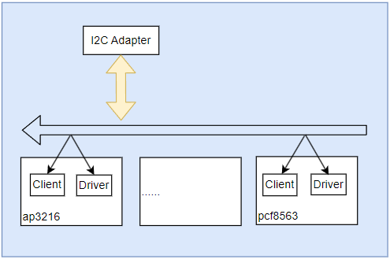
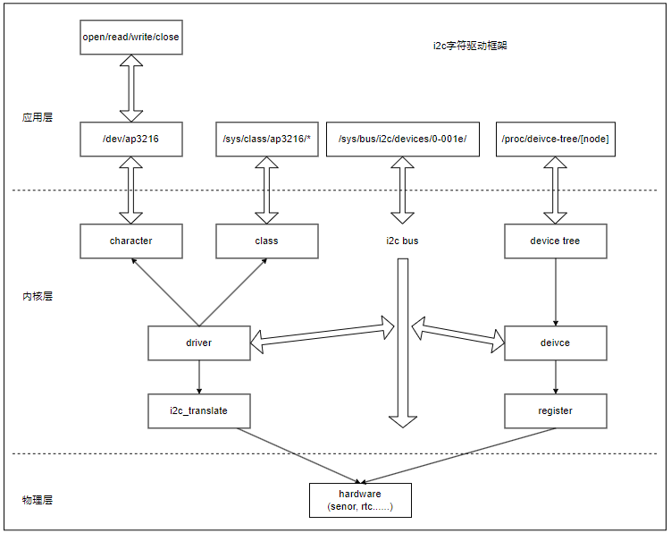
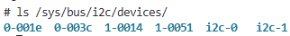
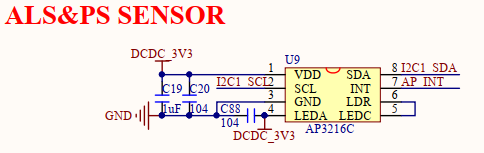

# I2C设备和驱动管理框架

I2C是嵌入式系统中最常用通讯接口之一；常见的温湿度、距离传感器、EEPROM、RTC时钟器件都支持通过I2C接口进行通信。在一主多从的硬件结构中，通过设备地址进行区分，只有地址匹配的从设备才会对主设备的请求进行应答；这样就实现总线上同时只有一对一的芯片通讯要求，也就可以同时挂载多个不同外部器件。这种设计也要求**总线上不能有两个相同地址的从设备**，否则会导致数据状态异常(总线上相同地址的设备会同时应答，这样总线电平就会互相干扰，而无法确定)。如果设计需要挂载多个相同地址的器件，可以使用TCA9546A这类多路开关来实现I2C器件的挂载。

I2C的器件默认为开漏模式，需要通过外部上拉电阻实现高电平输出，主要适用与板级器件或芯片间的通讯。对于长距离通讯，需要外部电路去增强总线(如两端可以增加电源电平转换芯片或者差分总线来提高准确性)，从而避免误码和错帧问题，这些是在硬件设计时需要注意。

关于I2C模块的说明，具体目录如下所示。

- I2C硬件和驱动模型
- 总线和内部adpater
- 外部器件驱动应用(以ap3216为例)
- 总结说明

## I2C硬件和驱动模型

一个典型的I2C硬件拓扑如下所示。



可以看到实现完整的I2C功能需要内部I2C模块和外部I2C器件功能实现。

对于内部I2C模块，实现功能需要的配置如下。

1. 配置模块对应的I/O引脚。
2. I2C工作时钟配置。
3. I2C工作模式配置。
4. I2C工作中断配置。

对于外部器件实现功能则如下所示。

1. 初始化器件，配置寄存器(如果需要)。
2. 实现读，写外部器件的接口。

当然这是从硬件角度去理解驱动一个I2C器件需要实现的功能，那么在嵌入式Linux系统中，也是将硬件抽象成如下的实现。



在Linux系统中, 对硬件进行了到Linux驱动模型的转换，另外为了降低代码冗余，又将设备抽象形成设备树统一管理。外部器件的正常工作，需要I2C总线和器件的实现。I2C总线通过初始化内部I2C模块功能实现，设备则是初始化的I2C外部器件节点, 而驱动则主要是由用户开发，包含具体器件内部寄存器功能的应用实现。

基于设备模型，其详细框架如下所示。



```shell
# I2C节点生成i2c总线
devicetree i2c-node => i2c bus => i2c adapter

# I2C器件节点生成I2C client
devcietree i2c-chip-node => i2c client

# i2c驱动
driver => 实现器件初始化和访问接口
```

## 总线和内部adpater

前面提到，由设备树通过i2c adpater实现内部I2C模块驱动。以I.MX6ULL的I2C1为例，节点信息如下。

```c
// 配置I2C工作引脚
pinctrl_i2c1: i2c1grp {
    fsl,pins = <
        MX6UL_PAD_UART4_TX_DATA__I2C1_SCL 0x4001b8b0
        MX6UL_PAD_UART4_RX_DATA__I2C1_SDA 0x4001b8b0
    >;
};

// 配置I2C节点
i2c1: i2c@21a0000 {
    #address-cells = <1>;     // 定义子节点寄存器信息
    #size-cells = <0>;

    compatible = "fsl,imx6ul-i2c", "fsl,imx21-i2c";     // 匹配节点字符串
    reg = <0x021a0000 0x4000>;                          // 指定I2C寄存器范围
    interrupts = <GIC_SPI 36 IRQ_TYPE_LEVEL_HIGH>;      // I2C硬件中断配置
    clocks = <&clks IMX6UL_CLK_I2C1>;                   // 指定I2C的时钟资源
};

// 引用配置I2C节点
&i2c1 {
    clock-frequency = <100000>;                          // 工作时钟
    pinctrl-names = "default";                           // 引脚复用功能配置
    pinctrl-0 = <&pinctrl_i2c1>;
    status = "okay";                                     // 节点状态，okay
};
```

可以看到，I2C模块工作需要的时钟、I/O、功能配置、中断触发都在设备树中进行相应的定义，那么这个节点是如何加入系统中的呢？

这里有个技巧，在kernel目录检索**fsl,imx6ul-i2c**或**fsl,imx21-i2c**，对应文件如下所示。

```c
// 内核中匹配的i2c驱动文件
drivers/i2c/busses/i2c-imx.c
```

这就是官方实现的adpater驱动实现。

参考代码中框架可以发现i2c adpater由platform_driver_register进行注册，也就是说I2C内部模块，也被抽象成挂载在platform总线的设备，在代码中可以参考如下所示。

```c
//drivers/i2c/busses/i2c-imx.c
//"fsl,imx6ul-i2c" 匹配i2c的列表
static const struct of_device_id i2c_imx_dt_ids[] = {
    //...
    { .compatible = "fsl,imx6ul-i2c", .data = &imx6_i2c_hwdata, },
};
MODULE_DEVICE_TABLE(of, i2c_imx_dt_ids);

// 寄存器资源，对应reg属性
res = platform_get_resource(pdev, IORESOURCE_MEM, 0);
base = devm_ioremap_resource(&pdev->dev, res);
if (IS_ERR(base))
    return PTR_ERR(base);

// 时钟状态，并启动时钟，对应clks属性
i2c_imx->clk = devm_clk_get(&pdev->dev, NULL);
if (IS_ERR(i2c_imx->clk))
    return dev_err_probe(&pdev->dev, PTR_ERR(i2c_imx->clk),
        "can't get i2c clock\n");
ret = clk_prepare_enable(i2c_imx->clk);

// 波特率，对应clock-frequency属性
i2c_imx->bitrate = I2C_MAX_STANDARD_MODE_FREQ;
ret = of_property_read_u32(pdev->dev.of_node,
                "clock-frequency", &i2c_imx->bitrate);
if (ret < 0 && pdata && pdata->bitrate)
    i2c_imx->bitrate = pdata->bitrate;

// 中断处理，对应interrupts属性
ret = request_threaded_irq(irq, i2c_imx_isr, NULL,
                IRQF_SHARED | IRQF_NO_SUSPEND,
                pdev->name, i2c_imx);
if (ret) {
    dev_err(&pdev->dev, "can't claim irq %d\n", irq);
    goto rpm_disable;
}

// 资源保存在adapter中，添加到系统中
strscpy(i2c_imx->adapter.name, pdev->name, sizeof(i2c_imx->adapter.name));
i2c_imx->adapter.owner  = THIS_MODULE;
i2c_imx->adapter.algo   = &i2c_imx_algo;
i2c_imx->adapter.dev.parent = &pdev->dev;
i2c_imx->adapter.nr = pdev->id;
i2c_imx->adapter.dev.of_node = pdev->dev.of_node;
i2c_imx->base = base;

ret = i2c_add_numbered_adapter(&i2c_imx->adapter);
if (ret < 0)
    goto clk_notifier_unregister;
```

可以看到设备树非节点的配置向，会在此处进行处理，实现I2C内部模块的功能配置，也就是i2c-bus的功能实现。这部分就是内部模块的驱动，也是设备模型中总线的实现部分。

另外，总线初始化完成后，会在/sys/bus/下创建对应总线，并在/sys/bus/i2c/devices/中生成相应的器件节点，这样就可以在驱动中使用I2C总线接口来进行器件驱动的加载。

可通过如下命令，查看系统支持的I2C总线器件。

```shell
# 查看系统支持的I2C总线器件
ls /sys/bus/i2c/devices/
```

具体显示如下所示。



可以使用i2cdetect查看当前I2C总线上的设备。

```shell
# 显示系统当前支持的总线
i2cdetect -l

# 显示当前总线上挂载的设备(可以去/sys/bus下查看具体设备名称)
# i2cdetect -y [n]
i2cdetect -y 1
```

## 外部器件驱动应用(以ap3216为例)

内核中I2C控制器作为内部模块注册为I2C总线，挂载在总线上的器件注册为设备，这样再完成相应的驱动，既可以实现设备注册和访问的功能。

本节以外部器件ap3216为例，说明如何实现I2C外部器件的驱动。其主要内部包含I2C总线驱动加载和数据传输的接口、设备树节点的实现、驱动代码实现和应用层访问实现。

### 驱动加载和数据传输的接口

i2c驱动接口主要包含驱动加载、卸载和数据传输的接口，如下所示。

```c
// 在I2C总线下加载I2C驱动
// @owner: 驱动的所有者，通常是使用THIS_MODULE宏
// @driver: 要加载的I2C驱动结构体指针
// @返回: 0表示加载成功，负数表示加载失败
#define i2c_add_driver(driver) \
    i2c_register_driver(THIS_MODULE, driver)
int i2c_register_driver(struct module *owner, struct i2c_driver *driver);

// 移除已经加载的I2C驱动
// @driver: 已经加载的驱动结构体
void i2c_del_driver(struct i2c_driver *driver);

// 传输一或多组I2C数据，支持从器件读写数据
// @adap: I2C适配器，用于管理具体I2C总线的结构
// @msgs：I2C消息，包含要发送或接收的数据信息
// @num: 要传输的消息数量
// @返回: 成功传输的消息数量，负数表示传输错误
int i2c_transfer(struct i2c_adapter *adap, struct i2c_msg *msgs, int num);

// I2C保存设备私有数据
// @client: I2C客户端，用于管理具体I2C器件的结构
// @data: 要保存的私有数据指针
void i2c_set_clientdata(struct i2c_client *client, void *data);

// I2C获取设备私有数据
// @client: I2C客户端，用于获取对应I2C器件的私有数据
// @返回: 指向私有数据的指针
void *i2c_get_clientdata(const struct i2c_client *client);
```

对于I2C中，最重要的就两个结构，如下所示。

- i2c_adapter: I2C模块总线适配器，内部I2C控制器管理结构(如I2C0, I2C1)。
- i2c_client: I2C器件，管理I2C上对应器件节点的结构(如ap3216, pcf8573等)。

```c
// i2c_adapter结构
struct i2c_adapter {
  struct module *owner;             // 适配器的所有者，用于管理模块的引用计数
  unsigned int class;               // 匹配加载的类设备对象，用于设备匹配
  const struct i2c_algorithm *algo; // 访问总线的方法集合，关联到底层硬件的操作
  void *algo_data;                  // 访问总线方法的私有数据，用于传递特定于算法的上下文

  const struct i2c_lock_operations *lock_ops; // 指向I2C锁操作结构体的指针，用于管理I2C总线的访问锁
  struct rt_mutex bus_lock;                   // 用于保护I2C总线访问的互斥锁，防止并发访问冲突
  struct rt_mutex mux_lock;                   // 用于保护I2C多路复用器访问的互斥锁，防止并发访问冲突

  int timeout;                      // 适配器通信超时时间，以jiffies为单位，用于控制通信的最大等待时间
  int retries;                      // 适配器通信重试次数，用于在通信失败时进行重试
  struct device dev;                // 当前设备器所在的节点信息，包含设备的基本信息和操作函数
  unsigned long locked_flags;       // 由I2C核心管理的标志，用于表示设备的状态
#define I2C_ALF_IS_SUSPENDED    0
#define I2C_ALF_SUSPEND_REPORTED  1

  int nr;                           // 设备的id编号，对应i2c设备，用于唯一标识I2C适配器
  char name[48];                    // 适配器名称，用于标识和调试
  struct completion dev_released;   // 用于同步设备释放的完成量，确保设备释放操作完成

  struct mutex userspace_clients_lock; // 用于保护用户空间客户端列表的互斥锁，防止并发访问冲突
  struct list_head userspace_clients;  // 用户空间客户端列表，用于管理用户空间的I2C客户端

  struct i2c_bus_recovery_info *bus_recovery_info;  // 指向I2C总线恢复信息的指针，用于在总线故障时进行恢复
  const struct i2c_adapter_quirks *quirks;          // 指向I2C适配器特性结构体的指针，用于描述适配器的特殊行为或特性

  struct irq_domain *host_notify_domain;    // 指向主机通知中断域的指针，用于处理主机通知中断
  struct regulator *bus_regulator;          // 总线电源管理的指针，用于管理总线的电源
};

// i2c_client结构
struct i2c_client {
  unsigned short flags;         //i2c器件支持的功能位
#define I2C_CLIENT_PEC    0x04  /* Use Packet Error Checking */
#define I2C_CLIENT_TEN    0x10  /* we have a ten bit chip address */
#define I2C_CLIENT_SLAVE  0x20  /* we are the slave */
#define I2C_CLIENT_HOST_NOTIFY  0x40  /* We want to use i2c host notify */
#define I2C_CLIENT_WAKE    0x80  /* for board_info; true iff can wake */
#define I2C_CLIENT_SCCB    0x9000  /* Use Omnivision SCCB protocol */

  unsigned short addr;          //i2c器件地址，放置在低位(需要用到)
  char name[I2C_NAME_SIZE];     //i2c器件名称
  struct i2c_adapter *adapter;  //i2c器件所属的总线适配器(需要用到)
  struct device dev;            //i2c器件所属的设备节点(如i2c下的ap3216节点)
  int init_irq;                 //初始化设置的对应中断
  int irq;                      //设备中i2c对应的irq中断线号
  struct list_head detected;    //i2c驱动成员
#if IS_ENABLED(CONFIG_I2C_SLAVE)
  //从模式下的回调函数
  i2c_slave_cb_t slave_cb;     
#endif
  void *devres_group_id;        //探测设备时，为获取的资源创建的devres组Id。
};
```

### 设备树节点的实现

关于外部器件的连接原理图如下所示。



其中通讯引脚为I2C1, AP_INT为中断引脚，连接I/O为GPIO1_1。I2C器件的地址为0x1e(参考datasheet)。

基于硬件信息和设备树语法，器件节点的设备树定义实现如下所示。

- 器件物理上挂载在I2C1总线上，所以需要定义在I2C1总线节点内部
- 对于设备节点，需要有两个最基本的属性compatible和status，分别用于驱动匹配和设备状态管理
  - `compatible`：用于设备树匹配，这里compatible值`rmk,usr-beep`
  - `status`：设备节点状态，okay的节点才能被使用
- 对于I2C设备，需要通过reg属性定义访问的器件地址
  - `reg`：定义器件地址，按照I2C地址格式，为0x1e
- 除了连接I2C引脚外，器件还支持中断引脚，需要定义中断I/O，其功能类似按键中断，具体结构如下所示
  - `pinctrl-0`：定义引脚复用配置，其中`pinctrl-names`定义引脚配置别名
  - `int-gpios`：定义引脚GPIO资源，用于通过gpio子系统访问引脚
  - `interrupts`：定义中断线号、中断类型，其中interrupt-parent属性定义引脚对应的中断控制器

参考这个思路，ap3216的设备树的定义如下。

```c
&iomuxc {
    pinctrl_ap3216_tsc: gpio-ap3216 {
        fsl,pins = <
            MX6UL_PAD_GPIO1_IO01__GPIO1_IO01    0x40017059
        >;
    };
};

&i2c1 {
    // ...

    ap3216@1e {
        compatible = "rmk,ap3216";                      // compatible: 标签，用于spi总线匹配
        reg = <0x1e>;                                   // reg: i2c的寄存器地址, 总线加载器件时获取
        rmk,sysconf = <0x03>;                           // rmk,sysconf: 自定义属性，用于定义配置寄存器的初始值
        pinctrl-0 = <&pinctrl_ap3216_tsc>;              // 定义器件的中断I/O引脚配置
        pinctrl-names = "default";                      // 定义器件的中断I/O引脚配置别名
        interrupt-parent = <&gpio1>;                    // 定义器件的中断I/O对应得中断控制器
        interrupts = <1 IRQ_TYPE_EDGE_FALLING>;         // 定义I/O对应的中断线号和中断类型
        int-gpios = <&gpio1 1 GPIO_ACTIVE_LOW>;         // 定义I/O引脚对应的GPIO
    };
};
```

### 驱动代码实现

理解了设备节点，关于驱动代码的实现就比较简单，主要包含驱动加载、设备树解析和字符设备创建实现。

#### 驱动加载和设备树解析

此步骤主要实现基于i2c总线的驱动加载函数，包含加载和移除器件的接口。

```c
// I2C驱动加载时执行的函数
static int i2c_probe(struct i2c_client *client, const struct i2c_device_id *id)
{
    int result;
    struct ap3216_data *chip = NULL;
    struct device_node *np = client->dev.of_node;
    u8 buf;

    // 1. 申请驱动管理资源
    chip = devm_kzalloc(&client->dev, sizeof(struct ap3216_data), GFP_KERNEL);
    if (!chip){
        dev_err(&client->dev, "malloc error\n");
        return -ENOMEM;
    }
    chip->client = client;
    i2c_set_clientdata(client, chip);

    // 2. 在系统中创建字符设备，用于访问I2C硬件
    result = i2c_device_create(chip);
    if (result){
        dev_err(&client->dev, "device create failed!\n");
        return result;   
    }

    // 3. 硬件配置，设定工作能力
    result = of_property_read_u32(np, "rmk,sysconf", &chip->sysconf);
    if(result)
        chip->sysconf = 0x03;

    buf = 0x04;     //reset ap3216
    ap3216_write_block(client, AP3216C_SYSCONFG, &buf, 1);
    mdelay(50);
    buf = chip->sysconf;     //enable ALS+PS+LR
    ap3216_write_block(client, AP3216C_SYSCONFG, &buf, 1);

    dev_info(&client->dev, "i2c driver init ok, sysconf:%d!\n", chip->sysconf);
    return 0;
}

// 驱动移除时执行的函数
static void i2c_remove(struct i2c_client *client)
{
    struct ap3216_data *chip = i2c_get_clientdata(client);

    device_destroy(chip->class, chip->dev_id);
    class_destroy(chip->class);
    cdev_del(&chip->cdev);
    unregister_chrdev_region(chip->dev_id, DEVICE_CNT);
}

// 匹配设备树中compatible属性的列表
static const struct of_device_id ap3216_of_match[] = {
    { .compatible = "rmk,ap3216" },
    { /* Sentinel */ }
};

static struct i2c_driver device_driver = {
    .probe = i2c_probe,
    .remove = i2c_remove,
    .driver = {
        .owner = THIS_MODULE,
        .name = "ap3216",
        .of_match_table = ap3216_of_match, 
    },
};

static int __init ap3216_module_init(void)
{
    return i2c_add_driver(&device_driver); //匹配i2c bus下的节点，通过ls /sys/bus/i2c/devices/查看
}

static void __exit ap3216_module_exit(void)
{
    return i2c_del_driver(&device_driver);
}

// 驱动加载和移除的必要宏
module_init(ap3216_module_init);
module_exit(ap3216_module_exit);
MODULE_AUTHOR("zc");                      
MODULE_LICENSE("GPL v2");                  
MODULE_DESCRIPTION("ap3216 driver");      
MODULE_ALIAS("i2c_device_driver");
```

#### 系统中创建字符设备

主要实现字符设备的创建，提供应用层访问的open，read，write，close接口。

对于这部分实现可以参考[字符设备驱动实现](./ch03-03.char_device.md)中关于设备号申请、字符设备创建、类创建等流程。

```c
static const struct file_operations ap3216_ops = {
    .owner = THIS_MODULE,
    .open = ap3216_open,
    .read = ap3216_read,
    .release = ap3216_release,
};

// 创建字符设备，关联内部接口
static int i2c_device_create(struct ap3216_data *chip)
{
    int result;
    int major = DEFAULT_MAJOR;
    int minor = DEFAULT_MINOR;
    struct i2c_client *client = chip->client;

    // 1.从内核申请主设备号和子设备号
    if (major) {
        chip->dev_id= MKDEV(major, minor);
        result = register_chrdev_region(chip->dev_id, 1, DEVICE_NAME);
    } else {
        result = alloc_chrdev_region(&chip->dev_id, 0, 1, DEVICE_NAME);
        major = MAJOR(chip->dev_id);
        minor = MINOR(chip->dev_id);
    }
    if (result < 0){
        dev_err(&client->dev, "dev alloc id failed\n");
        goto exit;
    }

    // 2.创建字符设备，关联访问接口和设备号
    cdev_init(&chip->cdev, &ap3216_ops);
    chip->cdev.owner = THIS_MODULE;
    result = cdev_add(&chip->cdev, chip->dev_id, 1);
    if (result != 0){
        dev_err(&client->dev, "cdev add failed\n");
        goto exit_cdev_add;
    }

    // 3.创建设备类，关联名称
    chip->class = class_create(THIS_MODULE, DEVICE_NAME);
    if (IS_ERR(chip->class)){
        dev_err(&client->dev, "class create failed!\r\n");
        result = PTR_ERR(chip->class);
        goto exit_class_create;
    }

    // 4.将设备类和字符设备号关联，添加到内核中，创建最终设备
    chip->device = device_create(chip->class, NULL, chip->dev_id, NULL, DEVICE_NAME);
    if (IS_ERR(chip->device)){
        dev_err(&client->dev, "device create failed!\r\n");
        result = PTR_ERR(chip->device);
        goto exit_device_create;
    }

    dev_info(&client->dev, "dev create ok, major:%d, minor:%d\r\n", major, minor);
    return 0;

exit_device_create:
    class_destroy(chip->class);
exit_class_create:
    cdev_del(&chip->cdev);
exit_cdev_add:
    unregister_chrdev_region(chip->dev_id, 1);
exit:
    return result;
}
```

对于器件配置，另一个重要部分就是实现访问读写i2c器件的接口。

上面提到过，i2c模块总线在内部转换成i2c_adpater结构管理，i2c器件则转换为i2c_client进行处理，因此通讯就是使用这两个对象管理，具体读写流程如下所示。

```c
// 使用i2c读取数据
static int ap3216_read_block(struct i2c_client *client, u8 reg, void *buf, int len)
{
    struct i2c_msg msg[2];

    //addr|w reg_addr
    msg[0].addr = client->addr; //器件地址
    msg[0].flags = 0;       
    msg[0].buf = &reg;
    msg[0].len = 1;

    //addr|r data
    msg[1].addr = client->addr; //器件地址
    msg[1].flags = I2C_M_RD;    //读取标志
    msg[1].buf = buf;
    msg[1].len = len;

    if (i2c_transfer(client->adapter, msg, 2) != 2){
        dev_err(&client->dev, "%s: read error\n", __func__);
        return -EIO;
    }
    return 0;
}

// 使用i2c写入数据
static int ap3216_write_block(struct i2c_client *client, u8 reg, u8 *buf, u8 len)
{
    u8 b[256];
    struct i2c_msg msg;

    //addr|w reg_addr
    msg.addr = client->addr;
    msg.flags = 0;

    //reg_addr data
    b[0] = reg;
    memcpy(&b[1], buf, len);

    msg.buf = b;
    msg.len = len + 1;

    return i2c_transfer(client->adapter, &msg, 1);
}
```

关于i2c的全部代码详细可以参考如下文件。

- ap3216驱动文件：`file/ch03-07/kernel_i2c_ap.c`。

### 应用层访问实现

在应用中，使用open，read，close接口即可管理i2c注册的驱动，实现数据的读写。

```c
#define I2C_DRIVER_NAME "/dev/ap3216"

int main(int argc, char *argv[])
{
    int fd;
    unsigned short databuf[3];
    unsigned short ir, als, ps;
    int nSize = 0;

    // 打开i2c文件设备
    fd = open(I2C_DRIVER_NAME, O_RDWR);
    if (fd < 0)
    {
        printf("can't open file %s\r\n", I2C_DRIVER_NAME);
        return -1;
    }

    while (1)
    {
        // 读取内部数据
        nSize = read(fd, databuf, sizeof(databuf));
        if (nSize >= 0)
        {
            ir =  databuf[0]; /* ir传感器数据 */
            als = databuf[1]; /* als传感器数据 */
            ps =  databuf[2]; /* ps传感器数据 */
            printf("read size:%d\r\n", nSize);
            printf("ir = %d, als = %d, ps = %d\r\n", ir, als, ps);
        }
        usleep(200000); /*100ms */
    }

    // 关闭文件
    close(fd);
    return 0;
}
```

对于I2C器件读取，详细代码如下所示。

- ap3216应用文件：`file/ch03-07/test/ap_i2c_test.c`

## 总结说明

I2C支持一主多从，常用的触摸屏、io扩展、rtc芯片、检测sensor，adc芯片基本都支持I2C接口，可以说是最常用的片上通讯接口。

I2C驱动的实现并不困难，总结起来如下所示。

1. 在设备树下添加I2C设备节点，包含器件地址信息(同一个I2C器件地址需要唯一)
2. 驱动中匹配器件节点中compatible属性，实现驱动加载接口
3. 实现应用层访问的接口，本例中实现字符型设备进行访问(也可以通过iio方式访问)
4. 实现硬件访问接口，配置器件，并和应用层访问接口关联

如此，便实现了I2C驱动。

这里讲述下I2C驱动开发时遇到的问题和解决办法。

- 驱动不能够正常加载(probe未执行，或者未成功创建)

1. 确定驱动内compatible内容和设备树是否一致。
2. 通过ls /sys/bus/i2c/devices/，查看是否有对应节点(以I2C1上的0x1e节点，其为0-001e)，如果没有节点，查看设备树是否正确。
3. 查看ls /sys/bus/i2c/devices/0-001e/，查看是否有driver节点，如果有表示驱动已经加载(可能是内核中带有驱动)，如果期望使用自己的驱动，需要内核配置关闭。

- 访问I2C接口读写失败

1. 确定I2C是否有外部上拉电平
2. I2C地址是否正确，分为7bit/10bit, 不左移的原始地址
3. 确定正确的话，可通过示波器或者逻辑分析仪查看引脚电平，判断信号是否正确

这里基本是我开发调试I2C时的问题，作为第一个接触的通讯接口，按照上面的思路，实现驱动，将器件添加到系统中并不困难。

I2C器件总类繁多，有实现精确计时的RTC芯片、I/O功能的扩展芯片、电压管理的驱动芯片、测量温度的传感器芯片。在实际使用中，就需要根据实际功能，配合不同的子系统共同使用。

另外，I2C器件在使用过程中需要根据内部的寄存器表进行相应的开发，这就需要长期不断的积累。有些器件除了需要I2C通讯外，还支持引脚翻转来通知主控soc状态变更，这就需要增加中断的支持。作为用途十分广泛的接口应用，系统的梳理掌握I2C接口在内核中的应用，对于掌握触摸屏、摄像头的应用同样有着重要意义。

## 返回目录

[返回目录](../README.md)
