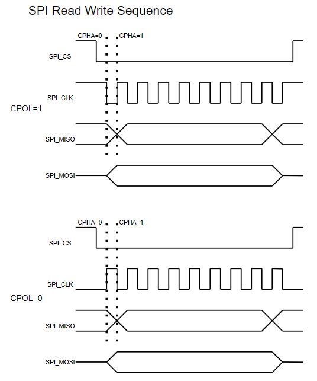
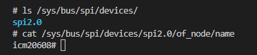
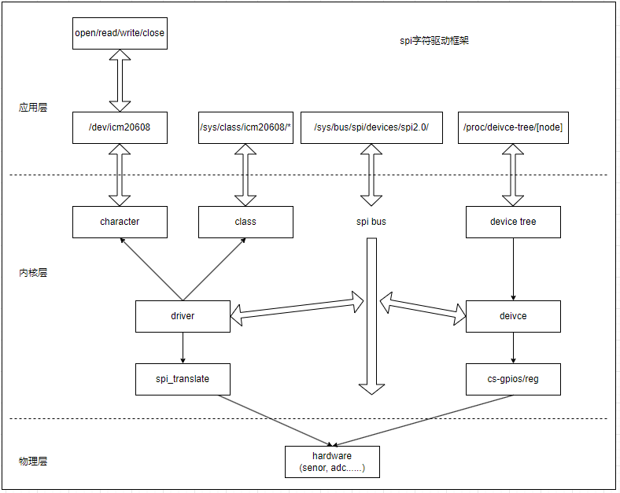
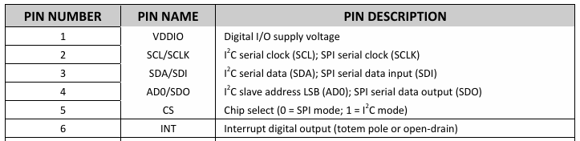
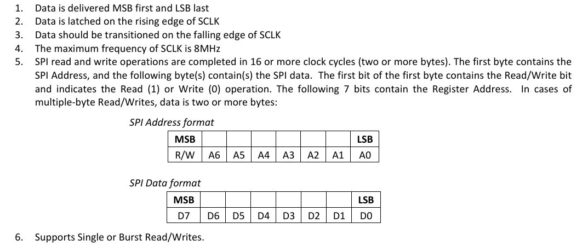
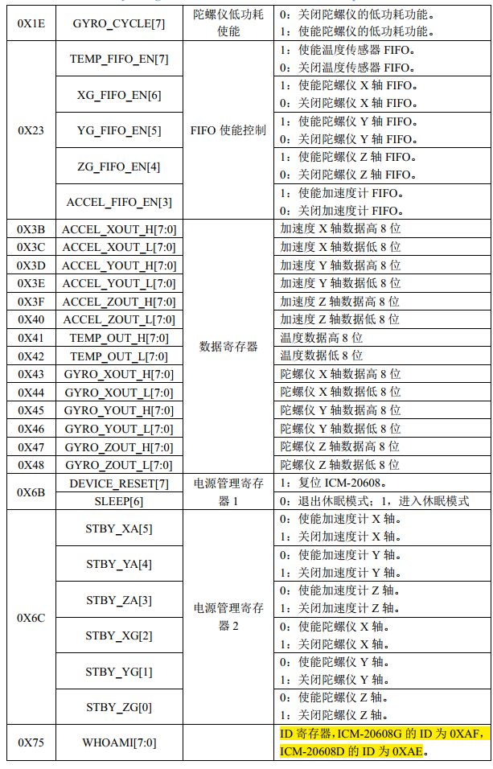

# spi设备和驱动管理框架

SPI是一种高速，高效率的串行接口技术，通常由一个主模块和一个或多个从模块构成。主要用于芯片和芯片，芯片和器件之间的数据传输通讯。SPI设计上为主从结构，在工作时通过主机提供时钟信号，发送数据的同时从接收引脚上读取数据，同时实现数据接收和发送功能，因此为全双工模式。SPI设计上没有类似I2C的地址来区分从机设备，对于多从机的通讯，主要依赖CS引脚来选中芯片工作。当SPI总线上有多个芯片使能，写入不影响，但多从机读取时会发生总线竞争，有可能导致接收数据异常。当管理多个器件时，设计上需要每个芯片拥有独立的片选控制CS引脚。

- 片选CS，芯片使能控制脚，低电平有效居多，当CS为高时芯片不工作，可通过多个CS脚，控制芯片的开关从而实现SPI访问多个外部芯片
- 时钟CLK，时钟引脚，由主机发出，为主从机通讯提供同步时钟
- 主机输出接口(MOSI)，主机数据输出脚，配合Clock同步发出数据，从机接收
- 主机输入接口(MISO)，主机数据输入脚，根据Clock接收数据，从机发送

按照设备驱动模型，由总线，设备，驱动三部分构成，分别对应SPI总线，SPI器件设备树实现，SPI器件驱动，本节也按照这个顺序说明，目录如下所示。

- [spi总线模型和内核加载](#hw_driver_module)
- [spi总线设备树和驱动实现](#dts_bus_driver)
- [spi器件驱动实现](#spi_chip_driver)
  - [spi器件驱动接口](#interface)
  - [spi器件分析](#spi_device)
  - [spi设备树实现和解析](#chip_dts_parse)
  - [spi器件驱动代码](#chip_driver_code)
  - [spi器件驱动应用代码](#chip_driver_app)
- [spi驱动代码](#notes)
- [下一章节](#next_chapter)

另外，本节中配套的spi器件驱动代码详见：[spi icm20608](./file/ch03-08/kernel_spi_icm.c)

## hw_driver_module

SPI的通讯作为全双工的通讯协议，支持的时序如下所示。



可以看到，对于SPI中最重要的两个参数是CPOL和CPHA，这两个参数的含义如下所示。

- CPOL表示空闲状态下时钟CLOCK的电平，0表示低电平，1表示高电平
- CPHA则表示接收端数据采样的边沿，0表示第一个边沿，1表示第二个边沿

当CPOL和CPHA确认后，即可确定下单次SPI通讯的时序。理解了这些，SPI的驱动就比较简单，包含初始化和读写接口。 其中初始化部分主要包含如下信息。

- 工作模式，主机或者从机，支持一主多从的工作方式
- 工作使用线缆数量，支持单线模式或者双线模式，双线模式就是上面独立的发送和接口引脚，全双工通讯，单线模式又包含两种。只发送/只接收的单向模式或者单线双向模式，此时为半双工的收发通讯
- 数据位宽，支持8bit和16bit，对于SPI来说，8bit和16bit都是常用的，但是16bit可以提高效率，同时支持双线模式。对于SPI的数据发送，通常高位先发送，低位后发送，不过也支持通过硬件配置，实现低位在前发送，需要和外部器件保持一致
- CPOL和CPHA配置，需要与器件的要求一致。
- NSS功能用于控制CS片选引脚输出和输入功能，设置为Soft可以作为普通引脚控制，也可以通过SSI位控制，硬件模式则作为主SPI时，在发送广播数据时会强制拉低NSS引脚。
- 另外是与数据通讯相关的参数配置，包含波特率，首位先发送，带CRC校验等，这些都是与具体器件有关，需要根据实际情况进行配置。

一个典型的spi硬件拓扑如下所示。



可以看到spi硬件框架和i2c基本一致，spi模块由platform总线管理，构成SPI总线，然后通过SPI总线管理外部设备，其框架如下所示。



对于内部SPI设备，初始化内容如下所示。

1. 配置模块对应的I/O引脚
2. SPI工作时钟配置
3. SPI工作模式配置
4. SPI工作中断配置

对于外部器件实现功能则是。

1. 初始化器件，配置寄存器(如果需要)
2. 实现读，写外部器件的接口。

基于此，整个驱动其实由两块独立的实现，SPI总线驱动和SPI器件驱动，其中SPI属于内部模块，基于platform总线匹配加载，SPI器件属于挂载在spi总线的设备，基于spi总线匹配加载驱动。spi总线注册成功后，可在对应总线下查看设备。

```shell
# 查看spi总线下设备
ls /sys/bus/spi/devices

# 查看具体设备名称
cat /sys/bus/spi/devices/spi2.0/of_node/name
```

显示如下所示。


## dts_bus_driver

对于SPI模块，是挂载在/soc/aips1@2000000/spda-bus@2000000/下的节点ecspi3@2010000，其设备树如下所示。

```c
soc: soc {
    //......
    
    aips1: bus@2000000 {
        //.....

        spba-bus@2000000 {

            //spi接口设备树
            ecspi3: spi@2010000 {   
                #address-cells = <1>;                                   //定义"子节点"寄存器个数，占用1个
                #size-cells = <0>;                                      //定义"子节点"寄存器长度占用，表示不存在
                compatible = "fsl,imx6ul-ecspi", "fsl,imx51-ecspi";     //compatible: 标签，用于platform驱动匹配
                reg = <0x02010000 0x4000>;                              //SPI配置寄存器列表
                interrupts = <GIC_SPI 33 IRQ_TYPE_LEVEL_HIGH>;          //定义ecspi对应的中断控制器，中断线号和中断类型
                clocks = <&clks IMX6UL_CLK_ECSPI3>,                     //模块的时钟(主要用于模块电源管理)
                        <&clks IMX6UL_CLK_ECSPI3>;
                clock-names = "ipg", "per";                             //时钟的别名，驱动中管理访问
                dmas = <&sdma 7 7 1>, <&sdma 8 7 2>;                    //定义spi对应的dma配置
                dma-names = "rx", "tx";                                 //spi-dma的别名，驱动中管理访问
                status = "disabled";                                    //模块状态，关闭
            };
        };
    };
};

&ecspi3 {
    fsl,spi-num-chipselects = <1>;                                  //自定义类型，用于定义spi已选择的器件数量
    pinctrl-0 = <&pinctrl_ecspi3>;                                  //定义对应引脚的pinctrl配置
    pinctrl-names = "default";                                      //定义引脚配置的别名，驱动访问时需要
    cs-gpios = <&gpio1 20 GPIO_ACTIVE_LOW>,
            <&gpio1 19 GPIO_ACTIVE_LOW>;                            //cs-gpios片选引脚，第一个对应后面reg=<0>，依次递增
    status = "okay";                                                //模块状态，关闭

    spidev0: icm20608@0 {
        compatible = "rmk,icm20608";                                //compatible: 标签，用于spi总线匹配
        spi-max-frequency = <8000000>;                              //定义spi的最大工作时钟
        reg = <0>;                                                  //spi设备地址，和cs-gpios第一个I/O匹配
    };

    spidev1: ad7791@1  {
        compatible = "rmk,ad7791";                                  //compatible: 标签，用于spi总线匹配
        reg = <1>;                                                  //spi设备地址，和cs-gpios第二个I/O匹配
    };
};
```

对于设备树的解析和总线的创建参考代码路径如下。

1. spi设备树解析: driver/spi/spi.c
2. spi总线驱动: drivers/spi/spi-imx.c。

大致解析SPI总线驱动文件，主要由以下几部分构成。

```c
//1. 设备树解析和配置参数获取
if (!device_property_read_u32(&pdev->dev, "num-cs", &val))
    controller->num_chipselect = val;
else
    controller->num_chipselect = 3;
//中断请求配置
ret = devm_request_irq(&pdev->dev, irq, spi_imx_isr, 0,
                dev_name(&pdev->dev), spi_imx);
//获取和使能时钟
spi_imx->clk_ipg = devm_clk_get(&pdev->dev, "ipg");
spi_imx->clk_per = devm_clk_get(&pdev->dev, "per");
ret = clk_prepare_enable(spi_imx->clk_per);
ret = clk_prepare_enable(spi_imx->clk_ipg);

//2. 注册bus总线控制器
spi_imx->controller->transfer_one = spi_imx_transfer_one;
spi_imx->controller->setup = spi_imx_setup;
spi_imx->controller->cleanup = spi_imx_cleanup;
spi_imx->controller->prepare_message = spi_imx_prepare_message;
spi_imx->controller->unprepare_message = spi_imx_unprepare_message;
spi_imx->controller->slave_abort = spi_imx_slave_abort;
spi_imx->controller->mode_bits = SPI_CPOL | SPI_CPHA | SPI_CS_HIGH | SPI_NO_CS;
controller->dev.of_node = pdev->dev.of_node;
ret = spi_register_controller(controller);
```

通过spi的总线驱动，就在系统中创建了对应的spi总线控制器，这样我们就可以进一步基于spi bus实现外部器件驱动，这就是我们进一步配置的过程。spi总线代码一般由芯片厂商开发，用于适配芯片对应的SPI模块，因此对于NXP，TI，瑞芯微或全志，都有一定差异，不一定通用，因此记住概念，有大致了解即可，关键部分还是SPI外部器件驱动的实现。

注意: **spi设备树中的cs-gpios对应硬件控制的cs片选引脚，后续spi设备编号与在cs-gpios中指定的引脚顺序有对应关系。**

## spi_chip_driver

spi外部器件驱动主要实现基于spi总线提供的内核接口，管理应用层和外部器件的接口。

### interface

关于SPI总线涉及的内核接口，如下所示。

```c
//SPI总线上匹配设备，加载驱动的接口
#define spi_register_driver(driver) \
    __spi_register_driver(THIS_MODULE, driver)
int __spi_register_driver(struct module *owner, struct spi_driver *sdrv);

//从spi设备上移除已经注册的驱动
void spi_unregister_driver(struct spi_driver *driver);

//在spi设备上保存设备私有数据指针，用于后续访问
void spi_set_drvdata(struct spi_device *spi, void *data);

//获取从spi接口读取的数据
void *spi_get_drvdata(struct spi_device *spi);

//配置spi设备工作模式
int spi_setup(struct spi_device *spi)

//初始化spi消息，用于后续添加spi数据包
static inline void spi_message_init(struct spi_message *m)

//在spi消息m中添加传输数据包t
static inline void spi_message_add_tail(struct spi_transfer *t, struct spi_message *m)

//同步spi数据传输，进行数据收发
int spi_sync(struct spi_device *spi, struct spi_message *message)

//同步直接spi数据传输接口，内部实现消息init
int spi_sync_transfer(struct spi_device *spi, struct spi_transfer *xfers, unsigned int num_xfers)

//封装的spi读写接口，先写后读
int spi_write_then_read(struct spi_device *spi, const void *txbuf, unsigned n_tx, void *rxbuf, unsigned n_rx)
```

其中关键的结构如下所示。

```c
//spi设备管理
struct spi_device {
    struct device        dev;               //驱动模型中对应的设备
    struct spi_controller    *controller;   //当前spi器件对应的总线设备控制器
    struct spi_controller    *master;       //总线设备控制器备份，用于兼容
    u32            max_speed_hz;            //器件支持最大时钟频率，设备树中定义，每次传输都可以修改
    u8            chip_select;              //芯片选择，区分芯片处理，对应设备树中的reg值
    u8            bits_per_word;            //芯片支持的传输1个字的bit数，可以是1~32bits
    bool            rt;                     //是否设置总线传输为实时优先级
    #define SPI_NO_TX    BIT(31)            /* No transmit wire */
    #define SPI_NO_RX    BIT(30)            /* No receive wire */

    #define SPI_MODE_KERNEL_MASK    (~(BIT(30) - 1))
    u32            mode;                    //spi工作模式，包含SPI_MODE_0/SPI_MODE_1等
    int            irq;                     //传递给request_irq以接收来自该器件的中断。
    void            *controller_state;      //控制器的运行状态
    void            *controller_data;       //特定于主板的控制器定义，如FIFO初始化参数
    char            modalias[SPI_NAME_SIZE];//与此设备一起使用的驱动程序的名称
    const char        *driver_override;     //如果将驱动程序的名称写入此属性，则设备将绑定到命名的驱动程序，并且仅绑定到命名的驱动程序。
    struct gpio_desc    *cs_gpiod;          //spi设备对应的cs片选引脚结构
    struct spi_delay    word_delay;         //连续传输之间的延时
    /* CS delays */
    struct spi_delay    cs_setup;           //在CS被断言后由控制器引入的延迟
    struct spi_delay    cs_hold;            //控制器在CS解除断言之前引入的延迟
    struct spi_delay    cs_inactive;        //控制器在CS解除断言之后引入的延迟

    /* The statistics */
    struct spi_statistics __percpu    *pcpu_statistics; //spi_device的统计信息
};

//spi mode
#define  SPI_CPHA    _BITUL(0)  /* clock phase */
#define  SPI_CPOL    _BITUL(1)  /* clock polarity */

#define  SPI_MODE_0    (0|0)    /* (original MicroWire) */
#define  SPI_MODE_1    (0|SPI_CPHA)
#define  SPI_MODE_2    (SPI_CPOL|0)
#define  SPI_MODE_3    (SPI_CPOL|SPI_CPHA)
#define  SPI_MODE_X_MASK    (SPI_CPOL|SPI_CPHA)

#define  SPI_CS_HIGH    _BITUL(2)   /* chipselect active high? */
#define  SPI_LSB_FIRST  _BITUL(3)   /* per-word bits-on-wire */
#define  SPI_3WIRE      _BITUL(4)   /* SI/SO signals shared */
#define  SPI_LOOP       _BITUL(5)      /* loopback mode */
#define  SPI_NO_CS      _BITUL(6)     /* 1 dev/bus, no chipselect */
#define  SPI_READY      _BITUL(7)     /* slave pulls low to pause */
#define  SPI_TX_DUAL    _BITUL(8)   /* transmit with 2 wires */
#define  SPI_TX_QUAD    _BITUL(9)   /* transmit with 4 wires */
#define  SPI_RX_DUAL    _BITUL(10)  /* receive with 2 wires */
#define  SPI_RX_QUAD    _BITUL(11)  /* receive with 4 wires */
#define  SPI_CS_WORD    _BITUL(12)  /* toggle cs after each word */
#define  SPI_TX_OCTAL    _BITUL(13)  /* transmit with 8 wires */
#define  SPI_RX_OCTAL    _BITUL(14)  /* receive with 8 wires */
#define  SPI_3WIRE_HIZ   _BITUL(15)  /* high impedance turnaround */
#define  SPI_RX_CPHA_FLIP  _BITUL(16)  /* flip CPHA on Rx only xfer */

// 对于spi设备，大部分选项在驱动解析设备树时进行配置，需要用户配置的选项时每字的bit数目
//1.初始化spi接口
spi = (struct spi_device *)chip->private_data;
spi->mode = SPI_MODE_0;
spi_setup(spi);
```

### chip_dts_parse

icm20608的硬件连接如下所示。

```c
//1. spi器件设备树
&ecspi3 {
    //....

    spidev0:icm20608@0 {
        compatible = "rmk,icm20608";            //compatible: 标签，用于spi总线匹配
        spi-max-frequency = <8000000>;          //定义spi的最大工作时钟(参考手册)
        reg = <0>;                              //spi设备地址，和cs-gpios第一个I/O匹配

        smplrt_div      = /bits/ 8 <0x00>;      //spi器件寄存器配置，内部解析设备树进行处理
        gyro_config     = /bits/ 8 <0x18>;
        accel_config    = /bits/ 8 <0x18>;
        config          = /bits/ 8 <0x04>;
        accel_config2   = /bits/ 8 <0x04>;
        pwr_mgmt_2      = /bits/ 8 <0x00>;
        lp_mode_cfg     = /bits/ 8 <0x00>;
        fifo_en         = /bits/ 8 <0x00>;
    };
};

//2. spi设备树解析
static int icm20608_parse_dt(struct spi_icm_data *chip)
{
    struct spi_device *spi;
    struct device_node *np;
    int ret;

    spi = (struct spi_device *)chip->private_data;
    np = spi->dev.of_node;

    // 解析获取smplrt_div属性值
    ret = of_property_read_u8(np, "smplrt_div", &chip->reg_config.smplrt_div);
    if (ret) {
        dev_warn(&spi->dev, "invalid smplrt_div attribute");
        chip->reg_config.smplrt_div = 0x00;
    }

    //...

    // 解析获取fifo_en属性值
    ret = of_property_read_u8(np, "fifo_en", &chip->reg_config.fifo_en);
    if (ret) {
        dev_warn(&spi->dev, "invalid fifo_en attribute");
        chip->reg_config.fifo_en = 0x00;
    }

    return ret;
}
```

### spi_device

了解了内核中实现的SPI总线以及操作SPI器件的接口，就可以实践了。如何从器件手册中，提取关键信息，实现SPI器件驱动，就是本小节的重点。对于外部器件，从手册提取的信息，是实现驱动的基础，以icm20608为例，需要了解的信息如下所示。

1. 器件的连接方式，主要涉及硬件的连接(3-wire/4-wire)和软件的引脚配置(设备树，模式)
2. SPI的工作和读写时序，主要涉及SPI的工作模式，工作频率，以及单次读取的bits数目
3. 寄存器地址和寄存器的功能，用于实现的具体芯片功能

这三部分就是需要从设备手册中整理的信息。

- 连接方式



可以看到，器件的SPI方式为4-wire连接。

- 工作模式



可以得到的信息如下。

1. SPI的数据MSB优先发送，
2. SCK上升沿(CPOL=0)，下降沿读取数据(CPHA=1)，对应SPI_MODE_1。
3. 最大时钟频率为8Mhz(在设备树中设定)，SPI的读写操作都是先发地址，再发数据
4. 其中以地址位的bit7(第一位)决定数据是读取还是写入，其中Read为1，Write为0

根据这些信息，可以配置如下信息。

```c
//spi工作模式
//1.初始化spi接口
spi = (struct spi_device *)chip->private_data;
spi->mode = SPI_MODE_0;
spi_setup(spi);

//spi写接口
static int icm20608_write_block(struct spi_device *spi, u8 reg, u8 *buf, u8 len)
{
    int ret = -1;
    unsigned char *txdata;
    struct spi_message m;
    struct spi_transfer *t;

    t = kzalloc(sizeof(struct spi_transfer), GFP_KERNEL);
    if (!t) {
        return -ENOMEM;
    }

    txdata = kzalloc(sizeof(char)*(len+1), GFP_KERNEL);
    if (!txdata) {
        ret = -ENOMEM;
        goto err_mem;
    }
    
    //最高位置0, 表示写入，后续为写入数据
    txdata[0] = reg & ~0x80;
    memcpy(txdata+1, buf, len);

    //控制spi写入
    t->tx_buf = txdata;
    t->len = len+1;
    spi_message_init(&m);
    spi_message_add_tail(t, &m);
    ret = spi_sync(spi, &m);
    if (ret) {
        goto err_spi;
    }

err_spi:
    kfree(txdata);
err_mem:
    kfree(t);
    return ret;
}

//spi读接口
static int icm20608_read_block(struct spi_device *spi, u8 reg, void *buf, int len)
{
    int ret = -1;
    unsigned char *rxdata, *txdata;
    struct spi_message msg;
    struct spi_transfer *transfer;

    transfer = kzalloc(sizeof(struct spi_transfer), GFP_KERNEL);
    if (!transfer) {
        return -ENOMEM;
    }

    txdata = kzalloc(sizeof(char) * (len + 1), GFP_KERNEL);
    if (!rxdata) {
        ret = -ENOMEM;
        goto err_mem2;
    }    

    rxdata = kzalloc(sizeof(char) * (len + 1), GFP_KERNEL);
    if (!rxdata) {
        ret = -ENOMEM;
        goto err_mem1;
    }

    //最高位置1, 表示读取
    txdata[0] = reg | 0x80;
    transfer->tx_buf = txdata;
    transfer->rx_buf = rxdata;
    transfer->len = len+1;

    //控制spi读取
    spi_message_init(&msg);
    spi_message_add_tail(transfer, &msg);
    ret = spi_sync(spi, &msg);
    if (ret) {
        goto err_spi;
    }
    memcpy(buf , rxdata+1, len);  

err_spi:
    kfree(rxdata);
err_mem1:
    kfree(txdata);
err_mem2:    
    kfree(transfer);

    return ret;
}
```

- 寄存器配置



上面就是icm20608的相关寄存器，我们根据寄存器的功能，实现配置即可。

```c
static int spi_hardware_init(struct spi_icm_data *chip)
{
    unsigned char value = 0;
    struct spi_device *spi;
    u8 buf;

    //...
    
    //2.复位spi外设，读取spi信息
    buf = 0x80;
    icm20608_write_block(spi, ICM20_PWR_MGMT_1, &buf, 1);
    mdelay(50);
    buf = 0x01;
    icm20608_write_block(spi, ICM20_PWR_MGMT_1, &buf, 1);
    mdelay(50);

    icm20608_read_block(spi, ICM20_WHO_AM_I, &value, 1);
    dev_info(&spi->dev, "ICM20608 ID = %#X\r\n", value);

    //3.获取设备树中寄存器信息
    icm20608_parse_dt(chip);
    icm20608_write_block(spi, ICM20_SMPLRT_DIV, &chip->reg_config.smplrt_div, 1);       /* 输出速率是内部采样率 */
    //...
    icm20608_write_block(spi, ICM20_FIFO_EN, &chip->reg_config.fifo_en, 1);             /* 关闭FIFO*/
    
    return 0;
}
```

### chip_driver_code

理解了spi加载机制，对于spi器件的驱动实现就比较清晰，流程如下所示。

1. 驱动加载和移除
2. 器件读写接口
3. 器件硬件寄存器配置
4. 应用层注册关联硬件处理接口

具体实现如下所示。

- 驱动加载和移除代码

```c
static const struct of_device_id icm20608_of_match[] = {
    { .compatible = "rmk,icm20608" },                   //标签，与设备树中的compatible匹配
    { /* Sentinel */ }
};

static struct spi_driver icm20608_driver = {
    .probe = icm20608_probe,                            //驱动加载时执行的函数
    .remove = icm20608_remove,                          //驱动移除时执行的函数
    .driver = {
        .owner = THIS_MODULE,
        .name = "icm20608",
        .of_match_table = icm20608_of_match,
    }
};

static int __init spi_icm_module_init(void)
{
    return spi_register_driver(&icm20608_driver);       //匹配spi总线上设备，加载驱动
}

static void __exit spi_icm_module_exit(void)
{
    return spi_unregister_driver(&icm20608_driver);     //移除spi设备已经匹配的驱动
}

module_init(spi_icm_module_init);
module_exit(spi_icm_module_exit);
MODULE_AUTHOR("zc");                                    //模块作者
MODULE_LICENSE("GPL v2");                               //模块许可协议
MODULE_DESCRIPTION("icm20608 driver");                  //模块许描述
MODULE_ALIAS("spi_icm20608_driver");                    //模块别名
```

- 应用层注册关联硬件处理接口

在应用层中创建字符设备，关联读/写接口，应用层通过open/read/close进行器件访问。

```c

static const struct file_operations spi_icm_ops = {
    .owner = THIS_MODULE,
    .open = icm20608_open,          //
    .read = icm20608_read,
    .release = icm20608_release,
};

static int spi_device_create(struct spi_icm_data *chip)
{
    // 参考字符设备的创建方法
}
```

### chip_driver_app

对于应用层读取，实现比较简单，只需要进行open/read/close接口即可，具体如下所示。

```c
#include <stdio.h>
#include <stdlib.h>
#include <fcntl.h>
#include <unistd.h>
#include <signal.h>

#define ICM_DEV_NAME "/dev/icm20608"

volatile sig_atomic_t running = 1;

void handle_sigbus(int signum) {
    if (signum == SIGINT || signum == SIGTERM) {
        running = 0;
    }   
}

int main(int argc, char *argv[])
{
    int fd;
    signed int databuf[7];
    signed int gyro_x_adc, gyro_y_adc, gyro_z_adc;
    signed int accel_x_adc, accel_y_adc, accel_z_adc;
    signed int temp_adc;

    float gyro_x_act, gyro_y_act, gyro_z_act;
    float accel_x_act, accel_y_act, accel_z_act;
    float temp_act;

    int ret = 0;

    // 设置信号处理
    signal(SIGINT, handle_signal);
    signal(SIGTERM, handle_signal);

    // 打开设备文件
    fd = open(ICM_DEV_NAME, O_RDWR);               
    if (fd < 0) {
        printf("can't open file %s\r\n", ICM_DEV_NAME);
        return -1;
    }

    while (running) {

        // 读取spi器件数据
        ret = read(fd, databuf, sizeof(databuf));   
        if (ret >= 0) {
            gyro_x_adc = databuf[0];
            gyro_y_adc = databuf[1];
            gyro_z_adc = databuf[2];
            accel_x_adc = databuf[3];
            accel_y_adc = databuf[4];
            accel_z_adc = databuf[5];
            temp_adc = databuf[6];

            // 计算实际角度，加速度和温度
            gyro_x_act = (float)(gyro_x_adc)  / 16.4;
            gyro_y_act = (float)(gyro_y_adc)  / 16.4;
            gyro_z_act = (float)(gyro_z_adc)  / 16.4;
            accel_x_act = (float)(accel_x_adc) / 2048;
            accel_y_act = (float)(accel_y_adc) / 2048;
            accel_z_act = (float)(accel_z_adc) / 2048;
            temp_act = ((float)(temp_adc) - 25 ) / 326.8 + 25;

            // 打印输出值
            printf("read size:%d\r\n", ret);
            printf("\r\nraw value:\r\n");
            printf("gx = %d, gy = %d, gz = %d\r\n", gyro_x_adc, gyro_y_adc, gyro_z_adc);
            printf("ax = %d, ay = %d, az = %d\r\n", accel_x_adc, accel_y_adc, accel_z_adc);
            printf("temp = %d\r\n", temp_adc);
            printf("convert value:");
            printf("act gx = %.2f'/S, act gy = %.2f'/S, act gz = %.2f'/S\r\n", gyro_x_act, gyro_y_act, gyro_z_act);
            printf("act ax = %.2fg, act ay = %.2fg, act az = %.2fg\r\n", accel_x_act, accel_y_act, accel_z_act);
            printf("act temp = %.2f'C\r\n", temp_act);
        }
        else
        {
            printf("read issue:%d\r\n", ret);
            break;
        }
        sleep(1);
    }

    close(fd);/* 关闭文件 */
    return 0;
}
```

## notes

至此，关于spi的总线驱动spi接口器件icm20608的驱动讲解完成。spi并不是特别复杂的接口，不过连接的器件类型总类繁多。FLash，OLED，3-axis sensor，ADC芯片，库仑计，网络芯片W5500等，这些都是使用SPI接口，不过驱动的实现涉及video显示，网络network，字符设备等。SPI只是物理接口，SPI框架也只是实现驱动到物理器件的访问，对于如何添加到内核，实现应用层的访问，就需要具体问题具体分析，通过对应的驱动，最终实现功能。

本节的驱动代码可参考文件如下所示。

- [icm20608器件驱动](./file/ch03-08/kernel_spi_icm.c)
- [icm20608应用访问程序](./file/ch03-08/test/icm_spi_test.c)

## next_chapter

[返回目录](../README.md)

直接开始下一节说明: [iio子系统驱动框架和ADC模块驱动](./ch03-09.iio_subsystem.md)
