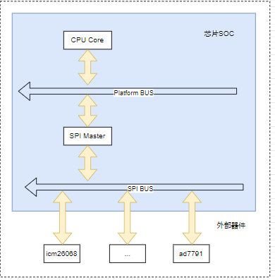

# spi设备和驱动管理框架

SPI是一种高速，高效率的串行接口技术，通常由一个主模块和一个或多个从模块构成。主要用于芯片和芯片，芯片和器件之间的数据传输通讯。SPI设计上为主从结构，在工作时通过主机提供时钟信号，发送数据的同时从接收引脚上读取数据，同时实现数据接收和发送功能，因此为全双工模式。SPI设计上没有类似I2C的地址来区分从机设备，对于多从机的通讯，主要依赖CS引脚来选中芯片工作。当SPI总线上有多个芯片使能，写入不影响，但多从机读取时会发生总线竞争，有可能导致接收数据异常。当管理多个器件时，设计上需要每个芯片拥有独立的片选控制CS引脚。

- 片选CS，芯片使能控制脚，低电平有效居多，当CS为高时芯片不工作，可通过多个CS脚，控制芯片的开关从而实现SPI访问多个外部芯片
- 时钟CLK，时钟引脚，由主机发出，为主从机通讯提供同步时钟
- 主机输出接口(MOSI)，主机数据输出脚，配合Clock同步发出数据，从机接收
- 主机输入接口(MISO)，主机数据输入脚，根据Clock接收数据，从机发送

按照设备驱动模型，由总线，设备，驱动三部分构成，分别对应SPI总线，SPI器件设备树实现，SPI器件驱动，本节也按照这个顺序说明，目录如下所示。

- [spi总线模型和内核加载](#hw_driver_module)
- [spi总线设备树和驱动实现](#dts_bus_driver)
- [spi器件驱动实现](#spi_chip_driver)
  - [spi器件驱动接口](#interface)
  - [spi设备树解析](#chip_dts_parse)
  - [spi器件驱动代码](#chip_driver_code)
  - [spi器件驱动应用代码](#chip_driver_app)
- [spi驱动代码](#notes)
- [下一章节](#next_chapter)

## hw_driver_module

一个典型的spi硬件拓扑如下所示。


可以看到spi硬件框架和i2c基本一致，spi模块由platform总线管理，构成SPI总线，然后通过SPI总线管理外部设备。对于内部SPI设备，初始化内容如下所示。

1. 配置模块对应的I/O引脚
2. SPI工作时钟配置
3. SPI工作模式配置
4. SPI工作中断配置

对于外部器件实现功能则是。

1. 初始化器件，配置寄存器(如果需要)
2. 实现读，写外部器件的接口。

基于此，整个驱动其实由两块独立的实现，SPI总线驱动和SPI器件驱动，其中SPI属于内部模块，基于platform总线匹配加载，SPI器件属于挂载在spi总线的设备，基于spi总线匹配加载驱动。spi总线注册成功后，可在对应总线下查看设备。

```shell
# 查看spi总线下设备
ls /sys/bus/spi/devices

# 查看具体设备名称
cat /sys/bus/spi/devices/spi2.0/of_node/name
```

显示如下所示。



## dts_bus_driver

对于SPI模块，是挂载在/soc/aips1@2000000/spda-bus@2000000/下的节点ecspi3@2010000，其设备树如下所示。

```c
soc: soc {
    //......
    
    aips1: bus@2000000 {
        //.....

        spba-bus@2000000 {

            //spi接口设备树
            ecspi3: spi@2010000 {   
                #address-cells = <1>;                                   //定义"子节点"寄存器个数，占用1个
                #size-cells = <0>;                                      //定义"子节点"寄存器长度占用，表示不存在
                compatible = "fsl,imx6ul-ecspi", "fsl,imx51-ecspi";     //compatible: 标签，用于platform驱动匹配
                reg = <0x02010000 0x4000>;                              //SPI配置寄存器列表
                interrupts = <GIC_SPI 33 IRQ_TYPE_LEVEL_HIGH>;          //定义ecspi对应的中断控制器，中断线号和中断类型
                clocks = <&clks IMX6UL_CLK_ECSPI3>,                     //模块的时钟(主要用于模块电源管理)
                        <&clks IMX6UL_CLK_ECSPI3>;
                clock-names = "ipg", "per";                             //时钟的别名，驱动中管理访问
                dmas = <&sdma 7 7 1>, <&sdma 8 7 2>;                    //定义spi对应的dma配置
                dma-names = "rx", "tx";                                 //spi-dma的别名，驱动中管理访问
                status = "disabled";                                    //模块状态，关闭
            };
        };
    };
};

&ecspi3 {
    fsl,spi-num-chipselects = <1>;                                  //自定义类型，用于定义spi已选择的器件数量
    pinctrl-0 = <&pinctrl_ecspi3>;                                  //定义对应引脚的pinctrl配置
    pinctrl-names = "default";                                      //定义引脚配置的别名，驱动访问时需要
    cs-gpios = <&gpio1 20 GPIO_ACTIVE_LOW>,
            <&gpio1 19 GPIO_ACTIVE_LOW>;                             //cs-gpios片选引脚，第一个对应后面reg=<0>，依次递增
    status = "okay";                                                //模块状态，关闭

    spidev0: icm20608@0 {
        compatible = "rmk,icm20608";                                //compatible: 标签，用于spi总线匹配
        spi-max-frequency = <8000000>;                              //定义spi的最大工作时钟
        reg = <0>;                                                  //spi设备地址，和cs-gpios第一个I/O匹配
    };

    spidev1: ad7791@1  {
        compatible = "rmk,ad7791";                                  //compatible: 标签，用于spi总线匹配
        reg = <1>;                                                  //spi设备地址，和cs-gpios第二个I/O匹配
    };
};
```

对于设备树的解析和总线的创建参考代码路径如下。

1. spi设备树解析: driver/spi/spi.c
2. spi总线驱动: drivers/spi/spi-imx.c。

大致解析SPI总线驱动文件，主要由以下几部分构成。

```c
//1. 设备树解析和配置参数获取
if (!device_property_read_u32(&pdev->dev, "num-cs", &val))
    controller->num_chipselect = val;
else
    controller->num_chipselect = 3;
//中断请求配置
ret = devm_request_irq(&pdev->dev, irq, spi_imx_isr, 0,
                dev_name(&pdev->dev), spi_imx);
//获取和使能时钟
spi_imx->clk_ipg = devm_clk_get(&pdev->dev, "ipg");
spi_imx->clk_per = devm_clk_get(&pdev->dev, "per");
ret = clk_prepare_enable(spi_imx->clk_per);
ret = clk_prepare_enable(spi_imx->clk_ipg);

//2. 注册bus总线控制器
spi_imx->controller->transfer_one = spi_imx_transfer_one;
spi_imx->controller->setup = spi_imx_setup;
spi_imx->controller->cleanup = spi_imx_cleanup;
spi_imx->controller->prepare_message = spi_imx_prepare_message;
spi_imx->controller->unprepare_message = spi_imx_unprepare_message;
spi_imx->controller->slave_abort = spi_imx_slave_abort;
spi_imx->controller->mode_bits = SPI_CPOL | SPI_CPHA | SPI_CS_HIGH | SPI_NO_CS;
controller->dev.of_node = pdev->dev.of_node;
ret = spi_register_controller(controller);
```

通过spi的总线驱动，就在系统中创建了对应的spi总线控制器，这样我们就可以进一步基于spi bus实现外部器件驱动，这就是我们进一步配置的过程。

## spi_chip_driver

spi外部器件驱动主要实现基于spi总线提供的内核接口，管理应用层和外部器件的接口。

### interface

关于SPI总线提供的内核接口，主要如下所示。

```c
//SPI总线上匹配设备，加载驱动的接口
#define spi_register_driver(driver) \
    __spi_register_driver(THIS_MODULE, driver)
int __spi_register_driver(struct module *owner, struct spi_driver *sdrv);

//从spi设备上移除已经注册的驱动
void spi_unregister_driver(struct spi_driver *driver);

//在spi设备上保存设备私有数据指针，用于后续访问
void spi_set_drvdata(struct spi_device *spi, void *data);

//获取从spi接口读取的数据
void *spi_get_drvdata(struct spi_device *spi);

//配置spi设备工作模式
int spi_setup(struct spi_device *spi)

//初始化spi消息，用于后续添加spi数据包
static inline void spi_message_init(struct spi_message *m)

//在spi消息m中添加传输数据包t
static inline void spi_message_add_tail(struct spi_transfer *t, struct spi_message *m)

//同步spi数据传输，进行数据收发
int spi_sync(struct spi_device *spi, struct spi_message *message)

//同步直接spi数据传输接口，内部实现消息init
int spi_sync_transfer(struct spi_device *spi, struct spi_transfer *xfers, unsigned int num_xfers)

//封装的spi读写接口，先写后读
int spi_write_then_read(struct spi_device *spi, const void *txbuf, unsigned n_tx, void *rxbuf, unsigned n_rx)
```

其中关键的结构如下所示。

```c
//spi设备管理
struct spi_device {
    struct device        dev;               //驱动模型中对应的设备
    struct spi_controller    *controller;   //当前spi器件对应的总线设备控制器
    struct spi_controller    *master;       //总线设备控制器备份，用于兼容
    u32            max_speed_hz;            //器件支持最大时钟频率，设备树中定义，可以随时每次传输都修改
    u8            chip_select;              //芯片选择，区分芯片处理，对应设备树中的reg值
    u8            bits_per_word;            //芯片支持的传输1个字的bit数，可以是1~32bits
    bool            rt;                     //是否设置总线传输为实时优先级
    #define SPI_NO_TX    BIT(31)        /* No transmit wire */
    #define SPI_NO_RX    BIT(30)        /* No receive wire */
    /*
        * All bits defined above should be covered by SPI_MODE_KERNEL_MASK.
        * The SPI_MODE_KERNEL_MASK has the SPI_MODE_USER_MASK counterpart,
        * which is defined in 'include/uapi/linux/spi/spi.h'.
        * The bits defined here are from bit 31 downwards, while in
        * SPI_MODE_USER_MASK are from 0 upwards.
        * These bits must not overlap. A static assert check should make sure of that.
        * If adding extra bits, make sure to decrease the bit index below as well.
        */
    #define SPI_MODE_KERNEL_MASK    (~(BIT(30) - 1))
    u32            mode;                    //spi模式定义了数据是如何输入和输出的
    int            irq;                     //传递给request_irq（）以接收来自该设备的中断的数字。
    void            *controller_state;      //控制器的运行状态
    void            *controller_data;       //特定于主板的控制器定义，如FIFO初始化参数
    char            modalias[SPI_NAME_SIZE];    //与此设备一起使用的驱动程序的名称
    const char        *driver_override;     //如果将驱动程序的名称写入此属性，则设备将绑定到命名的驱动程序，并且仅绑定到命名的驱动程序。
    struct gpio_desc    *cs_gpiod;          //spi设备对应的cs片选引脚结构
    struct spi_delay    word_delay;         //连续传输之间的延时
    /* CS delays */
    struct spi_delay    cs_setup;           //在CS被断言后由控制器引入的延迟
    struct spi_delay    cs_hold;            //控制器在CS解除断言之前引入的延迟
    struct spi_delay    cs_inactive;        //控制器在CS解除断言之后引入的延迟

    /* The statistics */
    struct spi_statistics __percpu    *pcpu_statistics; //spi_device的统计信息
};

// 对于spi设备，大部分选项在驱动解析设备树时进行配置，需要用户配置的选项时每字的bit数目
//1.初始化spi接口
spi = (struct spi_device *)chip->private_data;
spi->mode = SPI_MODE_0;
spi_setup(spi);
```

### chip_dts_parse

spi外部器件设备树实现如下所示。

```c
//1. spi器件设备树
&ecspi3 {
    //....

    spidev0:icm20608@0 {
        compatible = "rmk,icm20608";            //compatible: 标签，用于spi总线匹配
        spi-max-frequency = <8000000>;          //定义spi的最大工作时钟
        reg = <0>;                              //spi设备地址，和cs-gpios第一个I/O匹配

        smplrt_div      = /bits/ 8 <0x00>;      //spi器件寄存器配置，内部解析设备树进行处理
        gyro_config     = /bits/ 8 <0x18>;
        accel_config    = /bits/ 8 <0x18>;
        config          = /bits/ 8 <0x04>;
        accel_config2   = /bits/ 8 <0x04>;
        pwr_mgmt_2      = /bits/ 8 <0x00>;
        lp_mode_cfg     = /bits/ 8 <0x00>;
        fifo_en         = /bits/ 8 <0x00>;
    };
};

//2. spi设备树解析
static int icm20608_parse_dt(struct spi_icm_data *chip)
{
    struct spi_device *spi;
    struct device_node *np;
    int ret;

    spi = (struct spi_device *)chip->private_data;
    np = spi->dev.of_node;

    // 解析获取smplrt_div属性值
    ret = of_property_read_u8(np, "smplrt_div", &chip->reg_config.smplrt_div);
    if (ret) {
        dev_warn(&spi->dev, "invalid smplrt_div attribute");
        chip->reg_config.smplrt_div = 0x00;
    }
    
    // 解析获取gyro_config属性值
    ret = of_property_read_u8(np, "gyro_config", &chip->reg_config.gyro_config);
    if (ret) {
        dev_warn(&spi->dev, "invalid gyro_config attribute");
        chip->reg_config.gyro_config = 0x18;
    }

    // 解析获取accel_config属性值
    ret = of_property_read_u8(np, "accel_config", &chip->reg_config.accel_config);
    if (ret) {
        dev_warn(&spi->dev, "invalid accel_config attribute");
        chip->reg_config.accel_config = 0x18;
    }

    // 解析获取config属性值
    ret = of_property_read_u8(np, "config", &chip->reg_config.config);
    if (ret) {
        dev_warn(&spi->dev, "invalid config attribute");
        chip->reg_config.config = 0x04;
    }

    // 解析获取accel_config2属性值
    ret = of_property_read_u8(np, "accel_config2", &chip->reg_config.accel_config2);
    if (ret) {
        dev_warn(&spi->dev, "invalid accel_config2 attribute");
        chip->reg_config.accel_config2 = 0x04;
    }

    // 解析获取pwr_mgmt_2属性值
    ret = of_property_read_u8(np, "pwr_mgmt_2", &chip->reg_config.pwr_mgmt_2);
    if (ret) {
        dev_warn(&spi->dev, "invalid pwr_mgmt_2 attribute");
        chip->reg_config.pwr_mgmt_2 = 0x00;
    }

    // 解析获取lp_mode_cfg属性值
    ret = of_property_read_u8(np, "lp_mode_cfg", &chip->reg_config.lp_mode_cfg);
    if (ret) {
        dev_warn(&spi->dev, "invalid lp_mode_cfg attribute");
        chip->reg_config.lp_mode_cfg = 0x00;
    }

    // 解析获取fifo_en属性值
    ret = of_property_read_u8(np, "fifo_en", &chip->reg_config.fifo_en);
    if (ret) {
        dev_warn(&spi->dev, "invalid fifo_en attribute");
        chip->reg_config.fifo_en = 0x00;
    }

    return ret;
}
```

### chip_driver_code

理解了spi加载机制，对于spi器件的驱动实现就比较清晰，流程如下所示。

1. 驱动加载和移除
2. 器件读写接口
3. 器件硬件寄存器配置
4. 应用层注册关联硬件处理接口

具体实现如下所示。

- 驱动加载和移除代码

```c
static const struct of_device_id icm20608_of_match[] = {
    { .compatible = "rmk,icm20608" },                   //标签，与设备树中的compatible匹配
    { /* Sentinel */ }
};

static struct spi_driver icm20608_driver = {
    .probe = icm20608_probe,                            //驱动加载时执行的函数
    .remove = icm20608_remove,                          //驱动移除时执行的函数
    .driver = {
        .owner = THIS_MODULE,
        .name = "icm20608",
        .of_match_table = icm20608_of_match,
    }
};

static int __init spi_icm_module_init(void)
{
    return spi_register_driver(&icm20608_driver);       //匹配spi总线上设备，加载驱动
}

static void __exit spi_icm_module_exit(void)
{
    return spi_unregister_driver(&icm20608_driver);     //移除spi设备已经匹配的驱动
}

module_init(spi_icm_module_init);
module_exit(spi_icm_module_exit);
MODULE_AUTHOR("zc");                    //模块作者
MODULE_LICENSE("GPL v2");               //模块许可协议
MODULE_DESCRIPTION("icm20608 driver");  //模块许描述
MODULE_ALIAS("spi_icm20608_driver");    //模块别名
```

- 器件读写接口

```c
//spi读接口
static int icm20608_read_block(struct spi_device *spi, u8 reg, void *buf, int len)
{
    int ret = -1;
    unsigned char *rxdata, *txdata;
    struct spi_message msg;
    struct spi_transfer *transfer;

    transfer = kzalloc(sizeof(struct spi_transfer), GFP_KERNEL);
    if (!transfer) {
        return -ENOMEM;
    }

    txdata = kzalloc(sizeof(char) * (len + 1), GFP_KERNEL);
    if (!rxdata) {
        ret = -ENOMEM;
        goto err_mem2;
    }    

    rxdata = kzalloc(sizeof(char) * (len + 1), GFP_KERNEL);
    if (!rxdata) {
        ret = -ENOMEM;
        goto err_mem1;
    }

    //最高位置1, 表示读取
    txdata[0] = reg | 0x80;
    transfer->tx_buf = txdata;
    transfer->rx_buf = rxdata;
    transfer->len = len+1;

    //控制spi读取
    spi_message_init(&msg);
    spi_message_add_tail(transfer, &msg);
    ret = spi_sync(spi, &msg);
    if (ret) {
        goto err_spi;
    }
    memcpy(buf , rxdata+1, len);  

err_spi:
    kfree(rxdata);
err_mem1:
    kfree(txdata);
err_mem2:    
    kfree(transfer);

    return ret;
}

//spi写接口
static int icm20608_write_block(struct spi_device *spi, u8 reg, u8 *buf, u8 len)
{
    int ret = -1;
    unsigned char *txdata;
    struct spi_message m;
    struct spi_transfer *t;

    t = kzalloc(sizeof(struct spi_transfer), GFP_KERNEL);
    if (!t) {
        return -ENOMEM;
    }

    txdata = kzalloc(sizeof(char)*(len+1), GFP_KERNEL);
    if (!txdata) {
        ret = -ENOMEM;
        goto err_mem;
    }
    
    //最高位置0, 表示写入
    txdata[0] = reg & ~0x80;
    memcpy(txdata+1, buf, len);

    //控制spi写入
    t->tx_buf = txdata;
    t->len = len+1;
    spi_message_init(&m);
    spi_message_add_tail(t, &m);
    ret = spi_sync(spi, &m);
    if (ret) {
        goto err_spi;
    }

err_spi:
    kfree(txdata);
err_mem:
    kfree(t);
    return ret;
}
```

- 器件硬件寄存器配置

器件硬件寄存器配置就是通过读写接口，将配置信息写入到外部器件中，使能模块工作。

```c
static int spi_hardware_init(struct spi_icm_data *chip)
{
    unsigned char value = 0;
    struct spi_device *spi;
    u8 buf;

    //1.初始化spi接口
    spi = (struct spi_device *)chip->private_data;
    spi->mode = SPI_MODE_0;
    spi_setup(spi);
    
    //2.复位spi外设，读取spi信息
    buf = 0x80;
    icm20608_write_block(spi, ICM20_PWR_MGMT_1, &buf, 1);
    mdelay(50);
    buf = 0x01;
    icm20608_write_block(spi, ICM20_PWR_MGMT_1, &buf, 1);
    mdelay(50);

    icm20608_read_block(spi, ICM20_WHO_AM_I, &value, 1);
    dev_info(&spi->dev, "ICM20608 ID = %#X\r\n", value);

    //3.获取设备树中寄存器信息
    icm20608_parse_dt(chip);
    icm20608_write_block(spi, ICM20_SMPLRT_DIV, &chip->reg_config.smplrt_div, 1);       /* 输出速率是内部采样率 */
    icm20608_write_block(spi, ICM20_GYRO_CONFIG, &chip->reg_config.gyro_config, 1);     /* 陀螺仪±2000dps量程 */
    icm20608_write_block(spi, ICM20_ACCEL_CONFIG, &chip->reg_config.accel_config, 1);   /* 加速度计±16G量程 */
    icm20608_write_block(spi, ICM20_CONFIG, &chip->reg_config.config, 1);               /* 陀螺仪低通滤波BW=20Hz */
    icm20608_write_block(spi, ICM20_ACCEL_CONFIG2, &chip->reg_config.accel_config2, 1); /* 加速度计低通滤波BW=21.2Hz */
    icm20608_write_block(spi, ICM20_PWR_MGMT_2, &chip->reg_config.pwr_mgmt_2, 1);       /* 打开加速度计和陀螺仪所有轴 */
    icm20608_write_block(spi, ICM20_LP_MODE_CFG, &chip->reg_config.lp_mode_cfg, 10);    /* 关闭低功耗 */
    icm20608_write_block(spi, ICM20_FIFO_EN, &chip->reg_config.fifo_en, 1);             /* 关闭FIFO*/

    dev_info(&spi->dev, "icm20608 reg config list:%d, %d, %d, %d, %d, %d, %d, %d",
            chip->reg_config.smplrt_div,
            chip->reg_config.gyro_config,
            chip->reg_config.accel_config,
            chip->reg_config.config,
            chip->reg_config.accel_config2,
            chip->reg_config.pwr_mgmt_2,
            chip->reg_config.lp_mode_cfg,
            chip->reg_config.fifo_en);

    return 0;
}
```

- 应用层注册关联硬件处理接口

在应用层中创建字符设备，关联读/写接口，应用层通过open/read/close进行器件访问。

```c

static const struct file_operations spi_icm_ops = {
    .owner = THIS_MODULE,
    .open = icm20608_open,          //
    .read = icm20608_read,
    .release = icm20608_release,
};

static int spi_device_create(struct spi_icm_data *chip)
{
    int result;
    int major = DEFAULT_MAJOR;
    int minor = DEFAULT_MINOR;
    struct spi_device *spi = (struct spi_device *)chip->private_data;

    //1.申请设备号
    if (major) {
        chip->dev_id= MKDEV(major, minor);
        result = register_chrdev_region(chip->dev_id, 1, DEVICE_NAME);
    } else {
        result = alloc_chrdev_region(&chip->dev_id, 0, 1, DEVICE_NAME);
        major = MAJOR(chip->dev_id);
        minor = MINOR(chip->dev_id);
    }
    if (result < 0){
        dev_err(&spi->dev, "dev alloc id failed\n");
        goto exit;
    }

    //2.创建字符设备，关联设备号，并添加到内核
    cdev_init(&chip->cdev, &spi_icm_ops);
    chip->cdev.owner = THIS_MODULE;
    result = cdev_add(&chip->cdev, chip->dev_id, 1);
    if (result != 0){
        dev_err(&spi->dev, "cdev add failed\n");
        goto exit_cdev_add;
    }

    //3.创建设备类和设备文件，关联设备号，用于应用层访问
    chip->class = class_create(THIS_MODULE, DEVICE_NAME);
    if (IS_ERR(chip->class)) {
        dev_err(&spi->dev, "class create failed!\n");
        result = PTR_ERR(chip->class);
        goto exit_class_create;
    }
    chip->device = device_create(chip->class, NULL, chip->dev_id, NULL, DEVICE_NAME);
    if (IS_ERR(chip->device)) {
        dev_err(&spi->dev, "device create failed, major:%d, minor:%d\n", major, minor);
        result = PTR_ERR(chip->device);
        goto exit_device_create;
    }

    dev_info(&spi->dev, "dev create ok, major:%d, minor:%d\n", major, minor);
    return 0;

exit_device_create:
    class_destroy(chip->class);
exit_class_create:
    cdev_del(&chip->cdev);
exit_cdev_add:
    unregister_chrdev_region(chip->dev_id, 1);
exit:
    return result;
}
```

### chip_driver_app

对于应用层读取，实现比较简单，只需要进行open/read/close接口即可，具体如下所示。

```c
#include <fcntl.h>
#include <stdio.h>
#include <unistd.h>

#define ICM_DEV_NAME "/dev/icm20608"

/*
 * @description : main主程序
 * @param - argc : argv数组元素个数
 * @param - argv : 具体参数
 * @return : 0 成功;其他 失败
 */
int main(int argc, char *argv[])
{
    int fd;
    signed int databuf[7];
    signed int gyro_x_adc, gyro_y_adc, gyro_z_adc;
    signed int accel_x_adc, accel_y_adc, accel_z_adc;
    signed int temp_adc;

    float gyro_x_act, gyro_y_act, gyro_z_act;
    float accel_x_act, accel_y_act, accel_z_act;
    float temp_act;

    int ret = 0;

    fd = open(ICM_DEV_NAME, O_RDWR);                //开启字符设备
    if (fd < 0) {
        printf("can't open file %s\r\n", ICM_DEV_NAME);
        return -1;
    }

    while (1) {
        ret = read(fd, databuf, sizeof(databuf));   //读取spi器件数据
        if (ret >= 0) {
            gyro_x_adc = databuf[0];
            gyro_y_adc = databuf[1];
            gyro_z_adc = databuf[2];
            accel_x_adc = databuf[3];
            accel_y_adc = databuf[4];
            accel_z_adc = databuf[5];
            temp_adc = databuf[6];

            /* 计算实际值 */
            gyro_x_act = (float)(gyro_x_adc)  / 16.4;
            gyro_y_act = (float)(gyro_y_adc)  / 16.4;
            gyro_z_act = (float)(gyro_z_adc)  / 16.4;
            accel_x_act = (float)(accel_x_adc) / 2048;
            accel_y_act = (float)(accel_y_adc) / 2048;
            accel_z_act = (float)(accel_z_adc) / 2048;
            temp_act = ((float)(temp_adc) - 25 ) / 326.8 + 25;

            printf("read size:%d\r\n", ret);
            printf("\r\nraw value:\r\n");
            printf("gx = %d, gy = %d, gz = %d\r\n", gyro_x_adc, gyro_y_adc, gyro_z_adc);
            printf("ax = %d, ay = %d, az = %d\r\n", accel_x_adc, accel_y_adc, accel_z_adc);
            printf("temp = %d\r\n", temp_adc);
            printf("convert value:");
            printf("act gx = %.2f'/S, act gy = %.2f'/S, act gz = %.2f'/S\r\n", gyro_x_act, gyro_y_act, gyro_z_act);
            printf("act ax = %.2fg, act ay = %.2fg, act az = %.2fg\r\n", accel_x_act, accel_y_act, accel_z_act);
            printf("act temp = %.2f'C\r\n", temp_act);
        }
        sleep(1);
    }

    close(fd);/* 关闭文件 */
    return 0;
}
```

## notes

至此，关于spi的总线驱动和器件驱动讲解完毕，本节的驱动代码可参考文件如下所示。

- [icm20608器件驱动](./file/ch03-08/kernel_spi_icm.c)
- [icm20608应用访问程序](./file/ch03-08/icm_spi_test.c)

## next_chapter

[返回目录](../README.md)

直接开始下一节说明: [iio子系统](./ch03-09.iio_subsystem.md)
