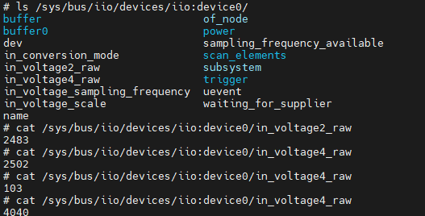
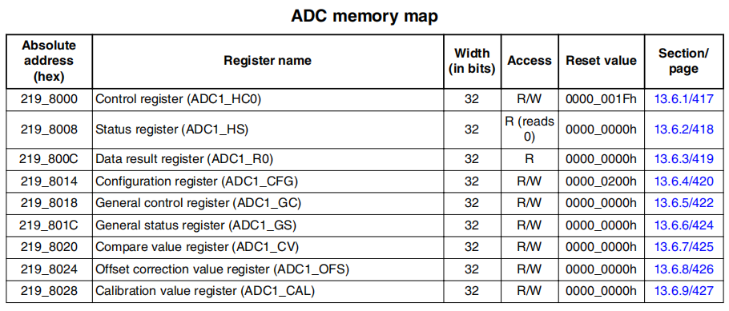
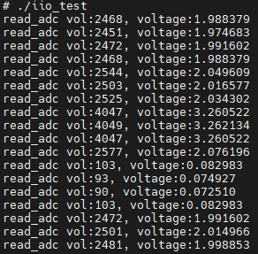

# iio子系统驱动框架和ADC模块驱动

Linux iio(industrial I/O)是用来统一处理各种传感器和ADC/DAC模块的框架。在没有使用IIO驱动框架之前，对于传感器和ADC/DAC模块，如果进行资源访问，需要创建对应的字符设备，实现读写接口，然后通过应用层进行访问。这种访问方式当然可以，不过传感器，ADC/DAC等模块资源的应用层访问就比较分散，在传感器和转换器的种类越来越多的情况下，应用层访问就显得很复杂，而且不利于维护。IIO模块正是提供了一个通用的接口，使得不同类型的传感器和转换器可以方便地集成到Linux系统中，满足现代嵌入式系统中对各种传感器和ADC/DAC模块的统一管理和高效使用的需求。

iio框架和字符设备操作硬件的区别如下所示。


可以看到，iio子系统和字符设备驱动接口都是提供应用层访问硬件的接口，对于底层操作硬件的实现是相同的，如通过i2c，spi，以及内部总线，访问硬件寄存器。不过iio子系统框架可以将类似功能的传感器，ADC/DAC模块通过"/sys/bus/iio/devices/iio:deviceN"目录进行访问，统一管理。另外IIO子系统也定义了一套标准的设备驱动接口，使得传感器和转换器的驱动程序可以基于这些接口进行开发，支持数据的采集、转换和处理，包括模拟信号到数字信号的转换、数据的滤波和校准等功能，这样大大简化了应用层的开发和使用，也是iio子系统的优势所在。

基于字符设备的开发流程，iio子系统也类似，只是将设备文件的创建流程替换为iio子系统的构建流程，具体如下。

1. 设备树中添加硬件节点，驱动程序中匹配执行初始化程序，实现加载和异常的程序
2. 实现对硬件的初始化，以及访问接口，包含读取，写入，控制等接口
3. 关联iio访问驱动接口和硬件访问接口
4. 配置iio注册的结构体，在内核中iio设备

本文以I.MX6ULL的ADC为例，介绍iio子系统的驱动框架和ADC模块驱动。

- [iio设备文件注册接口和配置](#interface)
- [基于iio的adc模块设备树](#adc_devicetree)
- [基于iio的adc驱动实现](#adc_iio_driver)
- [基于iio的adc应用操作](#adc_iio_app)
- [iio作为接口被调用](#iio_consumer)
- [总结说明](#summary)
- [下一章节](#next_chapter)

## interface

对于iio模块，主要函数如下所示。

- devm_iio_device_alloc：用于分配一个新的IIO设备结构体(另外支持不带devm版本，但是需要手动释放)
- devm_iio_device_register：IIO 设备注册到内核中。注册后，设备将可以被用户空间应用程序访问和控制(另外支持不带devm版本，但是需要手动释放)
- devm_iio_triggered_buffer_setup: 设置和初始化IIO设备的触发缓冲区，允许IIO设备在特定事件发生时，自动采集数据并存储在缓冲区中

这些函数的详细描述如下所示，

```c
// 分配一个新的IIO设备结构体
// @dev: 指向设备结构体的指针
// @size: 分配的IIO设备结构体的大小
// @返回值：成功-返回分配的IIO设备结构体的指针；失败-返回NULL
struct iio_dev *devm_iio_device_alloc(struct device *dev, size_t size);

// 注册一个IIO设备到内核中
// @dev: 指向设备结构体的指针
// @iio_dev: 要注册的IIO设备结构体
// @返回值：成功-返回0；失败-返回错误码
int devm_iio_device_register(struct device *dev, struct iio_dev *iio_dev);

// 设置和初始化IIO设备的触发缓冲区
// @dev: 指向设备结构体的指针
// @iio_dev: 要设置的IIO设备结构体
// @h: 中断处理函数
// @thread: 线程处理函数
// @direction: 缓冲区的方向，IIO_BUFFER_DIRECTION_IN表示输入，IIO_BUFFER_DIRECTION_OUT表示输出
// @ops: 缓冲区设置操作的回调函数
// @buffer_attrs: 缓冲区属性的数组
// @返回值：成功-返回0；失败-返回错误码
int devm_iio_triggered_buffer_setup_ext(struct device *dev,
                         struct iio_dev *indio_dev,
                         irqreturn_t (*h)(int irq, void *p),
                         irqreturn_t (*thread)(int irq, void *p),
                         enum iio_buffer_direction direction,
                         const struct iio_buffer_setup_ops *ops,
                         const struct attribute **buffer_attrs);

#define devm_iio_triggered_buffer_setup(dev, indio_dev, h, thread, setup_ops)   \
     devm_iio_triggered_buffer_setup_ext((dev), (indio_dev), (h), (thread),    \
                              IIO_BUFFER_DIRECTION_IN,    \
                              (setup_ops), NULL)
```

主要影响的结构体有struct iio_dev这里进行说明。

```c
// iio设备结构体
struct iio_dev {
    int                modes;                          // 设备支持的模式
    struct device      dev;                            // 设备结构体

    struct iio_buffer  *buffer;                        // 设备的缓冲区
    int                scan_bytes;                     // 每个扫描需要的字节数
    struct mutex       mlock;                          // 互斥锁                

    const unsigned long       *available_scan_masks;   // 设备支持的扫描掩码
    unsigned                  masklength;              // 设备支持的扫描掩码数量
    const unsigned long       *active_scan_mask;       // 设备当前的扫描掩码
    bool                      scan_timestamp;          // 设备是否支持时间戳
    struct iio_trigger        *trig;                   // 设备的触发
    struct iio_poll_func      *pollfunc;               // 设备的轮询函数
    struct iio_poll_func      *pollfunc_event;         // 设备的事件轮询函数

    struct iio_chan_spec const *channels;              // 设备的通道信息
    int                       num_channels;            // 设备的通道数量

    const char                *name;                   // 设备的名称
    const char                *label;                  // 设备的标签
    const struct iio_info     *info;                   // 访问设备的接口信息
    const struct iio_buffer_setup_ops *setup_ops;      // 设备的缓冲区设置操作

    void                      *priv;                   // 设备的私有数据
};
```

对于驱动开发者来说，主要设置参数如下所示。

- info： struct iio_info类型，用于访问设备的接口信息，包括读取，写入，权限控制等接口
- channels： struct iio_chan_spec类型，用于描述设备的通道信息，包括通道类型，通道编号，通道地址等信息
- num_channels： int类型，用于描述设备的通道数量
- iio_buffer_setup_ops: 由devm_iio_triggered_buffer_setup设置，用于设置设备的缓冲区操作

这里进一步讲解一下相应的结构体。

```c
// iio操作接口信息
struct iio_info {
    const struct attribute_group    *event_attrs;           // 指向事件属性组的指针，用于管理设备的事件相关属性
    const struct attribute_group    *attrs;                 // 指向属性组的指针，用于管理设备的通用属性

    int (*read_raw)(struct iio_dev *indio_dev,              // 读取原始数据的回调函数，从指定通道读取原始数据
            struct iio_chan_spec const *chan,
            int *val,
            int *val2,
            long mask);

    int (*read_raw_multi)(struct iio_dev *indio_dev,        // 读取多个原始数据的回调函数，从指定通道读取多个原始数据
            struct iio_chan_spec const *chan,
            int max_len,
            int *vals,
            int *val_len,
            long mask);

    int (*read_avail)(struct iio_dev *indio_dev,            // 读取可用值的回调函数，获取指定通道的可用值列表
              struct iio_chan_spec const *chan,
              const int **vals,
              int *type,
              int *length,
              long mask);

    int (*write_raw)(struct iio_dev *indio_dev,             // 写入原始数据的回调函数，向指定通道写入原始数据
             struct iio_chan_spec const *chan,
             int val,
             int val2,
             long mask);
     
     //......

    int (*debugfs_reg_access)(struct iio_dev *indio_dev,    // 调试文件系统寄存器访问的回调函数，用于调试时访问设备寄存器
                  struct iio_chan_spec const *chan,
                  unsigned reg, unsigned writeval,
                  unsigned *readval);
};

// iio通道信息
struct iio_chan_spec {
     enum iio_chan_type     type;       // iio通道监测的数据类型
     int               channel;         // 期望通道分配的编号
     int               channel2;        // 对于差分通道，第二个通道指定的编号
     unsigned long     address;         // 驱动特殊标识符
     int               scan_index;      // 从缓冲区中读取扫描时给出的索引编号
     struct {
          char     sign;                // 数据的类型，'s'表示signed，'u'表示unsigned
          u8     realbits;              // 数据有效位数
          u8     storagebits;           // 数据总的有效位数，realbits+填充值
          u8     shift;                 // 在输出有效位前需要右移的位数
          u8     repeat;                // 有效位在数据里的重复次数
          enum iio_endian endianness;   // 数据的大端或小端模式
     } scan_type;
     long               info_mask_separate;                 // 独立信息掩码
     long               info_mask_separate_available;       // 独立信息掩码的可用性
     long               info_mask_shared_by_type;           // 按类型共享的信息掩码
     long               info_mask_shared_by_type_available; // 按类型共享的信息掩码的可用性
     long               info_mask_shared_by_dir;            // 按方向共享的信息掩码
     long               info_mask_shared_by_dir_available;  // 按方向共享的信息掩码的可用性
     long               info_mask_shared_by_all;            // 所有通道共享的信息掩码
     long               info_mask_shared_by_all_available;  // 所有通道共享的信息掩码的可用性
     const struct iio_event_spec *event_spec;               // 事件规范
     unsigned int          num_event_specs;                 // 事件规范的数量
     const struct iio_chan_spec_ext_info *ext_info;         // 扩展信息
     const char          *extend_name;                      // 扩展名称
     const char          *datasheet_name;                   // 数据手册名称
     unsigned          modified:1;                          // 是否被修改
     unsigned          indexed:1;                           // 是否被索引
     unsigned          output:1;                            // 是否为输出
     unsigned          differential:1;                      // 是否为差分
};

enum iio_chan_type {
    IIO_VOLTAGE,        // 电压
    IIO_CURRENT,        // 电流
    IIO_POWER,          // 功率
    IIO_ACCEL,          // 加速度
    IIO_ANGL_VEL,       // 角速度
    IIO_MAGN,           // 磁场强度
    IIO_LIGHT,          // 光强度
    IIO_INTENSITY,      // 光照强度
    IIO_PROXIMITY,      // 接近度
    IIO_TEMP,           // 温度
    IIO_INCLI,          // 倾斜度
    IIO_ROT,            // 旋转角度
    IIO_ANGL,           // 角度
    IIO_TIMESTAMP,      // 时间戳
    IIO_CAPACITANCE,    // 电容
    IIO_ALTVOLTAGE,     // 交流电压
    IIO_CCT,            // 相关色温
    IIO_PRESSURE,       // 压力
    IIO_HUMIDITYRELATIVE, // 相对湿度
    IIO_ACTIVITY,       // 活动
    IIO_STEPS,          // 步数
    IIO_ENERGY,         // 能量
    IIO_DISTANCE,       // 距离
    IIO_VELOCITY,       // 速度
    IIO_CONCENTRATION,  // 浓度
    IIO_RESISTANCE,     // 电阻
    IIO_PH,             // pH值
    IIO_UVINDEX,        // 紫外线指数
    IIO_ELECTRICALCONDUCTIVITY, // 电导率
    IIO_COUNT,          // 计数
    IIO_INDEX,          // 索引
    IIO_GRAVITY,        // 重力
    IIO_POSITIONRELATIVE, // 相对位置
    IIO_PHASE,          // 相位
    IIO_MASSCONCENTRATION, // 质量浓度
};

// iio缓冲区设置操作
struct iio_buffer_setup_ops {
    int (*preenable)(struct iio_dev *);                     // 启用缓冲区前的回调函数
    int (*postenable)(struct iio_dev *);                    // 启用缓冲区后的回调函数
    int (*predisable)(struct iio_dev *);                    // 禁用缓冲区前的回调函数
    int (*postdisable)(struct iio_dev *);                   // 禁用缓冲区后的回调函数
    bool (*validate_scan_mask)(struct iio_dev *indio_dev,   // 验证扫描掩码的回调函数
                   const unsigned long *scan_mask);
};
```

上述是操作iio设备的接口，下面以系统内部的ADC驱动来实践iio子系统设备。

## adc_devicetree

对于ADC模块，是挂载在/soc/aips2@2100000/下的节点adc@2198000，其设备树如下所示。

```c
pinctrl_adc1: adc1grp {
     fsl,pins = <
          MX6UL_PAD_GPIO1_IO02__GPIO1_IO02   0x400000b0
          MX6UL_PAD_GPIO1_IO04__GPIO1_IO04   0x400000b0
     >;
};

adc1: adc@2198000 {
    compatible = "fsl,imx6ul-adc", "fsl,vf610-adc";     //标签，用于platform驱动匹配
    reg = <0x02198000 0x4000>;                          //寄存器列表，地址0x02198000，长度0x4000
    interrupts = <GIC_SPI 100 IRQ_TYPE_LEVEL_HIGH>;     //定义adc对应的:[中断控制器，中断线号和中断类型]
    clocks = <&clks IMX6UL_CLK_ADC1>;                   //模块的时钟，驱动用于模块时钟使能/失能
    clock-names = "adc";                                //时钟的别名，驱动中访问clocks使用
    fsl,adck-max-frequency = <30000000>, <40000000>,    //定义adc的最大时钟，驱动访问
                    <20000000>;
    status = "disabled";                                //模块状态，关闭
};

&adc1 {
    #io-channel-cells = <1>;                            //子节点访问时，允许输出的iio channel数目，0表示一路，1表示多路
    io-channel-rangs;                                   //继承了当前节点的子节点可以引用当前节点的 IIO channel
    num-channels = <2>;                                 //adc允许的通道数量，驱动访问                        
    pinctrl-0 = <&pinctrl_adc1>;                        //定义ADC对应引脚的pinctrl配置
    pinctrl-name = "default";                           //pinctrl配置的别名，default为内核初始化类型
    vref-supply = <&regulator_vref_adc>;                //基准电压定义，基于regulator获取基准电压
    status = "okay";                                    //模块状态，正常
};
```

对于设备树的解析，主要是获取ADC的寄存器地址，中断号，时钟等信息，具体如下所示。

```c
// 获取reg寄存器属性地址资源，可通过regmap访问
info->regs = devm_platform_ioremap_resource(pdev, 0);
if (IS_ERR(info->regs)) {
     dev_err(&pdev->dev, "Failed to get reg resource\n");
     return PTR_ERR(info->regs);
}

// 获取中断对象，并申请中端处理函数
irq = platform_get_irq(pdev, 0);
if (irq < 0) 
     return irq;
ret = devm_request_irq(info->dev, irq,
               vf610_adc_isr, 0,
               dev_name(&pdev->dev), indio_dev);
if (ret < 0) {
     dev_err(&pdev->dev, "failed requesting irq, irq = %d\n", irq);
     return ret;
}

// 获取clock-names为adc的时钟资源
info->clk = devm_clk_get(&pdev->dev, "adc");
if (IS_ERR(info->clk)) {
     dev_err(&pdev->dev, "failed getting clock, err = %ld\n",
                    PTR_ERR(info->clk));
     return PTR_ERR(info->clk);
}

// 获取电源管理相关信息，使能并获取基准电压
info->vref = devm_regulator_get(&pdev->dev, "vref");
if (IS_ERR(info->vref)) {
     dev_err(&pdev->dev, "failed get vref regulator");
     return PTR_ERR(info->vref);
}
ret = regulator_enable(info->vref);
if (ret) {
     dev_err(&pdev->dev, "failed enable vref regulator");
     return ret;
}
info->vref_uv = regulator_get_voltage(info->vref);

// 获取adc允许的最大工作时钟频率
device_property_read_u32_array(dev, "fsl,adck-max-frequency", info->max_adck_rate, 3);

// 获取adc的最小采样时间
ret = device_property_read_u32(dev, "min-sample-time", &info->adc_feature.default_sample_time);
if (ret) {
     info->adc_feature.default_sample_time = DEFAULT_SAMPLE_TIME;
}
init_completion(&info->completion);

// 获取支持的adc的通道数量
ret  = of_property_read_u32(pdev->dev.of_node,
               "num-channels", &channels);
if (ret)
     channels = ARRAY_SIZE(vf610_adc_iio_channels);

// 使能ADC模块时钟
ret = clk_prepare_enable(info->clk);
if (ret) {
     dev_err(&pdev->dev,
          "Could not prepare or enable the clock.\n");
     goto error_adc_clk_enable;
}
```

## adc_iio_driver

iio设备的注册，第一步是匹配设备数，执行启动函数，这与其它字符设备注册流程并没有区别，具体如下所示。

```c
// 匹配驱动的列表
static const struct of_device_id vf610_adc_match[] = {
    { .compatible = "fsl,vf610-adc", },
    { /* sentinel */ }
};
MODULE_DEVICE_TABLE(of, vf610_adc_match);

// 驱动入口函数
static int vf610_adc_probe(struct platform_device *pdev)
{
    //...
}

// 驱动出口函数
static int vf610_adc_remove(struct platform_device *pdev)
{
    //...
}
static struct platform_driver vf610_adc_driver = {
    .probe          = vf610_adc_probe,
    .remove         = vf610_adc_remove,
    .driver         = {
        .name   = DRIVER_NAME,
        .of_match_table = vf610_adc_match,
        .pm     = pm_sleep_ptr(&vf610_adc_pm_ops),
    },
};
```

最关键的部分是申请iio资源，并进行初始化配置。

```c
// 申请iio设备
indio_dev = devm_iio_device_alloc(&pdev->dev, sizeof(struct vf610_adc));
if (!indio_dev) {
     dev_err(&pdev->dev, "Failed allocating iio device\n");
     return -ENOMEM;
}

// 配置iio资源
indio_dev->name = dev_name(&pdev->dev);
indio_dev->info = &vf610_adc_iio_info;
indio_dev->modes = INDIO_DIRECT_MODE;
indio_dev->channels = vf610_adc_iio_channels;
indio_dev->num_channels = (int)channels;

//......

// 设置和初始化IIO设备的触发缓冲区
ret = iio_triggered_buffer_setup(indio_dev, &iio_pollfunc_store_time,
               NULL, &iio_triggered_buffer_setup_ops);
if (ret < 0) {
     dev_err(&pdev->dev, "Couldn't initialise the buffer\n");
     goto error_iio_device_register;
}

// 注册iio设备
ret = iio_device_register(indio_dev);
if (ret) {
     dev_err(&pdev->dev, "Couldn't register the device.\n");
     goto error_adc_buffer_init;
}
```

其中vf610_adc_iio_info是对iio设备的操作接口，同时关联到ADC硬件设备，其定义如下所示。

```c
// iio设备的信息
static const struct iio_info vf610_adc_iio_info = {
    .read_raw = &vf610_read_raw,                    //iio设备读取数据的函数
    .write_raw = &vf610_write_raw,                  //iio设备写入数据的函数
    .debugfs_reg_access = &vf610_adc_reg_access,    //iio设备调试读取寄存器
    .attrs = &vf610_attribute_group,                //iio设备的属性
};

// 读取iio设备的数据
static int vf610_read_raw(struct iio_dev *indio_dev,
            struct iio_chan_spec const *chan,
            int *val,
            int *val2,
            long mask)
{
    struct vf610_adc *info = iio_priv(indio_dev);
    unsigned int hc_cfg;
    long ret;

    switch (mask) {
    case IIO_CHAN_INFO_RAW:                  //读取原始数据
    case IIO_CHAN_INFO_PROCESSED:            //读取处理后的数据
        //操作硬件读取ADC值的实现
        //.....
        switch (chan->type) {
        case IIO_VOLTAGE:                    //读取电压数据
            *val = info->value;
            break;
        case IIO_TEMP:                       //读取温度数据
            /*
             * Calculate in degree Celsius times 1000
             * Using the typical sensor slope of 1.84 mV/°C
             * and VREFH_ADC at 3.3V, V at 25°C of 699 mV
             */
            *val = 25000 - ((int)info->value - VF610_VTEMP25_3V3) *
                    1000000 / VF610_TEMP_SLOPE_COEFF;

            break;
        default:
            mutex_unlock(&indio_dev->mlock);
            return -EINVAL;
        }

        mutex_unlock(&indio_dev->mlock);
        return IIO_VAL_INT;

    case IIO_CHAN_INFO_SCALE:                //读取缩放数据比例(基于基准电压转换)
        *val = info->vref_uv / 1000;
        *val2 = info->adc_feature.res_mode;
        return IIO_VAL_FRACTIONAL_LOG2;

    case IIO_CHAN_INFO_SAMP_FREQ:            //读取采样频率
        *val = info->sample_freq_avail[info->adc_feature.sample_rate];
        *val2 = 0;
        return IIO_VAL_INT;

    default:
        break;
    }

    return -EINVAL;
}

// 设置iio设备的数据
static int vf610_write_raw(struct iio_dev *indio_dev,
            struct iio_chan_spec const *chan,
            int val,
            int val2,
            long mask)
{
    struct vf610_adc *info = iio_priv(indio_dev);
    int i;

    switch (mask) {
    case IIO_CHAN_INFO_SAMP_FREQ:  //修改ADC的工作频率，只能ADC有效的时钟频率
        for (i = 0;
            i < ARRAY_SIZE(info->sample_freq_avail);
            i++)
            if (val == info->sample_freq_avail[i]) {
                info->adc_feature.sample_rate = i;
                vf610_adc_sample_set(info);
                return 0;
            }
        break;

    default:
        break;
    }

    return -EINVAL;
}
```

这里的获取数据的类型，对应生成iio设备读取文件，加载后的格式如下。



IIO_CHAN_INFO_RAW：读取原始数据，对应in_voltage2_raw和in_voltage4_raw
IIO_CHAN_INFO_SCALE: 读取缩放数据，对应in_voltage_sacle
IIO_CHAN_INFO_SAMP_FREQ：读取采样频率，对应in_voltage_sampling_frequency

另外一个重要配置是定义通道的数组，表明通道的类型，具体如下所示。

```c
static const char * const vf610_conv_modes[] = { "normal", "high-speed",
                         "low-power" };

static const struct iio_enum vf610_conversion_mode = {
    .items = vf610_conv_modes,
    .num_items = ARRAY_SIZE(vf610_conv_modes),
    .get = vf610_get_conversion_mode,        // 获取当前ADC工作模式
    .set = vf610_set_conversion_mode,        // 设置当前ADC工作模式
};

static const struct iio_chan_spec_ext_info vf610_ext_info[] = {
    IIO_ENUM("conversion_mode", IIO_SHARED_BY_DIR, &vf610_conversion_mode),
    {},
};

#define VF610_ADC_CHAN(_idx, _chan_type) {  \
    .type = (_chan_type),                    \                   //通道类型，如电压
    .indexed = 1,                        \                       //表示通道是否被索引
    .channel = (_idx),                    \                      //通道的索引编号
    .info_mask_separate = BIT(IIO_CHAN_INFO_RAW), \              //独立信息掩码，通道支持的信息类型
    .info_mask_shared_by_type = BIT(IIO_CHAN_INFO_SCALE) | \     //共享信息掩码，通道共享的信息类型
                BIT(IIO_CHAN_INFO_SAMP_FREQ),    \
    .ext_info = vf610_ext_info,                \                 //扩展信息指针，设置ADC的工作模式(对应/sys/..../in_conversion_mode)
    .scan_index = (_idx),            \                           //扫描索引，用于缓冲区扫描。
    .scan_type = {                    \                          //扫描类型，包含数据的符号、实际位数和存储位数等信息
        .sign = 'u',                \
        .realbits = 12,                \
        .storagebits = 16,            \
    },                        \
}

// iio通道的数组
static const struct iio_chan_spec vf610_adc_iio_channels[] = {
    VF610_ADC_CHAN(2, IIO_VOLTAGE),
    VF610_ADC_CHAN(4, IIO_VOLTAGE),
    /* sentinel */
};
```

剩余部分就是操作ADC的硬件，这部分基于I.MX6ULL参考手册《Chapter 13.Analog-to-Digital Converter (ADC)》来实现，寄存器列表如下所示。



操作代码大致如下所示。

```c
static void vf610_adc_cfg_post_set(struct vf610_adc *info)
{
    //.......

    // 配置ADC寄存器
    writel(cfg_data, info->regs + VF610_REG_ADC_CFG);
    writel(gc_data, info->regs + VF610_REG_ADC_GC);
}
```

到这一步，对于iio设备驱动部分的实现大致解析完毕，下面开始实现应用层读取访问的实现，见下节说明。

## adc_iio_app

对于iio设备，其应用层就是在/sys/bus/iio/devices/iio:devicex/目录下的设备文件，因此访问代码比较简单，具体如下。

```c
////////////////////////////////////////////////////////////////////////////
//  (c) copyright 2024-by Persional Inc.
//  All Rights Reserved
//
//  Name:
//      iio_test.c
//
//  Purpose:
//      读取iio设备目录下的文件，对应文件
//      /sys/bus/iio/devices/iio:device0/in_voltage%d_raw
//
// Author:
//     @听心跳的声音
//
//  Assumptions:
//
//  Revision History:
//      12/19/2022  Create New Version.
//      14/02/2025   Format update.     
/////////////////////////////////////////////////////////////////////////////
#include <fcntl.h>
#include <linux/input.h>
#include <stdio.h>
#include <stdlib.h>
#include <unistd.h>

#define DEFAILT_RAW_NUM     2
#define IIO_CHANNEL_FILE    "/sys/bus/iio/devices/iio:device0/in_voltage%d_raw"

int file_data_read(char *filename, char *str, size_t size)
{
    int ret = 0;
    FILE *file;

    // 打开iio设备文件
    file = fopen(filename, "r"); 
    if (file == NULL) {
        printf("can't open file %s\r\n", filename);
        return -1;
    }

    // 从文件里读取数据
    ret = fread(str, 1, size, file);
    if (ret < 0) {
        return ret;
    }

    // 恢复并关闭文件
    fseek(file, 0, SEEK_SET);
    fclose(file);

    return 0;
}

int main(int argc, const char *argv[])
{
    int ret;
    int value;
    char str[50], filepath[50];
    int val = DEFAILT_RAW_NUM;

    if (argc > 1) {   
        val = atoi(argv[1]);
    }

    sprintf(filepath, IIO_CHANNEL_FILE, val);

    // 循环读取ADC的值，并打印
    while (1) {
        ret = file_data_read(filepath, str, sizeof(str));
        if (ret == 0) {
            value = atoi(str);
            printf("read_adc vol:%d, voltage:%3f\n", value, (float)value/4096*3.3);
        } else {
            printf("read failed, error flag:%d", ret);
        }

        sleep(1);
    }

    return 0;
}
```

执行make编译，并运行后，执行如下。



## iio_consumer

iio框架也为其它驱动模块提供了统一访问的接口，这些调用到iio的驱动被称为iio consumer。其它设备驱动访问iio的接口则如下所示。

```c
// 用于从指定设备获取所有 IIO 通道 
// @dev: 设备指针
// @return: 指向 IIO 通道的指针数组，每个元素代表一个通道
struct iio_channel *devm_iio_channel_get_all(struct device *dev);

// 用于获取指定设备的所有 IIO 通道的原始数据
// @chan: 指向 IIO 通道的指针
// @val: 指向存储读取数据的整数变量的指针
// @return: 读取数据的结果，0表示成功，负数表示错误
int iio_read_channel_raw(struct iio_channel *chan, int *val);
```

这里以adc-joystick驱动为例，这是一个支持2-way adc检测的遥感设备，具体连接如下。

| 遥感引脚 | 芯片引脚 | ADC通道 |
| --- | --- | --- |
| VRX | GPIO1_02 | ADC1_2 |
| VRY | GPIO1_04 | ADC1_4 |

支持设备树的实现如下。

```c
joystick: adc-joystick {
    compatible = "adc-joystick";                        //标签，移动遥感驱动匹配的字符串
    io-channels = <&adc1 0>,                            //遥感对应的adc接口，<对应adc模块 adc模块中注册通道的顺序>
                <&adc1 1>;
    poll-interval = 1000;                               //定义由底层轮询上传，时间间隔1000ms
    #address-cells = <1>;                               //定义字节点reg属性中寄存器位个数
    #size-cells = <0>;                                  //定义字节点reg属性中长度位个数

    axis@0 {
            reg = <0>;                                  //对应上面adc通道编号0
            linux,code = <ABS_X>;
            abs-range = <3300 0>;                       //ABS相对地址的范围
            abs-fuzz = <4>;                             //用于过滤噪声的fuzz值
            abs-flat = <200>;                           //在此值内的值将被事件流丢弃, 然后当作0报告
    };
    axis@1 {
            reg = <1>;                                  //对应上面adc通道编号1
            linux,code = <ABS_Y>;
            abs-range = <0 3300>;                       //ABS相对地址的范围
            abs-fuzz = <4>;                             //用于过滤噪声的fuzz值
            abs-flat = <200>;                           //在此值内的值将被事件流丢弃, 然后当作0报告
    };
};
```

驱动代码详细可以见目录如下: [adc-joystick驱动代码](./file/ch03-09/adc-joystick.c)。

内核支持此驱动的范围增加宏如下。

```shell
# 增加joystick adc支持
CONFIG_JOYSTICK_ADC = y
```

## summary

至此，关于iio子系统框架的代码功能和实现讲解完毕。IIO子系统为开发者提供了一个统一的框架来实现和管理传感器和数据采集设备，通过合理使用IIO子系统提供的接口和结构体，可以方便地完成设备驱动的开发和应用层的访问。在实际开发中，需要根据具体的硬件和需求进行适当的调整和优化。

本例程详细代码见：[iio-adc驱动代码](./file/ch03-09/kernel_iio_adc.c)。

另外也提供另一个用于称重模块的驱动代码: [hx711驱动代码](./file/ch03-09/kernel_iio_hx711.c)。

## next_chapter

[返回目录](../README.md)

直接开始下一节说明: [remap接口应用](./ch03-10.regmap_interface.md)
