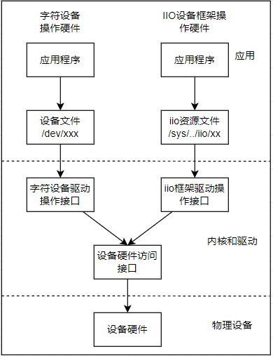

# regmap框架说明

在前面了解过i2c, spi这类接口，可以看到都是通过内部的物理总线连接，且访问的器件都是以寄存器的形式去访问，可以看到其本质上是一样的。Linux内核提出了一种新的接口来统一对这类硬件的访问，也就是regmap框架。通过框架，不需要关心内部总线和接口的实现细节，将外部器件的配置寄存器当成内部寄存器进行访问读写即可，从这里可以看出regmap框架目的如下所示。

1. 使用统一寄存器访问，简化了驱动开发过程，不需要关系具体得硬件细节，直接理解器件的寄存器即可
2. 对于支持i2c/spi访问的器件，可以降低接口切换的驱动开发难度

regmap抽象封装spi，i2c，mmio(Memory Map I/O)，mdio, spmi(System Power management Interface)等硬件接口，统一使用寄存器的方式进行访问，其结构如下所示。



## interface

，主要如下所示。

- regmap interface
  - devm_regmap_init_spi        初始化spi对应的regmap接口  
  - devm_regmap_init_i2c        初始化i2c对应的regmap接口
  - devm_regmap_init_mdio       初始化mido对应的regmap接口
  - devm_regmap_init_mmio       初始化mmio对应的regmap接口
  - devm_regmap_init_spmi_base  初始化spmi对应得regmap接口
  - regmap_read             读取单个寄存器的值
  - regmap_bulk_read        批量读取指定数据长度的寄存器值(地址连续递增)
  - regmap_raw_read         读取原始值，值不经过config的配置处理
  - regmap_noinc_read       批量写入寄存器，但不增加地址位置
  - regmap_write            写入单个寄存器的值
  - regmap_write_async      异步写入单个寄存器
  - regmap_bulk_write       批量写入指定数据长度的寄存器值(地址连续递增)
  - regmap_update_bits_base 更新寄存器的位

这里列出使用到的类型接口和功能说明，详细接口功能见"ch03-xN"后续章节说明。

```c
//初始化spi对应的regmap接口，返回regmap格式的接口
//dev: spi所属的设备节点
//config: spi接口的配置
#define devm_regmap_init_spi(dev, config) __regmap_lockdep_wrapper(__devm_regmap_init_spi, #config, dev, config)
struct regmap *__devm_regmap_init_spi(struct spi_device *dev,
            const struct regmap_config *config,
            struct lock_class_key *lock_key,
            const char *lock_name);

//初始化i2c对应的regmap接口，返回regmap格式的接口
//dev: i2c所属的设备节点
//config: i2c接口的配置
#define devm_regmap_init_i2c(dev, config) __regmap_lockdep_wrapper(__devm_regmap_init_i2c, #config, dev, config)
struct regmap *__devm_regmap_init_i2c(struct i2c_client *i2c,
                    const struct regmap_config *config,
                    struct lock_class_key *lock_key,
                    const char *lock_name);

//读取单个寄存器的值
//map: 管理regmap的格式
//reg: 寄存器的首地址
//val: 寄存器读取返回的值
//返回: 0表示成功，此时val中存储读取值，其它表示失败
int regmap_read(struct regmap *map, unsigned int reg, unsigned int *val);

//读取多个寄存器的值
//map: 管理regmap的格式
//reg: 寄存器的首地址
//val: 寄存器读取返回数据的指针首地址
//val_count: 需要读取的值的数量
//返回: 0表示成功，此时val数组中存储读取值，其它表示失败
int regmap_bulk_read(struct regmap *map, unsigned int reg, void *val, size_t val_count);

//写入单个寄存器的值
//map: 管理regmap的格式
//reg: 寄存器的首地址
//val: 寄存器需要写入的值
//返回: 0表示成功，写入到硬件中，其它表示失败
int regmap_write(struct regmap *map, unsigned int reg, unsigned int val);

//写入多个寄存器的值
//map: 管理regmap的格式
//reg: 寄存器的首地址
//val: 寄存器写入返回数据的指针首地址
//val_count: 需要写入的值的数量
//返回: 0表示成功，写入到硬件中，其它表示失败
int regmap_bulk_write(struct regmap *map, unsigned int reg, const void *val, size_t val_count);

//写入多个寄存器的值
//map: 管理regmap的格式
//reg: 寄存器的首地址
//mask: 设置掩码，设置为1的位会被修改
//val:需要更新的值
//返回: 0表示成功，写入到硬件中，其它表示失败
int regmap_update_bits(struct regmap *map, unsigned int reg, unsigned int mask, unsigned int val)
```

```c
//regmap_config 用于初始化，管理regmap_config特性的配置项
struct regmap_config {
    const char *name;       -- 可选的regmap名称。当一个设备有多个寄存器区域时很有用

    int reg_bits;           -- *必选，寄存器地址的长度*
    int reg_stride;         -- 寄存器地址步长，多字节写入时递增的数目
    int reg_downshift;      -- 执行任何操作前，寄存器地址下移的数目
    unsigned int reg_base;  -- 执行任何操作前，寄存器需要增加的基地址
    int pad_bits;           -- 寄存器和值之间的填充位数
    int val_bits;           -- **必选，一个寄存器值的长度**

    bool (*writeable_reg)(struct device *dev, unsigned int reg);        -- 回调函数，返回寄存器是否可写
    bool (*readable_reg)(struct device *dev, unsigned int reg);         -- 回调函数，返回寄存器是否可读
    bool (*volatile_reg)(struct device *dev, unsigned int reg);         -- 回调函数，返回寄存器是否可缓存
    bool (*precious_reg)(struct device *dev, unsigned int reg);         -- 回调函数，返回寄存器是否必须在驱动中读取
    bool (*writeable_noinc_reg)(struct device *dev, unsigned int reg);  -- 回调函数，返回寄存器是否写不自增
    bool (*readable_noinc_reg)(struct device *dev, unsigned int reg);   -- 回调函数，返回寄存器是否读不自增

    bool disable_locking;       -- 是否关闭内部保护，关闭后不能够从多线程访问
    bool disable_debugfs;       -- 可选，不要为这个regmap创建debugfs条目
    regmap_lock lock;           -- 可选的用于回调函数的访问锁
    regmap_unlock unlock;       -- 用于访问锁的释放
    void *lock_arg;             -- lock/unlock传递的数据

    int (*reg_read)(void *context, unsigned int reg, unsigned int *val); -- 可选的回调，如果填充，将用于执行读操作在总线上不能表示为简单读操作的设备，如SPI、I2C等。
    int (*reg_write)(void *context, unsigned int reg, unsigned int val); -- 可选的回调，如果填充，将用于执行读操作在总线上不能表示为简单写操作的设备，如SPI、I2C等。
    int (*reg_update_bits)(void *context, unsigned int reg,
                    unsigned int mask, unsigned int val);               -- 可选的回调函数，如果填充则执行所有update_bits(rmw)操作。
    /* Bulk read/write */
    int (*read)(void *context, const void *reg_buf, size_t reg_size,    -- 可选的回调，用于批量读取数据
            void *val_buf, size_t val_size);
    int (*write)(void *context, const void *data, size_t count);        -- 可选的回调，用于批量写入
    size_t max_raw_read;    -- 单次允许的最大读取长度
    size_t max_raw_write;    -- 当成允许的最大写入长度

    bool fast_io;           -- 是否使用自旋锁代替lock/unlock
    bool io_port;           -- 支持IO端口访问器。只有当MMIO和IO端口访问可以区分时才有意义。

    unsigned int max_register; -- *可选，指定最大有效的寄存器地址*
    const struct regmap_access_table *wr_table;         - 定义寄存器的可写表格
    const struct regmap_access_table *rd_table;         - 定义寄存器的可读表格
    const struct regmap_access_table *volatile_table;   - 定义寄存器的可缓存表格
    const struct regmap_access_table *precious_table;   - 定义寄存器是否只能驱动访问的表格
    const struct regmap_access_table *wr_noinc_table;   - 定义寄存器写入是否自增的表格
    const struct regmap_access_table *rd_noinc_table;   - 定义寄存器读取是否自增的表格
    const struct reg_default *reg_defaults;             - 寄存器的默认值(上电)
    unsigned int num_reg_defaults;                      - 寄存器默认值的数目
    enum regcache_type cache_type;                      - 实际的缓存类型
    const void *reg_defaults_raw;                       - 寄存器上电的复位值数组(用于支持寄存器缓存)
    unsigned int num_reg_defaults_raw;                  - 复位值数组的长度

    unsigned long read_flag_mask;                       - **在读操作时，在寄存器的顶部字节设置掩码(需要根据硬件器件确定)**
    unsigned long write_flag_mask;                      - **在写操作时，在寄存器的顶部字节设置掩码**
    bool zero_flag_mask;                                - 如果设置，即使read_flag_mask和write_flag_mask都是空的，也会使用它们。

    bool use_single_read;                               - 是否将多次读取转换为单次读取
    bool use_single_write;                              - 是否将多次写入转换为单次写入    
    bool use_relaxed_mmio;                              - 定义mmio操作不使用内核屏障
    bool can_multi_write;                               - 是否支持多写的批量写操作                    

    enum regmap_endian reg_format_endian;               - 格式化寄存器地址的字节序。
    enum regmap_endian val_format_endian;               - 格式化寄存器值的字节序

    const struct regmap_range_cfg *ranges;              - 虚拟地址范围的配置项数组。
    unsigned int num_ranges;                            - 虚拟地址内部的数目

    bool use_hwlock;                                    - 说明是否应该使用硬件自旋锁。
    bool use_raw_spinlock;                              - 说明是否应该使用原始自旋锁。
    unsigned int hwlock_id;                             - 指定硬件自旋锁id
    unsigned int hwlock_mode;                           - 硬件自旋锁模式，应该是HWLOCK_IRQSTATE、HWLOCK_IRQ或0。

    bool can_sleep;                                     - 可选，定义设备是否允许休眠
};

//regmap 管理regmap功能的够
struct regmap {
    union {
        struct mutex mutex;
        struct {
            spinlock_t spinlock;
            unsigned long spinlock_flags;
        };
        struct {
            raw_spinlock_t raw_spinlock;
            unsigned long raw_spinlock_flags;
        };
    };                          -- 用于保护的互斥量/自旋锁
    regmap_lock lock;           -- 可选的用于回调函数的访问锁
    regmap_unlock unlock;       -- 用于访问锁的释放
    void *lock_arg;             -- lock/unlock传递的数据
    gfp_t alloc_flags;
    unsigned int reg_base;      -- 执行任何操作前，寄存器需要增加的基地址

    struct device *dev;             -- 执行读写操作的设备
    void *work_buf;                 -- 用于格式化I/O的Scratch缓冲区
    struct regmap_format format;    -- 格式化的存储控制
    const struct regmap_bus *bus;   -- regmap对应硬件所属的总线
    void *bus_context;              -- 总线的环境变量
    const char *name;               -- regmap设备的名称

    /* 用于异步访问的接口 */
    bool async;
    spinlock_t async_lock;
    wait_queue_head_t async_waitq;
    struct list_head async_list;
    struct list_head async_free;
    int async_ret;

#ifdef CONFIG_DEBUG_FS
    bool debugfs_disable;
    struct dentry *debugfs;
    const char *debugfs_name;

    unsigned int debugfs_reg_len;
    unsigned int debugfs_val_len;
    unsigned int debugfs_tot_len;

    struct list_head debugfs_off_cache;
    struct mutex cache_lock;
#endif

    unsigned int max_register;  -- *可选，指定最大有效的寄存器地址*

    /* 定义寄存器访问特性的接口和权限表 */
    bool (*writeable_reg)(struct device *dev, unsigned int reg);
    bool (*readable_reg)(struct device *dev, unsigned int reg);
    bool (*volatile_reg)(struct device *dev, unsigned int reg);
    bool (*precious_reg)(struct device *dev, unsigned int reg);
    bool (*writeable_noinc_reg)(struct device *dev, unsigned int reg);
    bool (*readable_noinc_reg)(struct device *dev, unsigned int reg);
    const struct regmap_access_table *wr_table;
    const struct regmap_access_table *rd_table;
    const struct regmap_access_table *volatile_table;
    const struct regmap_access_table *precious_table;
    const struct regmap_access_table *wr_noinc_table;
    const struct regmap_access_table *rd_noinc_table;

    /* 定义寄存器读写的回调函数，见config说明 */
    int (*reg_read)(void *context, unsigned int reg, unsigned int *val);
    int (*reg_write)(void *context, unsigned int reg, unsigned int val);
    int (*reg_update_bits)(void *context, unsigned int reg,
                   unsigned int mask, unsigned int val);
    /* Bulk read/write */
    int (*read)(void *context, const void *reg_buf, size_t reg_size,
            void *val_buf, size_t val_size);
    int (*write)(void *context, const void *data, size_t count);

    bool defer_caching;

    unsigned long read_flag_mask;
    unsigned long write_flag_mask;

    /* number of bits to (left) shift the reg value when formatting*/
    int reg_shift;
    int reg_stride;
    int reg_stride_order;

    /* regcache specific members */
    const struct regcache_ops *cache_ops;
    enum regcache_type cache_type;

    /* number of bytes in reg_defaults_raw */
    unsigned int cache_size_raw;
    /* number of bytes per word in reg_defaults_raw */
    unsigned int cache_word_size;
    /* number of entries in reg_defaults */
    unsigned int num_reg_defaults;
    /* number of entries in reg_defaults_raw */
    unsigned int num_reg_defaults_raw;

    /* if set, only the cache is modified not the HW */
    bool cache_only;
    /* if set, only the HW is modified not the cache */
    bool cache_bypass;
    /* if set, remember to free reg_defaults_raw */
    bool cache_free;

    struct reg_default *reg_defaults;
    const void *reg_defaults_raw;
    void *cache;
    /* if set, the cache contains newer data than the HW */
    bool cache_dirty;
    /* if set, the HW registers are known to match map->reg_defaults */
    bool no_sync_defaults;

    struct reg_sequence *patch;
    int patch_regs;

    /* if set, converts bulk read to single read */
    bool use_single_read;
    /* if set, converts bulk write to single write */
    bool use_single_write;
    /* if set, the device supports multi write mode */
    bool can_multi_write;

    /* if set, raw reads/writes are limited to this size */
    size_t max_raw_read;
    size_t max_raw_write;

    struct rb_root range_tree;
    void *selector_work_buf;    /* Scratch buffer used for selector */

    struct hwspinlock *hwlock;

    /* if set, the regmap core can sleep */
    bool can_sleep;
};
```

## next_chapter

[返回目录](../README.md)

直接开始下一节说明: [rtc设备驱动实现](./ch03-10.rtc_subsystem.md)
