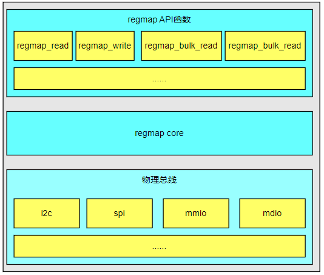
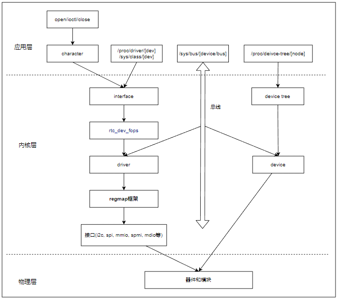
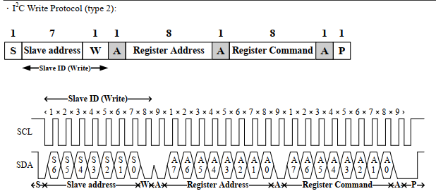
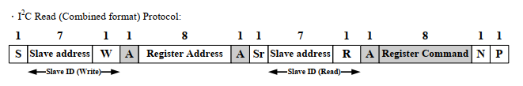
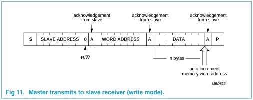
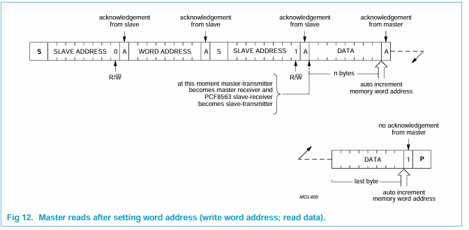
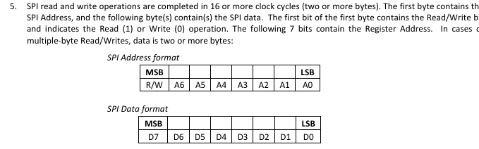

# regmap框架和使用说明

了解过i2c, spi这类接口，可以看到都是通过总线连接，且以寄存器的形式去访问设备中的数据。那么这些访问能否抽象成统一的接口，以读地址的方式去读写相应的数据？regmap框架正是在这一思路下实现，用于屏蔽访问接口差异，以寄存器的方式统一进行处理，regmap框架结构如下所示。



1. 底层物理总线：regmap框架对不同的物理总线进行了封装，目前支持的物理总线包括I2C、SPI、MMIO（内存映射I/O）等。这一层负责提供与具体物理总线相关的操作函数。
2. regmap核心层：这一层实现了regmap框架的核心功能，包括寄存器的访问、缓存管理等。开发人员不需要关心这一层的具体实现细节。
3. regmap API抽象层：这一层向驱动编写人员提供了统一的API接口，用于操作具体的芯片设备。驱动编写人员可以使用这些API接口来读写寄存器、更新寄存器的位等。

regmap抽象封装spi，i2c，mmio(Memory Map I/O)，mdio, spmi(System Power management Interface)等硬件接口，统一使用寄存器的方式进行访问，对于支持regmap的驱动，其在内核中的结构如下所示。



可以看到，regmap只是取代了驱动中i2c，spi接口读写的部分，其它设备树，设备注册，访问并没有区别，这是理解regmap重要思想。当你使用regmap框架来开发驱动时，它本身是什么类型的设备，其处理并没有变化。例如它是i2c接口的传感器，那么你仍然要实现设备树，创建字符设备，实现操作接口，这部分还是一致的。只是操作i2c，spi，寄存器读写的接口，需要替换成regmap_read/regmap_write接口，另外还需要调用相应的init初始化后来支持regmap的应用。再学习使用regmap框架时，一定要对原有接口操作有一个清晰的认知，这样才能更好的理解regmap框架。

本节目录如下。

- [regmap接口和配置说明](#interface)
- [regmap驱动接口实现](#regmap_driver)
  - [ap3216实现regmap接口](#ap3216)
  - [pcf8563实现regmap接口](#pcf8563)
- [regmap总结](#summary)
- [下一章节](#next_chapter)

## interface

关于regmap的相关接口，主要如下所示。

- regmap interface
  - devm_regmap_init_spi        初始化spi对应的regmap接口  
  - devm_regmap_init_i2c        初始化i2c对应的regmap接口
  - devm_regmap_init_mdio       初始化mido对应的regmap接口
  - devm_regmap_init_mmio       初始化mmio对应的regmap接口
  - devm_regmap_init_spmi_base  初始化spmi对应得regmap接口
  - regmap_read                 读取单个寄存器的值
  - regmap_bulk_read            批量读取指定数据长度的寄存器值(地址连续递增)
  - regmap_raw_read             读取原始值，值不经过config的配置处理
  - regmap_noinc_read           批量写入寄存器，但不增加地址位置
  - regmap_write                写入单个寄存器的值
  - regmap_write_async          异步写入单个寄存器
  - regmap_bulk_write           批量写入指定数据长度的寄存器值(地址连续递增)
  - regmap_update_bits_base     更新单个寄存器的指定位

这里列出使用到的类型接口和功能说明，下面列出进一步的访问接口说明。

```c
//初始化spi对应的regmap接口，返回regmap格式的接口
//dev: spi所属的设备节点
//config: spi接口的配置
#define devm_regmap_init_spi(dev, config) __regmap_lockdep_wrapper(__devm_regmap_init_spi, #config, dev, config)
struct regmap *__devm_regmap_init_spi(struct spi_device *dev,
            const struct regmap_config *config,
            struct lock_class_key *lock_key,
            const char *lock_name);

//初始化i2c对应的regmap接口，返回regmap格式的接口
//dev: i2c所属的设备节点
//config: i2c接口的配置
#define devm_regmap_init_i2c(dev, config) __regmap_lockdep_wrapper(__devm_regmap_init_i2c, #config, dev, config)
struct regmap *__devm_regmap_init_i2c(struct i2c_client *i2c,
                    const struct regmap_config *config,
                    struct lock_class_key *lock_key,
                    const char *lock_name);

//读取单个寄存器的值
//map: 管理regmap的格式
//reg: 寄存器的首地址
//val: 寄存器读取返回的值
//返回: 0表示成功，此时val中存储读取值，其它表示失败
int regmap_read(struct regmap *map, unsigned int reg, unsigned int *val);

//读取多个寄存器的值
//map: 管理regmap的格式
//reg: 寄存器的首地址
//val: 寄存器读取返回数据的指针首地址
//val_count: 需要读取的值的数量
//返回: 0表示成功，此时val数组中存储读取值，其它表示失败
int regmap_bulk_read(struct regmap *map, unsigned int reg, void *val, size_t val_count);

//写入单个寄存器的值
//map: 管理regmap的格式
//reg: 寄存器的首地址
//val: 寄存器需要写入的值
//返回: 0表示成功，写入到硬件中，其它表示失败
int regmap_write(struct regmap *map, unsigned int reg, unsigned int val);

//写入多个寄存器的值
//map: 管理regmap的格式
//reg: 寄存器的首地址
//val: 寄存器写入返回数据的指针首地址
//val_count: 需要写入的值的数量
//返回: 0表示成功，写入到硬件中，其它表示失败
int regmap_bulk_write(struct regmap *map, unsigned int reg, const void *val, size_t val_count);

//写入多个寄存器的值
//map: 管理regmap的格式
//reg: 寄存器的首地址
//mask: 设置掩码，设置为1的位会被修改
//val:需要更新的值
//返回: 0表示成功，写入到硬件中，其它表示失败
int regmap_update_bits(struct regmap *map, unsigned int reg, unsigned int mask, unsigned int val)
```

可以看到，对于接口中，最重要的结构就是用于初始化的"struct regmap_config"和保存信息的"struct regmap"属性，其中struct regmap大部分都是config中的信息，因此这里以regmap_config进行解释，格式如下。

```c
//regmap_config 
//用于初始化，管理regmap_config特性的配置项
struct regmap_config {
    const char *name;       //可选的regmap名称。当一个设备有多个寄存器区域时很有用

    int reg_bits;           // *必选，寄存器地址的长度*
    int reg_stride;         // 寄存器地址步长，用于多字节操作时地址递增的个数
    int reg_downshift;      // 执行任何操作前，寄存器地址下移的数目
    unsigned int reg_base;  // 执行任何操作前，寄存器需要增加的基地址
    int pad_bits;           // 寄存器和值之间的填充位数
    int val_bits;           // **必选，一个寄存器值的长度**

    bool (*writeable_reg)(struct device *dev, unsigned int reg);        //回调函数，确定寄存器是否可写
    bool (*readable_reg)(struct device *dev, unsigned int reg);         //回调函数，确定寄存器是否可读
    bool (*volatile_reg)(struct device *dev, unsigned int reg);         //回调函数，确定寄存器是否每次都必须实际读取
    bool (*precious_reg)(struct device *dev, unsigned int reg);         //回调函数，返回寄存器是否必须在驱动中读取
    bool (*writeable_noinc_reg)(struct device *dev, unsigned int reg);  //回调函数，返回寄存器是否写不自增
    bool (*readable_noinc_reg)(struct device *dev, unsigned int reg);   //回调函数，返回寄存器是否读不自增

    bool disable_locking;       //是否关闭内部保护，关闭后不能够从多线程访问
    bool disable_debugfs;       //可选，不要为这个regmap创建debugfs条目
    regmap_lock lock;           //可选的用于回调函数的访问锁
    regmap_unlock unlock;       //用于访问锁的释放
    void *lock_arg;             //lock/unlock传递的数据

    int (*reg_read)(void *context, unsigned int reg, unsigned int *val); //可选的回调，如果填充，将用于执行读操作在总线上不能表示为简单读操作的设备，如SPI、I2C等。
    int (*reg_write)(void *context, unsigned int reg, unsigned int val); //可选的回调，如果填充，将用于执行读操作在总线上不能表示为简单写操作的设备，如SPI、I2C等。
    int (*reg_update_bits)(void *context, unsigned int reg,
                    unsigned int mask, unsigned int val);               //可选的回调函数，如果填充则执行所有update_bits(rmw)操作。
    /* Bulk read/write */
    int (*read)(void *context, const void *reg_buf, size_t reg_size,    //可选的回调，用于自定义的批量读数据操作
            void *val_buf, size_t val_size);
    int (*write)(void *context, const void *data, size_t count);        //可选的回调，用于自定义的批量写数据操作
    size_t max_raw_read;                                                //单次允许的最大读取长度
    size_t max_raw_write;                                               //单次允许的最大写入长度

    bool fast_io;                                                       //是否使用自旋锁代替lock/unlock
    bool io_port;                                                       //支持IO端口访问器。只有当MMIO和IO端口访问可以区分时才有意义。

    unsigned int max_register;                                          //可选，指定最大有效的寄存器地址
    const struct regmap_access_table *wr_table;                         //指定寄存器的可写表格
    const struct regmap_access_table *rd_table;                         //指定寄存器的可读表格
    const struct regmap_access_table *volatile_table;                   //指定寄存器的可缓存表格
    const struct regmap_access_table *precious_table;                   //指定寄存器是否只能驱动访问的表格
    const struct regmap_access_table *wr_noinc_table;                   //定义寄存器写入是否自增的表格
    const struct regmap_access_table *rd_noinc_table;                   //定义寄存器读取是否自增的表格
    const struct reg_default *reg_defaults;             //寄存器的默认值(上电)
    unsigned int num_reg_defaults;                      //寄存器默认值的数目
    enum regcache_type cache_type;                      //实际的缓存类型
    const void *reg_defaults_raw;                       //寄存器上电的复位值数组(用于支持寄存器缓存)
    unsigned int num_reg_defaults_raw;                  //复位值数组的长度

    unsigned long read_flag_mask;                       //**在读操作时，在寄存器的顶部字节设置掩码(需要根据器件确定)**
    unsigned long write_flag_mask;                      //**在写操作时，在寄存器的顶部字节设置掩码(需要根据器件确定**
    bool zero_flag_mask;                                //如果设置，即使read_flag_mask和write_flag_mask都是空的，也会使用它们。

    bool use_single_read;                               //是否将多次读取转换为单次读取
    bool use_single_write;                              //是否将多次写入转换为单次写入    
    bool use_relaxed_mmio;                              //定义mmio操作不使用内核屏障
    bool can_multi_write;                               //是否支持多写的批量写操作                    

    enum regmap_endian reg_format_endian;               //格式化寄存器地址的字节序。
    enum regmap_endian val_format_endian;               //格式化寄存器值的字节序

    const struct regmap_range_cfg *ranges;              //虚拟地址范围的配置项数组。
    unsigned int num_ranges;                            //虚拟地址内部的数目

    bool use_hwlock;                                    //说明是否应该使用硬件自旋锁。
    bool use_raw_spinlock;                              //说明是否应该使用原始自旋锁。
    unsigned int hwlock_id;                             //指定硬件自旋锁id
    unsigned int hwlock_mode;                           //硬件自旋锁模式，应该是HWLOCK_IRQSTATE、HWLOCK_IRQ或0。

    bool can_sleep;                                     //定义设备是否允许休眠
};
```

理解了这些，似乎就可以实现regmap的访问了。然而使用regmap框架进行驱动开发的现实面临两大问题。

1. 为什么这么多配置选项，在开发中主要配置有哪些
2. 对于具体的i2c，spi器件或者内部模块，该如何定义初始化配置，实现功能

这里解释下，前面说到regmap是统一管理内部reg，spi，i2c，mdio等接口，访问相应硬件的框架。而作为这类器件，除了接口，对于硬件上访问的差异是客观存在的，这里列出一部分。

1. 器件单次读写长度不一致，例如传感器有1字节的(扩展芯片pcf8563), 4字节的(内部模块寄存器)，还有一些64位芯片，内部模块寄存器需要8字节读取
2. 器件单次支持读写的个数不一致，有的器件支持单次多读或单次多写，而有的器件每次只能写单个长度，不支持自动递增
3. 对于器件内部的寄存器也有读写权限的差异，包含只读(r-o)，只写(w-o)，可读可写(rw)，写清除(wc)，读清除(rc)等
4. 一些特殊器件，地址位的某些位定义对器件的读/写方式

这些差异最终要反映到输出的电平信号上，也就需要软件来支持配置项去定义。对于开发者来说，配置项虽然多，不过大部分并不需要关系，常用的需要配置的选项如下所示。

- reg_bits: 必选配置，定义寄存器地址的bits数，1字节为8，2字节为16，依次类推
- val_bits: 必选配置，定义单次读取寄存器内部值得bits数，1字节为8，2字节为16，依次类推(注意:数据位数和寄存器地址位数没有必然联系，例如地址0x1800, 值0x01也是允许的，不过对于内部模块寄存器，数据位数和地址位数是一致的)
- reg_base: 访问寄存器时，定义的基地址，实际地址为(reg_base + reg_addr), 以实际地址0x120为例，如果定义基地址为0x100, 这样寄存器使用0x20既可以访问，这对于内部模块寄存器访问可以简化操作，大部分使用默认0即可。
- reg_stride: 定义寄存器地址的步进字节，有效的寄存器地址是该值的倍数，设置为0，当成1使用。例如寄存器地址0x00，0x04, 0x08...，reg_bits位数就是8bit，stride步进就是4，而对于地址0x1c000000, 0x1c000001...，reg_bits位数就是32，stride的步进是1；地址0x1d000000，0x1d000004...，reg_bits位数就是32，stride的步进是4；可以看到，寄存器位数和步进并没有确定关系，不过寄存器的地址一定是步进的倍数。
- reg_downshift: 访问寄存器时，寄存器默认右移的位数，大部分使用默认0即可。
- read_flag_mask: 应对有些器件的寄存器通过指定bit的位置位表示读，寄存器地址发送时置相应位
- write_flag_mask: 应对有些器件的寄存器通过指定bit的位置位表示写，寄存器地址发送时置相应位
- max_registers: 指定最大有效的寄存器地址，为reg_base+max_register长度

至于其它参数，虽然也同样各有用途，不过只在特定器件或者希望附加功能时配置，使用默认的值也基本能实现功能，可以先不关注，遇到了在总结即可。下面将以实际应用来分析regmap的实现，因为这些器件在i2c，spi，rtc这些章节都有说明，因此这里不在描述如何加载驱动，注册设备文件的实现，专注于封装操作硬件的接口。

## regmap_driver

regmap是对器件操作的封装，那么我们在使用时，最重要的就是理解器件说明中的关键信息，主要如下所示。

1. 访问寄存器的字节数
2. 寄存器数据的位数
3. 读写是否需要不同的掩码(主要对于spi设备，i2c设备会在使用init接口时自动处理)
4. 是否支持多读，还是单个读取

这些都是在芯片手册中存在的，以下参考说明。

### ap3216

下面器件来自于ap3216的手册，写入和读取协议如下。





参考文档说明，器件的特性如下。

1. 操作为i2c接口
2. 访问寄存器的字节数为8bit
3. 寄存器内数据的位数为8bit
4. 不支持单次多个读取，因此只能使用regmap_read/write接口，使用regmap_bulk_read/write接口，需要置位use_single_read

则其接口实现如下所示。

```c
// 定义ap3216的配置接口
const struct regmap_config ap3216_regmap_config = {
    .reg_bits = 8,  // 寄存器地址位数，8bit(1Byte)
    .val_bits = 8,  // 寄存器数据位数，8bit(1Byte)
    //其它默认为0，可省略
    //不使用bulk接口，reg_stride可不设置，默认0，当作1
};

static int i2c_probe(struct i2c_client *client, const struct i2c_device_id *id)
{
    //......

    //2.初始化regmap i2c控制结构
    chip->map = devm_regmap_init_i2c(client, &ap3216_regmap_config);
    if (IS_ERR(chip->map))
    {
        dev_err(&client->dev, "chip map init failed\n");
        return -ENXIO;
    }

    //......
}

static int read_values(struct ap3216_data* chip, int *readbuf)
{
    u8 i;
    int ret;

    // 通过regmap循环多次读取
    for (i = 0; i < 6; i++) {
        ret = regmap_read(chip->map, AP3216C_IRDATALOW + i, &readbuf[i]);
        if (ret) {
            dev_err(&chip->client->dev, "ap316_read err:%s, %d", __func__, ret);
            return -EIO;
        }
    }

    if (readbuf[0]&(1<<7)){
        chip->data.ir = 0;
    } else{
        chip->data.ir = ((unsigned short)readbuf[1] << 2) | (readbuf[0] & 0X03);
    }

    chip->data.als = ((unsigned short)readbuf[3] << 8) | readbuf[2];
    if (readbuf[4]&(1<<6)) {
        chip->data.ps = 0;
    } else {
        chip->data.ps = ((unsigned short)(readbuf[5] & 0X3F) << 4) | (readbuf[4] & 0X0F); 
    }

    return 0;
}
```

使用的接口如下。

- devm_regmap_init_i2c用于初始化
- regmap_read用于读取器件内部寄存器
- regmap_write用于写入器件内部寄存器

### pcf8563

下面器件来自于pcf8563的手册，写入和读取协议如下。





参考文档说明，器件的特性如下。

1. 操作为i2c接口
2. 访问寄存器的字节数为8bit
3. 寄存器内数据的位数为8bit
4. 支持单次多个读取，可以使用regmap_bulk_read/write接口，当然也支持regmap_read/write

```c
// 定义pcf8563的配置接口
const struct regmap_config rtc_regmap_config = {
    .reg_bits = 8,          // 寄存器地址位数，8bit(1Byte)
    .val_bits = 8,          // 寄存器数据位数，8bit(1Byte)
    .reg_stride = 1,        // 寄存器地址步长，1Byte，用于支持bulk_read/write
    .max_register = 255,    // 允许读取的最大寄存器地址
    //其它默认为0，可省略
};

static int i2c_probe(struct i2c_client *client, const struct i2c_device_id *id)
{
    //......

    // 2.初始化regmap i2c控制结构
    chip->map = devm_regmap_init_i2c(client, &rtc_regmap_config);
    if (IS_ERR(chip->map))
    {
        dev_err(&client->dev, "chip map init failed\n");
        return -ENXIO;
    }
   
    //......
}

static int pcf8563_get_time(struct device *dev, struct rtc_time *tm)
{
    struct i2c_client *client = to_i2c_client(dev);
    struct pcf8563_data *chip = i2c_get_clientdata(client);
    unsigned char buf[9];
    int err;

    // 单次多字节读取寄存器值
    err = regmap_bulk_read(chip->map, PCF8563_REG_CONTROL1, buf, 9);
    if (err) {
        dev_err(&client->dev,
            "dev read block issue!.\n");
        return err;
    }

    if (buf[PCF8563_REG_SECONDS] & (1<<7)) {
        dev_err(&client->dev,
            "low voltage detected, date/time is not reliable.\n");
        return -EINVAL;
    }

    tm->tm_sec = bcdToDec(buf[PCF8563_REG_SECONDS] & 0x7F);
    tm->tm_min = bcdToDec(buf[PCF8563_REG_MINUTES] & 0x7F);
    tm->tm_hour = bcdToDec(buf[PCF8563_REG_HOURS] & 0x3F); /* rtc hr 0-23 */
    tm->tm_mday = bcdToDec(buf[PCF8563_REG_DAYS] & 0x3F);
    tm->tm_wday = buf[PCF8563_REG_WEEKDAYS] & 0x07;
    tm->tm_mon = bcdToDec(buf[PCF8563_REG_MONTHS] & 0x1F) - 1; /* rtc mn 1-12 */
    tm->tm_year = bcdToDec(buf[PCF8563_REG_YEARS]) + 100;
    chip->c_polarity = (buf[PCF8563_REG_MONTHS] & (1<<7)) ?
        (tm->tm_year >= 100) : (tm->tm_year < 100);

    dev_info(&client->dev, "%s: tm is secs=%d, mins=%d, hours=%d, "
        "mday=%d, mon=%d, year=%d, wday=%d\n",
        __func__,
        tm->tm_sec, tm->tm_min, tm->tm_hour,
        tm->tm_mday, tm->tm_mon, tm->tm_year, tm->tm_wday);

    return 0;
}

static int pcf8563_set_time(struct device *dev, struct rtc_time *tm)
{
    struct i2c_client *client = to_i2c_client(dev);
    struct pcf8563_data *chip = i2c_get_clientdata(client);
    unsigned char buf[9];
    int err;

    dev_info(&client->dev, "%s: secs=%d, mins=%d, hours=%d, "
        "mday=%d, mon=%d, year=%d, wday=%d\n",
        __func__,
        tm->tm_sec, tm->tm_min, tm->tm_hour,
        tm->tm_mday, tm->tm_mon, tm->tm_year, tm->tm_wday);

    /* hours, minutes and seconds */
    buf[PCF8563_REG_SECONDS] = decToBcd(tm->tm_sec);
    buf[PCF8563_REG_MINUTES] = decToBcd(tm->tm_min);
    buf[PCF8563_REG_HOURS] = decToBcd(tm->tm_hour);
    buf[PCF8563_REG_DAYS] = decToBcd(tm->tm_mday);
    buf[PCF8563_REG_WEEKDAYS] = tm->tm_wday & 0x07;

    /* month, 1 - 12 */
    buf[PCF8563_REG_MONTHS] = decToBcd(tm->tm_mon + 1);

    /* year and century */
    buf[PCF8563_REG_YEARS] = decToBcd(tm->tm_year - 100);
    if (chip->c_polarity ? (tm->tm_year >= 100) : (tm->tm_year < 100)) {
        buf[PCF8563_REG_MONTHS] |= (1<<7);
    }

    // 单次多字节写入寄存器值
    err =  regmap_bulk_write(chip->map, PCF8563_REG_SECONDS,
                buf + PCF8563_REG_SECONDS, 9 - PCF8563_REG_SECONDS);
    if (err) {
        dev_err(&client->dev, "dev read block issue!.\n");
        return err;  
    }
    return 0;
}
```

使用的接口如下。

- devm_regmap_init_i2c用于初始化
- regmap_bulk_read用于多字节读取器件内部寄存器
- regmap_bulk_write用于多字节写入器件内部寄存器

### icm20608

下面器件来自于icm20608的手册，操作协议如下。



参考文档说明，器件的特性如下。

1. 操作为spi接口
2. 访问寄存器的字节数为8bit
3. 寄存器内数据的位数为8bit
4. 支持单次多个读取，可以使用regmap_bulk_read/write接口，当然也支持regmap_read/write
5. 寄存器地址的MSB位标识R/W，其中1表示读取。

```c
const struct regmap_config icm20608_regmap_config = {
    .reg_bits = 8,              // 寄存器地址位数，8bit(1Byte)
    .val_bits = 8,              // 寄存器地址位数，8bit(1Byte)
    .reg_stride = 1,            // 寄存器地址步长，1Byte，用于支持bulk_read/write
    .read_flag_mask = BIT(7),   // 寄存器地址MSB位标识R/W，其中1表示读取，0表示写入
    .max_register = 255,        // 允许读取的最大寄存器地址
    //其它默认为0，可省略
};

static int spi_hardware_init(struct spi_icm_data *chip)
{
    int data = 0;
    struct spi_device *spi;

    //1.配置spi位regmap操作模式
    spi = (struct spi_device *)chip->private_data;
    chip->map = devm_regmap_init_spi(spi, &icm20608_regmap_config);
    if (IS_ERR(chip->map))
    {
        dev_err(&spi->dev, "chip map init failed\n");
    }

    //2.复位芯片
    regmap_write(chip->map, ICM20_PWR_MGMT_1, 0x80);
    mdelay(50);
    regmap_write(chip->map, ICM20_PWR_MGMT_1, 0x01);
    mdelay(50);

    //3.读取芯片ID
    regmap_read(chip->map, ICM20_WHO_AM_I, &data);
    dev_info(&spi->dev, "ICM20608 ID = %#X\n", data);

    //4.解析设备树，写入寄存器配置信息
    icm20608_parse_dt(chip);
    regmap_write(chip->map, ICM20_SMPLRT_DIV, chip->reg_config.smplrt_div);
    regmap_write(chip->map, ICM20_GYRO_CONFIG, chip->reg_config.gyro_config);
    regmap_write(chip->map, ICM20_ACCEL_CONFIG, chip->reg_config.accel_config);
    regmap_write(chip->map, ICM20_CONFIG, chip->reg_config.config);
    regmap_write(chip->map, ICM20_ACCEL_CONFIG2, chip->reg_config.accel_config2);
    regmap_write(chip->map, ICM20_PWR_MGMT_2, chip->reg_config.pwr_mgmt_2);
    regmap_write(chip->map, ICM20_LP_MODE_CFG, chip->reg_config.lp_mode_cfg);
    regmap_write(chip->map, ICM20_FIFO_EN, chip->reg_config.fifo_en);

    return 0;
}

static ssize_t icm20608_read(struct file *filp, char __user *buf, size_t cnt, loff_t *off)
{
    signed int data[7];
    int ret;
    unsigned char readbuf[14];
    struct spi_icm_data *chip = (struct spi_icm_data *)filp->private_data;
    struct spi_device *spi = (struct spi_device *)chip->private_data;

    //读取寄存器的值
    ret = regmap_bulk_read(chip->map, ICM20_ACCEL_XOUT_H, readbuf, 14);
    if (ret < 0)
    {
        dev_err(&spi->dev, "icm20608 read failed:%d\n", ret);
        return 0;
    }

    chip->data.accel_x_adc = (signed short)((readbuf[0] << 8) | readbuf[1]);
    chip->data.accel_y_adc = (signed short)((readbuf[2] << 8) | readbuf[3]);
    chip->data.accel_z_adc = (signed short)((readbuf[4] << 8) | readbuf[5]);
    chip->data.temp_adc    = (signed short)((readbuf[6] << 8) | readbuf[7]);
    chip->data.gyro_x_adc  = (signed short)((readbuf[8] << 8) | readbuf[9]);
    chip->data.gyro_y_adc  = (signed short)((readbuf[10] << 8) | readbuf[11]);
    chip->data.gyro_z_adc  = (signed short)((readbuf[12] << 8) | readbuf[13]);

    data[0] = chip->data.gyro_x_adc;
    data[1] = chip->data.gyro_y_adc;
    data[2] = chip->data.gyro_z_adc;
    data[3] = chip->data.accel_x_adc;
    data[4] = chip->data.accel_y_adc;
    data[5] = chip->data.accel_z_adc;
    data[6] = chip->data.temp_adc;
    ret = copy_to_user(buf, data, sizeof(data));
    if (ret < 0)
    {
        dev_err(&spi->dev, "copy_to_user failed:%d\n", ret);
        return ret;
    }

    return cnt;
}
```

## summary

可以看到，regmap是对现有的i2c，spi，寄存器访问接口的封装。通过统一处理，简化了驱动实现的难度；不过从regmap的操作流程来看，都是先写寄存器地址，再写操作数据，这样就只能用于带寄存器的外部器件。对于部分i2c器件或SPI器件，不存在寄存器，只支持直接操作数据，这时候就不符合regmap的操作方式，只能使用基础的i2c和spi框架进行管理。为了应对开发中的复杂情况，开发人员仍然需要理解基础接口的实现方式，才能更方便的使用regmap实现具体功能。

本节相关代码如下。

- [ap3216完整驱动代码](./file/ch03-10/kernel_regmap_i2c.c)
- [pcf8563完整驱动代码](./file/ch03-10/kernel_regmap_rtc.c)
- [icm20608完整驱动代码](./file/ch03-10/kernel_regmap_spi.c)

## next_chapter

[返回目录](../README.md)

直接开始下一节说明: [rtc子系统设备框架](./ch03-11.rtc_subsystem.md)
