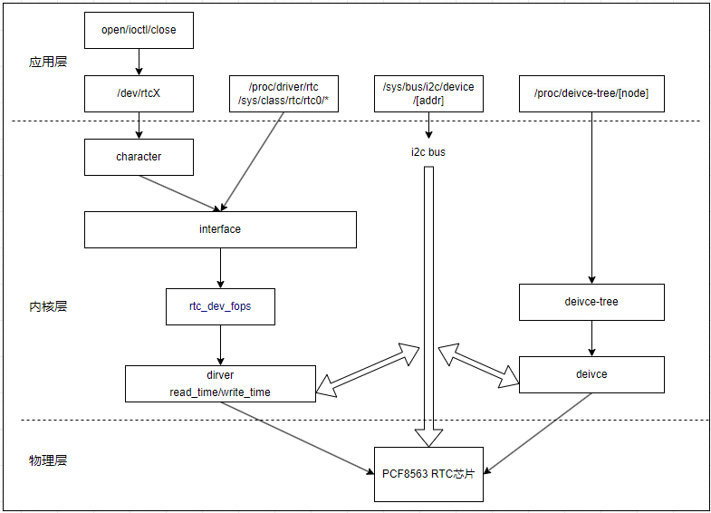
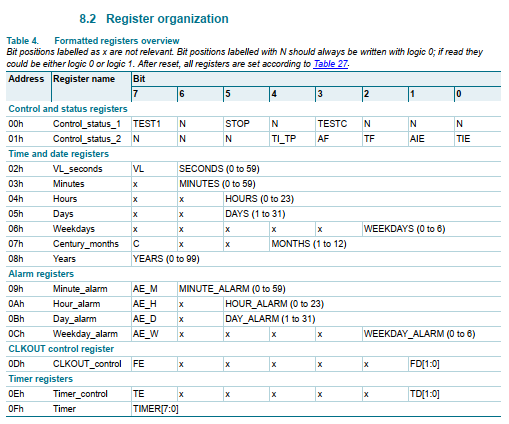

# rtc硬件管理框架

RTC（Real-Time Clock）模块，即实时时钟模块，是一种用于测量时间的电子设备；主要功能包含时间记录(年月日时分秒，星期)、闹钟定时功能；可以实现基于星期，以及时分秒的定时功能。RTC模块拥有独立于SOC的供电功能，一般为纽扣电池，从而实现准确的时间记录(掉电执行)；设备唤醒，配合芯片的唤醒引脚或者内部模块实现。RTC从硬件区分来说，分为芯片内置的RTC以及外部的RTC器件，不过它们的区别只在于硬件访问的操作。对于内核加载的方式，以及应用访问的功能实现，则基本一致。rtc驱动也是典型的字符型设备，因此实现流程也和常规的字符设备一致，主要包含以下步骤。

1. 实现内核加载rtc驱动的接口
2. 实现rtc注册设备到内核的功能
3. 实现rtc关联硬件的初始化，配置，读写操作
4. 关联内核接口和硬件功能

目录如下所示。

- [rtc驱动说明](#rtc_driver)
  - [rtc操作接口](#rtc_interface)
  - [rtc设备树](#rtc_chip_tree)
  - [rtc驱动代码](#rtc_driver_code)
- [rtc应用代码](#rtc_app)
- [下一章节](#next_chapter)

下面是典型的外接i2c接口rtc器件在系统中的注册和访问的接口。



其中大部分功能由内核实现，对于用户来说，主要包含两部分实现。

1. 实现设备树，生成rtc设备
2. 实现驱动，在系统中创建rtc设备文件，添加访问的接口

另外RTC支持二进制和BCD两种存储模式，这两种模式的转换如下所示。

```c
// 21 => 0x21
// BIN => BCD
out_bcd = ((in_bin/10)<<4 | (in_bin%10)

// BCD => BIN
// 0x21 => 21
out_bin = (in_bcd>>4)*10 + (in_bcd&0x0F)
```

## rtc_driver

本节中使用i2c接口访问的rtc器件PCF8563；其实现参考i2c总线如何加载器件驱动，以及rtc子系统的应用。

其中i2c总线部分参考：[i2c驱动和接口说明](./ch03-07.i2c_frame.md)；对于rtc子系统的应用，说明如下所示。

### rtc_interface

关于rtc的相关接口并不复杂，主要有申请rtc管理结构资源，向系统中注册rtc设备和管理类，具体如下所示。

```c
// 申请管理RTC设备的资源
struct rtc_device *devm_rtc_allocate_device(struct device *dev)

// 向系统中注册rtc设备
#define devm_rtc_register_device(device) \
    __devm_rtc_register_device(THIS_MODULE, device)
int __devm_rtc_register_device(struct module *owner, struct rtc_device *rtc)

// 向系统中注册rtc设备, 返回rtc_device
// 执行两步骤
// 1. devm_rtc_allocate_device
// 2. devm_rtc_register_device
rtc_device *devm_rtc_device_register(struct device *dev,
                const char *name,
                const struct rtc_class_ops *ops,
                struct module *owner)
```

对于RTC模块最关键的就是其中的"struct rtc_device"结构，保存所有rtc信息，具体如下所示。

```c
//rtc
struct rtc_class_ops {
    int (*ioctl)(struct device *, unsigned int, unsigned long);     //ioctl控制函数，用于控制命令
    int (*read_time)(struct device *, struct rtc_time *);           //读取时间(驱动实现)
    int (*set_time)(struct device *, struct rtc_time *);            //设置时间(驱动实现)
    int (*read_alarm)(struct device *, struct rtc_wkalrm *);        //读取闹钟时间(驱动实现)
    int (*set_alarm)(struct device *, struct rtc_wkalrm *);         //设置闹钟时间(驱动实现)
    int (*proc)(struct device *, struct seq_file *);                //procfs操作接口
    int (*alarm_irq_enable)(struct device *, unsigned int enabled); //闹钟中断功能使能(驱动实现)
    int (*read_offset)(struct device *, long *offset);              //读取偏移时间
    int (*set_offset)(struct device *, long offset);                //设置偏移时间
    int (*param_get)(struct device *, struct rtc_param *param);     //获取rtc参数
    int (*param_set)(struct device *, struct rtc_param *param);     //设置rtc参数
};

struct rtc_device {
    struct device dev;                  //注册时创建的rtc设备
    struct module *owner;               //rtc设备的拥有者，一般为注册的驱动

    int id;                             //rtc设备编号

    const struct rtc_class_ops *ops;    //定义rtc支持的操作函数，用于应用层访问
    struct mutex ops_lock;              //用于包含函数操作的互斥量

    struct cdev char_dev;               //rtc设备对应的字符设备

    unsigned long irq_data;             //rtc触发中断时传递数据
    spinlock_t irq_lock;                //自旋锁，用于irq数据访问保护
    wait_queue_head_t irq_queue;        //rtc等待队列头
    struct fasync_struct *async_queue;  //异步队列

    int irq_freq;                       //rtc中断频率，时钟节拍的重点频率
    int max_user_freq;                  //rtc时钟中断最大频率

    struct timerqueue_head timerqueue;  //定时器队列。
    struct rtc_timer aie_timer;         //alarm定时器，保存闹钟时间
    struct rtc_timer uie_rtctimer;      //更新定时器，
    struct hrtimer pie_timer;           //周期高精度定时器
    int pie_enabled;                    //周期定时器中断使能标志
    struct work_struct irqwork;         //中断中执行的函数

    unsigned long features[BITS_TO_LONGS(RTC_FEATURE_CNT)];     //rtc定时器定义支持的功能
    /*
        #define RTC_FEATURE_ALARM               0               //支持闹钟功能
        #define RTC_FEATURE_ALARM_RES_MINUTE    1               //支持闹钟，分辨率为分钟
        #define RTC_FEATURE_NEED_WEEK_DAY       2               //支持星期记录
        #define RTC_FEATURE_ALARM_RES_2S        3               //支持闹钟，分辨率为2s
        #define RTC_FEATURE_UPDATE_INTERRUPT    4               //RTC更新产生中断
        #define RTC_FEATURE_CORRECTION          5               //支持时间校正功能
        #define RTC_FEATURE_BACKUP_SWITCH_MODE  6               //支持备份模式
        #define RTC_FEATURE_ALARM_WAKEUP_ONLY   7               //闹钟仅用于唤醒
    */

    time64_t range_min;                 //最小秒数，用于描述rtc支持的最小时间
    timeu64_t range_max;                //最大秒数，用于描述rtc支持的最大时间
    time64_t start_secs;                //开始秒数，设置的起始时间
    time64_t offset_secs;               //时间偏移秒数，rtc读取到的时间+偏移秒数就是真实时间
    bool set_start_time;                //是否设置起始时间
};
```

### rtc_chip_tree

rtc器件PCF9563连接在i2c2，有一个中断引脚gpio1_2，用于上报alarm信息，设备树如下所示。

```c
&i2c2 {
    //...
    pinctrl-0 = <&pinctrl_i2c2>;        //复用的引脚关系
    status = "okay";                    //i2c2模块使能

    pcf8563: pcf8563@51 {
        compatible = "rmk,pcf8563";     //标签，用于驱动中匹配
        reg = <0x51>;                   //i2c访问设备的器件地址
        pinctrl-names = "default";      //rtc复用引脚的别名
        pinctrl-0 = <&pinctrl_rtc>;     //rtc复用引脚功能定义
        interrupt-parent = <&gpio1>;    //rtc alarm引脚对应的中断控制器
        interrupts = <2 IRQ_TYPE_LEVEL_LOW>;            //rtc alarm引脚对应的中断线号，触发方式
        interrupt-gpios = <&gpio1 2 GPIO_ACTIVE_LOW>;   //中断引脚对应的gpio
        status = "okay";                //rtc模块使能
    };
};

&iomuxc {
    //......

    pinctrl_i2c2: i2c2grp {
        fsl,pins = <
            MX6UL_PAD_UART5_TX_DATA__I2C2_SCL 0x4001b8b0    //i2c引脚复用关系
            MX6UL_PAD_UART5_RX_DATA__I2C2_SDA 0x4001b8b0
        >;
    };

    pinctrl_rtc: rtcgrp {
        fsl,pins = <
            MX6UL_PAD_GPIO1_IO02__GPIO1_IO02         0xF080 //rtc alarm引脚复用关系
        >;
    };
};
```

### rtc_driver_code

上面实现了定义的设备节点，下一步就算实现器件的操作的代码，并关联的系统内核中。

- 器件驱动加载的接口

作为i2c设备，其驱动加载接口和前面i2c框架一致，具体如下所示。

```c
// 匹配设备树i2c子节点下compatible属性的列表
static const struct of_device_id pcf8563_of_match[] = {
    { .compatible = "rmk,pcf8563" },
    { /* Sentinel */ }
};

// 驱动加载和移除的列表
static struct i2c_driver pcf8563_driver = {
    .probe = i2c_probe,
    .remove = i2c_remove,
    .driver = {
        .owner = THIS_MODULE,
        .name = DEVICE_NAME,
        .of_match_table = pcf8563_of_match, 
    },
};

static int __init pcf8563_module_init(void)
{
    return i2c_add_driver(&pcf8563_driver);
}

static void __exit pcf8563_module_exit(void)
{
    return i2c_del_driver(&pcf8563_driver);
}

module_init(pcf8563_module_init);
module_exit(pcf8563_module_exit);
MODULE_AUTHOR("zc");                      
MODULE_LICENSE("GPL v2");                  
MODULE_DESCRIPTION("pcf8563 driver");      
MODULE_ALIAS("i2c pcf8563 driver");
```

- 初始化关联rtc硬件处理

```c
// 申请管理RTC PCF8563的数据块
chip = devm_kzalloc(&client->dev, sizeof(struct pcf8563_data), GFP_KERNEL);
if (!chip){
    dev_err(&client->dev, "chip malloc error!\n");
    return -ENOMEM;
}
chip->private_data = (void *)client;
i2c_set_clientdata(client, chip);

// 初始化硬件配置
buf = 0;
err = pcf8563_write_block(client, PCF8563_REG_CONTROL2, &buf, 1);
if (err < 0) {
    dev_err(&client->dev, "%s: write error\n", __func__);
    return err;
}

// 申请中断控制引脚并申请中断
chip->irq_gpio = of_get_named_gpio(client->dev.of_node, "interrupt-gpios", 0);
err = devm_gpio_request(&client->dev, chip->irq_gpio, "rtc_irq");
if (err < 0)
{
    dev_err(&client->dev, "rtc interrupt gpio request err:%d\n", err);
    return -EIO;
}
gpio_direction_input(chip->irq_gpio);
err = devm_request_threaded_irq(&client->dev, client->irq, 
                        NULL, pcf8563_irq_handler, 
                        IRQF_SHARED | IRQF_ONESHOT | IRQF_TRIGGER_LOW, 
                        "rtc_irq", 
                        (void *)chip);
if (err < 0) {
    dev_err(&client->dev, "rtc interrupt config err:%d\n", err);
    return -EINVAL;
}
```

- 器件注册到系统内核的实现

```c
// 申请RTC设备资源
chip->rtc = devm_rtc_allocate_device(&client->dev);
if (IS_ERR(chip->rtc)){
    dev_err(&client->dev, "rtc alloc device failed!\n");
    return PTR_ERR(chip->rtc);
}

// 配置RTC设备结构，后续注册
chip->rtc->owner = THIS_MODULE;
chip->rtc->ops = &pcf8563_ops;  //rtc操作函数，应用层ioctl接口最终访问此接口
set_bit(RTC_FEATURE_ALARM_RES_MINUTE, chip->rtc->features);
clear_bit(RTC_FEATURE_UPDATE_INTERRUPT, chip->rtc->features);
chip->rtc->range_min = RTC_TIMESTAMP_BEGIN_2000;
chip->rtc->range_max = RTC_TIMESTAMP_END_2099;
chip->rtc->set_start_time = true;

// 向系统注册rtc设备
err = devm_rtc_register_device(chip->rtc);
if (err)
{
    dev_err(&client->dev, "rtc register failed!\n");
    return err;
}
```

- 内核访问具体硬件的接口

RTC模块提供了访问应用层的接口，不过具体操作还涉及对于硬件的读写操作，这部分需要结合PCF8563的产品手册进行处理。



关于寄存器的说明来自于"8.Functional desciption"的说明。

```c
#define PCF8563_REG_CONTROL1        0x00
#define PCF8563_REG_CONTROL2        0x01
#define PCF8563_REG_SECONDS         0x02
#define PCF8563_REG_MINUTES         0x03
#define PCF8563_REG_HOURS           0x04
#define PCF8563_REG_DAYS            0x05
#define PCF8563_REG_WEEKDAYS        0x06
#define PCF8563_REG_MONTHS          0x07
#define PCF8563_REG_YEARS           0x08
#define PCF8563_REG_ALARM_MINUTE    0x09
#define PCF8563_REG_ALARM_HOUR      0x0A
#define PCF8563_REG_ALARM_DAY       0x0B
#define PCF8563_REG_ALARM_WEEKDAY   0x0C
#define PCF8563_REG_TIMER_CLK       0x0D
#define PCF8563_REG_TIMER_CTL       0x0E
#define PCF8563_REG_TIMER_COUNTDOWN 0x0F

// 获取当前时间
static int pcf8563_get_time(struct device *dev, struct rtc_time *tm)
{
    struct i2c_client *client = to_i2c_client(dev);
    struct pcf8563_data *chip = i2c_get_clientdata(client);
    unsigned char buf[9];
    int err;

    err = pcf8563_read_block(client, PCF8563_REG_CONTROL1, buf, 9);
    if (err) {
        dev_err(&client->dev,
            "dev read block issue!.\n");
        return err;
    }

    if (buf[PCF8563_REG_SECONDS] & (1<<7)) {
        dev_err(&client->dev,
            "low voltage detected, date/time is not reliable.\n");
        return -EINVAL;
    }

    tm->tm_sec = bcdToDec(buf[PCF8563_REG_SECONDS] & 0x7F);
    tm->tm_min = bcdToDec(buf[PCF8563_REG_MINUTES] & 0x7F);
    tm->tm_hour = bcdToDec(buf[PCF8563_REG_HOURS] & 0x3F); /* rtc hr 0-23 */
    tm->tm_mday = bcdToDec(buf[PCF8563_REG_DAYS] & 0x3F);
    tm->tm_wday = buf[PCF8563_REG_WEEKDAYS] & 0x07;
    tm->tm_mon = bcdToDec(buf[PCF8563_REG_MONTHS] & 0x1F) - 1; /* rtc mn 1-12 */
    tm->tm_year = bcdToDec(buf[PCF8563_REG_YEARS]) + 100;
    chip->c_polarity = (buf[PCF8563_REG_MONTHS] & (1<<7)) ?
        (tm->tm_year >= 100) : (tm->tm_year < 100);

    dev_info(&client->dev, "%s: tm is secs=%d, mins=%d, hours=%d, "
        "mday=%d, mon=%d, year=%d, wday=%d\n",
        __func__,
        tm->tm_sec, tm->tm_min, tm->tm_hour,
        tm->tm_mday, tm->tm_mon, tm->tm_year, tm->tm_wday);

    return 0;
}

// 设置当前时间
static int pcf8563_set_time(struct device *dev, struct rtc_time *tm)
{
    struct i2c_client *client = to_i2c_client(dev);
    struct pcf8563_data *chip = i2c_get_clientdata(client);
    unsigned char buf[9];
    int err;

    dev_info(&client->dev, "%s: secs=%d, mins=%d, hours=%d, "
        "mday=%d, mon=%d, year=%d, wday=%d\n",
        __func__,
        tm->tm_sec, tm->tm_min, tm->tm_hour,
        tm->tm_mday, tm->tm_mon, tm->tm_year, tm->tm_wday);

    /* hours, minutes and seconds */
    buf[PCF8563_REG_SECONDS] = decToBcd(tm->tm_sec);
    buf[PCF8563_REG_MINUTES] = decToBcd(tm->tm_min);
    buf[PCF8563_REG_HOURS] = decToBcd(tm->tm_hour);
    buf[PCF8563_REG_DAYS] = decToBcd(tm->tm_mday);
    buf[PCF8563_REG_WEEKDAYS] = tm->tm_wday & 0x07;

    /* month, 1 - 12 */
    buf[PCF8563_REG_MONTHS] = decToBcd(tm->tm_mon + 1);

    /* year and century */
    buf[PCF8563_REG_YEARS] = decToBcd(tm->tm_year - 100);
    if (chip->c_polarity ? (tm->tm_year >= 100) : (tm->tm_year < 100)) {
        buf[PCF8563_REG_MONTHS] |= (1<<7);
    }

    err =  pcf8563_write_block(client, PCF8563_REG_SECONDS,
                buf + PCF8563_REG_SECONDS, 9 - PCF8563_REG_SECONDS);
    if (err) {
        dev_err(&client->dev, "dev read block issue!.\n");
        return err;  
    }
    return 0;
}

// 读取闹钟时间
static int pcf8563_read_alarm(struct device *dev, struct rtc_wkalrm *tm)
{
    struct i2c_client *client = to_i2c_client(dev);
    unsigned char buf[4];
    int err;

    err = pcf8563_read_block(client, PCF8563_REG_ALARM_MINUTE, buf, 4);
    if (err) {
        dev_err(&client->dev, "pcf8563_read_block failed:%d!\n", err);
        return err;
    }

    dev_dbg(&client->dev,
        "%s: raw data is min=%02x, hr=%02x, mday=%02x, wday=%02x\n",
        __func__, buf[0], buf[1], buf[2], buf[3]);

    tm->time.tm_sec = 0;
    tm->time.tm_min = bcdToDec(buf[0] & 0x7F);
    tm->time.tm_hour = bcdToDec(buf[1] & 0x3F);
    tm->time.tm_mday = bcdToDec(buf[2] & 0x3F);
    tm->time.tm_wday = bcdToDec(buf[3] & 0x7);

    err = pcf8563_get_alarm_mode(client, &tm->enabled, &tm->pending);
    if (err) {
        dev_err(&client->dev, "pcf8563_get_alarm_mode err:%d!\n", err);
        return err;
    }

    dev_dbg(&client->dev, "%s: tm is mins=%d, hours=%d, mday=%d, wday=%d,"
        " enabled=%d, pending=%d\n", __func__, tm->time.tm_min,
        tm->time.tm_hour, tm->time.tm_mday, tm->time.tm_wday,
        tm->enabled, tm->pending);

    return 0;
}

// 设置闹钟底层回调
static int pcf8563_set_alarm(struct device *dev, struct rtc_wkalrm *tm)
{
    struct i2c_client *client = to_i2c_client(dev);
    unsigned char buf[4];
    int err;

    buf[0] = decToBcd(tm->time.tm_min);
    buf[1] = decToBcd(tm->time.tm_hour);
    buf[2] = decToBcd(tm->time.tm_mday);
    buf[3] = tm->time.tm_wday & 0x07;

    err = pcf8563_write_block(client, PCF8563_REG_ALARM_MINUTE, buf, 4);
    if (err) {
        dev_err(&client->dev, "%s: write error\n", __func__);
        return err;
    }

    dev_info(dev, "set alarm, wday:%d, day:%d, timer:%d:%d",
                tm->time.tm_wday, tm->time.tm_mday,
                tm->time.tm_hour, tm->time.tm_min);
    return pcf8563_set_alarm_mode(client, !!tm->enabled);
}

// 设置闹钟中断开启状态
static int pcf8563_alarm_irq_enable(struct device *dev, unsigned int enabled)
{
    dev_dbg(dev, "%s: en=%d\n", __func__, enabled);
    return pcf8563_set_alarm_mode(to_i2c_client(dev), !!enabled);
}

// 定义内核通过ioctl访问的接口
static const struct rtc_class_ops pcf8563_ops = {
    .ioctl = pcf8563_rtc_ioctl,
    .read_time    = pcf8563_get_time,       //读取当前时间
    .set_time    = pcf8563_set_time,        //设置当前时间
    .read_alarm    = pcf8563_read_alarm,    //读取当前闹钟设置时间
    .set_alarm    = pcf8563_set_alarm,      //设置当前闹钟时间
    .alarm_irq_enable = pcf8563_alarm_irq_enable,   //定义是否开启irq闹钟定时中断
};
```

至此关于rtc驱动的实现大致讲解完毕，详细代码见: [pcf8563 rtc驱动程序](./file/ch03-11/kernel_rtc_pcf8563.c)，对于内部rtc，其实现也大致相同，不过将i2c访问器件的部分替换为访问内部寄存器的实现，中断也不是外部的引脚中，而是内部的rtc中断，其它基本一致。

## rtc_app

当rtc注册成功后，会在系统中创建/dev/rtcX，其中X根据注册驱动的顺序确认。我们可以通过hwclock配合date命令操作此设备文件，实现对于时间的读取和写入，同步到系统时间中。

```shell
# 从rtc读取数据
hwclock -r -f /dev/rtc1             # 从rtc中读取时间并显示

# 从rtc读取时间并设置到系统中
hwclock -s -f /dev/rtc1             # 从rtc中读取时间到系统date中
date                                # 查看当前的系统时间

# 将系统时间设置到rtc1中
date -s '2024-03-29 22:40:00'       # 设置系统date时间
hwclock -w -f /dev/rtc1             # 将date时间同步到系统rtc中
```

当然，也可以通过C语言接口访问此设备文件，这里需要先理解如下结构。

```c
struct rtc_time {
    int tm_sec;     // 秒 – 取值区间为[0,59]
    int tm_min;     // 分 - 取值区间为[0,59]
    int tm_hour;    // 时 - 取值区间为[0,23]
    int tm_mday;    // 一个月中的日期 - 取值区间为[1,31]
    int tm_mon;     // 月份（从一月开始，0代表一月） - 取值区间为[0,11]
    int tm_year;    // 年份，其值等于实际年份减去1900
    int tm_wday;    // 一周中的第几天 - 取值区间为[0,6]，0代表星期天
    int tm_yday;    // 一年中的第几天 - 取值区间为[0,365]，0代表1月1日
    int tm_isdst;   //夏令时标识符，实行夏令时的时候，tm_isdst为正。不实行夏令时的时候，tm_isdst为0；不了解情况时，tm_isdst为负
};

struct rtc_wkalrm {
    unsigned char enabled;  /* 0 = alarm disabled, 1 = alarm enabled */
    unsigned char pending;  /* 0 = alarm not pending, 1 = alarm pending */
    struct rtc_time time;   /* time the alarm is set to */
};

// ioctl处理rtc的命令
RTC_RD_TIME     //读取当前时间
RTC_SET_TIME    //设置当前时间
RTC_WKALM_SET   //设置alarm闹钟
RTC_WKALM_RD    //读取alarm闹钟设置
```

应用层访问rtc设备文件的应用如下。

```c
#include <fcntl.h>
#include <linux/input.h>
#include <stdio.h>
#include <unistd.h>
#include <sys/ioctl.h>
#include <linux/rtc.h>
#include <poll.h>
#include <sys/stat.h>
#include <signal.h>

struct rtc_time rtc_time = {0};
struct rtc_wkalrm alarm_time = {0};
static unsigned int flag = 0;

#define RTC_DEVICE "/dev/rtc1"

static void alarm_signal_func(int signum)
{
    flag = 1;
    printf("alarm signal!\r\n");
}

int main(int argc, char *argv[])
{
    int device_fd;
    int retval, flags;

    device_fd = open(RTC_DEVICE, O_RDWR | O_NONBLOCK);         //打开rtc设备文件
    if (device_fd < 0) {
        printf("open %s error!\r\n", RTC_DEVICE);
        return -1;
    }

    retval = ioctl(device_fd, RTC_RD_TIME, &rtc_time);          //读取当前时间
    if (retval >= 0) {
        printf("timer:%d:%d:%d\n", rtc_time.tm_hour, rtc_time.tm_min, rtc_time.tm_sec);
    }
    printf("retval:%d\n", retval);

    //绑定I/O event，对应底层的中断触发
    fcntl(device_fd, F_SETOWN, getpid());
    flags = fcntl(device_fd, F_GETFD);
    fcntl(device_fd, F_SETFL, flags | FASYNC);
    signal(SIGIO, alarm_signal_func);                          

    rtc_time.tm_min += 1;
    if (rtc_time.tm_min == 60) {
        rtc_time.tm_min = 0;
        rtc_time.tm_hour += 1;
    }
    alarm_time.enabled = 1;
    alarm_time.pending = 1;
    alarm_time.time = rtc_time;
    retval = ioctl(device_fd, RTC_WKALM_SET, &alarm_time);  //设置alarm时间，到时间后触发alarm中断
    if (retval >= 0) {
        printf("set alarm success!\n");
    }
    printf("retval:%d\n", retval);   

    while (!flag) {
        sleep(1);
    }

    close(device_fd);
    return 0;
}
```

## next_chapter

[返回目录](../README.md)

直接开始下一节说明: [PWM子系统设备框架](./ch03-12.pwm_frame.md)
