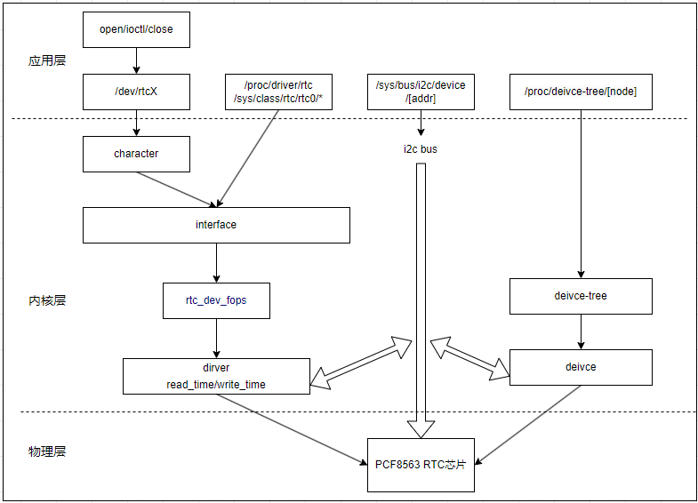
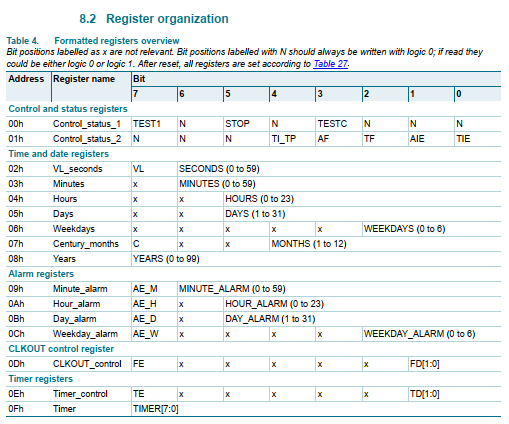

# rtc管理子系统

RTC（Real-Time Clock）模块，即实时时钟模块，是一种用于测量时间的电子设备；主要功能包含时间记录(年月日时分秒，星期)、闹钟定时功能；可以实现基于星期，以及时分秒的定时功能。

RTC模块拥有独立于SOC的供电功能，一般为纽扣电池，从而实现准确的时间记录(掉电执行)；设备唤醒，配合芯片的唤醒引脚或者内部模块实现。RTC从硬件区分来说，分为芯片内置的RTC以及外部的RTC器件，不过它们的区别只在于硬件访问的操作。对于内核加载的方式，以及应用访问的功能实现，则基本一致。

RTC最终会以字符设备形式向用户空间提供/dev/rtcX，但驱动开发者通常无需自行实现字符设备，只需要实现rtc_class_ops并注册RTC设备即可。

对于RTC设备驱动，目录如下所示。

- [rtc设备框架](#rtc_frame)
- [rtc驱动说明](#rtc_driver)
  - [rtc操作接口](#rtc_interface)
  - [rtc设备树](#rtc_chip_tree)
  - [rtc驱动代码](#rtc_driver_code)
- [rtc应用代码](#rtc_app)
- [返回目录](#return_back)

本章节快速学习知识点：

1. 回顾i2c器件驱动的实现方法。
2. 系统中注册rtc设备的方法，以及和上层交互的接口。
3. 应用层访问rtc设备的接口。

## rtc_frame

这里提供外接在i2c接口的rtc器件在系统中注册和访问的实现。



其中大部分功能由内核实现，对于用户来说，主要包含两部分实现。

1. 实现设备树，生成rtc设备。
2. 实现驱动，在系统中创建rtc设备文件，添加访问的接口。

另外RTC支持二进制和BCD两种存储模式，这两种模式的转换如下所示。

```c
// 21 => 0x21
// BIN => BCD
out_bcd = ((in_bin / 10) << 4 | (in_bin % 10))

// BCD => BIN
// 0x21 => 21
out_bin = ((in_bcd >> 4) * 10) + (in_bcd & 0x0F)
```

可以看到，BCD不是十六进制数值，而是用4位二进制分别存储十进制的每一位数字，通过高4位和低4位的分别处理，既可以实现BCD和二进制数据之间的转换。

## rtc_driver

本节中使用i2c接口访问的rtc器件PCF8563；其实现参考i2c总线如何加载器件驱动，以及rtc子系统的应用。

其中i2c总线部分参考：[i2c驱动和接口说明](./ch03-07.i2c_frame.md)；对于rtc子系统的应用，说明如下所示。

### rtc_interface

关于rtc的相关接口并不复杂，主要有申请rtc管理结构资源，向系统中注册rtc设备和管理类等。

关于注册rtc设备的接口，具体如下所示。

```c
// 申请管理RTC设备的资源
// @dev: rtc器件所在的设备节点
// return: 成功返回rtc_device结构，失败返回NULL
struct rtc_device *devm_rtc_allocate_device(struct device *dev)

// 向系统中注册rtc设备
// @owner: 模块拥有者，一般为驱动模块
// @rtc: rtc设备结构
// return: 成功返回0，失败返回负数
#define devm_rtc_register_device(device) \
    __devm_rtc_register_device(THIS_MODULE, device)
int __devm_rtc_register_device(struct module *owner, struct rtc_device *rtc)

// 向系统中注册rtc设备, 返回rtc_device
// 执行两步骤
// 1. devm_rtc_allocate_device
// 2. devm_rtc_register_device
rtc_device *devm_rtc_device_register(struct device *dev,
                const char *name,
                const struct rtc_class_ops *ops,
                struct module *owner)
```

注意：**在Linux系统中，优先使用devm_rtc_allocate_device+devm_rtc_register_device组合的方式进行RTC设备的注册**。

对于RTC模块最关键的就是其中的"struct rtc_device"结构，保存所有rtc信息，具体如下所示。

```c
// rtc设备操作接口
struct rtc_class_ops {
    int (*ioctl)(struct device *, unsigned int, unsigned long);     //ioctl控制函数，用于控制命令
    int (*read_time)(struct device *, struct rtc_time *);           //读取时间(驱动实现)
    int (*set_time)(struct device *, struct rtc_time *);            //设置时间(驱动实现)
    int (*read_alarm)(struct device *, struct rtc_wkalrm *);        //读取闹钟时间(驱动实现)
    int (*set_alarm)(struct device *, struct rtc_wkalrm *);         //设置闹钟时间(驱动实现)
    int (*proc)(struct device *, struct seq_file *);                //procfs操作接口
    int (*alarm_irq_enable)(struct device *, unsigned int enabled); //闹钟中断功能使能(驱动实现)
    int (*read_offset)(struct device *, long *offset);              //读取偏移时间
    int (*set_offset)(struct device *, long offset);                //设置偏移时间
    int (*param_get)(struct device *, struct rtc_param *param);     //获取rtc参数
    int (*param_set)(struct device *, struct rtc_param *param);     //设置rtc参数
};

// rtc设备结构
struct rtc_device {
    struct device dev;                  // 注册时创建的rtc设备
    struct module *owner;               // rtc设备的拥有者，一般为注册的驱动

    int id;                             // rtc设备编号

    const struct rtc_class_ops *ops;    //定义rtc支持的操作函数，用于应用层访问

    //......

    unsigned long features[BITS_TO_LONGS(RTC_FEATURE_CNT)];     // rtc定时器定义支持的功能
    /*
        #define RTC_FEATURE_ALARM               0               // 支持闹钟功能
        #define RTC_FEATURE_ALARM_RES_MINUTE    1               // 支持闹钟，分辨率为分钟
        #define RTC_FEATURE_NEED_WEEK_DAY       2               // 支持星期记录
        #define RTC_FEATURE_ALARM_RES_2S        3               // 支持闹钟，分辨率为2s
        #define RTC_FEATURE_UPDATE_INTERRUPT    4               // RTC更新产生中断
        #define RTC_FEATURE_CORRECTION          5               // 支持时间校正功能
        #define RTC_FEATURE_BACKUP_SWITCH_MODE  6               // 支持备份模式
        #define RTC_FEATURE_ALARM_WAKEUP_ONLY   7               // 闹钟仅用于唤醒
    */

    time64_t range_min;                 // 最小秒数，用于描述rtc支持的最小时间
    time64_t range_max;                 // 最大秒数，用于描述rtc支持的最大时间
};
```

### rtc_chip_tree

rtc器件PCF8563连接在i2c2，有一个中断引脚gpio1_2，用于上报alarm信息。

关于rtc器件的设备树，具体如下所示。

```c
&i2c2 {
    //...
    pinctrl-0 = <&pinctrl_i2c2>;        // 复用的引脚关系
    status = "okay";                    // i2c2模块使能

    pcf8563: pcf8563@51 {
        compatible = "rmk,pcf8563";     // 标签，用于驱动中匹配
        reg = <0x51>;                   // i2c访问设备的器件地址
        pinctrl-names = "default";      // rtc复用引脚的别名
        pinctrl-0 = <&pinctrl_rtc>;     // rtc复用引脚功能定义
        interrupt-parent = <&gpio1>;    // rtc alarm引脚对应的中断控制器
        interrupts = <2 IRQ_TYPE_EDGE_FALLING>;            // rtc alarm引脚对应的中断线号，触发方式(闹钟触发后拉低信号)
        interrupt-gpios = <&gpio1 2 GPIO_ACTIVE_LOW>;   // 中断引脚对应的gpio
        status = "okay";                // rtc模块使能
    };
};
```

可以看到，PCF8563虽然是RTC设备，但是硬件仍然是挂载在I2C总线上处理，这部分可以参考I2C总线驱动的实现，这里不再赘述。

### rtc_driver_code

上面实现了定义的设备节点，下一步就算实现器件的操作的代码，并关联的系统内核中。

- 器件驱动加载的接口

作为i2c外部设备，这部分的内容和如何加载I2C驱动一致，这里不在赘述。

- 器件注册到系统内核的实现

```c
static int i2c_probe(struct i2c_client *client, const struct i2c_device_id *id)
{
    int ret;
    int irq;
    struct pcf8563_data *chip = NULL;
    unsigned char buf;

    // 1.申请管理RTC PCF8563的数据块
    chip = devm_kzalloc(&client->dev, sizeof(struct pcf8563_data), GFP_KERNEL);
    if (!chip){
        dev_err(&client->dev, "chip malloc error!\n");
        return -ENOMEM;
    }
    chip->client = client;
    i2c_set_clientdata(client, chip);

    // 2. 申请rtc资源，并注册到内核
    chip->rtc = devm_rtc_allocate_device(&client->dev);
    if (IS_ERR(chip->rtc)){
        dev_err(&client->dev, "rtc alloc device failed!\n");
        return PTR_ERR(chip->rtc);
    }

    chip->rtc->owner = THIS_MODULE;
    chip->rtc->ops = &pcf8563_ops;
    set_bit(RTC_FEATURE_ALARM_RES_MINUTE, chip->rtc->features);
    clear_bit(RTC_FEATURE_UPDATE_INTERRUPT, chip->rtc->features);
    chip->rtc->range_min = RTC_TIMESTAMP_BEGIN_2000;
    chip->rtc->range_max = RTC_TIMESTAMP_END_2099;
    chip->rtc->set_start_time = true;

    ret = devm_rtc_register_device(chip->rtc);
    if (ret) {
        dev_err(&client->dev, "rtc register failed!\n");
        return ret;
    }

    // ......
}
```

- 初始化关联rtc硬件处理

```c
static int i2c_probe(struct i2c_client *client, const struct i2c_device_id *id)
{
    //......

    buf = 0;
    dev_err(&client->dev, "start write!\n");
    ret = pcf8563_write_block(client, PCF8563_REG_CONTROL2, &buf, 1);
    if (ret < 0) {
        dev_err(&client->dev, "%s: write error\n", __func__);
        return ret;
    }

    // 4. 配置中断相关引脚
    chip->irq_desc = devm_gpiod_get(&client->dev, "interrupt", GPIOD_IN);
    if (IS_ERR(chip->irq_desc)) {
        dev_info(&client->dev, "devm_gpiod_get error!\n");
        return PTR_ERR(chip->irq_desc);
    }
    irq = gpiod_to_irq(chip->irq_desc);
    if (irq < 0) {
        return irq;
    }
    ret = devm_request_threaded_irq(&client->dev, 
                            irq, 
                            NULL, 
                            pcf8563_irq_handler, 
                            IRQF_ONESHOT | IRQF_TRIGGER_FALLING, 
                            "rtc_irq", 
                            (void *)chip);
    if (ret < 0) {
        dev_err(&client->dev, "rtc interrupt config:%d\n", ret);
        return -EINVAL;
    }

    //......
}
```

- 内核访问具体硬件的接口

RTC模块提供了访问应用层的接口，不过具体操作还涉及对于硬件的读写操作，这部分需要结合PCF8563的产品手册进行处理。



关于寄存器的说明来自于"8.Functional desciption"的说明。

```c
// 获取当前时间
static int pcf8563_get_time(struct device *dev, struct rtc_time *tm)
{
    struct i2c_client *client = to_i2c_client(dev);
    struct pcf8563_data *chip = i2c_get_clientdata(client);
    unsigned char buf[9];
    int ret;

    ret = pcf8563_read_block(client, PCF8563_REG_CONTROL1, buf, 9);
    if (ret) {
        dev_err(&client->dev, "dev read block issue!\n");
        return ret;
    }

    if (buf[PCF8563_REG_SECONDS] & (1<<7)) {
        dev_err(&client->dev, "low voltage detected, date/time is not reliable.\n");
        return -EINVAL;
    }

    tm->tm_sec = bcdToDec(buf[PCF8563_REG_SECONDS] & 0x7F);
    tm->tm_min = bcdToDec(buf[PCF8563_REG_MINUTES] & 0x7F);
    tm->tm_hour = bcdToDec(buf[PCF8563_REG_HOURS] & 0x3F); /* rtc hr 0-23 */
    tm->tm_mday = bcdToDec(buf[PCF8563_REG_DAYS] & 0x3F);
    tm->tm_wday = buf[PCF8563_REG_WEEKDAYS] & 0x07;
    tm->tm_mon = bcdToDec(buf[PCF8563_REG_MONTHS] & 0x1F) - 1; /* rtc mn 1-12 */
    tm->tm_year = bcdToDec(buf[PCF8563_REG_YEARS]);
    chip->c_polarity = (buf[PCF8563_REG_MONTHS] & (1<<7)) ? 1 : 0;
    
    // 依据当前驱动约定解释
    if (chip->c_polarity) {
        tm->tm_year += 100;
    }

    dev_info(&client->dev, "%s: tm is secs=%d, mins=%d, hours=%d, "
        "mday=%d, mon=%d, year=%d, wday=%d\n",
        __func__,
        tm->tm_sec, tm->tm_min, tm->tm_hour,
        tm->tm_mday, tm->tm_mon, tm->tm_year, tm->tm_wday);

    return 0;
}

// 设置当前时间
static int pcf8563_set_time(struct device *dev, struct rtc_time *tm)
{
    struct i2c_client *client = to_i2c_client(dev);
    struct pcf8563_data *chip = i2c_get_clientdata(client);
    unsigned char buf[9];
    int ret;

    dev_info(&client->dev, "%s: secs=%d, mins=%d, hours=%d, "
        "mday=%d, mon=%d, year=%d, wday=%d\n",
        __func__,
        tm->tm_sec, tm->tm_min, tm->tm_hour,
        tm->tm_mday, tm->tm_mon, tm->tm_year, tm->tm_wday);

    /* hours, minutes and seconds */
    buf[PCF8563_REG_SECONDS] = decToBcd(tm->tm_sec);
    buf[PCF8563_REG_MINUTES] = decToBcd(tm->tm_min);
    buf[PCF8563_REG_HOURS] = decToBcd(tm->tm_hour);
    buf[PCF8563_REG_DAYS] = decToBcd(tm->tm_mday);
    buf[PCF8563_REG_WEEKDAYS] = tm->tm_wday & 0x07;

    /* month, 1 - 12 */
    buf[PCF8563_REG_MONTHS] = decToBcd(tm->tm_mon + 1);

    /* year and century */
    if(tm->tm_year >= 100) {
        buf[PCF8563_REG_YEARS] = decToBcd(tm->tm_year - 100);
        buf[PCF8563_REG_MONTHS] |= (1<<7);
        chip->c_polarity = 1;
    } else {
        buf[PCF8563_REG_YEARS] = decToBcd(tm->tm_year);
        chip->c_polarity = 0;
    }

    ret =  pcf8563_write_block(client, PCF8563_REG_SECONDS, buf + PCF8563_REG_SECONDS, 9 - PCF8563_REG_SECONDS);
    if (ret) {
        dev_err(&client->dev, "dev read block issue!.\n");
        return ret;  
    }
    return 0;
}

// 读取闹钟时间
static int pcf8563_read_alarm(struct device *dev, struct rtc_wkalrm *tm)
{
    struct i2c_client *client = to_i2c_client(dev);
    unsigned char buf[4];
    int ret;

    ret = pcf8563_read_block(client, PCF8563_REG_ALARM_MINUTE, buf, 4);
    if (ret) {
        dev_err(&client->dev, "pcf8563_read_block failed:%d!\n", ret);
        return ret;
    }

    dev_dbg(&client->dev,
        "%s: raw data is min=%02x, hr=%02x, mday=%02x, wday=%02x\n",
        __func__, buf[0], buf[1], buf[2], buf[3]);

    tm->time.tm_sec = 0;
    tm->time.tm_min = bcdToDec(buf[0] & 0x7F);
    tm->time.tm_hour = bcdToDec(buf[1] & 0x3F);
    tm->time.tm_mday = bcdToDec(buf[2] & 0x3F);
    tm->time.tm_wday = bcdToDec(buf[3] & 0x7);

    ret = pcf8563_get_alarm_mode(client, &tm->enabled, &tm->pending);
    if (ret) {
        dev_err(&client->dev, "pcf8563_get_alarm_mode err:%d!\n", ret);
        return ret;
    }

    dev_dbg(&client->dev, "%s: tm is mins=%d, hours=%d, mday=%d, wday=%d,"
        " enabled=%d, pending=%d\n", __func__, tm->time.tm_min,
        tm->time.tm_hour, tm->time.tm_mday, tm->time.tm_wday,
        tm->enabled, tm->pending);

    return 0;
}

// 设置闹钟底层回调
static int pcf8563_set_alarm(struct device *dev, struct rtc_wkalrm *tm)
{
    struct i2c_client *client = to_i2c_client(dev);
    unsigned char buf[4];
    int ret;

    buf[0] = decToBcd(tm->time.tm_min);
    buf[1] = decToBcd(tm->time.tm_hour);
    buf[2] = decToBcd(tm->time.tm_mday);
    buf[3] = tm->time.tm_wday & 0x07;

    ret = pcf8563_write_block(client, PCF8563_REG_ALARM_MINUTE, buf, 4);
    if (ret) {
        dev_err(&client->dev, "pcf8563_write_block write error\n");
        return ret;
    }

    dev_info(dev, "set alarm, wday:%d, day:%d, timer:%d:%d",
                tm->time.tm_wday, tm->time.tm_mday,
                tm->time.tm_hour, tm->time.tm_min);
    return pcf8563_set_alarm_mode(client, !!tm->enabled);
}

// 设置闹钟中断开启状态
static int pcf8563_alarm_irq_enable(struct device *dev, unsigned int enabled)
{
    return pcf8563_set_alarm_mode(to_i2c_client(dev), !!enabled);
}

// 定义内核通过ioctl访问的接口
static const struct rtc_class_ops pcf8563_ops = {
    .ioctl = pcf8563_rtc_ioctl,
    .read_time    = pcf8563_get_time,       //读取当前时间
    .set_time    = pcf8563_set_time,        //设置当前时间
    .read_alarm    = pcf8563_read_alarm,    //读取当前闹钟设置时间
    .set_alarm    = pcf8563_set_alarm,      //设置当前闹钟时间
    .alarm_irq_enable = pcf8563_alarm_irq_enable,   //定义是否开启irq闹钟定时中断
};
```

- rtc中断alarm处理实现

```c
static irqreturn_t pcf8563_irq_handler(int irq, void *data)
{
    struct pcf8563_data *chip = (struct pcf8563_data *)data;
    struct i2c_client *client = chip->client;
    int ret;
    char pending;

    ret = pcf8563_get_alarm_mode(client, NULL, &pending);
    if (ret) {
        dev_err(&client->dev, "pcf8563_get_alarm_mode:%d!\n", ret);
        return ret;
    }

    rtc_update_irq(chip->rtc, 1, RTC_IRQF | RTC_AF);
    pcf8563_set_alarm_mode(client, 1);
    return IRQ_RETVAL(IRQ_HANDLED);
}
```

至此关于rtc驱动的实现大致讲解完毕。

详细代码可以参考: [pcf8563 rtc驱动程序](./file/ch03-11/kernel_rtc_pcf8563.c)。

对于内部rtc，其实现也大致相同，不过将i2c访问器件的部分替换为访问内部寄存器的实现，中断也不是外部的引脚中，而是内部的rtc中断，其它基本一致。

## rtc_app

当rtc注册成功后，会在系统中创建/dev/rtcX，其中X根据注册驱动的顺序确认。我们可以通过hwclock配合date命令操作此设备文件，实现对于时间的读取和写入，同步到系统时间中。

```shell
# 从rtc读取数据
hwclock -r -f /dev/rtc1             # 从rtc中读取时间并显示

# 从rtc读取时间并设置到系统中
hwclock -s -f /dev/rtc1             # 从rtc中读取时间到系统date中
date                                # 查看当前的系统时间

# 将系统时间设置到rtc1中
date -s '2024-03-29 22:40:00'       # 设置系统date时间
hwclock -w -f /dev/rtc1             # 将date时间同步到系统rtc中
```

当然，也可以通过C语言接口访问此设备文件，这里需要先理解如下结构。

```c
struct rtc_time {
    int tm_sec;     // 秒 – 取值区间为[0,59]
    int tm_min;     // 分 - 取值区间为[0,59]
    int tm_hour;    // 时 - 取值区间为[0,23]
    int tm_mday;    // 一个月中的日期 - 取值区间为[1,31]
    int tm_mon;     // 月份（从一月开始，0代表一月） - 取值区间为[0,11]
    int tm_year;    // 年份，其值等于实际年份减去1900
    int tm_wday;    // 一周中的第几天 - 取值区间为[0,6]，0代表星期天
    int tm_yday;    // 一年中的第几天 - 取值区间为[0,365]，0代表1月1日
    int tm_isdst;   //夏令时标识符，实行夏令时的时候，tm_isdst为正。不实行夏令时的时候，tm_isdst为0；不了解情况时，tm_isdst为负
};

struct rtc_wkalrm {
    unsigned char enabled;  /* 0 = alarm disabled, 1 = alarm enabled */
    unsigned char pending;  /* 0 = alarm not pending, 1 = alarm pending */
    struct rtc_time time;   /* time the alarm is set to */
};

// ioctl处理rtc的命令
RTC_RD_TIME     //读取当前时间
RTC_SET_TIME    //设置当前时间
RTC_WKALM_SET   //设置alarm闹钟
RTC_WKALM_RD    //读取alarm闹钟设置
```

应用层访问rtc设备文件的应用如下。

```c
#include <fcntl.h>
#include <stdio.h>
#include <unistd.h>
#include <sys/ioctl.h>
#include <linux/rtc.h>
#include <poll.h>
#include <sys/stat.h>
#include <signal.h>

struct rtc_time rtc_time = {0};
struct rtc_wkalrm alarm_time = {0};
static unsigned int flag = 0;

#define RTC_DEVICE "/dev/rtc1"

static void alarm_signal_func(int signum)
{
    flag = 1;
    printf("alarm signal!\r\n");
}

int main(int argc, char *argv[])
{
    int device_fd;
    int retval, flags;

    device_fd = open(RTC_DEVICE, O_RDWR | O_NONBLOCK);         //打开rtc设备文件
    if (device_fd < 0) {
        printf("open %s error!\r\n", RTC_DEVICE);
        return -1;
    }

    retval = ioctl(device_fd, RTC_RD_TIME, &rtc_time);          //读取当前时间
    if (retval >= 0) {
        printf("timer:%d:%d:%d\n", rtc_time.tm_hour, rtc_time.tm_min, rtc_time.tm_sec);
    }
    printf("retval:%d\n", retval);

    // 绑定I/O event，对应底层的中断触发
    fcntl(device_fd, F_SETOWN, getpid());
    flags = fcntl(device_fd, F_GETFD);
    fcntl(device_fd, F_SETFL, flags | FASYNC);
    signal(SIGIO, alarm_signal_func);                          

    rtc_time.tm_min += 1;
    if (rtc_time.tm_min == 60) {
        rtc_time.tm_min = 0;
        rtc_time.tm_hour += 1;
    }
    alarm_time.enabled = 1;
    alarm_time.time = rtc_time;
    retval = ioctl(device_fd, RTC_WKALM_SET, &alarm_time);  //设置alarm时间，到时间后触发alarm中断
    if (retval >= 0) {
        printf("set alarm success!\n");
    }
    printf("retval:%d\n", retval);   

    while (!flag) {
        sleep(1);
    }

    close(device_fd);
    return 0;
}
```

## summary

本文以I2C接口RTC器件PCF8563为例，介绍了Linux RTC子系统的基本框架和驱动实现方法。

首先分析了RTC模块的主要功能，包括时间记录、闹钟定时以及掉电保持等特性，并说明了RTC器件常见的BCD时间存储方式及其与二进制数据之间的转换关系。随后结合RTC子系统框架，介绍了RTC设备的注册流程，并以PCF8563为例，详细介绍了RTC驱动的实现流程。并提供了应用层访问的方法。

完整的RTC模块功能，主要包含以下方面。

- RTC硬件，具体的外设模块，可以是内部器件或者I2C外设。
- RTC驱动，用于驱动RTC硬件，实现RTC的注册、初始化、读写、设置、闹钟定时等功能的实现
- RTC子系统，内核提供的，管理RTC模块的接口和管理逻辑。
- 用户应用，用户访问RTC设备文件的方法。

上述各部分共同组成了RTC的模块功能，在实际开发调试中，系统时间出现问题，也要从这四个方面去分析解决，才能事半功倍。

## return_back

[返回目录](../README.md)

