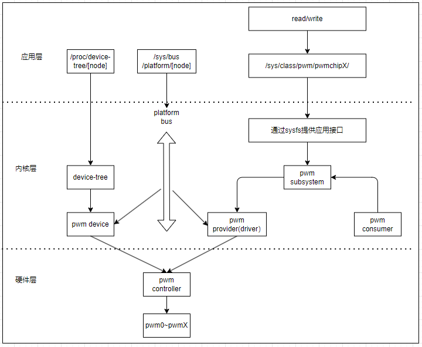
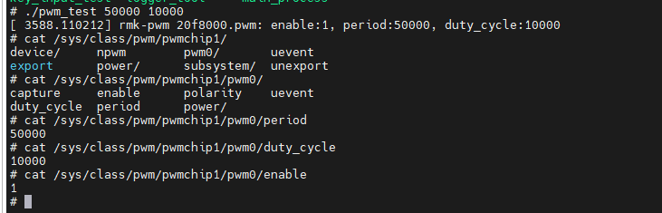

# PWM子系统设备框架

PWM, 又称脉冲宽度调制模块，是一种重要的电子控制组件，其工作原理和应用十分广泛。PWM模块通过调整占空比来改变电路中的电流或电压，从而实现对设备的控制。常见的支持PWM输出控制的设备有LED，屏幕背光调节，风扇转速管理，电机控制(直流电机)以及电源管理等。

对于PWM模块来说，需要关注的的配置项有周期，占空比以及极性，详细说明如下。

1. PWM周期: PWM周期是PWM信号中两个有效电平开始的时间间隔，它包含了高电平和低电平两个时间段，是PWM信号频率的倒数
2. PWM占空比: PWM占空比是指脉冲波中有效电平时间(占空时间)与PWM周期的比率，它是PWM信号的一个重要参数
3. PWM极性: PWM极性是指PWM信号的有效电平状态，它决定了PWM信号是高电平有效还是低电平有效

当实现PWM驱动时，就需要在系统中配置PWM的接口，以及驱动中实现对PWM的寄存器操作，后续分别进行说明。PWM属于芯片内部的模块，不属于具体的总线，由内部platform总线统一管理。PWM的框架如下所示。



可以看的，PWM作为SOC内部模块，由platform总线管理，一方面通过PWM子系统配合设备树来管理硬件寄存器，控制上面提到的PWM的输出配置，另一方面作为PWM provider，可以被其它PWM Consumer或者应用层以设备文件方式进行访问控制。PWM一般不单独作为独立硬件，而是配合Consumer成为控制其它模块的组件，如背光，温控风扇，调压模块等，实现更复杂的功能。

- [pwm数据结构格式](#pwm_structure)
- [pwm驱动实现](#pwm_driver)
- [pwm应用层操作方法](#pwm_app)
- [pwm consumer使用接口](#pwm_consumer)

## pwm_structure

pwm设备在系统中由pwm设备子系统管理，通过结构体"struct pwm_chip"管理，结构如下所示。

```c
//pwm设备结构，包含的设备信息
struct pwm_device {
    const char *label;          //pwm设备名称
    unsigned long flags;        //与PWM相关联的标志
    unsigned int hwpwm;         //pwm对于每个芯片的相对索引
    unsigned int pwm;           //pwm的全局索引
    struct pwm_chip *chip;      //所属的pwm控制器
    void *chip_data;            //与pwm设备相关的控制器私有数据

    struct pwm_args args;       //pwm变量
    struct pwm_state state;     //pwm最后应用状态
    struct pwm_state last;      //pwm最后实现的状态(用于测试)
};

//pwm操作接口，最关键的是apply和get_state
struct pwm_ops {
    int (*request)(struct pwm_chip *chip, struct pwm_device *pwm);      //请求pwm资源执行的钩子函数
    void (*free)(struct pwm_chip *chip, struct pwm_device *pwm);        //释放pwm资源执行的钩子函数
    int (*capture)(struct pwm_chip *chip, struct pwm_device *pwm,       
                struct pwm_capture *result, unsigned long timeout);     //捕获并报告pwm信号
    int (*apply)(struct pwm_chip *chip, struct pwm_device *pwm,
                const struct pwm_state *state);                         //用于应用新的pwm配置，支持设置pwm需要实现
    int (*get_state)(struct pwm_chip *chip, struct pwm_device *pwm,
                struct pwm_state *state);                               //获取当前的pwm配置，支持获取pwm状态需要实现
    struct module *owner;                                               //有助于防止删除导出活动pwm的模块
};

//pwm节点信息
struct pwm_chip {
    struct device *dev;         //pwm控制器对应的设备节点
    const struct pwm_ops *ops;  //pwm定义的应用层访问接口
    int base;                   //控制器管理的第一个pwm的值
    unsigned int npwm;          //控制器管理的pwm个数

    struct pwm_device * (*of_xlate)(struct pwm_chip *pc,
                    const struct of_phandle_args *args);    //请求一个PWM设备给定一个设备树脉宽指示
    unsigned int of_pwm_n_cells;                            //在设备树PWM指示符中预期的单元数

    /* only used internally by the PWM framework */
    struct list_head list;      //供内部使用的列表节点
    struct pwm_device *pwms;    //由框架分配的PWM器件列表
};
```

对于系统中注册PWM设备，需要定义struct pwm_chip结构，添加到内核中，操作如下。

```c
//将pwm设备注册到系统控制的接口
//dev: pwm对应的设备节点
//chip：pwm控制器信息
int devm_pwmchip_add(struct device *dev, struct pwm_chip *chip)

//此函数执行后，会在/sys/class/pwm下创建pwmchinX的目录，管理对应pwm信息
//其中X是根据驱动加载的顺序，按照编号从0，1，2...向上增加
```

## pwm_driver

上面讲解了pwm的结构，这里讲解pwm驱动如何实现的流程。pwm作为内部模块，也由platform总线进行管理，其实现流程如下所示。

1. 确定pwm硬件，输出的引脚
2. 实现pwm硬件对应的设备树，用于驱动匹配
3. 实现注册驱动，匹配设备树的基本框架
4. 关联pwm硬件，实现访问pwm寄存器的接口
5. 完成pwmchip注册内核，用于应用层访问文件

### pwm_devicetree

在实现设备树前，首先确定硬件使用的PWM接口，这里使用的为: CSI_VSYNC/PWM7_OUT。

PWM属于soc的内部模块，因此不需要复杂的创建，只需要增加如下两部分即可实现功能。

1. 增加pwm对应引脚的复用设置
2. 覆盖驱动的状态，置为开启状态

```c
// 芯片原厂提供pwm7设备树
pwm7: pwm@20f8000 {
    compatible = "fsl,imx6ul-pwm", "fsl,imx27-pwm";                 //pwm标签，用于设备树匹配
    reg = <0x020f8000 0x4000>;                                      //控制pwm模块的寄存器
    interrupts = <GIC_SPI 116 IRQ_TYPE_LEVEL_HIGH>;                 //pwm中断，<中断控制器 中断线号 中断触发电平>
    clocks = <&clks IMX6UL_CLK_PWM7>,                               //pwm时钟，ipg为pwm的时钟源，per为pwm经过分频的时钟  
            <&clks IMX6UL_CLK_PWM7>;
    clock-names = "ipg", "per";
    #pwm-cells = <3>;                                               //描述引用pwm后，pwm配置项的个数
    status = "disabled";                                            //pwm状态，关闭
};

// 用户扩展pwm7设备树
&pwm7 {
    pinctrl-names = "default";                                      //指定pinctrl的默认配置名称
    pinctrl-0 = <&pinctrl_pwm7>;                                    //指定pinctrl的引脚复用
    status = "okay";                                                //pwm状态，开启
};

&iomuxc {
    //...

    pinctrl_pwm7: pwm7grp {
        fsl,pins = <
            MX6UL_PAD_CSI_VSYNC__PWM7_OUT            0x110b0            //指定引脚的复用功能，PWM输出模式
        >;
    };
}
```

### pwm_sys_register

关于pwm的驱动代码实现，在路径"drivers/pwm/pwm-imx27.c"，从这里开始进行详细解析。首先是pwm驱动加载到内核的框架，这部分和其它platform驱动加载基本一致。具体代码如下。

```c
static const struct of_device_id pwm_imx27_dt_ids[] = {
    { .compatible = "fsl,imx27-pwm", },
    { /* sentinel */ }
};
MODULE_DEVICE_TABLE(of, pwm_imx27_dt_ids);

static int pwm_imx27_probe(struct platform_device *pdev)
{
    //...

    return 0;
}

//用于匹配驱动的结构体
static struct platform_driver imx_pwm_driver = {
    .driver = {
        .name = "pwm-imx27",
        .of_match_table = pwm_imx27_dt_ids,
    },
    .probe = pwm_imx27_probe,
};
module_platform_driver(imx_pwm_driver); //封装的platform匹配驱动函数

MODULE_LICENSE("GPL v2");
MODULE_AUTHOR("Sascha Hauer <s.hauer@pengutronix.de>");
```

### pwm_hardware

在驱动中操作硬件时，和对于单片机的操作类似，主要包含以下操作。

- 获取硬件资源，使能模块的clk时钟

```c
static int pwm_driver_probe(struct platform_device *pdev)
{
    //......

    //2.获取PWM相关的管理时钟
    info->clk_ipg = devm_clk_get(&pdev->dev, "ipg");
    if (IS_ERR(info->clk_ipg)) {
        dev_err(&pdev->dev, "getting ipg clock failed\r\n!");  
        return -ENXIO;
    }
    info->clk_per = devm_clk_get(&pdev->dev, "per");
    if (IS_ERR(info->clk_per)) {
        dev_err(&pdev->dev, "getting per clock failed\r\n!");  
        return -ENXIO;
    }
    /* 模块时钟管理，模块开启则打开时钟，反之则关闭 */
    ret = pwm_clk_enable(info);
    if (ret) {
        dev_err(&pdev->dev, "clk perpare enabled failed!\r\n");
        return ret;
    }

    //3.获取PWM相关的寄存器资源
    info->mmio_base = devm_platform_ioremap_resource(pdev, 0);
    if (IS_ERR(info->mmio_base)) {
        dev_err(&pdev->dev, "getting reg resource failed\r\n!");  
        return -ENXIO;       
    }
    pwmcr = readl(info->mmio_base + MX3_PWMCR);     //需要开启时钟后，才能读取寄存器
    if (!(pwmcr & MX3_PWMCR_EN)) {
        pwm_clk_disable(info);
    }

    //......
}
```

- 设置PWM的周期，占空比和时钟频率的接口

```c
struct pwm_state {
    u64 period;                     //PWM周期时间，单位ns
    u64 duty_cycle;                 //PWM有效时间(占空比时间)，单位ns
    enum pwm_polarity polarity;     //PWM极性，有效电平是高电平还是低电平
    bool enabled;                   //PWM使能状态
    bool usage_power;               //如果设置，PWM驱动器只需要保持功率输出，但在信号形式方面有更多的自由，可通过移相改变EMI特性(I.MX6ULL不支持)
};

static int pwm_driver_apply(struct pwm_chip *chip, struct pwm_device *pwm, const struct pwm_state *state)
{
    unsigned long period_cycles, duty_cycles, prescale, counter_check, flags;
    struct pwm_driver_info *info;
    void __iomem *reg_sar;
    __force u32 sar_last, sar_current;
    struct pwm_state cstate;
    unsigned long long c;
    unsigned long long clkrate;
    int ret;
    u32 cr, timeout = 1000;

    /*1. 调用pwm_imx27_apply, 获取当前pwm设置状态 */
    info = container_of(chip, struct pwm_driver_info, chip);
    reg_sar = info->mmio_base + MX3_PWMSAR;
    pwm_get_state(pwm, &cstate); 
    clkrate = clk_get_rate(info->clk_per);

    /*2. 判断当前pwm状态，如果开启则等待缓存中处理完，未开启则复位pwm模块*/
    if (cstate.enabled) {
        pwm_wait_fifo_slot(info, pwm);
    } else {
        ret = pwm_clk_enable(info);
        if (ret) {
            return ret;
        }
        pwm_sw_reset(info);
    }

    /* 3. 根据周期时间，计算分频和设置周期数，period的单位是ns*/
    c = clkrate * state->period;
    do_div(c, NSEC_PER_SEC);          
    period_cycles = c;
    prescale = period_cycles / 0x10000 + 1;     //根据周期计算分频系数，peroid为16位，所以分频后要保证peroid小于16位
    period_cycles /= prescale;
    if (period_cycles > 2) {
        period_cycles -= 2;
    }else {
        period_cycles = 0;
    }

    /* 4.根据duty_cycles和分频，确定duty_cycles的设置值 */
    c = clkrate * state->duty_cycle;
    do_div(c, NSEC_PER_SEC);
    duty_cycles = c;
    duty_cycles /= prescale;

    /* 5.更新duty_cycle fifo更新
        (1)duty_cycle比当前值PWM设置大时，直接写入
        (2)duty_cycle比当前值PWM设置小时，根据当前计数器的值，先写入上一次PWM值，在修改为当前值(应该是为了解决PWM切换时波形不完整畸变的问题)
     */
    if (duty_cycles < info->duty_cycle) {
        c = clkrate * 1500;
        do_div(c, NSEC_PER_SEC);
        counter_check = c;
        sar_last = cpu_to_le32(info->duty_cycle);
        sar_current = cpu_to_le32(duty_cycles);

        spin_lock_irqsave(&info->lock, flags);
        if (state->period >= 2000) {
            while ((period_cycles - readl_relaxed(info->mmio_base + MX3_PWMCNR)) < counter_check) {
                if (!--timeout) {
                    break;
                }
            }
        }
        if (!(MX3_PWMSR_FIFOAV & readl_relaxed(info->mmio_base + MX3_PWMSR))) {
            __raw_writel(sar_last, reg_sar);
        }
        __raw_writel(sar_current, reg_sar);

        spin_unlock_irqrestore(&info->lock, flags);
    } else {
        writel(duty_cycles, info->mmio_base + MX3_PWMSAR);
    }
    info->duty_cycle = duty_cycles;

    /* 6. 写入周期寄存器, 配置寄存器，使能PWM */
    writel(period_cycles, info->mmio_base + MX3_PWMPR);
    cr = MX3_PWMCR_PRESCALER_SET(prescale) |
         MX3_PWMCR_STOPEN | MX3_PWMCR_DOZEN | MX3_PWMCR_WAITEN |
         FIELD_PREP(MX3_PWMCR_CLKSRC, MX3_PWMCR_CLKSRC_IPG_HIGH) |
         MX3_PWMCR_DBGEN;
    if (state->polarity == PWM_POLARITY_INVERSED)
        cr |= FIELD_PREP(MX3_PWMCR_POUTC,
                MX3_PWMCR_POUTC_INVERTED);
    if (state->enabled)
        cr |= MX3_PWMCR_EN;
    writel(cr, info->mmio_base + MX3_PWMCR);

    /* 7. 未开启pwm时，关闭PWM时钟 */
    if (!state->enabled) {
        pwm_clk_disable(info);
    }

    dev_info(chip->dev, "clk_rate:%lld, pwm state:%d, period:%ld, duty:%ld",
                        clkrate, 
                        state->enabled,
                        period_cycles,
                        duty_cycles);

    return 0;
}
```

可以看到，这里基本就是整个实现就是根据当前设置的PWM参数实现如下步骤。

1. 根据PWM配置参数计算出时钟分频，周期计数和占空比计数
2. 使能时钟，将时钟分频，周期计数，占空比计数，极性写入到硬件寄存器中
3. 使能PWM输出，此时硬件引脚上会有相应波形输出。

至于pwm_driver_get_state的实现，就是读取当前的寄存器值，还原成PWM的配置信息，返回到应用层。

```c
static int pwm_driver_get_state(struct pwm_chip *chip, struct pwm_device *pwm, struct pwm_state *state)
{
    struct pwm_driver_info *info;
    int ret;
    u32 period, prescaler, pwm_clk, val;
    u64 tmp;

    info = container_of(chip, struct pwm_driver_info, chip);
    ret = pwm_clk_enable(info);
    if(ret) {
        return ret;
    }

    val = readl(info->mmio_base + MX3_PWMCR);
    
    /*1. 获取PWM使能状态 */
    if (val & MX3_PWMCR_EN) {
        state->enabled = true;
    } else {
        state->enabled = false;
    }

    /*2. 获取当前pwm极性*/
    switch (FIELD_GET(MX3_PWMCR_POUTC, val)) {
        case MX3_PWMCR_POUTC_NORMAL:
            state->polarity = PWM_POLARITY_NORMAL;
            break;
        case MX3_PWMCR_POUTC_INVERTED:
            state->polarity = PWM_POLARITY_INVERSED;
            break;
        default:
            dev_warn(chip->dev, "can't set polarity, output disconnected\n");
    }

    /*3. 获取周期 */
    prescaler = MX3_PWMCR_PRESCALER_GET(val);
    pwm_clk = clk_get_rate(info->clk_per);
    val = readl(info->mmio_base + MX3_PWMPR);
    period = val >= MX3_PWMPR_MAX ? MX3_PWMPR_MAX : val;
    tmp = NSEC_PER_SEC * (u64)(period + 2) * prescaler;
    state->period = DIV_ROUND_UP_ULL(tmp, pwm_clk);

    /*4. 获取占空比, 管理时钟 */
    if (state->enabled) {
        val = readl(info->mmio_base + MX3_PWMSAR);
    } else {
        val = info->duty_cycle;
        pwm_clk_disable(info);
    }
    tmp = NSEC_PER_SEC * (u64)(val) * prescaler;
    state->duty_cycle = DIV_ROUND_UP_ULL(tmp, pwm_clk);

    dev_info(chip->dev, "enable:%d, period:%lld, duty_cycle:%lld\n", 
                        state->enabled, 
                        state->period, 
                        state->duty_cycle);
    return 0;
}
```

可以看到，对于硬件的访问，是使用最基础的writel和readl接口，驱动寄存器值，并将配置值写入寄存器操作；理解驱动，一定要去理解芯片模块的内部寄存器的功能和值，否则可能是空中楼阁。

### pwm_kernel_register

最后则是将pwmchip注册到内核的实现，这部分主要实现.apply和.get_state接口，分别用于设置PWM值和获取PWM状态，在配合上面的硬件访问接口进行设置。

```c
struct pwm_driver_info
{
    //...

    //pwm控制器结构
    struct pwm_chip     chip;
};

//pwm管理结构体
static const struct pwm_ops pwm_driver_ops = {
    .apply = pwm_driver_apply,           /* 设置PWM值 */
    .get_state = pwm_driver_get_state,   /* 获取PWM状态 */
    .owner = THIS_MODULE,
};

static int pwm_driver_probe(struct platform_device *pdev)
{
    //1. 申请pwm管理资源
    struct pwm_driver_info *info;
    info = devm_kzalloc(&pdev->dev, sizeof(*info), GFP_KERNEL);
    if(!info) {
        dev_err(&pdev->dev, "memory malloc failed!\r\n");
        return -ENOMEM;
    }

    //...

    //4.增加pwmchip设备到系统中(/sys/class/pwm/pwmchipX/export)
    info->duty_cycle = 0;
    info->chip.ops = &pwm_driver_ops;
    info->chip.dev = &pdev->dev;
    info->chip.npwm = 1;

    ret = devm_pwmchip_add(&pdev->dev, &info->chip);
    if (ret) {
        dev_err(&pdev->dev, "pwmchip add failed!\r\n");
        return ret;
    }

    spin_lock_init(&info->lock);
    dev_info(&pdev->dev, "pwm init success!\r\n");
}
```

至此，作为pwm模块的驱动实现完毕。将pwm注册到内核，就可以被应用层和其它pwm consumer进行访问。

## pwm_app

在前面说明过，驱动执行后会在/sys/class/pwm目录下增加pwmchipX的目录，根据驱动加载的顺序，本例中虽然使用PWM7，但是因为驱动第二个加载，因此对应pwmchip1。

```shell
/sys/class/pwm/pwmchip1/export                  # 导出pwm，开启pwm控制显示
/sys/class/pwm/pwmchip1/unexport                # 移除pwm，关闭pwm控制显示
/sys/class/pwm/pwmchip1/pwm0/enable             # 使能pwm输出，0关闭，1开启
/sys/class/pwm/pwmchip1/pwm0/period             # 设置pwm输出周期时间，单位ns
/sys/class/pwm/pwmchip1/pwm0/duty_cycle         # 设置pwm输出占空比时间，单位ns
/sys/class/pwm/pwmchip1/pwm0/polarity           # 设置pwm极性，normal高电平有效，inversed低电平有效
```

在Linux shell中测试如下。

```shell
echo 0 > /sys/class/pwm/pwmchip1/export                 # 关闭pwm0控制目录节点(0为pwmchip下支持的节点编号，默认为0)
echo 0 > /sys/class/pwm/pwmchip1/unexport               # 关闭pwm0控制目录节点
echo 50000 > /sys/class/pwm/pwmchip1/pwm0/period        # 设置pwm周期时间，50000ns
echo 10000 > /sys/class/pwm/pwmchip1/pwm0/duty_cycle    # 设置pwm占空比时间，10000ns
echo normal > /sys/class/pwm/pwmchip1/pwm0/polarity     # 设置pwm极性，高电平有效
```

在C语言中可以使用文件接口进行访问，实现如下。

```c
#define PWM_EXPORT  "/sys/class/pwm/pwmchip1/export"
#define PWM_ENABLE  "/sys/class/pwm/pwmchip1/pwm0/enable"
#define PWM_PEROID  "/sys/class/pwm/pwmchip1/pwm0/period"
#define PWM_DUTYCLE "/sys/class/pwm/pwmchip1/pwm0/duty_cycle"

#define MAX_SIZE    64

int pwm_setup(int state, unsigned int peroid, unsigned int duty_cycle)
{
    int fd_state, fd_peroid, fd_duty;
    int ret = 0, num;
    char str[MAX_SIZE];

    fd_state = open(PWM_ENABLE, O_RDWR);
    fd_peroid = open(PWM_PEROID, O_RDWR);
    fd_duty = open(PWM_DUTYCLE, O_RDWR);

    if (fd_state<0 || fd_peroid<0 || fd_duty<0) {
        ret = -1;
        printf("fd open failed\n");
        goto __exit;
    }

    //1. 设置pwm周期
    num = snprintf(str, MAX_SIZE, "%d", peroid);
    ret = write(fd_peroid, str, num);
    if (ret < 0) {
        printf("fd_peroid write failed\n");
        goto __exit;       
    }

    //2. 设置pwm占空比
    num = snprintf(str, MAX_SIZE, "%d", duty_cycle);
    ret = write(fd_duty, str, num);
    if (ret < 0) {
        printf("fd_duty write failed\n");
        goto __exit;       
    }

    //3. 开启pwm输出
    num = snprintf(str, MAX_SIZE, "%d", state);
    ret = write(fd_state, str, num);
    if(ret < 0) {
        printf("fd_state write failed\n");
        goto __exit;       
    }

__exit:
    close(fd_state);
    close(fd_peroid);
    close(fd_duty);
    return ret;
}

int main(int argc, char *argv[])
{
    int fd, ret;
    int peroid, duty;

    //1. 导出pwmchip下的pwm设备
    fd = open(PWM_EXPORT, O_WRONLY);
    if (fd < 0) {
        printf("export open failed\n");
        return -1;
    }
    ret = write(fd, "0", strlen("0"));
    if (ret < 0) {
        printf("export failed\n");
        return -1;
    }
    close(fd);

    //2. 设置pwm的配置信息
    if (argc > 2) {   
        peroid = atoi(argv[1]);
        duty = atoi(argv[2]);
        pwm_setup(1, peroid, duty);
    }
    
    return 0;
}
```

可以使用./pwm_test [peroid] [duty_cycle]来设置PWM的周期时间和占空比时间，结果如下所示。



## pwm_consumer

pwm的注册也为其它驱动模块提供了统一访问的接口，这些调用到pwm的驱动被称为pwm consumer。

关于pwm consumer常见的有PWM背光调节，PWM散热风扇等，其中背光会在下一节，[背光驱动管理框架](./ch03-13.brightness.md)中详细说明。

至于其它设备驱动访问pwm的接口则如下所示。

```c
// 根据名称从deivce，device-node中获取pwm节点信息
struct pwm_device *pwm_get(struct device *dev, const char *con_id);
struct pwm_device *of_pwm_get(struct device_node *np, const char *con_id);
struct pwm_device *devm_pwm_get(struct device *dev, const char *con_id);
struct pwm_device *devm_of_pwm_get(struct device *dev, struct device_node *np,
                                   const char *con_id);

// 释放已经获取的pwm设备
void pwm_put(struct pwm_device *pwm);
void devm_pwm_put(struct device *dev, struct pwm_device *pwm)

// 设置pwm参数
static inline int pwm_config(struct pwm_device *pwm, int duty_ns,
                 int period_ns)

// 使能pwm输出
static inline int pwm_enable(struct pwm_device *pwm)

// 关闭pwm输出
static inline void pwm_disable(struct pwm_device *pwm)

// 设置pwm极性，控制开启时的电平
static inline int pwm_set_polarity(struct pwm_device *pwm,
                   enum pwm_polarity polarity)
```

至此，关于pwm的驱动实现，应用层访问，以及其它设备驱动如何访问pwm的说明实现完毕。

## next_chapter

[返回目录](../README.md)

直接开始下一节说明: [背光驱动管理框架](./ch03-13.brightness.md)
