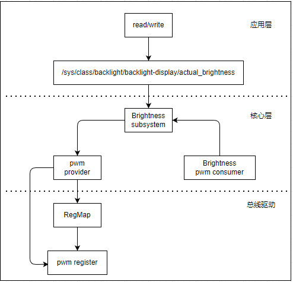
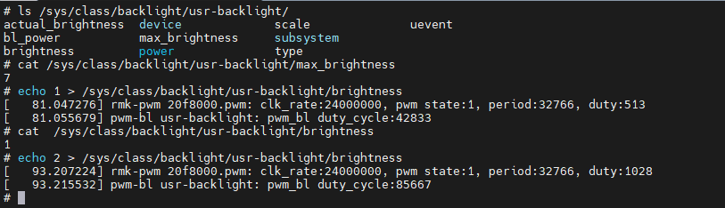
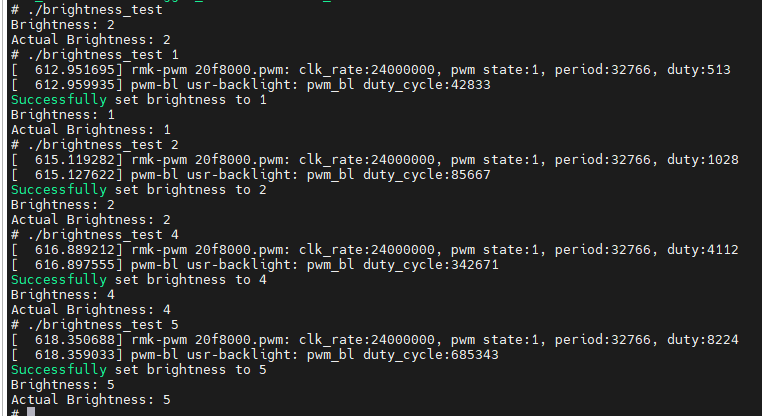

# 背光驱动管理框架

Linux背光管理框架用于控制和管理设备的背光亮度。该框架提供了统一的接口，允许不同类型的背光设备（如 LCD 屏幕、键盘背光等）通过标准的方式进行亮度调节。对于硬件的亮度调节，主要有以下几种模式。

1. PWM调光：通过快速地开关光源来调节亮度。具体来说，它会以固定的频率开启和关闭光源，改变每次开启时间（即脉冲宽度）占整个周期的比例（占空比），人眼因为视觉暂留效应，会感觉到亮度的变化。例如，当占空比为50%时，光源在一个周期内开启和关闭的时间各占一半，人眼感知到的亮度大约是最大亮度的一半。
2. DC调光：通过直接改变施加在光源上的直流电压或电流来调节亮度。电压或电流越大，光源越亮；反之则越暗。这种调光方式是连续的，不会出现光源的快速开关现象，亮度变化更加平滑。

本例中主要使用PWM调光模式，因此PWM作为背光驱动框架的provider，关联背光和PWM驱动，最终通过PWM输出到LCD的背光引脚，实现背光亮度的调节。



本节目录如下。

- [backlight接口](#interface)
- [backlight驱动实现实现](#backlight_driver)
  - [backlight设备树实现](#backlight_dts)
  - [backlight驱动代码](#driver_code)
- [backlight应用访问](#backlight_app)
- [使用内核中的backlight进行开发](#backlight_kernel)
- [下一章节](#next_chapter)

## interface

对于背光驱动管理框架，主要是像系统注册背光设备的接口，具体如下。

```c
// 注册背光设备
// @name : 背光设备名称
// @dev : 背光设备的父设备
// @devdata : 背光设备的私有数据
// @ops : 背光设备的操作函数集合
// @props : 背光设备的属性信息
// 返回值 : 注册成功返回背光设备的指针，失败返回NULL
struct backlight_device *
backlight_device_register(const char *name, struct device *dev, void *devdata,
        const struct backlight_ops *ops,
        const struct backlight_properties *props);

// ------ 背光设备操作函数集合 ------
struct backlight_ops {

    // 操作选项，例如 BL_CORE_SUSPENDRESUME 表示支持挂起和恢复操作
    unsigned int options;

#define BL_CORE_SUSPENDRESUME   (1 << 0)

    // 更新背光设备状态的函数指针
    int (*update_status)(struct backlight_device *);

    // 获取背光设备的最大亮度值
    int (*get_brightness)(struct backlight_device *);

    // 检查帧缓冲是否与背光设备关联
    int (*check_fb)(struct backlight_device *bd, struct fb_info *info);
};

// ------ 用于注册背光管理设备的属性结构 ------
struct backlight_properties {
    int brightness;             //当前设置的背光等级，初始化时调用
    int max_brightness;         //设备允许的最大背光等级
    int power;                  //背光功率等级，0:全开，1~3:低功耗 4:全关，使能时设置为FB_BLANK_UNBLANK
    int fb_blank;               //由fb控制的背光等级，废弃，不应该使用
    enum backlight_type type;   //背光控制模式，初始化时设置
    unsigned int state;         //背光状态，由内核维护，驱动不应该修改

#define BL_CORE_SUSPENDED    (1 << 0)       /* backlight is suspended */
#define BL_CORE_FBBLANK        (1 << 1)     /* backlight is under an fb blank event */

    enum backlight_scale scale; //亮度等级的类型
};

// ------ 背光控制模式 ------
enum backlight_type {
    BACKLIGHT_RAW = 1,          // 使用硬件寄存器控制背光
    BACKLIGHT_PLATFORM,         // 使用平台接口控制背光
    BACKLIGHT_FIRMWARE,         // 使用标准firmware接口管理背光
    BACKLIGHT_TYPE_MAX,         // 背光访问接口的支持数目(最大值)
};

// ------ 亮度等级的类型 ------
enum backlight_scale {
    BACKLIGHT_SCALE_UNKNOWN = 0,  //亮度等级类型未知
    BACKLIGHT_SCALE_LINEAR,       //亮度等级步进线性，每次增加相同步进值
    BACKLIGHT_SCALE_NON_LINEAR,   //亮度等级步进非线性，这个一般用于满足眼睛感知的非线性尺度
};

// 注销背光设备
// @bd : 要注销的背光设备的指针
// 返回值 : 无
void backlight_device_unregister(struct backlight_device *bd);

// 更新背光设备状态(执行update_status函数)
// @bd : 要更新状态的背光设备的指针
// 返回值 : 更新成功返回0，失败返回错误码
static inline int backlight_update_status(struct backlight_device *bd)

// 使能背光状态(执行backlight_update_status函数)
// @bd : 要使能的背光设备的指针
// 返回值 : 使能成功返回0，失败返回错误码
static inline int backlight_enable(struct backlight_device *bd)

// 禁用背光状态(执行backlight_update_status函数)
// @bd : 要禁用的背光设备的指针
// 返回值 : 禁用成功返回0，失败返回错误码
static inline int backlight_disable(struct backlight_device *bd)

// 获取背光设备的当前亮度值
// @bd : 要获取亮度值的背光设备的指针
// 返回值 : 获取成功返回亮度值，其它返回0
static inline int backlight_get_brightness(const struct backlight_device *bd)
```

上述就是backlight注册和设置时使用的接口，注册成功后，返回的结构为struct backlight_device，结构如下。

```c
struct backlight_device {
    // 背光设备的属性信息，包含亮度、最大亮度、功率等级等
    struct backlight_properties props;

    // 用于保护更新操作的互斥锁，确保在更新背光状态时不会发生并发问题
    struct mutex update_lock;

    // 用于保护操作函数调用的互斥锁，确保在调用操作函数时不会发生并发问题
    struct mutex ops_lock;

    // 指向背光设备操作函数集合的指针，包含了更新状态、获取亮度等操作函数
    const struct backlight_ops *ops;

    // 用于帧缓冲通知的通知块，当帧缓冲状态发生变化时会触发相应的通知
    struct notifier_block fb_notif;

    // 用于将该背光设备加入链表的节点，方便对多个背光设备进行管理
    struct list_head entry;

    // 表示该背光设备的通用设备结构体，包含了设备的基本信息和操作接口
    struct device dev;

    // 用于记录每个帧缓冲的背光开关状态，FB_MAX 表示最大的帧缓冲数量
    bool fb_bl_on[FB_MAX];

    //  记录该背光设备的使用计数，用于管理设备的生命周期
    int use_count;
};
```

## backlight_driver

上面讲解了brightness的结构，这里讲解驱动如何实现的流程，主要流程如下。

1. 实现brightness的设备树，因为不属于任何硬件总线，因此位于platform总线下，定义支持的功能。
2. 实现驱动匹配的代码，解析设备树，获取背光相关的信息。
3. 实现基于背光驱动框架的注册函数，进行属性定义配置。
4. 实现背光驱动关联PWM模块的接口，实现硬件操作。

### backlight_dts

backlight是控制pwm模块的设备节点；一个完整的backlight设备节点，除了标准的compatible和status属性用于驱动匹配和节点管理外。还需要定义控制的pwm节点，背光支持等级和默认的背光等级。

- pwms: backlight控制的pwm节点，用于驱动中访问pwm模块。
- brightness-levels: 背光支持的等级，用于驱动中配置背光的等级。
- default-brightness-level: 默认的背光等级，用于驱动中设置初始的背光等级。

这里展示自定义的背光设备节点。

```c
/ {
    //....

    //自定义背光设备节点
    usr-backlight {
        compatible = "rmk,pwm-bl";                      //backlight标签，用于设备树匹配
        pwms = <&pwm7 0 5000000>;                       //背光访问的pwm模块，pwm7，0通道，频率5000000
        brightness-levels = <0 4 8 16 32 64 128 255>;   //背光等级支持的档位
        default-brightness-level = <6>;                 //默认背光等级
        status = "okay";                                //设备节点状态
    };
};
```

### driver_code

对于背光的驱动代码实现，主要分为以下几个部分。

- 匹配设备节点，执行驱动加载程序

```c
// 驱动中访问设备树节点的代码如下
// 匹配设备的节点
// 匹配相应pwm节点的实现
static const struct of_device_id pwm_bl_of_match[] = {
    { .compatible = "rmk,pwm-bl" },
    { }
};
MODULE_DEVICE_TABLE(of, pwm_bl_of_match);

static struct platform_driver pwm_bl_driver = {
    .driver        = {
        .name        = "pwm-bl",
        .of_match_table    = of_match_ptr(pwm_bl_of_match),
    },
    .probe        = pwm_bl_probe,
    .remove        = pwm_bl_remove,
};

module_platform_driver(pwm_bl_driver);
MODULE_AUTHOR("wzdxf");
MODULE_LICENSE("GPL v2");
MODULE_DESCRIPTION("platform driver for backlight-pwm");
MODULE_ALIAS("kernel pwm bl driver");
```

- 解析设备树节，获取背光资源相关的信息；包含PWM设备资源，背光等级和默认的背光值。

```c
// 获取设备树节点的代码
// 查找brightness-levels属性，获取内部参数数量
prop = of_find_property(node, "brightness-levels", &length);
if (!prop)
    return 0;

num_levels = length / sizeof(u32);

/* read brightness levels from DT property */
if (num_levels > 0) {
    data->levels = devm_kcalloc(dev, num_levels, sizeof(*data->levels), GFP_KERNEL);
    if (!data->levels)
        return -ENOMEM;

    // 读取brightness-levels, 写入到数组中
    ret = of_property_read_u32_array(node, "brightness-levels",
                    data->levels,
                    num_levels);
    if (ret < 0)
        return ret;

    //读取default-brightness-level, 写入到变量中
    ret = of_property_read_u32(node, "default-brightness-level",
                    &value);
    if (ret < 0)
        return ret;
    
    data->dft_brightness = value;
    data->max_brightness = num_levels - 1;
}

// 获取PWM属性
pbl->pwm = devm_pwm_get(&pdev->dev, NULL);
if (IS_ERR(pbl->pwm) && PTR_ERR(pbl->pwm) != -EPROBE_DEFER && !node) {
    dev_err(&pdev->dev, "unable to request PWM\n");
    goto err_alloc;
}

// 获取当前pwm信息，来自设备树的pwm选项
pwm_init_state(pbl->pwm, &(pbl->state));
```

- 注册背光设备，关联相关操作函数。

```c
static const struct backlight_ops pwm_bl_ops = {
    .update_status    = pwm_bl_update_status,
    .get_brightness    = pwm_get_current_brightness,
};

static int pwm_bl_probe(struct platform_device *pdev)
{
    struct backlight_properties props;
    
    //...

    // 设置背光属性参数
    memset(&props, 0, sizeof(struct backlight_properties));
    if(pwm_bl_is_linear(&(pbl->data)))  //判断是否线性，线性则使用线性的亮度等级
        props.scale = BACKLIGHT_SCALE_LINEAR;
    else
        props.scale = BACKLIGHT_SCALE_NON_LINEAR;
    props.type = BACKLIGHT_RAW;
    props.max_brightness = pbl->data.max_brightness;
    props.brightness = pbl->data.dft_brightness;

    // 根据props属性注册backlight设备
    bl = backlight_device_register(dev_name(&pdev->dev), &pdev->dev, pbl,
                       &pwm_bl_ops, &props);
    if (IS_ERR(bl)) {
        dev_err(&pdev->dev, "failed to register backlight\n");
        ret = PTR_ERR(bl);
        goto err_alloc;
    }
    platform_set_drvdata(pdev, bl);
    pwm_bl_update_status(bl);
}
```

- 管理操作背光函数和PWM硬件管理函数，通过背光等级控制修改相应PWM占空比，从而控制背光亮度。

```c
static int pwm_bl_update_status(struct backlight_device *bl)
{
    struct pwm_bl_data *pb = bl_get_data(bl);
    int brightness = backlight_get_brightness(bl);
    struct pwm_state state;

    if (brightness > 0) {
        pwm_get_state(pb->pwm, &state);
        state.duty_cycle = compute_duty_cycle(pb, brightness);
        pwm_apply_state(pb->pwm, &state);
        pwm_bl_power_on(pb);
        dev_info(pb->dev, "pwm_bl duty_cycle:%lld\n", state.duty_cycle);
    } else {
        pwm_bl_power_off(pb);
        dev_info(pb->dev, "pwm off\n");
    }

    return 0;
}

static int pwm_get_current_brightness(struct backlight_device *bl)
{
    int brightness = backlight_get_brightness(bl);
    return brightness;
}
```

另外则都是操作PWM的代码，这部分可以参考PWM章节：[pwm consumer使用接口](./ch03-12.pwm_frame.md#pwm_consumer)。

关于背光驱动代码详细如下：[backlight驱动](./file/ch03-13/kernel_pwm_bl.c)。

编译后加载驱动，可通过文件访问查看backlight设备节点；常见命令如下所示。

```shell
# 查看backlight设备节点
ls /sys/class/backlight/usr-backlight/

# 查看backlight最大亮度等级
cat /sys/class/backlight/usr-backlight/max_brightness

# 设置backlight亮度等级
echo 6 > /sys/class/backlight/usr-backlight/brightness

# 查看backlight当前亮度等级
cat /sys/class/backlight/usr-backlight/actual_brightness
```

详细显示如下所示。



## backlight_app

对于backlight设备的应用层访问，通过标准文件接口进行访问。

```c
// 打开文件，并返回一个文件流
FILE *fopen(const char *__filename, const char *__modes);

// 格式化输入函数(用于文件流)
int fscanf(FILE *stream, const char *format,...);

// 格式化输出函数(用于文件流)
int fprintf(FILE *stream, const char *format,...);

// 关闭文件流
int fclose(FILE *stream);
```

应用程序使用backlight驱动，主要访问上面提到的文件，具体内容如下。

```c
#include <stdio.h>
#include <stdlib.h>
#include <string.h>

#define BRIGHTNESS          "/sys/class/backlight/usr-backlight/brightness"
#define ACTUAL_BRIGHTNESS   "/sys/class/backlight/usr-backlight/actual_brightness"

// 读取文件内容的函数
int read_file(const char *filename) 
{
    FILE *file = fopen(filename, "r");
    if (file == NULL) {
        perror("Failed to open file");
        return -1;
    }

    int value;
    if (fscanf(file, "%d", &value) != 1) {
        perror("Failed to read value");
        fclose(file);
        return -1;
    }

    fclose(file);
    return value;
}

// 写入亮度值到文件的函数
int write_brightness(int brightness)
{
    FILE *file = fopen(BRIGHTNESS, "w");
    if (file == NULL) {
        perror("Failed to open brightness file for writing");
        return -1;
    }

    if (fprintf(file, "%d", brightness) < 0) {
        perror("Failed to write brightness value");
        fclose(file);
        return -1;
    }

    fclose(file);
    return 0;
}

int main(int argc, char *argv[]) 
{
    int set_brightness = 3;

    if (argc == 2) {
        set_brightness = atoi(argv[1]);
    }

    // 设置背光等级
    if (write_brightness(set_brightness) == 0) {
        printf("Successfully set brightness to %d\n", set_brightness);
    }

    // 读取设置的背光等级
    int brightness = read_file(BRIGHTNESS);
    if (brightness != -1) {
        printf("Brightness: %d\n", brightness);
    }

    // 读取当前的背光等级
    int actual_brightness = read_file(ACTUAL_BRIGHTNESS);
    if (actual_brightness != -1) {
        printf("Actual Brightness: %d\n", actual_brightness);
    }

    return 0;
}
```

详细的背光应用操作的代码见[backlight应用](./file/ch03-13/test/brightness_test.c)。

具体执行如下：



## backlight_kernel

本文前面章节主要为了描述和使用背光子系统，所以自己实现了驱动；事实上在系统中已经集成了backlight驱动，不需要自己实现；只需要添加相应选项支持即可。

```shell
# 添加支持backlight的配置项
CONFIG_PWM=y
CONFIG_BACKLIGHT_PWM=y

# menuconfig界面增加backlight
Device Drivers -> Graphic support -> Backlight & LCD device support -> LoWlevel Backlight controls -> Generic PWM Base Backlight Driver
```

对应代码：linux/drivers/video/backlight/pwm_bl.c

代码内添加设备树。

```c
/ {
    // 背光设备节点
    backlight-display {
        compatible = "pwm-backlight";
        pwms = <&pwm1 0 5000000>;
        brightness-levels = <0 4 8 16 32 64 128 255>;
        default-brightness-level = <6>;
        status = "okay";
    };
}
```

之后可以参考上面章节访问设备节点即可。

## summary

## next_chapter

[返回目录](../README.md)

直接开始下一节说明: [系统温控驱动管理框架](./ch03-14.thermal_frame.md)
