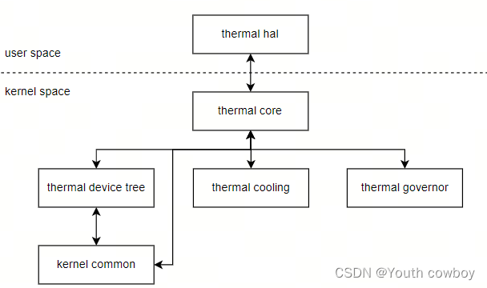
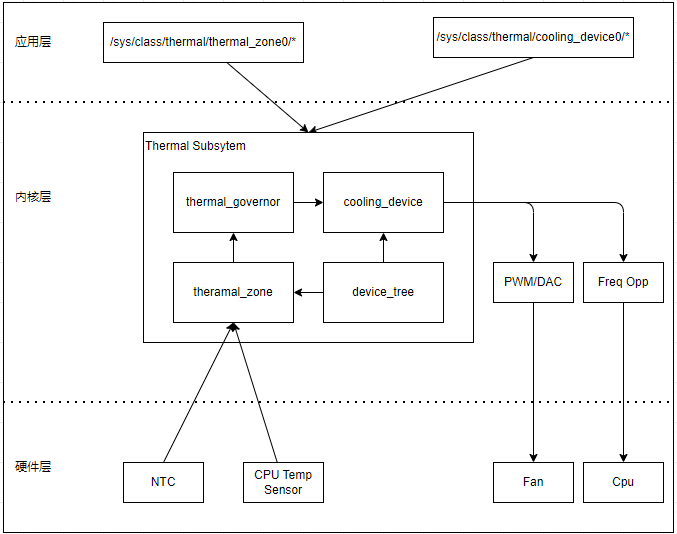
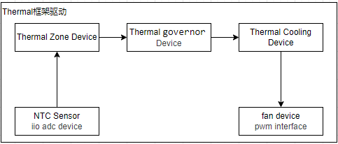
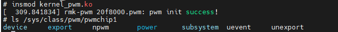
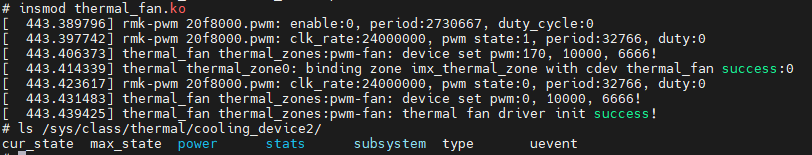
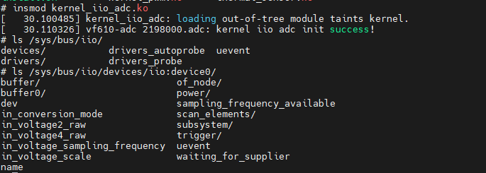
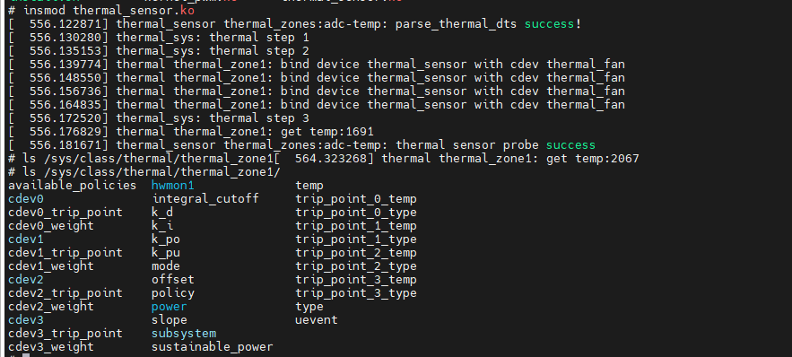
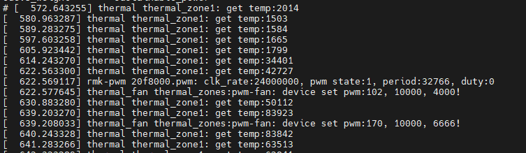

# 系统温控驱动管理框架

Linux的Thermal机制是基于Zone为单位的热管理机制，主要由三个部分构成:

1. 区域温度检测设备(thermal_zone)，用于获取系统温度的设备，包括不限于cpu内部温度检测点，外部温度传感器器件等。
2. 区域降温设备(thermal_cooling)，提供降温的设备，包含风扇，降频等。
3. 温控策略(thermal_governor)，管理系统的温控策略，详细可参考内核下的文档：Documentation/admin-guide/pm/cpufreg.rst。

其中thermal_governor从thermal_zone_device获取区域温度，然后根据当前温度，决定调用哪个降温设备来为该区域降温。可以看到thermal的处理即涉及温度采样这类ADC相关的操作，也涉及风扇控制这类PWM相关的操作，因此在理解本节前，建议对掌握之前的知识。

- [iio子系统驱动框架和ADC模块驱动](./ch03-09.iio_subsystem.md)
- [PWM子系统设备框架](./ch03-12.pwm_frame.md)

本节将从框架，检测设备，降温设备和控制策略方面描述温控驱动框架；目录如下所示。

- [温控驱动框架](#thremal_frame)
- [区域温度检测设备](#thermal_zone)
- [区域降温设备](#cooling_device)
- [thermal驱动加载和应用](#thermal_loading)

## thremal_frame

系统温控Thermal框架如下。



如上图所示, 由如下部分组成。

1. Thermal Core: 作为整个框架的核心，负责设备的注册、设备树的解析以及策略的管理等工作。它提供了用户空间的 sysfs 节点，方便用户与系统进行交互。
2. Thermal Device Tree: 用于描述系统中的硬件设备，为后续的处理提供资源信息。它根据功能的不同，为 thermal_zone 和 thermal_cooling 设备提供服务。
3. Thermal Cooling Device: 代表具体的冷却设备，如风扇、CPU 频率调节器等，负责控制温度。
4. Thermal Governor: 根据系统的温度和负载情况，选择合适的冷却设备进行降温，是控制策略的核心。
5. Thermal Zone Driver: 作为温度检测设备，负责获取系统的温度信息，如 CPU 内部温度检测点、外部温度传感器等。

其中Thermal core是thermal操作的核心程序，包含模块初始化，组织并管理Thermal Governor、Thermal Cooling、Thermal Driver三个组件，通过sysfs和用户空间交互。



可以看到，Thermal_Zone设备是温控的源头，主要包括采样获取温度信息；然后根据Thermal Governor定义的策略，选择合适的Thermal Cooling Device执行降温的操作，可能包含通过调节PWM加大风扇转速，或者降低CPU频率减少发热等。设备树中则定义了操作的硬件设备和管理的策略，最后在Thermal Core框架的统一管理下共同实现管理策略。

按照这个思路，实现完整的温控框架需要如下流程。

1. 温度采样设备驱动实现：可能是芯片内部寄存器，ADC采样的外部NTC器件，或者直接通过i2c/spi接口连接的温度传感器。
2. thermal_zone设备抽象与注册：基于温度采样设备硬件，抽象成thermal_zone设备，注册到thermal core框架中。
3. 降温设备驱动实现，可能是PWM/DAC控制的风扇，或者CPU主频、电压调节器等。
4. thermal_cooling设备抽象与注册：基于降温设备硬件，抽象成thermal_cooling设备，注册到thermal core框架中。
5. 控策略实现：根据温度选择合适的降温设备，一般可以选择系统默认支持的控温策略，或者自定义控策略。

整个流程的图形如下所示。



## thermal_zone

温度采样设备的驱动主要是ADC，CPU内部温度寄存器或I2C/SPI接口连接的温度sensor；注册到内核后以iio provider的形式可以被其它驱动访问。可以参考前面提到的iio设备驱动框架说明，这里从thermal_zone设备的实现开始说明。

thermal_zone设备是温控系统数据的来源，主要包括采样获取温度信息，通过sysfs接口可以获取到当前的温度，对于此设备主要的接口如下所示。

```c
// 注册thermal_zone设备接口
// @type: 设备类型，生成目录下的type熟悉
// @ntrips: 支持的温度阈值数量
// @mask: 温度阈值掩码，用于确定温度阈值的位数
// @devdata: 设备私有数据
// @ops: 指向 thermal_zone 设备操作函数的指针，这些函数定义了如何控制和查询设备的状态
// @tzp: 指向 thermal_zone 设备参数的指针，包含了设备的一些配置信息。
// @passive_delay: 设备进入被动状态的延迟时间，单位为毫秒
// @polling_delay: 设备轮询获取温度的延迟时间，单位为毫秒
// 返回值: 指向注册的 thermal_zone 设备的指针，如果注册失败则返回 NULL
struct thermal_zone_device *thermal_zone_device_register(const char *type, int ntrips, int mask,
                                void *devdata, struct thermal_zone_device_ops *ops,
                                struct thermal_zone_params *tzp, int passive_delay,
                                int polling_delay)

// 注销thermal_zone设备接口
// @tz: 指向要注销的 thermal_zone 设备的指针
void thermal_zone_device_unregister(struct thermal_zone_device *tz)


// 将 thermal_zone 设备和 thermal_cooling 设备进行绑定，同时为该绑定关系设置最大状态值、最小状态值和权重等参数
// @tz: 指向要绑定的 thermal_zone 设备的指针
// @trip_id: 温度阈值的 ID，用于指定要绑定的阈值
// @cdev: 指向要绑定的 thermal_cooling 设备的指针
// @max: 绑定关系的最大状态值，用于限制设备的最大状态
// @min: 绑定关系的最小状态值，用于限制设备的最小状态
// @weight: 绑定关系的权重，用于确定设备在温度阈值触发时的优先级
// 返回值: 0 表示绑定成功，负数表示绑定失败
int thermal_zone_bind_cooling_device(struct thermal_zone_device *tz, int trip_id, 
                                    struct thermal_cooling_device *cdev, unsigned long max, 
                                    unsigned long min, int weight);

// 注销thermal_zone和thermal_cooling设备的绑定关系
// @tz: 指向要解绑的 thermal_zone 设备的指针
// @trip_id: 温度阈值的 ID，用于指定要解绑的阈值
// @cdev: 指向要解绑的 thermal_cooling 设备的指针
// 返回值: 0 表示解绑成功，负数表示解绑失败
int thermal_zone_unbind_cooling_device(struct thermal_zone_device *tz, int trip_id,
                                    struct thermal_cooling_device *cdev);
```

最关键的数据结构就是thermal_zone_device_ops和thermal_zone_params，这两个数据结构主要用于描述设备的操作和参数，具体如下所示。

```c
// 指定thermal_zone设备执行的操作
struct thermal_zone_device_ops {
    // 用于绑定thermal_zone和thermal_cooling设备，如果存在，注册时调用
    int (*bind) (struct thermal_zone_device *,
                struct thermal_cooling_device *);

    // 用于解绑thermal_zone和thermal_cooling设备，如果存在，注销时调用(注销和注册需要同时存在)
    int (*unbind) (struct thermal_zone_device *,
                struct thermal_cooling_device *);
         
    // 获取当前温度的
    int (*get_temp) (struct thermal_zone_device *, int *);

    // 设置温度阈值的
    int (*set_trips) (struct thermal_zone_device *, int, int);

    // 更改设备模式的
    int (*change_mode) (struct thermal_zone_device *,
        enum thermal_device_mode);

    // 获取指定温度阈值类型
    int (*get_trip_type) (struct thermal_zone_device *, int,
        enum thermal_trip_type *);

    // 获取指定温度阈值的温度
    int (*get_trip_temp) (struct thermal_zone_device *, int, int *);

    // 获取指定温度阈值的温度
    int (*set_trip_temp) (struct thermal_zone_device *, int, int);

    // 获取指定温度阈值的滞后值
    int (*get_trip_hyst) (struct thermal_zone_device *, int, int *);

    // 设置指定温度阈值的滞后值
    int (*set_trip_hyst) (struct thermal_zone_device *, int, int);

    // 获取临界温度
    int (*get_crit_temp) (struct thermal_zone_device *, int *);

    // 设置模拟温度
    int (*set_emul_temp) (struct thermal_zone_device *, int);

    // 获取当前温度的趋势
    int (*get_trend) (struct thermal_zone_device *, int,
                enum thermal_trend *);
    
    // 当设备温度达到高温状态时调用
    void (*hot)(struct thermal_zone_device *);

    // 当设备温度达到临界状态时调用
    void (*critical)(struct thermal_zone_device *);
};

// thermal_zone设备参数
struct thermal_zone_params {
    // 温控策略名称，存储在长度为 THERMAL_NAME_LENGTH 的字符数组中
    char governor_name[THERMAL_NAME_LENGTH];

    // 一个布尔值，用于指示是否需要创建从thermal到hwmon的sysfs接口。
    bool no_hwmon;

    // 热绑定参数（tbp）条目的数量
    int num_tbps;

    // 指向热绑定参数结构体的指针
    struct thermal_bind_params *tbp;

    // 此热区域能够以毫瓦（mW）为单位耗散的可持续功率（热量）
    u32 sustainable_power;

    // 当温度低于（即超调）时，PID 控制器的比例参数
    s32 k_po;

    // 当温度高于目标值（即超调）时，PID 控制器的比例参数
    s32 k_pu;

    // PID 控制器的积分参数
    s32 k_i;

    // PID 控制器的微分参数
    s32 k_d;

    // 误差不再累积的阈值
    s32 integral_cutoff;

    // 线性温度调整曲线的斜率。
    int slope;
    
    // 线性温度调整曲线的偏移量
    int offset;
};
```

获取的thermal_zone_device则包含热设备需要的所有信息，结构如下。

```c
// 热区域设备结构体 
struct thermal_zone_device {
    // 热区域设备的唯一标识符
    int id;

    // 热区域设备的类型，存储在长度为 THERMAL_NAME_LENGTH 的字符数组中
    char type[THERMAL_NAME_LENGTH];

    // 表示设备的通用结构体，包含设备的基本信息和操作函数
    struct device device;

    // 与温度阈值相关的属性组
    struct attribute_group trips_attribute_group;

    // 指向温度阈值温度属性的指针
    struct thermal_attr *trip_temp_attrs;

    // 指向温度阈值类型属性的指针
    struct thermal_attr *trip_type_attrs;

    // 指向温度阈值滞后值属性的指针
    struct thermal_attr *trip_hyst_attrs;

    // 热区域设备的工作模式
    enum thermal_device_mode mode;

    // 指向设备特定数据的指针，用于存储与设备相关的私有数据
    void *devdata;

    // 指向温度阈值结构体数组的指针
    struct thermal_trip *trips;

    // 温度阈值的数量
    int num_trips;
    
    // 用于标记禁用的温度阈值的位图
    unsigned long trips_disabled;

    // 设备进入被动状态的延迟时间，以时钟节拍为单位
    unsigned long passive_delay_jiffies;

    // 设备轮询获取温度的延迟时间，以时钟节拍为单位
    unsigned long polling_delay_jiffies;

    // 当前的温度值
    int temperature;
    
    // 上一次记录的温度值
    int last_temperature;

    // 模拟的温度值
    int emul_temperature;

    // 设备是否处于被动状态的标志
    int passive;

    // 上一次触发的低温阈值
    int prev_low_trip;

    // 上一次触发的高温阈值
    int prev_high_trip;

    // 一个原子变量，用于标记设备是否需要更新
    atomic_t need_update;
    
    // 指向热区域设备操作函数的指针，这些函数定义了如何控制和查询设备的状态
    struct thermal_zone_device_ops *ops;

    // 指向热区域设备参数的指针，包含了设备的一些配置信息
    struct thermal_zone_params *tzp;

    // 指向热区域设备使用的温控策略的指针
    struct thermal_governor *governor;

    // 指向温控策略特定数据的指针
    void *governor_data;

    // 用于存储与该热区域设备相关的热实例的链表头
    struct list_head thermal_instances;

    // 用于分配和管理热区域设备实例 ID 的 ID 分配器
    struct ida ida;

    // 用于保护热区域设备结构体的互斥锁，防止并发访问冲突
    struct mutex lock;

    // 用于将该热区域设备结构体链接到其他结构体的链表节点
    struct list_head node;

    // 用于安排设备轮询工作的延迟工作队列
    struct delayed_work poll_queue;

    // 热区域设备的通知事件类型
    enum thermal_notify_event notify_event;
};

// 定义系统的温控进入不同模式的触发点
enum thermal_trip_type {
    THERMAL_TRIP_ACTIVE = 0, // 表示设备处于主动状态
    THERMAL_TRIP_PASSIVE,    // 表示设备处于被动状态
    THERMAL_TRIP_HOT,        // 表示设备处于高温状态
    THERMAL_TRIP_CRITICAL,   // 表示设备处于临界状态(此时一般会直接触发critical事件)
};
```

了解了thermal_zone的基本结构和接口，这里以NTC-ADC为例，基于I.MX6ULL和Linux6.1版本来实现的thermal_zone设备驱动，具体流程如下。

### zone_dts

首先硬件上连接GPIO1_02，对应ADC1，通道2，这部分可以参考iio章节相关说明:[iio子系统相关说明](./ch03-09.iio_subsystem.md)。

```c
pinctrl_adc1: adc1grp {
     fsl,pins = <
          MX6UL_PAD_GPIO1_IO02__GPIO1_IO02   0x400000b0
          MX6UL_PAD_GPIO1_IO04__GPIO1_IO04   0x400000b0
     >;
};

//加载ADC-iio驱动后，在系统中会添加相应的ADC设备，因为是系统中的唯一iio设备，对应iio:device0
&adc1 {
    #io-channel-cells = <1>;                //子节点访问时，允许输出的iio channel数目，0表示一路，1表示多路(其它节点使用iio时需要)
    io-channel-rangs;                       //继承了当前节点的子节点可以引用当前节点的 IIO channel
    num-channels = <2>;                     //adc允许的通道数量，驱动访问                        
    pinctrl-0 = <&pinctrl_adc1>;            //定义ADC对应引脚的pinctrl配置
    pinctrl-name = "default";               //pinctrl配置的别名，default为内核初始化类型
    vref-supply = <&regulator_vref_adc>;    //基准电压定义，基于regulator获取基准电压
    status = "okay";                        //模块状态，正常
};
```

另一部分就是包含系统里thermal_zone设备需要的资源，具体如下。

```c
/ {
    // thermal_sensor温控节点
    thermal_sensor {
        compatible = "rmk,thermal_sensor";   // 与设备树匹配的compatible属性
        io-channels = <&adc1 0>;             // 对应访问的iio:deviceX中的编号，编号与iio设备的注册顺序有关
        polling-delay-passive = <1000>;      // 设备进入被动散热状态后轮询读取的延迟时间，单位为毫秒
        polling-delay = <8000>;              // 设备轮询读取的延迟时间，单位为毫秒
        status = "okay";                     // 模块的工作状态

        // 定义thermal-zone状态应对thermal-cooling的工作状态
        // 定义温度阈值和对应的cooling设备，已经cooling设备的工作状态
        cooling-map {
            active_trip {                               // active_trip表示设备处于active状态时的阈值
                trip,temp = <40000>;                    // 温度阈值，单位为微摄氏度
                cooling-device = <&thermal_fan 1 1>;    // 对应cooling设备的路径和状态，在bind时需要(分别对应绑定时的cooling设备，最大值，最小值)
            };

            passive_trip {
                trip,temp = <60000>;
                cooling-device = <&thermal_fan 2 2>;
            };

            hot_trip {
                trip,temp = <70000>;
                cooling-device = <&thermal_fan 3 3>;
            };

            crit_trip {
                trip,temp = <950000>;
                cooling-device = <&thermal_fan 4 4>;
            };
        };
    };
}
```

在thermal-zone驱动中的解析设备树如下。

```c
static int parse_thermal_dts(struct thermal_sensor_data *data)
{
    int ret, index;
    int i = 0;
    struct device *dev = data->dev;
    struct device_node *np = dev->of_node;
    struct device_node *cooling_map_np, *trip_np;
    struct of_phandle_args cooling_spec;

    // 获取被动散热时的轮询延迟时间
    ret = of_property_read_u32(np, "polling-delay-passive", &data->polling_delay_passive);
    if (ret < 0) {
        data->polling_delay_passive = THERMAL_SENSOR_PASSIVE_DELAY;
    }

    // 获取主动散热时的轮询延迟时间
    ret = of_property_read_u32(np, "polling-delay", &data->polling_delay);
    if (ret < 0) {
        data->polling_delay = THERMAL_SENSOR_POLLING_DELAY;
    }

    // 获取iio-channel通道，后续获取温度值时需要
    data->chans = devm_iio_channel_get_all(dev);
    if (IS_ERR(data->chans)) {
        ret = PTR_ERR(data->chans);
        if (ret != -EPROBE_DEFER)
            dev_err(dev, "Unable to get IIO channels");
        return ret;
    }

    // 解析cooling-map
    cooling_map_np = of_find_node_by_name(np, "cooling-map");
    if (!cooling_map_np) {
        dev_err(dev, "Unable to find cooling-map node");
        return -ENODEV;
    }

    data->trip_nums = of_get_child_count(cooling_map_np);
    if (data->trip_nums <= 0) {
        dev_err(dev, "Unable to find cooling-map node");
        return -ENODEV;
    }

    data->param = devm_kzalloc(dev, sizeof(struct thermal_cooling_trip) * data->trip_nums, GFP_KERNEL);
    if (!data->param) {
        dev_err(dev, "Unable to alloc memory");
        return -ENOMEM;
    }

    // 解析cooling-map下的trip，保存信息
    index = 0;
    for_each_child_of_node(cooling_map_np, trip_np) {
        ret = of_property_read_u32(trip_np, "trip,temp", &data->param[index].trip_temperature);
        if (ret < 0) {
            dev_err(dev, "Unable to get trip,temp");
            return ret;
        }

        ret = of_parse_phandle_with_args(trip_np, "cooling-device",
                    "#cooling-cells", i, &cooling_spec);
        if (ret < 0) {
            dev_err(dev, "Invalid cooling-device entry\n");
            return ret;
        } 
        
        data->param[index].cooling_device = cooling_spec.np;
        if (cooling_spec.args_count >= 2) {
            data->param[index].min = cooling_spec.args[0];
            data->param[index].max = cooling_spec.args[1];
        } else {
            dev_err(dev, "wrong reference to cooling device, missing limits\n");
            return -ENODEV;
        }
        data->param[index].type = (enum thermal_trip_type)index;
        data->param[index].trip_id = index;
        
        index++;
    }
    
    of_node_put(cooling_map_np);
    dev_info(dev, "parse_thermal_dts success!\n");

    return 0;
}
```

### register_thermal_zone

注册thermal_zone设备的主要流程包含。

1. 匹配设备树节点，调用probe函数
2. 解析设备树，设置thermal_zone配置参数
3. 向系统中注册thermal_zone设备
4. 使能thermal_zone设备

```c
static struct thermal_zone_device_ops tm_sensor_ops = {
    .bind = tm_sensor_bind,                     // 绑定thermal zone和cooling device时调用(thermal_zone和thermal_cool注册时都会调用)
    .unbind = tm_sensor_unbind,                 // 解绑thermal zone和cooling device时调用
    .get_temp = tm_sensor_get_temp,             // 获取当前温度，这里是获取ADC采样的温度
    .get_trip_type = tm_sensor_get_trip_type,   // 获取指定温度阈值类型
    .get_trip_temp = tm_sensor_get_trip_temp,   // 获取指定温度阈值的温度
    .get_crit_temp = tm_sensor_get_crit_temp,   // 获取临界温度
    .set_trip_temp = tm_sensor_set_trip_temp,   // 设置指定温度阈值的温度
};

static int thermal_sensor_probe(struct platform_device *pdev)
{
    int ret;
    int i, mask = 0;
    struct thermal_sensor_data *data;

    data = devm_kzalloc(&pdev->dev, sizeof(struct thermal_sensor_data), GFP_KERNEL);
    if (!data) {
        dev_err(&pdev->dev, "Failed to allocate memory\n");
        return -ENOMEM;
    }
    data->dev = &pdev->dev;
    platform_set_drvdata(pdev, data);

    // 解析设备树，获取相关属性
    ret = parse_thermal_dts(data);
    if (ret != 0) {
        dev_err(&pdev->dev, "parse dts failed:%d\n", ret);
        return -ENODEV;
    }

    for (i = 0; i < data->trip_nums ; i++)
        mask |= 1 << i;

    // 向系统中注册thermal zone设备
    data->tz = thermal_zone_device_register("thermal_sensor",
                    data->trip_nums,
                    mask,
                    data,
                    &tm_sensor_ops, NULL,
                    data->polling_delay_passive,
                    data->polling_delay);
    if (IS_ERR(data->tz)) {
        ret = PTR_ERR(data->tz);
        dev_err(&pdev->dev,
            "failed to register thermal zone device %d\n", ret);
        return -ENOMEM;
    }

    // 使能thermal zone设备
    ret = thermal_zone_device_enable(data->tz);
    if (ret) {
        dev_err(&pdev->dev,
            "failed to enable thermal zone device %d\n", ret);
        goto thermal_zone_unregister;
    }
    
    dev_info(&pdev->dev, "thermal sensor probe success\n");
    return 0;

thermal_zone_unregister:
    thermal_zone_device_unregister(data->tz);

    return 0;
}

static int thermal_sensor_remove(struct platform_device *pdev)
{
    struct thermal_sensor_data *data = platform_get_drvdata(pdev);

    // 注销thermal zone设备
    thermal_zone_device_disable(data->tz);
    thermal_zone_device_unregister(data->tz);
    dev_info(&pdev->dev, "thermal sensor remove success\n");
    return 0;
}

static const struct of_device_id thermal_sensor_of_match[] = {
    { .compatible = "rmk,thermal_sensor", },
    { }
};
MODULE_DEVICE_TABLE(of, thermal_sensor_of_match);

static struct platform_driver thermal_sensor_driver = {
    .driver = {
        .name = "thermal_sensor",
        .of_match_table = thermal_sensor_of_match,
    },
    .probe = thermal_sensor_probe,
    .remove = thermal_sensor_remove,
};

module_platform_driver(thermal_sensor_driver);

MODULE_AUTHOR("zc <1107473010@qq.com>");
MODULE_DESCRIPTION("thermal sensor driver");
MODULE_LICENSE("GPL v2");
```

上述就是thermal_zone驱动实现的整体框架，不过有两个函数值得单独讲解， 一个是bind函数，另一个是get_temp函数。

```c
// 绑定thermal zone和cooling device时调用
// 上面提到过，在注册thermal zone/thermal cooling设备时，会调用ops->bind函数
// 其原理是内核中分别维护了thermal zone和thermal cooling的链表，注册时会循环检测链表
// 执行对应绑定
static int tm_sensor_bind(struct thermal_zone_device *tz, struct thermal_cooling_device *cdev)
{
    struct thermal_sensor_data *data = (struct thermal_sensor_data *)tz->devdata;
    struct thermal_cooling_trip *trip = data->param;
    
    for (int index=0; index<data->trip_nums; index++) {
        if (trip[index].cooling_device == cdev->np) {   //根据设备树，限定只绑定指定的cooling设备
            int ret;
            
            ret = thermal_zone_bind_cooling_device(tz,      //thermal zone设备
                trip[index].trip_id,                        //trip_id，这里是thermal_trip_type
                cdev,                                       //cooling设备
                trip[index].max,                            //cooling设备的最大状态(cooling-level指定的档位)
                trip[index].min,                            //cooling设备的最小状态(cooling-level指定的档位)
                THERMAL_WEIGHT_DEFAULT);
            if(ret) {
                dev_err(&tz->device, "binding zone %s with cdev %s failed:%d\n",
                        tz->type, cdev->type, ret);
                return ret;
            }
            dev_info(&tz->device, "bind device %s with cdev %s\n", tz->type, cdev->type);
        }
    }

    return 0;
}

// 获取当前温度，这里是获取ADC采样的温度
static int tm_sensor_get_temp(struct thermal_zone_device *tz, int *temp)
{
    int ret, val;
    int temperature;

    struct thermal_sensor_data *data = (struct thermal_sensor_data *)tz->devdata;

    // 从iio接口读取原始的ADC数据
    ret = iio_read_channel_raw(&data->chans[0], &val);
    if (ret < 0) {
        dev_err(&tz->device, "Unable to read temperature:%d\n", ret);
        return ret;
    }

    // 转换为实际的温度值
    if (val < 0) {
        temperature = 0;
    } else {
        temperature = (4096 - val) * 110000 / 4096; 
    }

    dev_info(&tz->device, "get temp:%d\n", temperature);
    *temp = temperature;
    return 0; 
}
```

关于thermal_zone的详细代码见: [thermal_zone驱动文件](./file/ch03-14/thermal_zone/thermal_sensor.c)。

## cooling_device

风扇设备一般通过PWM或者DAC控制电压来控制转速，这里使用PWM接口控制，对应的驱动实现参考: [PWM子系统设备框架](./ch03-12.pwm_frame.md)。下面进行thermal_cooling设备的说明。

thermal cooling设备作为受控设备，相对于thermal_zone设备会简单些，另外thermal_cooling设备也作为pwm consumer，来访问pwm接口操作实际硬件。关于thermal cooling设备注册访问相关的接口如下所示。

```c
// 注册thermal_cooling设备接口
// @type: 设备类型，生成thermal_cooling目录下的type内容
// @devdata: 设备私有数据
// @ops: 指向 thermal_cooling 设备操作函数的指针，这些函数定义了如何控制和查询设备的状态
// 返回值: 指向注册的 thermal_cooling 设备的指针，如果注册失败则返回 NULL
struct thermal_cooling_device *thermal_cooling_device_register(const char *type, void *devdata, 
            const struct thermal_cooling_device_ops *ops)

// 带设备节点的注册thermal_cooling设备接口
// @np: 指向设备树节点的指针
// @type: 设备类型，生成thermal_cooling目录下的type内容
// @devdata: 设备私有数据
// @ops: 指向 thermal_cooling 设备操作函数的指针，这些函数定义了如何控制和查询设备的状态
// 返回值: 指向注册的 thermal_cooling 设备的指针，如果注册失败则返回 NULL
struct thermal_cooling_device *
thermal_of_cooling_device_register(struct device_node *np, const char *type, void *devdata,
            const struct thermal_cooling_device_ops *ops)

// 带设备管理的注册thermal_cooling设备接口(驱动移除时自动注销)
// @dev: 指向设备的指针
// @np: 指向设备树节点的指针
// @type: 设备类型，生成thermal_cooling目录下的type内容
// @devdata: 设备私有数据
// @ops: 指向 thermal_cooling 设备操作函数的指针，这些函数定义了如何控制和查询设备的状态
// 返回值: 指向注册的 thermal_cooling 设备的指针，如果注册失败则返回 NULL
struct thermal_cooling_device *
devm_thermal_of_cooling_device_register(struct device *dev,
        struct device_node *np,
        char *type, void *devdata,
        const struct thermal_cooling_device_ops *ops)

// 注销thermal_cooling设备接口
// @cdev: 指向要注销的 thermal_cooling 设备的指针
void thermal_cooling_device_unregister(struct thermal_cooling_device *cdev)
```

最关键的数据结构就是thermal_cooling_device_ops和thermal_cooling_device，这两个数据结构主要用于描述设备的操作和参数，具体如下所示。

```c
// 定义了对冷却设备的操作函数的指针
struct thermal_cooling_device_ops {
    // 获取冷却设备的最大状态值
    int (*get_max_state) (struct thermal_cooling_device *, unsigned long *);
    // 获取冷却设备的当前状态值
    int (*get_cur_state) (struct thermal_cooling_device *, unsigned long *);
    // 设置冷却设备的当前状态值
    int (*set_cur_state) (struct thermal_cooling_device *, unsigned long);
    // 获取冷却设备请求的功率
    int (*get_requested_power)(struct thermal_cooling_device *, u32 *);
    // 将状态转换为功率
    int (*state2power)(struct thermal_cooling_device *, unsigned long, u32 *);
    // 将功率转换为状态
    int (*power2state)(struct thermal_cooling_device *, u32, unsigned long *);
};

// 获取的冷却设备的结构体
struct thermal_cooling_device {
    int id;                     // 冷却设备的唯一标识符
    char *type;                 // 冷却设备的类型，例如 "fan"（风扇）或 "cpufreq"（CPU频率调整）
    unsigned long max_state;    // 冷却设备的最大状态值
    struct device device;       // 表示设备的通用结构体，包含设备的基本信息和操作函数
    struct device_node *np;     // 指向设备树节点的指针，设备树是描述硬件设备的树形数据结构
    void *devdata;              // 指向设备特定数据的指针，用于存储与设备相关的私有数据
    void *stats;                // 指向统计数据的指针，用于存储与设备性能或状态相关的统计信息
    const struct thermal_cooling_device_ops *ops; // 指向冷却设备操作函数的指针，这些函数定义了如何控制和查询冷却设备的状态
    bool updated;               // 一个标志，表示冷却设备是否需要更新。如果为 `true`，则表示设备不需要更新；如果为 `false`，则表示设备需要更新
    struct mutex lock;          // 用于保护 `thermal_instances` 列表的互斥锁，防止并发访问冲突
    struct list_head thermal_instances; // 用于存储与该冷却设备相关的热实例的链表头
    struct list_head node;      // 用于将该冷却设备结构体链接到其他结构体的链表节点
};
```

了解了thermal_cooling设备的基本结构和接口，这里以PWM风扇为例，基于I.MX6ULL和Linux6.1版本来实现的thermal_cooling设备驱动，具体流程如下。

### cooling_dts

首先硬件上连接PWM7，这部分可以参考pwm章节相关说明:[PWM子系统设备框架](./ch03-12.pwm_frame.md)。

```c
// 芯片原厂提供pwm7设备树
pinctrl_pwm7: pwm7grp {
    fsl,pins = <
        MX6UL_PAD_CSI_VSYNC__PWM7_OUT            0x110b0            //指定引脚的复用功能，PWM输出模式
    >;
};

pwm7: pwm@20f8000 {
    compatible = "fsl,imx6ul-pwm", "fsl,imx27-pwm";                 //pwm标签，用于设备树匹配
    reg = <0x020f8000 0x4000>;                                      //控制pwm模块的寄存器
    interrupts = <GIC_SPI 116 IRQ_TYPE_LEVEL_HIGH>;                 //pwm中断，<中断控制器 中断线号 中断触发电平>
    clocks = <&clks IMX6UL_CLK_PWM7>,                               //pwm时钟，ipg为pwm的时钟源，per为pwm经过分频的时钟  
            <&clks IMX6UL_CLK_PWM7>;
    clock-names = "ipg", "per";
    #pwm-cells = <3>;                                               //描述引用pwm后，pwm配置项的个数
    status = "disabled";                                            //pwm状态，关闭
};

// 用户扩展pwm7设备树
&pwm7 {
    pinctrl-names = "default";                                      //指定pinctrl的默认配置名称
    pinctrl-0 = <&pinctrl_pwm7>;                                    //指定pinctrl的引脚复用
    status = "okay";                                                //pwm状态，开启
};
```

另一部分就是包含系统里thermal_cooling设备需要的资源，具体如下。

```c
/ {
    // ...
    // 定义风扇设备
    thermal_fan: pwm-fan {
        compatible = "rmk,pwm-fan";             // 与设备树匹配的compatible属性
        pwms = <&pwm7 0 10000 0>;               // 指定PWM设备，通道，周期，极性
        #cooling-cells = <2>;                   // 指定cooling设备的子节点需要的参数个数(thermal-zone选择thermal_fan时，需要此位确定参数)
        cooling-levels = <0 102 170 230 255>;   // 风扇转速档位，对应cooling设备的状态(满状态255，占空比位x/255*period)
        default-fan-level = <2>;                // 默认风扇转速档位
        status = "okay";                        // 模块的工作状态
    };
}
```

在thermal_cooling驱动中的解析设备树如下。

```c
// 解析设备树节点
static int parse_thermal_dts(struct thermal_fan_data *data)
{
    int ret;
    int i, level_nums;
    struct device *dev = data->dev;
    struct device_node *np = dev->of_node;

    // 获取pwm设备资源，并获取当前pwm状态
    data->pwm = devm_pwm_get(dev, NULL);
    if (IS_ERR(data->pwm)) {
        dev_err(dev, "Could not get PWM\n");
        return -ENODEV;
    }

    pwm_init_state(data->pwm, &data->pwm_state);

    // 获取cooling-levels选项，申请对应资源存储
    level_nums = of_property_count_u32_elems(np, "cooling-levels");
    if (level_nums < 0) {
        dev_err(dev, "Count not get cooling-levels!\n");
        return -ENODEV;
    }
    data->cooling_levels = devm_kzalloc(dev, sizeof(u32) * level_nums, GFP_KERNEL);
    if (!data->cooling_levels) {
        dev_err(dev, "Count not malloc cooling-levels!\n");
        return -ENOMEM;
    }
    of_property_read_u32_array(np, "cooling-levels", data->cooling_levels, level_nums);
    data->cooling_level_nums = level_nums;

    for (i=0; i<level_nums; i++) {
        if (data->cooling_levels[i] > MAX_PWM) {
            dev_err(dev, "cooling-levels[%d] > MAX_PWM, val:%d!\n", i, data->cooling_levels[i]);
            return -EINVAL;
        }
    }

    // 获取default-fan-level选项
    ret = of_property_read_u32(np, "default-fan-level", &data->cur_fan_level);
    if (ret < 0) {
        data->cur_fan_level = 0;
    }
    if (data->cur_fan_level >= level_nums) {
        dev_err(dev, "default-fan-level > cooling-levels:%d!\n", data->cur_fan_level);
        return -EINVAL;
    }
    set_pwm(data, data->cooling_levels[data->cur_fan_level]);

    data->max_fan_level = level_nums - 1;
    return 0;
}
```

### register_thermal_cooling

注册thermal_cooling设备的主要流程包含。

1. 匹配设备树节点，调用probe函数。
2. 解析设备树，设置thermal_cooling配置参数。
3. 向系统中注册thermal_cooling设备。

```c
static const struct thermal_cooling_device_ops thermal_fan_cooling_ops = {
    .get_max_state = thermal_fan_get_max_state,         // 获取风扇最大状态
    .get_cur_state = thermal_fan_get_cur_state,         // 获取风扇当前状态
    .set_cur_state = thermal_fan_set_cur_state,         // 设置风扇当前状态
};

static int thermal_fan_probe(struct platform_device *pdev)
{
    int ret;
    struct thermal_fan_data *data;
    struct device* dev = &pdev->dev;

    data = devm_kzalloc(&pdev->dev, sizeof(struct thermal_fan_data), GFP_KERNEL);
    if (!data) {
        dev_err(&pdev->dev, "[devm_kzalloc]thermal_fan_data failed !\n");
        return -ENOMEM;
    }
    data->dev = &pdev->dev;
    platform_set_drvdata(pdev, data);

    // 解析设备树，配置系统参数
    ret = parse_thermal_dts(data);
    if (ret < 0) {
        dev_err(&pdev->dev, "parse_thermal_dts failed!\n");
        return ret;
    }

    // 向系统中注册thermal_cooling设备
    data->cdev = devm_thermal_of_cooling_device_register(dev, dev->of_node, 
                        "thermal_fan", data, &thermal_fan_cooling_ops);
    if (IS_ERR(data->cdev)) {
        dev_err(dev, "Failed to register pwm-fan as cooling device!\n");
        return -ENODEV;
    }

    dev_info(&pdev->dev, "thermal fan driver init success!\n");
    return 0;
}

static int thermal_fan_remove(struct platform_device *pdev)
{
    struct thermal_fan_data *data = platform_get_drvdata(pdev);
    struct device *dev = data->dev;

    dev_info(dev, "thermal fan remove success!\n");
    return 0;
}

//匹配的是根节点的compatible属性
static const struct of_device_id thermal_fan_of_match[] = {
    { .compatible = "rmk,thermal_fan"},
    { /* Sentinel */ }
};

static struct platform_driver thermal_fan_driver = {
    .driver = {
        .name = "thermal_fan",
        .of_match_table = thermal_fan_of_match,
    },
    .probe = thermal_fan_probe,
    .remove = thermal_fan_remove,
};

module_platform_driver(thermal_fan_driver);

MODULE_AUTHOR("zc <1107473010@qq.com>");
MODULE_DESCRIPTION("thermal sensor driver");
MODULE_LICENSE("GPL v2");
```

上述就是thermal_zone驱动实现的整体框架，不过这里就如何操作PWM可以实际讲解下。

```c
// 设置PWM值，这部分是对PWM Consumer的应用
static void set_pwm(struct thermal_fan_data *data, int duty)
{
    struct device *dev = data->dev;

    if (duty > 0) {
        // 根据档位中的值计算根据周期的占空比，配置PWM
        data->pwm_state.duty_cycle = (u32)data->pwm_state.period * duty / MAX_PWM;

        // 设置PWM的周期和占空比， 并使能
        pwm_config(data->pwm, data->pwm_state.period, data->pwm_state.duty_cycle);
        pwm_enable(data->pwm);
    } else {
        pwm_disable(data->pwm);
    }

    dev_info(dev, "device set pwm:%d, %lld, %lld!\n", 
        duty, data->pwm_state.period, data->pwm_state.duty_cycle);
}
```

关于thermal_cooling的详细代码见: [thermal_cooling驱动文件](./file/ch03-14/thermal_cooling/thermal_fan.c)。

## thermal_loading

这里展示thermal设备加载和执行的完整实现流程如下。

- 向系统注册pwm设备驱动



- 向系统注册thermal_cooling设备驱动



- 向系统注册iio设备驱动



- 向系统注册thermal_zone设备驱动



- 当温度变化时，就会操作对应的cooling设备设置，具体如下。



## summary

thermal_frame是比较复杂的设备框架，涉及方面广，步骤包含如下所示。

1. iio-adc采样
2. thermal_zone温控采集管理
3. thermal_cooling温控输出
4. pwm风扇控制输出
5. thermal governor温控方法处理

完整的自己实现thermal驱动可以说十分复杂；在产品开发中很少由用户自己实现，都是使用系统集成的控制方案和温控驱动。例如根据温度控制风扇转速，或者根据温控降低CPU频率。理解了thermal控制，可以更方便的管理芯片的工作频率和工作状态，实现性能和功耗的最佳平衡。

## next_chapter

[返回目录](../README.md)

直接开始下一节说明: [Watchdog设备管理框架](./ch03-15.wdt.md)
