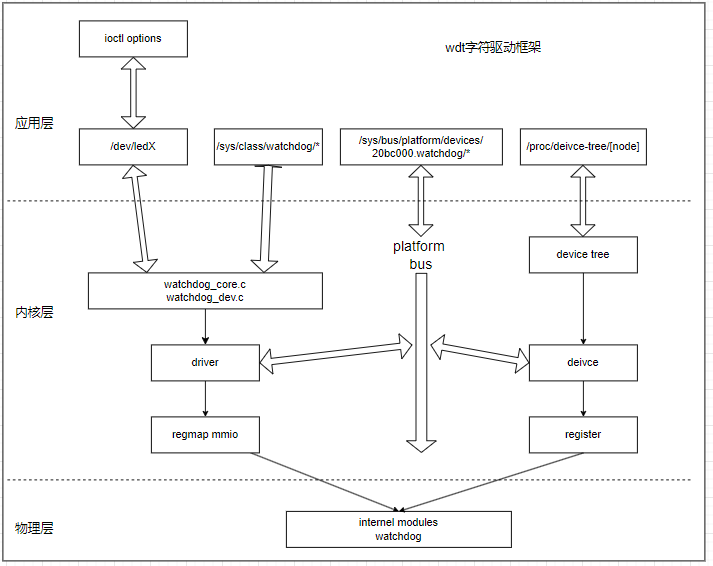
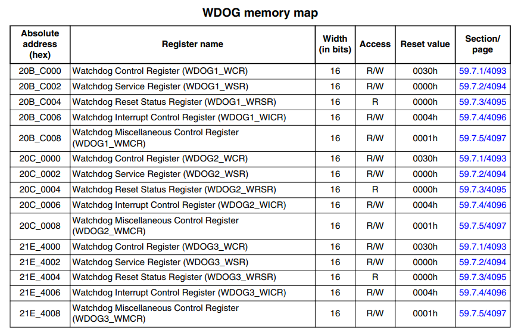
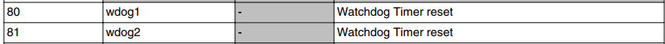
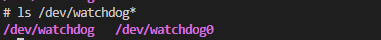

# Watchdog设备管理框架

WDT又被称为看门狗，是用于监视系统运行的模块。其主要功能用于当系统跑飞或者死机时, 无法进行喂狗时, 产生某些动作重启设备。目前主流的看门狗有内部的系统看门狗，以及外部的硬件看门狗；虽然功能和配置可能不同，但其控制原理都类似。

1. 配置看门狗触发时间，使能看门狗(部分硬件看门狗可能默认开启或由引脚状态控制开启)。
2. 定时去执行喂狗动作，内部看门狗一般为特定寄存器写入时序；外部看门狗可能是通过通讯接口或者引脚产生时序。
3. 系统异常等原因，导致无法喂狗，超时后则触发系统复位。

看门狗是芯片硬件的功能，可以实现报警和复位功能。对于WDT框架，只是提供应用层到硬件的接口，主要实现看门狗使能，周期性喂狗，以及停止等功能。

本节目录如下所示。

- [看门狗内核模块接口](#wdt_interface)
- [看门狗硬件说明](#wdt_hardware)
- [看门狗驱动实现](#wdt_driver)
- [看门狗应用层访问](#wdt_application)
- [下一章节](#next_chapter)

## wdt_interface

在嵌入式Linux系统中，看门狗模块作为字符设备被访问，通过ioctl去操作。看门狗包含的代码实现如下。

- drivers/watchdog/watchdog_core.c：看门狗核心初始化模块
- drivers/watchdog/watchdog_dev.c：看门狗设备处理接口
- drivers/watchdog/imx2_wdt.c：看门狗驱动设备，创建设备节点，关联底层硬件

对于watchdog的结构如下所示。



可以看到，watchdog是芯片内部模块，由platform总线统一管理。其中设备由解析设备树创建，驱动则包含两部分。

1. 用于注册到watchdog到内核的接口，主要在watchdog_core和watchdog_dev中实现。
2. 访问物理模块寄存器的实现，这部分主要基于regmap mmio模块访问内部模块的寄存器。

看门狗访问的接口如下所示。

```c
//向系统中注册watchdog设备(支持驱动卸载时移除)
int devm_watchdog_register_device(struct device *dev, struct watchdog_device *wdd)

//向系统中注册watchdog设备
int watchdog_register_device(struct watchdog_device *wdd)

//从系统中移除注册的watchdog设备
void watchdog_unregister_device(struct watchdog_device *wdd)
```

可以看到，其中最重要的结构就是"struct watchdog_device"，解析如下所示。

```c
//watchdog_device结构
struct watchdog_device {
    int id;                                 // watchdog的id，在注册时申请
    struct device *parent;                  // watchdog所属的总线设备
    const struct attribute_group **groups;  // 创建看门狗设备时需要创建的sysfs属性组列表。
    const struct watchdog_info *info;       // watchdog配置信息结构
    const struct watchdog_ops *ops;         // watchdog需要执行的函数
    const struct watchdog_governor *gov;    // watchdog pretimeout调控器的指针
    unsigned int bootstatus;                // 启动后的watchdog状态
    unsigned int timeout;                   // 当前设置的看门狗超时时间，单位秒
    unsigned int pretimeout;                // 当前设置的看门狗超时前中断触发时间，单位秒
    unsigned int min_timeout;               // 允许设置的看门狗最小超时时间，单位秒
    unsigned int max_timeout;               // 允许设置的看门狗最大超时时间，单位秒
    unsigned int min_hw_heartbeat_ms;       // 硬件限制最小心跳间隔时间，单位ms
    unsigned int max_hw_heartbeat_ms;       // 硬件限制最大心跳间隔时间，单位ms
    struct notifier_block reboot_nb;        // 在重启时停止看门狗的通知块
    struct notifier_block restart_nb;       // 用于注册重启功能的通知块
    struct notifier_block pm_nb;            // 用于pm管理的通知块 
    void *driver_data;                      // 驱动私有数据
    struct watchdog_core_data *wd_data;     // 指向watchdog核心内部数据的指针
    unsigned long status;                   // 包含设备内部状态位的字段
/* Bit numbers for status flags */
#define WDOG_ACTIVE        0    /* Is the watchdog running/active */
#define WDOG_NO_WAY_OUT        1    /* Is 'nowayout' feature set ? */
#define WDOG_STOP_ON_REBOOT    2    /* Should be stopped on reboot */
#define WDOG_HW_RUNNING        3    /* True if HW watchdog running */
#define WDOG_STOP_ON_UNREGISTER    4    /* Should be stopped on unregister */
#define WDOG_NO_PING_ON_SUSPEND    5    /* Ping worker should be stopped on suspend */
    struct list_head deferred;              // wtd_deferred_reg_list的入口，用来注册和初始化看门狗
};

//Documentation/watchdog/watchdog-api.rst
//watchdog_info
struct watchdog_info {
    __u32 options;              // 驱动程序支持的选项
    __u32 firmware_version;     // 固件版本号
    __u8  identity[32];         // 标识符，字符串
};

//options支持的选项
/*
application:

struct watchdog_info ident;
ioctl(fd, WDIOC_GETSUPPORT, &ident);
下面定义何种类型的看门狗状态可以被返回查看
*/
#define WDIOF_OVERHEAT   0x0001 /* Reset due to CPU overheat */
#define WDIOF_FANFAULT   0x0002 /* Fan failed */
#define WDIOF_EXTERN1    0x0004 /* External relay 1 */
#define WDIOF_EXTERN2    0x0008 /* External relay 2 */
#define WDIOF_POWERUNDER 0x0010 /* Power bad/power fault */
#define WDIOF_CARDRESET  0x0020 /* Card previously reset the CPU */
#define WDIOF_POWEROVER  0x0040 /* Power over voltage */
#define WDIOF_SETTIMEOUT 0x0080 /* Set timeout (in seconds) */
#define WDIOF_MAGICCLOSE 0x0100 /* Supports magic close char */
#define WDIOF_PRETIMEOUT 0x0200 /* Pretimeout (in seconds), get/set */
#define WDIOF_ALARMONLY  0x0400 /* Watchdog triggers a management or
                                other external alarm not a reboot */
#define WDIOF_KEEPALIVEPING  0x8000   /* Keep alive ping reply */

//watchdog_ops
struct watchdog_ops {
    struct module *owner;                                                   // 驱动的拥有者，THIS_MODULE
    /* mandatory operations */
    int (*start)(struct watchdog_device *);                                 // 看门狗启动时调用函数
    /* optional operations */
    int (*stop)(struct watchdog_device *);                                  // 看门狗结束时调用函数
    int (*ping)(struct watchdog_device *);                                  // 看门狗发送持久连接ping函数
    unsigned int (*status)(struct watchdog_device *);                       // 看门狗显示设备状态函数
    int (*set_timeout)(struct watchdog_device *, unsigned int);             // 看门狗设置超时时间函数
    int (*set_pretimeout)(struct watchdog_device *, unsigned int);          // 看门狗设置预超时时间函数
    unsigned int (*get_timeleft)(struct watchdog_device *);                 // 看门狗获取重置前剩余时间的函数
    int (*restart)(struct watchdog_device *, unsigned long, void *);        // 看门狗重启设备的函数
    long (*ioctl)(struct watchdog_device *, unsigned int, unsigned long);   // 看门狗处理额外ioctl调用的函数
};

//watchdog_governor
struct watchdog_governor {
    const char name[WATCHDOG_GOV_NAME_MAXLEN];                              // 调控器名称
    void (*pretimeout)(struct watchdog_device *wdd);                        // pretimout函数
};
```

可以看到，对于看门狗来说，配置选项还是十分复杂的。不过这里面的选项一部分需要开发者注册前定义，另一部分是watchdog设备注册时，会进行赋值或者处理，并不需要每个都理解，下面驱动中会对涉及选项进行说明，其它部分可以参考上面的结构体说明去理解。

## wdt_hardware

看门狗作为内部模块，更重要的部分是模块功能和状态寄存器，用于实现对看门狗模块的管理。这里以I.MX6ULL为例，可以作为参考。



可以看到，看门狗寄存器范围0x020BC000~0x021E4008之间，包含了看门狗的控制寄存器，状态寄存器，以及中断寄存器等，对应设备树如下。

```c
wdog1: watchdog@20bc000 {
    compatible = "fsl,imx6ul-wdt", "fsl,imx21-wdt";         //标签，用于驱动匹配
    reg = <0x020bc000 0x4000>;                              //寄存器列表，通过regmap访问
    interrupts = <GIC_SPI 80 IRQ_TYPE_LEVEL_HIGH>;          //watchdog的中断控制器，中断线号和中断触发条件
    clocks = <&clks IMX6UL_CLK_WDOG1>;                      //管理模块的时钟使能，一般用于模块的电源管理(shutdown, suspend, resume)
};
```

其中中断线号说明如下所示。



## wdt_driver

看门狗驱动的基本原理是通过定时器来监控系统的运行状态。如果系统在规定的时间内没有“喂狗”（即重置定时器），看门狗定时器就会溢出，触发系统重启。在Linux内核中，看门狗驱动通常作为一个平台设备驱动来实现。另外wdog作为内部模块，也使用platform总线统一管理，具体步骤如下所示。

1. 匹配设备树节点，加载驱动的接口
2. 获取设备树硬件资源，实现操作看门狗硬件的接口
3. 向内核注册看门狗设备，提供应用层访问时操作的底层接口

关于驱动的源码，参考地址: [imx-wdt.c](./file/ch03-15/imx2_wdt.c)

- 匹配设备节点，加载驱动

```c
//匹配设备树中compatible字段的数组
static const struct of_device_id imx2_wdt_dt_ids[] = {
    { .compatible = "fsl,imx21-wdt", },
    { .compatible = "fsl,imx7d-wdt", },
    { /* sentinel */ }
};
MODULE_DEVICE_TABLE(of, imx2_wdt_dt_ids);

static struct platform_driver imx2_wdt_driver = {
    .shutdown    = imx2_wdt_shutdown,
    .driver      = {
        .name    = DRIVER_NAME,
        .pm      = &imx2_wdt_pm_ops,
        .of_match_table = imx2_wdt_dt_ids,
    },
};

module_platform_driver_probe(imx2_wdt_driver, imx2_wdt_probe);  //注册驱动，定义probe函数

//驱动的其它信息
MODULE_AUTHOR("Wolfram Sang");
MODULE_DESCRIPTION("Watchdog driver for IMX2 and later");
MODULE_LICENSE("GPL v2");
MODULE_ALIAS("platform:" DRIVER_NAME);
```

- 获取设备树硬件资源，实现操作接口

```c
//regmap的列表参考上节中寄存器列表
static const struct regmap_config imx2_wdt_regmap_config = {
    .reg_bits = 16,             //寄存器地址的bits数，应该为4字节，32bits(不过对于mmio，reg_bits只是检查，满足8，16，32都可以，不进行处理)
    .reg_stride = 2,            //寄存器地址步长，用于多字节操作时地址递增的个数，这里表示2字节
    .val_bits = 16,             //定义单次读取寄存器内部值得bits数，为2BYTE=16bit
    .max_register = 0x8,        //允许读取的最大寄存器地址，地址为8
};

static int __init imx2_wdt_probe(struct platform_device *pdev)
{
    //...

    // 获取设备树中的reg资源
    base = devm_platform_ioremap_resource(pdev, 0);
    if (IS_ERR(base))
        return PTR_ERR(base);

    //注册regmap接口，
    wdev->regmap = devm_regmap_init_mmio_clk(dev, NULL, base,
                         &imx2_wdt_regmap_config);
    if (IS_ERR(wdev->regmap)) {
        dev_err(dev, "regmap init failed\n");
        return PTR_ERR(wdev->regmap);
    }

    //获取时钟资源
    wdev->clk = devm_clk_get(dev, NULL);
    if (IS_ERR(wdev->clk)) {
        dev_err(dev, "can't get Watchdog clock\n");
        return PTR_ERR(wdev->clk);
    }

    //...

    //使能模块时钟
    ret = clk_prepare_enable(wdev->clk);
    if (ret)
        return ret;

    //获取wdt状态
    regmap_read(wdev->regmap, IMX2_WDT_WRSR, &val);
    wdog->bootstatus = val & IMX2_WDT_WRSR_TOUT ? WDIOF_CARDRESET : 0;
}

- 注册看门狗设备，提供应用层访问接口

```c
//watchdog配置信息
static const struct watchdog_info imx2_wdt_info = {
    .identity = "imx2+ watchdog",
    .options = WDIOF_KEEPALIVEPING | WDIOF_SETTIMEOUT | WDIOF_MAGICCLOSE,
};

//watchdog支持的超时类型
#define WDIOF_OVERHEAT      0x0001 /* 由于CPU过热导致的复位 */
#define WDIOF_FANFAULT      0x0002 /* 风扇故障 */
#define WDIOF_EXTERN1       0x0004 /* 外部继电器1 */
#define WDIOF_EXTERN2       0x0008 /* 外部继电器2 */
#define WDIOF_POWERUNDER    0x0010 /* 电源不足/电源故障 */
#define WDIOF_CARDRESET     0x0020 /* 设备重置了CPU */
#define WDIOF_POWEROVER     0x0040 /* 电源过压 */
#define WDIOF_SETTIMEOUT    0x0080 /* 设置超时时间（以秒为单位） */
#define WDIOF_MAGICCLOSE    0x0100 /* 支持通过字符接口关闭设备 */
#define WDIOF_PRETIMEOUT    0x0200 /* 预超时时间（以秒为单位），获取/设置 */
#define WDIOF_ALARMONLY     0x0400 /* 看门狗仅触发管理或其他外部警报，而非重启 */
#define WDIOF_KEEPALIVEPING 0x8000 /* 保持存活的ping回复 */

static const struct watchdog_ops imx2_wdt_ops = {
    .owner = THIS_MODULE,                   // 驱动的拥有者，THIS_MODULE 
    .start = imx2_wdt_start,                // 看门狗启动时调用函数，对应应用层ioctl配置WDIOS_ENABLECARD
    .ping = imx2_wdt_ping,                  // 用于看门狗keeplive保持函数，对应应用层ioctl配置WDIOC_KEEPALIVE
    .set_timeout = imx2_wdt_set_timeout,    // 设置看门狗超时时间，需要option开启WDIOF_SETTIMEOUT，对应应用层ioctl配置WDIOC_SETTIMEOUT
    .set_pretimeout = imx2_wdt_set_pretimeout, // 设置看门狗超时前触发中断时间，对应应用层ioctl配置WDIOC_SETPRETIMEOUT
    .restart = imx2_wdt_restart,            // 注册一个自定义的重启处理程序，在重启时被调用，执行一些自定义的清理工作
};

static int __init imx2_wdt_probe(struct platform_device *pdev)
{
    //...

    wdog->info        = &imx2_wdt_info;
    wdog->ops        = &imx2_wdt_ops;
    wdog->min_timeout    = 1;
    wdog->timeout        = IMX2_WDT_DEFAULT_TIME;
    wdog->max_hw_heartbeat_ms = IMX2_WDT_MAX_TIME * 1000;
    wdog->parent        = dev;

    return devm_watchdog_register_device(dev, wdog) 
}
```

- 应用层访问关联的硬件接口

```c
//使能wdt硬件
static int imx2_wdt_start(struct watchdog_device *wdog)
{
    struct imx2_wdt_device *wdev = watchdog_get_drvdata(wdog);

    if (imx2_wdt_is_running(wdev))
        imx2_wdt_set_timeout(wdog, wdog->timeout);
    else
        imx2_wdt_setup(wdog);

    set_bit(WDOG_HW_RUNNING, &wdog->status);

    return imx2_wdt_ping(wdog);
}

//设置watchdog的超时时间
//设置完成后，当超时未进行ping的操作，此时wdt会发生硬件复位
static void __imx2_wdt_set_timeout(struct watchdog_device *wdog,
                    unsigned int new_timeout)
{
    struct imx2_wdt_device *wdev = watchdog_get_drvdata(wdog);

    regmap_update_bits(wdev->regmap, IMX2_WDT_WCR, IMX2_WDT_WCR_WT,
                WDOG_SEC_TO_COUNT(new_timeout));
}

static int imx2_wdt_set_timeout(struct watchdog_device *wdog,
            unsigned int new_timeout)
{
    unsigned int actual;

    actual = min(new_timeout, IMX2_WDT_MAX_TIME);
    __imx2_wdt_set_timeout(wdog, actual);
    wdog->timeout = new_timeout;
    return 0;
}

// 重载wdt寄存器的函数
static int imx2_wdt_ping(struct watchdog_device *wdog)
{
    struct imx2_wdt_device *wdev = watchdog_get_drvdata(wdog);

    if (!wdev->clk_is_on)
        return 0;

    regmap_write(wdev->regmap, IMX2_WDT_WSR, IMX2_WDT_SEQ1);
    regmap_write(wdev->regmap, IMX2_WDT_WSR, IMX2_WDT_SEQ2);
    return 0;
}
```

当驱动加载成功后，此时会在/dev/下创建相应节点，通过应用层文件接口即可操作，此时可通过

```shell
ls /dev/watchdog*
```

查看，具体如下。



## wdt_application

对于watchdog的应用层访问，和常规的字符设备访问一致，使用open，ioctl，close等接口即可，实现如下。

```c
/*
 * File      : wdt_test.c
 * test for key driver.
 * COPYRIGHT (C) 2023, zc
 *
 * Change Logs:
 * Date           Author       Notes
 * 2023-11-22     zc           the first version
 */
#include <stdio.h>
#include <fcntl.h>
#include <unistd.h>
#include <sys/ioctl.h>
#include <linux/input.h>
#include <linux/watchdog.h>
#include <stdlib.h>
#include <string.h>

static unsigned int flag = 0;

#define WATCHDOG_DEVICE "/dev/watchdog1"

int main(int argc, char *argv[])
{
    int wdt_fd;
    int retval, flags;
    int timeout = 5;
    int ops;

    printf("ioctl_alive:%d\n", ioctl_alive);

    //打开watchdog设备
    wdt_fd = open(WATCHDOG_DEVICE, O_RDWR | O_NONBLOCK);
    if (wdt_fd < 0) {
        perror("open watchdog error!");
        return -1;
    }

    // 设置watchdog的超时时间
    ioctl(wdt_fd, WDIOC_SETTIMEOUT, &timeout);

    // 使能watchdog设备
    ops = WDIOS_ENABLECARD;
    ioctl(wdt_fd, WDIOC_SETOPTIONS, &ops);

    while (!flag)
    {
        // 应用层执行ping，周期性复位驱动
        ioctl(wdt_fd, WDIOC_KEEPALIVE, NULL);

        sleep(1);
    }

    // 关闭watchdog设备(需要驱动支持)
    ops = WDIOS_DISABLECARD;
    ioctl(wdt_fd, WDIOC_SETOPTIONS, &ops);
    close(wdt_fd);

    return 0;
}
```

应用层通过ioctl来管理和操作watchdog硬件，这里关键的命令说明如下。

```c
//获取看门狗设备支持的功能和信息，返回watchdog_info
#define    WDIOC_GETSUPPORT    _IOR(WATCHDOG_IOCTL_BASE, 0, struct watchdog_info)

//获取看门狗设备的状态
#define    WDIOC_GETSTATUS        _IOR(WATCHDOG_IOCTL_BASE, 1, int)

//获取看门狗设备的启动状态
#define    WDIOC_GETBOOTSTATUS    _IOR(WATCHDOG_IOCTL_BASE, 2, int)

//获取看门狗设备的温度
#define    WDIOC_GETTEMP        _IOR(WATCHDOG_IOCTL_BASE, 3, int)

//设置看门狗设备的功能
#define    WDIOC_SETOPTIONS    _IOR(WATCHDOG_IOCTL_BASE, 4, int)

//定义用于通过IOCTL接口发送保持活动信号给看门狗设备，防止看门狗设备复位。
#define    WDIOC_KEEPALIVE        _IOR(WATCHDOG_IOCTL_BASE, 5, int)

//设置看门狗设备的超时时间
#define    WDIOC_SETTIMEOUT        _IOWR(WATCHDOG_IOCTL_BASE, 6, int)

//获取看门狗设备的超时时间
#define    WDIOC_GETTIMEOUT        _IOR(WATCHDOG_IOCTL_BASE, 7, int)

//设置看门狗设备的预超时时间
#define    WDIOC_SETPRETIMEOUT    _IOWR(WATCHDOG_IOCTL_BASE, 8, int)

//获取看门狗设备的预超时时间
#define    WDIOC_GETPRETIMEOUT    _IOR(WATCHDOG_IOCTL_BASE, 9, int)

//获取看门狗设备的剩余复位时间
#define    WDIOC_GETTIMELEFT    _IOR(WATCHDOG_IOCTL_BASE, 10, int)
```

## next_chapter

[返回目录](../README.md)

直接开始下一节说明: [随机数驱动管理框架](./ch03-16.random.md)
