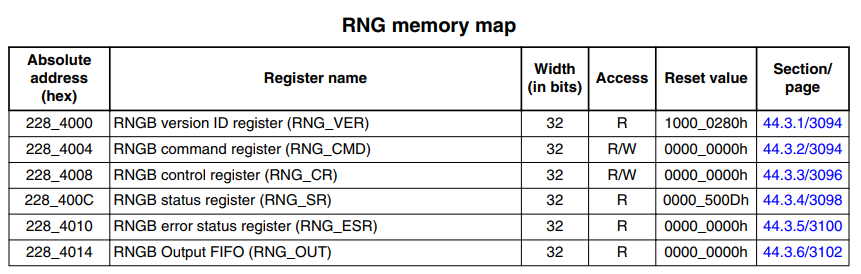
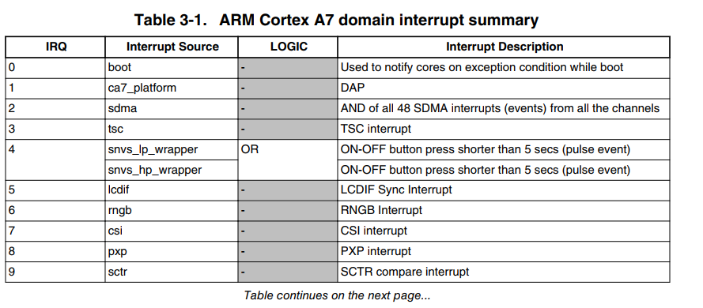

# random随机数模块

在Linux内核中，随机数生成是一个重要的功能，特别是在安全相关的应用中。random随机数模块提供了一个接口，允许内核和用户空间程序生成高质量的随机数。这个模块通常用于加密、安全协议、密钥生成等场景。对于芯片来说，它可以通过硬件来生成随机数，而不是依赖于软件来生成，这样可以实现更高质量的随机数方案。

在Linux系统中使用随机数，包含以下部分实现。

1. 芯片硬件处理实现随机数生成
2. 内核提供通过设备读取硬件生成随机数的接口
3. 用户空间通过接口读取硬件生成的随机数

- [硬件操作接口](#hardware_process)
- [驱动处理接口](#interface)
- [应用接口](#application)
- [总结说明](#summary)
- [下一章节](#next_chapter)

## hardware_process

对于I.MX6ULL芯片，内部支持随机数发生器RNGB(Random Number Generator)，其寄存器列表如下所示。

- 寄存器列表



- rngb中断类型



参考这两个信息，可以实现rngb模块的设备树，功能如下。

```c
//rngb设备树
rngb: rng@2284000 {
    compatible = "fsl,imx6ull-rngb", "fsl,imx25-rngb";   // 匹配节点字符串
    reg = <0x02284000 0x4000>;                           // 寄存器地址和大小
    interrupts = <GIC_SPI 6 IRQ_TYPE_LEVEL_HIGH>;        // 中断配置，使用GIC_SPI 6号中断
    clocks = <&clks IMX6UL_CLK_DUMMY>;                   // rngb使能和工作时钟源
};
```

在驱动中，通过如下函数，获取随机数硬件的设备树节点信息并处理。

```c
// 获取节点中的reg属性资源，后续使用rngc->base操作寄存器
rngc->base = devm_platform_ioremap_resource(pdev, 0);
if (IS_ERR(rngc->base))
    return PTR_ERR(rngc->base);

// 获取节点中的clocks属性资源，并使能时钟
rngc->clk = devm_clk_get_enabled(&pdev->dev, NULL);
if (IS_ERR(rngc->clk)) {
    dev_err(&pdev->dev, "Can not get rng_clk\n");
    return PTR_ERR(rngc->clk);
}

// 获取节点中的interrupts属性资源，并注册中断处理函数
irq = platform_get_irq(pdev, 0);
if (irq < 0)
    return irq;
//...
ret = devm_request_irq(&pdev->dev,
        irq, imx_rngc_irq, 0, pdev->name, (void *)rngc);
if (ret) {
    dev_err(rngc->dev, "Can't get interrupt working.\n");
    return ret;
}
```

randmo模块硬件上支持self-test模式，seed生成模式和随机数生成模式，其中驱动中获取的值是在随机数生成模式下生成，在后续会进行说明。

## interface

在驱动中，通过如下函数，注册rngb的随机数接口。

```c
//用于注册硬件随机数生成器（HWRNG）设备的函数
//@dev: 指向设备的指针
//@rng: 指向hwrng结构体的指针
//返回值：成功返回0，失败返回错误码
int devm_hwrng_register(struct device *dev, struct hwrng *rng);

//hwrng结构体内容
struct hwrng {
        const char *name;                                       // 唯一的RNG名称
        int (*init)(struct hwrng *rng);                         // 初始化回调函数（可以为NULL）
        void (*cleanup)(struct hwrng *rng);                     // 清理回调函数（可以为NULL）
        int (*data_present)(struct hwrng *rng, int wait);       // 回调函数，用于确定RNG上是否有数据可用。如果为NULL，则假定始终有数据可用。*已过时*
        int (*data_read)(struct hwrng *rng, u32 *data);         // 从RNG设备读取数据。返回“data”中较低随机字节的数量。必须不为NULL。*已过时*
        int (*read)(struct hwrng *rng, void *data, size_t max, bool wait); //新API。驱动程序可以将最多max字节的数据填充到缓冲区中。缓冲区对任何类型都对齐，并且max是4的倍数且>= 32字节。
        unsigned long priv;                                     // 私有数据，供RNG驱动程序使用
        unsigned short quality;                                 // 对RNG比特流中真实熵的估计（每1024位输入的熵位数；有效值：1到1024，或0表示未知）

        /* 内部使用 */
        struct list_head list;                                  // 链表头
        struct kref ref;                                        // 引用计数
        struct completion cleanup_done;                         // 清理完成信号量
        struct completion dying;                                // 正在销毁信号量
};

// 代码如下所示
rngc->rng.name = pdev->name;            // 唯一的RNG名称
rngc->rng.init = imx_rngc_init;         // 初始化回调函数
rngc->rng.read = imx_rngc_read;         // 从RNG设备读取数据
rngc->rng.cleanup = imx_rngc_cleanup;   // 清理回调函数
rngc->rng.quality = 19;                 // 对RNG比特流中真实熵的估计

//...

ret = devm_hwrng_register(&pdev->dev, &rngc->rng);
if (ret) {
    dev_err(&pdev->dev, "hwrng registration failed\n");
    return ret;
}
```

- init: rngb初始化会调用的函数，用于使能rngb硬件，对于IMX6ULL芯片，主要是执行seed生成，进入随机数生成模式。

```c
// 初始化rngb硬件，生成随机数seed
// @rng: 指向hwrng结构体的指针
static int imx_rngc_init(struct hwrng *rng)
{
    struct imx_rngc *rngc = container_of(rng, struct imx_rngc, rng);
    u32 cmd, ctrl;
    int ret;

    /* clear error */
    cmd = readl(rngc->base + RNGC_COMMAND);
    writel(cmd | RNGC_CMD_CLR_ERR, rngc->base + RNGC_COMMAND);

    imx_rngc_irq_unmask(rngc);

    /* 创建seed，在出现统计错误时重复此操作 */
    do {
        /* seed creation */
        cmd = readl(rngc->base + RNGC_COMMAND);
        writel(cmd | RNGC_CMD_SEED, rngc->base + RNGC_COMMAND);

        ret = wait_for_completion_timeout(&rngc->rng_op_done,
                RNGC_TIMEOUT);

        if (!ret) {
            ret = -ETIMEDOUT;
            goto err;
        }

    } while (rngc->err_reg == RNGC_ERROR_STATUS_STAT_ERR);

    if (rngc->err_reg) {
        ret = -EIO;
        goto err;
    }

    /* 使能自动seed模式，当随机数生成一定量时自动生成seed*/
    ctrl = readl(rngc->base + RNGC_CONTROL);
    ctrl |= RNGC_CTRL_AUTO_SEED;
    writel(ctrl, rngc->base + RNGC_CONTROL);
    return 0;

err:
    imx_rngc_irq_mask_clear(rngc);
    return ret;
}
```

- read: 从rngb硬件中读取随机数，对于I.MX6ULL芯片，主要是从fifo中读取随机数。

```c
// 从rngb硬件中读取随机数
// @rng: 指向hwrng结构体的指针
// @data: 指向缓冲区的指针，用于存储读取到的随机数
// @max: 缓冲区的最大大小
// @wait: 是否等待读取到足够的随机数
static int imx_rngc_read(struct hwrng *rng, void *data, size_t max, bool wait)
{
    struct imx_rngc *rngc = container_of(rng, struct imx_rngc, rng);
    unsigned int status;
    unsigned int level;
    int retval = 0;

    // 循环从fifo中读取随机数
    while (max >= sizeof(u32)) {
        status = readl(rngc->base + RNGC_STATUS);

        /* is there some error while reading this random number? */
        if (status & RNGC_STATUS_ERROR)
            break;

        /* 当前fifo中的随机数数量 */
        level = (status & RNGC_STATUS_FIFO_LEVEL_MASK) >>
            RNGC_STATUS_FIFO_LEVEL_SHIFT;

        if (level) {
            /* retrieve a random number from FIFO */
            *(u32 *)data = readl(rngc->base + RNGC_FIFO);

            retval += sizeof(u32);
            data += sizeof(u32);
            max -= sizeof(u32);
        }
    }

    return retval ? retval : -EIO;
}
```

- quality: 对RNG比特流中真实熵的估计，quality高的将会被选中为系统默认的随机数生成器。

关于向系统注册的代码如下所示。

```c
int hwrng_register(struct hwrng *rng)
{
    int err = -EINVAL;
    struct hwrng *tmp;
    bool is_new_current = false;

    if (!rng->name || (!rng->data_read && !rng->read))
        goto out;

    mutex_lock(&rng_mutex);

    /* Must not register two RNGs with the same name. */
    err = -EEXIST;
    list_for_each_entry(tmp, &rng_list, list) {
        if (strcmp(tmp->name, rng->name) == 0)
            goto out_unlock;
    }
    // 申请当前的随机数结构，并添加到系统列表中
    list_add_tail(&rng->list, &rng_list);

    init_completion(&rng->cleanup_done);
    complete(&rng->cleanup_done);
    init_completion(&rng->dying);

    // 判断注册随机数等级是否更高，更高则切换随机数源
    if (!current_rng ||
        (!cur_rng_set_by_user && rng->quality > current_rng->quality)) {
        /*
            * Set new rng as current as the new rng source
            * provides better entropy quality and was not
            * chosen by userspace.
            */
        err = set_current_rng(rng);
        if (err)
            goto out_unlock;
        /* to use current_rng in add_early_randomness() we need
            * to take a ref
            */
        is_new_current = true;
        kref_get(&rng->ref);
    }
    mutex_unlock(&rng_mutex);
    if (is_new_current || !rng->init) {
        /*
            * Use a new device's input to add some randomness to
            * the system.  If this rng device isn't going to be
            * used right away, its init function hasn't been
            * called yet by set_current_rng(); so only use the
            * randomness from devices that don't need an init callback
            */
        add_early_randomness(rng);
    }
    if (is_new_current)
        put_rng(rng);
    return 0;
out_unlock:
    mutex_unlock(&rng_mutex);
out:
    return err;
}
EXPORT_SYMBOL_GPL(hwrng_register);
```

可以看到，对于硬件random设备的注册，并不是在系统中创建random设备，而是将random设备添加到/dev/hwrng对应的列表去管理，并根据quality等级选择是否为当前的random设备。如果random的质量较低，则不会使用。对于/dev/hwrng，则是再启动时记载创建的杂项设备，其路径为："drivers/char/hw_random/core.c"，相关接口则如下所示。

```c
// 系统启动时创建misc设备，对应random硬件
static int __init hwrng_modinit(void)
{
    int ret;

    /* kmalloc makes this safe for virt_to_page() in virtio_rng.c */
    rng_buffer = kmalloc(rng_buffer_size(), GFP_KERNEL);
    if (!rng_buffer)
        return -ENOMEM;

    rng_fillbuf = kmalloc(rng_buffer_size(), GFP_KERNEL);
    if (!rng_fillbuf) {
        kfree(rng_buffer);
        return -ENOMEM;
    }

    ret = register_miscdev();
    if (ret) {
        kfree(rng_fillbuf);
        kfree(rng_buffer);
    }

    return ret;
}
fs_initcall(hwrng_modinit); /* depends on misc_register() */

// hwrng设备结构体，杂项设备
static struct miscdevice rng_miscdev = {
    .minor      = HWRNG_MINOR,
    .name       = RNG_MODULE_NAME,
    .nodename   = "hwrng",
    .fops       = &rng_chrdev_ops,
    .groups     = rng_dev_groups,
};

// 杂项设备操作函数
static const struct file_operations rng_chrdev_ops = {
    .owner      = THIS_MODULE,
    .open       = rng_dev_open,
    .read       = rng_dev_read,
    .llseek     = noop_llseek,
};
```

## application

在应用程序中，使用"/dev/random"和"/dev/hwrng"来读取随机数，代码如下所示。

```c
#include <fcntl.h>
#include <stdio.h>
#include <unistd.h>

#define RNGC_DEVICE "/dev/hwrng"

int main(int argc, const char *argv[])
{
    char buffer[64];
    int fd;
    int size = 0;

    fd = open(RNGC_DEVICE, O_RDONLY);
    if (fd == -1) {
        printf("open %s error\n", RNGC_DEVICE);
        return -1;
    }

    size = read(fd, buffer, sizeof(buffer));
    if (size >= 0) {
        printf("read size:%d\n", size);
        for (int i = 0; i < size; i++) {
            printf("%02x ", buffer[i]);
        }
    } else {
        printf("read failed:%d\n", size);
    }

    close(fd); 

    return 0;
}
```

使用交叉编译工具生成rngc_test，然后执行即可。

## summary

随机数模块作为Linux内核的一部分，是很多安全功能的基础，不过random相关驱动的实现并不复杂；定义初始化和读取硬件的函数，注册到系统中已经创建的/dev/hwrng设备列表中，根据quality筛选质量最高的random作为系统使用的随机数设备，之后即可在应用层访问。

## next_chapter

[返回目录](../README.md)

直接开始下一节说明: [regulator电源管理框架](./ch03-17.regulator.md)
