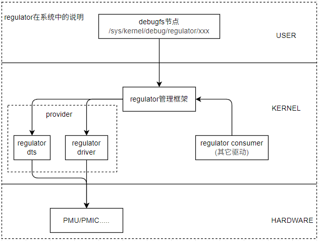
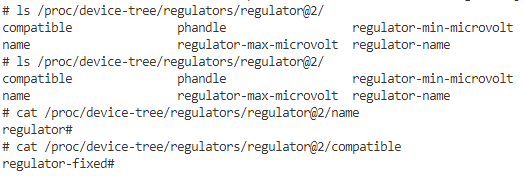
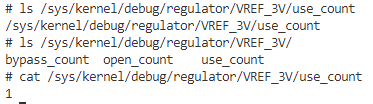

# regulator电源管理模块

随着芯片的性能需求越来越高，高性能、高集成的多核心SOC成为主流；主频和面积的提升，功耗和发热也更加严重。依靠传统的内部功率模块管理模块电源的方式，已经无法满足新的需求。为了优化电源管理，SOC常常包含数十个独立供电域，来提供精确的电源控制。高端的SOC往往需要内部的PMU和外部的PMIC电源管理芯片共同进行精细化的模块电压电流控制，这就对软件控制带来了更高的要求。regulator模块正是在这一背景下实现的，用来适配越来越复杂的电源管理需求。

regulator模块作为linux内核中用于管理电源的子系统；提供一套接口用于对电源管理模块进行操作，并定义获取电源硬件信息的一些基本接口。regulator模块的基本功能如下所示。

1. 电源调节控制，支持动态电压/电流调整，提供使能控制接口，实现软启动与关断时序管理。
2. 管理电源的拓扑关系，支持树状的的电源供应结构，管理访问电源的设备列表，处理多电源耦合关系。
3. 状态监控保护，提供互斥访问机制，异常状态检测，提供保护机制。

完整的regulator的框架如下所示。



具体说明如下。

1. regulator framework: 提供了regulator的框架，包含regulator注册的接口定义，提供regulator provider注册接口，以及regulator consumer的访问接口。
2. regulator provider: 注册regulator器件的接口，可以是具体的控制硬件；如内部的PMU模块，外部的PMIC模块，或者仅控制电源开关的GPIO引脚都可。
3. regulator consumer: 访问regulator provider的接口，用于获取regulator provider提供的电源信息；例如ADC，USB，CAN等，都依赖于特定的电源域的管理。
4. PMU/PMIC: 具体的管理电源的硬件，当consumer控制模式，使能或者设置限制时，会修改相应的PMU或PMIC硬件状态，从而控制系统的电压或电流。

这些模块共同构成regulator的框架，模块很多也比较难理解，学习Linux系统中regulator下的驱动就更复杂了。其实有更简单的办法，从需求的角度反而更简单；本质上我们需要一套能够管理设备硬件开关、电压、电流的机制；而且相应电源可能提供多个模块用于满足工作，保证系统不会错误的关闭，导致部分模块失效，regulator正是满足这个需求设定出来的。按照这个逻辑，regulator provider是管理设备电源的结构，regulator consumer是访问设备电源的结构，regulator framework是关联和管理电源的框架，这样统筹起来就能满足电源的管理需求。

这里以简单的例子进行说明，使用I/O控制3.3V电源开关。这是简单的需求，稍有经验的工程师应该就能实现，设备树中声明I/O的pinctrl和gpio；在驱动加载时打开I/O，移除时关闭I/O就能够控制，并不困难。不过如果这个I/O控制的3.3V电源给两个设备供电？第一个驱动申请了I/O，进行了控制，第二个驱动时I/O已经被占用了，此时就不能控制了，那么有没有实现的办法呢？当然是有的，将对I/O控制部分提取出来，单独注册驱动，内部计数进行限制管理；然后再请求的驱动中提供接口进行控制，这样就可以正确控制了。有没有觉得眼熟？是的，regulator正是基于这个逻辑实现的，电压，电源，开关注册实现的regulator provider正是单独驱动实现注册的，而访问的驱动正是regulator consumer；依照这个可以为学习regulator提供一个新的思路。下面开始讲解内核和驱动中的实现，具体目录如下所示。

- [regulator provider](#regulator_provider)
  - [regulator provider接口和结构体说明](#regulator_provider_interface)
  - [regulator provider设备树说明](#regulator_provider_dts)
  - [regulator provider驱动实现](#regulator_provider_driver)
- [regulator consumer](#regulator_consumer)
  - [regulator consumer接口说明](#regulator_consumer_interface)
  - [regulator consumer应用实现](#regulator_consumer_app)
- [总结说明](#summary)
- [下一章节](#next_chapter)

## regulator_provider

regulator_provider作为电源管理的提供者，需要理解以下知识点。

1. regulator框架提供注册/移除设备的接口。
2. 描述电源管理芯片支持硬件功能的设备树节点说明。
3. 匹配设备树节点，向内核注册相应节点的驱动。

具体内容如下所示。

### regulator_provider_interface

regulator作为管理系统电源模块的框架，主要接口如下所示。

```c
// regulator注册管理相关代码
// 注册regulator
// @dev: regulator对应的设备节点
// @regulator_desc: regulator的描述信息
// @config: regulator的配置信息
struct regulator_dev *regulator_register(struct device *dev, const struct regulator_desc *regulator_desc, 
                    const struct regulator_config *config);

// 解除regulator注册
// @rdev: 要解除注册的regulator设备
void regulator_unregister(struct regulator_dev *rdev);
```

这个接口包含三个关键的结构体，分别是regulator_desc、regulator_config和regulator_dev；具体描述如下所示。

- regulator_desc结构体，描述regulator的基本信息，包含regulator的名字、供电源名字、设备树匹配字符串、regulators节点、设备树解析回调函数、id、类型、拥有该regulator的内核模块指针等。

```c
enum regulator_type {
    REGULATOR_VOLTAGE,  // 电压 regulator
    REGULATOR_CURRENT,  // 电流 regulator
};

//regulator_desc结构体，描述regulator的基本信息
struct regulator_desc {
    const char *name;                           // regulator的名字
    const char *supply_name;                    // regulator的供电源名字
    const char *of_match;                       // 用于设备树匹配的字符串，用于在设备树中找到对应的regulator节点
    bool of_match_full_name;                    // 是否使用完整的设备树匹配字符串进行匹配
    const char *regulators_node;                // 指向设备树中regulators节点的名称，用于关联regulator设备
    int (*of_parse_cb)(struct device_node *,    // 设备树解析回调函数，用于解析设备树节点并填充regulator配置信息
                const struct regulator_desc *,
                struct regulator_config *);
    int id;                                     // 必要信息，regulator的唯一标识符
    unsigned int continuous_voltage_range:1;    // 标志位，指示电压范围是否连续，1 表示连续，0 表示离散
    unsigned n_voltages;                        // 必要信息，支持的离散电压值的数量
    unsigned int n_current_limits;              // 支持的电流限制值的数量
    const struct regulator_ops *ops;            // 必要信息，指向regulator操作函数集合的指针，包含了调节电压、电流等操作函数
    int irq;                                    // regulator使用的中断号，如果没有则为 -1
    enum regulator_type type;                   // 必要信息，regulator的类型，如电压或电流等
    struct module *owner;                       // 拥有该regulator的内核模块指针

    unsigned int min_uV;                        // 最小输出电压，单位为微伏（μV）
    unsigned int uV_step;                       // 电压调节步进值，单位为微伏（μV）
    unsigned int linear_min_sel;                // 线性电压范围的最小选择值
    int fixed_uV;                               // 固定输出电压值，单位为微伏（μV），如果为 -1 则表示非固定电压
    unsigned int ramp_delay;                    // 电压斜坡上升或下降的延迟时间，单位为微秒（μs）
    int min_dropout_uV;                         // 最小压差，单位为微伏（μV），即输入输出电压的最小差值

    const struct linear_range *linear_ranges;   // 指向线性电压范围数组的指针
    const unsigned int *linear_range_selectors; // 指向线性电压范围选择器数组的指针

    int n_linear_ranges;                        // 线性电压范围的数量

    const unsigned int *volt_table;             // 指向离散电压值表的指针
    const unsigned int *curr_table;             // 指向离散电流限制值表的指针

    unsigned int vsel_range_reg;                // 电压选择范围寄存器地址
    unsigned int vsel_range_mask;               // 电压选择范围寄存器掩码
    unsigned int vsel_reg;                      // 电压选择寄存器地址
    unsigned int vsel_mask;                     // 电压选择寄存器掩码
    unsigned int vsel_step;                     // 电压选择寄存器的步进值
    unsigned int csel_reg;                      // 电流选择寄存器地址
    unsigned int csel_mask;                     // 电流选择寄存器掩码
    unsigned int apply_reg;                     // 应用寄存器地址，用于使配置生效
    unsigned int apply_bit;                     // 应用寄存器中的有效位
    unsigned int enable_reg;                    // 使能寄存器地址
    unsigned int enable_mask;                   // 使能寄存器掩码
    unsigned int enable_val;                    // 使能寄存器的使能值
    unsigned int disable_val;                   // 使能寄存器的禁用值
    bool enable_is_inverted;                    // 使能信号是否反转，true 表示反转
    unsigned int bypass_reg;                    // 旁路寄存器地址
    unsigned int bypass_mask;                   // 旁路寄存器掩码
    unsigned int bypass_val_on;                 // 旁路寄存器的开启值
    unsigned int bypass_val_off;                // 旁路寄存器的关闭值
    unsigned int active_discharge_on;           // 主动放电开启值
    unsigned int active_discharge_off;          // 主动放电关闭值
    unsigned int active_discharge_mask;         // 主动放电寄存器掩码
    unsigned int active_discharge_reg;          // 主动放电寄存器地址
    unsigned int soft_start_reg;                // 软启动寄存器地址
    unsigned int soft_start_mask;               // 软启动寄存器掩码
    unsigned int soft_start_val_on;             // 软启动寄存器的开启值
    unsigned int pull_down_reg;                 // 下拉寄存器地址
    unsigned int pull_down_mask;                // 下拉寄存器掩码
    unsigned int pull_down_val_on;              // 下拉寄存器的开启值
    unsigned int ramp_reg;                      // 斜坡寄存器地址
    unsigned int ramp_mask;                     // 斜坡寄存器掩码
    const unsigned int *ramp_delay_table;       // 指向斜坡延迟时间表的指针
    unsigned int n_ramp_values;                 // 斜坡延迟时间值的数量

    unsigned int enable_time;                   // 使能regulator所需的时间，单位为微秒（μs）
    unsigned int off_on_delay;                  // 从关闭到开启的延迟时间，单位为微秒（μs）
    unsigned int poll_enabled_time;             // 轮询regulator使能状态的时间间隔，单位为微秒（μs）
    unsigned int (*of_map_mode)(unsigned int mode); // 设备树模式映射函数指针，用于将设备树中的模式映射为内部模式
};

//举例说明
static struct regulator_desc dcdc_desc = {
    .name           = "max8649",                // regulator名称
    .ops            = &max8649_dcdc_ops,        // regulator操作结构体指针
    .type           = REGULATOR_VOLTAGE,        // regulator类型，这里为电压 regulator
    .n_voltages     = 1 << 6,                   // 电压数量，这里为 64 个
    .owner          = THIS_MODULE,              // 模块拥有者，这里为当前模块
    .vsel_mask      = MAX8649_VOL_MASK,         // 配置 voltage 选择的 mask
    .min_uV         = MAX8649_DCDC_VMIN,        // 最小电压
    .uV_step        = MAX8649_DCDC_STEP,        // 电压的步进
    .enable_reg     = MAX8649_CONTROL,          // 配置 enable 的寄存器
    .enable_mask    = MAX8649_EN_PD,            // 配置 enable 的 mask
    .enable_is_inverted = true,                 // enable 的 invert
};
```

- regulator_config配置, 用于描述regulator的配置信息，包含设备节点、regulator的初始化数据、设备树节点、regmap等。

```c
// regulator_config结构体，用于描述regulator的配置信息
struct regulator_config {
    struct device *dev;  // 指向与该regulator关联的设备节点的指针，用于表示该regulator所属的设备
    const struct regulator_init_data *init_data;  // 指向regulator初始化数据结构体的指针，包含regulator初始状态、电压范围等初始化配置信息
    void *driver_data;  // 驱动私有数据指针，可由驱动程序自定义使用，用于存储与该regulator相关的特定数据
    struct device_node *of_node;  // 指向设备树中该regulator对应节点的指针，用于从设备树获取regulator的相关配置信息
    struct regmap *regmap;  // 指向寄存器映射结构体的指针，用于通过统一接口访问regulator的硬件寄存器
    struct gpio_desc *ena_gpiod;  // 指向使能GPIO描述符的指针，用于控制regulator的使能状态
};

//举例说明
struct regulator_config config = { };

config.dev = &client->dev;
config.init_data = pdata->regulator;
config.driver_data = info;
config.regmap = info->regmap;
```

- regulator_dev结构体, 用于描述regulator的具体实现，包含regulator的描述信息、regulator的配置信息、regulator的状态信息、regulator的操作函数等。

```c
// regulator_dev结构体，用于描述regulator的具体实现，包含其状态、配置、操作等信息
struct regulator_dev {
    const struct regulator_desc *desc;  // 指向regulator描述信息结构体的指针，包含regulator的基本属性
    int exclusive;                      // 排他标志，用于表示该regulator是否为排他使用，非零值表示排他
    u32 use_count;                      // regulator的使用计数，记录当前有多少地方正在使用该regulator
    u32 open_count;                     // regulator的打开计数，记录该regulator被打开的次数
    u32 bypass_count;                   // regulator的旁路计数，记录该regulator处于旁路模式的次数

    struct list_head list;              // 链表节点，用于将该regulator加入到所有regulator的链表中

    struct list_head consumer_list;     // 消费者链表头，用于管理该regulator供电的所有设备

    struct coupling_desc coupling_desc;  // 耦合描述信息结构体，用于描述该regulator与其他regulator的耦合关系

    struct blocking_notifier_head notifier; // 阻塞通知器头，用于注册和通知感兴趣的事件
    struct ww_mutex mutex;                  // 消费者锁，用于保护对该regulator消费者相关操作的互斥访问
    struct task_struct *mutex_owner;        // 持有消费者锁的任务结构体指针，记录当前持有锁的任务
    int ref_cnt;                            // 引用计数，用于管理该regulator_dev结构体的生命周期
    struct module *owner;                   // 拥有该regulator的内核模块指针
    struct device dev;                      // 设备结构体，代表该regulator作为一个设备的相关信息
    struct regulation_constraints *constraints;  // 调节约束结构体指针，包含该regulator的调节限制条件
    struct regulator *supply;               // 电源供应regulator指针，用于构建电源供应树
    const char *supply_name;                // 电源供应的名称
    struct regmap *regmap;                  // 寄存器映射结构体指针，用于访问该regulator的硬件寄存器

    struct delayed_work disable_work;       // 延迟工作队列项，用于延迟执行regulator的禁用操作

    void *reg_data;                         // regulator_dev的私有数据指针，可由驱动自定义使用

    struct dentry *debugfs;                 // debugfs目录项指针，用于在debugfs中创建调试接口

    struct regulator_enable_gpio *ena_pin;  // 使能GPIO结构体指针，用于控制regulator的使能状态
    unsigned int ena_gpio_state:1;          // 使能GPIO状态标志位，1 表示使能，0 表示禁用

    unsigned int is_switch:1;               // 开关标志位，1 表示该regulator是一个开关，0 表示不是

    ktime_t last_off;                       // 记录该regulator最后一次被禁用的时间
    int cached_err;                         // 缓存的错误码，用于保存最近一次操作的错误信息
    bool use_cached_err;                    // 是否使用缓存错误码的标志位
    spinlock_t err_lock;                    // 错误锁，用于保护对缓存错误码的并发访问
};
```

上述就是实现regulator注册的结构体，这部分往往由厂商实现驱动代码，在系统中注册相应的regulator设备，供其它驱动使用。regulator注册相关的驱动可以参考内核"drivers/regulator/"目录下的实现，相关文档可以参考"Documentation/power/regulator"目录下的说明。

### regulator_provider_dts

regulator模块设计和芯片息息相关，因此一般由芯片供应商提供相应的设备树和驱动。这里以I.MX6ULL中的regulator-peri-3v3为例，说明其设备树和驱动实现。

```c
// regulator_vref_adc设备节点
regulator_vref_adc: regulator@2 {
    compatible = "regulator-fixed";         // 设备树标签，驱动匹配时使用，这里表示电压固定
    regulator-name = "VREF_3V";             // regulator别名，注册到系统中使用
    regulator-min-microvolt = <3300000>;    // 最小电压
    regulator-max-microvolt = <3300000>;    // 最大电压
    regulator-always-on;                    // 始终开启 
};
```

对于设备树节点，主要包含以下几个部分。

1. compatible:  设备树节点的兼容字符串，用于识别该设备树节点。
2. gpio:  引脚配置，对于部分I/O控制的电源模块，gpio引脚用于控制电源模块的开关。
3. regulator配置: 指定电源模块的配置信息，包括电源模块的名称、最小电压、最大电压、是否总是开启等。

当然，这里有些特殊控制参数。

1. regulator-boot-on: 模块是否在启动时默认开启。
2. regulator-always-on: 模块是否总是开启，带有该参数后，模块将不会根据系统状态进行开关控制。

### regulator_provider_driver

对于regulator的驱动，在内核中已经实现，详细参考内核代码: "drivers/regulator/fixed.c"；具体文件如下所示。

- [regulator fixed注册驱动](./file/ch03-17/fixed.c)

对于文件解析，主要包含以下几个部分。

- 匹配设备树节点，注册驱动的代码实现。

```c
// 设备树节点匹配参数
static struct platform_driver regulator_fixed_voltage_driver = {
    .probe        = reg_fixed_voltage_probe,
    .driver        = {
        .name        = "reg-fixed-voltage",
        .of_match_table = of_match_ptr(fixed_of_match),
        .pm = &reg_fixed_voltage_pm_ops,
    },
};

// 注册驱动，执行设备树节点匹配对应的probe函数
static int __init regulator_fixed_voltage_init(void)
{
    return platform_driver_register(&regulator_fixed_voltage_driver);
}
subsys_initcall(regulator_fixed_voltage_init);

// 驱动注销
static void __exit regulator_fixed_voltage_exit(void)
{
    platform_driver_unregister(&regulator_fixed_voltage_driver);
}
module_exit(regulator_fixed_voltage_exit);

// 模块信息
MODULE_AUTHOR("Mark Brown <broonie@opensource.wolfsonmicro.com>");
MODULE_DESCRIPTION("Fixed voltage regulator");
MODULE_LICENSE("GPL");
MODULE_ALIAS("platform:reg-fixed-voltage");
```

- 解析设备树节点，获取相应的配置信息

```c
static struct fixed_voltage_config *
of_get_fixed_voltage_config(struct device *dev,
                const struct regulator_desc *desc)
{
    struct fixed_voltage_config *config;
    struct device_node *np = dev->of_node;
    struct regulator_init_data *init_data;

    // 申请regulator管理数据控制
    config = devm_kzalloc(dev, sizeof(struct fixed_voltage_config),
                                 GFP_KERNEL);
    if (!config)
        return ERR_PTR(-ENOMEM);

    // 获取regulator_init_data数据，包含通用配置信息，详细参考/drivers/regulator/of_regulator.c
    // regulator-min-microvolt:  最小电压
    // regulator-max-microvolt:  最大电压
    // regulator-boot-on:        模块是否在启动时默认开启
    // regulator-always-on:      模块是否总是开启
    // regulator-pull-down:      模块是否需要下拉
    config->init_data = of_get_regulator_init_data(dev, dev->of_node, desc);
    if (!config->init_data)
        return ERR_PTR(-EINVAL);

    init_data = config->init_data;
    init_data->constraints.apply_uV = 0;
    
    // 初始化模块配置信息(名称，电压)
    // 固定电压要求模块电压上限和下限一致
    config->supply_name = init_data->constraints.name;
    if (init_data->constraints.min_uV == init_data->constraints.max_uV) {
        config->microvolts = init_data->constraints.min_uV;
    } else {
        dev_err(dev,
             "Fixed regulator specified with variable voltages\n");
        return ERR_PTR(-EINVAL);
    }

    // 是否启动时开启
    if (init_data->constraints.boot_on)
        config->enabled_at_boot = true;

    of_property_read_u32(np, "startup-delay-us", &config->startup_delay);
    of_property_read_u32(np, "off-on-delay-us", &config->off_on_delay);

    // 是否为输入源
    if (of_find_property(np, "vin-supply", NULL))
        config->input_supply = "vin";

    return config;
}
```

- 根据配置信息，完善regulator_desc和regulator_config结构体，注册regulator设备

```c
struct fixed_voltage_data *drvdata;
struct regulator_config cfg = { };

// 申请管理regulator的驱动设备
drvdata = devm_kzalloc(&pdev->dev, sizeof(struct fixed_voltage_data),
                GFP_KERNEL);
if (!drvdata)
    return -ENOMEM;

//......

// 初始化drvdata->desc结构体
drvdata->desc.name = devm_kstrdup(&pdev->dev,
                    config->supply_name,
                    GFP_KERNEL);
if (drvdata->desc.name == NULL) {
    dev_err(&pdev->dev, "Failed to allocate supply name\n");
    return -ENOMEM;
}
drvdata->desc.type = REGULATOR_VOLTAGE;
drvdata->desc.owner = THIS_MODULE;

//......

//  获取GPIO资源
cfg.ena_gpiod = gpiod_get_optional(&pdev->dev, NULL, gflags);
if (IS_ERR(cfg.ena_gpiod))
    return dev_err_probe(&pdev->dev, PTR_ERR(cfg.ena_gpiod),
                    "can't get GPIO\n");

cfg.dev = &pdev->dev;
cfg.init_data = config->init_data;
cfg.driver_data = drvdata;
cfg.of_node = pdev->dev.of_node;

// 向系统注册regulator设备，用于其它设备访问
drvdata->dev = devm_regulator_register(&pdev->dev, &drvdata->desc,
                        &cfg);
if (IS_ERR(drvdata->dev)) {
    ret = dev_err_probe(&pdev->dev, PTR_ERR(drvdata->dev),
                "Failed to register regulator: %ld\n",
                PTR_ERR(drvdata->dev));
    return ret;
}
```

对于已经注册到内核regulator设备，可以通过设备树查看相应的设备树节点。也可以通过debugfs节点查看相应的设备文件。

- 查看regulator设备树节点

```shell
# 查看regulator设备树节点
$ cat /proc/device-tree/regulators/regulator@2
```



- 查看debugfs中的regulator设备文件

```shell
# 挂载debugfs目录
mount -t debugfs none /sys/kernel/debug

# 查看regulator设备文件
ls /sys/kernel/debug/regulator/VREF_3V/
```



在调试信息中，有一个重点信息use_count，表示当前执行了多少次开启regulator动作；当use_count为0时，此时regulator_enable会开启访问硬件驱动，大于0时则只增加计数。use_count大于1时，此时regulator_disable只减少计数，等于1时，才会真正的关闭。对于regulator只被一个模块使用，可以通过regulator_is_enable判断是否执行开启和关闭执行。如果regulator被多个模块使用，则比较复杂，此时可直接使用regulator-always-on和regulator-boot-on来保证模块供电正常。

至此，关于如何在系统注册regulator设备的功能说明完毕，下面讲解在其它设备驱动中如何使用已经注册到内核regulator设备。

## regulator_consumer

和regulator_provider类似，作为使用regulator的应用，其需要理解以下知识点。

1. 访问regulator设备的接口。
2. 引用regulator资源的设备树节点。
3. 使用regulator设备节点资源的驱动。

具体内容如下所示。

## regulator_consumer_interface

和pwm，iio这些框架类似，regulator主要的功能是作为provider，提供接口给其它驱动使用，这部分的相关接口如下所示。

```c
//根据ID获取已经注册的regulator(devm_regulator_get)
//@dev: regulator所属的设备
//@id: regulator在设备树中的标签值，匹配设备树节点中的xxx-regulator标签
//返回值: 成功返回regulator指针，失败返回NULL
struct regulator *regulator_get(struct device *dev, const char *id);

//释放已经获取的regulator
//@regulator: 已经获取的regulator
void regulator_put(struct regulator *regulator);

//使能regulator
//@regulator: 要使能的regulator
//返回值: 成功返回0，失败返回错误码
int regulator_enable(struct regulator *regulator);

// 获取regulator使能状态
// @regulator: 要获取状态的regulator
// 返回值: 使能返回1，其它返回0
int regulator_is_enabled(struct regulator *regulator);

// 关闭regulator
// @regulator: 要关闭的regulator
// 返回值: 成功返回0，失败返回错误码
int regulator_disable(struct regulator *regulator);

// 设置regulator电压，相同时设置电压值，不同时设置电压范围
// @regulator: 要设置电压的regulator
// @min_uV: 最小电压值，单位为微伏（μV）
// @max_uV: 最大电压值，单位为微伏（μV）
// 返回值: 成功返回0，失败返回错误码
int regulator_set_voltage(struct regulator *regulator, int min_uV, int max_uV);

// 获取regulator电压
// @regulator: 要获取电压的regulator
// 返回值: 成功返回当前电压值，失败返回错误码
int regulator_get_voltage(struct regulator *regulator);

// 设置regulator电流限制
// @regulator: 要设置电流限制的regulator
// @min_uA: 最小电流限制值，单位为微安（μA）
// @max_uA: 最大电流限制值，单位为微安（μA）
// 返回值: 成功返回0，失败返回错误码
int regulator_set_current_limit(struct regulator *regulator, int min_uA, int max_uA);

// 获取regulator电流限制
// @regulator: 要获取电流限制的regulator
// 返回值: 成功返回当前电流限制值，失败返回错误码
int regulator_get_current_limit(struct regulator *regulator);

// 设置regulator工作模式
// @regulator: 要设置工作模式的regulator
// @mode: 工作模式，具体根据regulator的类型和支持的模式而定
// 返回值: 成功返回0，失败返回错误码
int regulator_set_mode(struct regulator *regulator, unsigned int mode);

// 获取regulator工作模式
// @regulator: 要获取工作模式的regulator
// 返回值: 当前工作模式，具体根据regulator的类型和支持的模式而定
unsigned int regulator_get_mode(struct regulator *regulator);

// 设置regulator事件通知函数
// @regulator: 要设置事件通知函数的regulator
// @nb: 事件通知函数指针，用于事件通知regulator的状态变化
int regulator_register_notifier(struct regulator *regulator,
                struct notifier_block *nb);

// 取消regulator事件通知函数
// @regulator: 要取消事件通知函数的regulator
// @nb: 要取消的事件通知函数指针
int regulator_unregister_notifier(struct regulator *regulator,
                    struct notifier_block *nb);
```

上述就是regulator作为应用主要使用的接口，这部分的相关接口可以参考"Documentation/power/regulator/consumer.rst"文件中的说明。

## regulator_consumer_app

regulator_consumer作为电源管理的消费者，是在驱动中经常使用得模块。使用regulator的操作比较简单，这里以引用regulator_vref_adc为例。

- 在设备树节点中引用指定的regulator节点。

```c
//adc设备节点
&adc1 {
    //......
    vref-supply = <&regulator_vref_adc>; // 引用vref的设备节点
    status = "okay";
};
```

- 驱动中获取regulator节点，进行处理。

```c
// 获取电源管理相关信息，使能并获取基准电压
info->vref = devm_regulator_get(&pdev->dev, "vref");
if (IS_ERR(info->vref)) {
    dev_err(&pdev->dev, "failed get vref regulator");
    return PTR_ERR(info->vref);
}

// 使能regulator模块
ret = regulator_enable(info->vref);
if (ret) {
    dev_err(&pdev->dev, "failed enable vref regulator");
    return ret;
}

// 获取regulator节点的电压信息
info->vref_uv = regulator_get_voltage(info->vref);
```

这样在驱动中就可以使用vref_uv作为基准电压去进一步处理，这部分可以参考iio章节中关于ADC硬件的应用。

- [iio-adc中regulator的应用](./ch03-09.iio_subsystem.md#adc_devicetree)

## summary

在本章节中，以ADC中的基准电压为例，对于regulator模块进行说明；主要讲述了一下内容。

1. regulator作为设备节点，如何以regulator provider的身份注册到内核中，并在系统中被调试访问。
2. 讲述了驱动中访问regulator模块的接口，以及如何操作regulator硬件

这两部分通过regulator框架进行管理，最终实现了精细化的电压，电流的控制；也为其它模块的PM管理实现提供了相关接口。理解了regulator模块，对于系统精细化管控系统功耗，有着重要的意义。

## next_chapter

[返回目录](../README.md)

直接开始下一节说明: [串口tty管理框架](./ch03-18.tty_serial_console.md)
