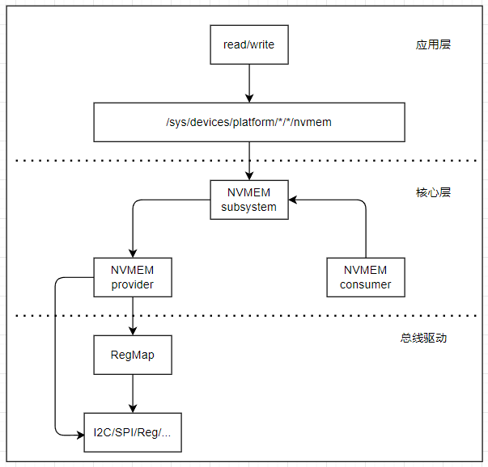
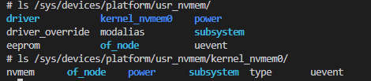

# nvmem子系统管理框架

Linux NVMEM子系统为Non-Volatile类型存储提供统一内核处理框架，主要用于实现EEPROM、Efuse等非易失存储器的统一管理。NVMEM子系统整体架构相对简单，主要包括以下几个部分组成。

1. 应用层：可以通过用户空间所提供的文件节点来读取或修改NVMEM存储器的数据。用户空间下的目录结构通常为/sys/bus/nvmem/devices/dev-name/nvmem，其中dev-name是NVMEM设备的名称。
2. NVMEM核心层：统一管理NVMEM设备，向上实现文件系统接口数据的传递，向下提供统一的注册和注销NVMEM设备接口。
3. NVMEM总线驱动：负责注册NVMEM总线，并实现NVMEM控制器的底层代码

典型的nvmem操作流程如下所示。



1. NVMEM子系统，管理NVMEM的模块框架
2. NVMEM provider，实现初始化，读取和写入非易失性存储器的方法的实体
3. NVMEM consumer，内核中调用NVMEM资源的模块，以cell的形式进行操作的实体

本节目录如下所示。

- [nvmem结构体信息](#nvmem_structure)
- [nvmem provider实现](#nvmem_provider)
- [nvmem consumer实现](#nvmem_consumer)
- [nvmem应用层访问](#nvmem_app)
- [下一章节](#next_chapter)

## nvmem_structure

对于nvmem子系统，其主要实现代码在drivers/nvmem目录下的core.c，实现了nvmem的注册，移除相关的接口。对于驱动来说，只需要直接注册即可使用，主要涉及接口如下所示。

```c
//在系统中注册nvmem设备(devm管理)
struct nvmem_device *devm_nvmem_register(struct device *dev, const struct nvmem_config *config)

//在系统中注册nvmem设备
struct nvmem_device *nvmem_register(const struct nvmem_config *config)

//移除已经注册的nvmem设备
void nvmem_unregister(struct nvmem_device *nvmem)
```

其中最重要的就是nvmem_config和nvmem_config两个选项，具体说明如下。

```c
enum nvmem_type {
    NVMEM_TYPE_UNKNOWN = 0,             //未知类型
    NVMEM_TYPE_EEPROM,                  //epprom
    NVMEM_TYPE_OTP,                     //otp
    NVMEM_TYPE_BATTERY_BACKED,          //电池备份区
    NVMEM_TYPE_FRAM,                    //fram存储器
};

struct nvmem_config {
    struct device   *dev;                   //父设备，nvmem所在的节点设备(需要)
    const char      *name;                  //可选名称，nvmem在系统中的节点名称(可选)
    int             id;                     //可选设备ID，如果名称不为NULL时和name共同构成节点名称(可选)
    struct module    *owner;                //模块所有者，一般为THIS_MODULE(需要)
    const struct nvmem_cell_info    *cells; //预定义NVMEM单元的可选数组(可选)
    int             ncells;                 //单元格中的元素个数(可选)
    const struct nvmem_keepout *keepout;    //可选的keepout范围数组(可选)
    unsigned int    nkeepout;               //keepout范围数组中的元素数(可选)
    enum nvmem_type type;                   //nvmem类型
    bool            read_only;              //设备只允许读取(需要)
    bool            root_only;              //设备只允许root用户访问(需要)
    bool            ignore_wp;              //写保护脚由供应商管理(nvmem不处理写保护硬件，可选)
    struct device_node  *of_node;           //定义用于取代父节点的of_node(可选)
    bool            no_of_node;             //是否使用父节点的of_node(可选)
    nvmem_reg_read_t    reg_read;           //定义读取nvmem的回调函数(需要)
    nvmem_reg_write_t   reg_write;          //定义写入nvmem的回调函数(需要)
    nvmem_cell_post_process_t cell_post_process; //针对供应商特定的单元数据后处理的回调(可选)
    int             size;                   //设备的存储总长度（需要）
    int             word_size;              //定义设备的读/写一个的长度(需要)
    int             stride;                 //连续访问时，访问的最小间隔步幅(需要)
    void            *priv;                  //模块的私有数据，保存操作(可选)
    /* To be only used by old driver/misc/eeprom drivers */
    bool            compat;                 //兼容老的eeprom的参数
    struct device   *base_dev;
};

struct nvmem_device {
    struct module    *owner;                //模块所有者，一般为THIS_MODULE
    struct device    dev;                   //父设备，nvmem所在的节点设备
    int      stride;                        //连续访问时，访问的最小间隔步幅
    int      word_size;                     //定义设备的读/写一个的长度
    int      id;                            //可选设备ID，如果名称不为NULL时和name共同构成节点名称
    struct kref    refcnt;                  //设备内核引用计数机制
    size_t      size;                       //设备的存储总长度
    bool      read_only;                    //设备只允许读取
    bool      root_only;                    //设备只允许root用户访问
    int      flags;                         //支持兼容的标志位
    enum nvmem_type    type;                //nvmem类型
    struct bin_attribute  eeprom;           //eeprom属性文件
    struct device    *base_dev;             //兼容老的eeprom的参数
    struct list_head  cells;                //预定义NVMEM单元的列表
    const struct nvmem_keepout *keepout;    //可选的keepout范围数组
    unsigned int    nkeepout;               //keepout范围数组中的元素数
    nvmem_reg_read_t  reg_read;             //定义读取nvmem的回调函数
    nvmem_reg_write_t  reg_write;           //定义写入nvmem的回调函数
    nvmem_cell_post_process_t cell_post_process;    //针对供应商特定的单元数据后处理的回调
    struct gpio_desc  *wp_gpio;             //控制写保护的控制引脚
    void *priv;                             //模块的私有数据，保存操作(可选)
};
```

## nvmem_provider

nvmem provider驱动在系统中注册关联内核文件和系统硬件的接口，可以用于访问eeprom，otocp，以及读写内部寄存器信息等。本例中以一段内核中的数据作为存储空间，实现比较简单，首先定义设备树如下。

```c
/ {
    //...

    usr_nvmem {
        compatible = "rmk,nvmem";
        status = "okay";        
    };
}

```

在驱动中匹配上述设备树，执行probe程序。

```c
//匹配的是根节点的compatible属性
static const struct of_device_id nvmem_of_match[] = {
    { .compatible = "rmk,usr-nvmem" },
    { /* Sentinel */ }
};

static struct platform_driver platform_driver = {
    .driver = {
        .name = "nvmem",
        .of_match_table = nvmem_of_match,
    },
    .probe = nvmem_probe,
    .remove = nvmem_remove,
};

static int __init nvmem_module_init(void)
{
    platform_driver_register(&platform_driver);
    return 0;
}

static void __exit nvmem_module_exit(void)
{
    platform_driver_unregister(&platform_driver);
}
```

在probe函数中执行配置，创建epprom文件节点用于读写访问nvmem子系统。

```c
static u8 static_mem[2048] = {0};

//定义nvmem读函数，从内核中读取数据(可以是具体的内存地址，寄存器，外部的eeprom等)
static int nvmem_read(void *priv, unsigned int off, void *val, size_t count)
{
    struct nvmem_data* nvmem; 

    nvmem = priv;

    mutex_lock(&nvmem->lock);
    memcpy(val, &static_mem[off], count);
    mutex_unlock(&nvmem->lock);

    dev_info(nvmem->dev, "nvmem_read, off:%d, count:%d!\n", off, count);
    return 0;
}

//定义nvmem写函数，将外部数据写入到内核中存储地址(可以是具体的内存地址，寄存器，外部的eeprom等)
static int nvmem_write(void *priv, unsigned int off, void *val, size_t count)
{
    struct nvmem_data* nvmem; 

    nvmem = priv;

    mutex_lock(&nvmem->lock);
    memcpy(&static_mem[off], val, count);
    mutex_unlock(&nvmem->lock);
    
    dev_info(nvmem->dev, "nvmem_write, off:%d, count:%d!\n", off, count);
    return 0;
}


static int nvmem_probe(struct platform_device *pdev)
{
    struct nvmem_data* nvmem;
    struct nvmem_config config = { };
    struct device *dev = &pdev->dev;

    nvmem = devm_kzalloc(&pdev->dev, sizeof(*nvmem), GFP_KERNEL);
    if (!nvmem) {
        dev_err(&pdev->dev, "[devm_kzalloc]malloc failed!\n");
        return -ENOMEM;
    }

    mutex_init(&nvmem->lock);

    nvmem->byte_len = 2048;
    nvmem->dev = dev;

    config.name = "kernel_nvmem";             //定义nvmem的名称
    config.dev = dev;
    config.read_only = 0;                     //定义存储是否可写
    config.root_only = 0;                     //仅允许root用户访问
    config.owner = THIS_MODULE;             
    config.compat = true;
    config.base_dev = dev;
    config.reg_read = nvmem_read;             //读取回调函数
    config.reg_write = nvmem_write;           //写入回调函数
    config.priv = nvmem;
    config.stride = 1;                        //连续访问时，访问的间隔步幅
    config.word_size = 1;                     //最小可读写/访问粒度(访问设备的基本字节单位)
    config.size = nvmem->byte_len;            //存储块的总长度(单位字节)

    //注册nvmem设备
    nvmem->nvmem = devm_nvmem_register(dev, &config);
    if (IS_ERR(nvmem->nvmem)) {
        dev_err(&pdev->dev, "[devm_nvmem_register]register failed!\n");
        return PTR_ERR(nvmem->nvmem);
    }

    dev_info(&pdev->dev, "[kernel_nvmem]register %s success!\n", config.name);
    return 0;
}
```

编译加载成功后，显示如下。



```shell
# epprom/nvmem访问节点
/sys/devices/platform/user_nvmem/epprom
/sys/devices/platform/user_nvmem/kernel_nvmem0/nvmem

# 向epprom里写入数据
echo "hello test" > /sys/devices/platform/user_nvmem/epprom

# 从epprom中读出数据
hexdump -C /sys/devices/platform/user_nvmem/epprom
```

## nvmem_consumer

nvmem consumer则是内核中以cell的形式操作nvmem资源的模块，这些模块并没有限制，可以是cpu时钟管理模块，温控模块，i2c设备模块等。一个简单的支持nvmem_cell访问的设备节点如下所示。

```c
/ {
    //nvmem consumer
    usr_nref {
        compatible = "rmk,usr_nref";        //标签属性，驱动中匹配字符串
        nvmem-cells = <&nvmem_cell>;        //引用的nvmem下的cell节点，必须本身在nvmem节点下
        nvmem-cell-names = "nvmem_cell";    //节点别名，驱动中使用此字符串获取cell资源
        status = "okay";
    };

    //nvmem provider
    usr_nvmem {
        compatible = "rmk,usr_nvmem";       //标签属性，驱动中匹配字符串
        #address-cells = <1>;               //子节点寄存器位数
        #size-cells = <1>;                  //子节点长度位数
        status = "okay";                

        nvmem_cell: nvmem_cell@10 {         //cell节点，寄存器表示在nvmem中的偏移值
            reg = <0x10 4>;                 //寄存器表示nvmem中的偏移值，长度表示允许读取的size，consumer读取必须一致
        };
    };
};
```

对于nvmem consumer支持以下接口来访问系统中的nvmem资源，

```c
//获取nvmem_cell资源，用于后续处理
//id为设备树中的nvmem-cell-names信息
struct nvmem_cell *nvmem_cell_get(struct device *dev, const char *id)

//释放已经获取的nvmem_cell资源
void nvmem_cell_put(struct nvmem_cell *cell);

//由内核管理的获取nvmem_cell资源
struct nvmem_cell *devm_nvmem_cell_get(struct device *dev, const char *id);

//返回cell内数据和长度
void *nvmem_cell_read(struct nvmem_cell *cell, size_t *len)

//向cell中写入指定长度的数据
int nvmem_cell_write(struct nvmem_cell *cell, void *buf, size_t len);

//读取u8，u16，u32，u64长度的数据
int nvmem_cell_read_u8(struct device *dev, const char *cell_id, u8 *val);
int nvmem_cell_read_u16(struct device *dev, const char *cell_id, u16 *val);
int nvmem_cell_read_u32(struct device *dev, const char *cell_id, u32 *val);
int nvmem_cell_read_u64(struct device *dev, const char *cell_id, u64 *val);
```

在nvmem consumer中实现的读写函数如下所示。

```c
static ssize_t nref_show(struct device *dev, struct device_attribute *attr, char *buf)
{
    int size, ret;
    u32 val;

    // 从nvmem cell中读取数据
    ret = nvmem_cell_read_u32(dev, "nvmem_cell", &val);
    if(ret) {
        dev_err(dev, "cell read failed, ret:%d!\n", ret);
        return 0;
    }

    size = sprintf(buf, "val=0x%x", val);
    return size;
}

static ssize_t nref_store(struct device *dev, struct device_attribute *attr,  const char *buf, size_t count)
{
    int ret;
    struct nvmem_cell *cell;
    uint8_t inbuf[4] = {0};

    // 获取系统中的cell资源
    cell = devm_nvmem_cell_get(dev, "nvmem_cell");
    if(!cell) {
        dev_err(dev, "cell null");
        return 0;
    }

    // 向nvmem cell中写入数据
    count = count<sizeof(inbuf)?count:sizeof(inbuf);
    memcpy(inbuf, buf, count);
    dev_err(dev, "cell write:%d", count);
    ret = nvmem_cell_write(cell, inbuf, 4);
    if(ret != 4) {
        dev_err(dev, "cell write failed:%d", ret);
        return ret;
    }

    return count;
}
```

## nvmem_app

应用层使用open, read, write, lseek, close即可访问epprom数据，代码如下。

```c
#include <fcntl.h>
#include <stdio.h>
#include <unistd.h>

#define NVMEM_DEVICE_FILE "/sys/devices/platform/usr_nvmem/eeprom"

int main(int argc, const char *argv[])
{
    char buffer[64];
    int fd;
    int size = 0;

    // 打开eeprom节点
    fd = open(NVMEM_DEVICE_FILE, O_RDWR | O_NDELAY);
    if (fd == -1) {
        printf("open %s error", NVMEM_DEVICE_FILE);
        return -1;
    }

    // 移动指针位置，偏移地址
    lseek(fd, 100, SEEK_SET);

    //读取数据
    size = read(fd, buffer, sizeof(buffer));
    if (size >= 0) {
        printf("read size:%d\n", size);
    } else {
        printf("read failed:%d\n", size);
    }

    //关闭设备文件节点
    close(fd); 

    return 0;
}
```

## next_chapter

[返回目录](../README.md)

直接开始下一节说明: [块设备管理框架](./ch03-20.block_device.md)
