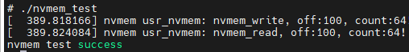
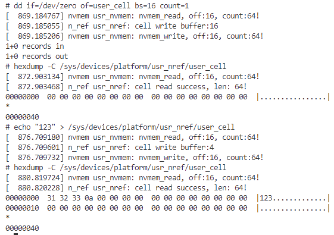

# nvmem子系统管理框架

Linux NVMEM子系统为Non-Volatile类型存储提供统一内核处理框架，主要用于实现EEPROM、Efuse等非易失存储器的统一管理。NVMEM子系统整体架构相对简单，主要包括以下几个部分组成。

1. 应用层：可以通过用户空间所提供的文件节点来读取或修改NVMEM存储器的数据。用户空间下的目录结构通常为/sys/bus/nvmem/devices/[dev-name]/nvmem，其中dev-name是NVMEM设备的名称。
2. NVMEM核心层：统一管理NVMEM设备，向上实现文件系统接口数据的传递，向下提供统一的注册和注销NVMEM设备接口。
3. NVMEM总线驱动：负责注册NVMEM总线，并实现NVMEM控制器的底层代码。

典型的nvmem执行框架如下所示。


1. NVMEM子系统，管理NVMEM的模块框架，由内核实现的nvmem接口；在"/drviers/nvmem"目录下实现。
2. NVMEM provider，基于NVMEM子系统实现的，访问对应硬件；也可以以资源形式被其他驱动访问。
3. NVMEM consumer，内核中调用NVMEM资源的模块，以cell的形式进行操作的实体

本节目录如下所示。

- [nvmem结构体信息](#nvmem_structure)
- [nvmem provider实现](#nvmem_provider)
- [nvmem consumer实现](#nvmem_consumer)
- [nvmem应用层访问](#nvmem_app)
- [下一章节](#next_chapter)

## nvmem_structure

对于nvmem子系统，其主要实现代码在drivers/nvmem目录下的core.c，实现了nvmem的注册，移除相关的接口。对于驱动来说，只需要直接注册即可使用，主要涉及接口如下所示。

```c
//在系统中注册nvmem设备(devm管理)
struct nvmem_device *devm_nvmem_register(struct device *dev, const struct nvmem_config *config)

//在系统中注册nvmem设备
struct nvmem_device *nvmem_register(const struct nvmem_config *config)

//移除已经注册的nvmem设备
void nvmem_unregister(struct nvmem_device *nvmem)
```

其中最重要的就是nvmem_config和nvmem_config两个选项，具体说明如下。

```c
enum nvmem_type {
    NVMEM_TYPE_UNKNOWN = 0,             //未知类型
    NVMEM_TYPE_EEPROM,                  //epprom
    NVMEM_TYPE_OTP,                     //otp
    NVMEM_TYPE_BATTERY_BACKED,          //电池备份区
    NVMEM_TYPE_FRAM,                    //fram存储器
};

struct nvmem_config {
    struct device   *dev;                   //父设备，nvmem所在的节点设备(需要)
    const char      *name;                  //可选名称，nvmem在系统中的节点名称(可选)
    int             id;                     //可选设备ID，如果名称不为NULL时和name共同构成节点名称(可选)
    struct module    *owner;                //模块所有者，一般为THIS_MODULE(需要)
    const struct nvmem_cell_info    *cells; //预定义NVMEM单元的可选数组(可选)
    int             ncells;                 //单元格中的元素个数(可选)
    const struct nvmem_keepout *keepout;    //可选的keepout范围数组(可选)
    unsigned int    nkeepout;               //keepout范围数组中的元素数(可选)
    enum nvmem_type type;                   //nvmem类型
    bool            read_only;              //设备只允许读取(需要)
    bool            root_only;              //设备只允许root用户访问(需要)
    bool            ignore_wp;              //写保护脚由供应商管理(nvmem不处理写保护硬件，可选)
    struct device_node  *of_node;           //定义用于取代父节点的of_node(可选)
    bool            no_of_node;             //是否使用父节点的of_node(可选)
    nvmem_reg_read_t    reg_read;           //定义读取nvmem的回调函数(需要)
    nvmem_reg_write_t   reg_write;          //定义写入nvmem的回调函数(需要)
    nvmem_cell_post_process_t cell_post_process; //针对供应商特定的单元数据后处理的回调(可选)
    int             size;                   //设备的存储总长度（需要）
    int             word_size;              //定义设备的读/写一个的长度(需要)
    int             stride;                 //连续访问时，访问的最小间隔步幅(需要)
    void            *priv;                  //模块的私有数据，保存操作(可选)
    /* To be only used by old driver/misc/eeprom drivers */
    bool            compat;                 //兼容老的eeprom的参数
    struct device   *base_dev;
};

struct nvmem_device {
    struct module    *owner;                //模块所有者，一般为THIS_MODULE
    struct device    dev;                   //父设备，nvmem所在的节点设备
    int      stride;                        //连续访问时，访问的最小间隔步幅
    int      word_size;                     //定义设备的读/写一个的长度
    int      id;                            //可选设备ID，如果名称不为NULL时和name共同构成节点名称
    struct kref    refcnt;                  //设备内核引用计数机制
    size_t      size;                       //设备的存储总长度
    bool      read_only;                    //设备只允许读取
    bool      root_only;                    //设备只允许root用户访问
    int      flags;                         //支持兼容的标志位
    enum nvmem_type    type;                //nvmem类型
    struct bin_attribute  eeprom;           //eeprom属性文件
    struct device    *base_dev;             //兼容老的eeprom的参数
    struct list_head  cells;                //预定义NVMEM单元的列表
    const struct nvmem_keepout *keepout;    //可选的keepout范围数组
    unsigned int    nkeepout;               //keepout范围数组中的元素数
    nvmem_reg_read_t  reg_read;             //定义读取nvmem的回调函数
    nvmem_reg_write_t  reg_write;           //定义写入nvmem的回调函数
    nvmem_cell_post_process_t cell_post_process;    //针对供应商特定的单元数据后处理的回调
    struct gpio_desc  *wp_gpio;             //控制写保护的控制引脚
    void *priv;                             //模块的私有数据，保存操作(可选)
};
```

## nvmem_provider

nvmem provider驱动在系统中注册关联内核文件和系统硬件的接口，可以用于访问eeprom，otocp，以及读写内部寄存器信息等；一般用于内部的存储空间(如otocp)或者外部的EPPROM(挂载在i2c总线)中；不过因为设备上并不存在EPPROM，因此这里以一段内核中的数据作为存储空间，来验证nvmem的应用。

nvmem驱动实现思路如下所示。

1. 设备树中定义usr_nvmem设备节点，包含设备信息
2. 基于驱动框架匹配设备树设备节点，加载驱动
3. 驱动中解析设备树节点，获取设备配置信息
4. 结合设备配置信息，使用devm_nvmem_register注册设备节点(包含需要读写接口实现)

如此就可以实现完整的nvmem驱动，具体流程如下所示。

- 在根节点下添加user_nvmem设备节点

```c
/ {
    //...

    usr_nvmem {
        compatible = "rmk,usr_nvmem";   //设备节点标签，用于驱动匹配
        mem,size = <1024>;              //定义内部支持的存储空间大小
        status = "okay";        
    };
}

```

- 在驱动中匹配上述设备树节点，执行probe程序。

```c
//匹配的是根节点的compatible属性
static const struct of_device_id nvmem_of_match[] = {
    { .compatible = "rmk,usr-nvmem" },
    { /* Sentinel */ }
};

static struct platform_driver platform_driver = {
    .driver = {
        .name = "nvmem",
        .of_match_table = nvmem_of_match,
    },
    .probe = nvmem_probe,
    .remove = nvmem_remove,
};

static int __init nvmem_module_init(void)
{
    platform_driver_register(&platform_driver);
    return 0;
}

static void __exit nvmem_module_exit(void)
{
    platform_driver_unregister(&platform_driver);
}
```

在probe函数中执行配置，解析设备树节点，同时基于nvmem子系统创建文件节点用于读写访问。

```c
// nvmem信息结构体
struct nvmem_data {
    struct mutex lock;

    struct device* dev;
    struct nvmem_device *nvmem;

    char *mem_buffer;
    u32 byte_len;
};

// @nvmem_read: nvmem读函数，读取内部数据(可以是具体的内存地址，寄存器，外部的eeprom等)
// @priv: 私有数据，注册时config.priv设置
// @off: 读取的偏移地址
// @val: 读取的数据，已经转换为内核地址，使用memcpy拷贝即可
// @count: 读取的长度
// @return: 0-成功，-失败
static int nvmem_read(void *priv, unsigned int off, void *val, size_t count)
{
    struct nvmem_data* nvmem = (struct nvmem_data*)priv; 

    if (off + count >= nvmem->byte_len) {
        dev_err(nvmem->dev, "nvmem_read, off:%d, count:%d, out of range!\n", off, count);
        return -ENOMEM;
    }

    mutex_lock(&nvmem->lock);
    memcpy(val, &nvmem->mem_buffer[off], count);
    mutex_unlock(&nvmem->lock);

    dev_info(nvmem->dev, "nvmem_read, off:%d, count:%d!\n", off, count);
    return 0;
}

// @nvmem_write: nvmem写函数，外部数据写入到内核中(可以是具体的内存地址，寄存器，外部的eeprom等)
// @priv: 私有数据，注册时config.priv设置
// @off: 写入的偏移地址
// @val: 写入的数据，已经转换为内核地址，使用memcpy拷贝即可
// @count: 写入的长度
// @return: 0-成功，-失败
static int nvmem_write(void *priv, unsigned int off, void *val, size_t count)
{
    struct nvmem_data* nvmem = (struct nvmem_data*)priv; 

    if (off + count >= nvmem->byte_len) {
        dev_err(nvmem->dev, "nvmem_read, off:%d, count:%d, out of range!\n", off, count);
        return -ENOMEM;
    }

    mutex_lock(&nvmem->lock);
    memcpy(&nvmem->mem_buffer[off], val, count);
    mutex_unlock(&nvmem->lock);
    
    dev_info(nvmem->dev, "nvmem_write, off:%d, count:%d!\n", off, count);
    return 0;
}

static int nvmem_probe(struct platform_device *pdev)
{
    int ret;
    struct nvmem_data* nvmem;
    struct nvmem_config config;
    struct device *dev = &pdev->dev;

    nvmem = devm_kzalloc(dev, sizeof(*nvmem), GFP_KERNEL);
    if (!nvmem) {
        dev_err(&pdev->dev, "devm_kzalloc nvmem failed!\n");
        return -ENOMEM;
    }

    ret = of_property_read_u32(dev->of_node, "mem,size", &nvmem->byte_len);
    if (ret < 0) {
        dev_warn(dev, "of_property_read_u32 failed, use default:%d\n", DEFAULT_MEM_SIZE);
        nvmem->byte_len = DEFAULT_MEM_SIZE;
    }

    mutex_init(&nvmem->lock);
    nvmem->dev = dev;
    nvmem->mem_buffer = devm_kzalloc(dev, nvmem->byte_len, GFP_KERNEL);
    if (IS_ERR(nvmem->mem_buffer)) {
        dev_err(&pdev->dev, "devm_kzalloc mem_buffer failed!\n");
        return -ENOMEM;      
    }

    // 清除config配置
    memset((char *)&config, 0, sizeof(config));

    config.name = "kernel_nvmem";              //定义nvmem的名称
    config.dev = dev;
    config.read_only = 0;                      //定义存储是否可写
    config.root_only = 0;                      //仅允许root用户访问
    config.owner = THIS_MODULE;
    config.compat = true;
    config.base_dev = dev;
    config.reg_read = nvmem_read;             //读取回调函数
    config.reg_write = nvmem_write;           //写入回调函数
    config.priv = nvmem;
    config.stride = 1;                        //连续访问时，访问的间隔步幅
    config.word_size = 1;                     //最小可读写/访问粒度(访问设备的基本字节单位)
    config.size = nvmem->byte_len;            //存储块的总长度(单位字节)

    nvmem->nvmem = devm_nvmem_register(dev, &config);
    if (IS_ERR(nvmem->nvmem)) {
        dev_err(&pdev->dev, "devm_nvmem_register failed!\n");
        return PTR_ERR(nvmem->nvmem);
    }

    dev_info(&pdev->dev, "[kernel_nvmem]register %s success!\n", config.name);
    return 0;
}
```

编译加载成功后，显示如下。


```shell
# epprom/nvmem访问节点
/sys/devices/platform/user_nvmem/epprom
/sys/devices/platform/user_nvmem/kernel_nvmem0/nvmem

# 向epprom里写入数据
echo "hello test" > /sys/devices/platform/user_nvmem/epprom

# 从epprom中读出数据
hexdump -C /sys/devices/platform/user_nvmem/epprom
```

**本节的详细驱动代码见：[nvmem设备驱动文件](./file/ch03-19/nvmem_drv/kernel_nvmem.c)**

## nvmem_app

应用层使用open, read, write, lseek, close即可访问epprom数据，代码如下。

```c
#include <fcntl.h>
#include <stdio.h>
#include <unistd.h>

#define NVMEM_DEVICE_FILE "/sys/devices/platform/usr_nvmem/eeprom"

int main(int argc, const char *argv[])
{
    char w_buffer[64];
    char r_buffer[64] = {0};
    int fd;
    int ret;

    fd = open(NVMEM_DEVICE_FILE, O_RDWR | O_NDELAY);
    if (fd == -1) {
        printf("open %s error", NVMEM_DEVICE_FILE);
        return -1;
    }

    // 写入数据
    for (int i = 0; i < 64; i++) {
        w_buffer[i] = i;
    }
    lseek(fd, 100, SEEK_SET);
    ret = write(fd, w_buffer, 64);
    if (ret < 0) {
        printf("write failed:%d\n", ret);
        goto __exit;
    }

    // 读取数据
    lseek(fd, 100, SEEK_SET);
    ret = read(fd, r_buffer, sizeof(r_buffer));
    if (ret < 0) {
        printf("read failed:%d\n", ret);
        goto __exit;
    }

    // 比较数据
    for (int i = 0; i < 64; i++) {
        if (r_buffer[i] != w_buffer[i]) {
            printf("no equal, %d:%d\n", r_buffer[i], w_buffer[i]);
            goto __exit;
        }
    }

    printf("nvmem test success\n");

__exit:
    close(fd); 
    return 0;
}
```

交叉编译后运行，测试结果如下所示，表示读写测试成功。



**本节的详细驱动代码见：[nvmem设备驱动文件](./file/ch03-19/test/nvmem_test.c)**

## nvmem_consumer

nvmem consumer则是内核中以cell的形式操作nvmem资源的模块。对于consumer的模块并没有限制，可以是cpu时钟管理模块、温控模块、i2c器件模块等；常用于驱动加载中获取配置参数和校准功能等；关于nvmem consumer的接口说明如下所示。

```c
// 获取nvmem_cell资源，用于后续处理
// id为设备树中的nvmem-cell-names信息
struct nvmem_cell *nvmem_cell_get(struct device *dev, const char *id)

// 释放已经获取的nvmem_cell资源
void nvmem_cell_put(struct nvmem_cell *cell);

// 获取nvmem_cell资源(带内核管理资源接口)
struct nvmem_cell *devm_nvmem_cell_get(struct device *dev, const char *id);

// 读取cell中的数据，返回长度和数据指针
void *nvmem_cell_read(struct nvmem_cell *cell, size_t *len)

// 向cell中写入指定长度的数据
int nvmem_cell_write(struct nvmem_cell *cell, void *buf, size_t len);

// 读取u8，u16，u32，u64长度的数据
int nvmem_cell_read_u8(struct device *dev, const char *cell_id, u8 *val);
int nvmem_cell_read_u16(struct device *dev, const char *cell_id, u16 *val);
int nvmem_cell_read_u32(struct device *dev, const char *cell_id, u32 *val);
int nvmem_cell_read_u64(struct device *dev, const char *cell_id, u64 *val);
```

注意1: **对于cell的读取和写入，都要和cell中的数据长度一致，也就是cell节点中reg属性的第二个长度，这个可以参考nvmem_cell_read和nvmem_cell_write内部实现，会检测是否与cell长度一致，不符合长度会直接返回错误。**

注意2：**nvmem_cell_read返回的指针，是使用kzalloc申请的内核指针，读取完成后要进行释放，否则会有内存泄漏问题。**

上述读取类型中，比较关键的就是nvmem_cell结构体，其格式如下所示。

```c
struct nvmem_cell_entry {
    const char        *name;        // 单元名称
    int                 offset;     // 单元偏移
    int            bytes;           // 单元字节数
    int            bit_offset;      // 位偏移量
    int            nbits;           // 位长度
    struct device_node    *np;      // 设备节点指针
    struct nvmem_device    *nvmem;  // 关联的NVMEM设备指针
    struct list_head    node;       // 链表节点
};

struct nvmem_cell {
    struct nvmem_cell_entry *entry; // 单元条目指针
    const char        *id;          // 单元标识符
};
```

不过在我使用版本的kernel中，这两个结构体定义在"/driver/nvmem/core.c"中；虽然能够使用struct nvmem_cell定义变量，但并不能访问对象内容，只能依赖官方提供的接口操作。

了解了相关接口，就可以基于此实现nvmem consumer的应用。关于cell操作的应用比较简单，主要步骤如下

1. 在nvmem节点下定义指定范围的cell，cell中通过reg属性指定偏移和长度
2. 在需要使用cell的节点，通过nvmem-cell属性引用cell，关联功能
3. 在应用中通过devm_nvmem_cell_get获取资源，read/write获取数据

cell往往在具体驱动中只作为数据被提取，用于其它功能的配置；如果没有具体的应用，数据并没有实际的意义；这里以最简单的设备文件应用来测试说明。

- 实现nvmem cell节点和引用节点

```c
usr_nref {
    compatible = "rmk,usr_nref";
    nvmem-cells = <&nvmem_user_cell>,
                <&ocotp_cfg0>,
                <&ocotp_cfg1>;
    nvmem-cell-names = "nvmem_user_cell", "uid-high", "uid-low";
    status = "okay";
};

usr_nvmem {
    compatible = "rmk,usr_nvmem";
    #address-cells = <1>;   //指定子节点寄存器内地址的位数
    #size-cells = <1>;      //指定子节点寄存器内长度的位数
    status = "okay";

    nvmem_user_cell: nvmem_user_cell@10 {   
        reg = <0x10 64>;
    };
};
```

- 实现对于nvmem cell的资源获取，读/写函数

```c
// 读取cell内部的数据
static ssize_t nref_show(struct device *dev, struct device_attribute *attr, char *buf)
{
    char *pbuffer;
    int len;
    struct nvmem_ref_data *chip;

    // 读取cell对应nvmem节点数据
    // 必定读取cell中指定的长度
    chip = container_of(attr, struct nvmem_ref_data, user_cell_attr);
    pbuffer = nvmem_cell_read(chip->nref_cell, &len);
    if (IS_ERR(pbuffer)) {
        dev_err(dev, "cell read failed, ret:%ld, len %d!\n", PTR_ERR(pbuffer), len);
        return 0;
    }
    dev_info(dev, "cell read success, len: %d!\n", len);
    memcpy(buf, pbuffer, len);
    
    kfree(pbuffer);
    return len;
}

static ssize_t nref_store(struct device *dev, struct device_attribute *attr,  const char *buf, size_t count)
{
    int ret, len;
    struct nvmem_ref_data *chip;
    char *pbuffer;
    ssize_t size;

    // 拷贝数据到cell地址中
    chip = container_of(attr, struct nvmem_ref_data, user_cell_attr); 
    pbuffer = nvmem_cell_read(chip->nref_cell, &len);
    count = count>len?len:count;
    memcpy(pbuffer, buf, count);

    dev_info(dev, "cell write buffer:%d\n", count);
    
    // 将数据写入到cell中，cell要求写入长度等于entry->bytes
    size = nvmem_cell_write(chip->nref_cell, pbuffer, len);
    if (size != len) {
        dev_err(dev, "cell write failed, ret:%d!\n", ret);
    }
    kfree(pbuffer);
    return count;
}

static int nref_probe(struct platform_device *pdev)
{
    int ret;
    static struct nvmem_ref_data *chip;

    chip = devm_kzalloc(&pdev->dev, sizeof(*chip), GFP_KERNEL);
    if (!chip) {
        dev_err(&pdev->dev, "[devm_kzalloc]malloc failed!\n");
        return -ENOMEM;
    }
    platform_set_drvdata(pdev, chip);
    chip->pdev = pdev;

    // 创建user_cell对应文件，获取系统的cell资源
    chip->user_cell_attr.attr.name = "user_cell";
    chip->user_cell_attr.attr.mode = 0666;
    chip->user_cell_attr.show = nref_show;
    chip->user_cell_attr.store = nref_store;
    ret = device_create_file(&pdev->dev, &chip->user_cell_attr);
    if (ret != 0) {
        dev_err(&pdev->dev, "device create user_cell_attr file failed!\n");
        return -ENOMEM;
    }
    chip->nref_cell = devm_nvmem_cell_get(&pdev->dev, "nvmem_user_cell");
    if (IS_ERR(chip->nref_cell)) {  
        dev_err(&pdev->dev, "get nvmem cell failed!\n");
        goto exit_cell_get;
    }

    // 创建uid_high文件
    chip->uid_high_attr.attr.name = "uid_high";
    chip->uid_high_attr.attr.mode = 0444;
    chip->uid_high_attr.show = uid_high_show;
    ret = device_create_file(&pdev->dev, &chip->uid_high_attr);
    if (ret != 0) {
        dev_err(&pdev->dev, "device create uid_high_attr file failed!\n");
        goto exit_uid_high_create_file;
    }

    // 创建uid_low文件
    chip->uid_low_attr.attr.name = "uid_low";
    chip->uid_low_attr.attr.mode = 0444;
    chip->uid_low_attr.show = uid_low_show;
    ret = device_create_file(&pdev->dev, &chip->uid_low_attr);
    if (ret != 0) {
        dev_err(&pdev->dev, "device create uid_low_attr file failed!\n");
        goto exit_uid_low_create_file;
    }

    dev_info(&pdev->dev, "nref driver init success!\n");
    return 0;

exit_uid_low_create_file:
    device_remove_file(&pdev->dev, &chip->uid_high_attr);
exit_uid_high_create_file:
    nvmem_cell_put(chip->nref_cell);
exit_cell_get:
    device_remove_file(&pdev->dev, &chip->user_cell_attr);
    return -ENODEV;
}
```

创建完成后，使用如下命令即可访问cell节点对应的文件。

```shell
# 读取user_cell节点内数据
hexdump -C /sys/devices/platform/usr_nref/user_cell

# 向节点写入数据(内部做了处理，保证写入长度和cell一致)
echo "123" > /sys/devices/platform/usr_nref/user_cell
```

效果如下所示。



关于nvmem_consumer的实现，参考代码如下所示。

**本节的详细驱动代码见：[linux nvmem_ref代码](./file/ch03-19/nvmem_ref/kernel_nvmem_ref.c)。**

## next_chapter

[返回目录](../README.md)

直接开始下一节说明: [块设备管理框架](./ch03-20.ir_device.md)
