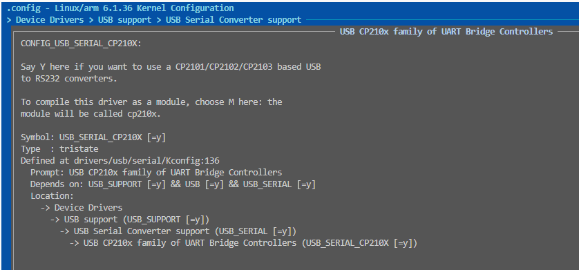
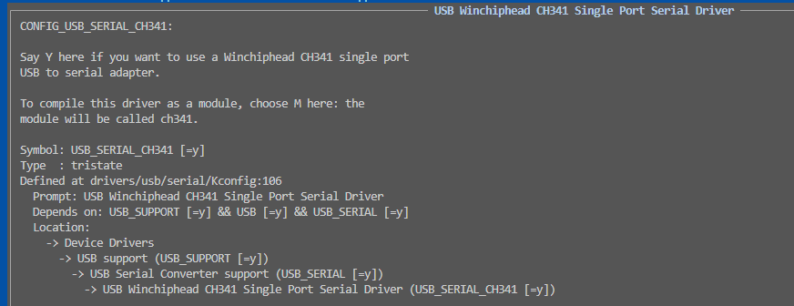

# USB驱动管理框架

## usb_driver

### usb_serial

usb目前主要的串口驱动是CP2102和CH340，对于目前的内核都是存在的。

- 其中CP2102的驱动路径如下。



或者直接在config下添加。

```shell
CONFIG_USB_SERIAL_GENERIC=y
CONFIG_USB_SERIAL_FTDI_SIO=y
CONFIG_USB_SERIAL_OPTION=y
CONFIG_USB_SERIAL_CP210X=y
```

- 其中CH340的驱动路径如下。



或者直接在config下添加。

```shell
CONFIG_USB_SERIAL_CH341=y
```

### usb_wifi

## next_chapter

[返回目录](../README.md)

直接开始下一节说明: [CAN网络管理框架](./ch03-22.can_net_device.md)
