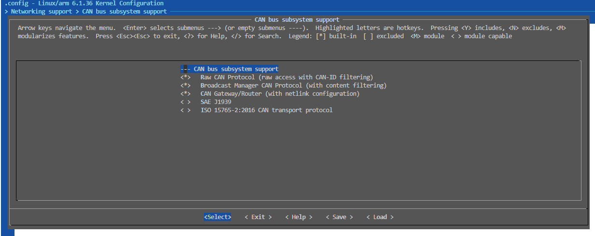
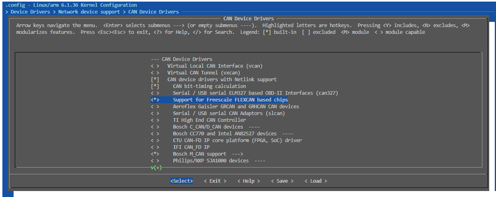

# CAN网络管理框架

CAN设备是由CAN总线、CAN收发器、CAN控制器共同组成的，实现CAN协议功能的完整设备；另外，CAN设备在Linux系统中，通过net设备接口来管理CAN设备，包括网络设备的初始化、数据传输、网络设备的配置等，是典型的网络驱动设备。CAN设备驱动难度不低，但仍然低于TCP/IP ETH网络设备的驱动实现，因此是用来理解网络设备框架的重要模块。

对于本章节，则以I.MX6ULL的FlexCAN控制器为例，来介绍CAN网络设备的初始化、数据传输、网络设备的配置等；并结合CAN协议的功能，来介绍CAN网络设备的驱动实现。根据功能分类，本章节的内容如下：

- [CAN网络协议说明](#can_protocol)

## can_protocol

CAN协议(Controller Area Network)，全称控制器局域网协议，是一种串行通讯协议；广泛用于汽车、工业控制、船舶、航空航天等领域。具有以下特点：

- 差分信号传输，具有抗干扰能力强，通讯距离远，实时性好等优点。
- 支持多主机竞争节点模式，理论节点数目不受限制，通过仲裁机制，确保节点根据优先级先后发送数据，可扩展性强。
- 强力的错误检测和纠错能力，可以检测发送和接收过程中的错误，并进行相应的处理。

理解CAN协议，首先要对通信协议有一定的概念；通信协议又称通信规程，是指通信双方对数据传送控制的一种约定。约定中包括对数据格式，同步方式，传送速度，传送步骤，检纠错方式以及控制字符定义等问题做出统一规定，通信双方必须共同遵守，它也叫做链路控制规程。CAN总线传输协议定义了物理接口和帧结构说明，对应通讯协议中的物理层和数据链路层；至于更上层的协议，则由用户根据需求重新定义，如CanOpen协议，CANoe协议等。

对于CAN总线通讯协议，可以分为物理层和数据链路层；常见的连接拓扑如下所示。


由上图可以看到，CAN是以CAN Node为单个节点挂载在CAN Bus上。对于每个CAN Node来说，又由CAN收发器和CAN控制器两部分组成。

1. CAN收发器，对应物理层设备，对于发送，将逻辑数据转换为差分信号；对于接收，将差分信号转换为逻辑数据。
2. CAN控制器，对应数据链路层设备，用于控制CAN收发器，实现CAN协议的物理层和数据链路层规范；如帧同步，帧传输，帧接收，帧发送以及总线仲裁功能实现。一般来说CAN控制器集成在SOC或者MCU芯片中，由软件进行控制。

上述器件对应的协议框架如下所示。

- 物理层，包含了CAN协议的物理层规范，规定了CAN协议的电气特性，如信号的传输方式，信号的电平、传输距离、编码方式等
  - 信号的传输方式：差分信号传输，通过CANH和CANL两根线传输差分信号，通过两者电压差值判断信号状态。若VCANH-VCANL小于阈值为隐性位（逻辑 1），大于阈值为显性位（逻辑 0），总线空闲时处于隐性状态，这种编码方式又称为非归零编码。
- 数据链路层，包含了CAN协议的数据链路层规范，规定了CAN协议的帧结构，帧格式，帧同步方式，帧传输方式等
  - 帧结构：CAN协议的帧结构由帧起始、仲裁场、控制场、数据场、CRC场、应答场组成。
  - 帧同步：CAN协议的帧同步方式为显性同步方式，即发送器在发送帧起始标志（SOF）时，将CANH和CANL两根线同时拉低，从而使总线处于显性状态。
  - 帧传输：CAN协议的帧传输方式为异步方式，即发送器和接收器可以同时发送和接收数据，不需要同步。
  - 帧接收：CAN协议的帧接收方式为总线监听方式，即接收器在总线空闲时，检测总线电平，如果总线电平为显性，则接收器认为总线处于空闲状态，此时接收器可以接收数据。

对于应用来说，主要理解数据链路层即可。CAN数据帧由7个段组成，分别是帧起始（SOF）标志，仲裁场，控制场，数据场，CRC场和ACK场组成，具体格式如下所示。


- 帧起始（SOF）标志数据帧或远程帧的开始，仅由一个“显性”位组成。只有在总线空闲时才允许节点开始发送（信号）。所有节点必须同步于首先开始发送报文的节点的帧起始前沿。
- 仲裁场 由标识符和传送帧类型(RTR)组成的仲裁场，RTR位在数据帧中为显性，在远程帧中为隐性。
- 控制场 由标识符类型控制位IDE，保留位r0，以及帧长度选择位DLC构成的。
- 数据场 由数据帧里的发送数据组成。
- CRC场 由CRC序列（CRC Sequence），以及CRC界定符（CRC Delimiter）。CRC序列之后是CRC界定符，它包含一个单独的“隐性”位。
- ACK场（ACK Field） 2位，包含应答间隙（ACK Slot）和应答界定符（ACK Delimiter），当接收器正确地接收到有效的报文，接收器就会在应答间隙（ACK Slot）期间向发送器发送1“显性”位以示应答。
  - 应答间隙，所有接收到匹配CRC序列的节点会在应答间隙期间用“显性”的位写入发送器的“隐性”位来做出回答。
  - 应答界定符，应答界定符是应答场的第二个位，必须为“隐性”的位。因此，应答间隙（ACK Slot）被两个“隐性”的位所包围，也就是CRC界定符和应答界定符。

其中标准帧和扩展帧的主要区别是仲裁场的不同，具体格式如下所示。


上图中的参数解析如下。

1. RTR位用于区分远程帧和数据帧，其中RTR位为显性位(逻辑0)，代表数据帧；RTR位为隐性位(逻辑1)，代表远程帧。
2. IDE位用于区分标准帧和扩展帧，显性位(逻辑0)，代表标准帧；IDE位为隐性位(逻辑1)，代表扩展帧。
3. 对于扩展帧，在RTR位置填充为隐形位的SRR，用于保证确保扩展帧优先级更低
4. r0和r1为保留位，保留位必须为显性位。
5. 标识符字段由11位或29位组成，其中11位标识符为标准标识符，29位标识符为扩展标识符。

在通讯过程中，“显性”具有“优先”的意味，只要有一个单元输出显性电平，总线上即为显性电平；当节点检测到线上电平与发送位电平不一致时，如果此时在仲裁场或者控制场，则退出总线竞争；如果不在此场段，则产生错误事件(在帧ACK场和错误帧传输时除外)。基于上述机制，实现CAN的总线仲裁。

数据包的总线优先级机制如下所示：

1. 对目的不同ID的CAN节点发送数据，因为ID从高位到低位发送，ID值小的节点会更晚发送隐形位，因此具有更高的优先级。
2. 数据帧的RTR为显性位，遥控帧RTR为隐性位，目的ID相同时，数据帧具有更高优先级
3. 标准帧的IDE为显性位，扩展帧的IDE为隐性位，目的ID相同时，标准帧具有更高的优先级。

这就是数据帧仲裁的主要机制；参考上述格式，CAN报文包含数据帧，遥控帧，错误帧和过载帧四种类型。

- 数据帧：数据帧将数据从发送器传输到接收器，其格式就是完整的CAN报文格式
- 遥控帧：总线节点发出遥控帧，请求发送具有同一识别符的数据帧，请求帧除了不带数据场，其它字段与数据帧相同
- 错误帧：任何节点检测到总线错误就发出错误帧
- 过载帧：过载帧用以在先行的和后续的数据帧（或远程帧）之间提供附加的延时
- 帧间隔：帧间隔是用于分隔数据帧和遥控帧的帧。数据帧和遥控帧可通过插入帧间隔将本帧与前面的任何帧（数据帧、遥控帧、错误帧、过载帧）分开

数据帧和遥控帧的格式属于上面的标准帧和扩展帧格式，这里不在赘述。

错误帧由不同节点提供的错误标志（Error Flag）的叠加以及错误界定符两部分组成，格式如下。


- 错误标志：有两种形式的错误标志：激活错误标志和认可错误标志。
  - "激活错误”标志由6个连续的“显性”位组成
  - “认可错误”标志由6个连续的“隐性”的位组成，除非被其他节点的“显性”位重写。
- 错误界定符：错误界定符包括8个“隐性”的位。
- 错误标志传送了以后，每一个节点就发送一个“隐性”的位，并一直监视总线直到检测出一个“隐性”的位为止，然后就开始发送其余7个“隐性”位。

过载帧（Overload Frame）包括两个位场：过载标志和过载界定符，其结构如图所示：


有三种过载的情况会引发过载标志的传送。

1.接收器的内部情况，需要延迟下一个数据帧和远程帧。
2.在间歇的第一和第二字节检测到一个“显性”位。
3.如果CAN节点在错误界定符或过载界定符的第8位（最后一位）采样到一个显性位，节点会发送一个过载帧。该帧不是错误帧，错误计数器不会增加。

过载标志:过载标志由6个“显性”的位组成。过载标志的所有形式和“激活错误”标志的一样
过载界定符：过载界定符包括8个“隐性”的位，具体动作与错误界定符一致

帧间隔：数据帧（或远程帧）与遥控帧的隔离是通过帧间空间实现的，无论此先行帧类型如何（错误帧、过载帧）。所不同的是，过载帧与错误帧之前没有帧间空间，多个过载帧之间也不是由帧间空间隔离的。


帧间空间包括间歇、总线空闲的位场。如果“错误认可”的节点已作为前一报文的发送器，则其帧间空间除了间歇、总线空闲外，还包括称作“挂起传送”（暂停发送）的位场。

1. 间歇场，包含3个位隐性位
2. 总线空闲，全隐性电平，没有限制
3. 暂停发送场，8个位隐性位，只在处于被动错误状态的单元刚发送一个消息后的帧间隔中包含的段

上述信息基本包含CAN协议包的数据包格式，仲裁机制，算协议中比较核心的部分。讲述了CAN协议的硬件总线、数据包格式、节点通讯机制和发送优先级实现，这些知识是实现CAN总线的基础；接下来使用的flexcan控制器和收发器，正是为了实现这些协议机制而设计的。理解这些协议并不一定有助于应用开发，但当CAN通讯异常时，理解协议机制有助于跟随设计思路，分析错误原因，理解协议对于系统的稳定性仍然有益。下面以flexcan控制器的应用实践来显示协议的实现处理。

## can_driver

在上一章节中，系统了描述了CAN协议相关的理解；在本节中，将从CAN模块角度，讲解CAN驱动实现。CAN协议定义了物理层和数据链路层规范，且支持多主机，流式的数据传输格式，和网络协议栈的底层结构类似，和之前的字符设备差异，使用网络管理框架管理，下面进行驱动的实现说明。

CAN驱动框架实现分为三部分:

1. 实现描述CAN物理节点的设备树，包含CAN引脚和CAN控制器物理资源
2. 解析设备树，获取CAN资源，实现CAN收发接口
3. 注册CAN网络设备，实现CAN作为网络设备的管理接口

对于设备数据节点，包含寄存器，时钟和引脚信息，具体格式如下所示。

```c
// regular用于管理模块电压，如果模块一直供电，则只能用于获取电压
// 不进行实际操作
reg_can_3v3: regulator-can-3v3 {
    compatible = "regulator-fixed";         // 固定电压
    regulator-name = "can-3v3";
    regulator-min-microvolt = <3300000>;    // 最小电压
    regulator-max-microvolt = <3300000>;    // 最大电压
};

// can对应的物理接口，CAN_TX/CAN_RX
pinctrl_flexcan1: flexcan1grp{
    fsl,pins = <
        MX6UL_PAD_UART3_RTS_B__FLEXCAN1_RX    0x1b020
        MX6UL_PAD_UART3_CTS_B__FLEXCAN1_TX    0x1b020
    >;
};

// can控制器设备节点
can1: can@2090000 {
    compatible = "fsl,imx6ul-flexcan", "fsl,imx6q-flexcan";     // compatible，用于匹配驱动
    reg = <0x02090000 0x4000>;                                  // 寄存器地址和大小    
    interrupts = <GIC_SPI 110 IRQ_TYPE_LEVEL_HIGH>;             // can中断线号和类型
    clocks = <&clks IMX6UL_CLK_CAN1_IPG>,                       // can模块时钟，对应寄存器时钟和通讯时钟
            <&clks IMX6UL_CLK_CAN1_SERIAL>;
    clock-names = "ipg", "per";
    fsl,stop-mode = <&gpr 0x10 1>;                               // can模块休眠控制寄存器   
    status = "disabled";                                         // can模块状态 
};

&can1 {
    pinctrl-names = "default";                                    // can模块引脚控制名称    
    pinctrl-0 = <&pinctrl_flexcan1>;                              // can模块引脚控制
    xceiver-supply = <&reg_can_3v3>;                              // can模块电源控制
    status = "okay";                                              // can模块状态，使能正常工作
};
```

对于can管理框架，先描述下相关的接口说明。

### can_driver_api

相关的函数.

```c
// 申请can设备管理结构
#define alloc_candev(sizeof_priv, echo_skb_max) \
    alloc_candev_mqs(sizeof_priv, echo_skb_max, 1, 1)

// 申请can设备管理结构
struct net_device *alloc_candev_mqs(int sizeof_priv, unsigned int echo_skb_max,
                unsigned int txqs, unsigned int rxqs);

// 注册can网络设备(drivers/net/can/dev/dev.c)
int register_candev(struct net_device *dev)

// 取消can网络设备注册
void unregister_candev(struct net_device *dev)
```

can驱动实现从难度上远高于字符驱动，且大部分情况下都会由厂商完善；因此这里以内核中的flexcan驱动实现为例，讲解can驱动具体代码实现；详细代码如下所示。

- [can物理接口驱动](./file/ch03-22/can_driver/)

### can_driver_kernel

- 匹配设备节点，加载can驱动

```c
// 匹配设备节点列表
static const struct of_device_id fec_dt_ids[] = {
    //...
    { .compatible = "fsl,imx6ul-fec", .data = &fec_devtype[IMX6UL_FEC], },
    { /* sentinel */ }
};
MODULE_DEVICE_TABLE(of, fec_dt_ids);

static struct platform_driver flexcan_driver = {
    .driver = {
        .name = DRV_NAME,
        .pm = &flexcan_pm_ops,                  // 电源管理操作
        .of_match_table = flexcan_of_match,
    },
    .probe = flexcan_probe,                     // 设备加载时执行的函数
    .remove = flexcan_remove,                   // 设备卸载时执行的函数       
    .id_table = flexcan_id_table,
};

module_platform_driver(flexcan_driver);

MODULE_AUTHOR("Sascha Hauer <kernel@pengutronix.de>, "
          "Marc Kleine-Budde <kernel@pengutronix.de>");
MODULE_LICENSE("GPL v2");
MODULE_DESCRIPTION("CAN port driver for flexcan based chip");
```

CAN加载时执行flexcan_probe函数，这部分是驱动的核心，主要实现以下功能。

- 获取设备树节点中的资源，实现收发接口

```c
// 获取设备树节点中的资源
reg_xceiver = devm_regulator_get_optional(&pdev->dev, "xceiver"); //获取xceiver-regulator指定的电源资源
if (PTR_ERR(reg_xceiver) == -EPROBE_DEFER)
    return -EPROBE_DEFER;
else if (PTR_ERR(reg_xceiver) == -ENODEV)
    reg_xceiver = NULL;
else if (IS_ERR(reg_xceiver))
    return PTR_ERR(reg_xceiver);

if (pdev->dev.of_node) {
    of_property_read_u32(pdev->dev.of_node,                      //获取时钟属性
                    "clock-frequency", &clock_freq);
    of_property_read_u8(pdev->dev.of_node,
                "fsl,clk-source", &clk_src);
} else {
    pdata = dev_get_platdata(&pdev->dev);
    if (pdata) {
        clock_freq = pdata->clock_frequency;
        clk_src = pdata->clk_src;
    }
}

//...

irq = platform_get_irq(pdev, 0);
if (irq <= 0)
    return -ENODEV;
```

- 申请can设备管理结构，并赋值；can基于网络设备结构管理。

```c
// 申请can设备管理结构
dev = alloc_candev(sizeof(struct flexcan_priv), 1);
if (!dev)
    return -ENOMEM;

platform_set_drvdata(pdev, dev);
SET_NETDEV_DEV(dev, &pdev->dev);

dev->netdev_ops = &flexcan_netdev_ops;      // 设置can作为网络设备的操作
dev->ethtool_ops = &flexcan_ethtool_ops;    // 设置网络设备ethtool操作
dev->irq = irq;                             // 设置中断号
dev->flags |= IFF_ECHO;

priv = netdev_priv(dev);                    // 获取can私有数据，上面定义的flexcan_priv
priv->devtype_data = *devtype_data;

priv->dev = &pdev->dev;
priv->can.clock.freq = clock_freq;          // can总线工作频率
priv->can.do_set_mode = flexcan_set_mode;   // 设置can工作模式
priv->can.do_get_berr_counter = flexcan_get_berr_counter;
priv->can.ctrlmode_supported = CAN_CTRLMODE_LOOPBACK |  //can支持的参数
    CAN_CTRLMODE_LISTENONLY    | CAN_CTRLMODE_3_SAMPLES |
    CAN_CTRLMODE_BERR_REPORTING;
priv->regs = regs;                          // can寄存器地址
priv->clk_ipg = clk_ipg;                    // can时钟信息
priv->clk_per = clk_per;
priv->clk_src = clk_src;
priv->reg_xceiver = reg_xceiver;

//....
```

这两个里面比较关键的是两个结构体flexcan_netdev_ops和flexcan_ethtool_ops，这两个结构体分别描述了can作为网络设备的操作和ethtool操作，具体说明如下。

```c
// netdev_ops结构体
static const struct net_device_ops flexcan_netdev_ops = {
    .ndo_open    = flexcan_open,                // can设备打开，应用层ifconfig [dev] up时调用
    .ndo_stop    = flexcan_close,               // can设备关闭，应用层ifconfig [dev] down时调用
    .ndo_start_xmit    = flexcan_start_xmit,    // can设备发送数据，应用层send时调用
    .ndo_change_mtu = can_change_mtu,           // 切换can工作模式，支持can/canfd(可变速率的CAN)切换，需要硬件支持
};

const struct ethtool_ops flexcan_ethtool_ops = {
    .get_ringparam = flexcan_get_ringparam,         // 获取can设备环形参数
    .get_strings = flexcan_get_strings,             // 获取can设备字符串
    .get_priv_flags = flexcan_get_priv_flags,       // 获取can设备私有标志
    .set_priv_flags = flexcan_set_priv_flags,       // 设置can设备私有标志
    .get_sset_count = flexcan_get_sset_count,       // 获取can设备字符串个数
    .get_ts_info = ethtool_op_get_ts_info,          // 获取can设备时间戳信息
};
```

上述代码和硬件以及底层设计相关，需要配合硬件模块进行分析；不过可以按照这个思路，继续理解can模块的操作细节。当can信息设置完成后，通过如下代码即可注册can网络设备接口。

```c
// 注册can设备
err = register_flexcandev(dev);
if (err) {
    dev_err(&pdev->dev, "registering netdev failed\n");
    goto failed_register;
}

// 配置can设备为停止模式
err = flexcan_setup_stop_mode(pdev);
if (err < 0) {
    dev_err_probe(&pdev->dev, err, "setup stop mode failed\n");
    goto failed_setup_stop_mode;
}

of_can_transceiver(dev);
```

对于I.MX6ULL，支持can设备需要支持如下配置。

```shell
# 支持flexcan设备
CONFIG_CAN=y
CONFIG_CAN_DEV=y
CONFIG_CAN_NETLINK=y
CONFIG_CAN_FLEXCAN=y

# 图形修改界面如下
Networking supoort > CAN bus subsystem support > Raw CAN Protocol
Device Drivers > Network device support > CAN Devices Drivers > CAN device drivers with Netlink support > support for FlexCAN FLEXCAN base chips
```

- CAN网络接口支持



- FLEXCAN设备驱动支持



加载成功后，可以使用如下命令进行测试。

```shell
# 查看当前支持的网络设备
ifconfig -a

# 关闭网络设备
ifconfig can0 down

# 配置can网络设备，波特率500k，回环模式
ip link set can0 type can bitrate 500000 loopback on
ifconfig can0 up

# 通过can下载数据
candump can0&

# 发送数据
cansend can0 012#1234567890

# 设置can波特率500k，使能can
# 启动can
ifconfig can0 down
ip link set can0 type can bitrate 500000
ifconfig can0 up
```

可以看到网络显示代码如下。


通讯测试如下。


注意: **如果使用busybox构建的系统(包含buildroot，openwrt)，需要使用iproute2工具替换原ip命令，Busybox的ip命令不支持can设备。**

如果显示如下版本，则是需求的ip格式。


## can_app

在前面章节中，已经介绍了CAN网络设备的驱动实现，接下来将介绍CAN网络设备的应用实现。对于can设备，可以参考socket应用来实现，相应代码见如下所示。

```cpp
class can_socket
{
public:
    //...

    // 初始化can网络设备
    bool init(void) 
    {
        // 申请can网络设备资源
        fd_ = socket(PF_CAN, SOCK_RAW, CAN_RAW);
        if (fd_ < 0) {
            std::cout << "socket error" << std::endl;
            return false;
        }

        // 配置can1接口，绑定到指定接口
        strcpy(ifr_.ifr_name, interface_.c_str());
        ioctl(fd_, SIOCGIFINDEX, &ifr_);

        addr_.can_family = AF_CAN;
        addr_.can_ifindex = ifr_.ifr_ifindex;

        if (bind(fd_, (struct sockaddr *)&addr_, sizeof(addr_)) < 0) {
            std::cout << "bind error" << std::endl;
            close(fd_);
            return false;
        }

        std::thread(std::bind(&can_socket::run, this)).detach();
        return true;
    }

private:
    /// \brief run                
    /// - This method is used for thread run.
    void run(void) {
        int size;
        while (true) {
            //读取can帧数据，进行处理
            if (read(fd_, &frame_, sizeof(struct can_frame)) > 0) {
                for (int i = 0; i < frame_.can_dlc; i++) {
                    can_protocol_.process_rx_frame(frame_.data[i]);
                    if (can_protocol_.get_frame_state() == CAN_FRAME_COMPLETE) {
                        can_protocol_.clear_frame_state();
                        size = can_protocol_.protocol_process(tx_buffer_);
                        if (size > 0) {
                            can_write_buffer(tx_buffer_, size);
                        }
                    } else if (can_protocol_.get_frame_state() == CAN_FRAME_EMPTY) {
                        can_protocol_.clear_frame_size();
                    } else {
                        // in receive， no process
                    }
                }
            }
        }
    }

    // 发送can帧
    void can_write_buffer(char *buffer, int len) {
        int nums = len/CAN_MAX_DLEN;
        int offset = len%CAN_MAX_DLEN;
        char *ptr;

        ptr = buffer;

        // 按照CAN MAX DLC 发送数据
        if (nums > 0)
        {
            for (int index=0; index<nums; index++)
            {
                frame_.can_id = id_;
                frame_.can_dlc = CAN_MAX_DLEN;
                memcpy(frame_.data, ptr, CAN_MAX_DLEN);
                ptr += 8;
                write(fd_, &frame_, sizeof(struct can_frame));
            }
        }

        // 发送剩余数据
        if (offset > 0)
        {
            frame_.can_id = id_;
            frame_.can_dlc = offset;
            memcpy(frame_.data, ptr, offset);
            write(fd_, &frame_, sizeof(struct can_frame));
        }

        std::cout<<"can write buffer: "<<len<<" id: "<<id_<<std::endl;
    }
};
```

注意: **can接口一次允许发送的最大字节为CAN_MAX_DLEN(长度8字节)，如果希望发送完整数据帧，需要拆分成多个CAN数据包格式发送。**

完整的CAN网络设备代码，详细可以参考代码: [can设备代码](./file/ch03-22/can_apps/)

通过通讯测试另一个CAN设备发送，测试状态如下所示。


## next_chapter

[返回目录](../README.md)

直接开始下一节说明: [EMAC网络管理框架](./ch03-23.emac_net_device.md)
