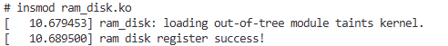
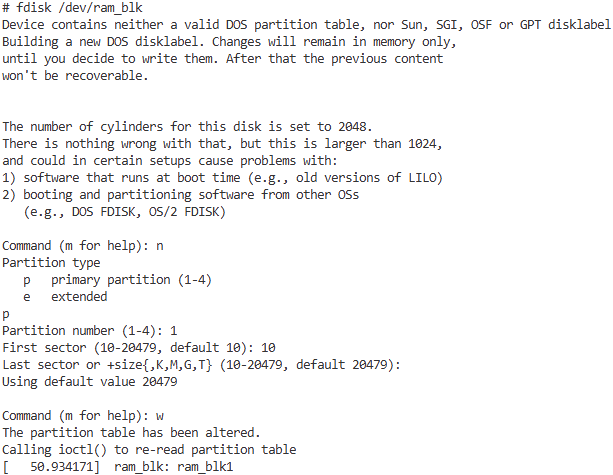

# block_driver

块设备驱动时操作系统中用于管理以数据块为单位进行数据读写的设备的软件模块。常见的块设备包含NAND FLASH、EMMC、SD卡、固态硬盘（SSD）等。块设备驱动作为字符设备，网络设备并列的三大驱动之一；也是操作系统中最复杂的一类驱动。对于块设备，在开发中通常使用内核中已经实现的驱动，除原厂外很少有单独开发实现的机会。不过从产品角度，理解块设备有助于开发问题的定位和排查，值得花时间去理解学习。

硬盘，SD卡等都是数据存储的硬件。以SD卡为例，内部提供了类似EMMC的数据存储空间，保存数据。SDCard为了方便管理数据，将数据固定的格式划分存储；通过表的方法查询管理资源，这就是分区机制。对于SD卡或者EMMC来说，常见的系统格式有FAT32，EXT-4等；其中分区数据数据信息保存在硬件的固定位置，也就是MBR/GPT分区表。对于日常中硬盘的损坏，往往是分区表的异常导致系统无法解析；文件往往还存在于系统指定位置，并未损坏，这也是数据能够恢复的原因。

和字符设备不同，块设备只能以块为单位接收输入和返回输出；读写带缓冲区，支持顺序或随机访问，不过顺序访问往往会有更快的速度。块设备驱动从原理上来说分成以下部分。

1. 访问硬件设备的驱动接口，如何通过SPI，SDIO，PCIE，USB等接口读取具体的硬件设备；硬件上支持某款设备，大都在设备树种添加相应控制器节点、
2. 块设备在内核的注册，同时管理访问硬件设备的驱动接口，将读写操作关联到具体硬件的处理。
3. 设备内部文件系统的接口，从硬件中读取数据后，按照具体的系统格式如FAT32，EXT-4进行解析；挂载到应用层目录，进行具体数据读写的访问。

具体结构参考下图所示。


可以看到，在块设备框架下，物理层连接块设备驱动的接口总类繁多。如果按照外部器件、硬件接口、块设备驱动、上层应用等去理解，就要先掌握对应器件的手册以及相应接口的知识，在去学习块设备驱动。当这类设备通过设备树或者其它机制注册到系统后，会执行相应的驱动关联对器件的访问，这部分内容是比较困难的。例如常用的SDCard，掌握就需要理解sdio接口、SD命令交互、SD数据通讯；这部分进行说明，一篇文章都不够了，理解起来十分复杂。另外类似的块设备物理层器件还有很多种类型，接口也各异；杂糅一起理解起来就更加困难。

对于块设备种物理层部分分散到相应接口去说明，这里主要讲解块设备内核注册和应用实践的部分；为了简化操作，对于物理层使用内部的存储来模拟，降低理解的难度。

块设备支持两种操作方式：队列模式和直接模式。

1. 队列模式是块设备驱动中常见的操作方式，它会将多个 I/O 请求收集到一个请求队列里，然后由调度器对这些请求进行排序和优化，以此提升I/O性能。
2. 直接模式是一种特殊的操作方式，它会直接将 I/O 请求发送给块设备驱动，而不会将其放入请求队列中。这种方式通常用于一些特殊的场景，例如需要立即执行I/O操作的情况。

按照上述框架，目录如下所示。

- [直接模式块设备驱动](#no_queue_mode)
  - [直接模式块设备接口](#no_queue_interface)
  - [直接模式块设备驱动](#no_queue_driver)
- [队列模式块设备驱动](#queue_mode)
  - [队列模式块设备接口](#queue_interface)
  - [队列模式块设备驱动](#queue_driver)
- [应用层使用块设备方法](#block_app)
- [SDCard内核驱动解析](#sdcard_probe_workflow)
- [总结](#summary)
- [下一章节](#next_chapter)

## no_queue_mode

非队列模式相当于队列模式属于简单的情况；当应用层有请求时，会直接调用驱动提供的接口，读写数据。这里先了解下非对列模式注册的相关接口。

注意: **对于Linux内核来说，不同大版本的块设备内核接口差异很大；也就是kernel-4.x，kernel-5.x, kernel-6.x中块设备驱动接口是不一致的，本文以Kernel-6.x为例，如果其它版本，需要参考内核中驱动接口进行相应修改。**

### no_queue_interface

非队列模式的接口主要包括以下内容。

```c
// 向系统申请块设备号
// @major: 主设备号，为0则由硬件分配
// @name: 块设备名称
// @probe: 块设备探测函数，用于在块设备注册后进行初始化操作(可选)
// 返回值: 成功返回申请的主设备号，失败返回负数
int register_blkdev(unsigned int major, const char *name,
    void (*probe)(dev_t devt));
int __register_blkdev(unsigned int major, const char *name,
    void (*probe)(dev_t devt));
#define register_blkdev(major, name) \
    register_blkdev(major, name, NULL)

// 注销已经申请的块设备号
// @major: 主设备号
// @name: 块设备名称
// 返回值: 无
void unregister_blkdev(unsigned int major, const char *name);

// 分配一个块设备结构体
// @node_id: 节点ID
// @key: 锁类键
// 返回值: 成功返回分配的块设备结构体指针，失败返回NULL
struct gendisk *__blk_alloc_disk(int node, struct lock_class_key *lkclass)
#define blk_alloc_disk(node_id)                        \
({                                    \
    static struct lock_class_key __key;                \
                                    \
    __blk_alloc_disk(node_id, &__key);                \
})

// 释放一个块设备结构体
// @disk: 块设备结构体指针
// 返回值: 无
void put_disk(struct gendisk *disk)

// 设置块设备的容量
// @disk: 块设备结构体指针
// @size: 块设备的大小
// 返回值: 无
void set_capacity(struct gendisk *disk, sector_t size)

//  向系统中添加块设备
// @disk: 块设备结构体指针
// 返回值: 成功返回0，失败返回负数
static inline int __must_check add_disk(struct gendisk *disk)
{
    return device_add_disk(NULL, disk, NULL);
}
int __must_check device_add_disk(struct device *parent, struct gendisk *disk,
                 const struct attribute_group **groups);

// 从系统中删除块设备
// @disk: 块设备结构体指针
// 返回值: 无
void del_gendisk(struct gendisk *gp);
```

对于上述接口，其核心操作的结构体就是"struct gendisk *"，该结构体用于描述一个块设备，包含了块设备的各种属性和操作函数。

```c
// 表示块设备的结构体
struct gendisk {
    int major;          // 块设备的主设备号，用于标识一类设备
    int first_minor;    // 块设备的起始次设备号，区分同一类设备中的不同设备
    int minors;         // 块设备支持的次设备号数量，表明该块设备能够包含多少个子设备

    char disk_name[DISK_NAME_LEN];  //块设备的名称，例如/dev/sda里的 sda

    unsigned short events;          //块设备的事件标志，记录设备产生的事件
    unsigned short event_flags;     //块设备的事件标志，用于控制事件的处理

    struct xarray part_tbl;         // 块设备的分区表，用来管理块设备的所有分区信息
    struct block_device *part0;     // 指向分区 0 的块设备指针

    const struct block_device_operations *fops; //指向块设备操作函数集的指针，包含了对块设备进行读写、打开、关闭等操作的函数
    struct request_queue *queue;    // 指向请求队列的指针，用于管理对块设备的 I/O 请求
    void *private_data;             // 指向私有数据的指针，驱动开发者可用于存储与该块设备相关的私有信息

    struct bio_set bio_split;       //用于存储拆分的 BIO（Block I/O）的集合

    int flags;                      //块设备的标志，包含多种状态和控制信息
    unsigned long state;            //块设备的状态，通过宏定义来表示不同的状态
#define GD_NEED_PART_SCAN        0
#define GD_READ_ONLY            1
#define GD_DEAD                2
#define GD_NATIVE_CAPACITY        3
#define GD_ADDED            4
#define GD_SUPPRESS_PART_SCAN        5
#define GD_OWNS_QUEUE            6

    struct mutex open_mutex;        //用于保护块设备的打开和关闭操作的互斥锁，避免多个进程同时操作设备。
    unsigned open_partitions;       //打开的分区数量，记录当前有多少个分区处于打开状态

    struct backing_dev_info *bdi;   //指向块设备信息的指针，包含设备的缓存、I/O 调度等信息。
    struct kobject *slave_dir;      //指向从设备目录的指针，用于设备模型的管理

#ifdef CONFIG_BLOCK_HOLDER_DEPRECATED
    struct list_head slave_bdevs;   //指向块设备持有者的指针

#endif

    struct timer_rand_state *random;    //指向随机数生成器状态的指针
    atomic_t sync_io;                   //同步 I/O 操作的计数，用于跟踪同步 I/O 操作的次数
    struct disk_events *ev;             //指向磁盘事件的指针，记录磁盘发生的事件

#ifdef  CONFIG_BLK_DEV_INTEGRITY
    struct kobject integrity_kobj;      //如果配置了块设备完整性，指向块设备完整性的对象。

#endif    /* CONFIG_BLK_DEV_INTEGRITY */

#ifdef CONFIG_BLK_DEV_ZONED
    unsigned int        nr_zones;               // 块设备的分区数量
    unsigned int        max_open_zones;         // 最大打开的分区数量
    unsigned int        max_active_zones;       // 最大活动的分区数量
    unsigned long        *conv_zones_bitmap;    // 块设备分区的位图
    unsigned long        *seq_zones_wlock;      // 块设备分区的写锁

#endif

#if IS_ENABLED(CONFIG_CDROM)
    struct cdrom_device_info *cdi;              //如果配置了光驱设备，指向光盘设备信息的指针。

#endif
    int node_id;                                //节点 ID，用于多节点系统中标识设备所在的节点
    struct badblocks *bb;                       //指向坏块信息的指针，记录设备上的坏块信息
    struct lockdep_map lockdep_map;             //用于锁依赖分析的映射，帮助调试锁相关的问题
    u64 diskseq;                                //磁盘序列号，唯一标识该磁盘设备

    struct blk_independent_access_ranges *ia_ranges; //独立访问范围，用于描述设备的独立访问区域。
};
```

上述结构体包含了一个块设备的所有属性和操作函数，全部理解起来并不简单。不过很多参数都是内核用于管理和访问块设备的状态和标志，对于驱动实现来说，主要涉及的是如下参数。

1. major，定义块设备的主设备号，用于标识一类设备；使用register_blkdev申请的主设备号。
2. first_minor，设置第一个分区的次设备号，一般为0。
3. fops，指定块设备的操作函数集，包含了对块设备进行读写、打开、关闭等操作的函数；是连接应用到底层的接口。

其中最关键的就是fops结构体，是关联应用层和底层硬件的接口；结构体struct block_device_operations的详细信息如下。

```c
//上述结构体中，通过const struct block_device_operations指定设备的操作函数
struct block_device_operations {
    void (*submit_bio)(struct bio *bio);                            //提交一个块I/O请求（struct bio）到块设备驱动进行处理
    int (*poll_bio)(struct bio *bio, struct io_comp_batch *iob,     //对bio请求的完成状态进行轮询
            unsigned int flags);
    int (*open) (struct block_device *, fmode_t);                   //打开块设备，在用户程序调用open()系统调用访问块设备时触发
    void (*release) (struct gendisk *, fmode_t);                    //关闭块设备，在用户程序调用close()系统调用关闭块设备时触发
    int (*rw_page)(struct block_device *, sector_t, struct page *, enum req_op);    //对指定块设备的页面进行读写操作
    int (*ioctl) (struct block_device *, fmode_t, unsigned, unsigned long);         //执行特定的设备控制命令，用户程序调用ioctl触发
    int (*compat_ioctl) (struct block_device *, fmode_t, unsigned, unsigned long);  //执行特定的设备控制命令，用于兼容旧版本的ioctl调用
    unsigned int (*check_events) (struct gendisk *disk,             //检查块设备的事件
                      unsigned int clearing);
    void (*unlock_native_capacity) (struct gendisk *);              //解锁块设备的原生容量
    int (*getgeo)(struct block_device *, struct hd_geometry *);     //获取块设备的几何信息，如柱面数、磁头数、扇区数等
    int (*set_read_only)(struct block_device *bdev, bool ro);       //设置块设备为只读或可写状态
    void (*free_disk)(struct gendisk *disk);                        //释放块设备资源
    void (*swap_slot_free_notify) (struct block_device *, unsigned long);   // 当交换空间槽被释放时调用此函数
    int (*report_zones)(struct gendisk *, sector_t sector,          //报告块设备的区域信息
            unsigned int nr_zones, report_zones_cb cb, void *data);
    char *(*devnode)(struct gendisk *disk, umode_t *mode);          //创建块设备节点的名称
    int (*get_unique_id)(struct gendisk *disk, u8 id[16],           //获取块设备的唯一标识符
            enum blk_unique_id id_type);
    struct module *owner;                                           //指向实现这些操作函数的模块的指针，用于引用计数和模块管理
    const struct pr_ops *pr_ops;                                    //指向性能报告操作结构体的指针，用于性能相关的操作

    int (*alternative_gpt_sector)(struct gendisk *disk, sector_t *sector);  //获取块设备的备用 GPT 扇区号
};
```

上述结构体可以说功能繁多，不过对于驱动中，起始比较关注的是两个参数。

1. submit_bio, 格式"struct bio"，提交一个块I/O请求（struct bio）到块设备驱动进行处理；也就是我们常说的读写函数。
2. getgeo, 格式"struct hd_geometry",获取块设备的几何信息，如柱面数、磁头数、扇区数等；应用层处理依赖这些信息。

```c
// struct bio表示块设备I/O请求的结构体
struct bio {
    struct bio              *bi_next;       // 指向下一个bio结构体的指针，用于将多个bio链接成链表
    struct block_device     *bi_bdev;       // 指向关联的块设备的指针
    blk_opf_t               bi_opf;         // 块操作标志，定义了I/O操作的类型
    unsigned short          bi_flags;       // 用于表示bio的各种状态和控制标志的短整型变量
    unsigned short          bi_ioprio;      // I/O操作的优先级
    blk_status_t            bi_status;      // 块操作的状态，用于表示操作的结果
    atomic_t                __bi_remaining; // 原子类型变量，表示剩余需要处理的I/O数据量
    struct bvec_iter        bi_iter;        // 用于遍历bio中的数据块向量的结构体
    blk_qc_t                bi_cookie;      // 块I/O请求的cookie，用于跟踪和标识请求
    bio_end_io_t            *bi_end_io;     // 指向I/O操作完成时调用的回调函数的指针
    void                    *bi_private;    // 指向私有数据的指针，用于存储与I/O操作相关的额外信息
#ifdef CONFIG_BLK_CGROUP
    struct blkcg_gq        *bi_blkg;        // 如果配置了块设备cgroup，指向块设备cgroup组队列的指针
    struct bio_issue        bi_issue;       // 如果配置了块设备cgroup，用于表示bio的分发信息
#ifdef CONFIG_BLK_CGROUP_IOCOST
    u64                     bi_iocost_cost; // 如果配置了块设备cgroup I/O成本核算，用于记录I/O操作的成本
#endif
#endif

#ifdef CONFIG_BLK_INLINE_ENCRYPTION
    // 如果配置了块设备内联加密，指向bio加密上下文的指针
    struct bio_crypt_ctx    *bi_crypt_context; 
#endif

    union {
#if defined(CONFIG_BLK_DEV_INTEGRITY)
    // 如果配置了块设备完整性，指向bio完整性负载的指针
    struct bio_integrity_payload *bi_integrity;    
#endif
    };

    unsigned short          bi_vcnt;                // 表示bio中的数据块向量数量
    unsigned short          bi_max_vecs;            // 表示bio中允许的最大数据块向量数量
    atomic_t                __bi_cnt;               // 原子类型变量，表示bio的引用计数
    struct bio_vec          *bi_io_vec;             // 指向bio中的数据块向量数组的指针
    struct bio_set          *bi_pool;               // 指向bio池的指针，用于管理bio结构体的分配
    struct bio_vec          bi_inline_vecs[];       // 用于存储内联数据块向量的数组
};

// struct hd_geometry 硬盘信息
struct hd_geometry {
      unsigned char heads;                          // 硬盘的磁头数量, 磁头是硬盘中用于读写数据的部件，每个盘面通常有一个磁头.
      unsigned char sectors;                        // 表示每个磁道上的扇区数量
      unsigned short cylinders;                     // 表示硬盘的柱面数量
      unsigned long start;                          // 表示硬盘的起始扇区号，通常用于指定分区或逻辑卷在硬盘上的起始位置
};
```

对于struct hd_geometry，是和硬件挂钩的结构；这里以机械硬盘为例进行说明。

1. heads说明，磁盘是由多个盘片叠加的构成的结构，每个盘片都由一个磁头进行寻址，多个盘片就要由多个磁头寻址，磁头数目就对应这里的heads。
2. sectors说明，sector是磁盘访问硬件的最小单位，磁盘上为了访问读写效率，会将多个相邻扇区组合划分为一个磁道，这个磁道是单个盘面中的一组扇区的组合；sectors则表明磁道中扇区的数目。
3. cyliners说明，在早期磁道是以圈进行访问的，对应到多个盘片，就形成柱面；不过对于较新的硬盘，采用逻辑分区的模式，柱面不在表示物理的柱形结构，但逻辑上继承下来，柱面和磁道的数目是一致的。
4. start说明，起始的扇区号，通常是0。

对于固态硬盘，虽然原理上不依赖于机械硬盘的磁头读取机制；不过为了兼容性，也是逻辑上划分为扇区、柱面、磁头进行统一管理。

### no_queue_driver

上述接口讲述了非队列驱动设备申请，注册的接口，下面使用这些接口进行驱动的实现。

块设备作为驱动设备的一员，也要实现驱动加载和注册的接口；具体如下所示。

- 驱动加载和注册的接口

```c
// 驱动加载时执行的函数
static int __init ram_blk_init(void)
{
    //......
}

// 驱动移除时执行的函数
static void __exit ram_blk_exit(void)
{
    //......
}

// 驱动信息
module_init(ram_blk_init);
module_exit(ram_blk_exit);
MODULE_AUTHOR("wzdxf");
MODULE_LICENSE("GPL v2");
MODULE_DESCRIPTION("platform driver for nvmem");
MODULE_ALIAS("ram disk");
```

- 创建和移除块设备的具体实现

```c
static int __init ram_blk_init(void)
{
    int err = -ENOMEM;

    // 注册一个块设备，返回值为主设备号
    disk_data.ram_blk_major = register_blkdev(0, "ram_blk");
    if (disk_data.ram_blk_major < 0 ) {
        printk(KERN_ERR"ram disk register failed!\n");
        goto out;
    }
    
    // 申请gendisk结构，进行后续注册操作
    disk_data.ram_gendisk = blk_alloc_disk(NUMA_NO_NODE);
    if(!disk_data.ram_gendisk)
    {
        printk(KERN_ERR"alloc_disk failed!\n");
        goto out_unregister_blkdev;
    }

    strcpy(disk_data.ram_gendisk->disk_name, "ram_blk");
    disk_data.ram_gendisk->major = disk_data.ram_blk_major;     //设置主设备号
    disk_data.ram_gendisk->first_minor = 0;                     //设置第一个分区的次设备号
    disk_data.ram_gendisk->minors = 1;                          //设置分区个数： 1
    disk_data.ram_gendisk->fops = &ram_blk_ops;                 //指定块设备ops集合
    set_capacity(disk_data.ram_gendisk, 20480);                 //设置扇区数量：10MiB/512B=20480
    spin_lock_init(&disk_data.ram_blk_lock);                    //初始化自旋锁
    
    disk_data.ram_blk_addr = (char*)vmalloc(RAM_CAPACITY);      //分配10M空间作为硬盘，每个扇区512，对应20480个扇区
    if(disk_data.ram_blk_addr == NULL) {
        printk(KERN_ERR"alloc memory failed!\n");
        goto out_cleanup_disk;
    }
    disk_data.ram_blk_sursor = disk_data.ram_blk_addr;
    
    err = add_disk(disk_data.ram_gendisk);                      //添加硬盘
    if (err) {
        printk(KERN_ERR"add_disk failed!\n");
        goto out_freemem;
    }

    printk(KERN_INFO"ram disk register success!\n");

    return 0;

out_freemem:
    vfree(disk_data.ram_blk_addr);
out_cleanup_disk:
    put_disk(disk_data.ram_gendisk);
out_unregister_blkdev:
    unregister_blkdev(disk_data.ram_blk_major, "ram_blk");
out:
    return err;
}

static void __exit ram_blk_exit(void)
{
    //执行注销的操作
    del_gendisk(disk_data.ram_gendisk);                     //删除硬盘
    put_disk(disk_data.ram_gendisk);                        //注销设备管理结构 blk_alloc_disk
    unregister_blkdev(disk_data.ram_blk_major, "ram_blk");  //注销块设备
    vfree(disk_data.ram_blk_addr);                          //移除申请的memory
}
```

- 关联块设备应用层到用户空间的操作

```c
#define DISK_HEADS              1               // 磁盘头数
#define DISK_CYLINDERS          2048            // 磁盘柱面数(柱面数和磁道数相同）
#define DISK_SECTORS            10              // 磁盘每个磁道的扇区数
#define DISK_SECTOR_BLOCK       512             // 扇区大小

struct ram_disk_data disk_data;

// 进行块数据传输
static void ram_blk_transfer(unsigned long sector, unsigned long nsect, char *buffer, int write)
{
    unsigned long offset = sector << SECTOR_SHIFT;
    unsigned long nbytes = nsect << SECTOR_SHIFT;

    spin_lock(&disk_data.ram_blk_lock);

    // 将游标移动到操作的memory地址
    disk_data.ram_blk_sursor = disk_data.ram_blk_addr + offset;
    READ_ONCE(*buffer);

    // 检查游标是否有效
    if (disk_data.ram_blk_sursor) {
        if (write) {
            memcpy(disk_data.ram_blk_sursor, buffer, nbytes);
        } else {
            memcpy(buffer, disk_data.ram_blk_sursor, nbytes);
        }
    } else {
        printk(KERN_ERR"ram_blk_transfer sursor null:0x%x, 0x%x\n",
            (unsigned int)disk_data.ram_blk_addr, (unsigned int)disk_data.ram_blk_sursor);
    }

    spin_unlock(&disk_data.ram_blk_lock);
}

static void ram_blk_submit_bio(struct bio *bio)
{
    struct bio_vec bvec;
    struct bvec_iter iter;

    // 获取起始的扇区
    sector_t sector = bio->bi_iter.bi_sector;

    // 遍历bio结构的所有段
    bio_for_each_segment(bvec, bio, iter) {
        
        //获取缓冲取地址
        char *buffer = kmap_atomic(bvec.bv_page) + bvec.bv_offset;
        unsigned len = bvec.bv_len >> SECTOR_SHIFT;

        if (buffer) {
            ram_blk_transfer(sector, len, buffer, bio_data_dir(bio) == WRITE);
            sector += len;
            kunmap_atomic(buffer);
        } else {
            printk(KERN_ERR"ram_blk_submit_bio: buffer null:%d\n", len);
            break;
        }
    }
    bio_endio(bio);
}

static int ram_blk_open(struct block_device *bdev, fmode_t mode)
{
    return 0;
}

static void ram_blk_release(struct gendisk *disk, fmode_t mode)
{
}

static int ram_blk_getgeo(struct block_device *bdev, struct hd_geometry *geo)
{
    // 磁盘参数
    geo->heads = DISK_HEADS;            // 磁盘头数
    geo->cylinders = DISK_CYLINDERS;    // 磁盘柱面数
    geo->sectors = DISK_SECTORS;        // 磁盘每个磁道的扇区数
    geo->start = 0;                     // 磁盘起始扇区
    return 0;
}

static int ram_blk_ioctl(struct block_device *bdev, fmode_t mode, unsigned int cmd, unsigned long arg)
{
    return 0;
}

static const struct block_device_operations ram_blk_ops = {
    .owner = THIS_MODULE,
    .submit_bio = ram_blk_submit_bio,           // 提交bio队列，具体的读写函数
    .open = ram_blk_open,                       // 打开设备执行的函数
    .release = ram_blk_release,                 // 关闭设备执行的函数
    .getgeo = ram_blk_getgeo,                   // 返回磁盘信息，fdisk命令执行会读取
    .ioctl = ram_blk_ioctl,                     // 磁盘执行ioctl操作的命令
};
```

关于非队列模式的块设备驱动讲解完毕，详细代码可参考：[非队列模式块设备驱动代码](./file/ch03-33/no_queue/ram_disk.c)。

## queue_mode

### queue_interface

### queue_driver

## block_app

```shell
# 进行硬盘分区
fdisk /dev/ram_blk 

# Device contains neither a valid DOS partition table, nor Sun, SGI, OSF or GPT disklabel
# Building a new DOS disklabel. Changes will remain in memory only,
# until you decide to write them. After that the previous content
# won't be recoverable.

##################################################################
Command (m for help): n
Partition type
   p   primary partition (1-4)
   e   extended
p
Partition number (1-4): 1
First sector (63-20479, default 63): 
Using default value 63
Last sector or +size{,K,M,G,T} (63-20479, default 20479): 
Using default value 20479

Command (m for help): w
The partition table has been altered.
Calling ioctl() to re-read partition table
[   98.408029]  ram_blk: ram_blk1
################################################################

# 格式化分区
mke2fs /dev/ram_blk1

# 挂载分区
mount /dev/ram_blk1 /mnt/ram_blk1

# 卸载分区
umount /dev/ram_blk1
```

具体流程如下所示。

- 注册驱动



- 进行设备分区



- 格式化设备分区


- 挂载和卸载设备


## sdcard_probe_workflow

```c
// ====== 初始化sdhci控制器 ======
sdhci_esdhc_imx_probe => sdhci_pltfm_init

// drivers/mmc/host/sdhci-pltfm.c
sdhci_pltfm_init => sdhci_alloc_host

// drivers/mmc/host/sdhci.c
sdhci_alloc_host => mmc_alloc_host

// mmc申请sdcard主机
// drivers/mmc/core/host.c
mmc_alloc_host => mmc_rescan

// 扫描sdio总线的SDCard，检测到则初始化sd卡
// drivers/mmc/core/core.c
mmc_rescan => mmc_rescan_try_freq => mmc_sd_init_card

// 初始化sd卡
// drivers/mmc/core/sd.c
mmc_sd_init_card => mmc_sd_setup_card               //shows: host does not support reading read-only switch, assuming write-enable
mmc_sd_init_card => mmc_attach_sd => mmc_add_card

// 在总线上添加sdcard设备
// drivers/mmc/core/bus.c 
mmc_add_card  => device_add

// ======= 匹配设备，执行已经加载的sdcard驱动 ======
// 当设备添加和驱动添加时，都会匹配一次，执行相应的probe函数
// drivers/mmc/core/block.c
mmc_blk_probe => mmc_blk_alloc => mmc_blk_alloc_req 
```

## summary

## next_chapter

[返回目录](../README.md)

直接开始下一节说明: [内核驱动基础接口](./ch03-x1.kernel_base_api.md)
